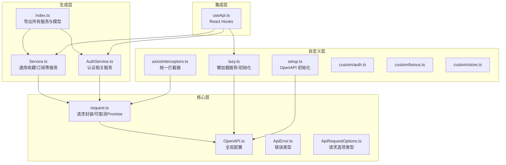
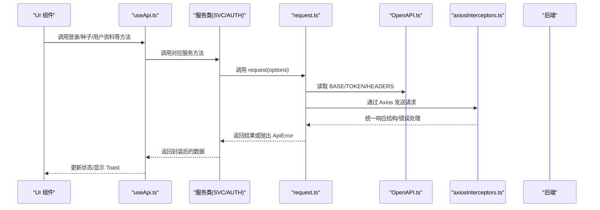
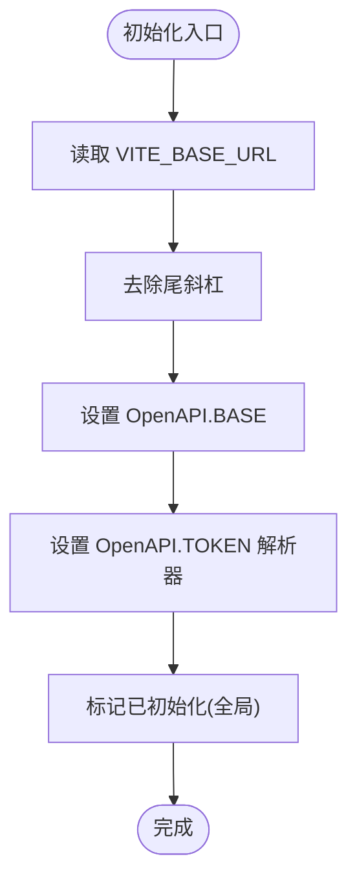
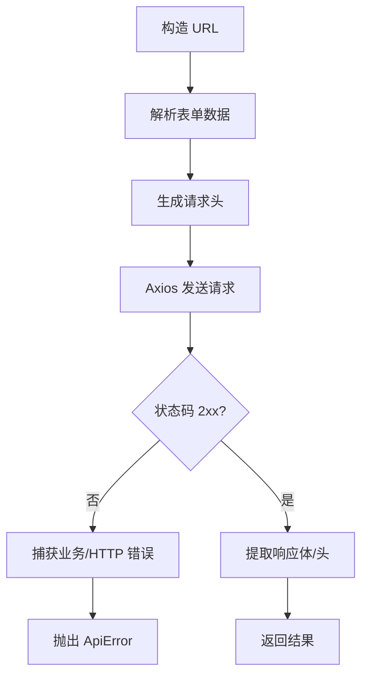
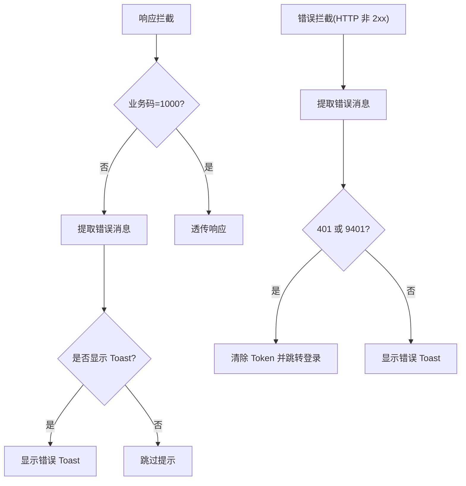
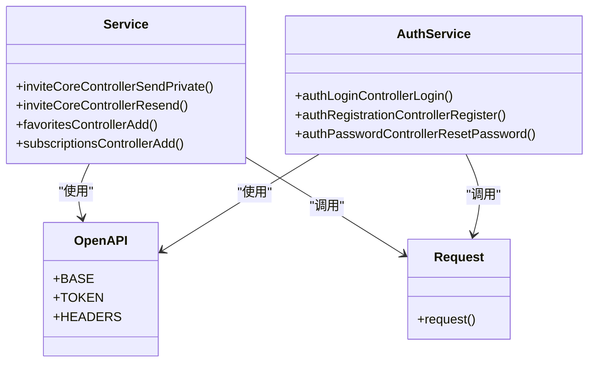
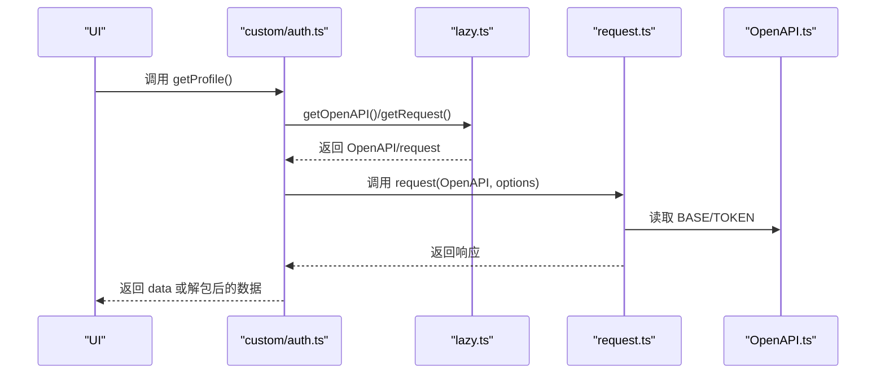
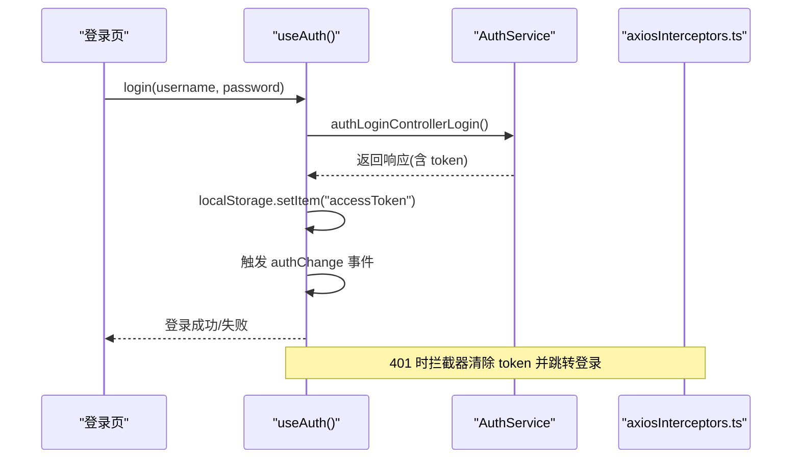
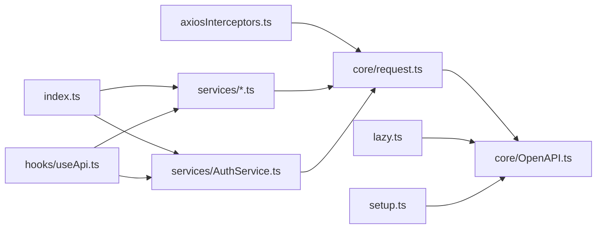

# API 客户端架构

<cite>
**本文档引用的文件**
- [src/api/index.ts](file://src/api/index.ts)
- [src/api/setup.ts](file://src/api/setup.ts)
- [src/api/axiosInterceptors.ts](file://src/api/axiosInterceptors.ts)
- [src/api/core/OpenAPI.ts](file://src/api/core/OpenAPI.ts)
- [src/api/core/request.ts](file://src/api/core/request.ts)
- [src/api/core/ApiError.ts](file://src/api/core/ApiError.ts)
- [src/api/core/ApiRequestOptions.ts](file://src/api/core/ApiRequestOptions.ts)
- [src/api/custom/auth.ts](file://src/api/custom/auth.ts)
- [src/api/custom/bonus.ts](file://src/api/custom/bonus.ts)
- [src/api/custom/store.ts](file://src/api/custom/store.ts)
- [src/api/lazy.ts](file://src/api/lazy.ts)
- [src/api/services/Service.ts](file://src/api/services/Service.ts)
- [src/api/services/AuthService.ts](file://src/api/services/AuthService.ts)
- [src/hooks/useApi.ts](file://src/hooks/useApi.ts)
</cite>

## 目录
1. [简介](#简介)
2. [项目结构](#项目结构)
3. [核心组件](#核心组件)
4. [架构总览](#架构总览)
5. [详细组件分析](#详细组件分析)
6. [依赖关系分析](#依赖关系分析)
7. [性能考虑](#性能考虑)
8. [故障排查指南](#故障排查指南)
9. [结论](#结论)
10. [附录](#附录)

## 简介
本文件面向 API 客户端架构，围绕基于 OpenAPI 的 SDK 生成配置、客户端初始化、请求拦截器、服务层设计模式、API 调用封装策略与错误处理机制进行系统化技术文档整理。文档同时涵盖各服务模块的功能职责、接口定义与使用方法，并提供配置选项、性能优化策略、调试技巧以及使用示例与最佳实践。

## 项目结构
API 客户端位于 src/api 目录，采用“OpenAPI 生成 + 自定义封装 + 拦截器 + Hook 集成”的分层架构：
- 生成层：OpenAPI SDK 由 openapi-typescript-codegen 生成，导出类型与服务类
- 核心层：OpenAPI 配置、请求封装、可取消 Promise、错误类型
- 自定义层：轻量封装与业务适配（如认证、魔力值、积分商城）
- 拦截器层：统一响应结构、错误提示与鉴权处理
- 集成层：React Hooks 与懒加载服务，桥接 UI 与 API

**图表来源**
- [src/api/index.ts](file://src/api/index.ts#L1-L642)
- [src/api/services/Service.ts](file://src/api/services/Service.ts#L1-L734)
- [src/api/services/AuthService.ts](file://src/api/services/AuthService.ts#L1-L308)
- [src/api/core/OpenAPI.ts](file://src/api/core/OpenAPI.ts#L1-L33)
- [src/api/core/request.ts](file://src/api/core/request.ts#L1-L324)
- [src/api/core/ApiError.ts](file://src/api/core/ApiError.ts#L1-L26)
- [src/api/core/ApiRequestOptions.ts](file://src/api/core/ApiRequestOptions.ts#L1-L18)
- [src/api/lazy.ts](file://src/api/lazy.ts#L1-L75)
- [src/api/setup.ts](file://src/api/setup.ts#L1-L35)
- [src/api/axiosInterceptors.ts](file://src/api/axiosInterceptors.ts#L1-L294)
- [src/api/custom/auth.ts](file://src/api/custom/auth.ts#L1-L14)
- [src/api/custom/bonus.ts](file://src/api/custom/bonus.ts#L1-L90)
- [src/api/custom/store.ts](file://src/api/custom/store.ts#L1-L145)
- [src/hooks/useApi.ts](file://src/hooks/useApi.ts#L1-L312)

**章节来源**
- [src/api/index.ts](file://src/api/index.ts#L1-L642)
- [src/api/setup.ts](file://src/api/setup.ts#L1-L35)
- [src/api/axiosInterceptors.ts](file://src/api/axiosInterceptors.ts#L1-L294)
- [src/api/core/OpenAPI.ts](file://src/api/core/OpenAPI.ts#L1-L33)
- [src/api/core/request.ts](file://src/api/core/request.ts#L1-L324)
- [src/api/lazy.ts](file://src/api/lazy.ts#L1-L75)
- [src/api/services/Service.ts](file://src/api/services/Service.ts#L1-L734)
- [src/api/services/AuthService.ts](file://src/api/services/AuthService.ts#L1-L308)
- [src/api/custom/auth.ts](file://src/api/custom/auth.ts#L1-L14)
- [src/api/custom/bonus.ts](file://src/api/custom/bonus.ts#L1-L90)
- [src/api/custom/store.ts](file://src/api/custom/store.ts#L1-L145)
- [src/hooks/useApi.ts](file://src/hooks/useApi.ts#L1-L312)

## 核心组件
- OpenAPI 全局配置：统一设置 Base URL、Token 解析器、凭据策略与头部
- 请求封装：URL 构造、表单数据处理、请求头生成、Axios 发送、响应体/头提取、错误码捕获
- 可取消 Promise：支持取消与错误回调，便于 UI 中断长任务
- 统一拦截器：标准化响应结构、业务错误映射、401 自动登出、Toast 提示控制
- 服务层：按功能域划分的服务类，封装具体接口调用
- 自定义封装：对生成服务的轻量包装，处理响应解包与业务字段
- 懒加载与初始化：避免打包警告，集中初始化 OpenAPI 配置
- React Hooks：将服务与 UI 集成，提供认证、种子、用户资料等常用能力

**章节来源**
- [src/api/core/OpenAPI.ts](file://src/api/core/OpenAPI.ts#L10-L32)
- [src/api/core/request.ts](file://src/api/core/request.ts#L92-L323)
- [src/api/core/ApiError.ts](file://src/api/core/ApiError.ts#L8-L25)
- [src/api/axiosInterceptors.ts](file://src/api/axiosInterceptors.ts#L10-L294)
- [src/api/services/Service.ts](file://src/api/services/Service.ts#L41-L734)
- [src/api/services/AuthService.ts](file://src/api/services/AuthService.ts#L23-L308)
- [src/api/custom/auth.ts](file://src/api/custom/auth.ts#L3-L13)
- [src/api/lazy.ts](file://src/api/lazy.ts#L11-L74)
- [src/hooks/useApi.ts](file://src/hooks/useApi.ts#L11-L312)

## 架构总览
下面的序列图展示了从 UI 调用到后端请求的整体流程，包括拦截器与错误处理：

**图表来源**
- [src/hooks/useApi.ts](file://src/hooks/useApi.ts#L19-L141)
- [src/api/services/AuthService.ts](file://src/api/services/AuthService.ts#L31-L53)
- [src/api/services/Service.ts](file://src/api/services/Service.ts#L48-L70)
- [src/api/core/request.ts](file://src/api/core/request.ts#L294-L323)
- [src/api/core/OpenAPI.ts](file://src/api/core/OpenAPI.ts#L22-L32)
- [src/api/axiosInterceptors.ts](file://src/api/axiosInterceptors.ts#L204-L291)

## 详细组件分析

### OpenAPI 配置与初始化
- 全局配置项：BASE、VERSION、WITH_CREDENTIALS、CREDENTIALS、TOKEN、USERNAME、PASSWORD、HEADERS、ENCODE_PATH
- 初始化策略：集中读取 Vite 环境变量 VITE_BASE_URL，规范化去除尾斜杠；统一从 localStorage 读取 accessToken 作为 TOKEN 解析器
- 懒加载初始化：避免重复初始化与 HMR 影响，浏览器环境仅初始化一次

**图表来源**
- [src/api/setup.ts](file://src/api/setup.ts#L18-L34)
- [src/api/core/OpenAPI.ts](file://src/api/core/OpenAPI.ts#L22-L32)

**章节来源**
- [src/api/setup.ts](file://src/api/setup.ts#L12-L34)
- [src/api/core/OpenAPI.ts](file://src/api/core/OpenAPI.ts#L10-L32)

### 请求封装与可取消 Promise
- URL 构造：替换版本占位符与路径参数，拼接查询字符串
- 表单数据：支持 Blob/字符串/JSON，自动设置 Content-Type
- 请求头：合并附加头部、请求头与表单头部；自动注入 Authorization
- 发送请求：Axios 实例发送，支持 withCredentials 与 XSRF
- 响应处理：提取响应体/头，判定 2xx 成功，捕获 HTTP 与业务错误
- 可取消：CancelToken 与 onCancel 回调，便于 UI 中断

**图表来源**
- [src/api/core/request.ts](file://src/api/core/request.ts#L92-L323)
- [src/api/core/ApiError.ts](file://src/api/core/ApiError.ts#L8-L25)

**章节来源**
- [src/api/core/request.ts](file://src/api/core/request.ts#L92-L323)
- [src/api/core/ApiError.ts](file://src/api/core/ApiError.ts#L8-L25)

### 统一拦截器与错误处理
- 统一响应结构：code、message、data、path、timestamp
- 业务错误映射：SUCCESS_CODE 与业务错误码映射表
- 错误消息提取：优先后端 message，其次 meta.customErrorMessage，再次默认文案，最后网络错误
- 401 处理：清除本地 token、触发 authChange 事件、跳转登录页
- Toast 控制：silent、skipErrorCodes、skipBusinessCodes、customErrorMessage
- 仅安装一次：防止重复注册

**图表来源**
- [src/api/axiosInterceptors.ts](file://src/api/axiosInterceptors.ts#L204-L291)

**章节来源**
- [src/api/axiosInterceptors.ts](file://src/api/axiosInterceptors.ts#L10-L294)

### 服务层设计模式与模块职责
- 通用服务：收藏/订阅/邀请等跨模块功能，集中在 Service.ts
- 认证服务：登录、注册、验证码、密码重置、修改密码等，集中在 AuthService.ts
- 模块化组织：每个服务类对应一组相关接口，便于按需引入与测试

**图表来源**
- [src/api/services/Service.ts](file://src/api/services/Service.ts#L41-L734)
- [src/api/services/AuthService.ts](file://src/api/services/AuthService.ts#L23-L308)
- [src/api/core/OpenAPI.ts](file://src/api/core/OpenAPI.ts#L22-L32)
- [src/api/core/request.ts](file://src/api/core/request.ts#L294-L323)

**章节来源**
- [src/api/services/Service.ts](file://src/api/services/Service.ts#L41-L734)
- [src/api/services/AuthService.ts](file://src/api/services/AuthService.ts#L23-L308)

### 自定义封装与业务适配
- 轻量封装：对生成服务进行二次封装，处理响应解包、类型定义与幂等键
- 示例：
  - 认证：获取用户资料，统一封装请求参数与响应结构
  - 魔力值：余额、总览、账本流水等接口封装
  - 积分商城：商品列表、购买、订单详情与列表等封装

**图表来源**
- [src/api/custom/auth.ts](file://src/api/custom/auth.ts#L3-L13)
- [src/api/lazy.ts](file://src/api/lazy.ts#L11-L29)
- [src/api/core/request.ts](file://src/api/core/request.ts#L294-L323)
- [src/api/core/OpenAPI.ts](file://src/api/core/OpenAPI.ts#L22-L32)

**章节来源**
- [src/api/custom/auth.ts](file://src/api/custom/auth.ts#L3-L13)
- [src/api/custom/bonus.ts](file://src/api/custom/bonus.ts#L18-L89)
- [src/api/custom/store.ts](file://src/api/custom/store.ts#L59-L144)
- [src/api/lazy.ts](file://src/api/lazy.ts#L11-L74)

### React Hooks 集成与使用示例
- 认证 Hook：登录、注册、发送验证码、登出，自动维护 accessToken 与路由配置失效
- 种子 Hook：获取种子列表与详情，参数映射与错误处理
- 用户资料 Hook：更新资料、设置头像、上传头像（含格式与大小校验）

**图表来源**
- [src/hooks/useApi.ts](file://src/hooks/useApi.ts#L19-L65)
- [src/api/services/AuthService.ts](file://src/api/services/AuthService.ts#L31-L53)
- [src/api/axiosInterceptors.ts](file://src/api/axiosInterceptors.ts#L166-L192)

**章节来源**
- [src/hooks/useApi.ts](file://src/hooks/useApi.ts#L11-L141)
- [src/hooks/useApi.ts](file://src/hooks/useApi.ts#L144-L201)
- [src/hooks/useApi.ts](file://src/hooks/useApi.ts#L203-L311)

## 依赖关系分析
- 低耦合高内聚：服务类与请求封装分离，拦截器独立于业务逻辑
- 动态/静态混合：懒加载服务避免打包警告，OpenAPI 初始化集中处理
- 类型安全：OpenAPI 生成的类型与自定义封装类型协同，保证调用侧类型正确性

**图表来源**
- [src/api/axiosInterceptors.ts](file://src/api/axiosInterceptors.ts#L1-L294)
- [src/api/core/request.ts](file://src/api/core/request.ts#L1-L324)
- [src/api/core/OpenAPI.ts](file://src/api/core/OpenAPI.ts#L1-L33)
- [src/api/services/Service.ts](file://src/api/services/Service.ts#L1-L734)
- [src/api/services/AuthService.ts](file://src/api/services/AuthService.ts#L1-L308)
- [src/api/index.ts](file://src/api/index.ts#L1-L642)
- [src/api/lazy.ts](file://src/api/lazy.ts#L1-L75)
- [src/api/setup.ts](file://src/api/setup.ts#L1-L35)
- [src/hooks/useApi.ts](file://src/hooks/useApi.ts#L1-L312)

**章节来源**
- [src/api/index.ts](file://src/api/index.ts#L1-L642)
- [src/api/core/request.ts](file://src/api/core/request.ts#L1-L324)
- [src/api/axiosInterceptors.ts](file://src/api/axiosInterceptors.ts#L1-L294)
- [src/api/lazy.ts](file://src/api/lazy.ts#L1-L75)
- [src/api/setup.ts](file://src/api/setup.ts#L1-L35)
- [src/hooks/useApi.ts](file://src/hooks/useApi.ts#L1-L312)

## 性能考虑
- 请求取消：利用 CancelablePromise，在组件卸载或切换时及时取消未必要的请求，减少资源浪费
- 懒加载服务：避免一次性加载大量服务模块，降低首屏体积与构建警告
- 统一初始化：OpenAPI 初始化仅执行一次，避免重复配置带来的额外开销
- 拦截器复用：统一错误处理与提示，减少重复逻辑与分支判断
- 仅在必要时刷新：通过 React Query 的 invalidateQueries 精准刷新，避免全量刷新

[本节为通用指导，无需特定文件引用]

## 故障排查指南
- 401 未授权
  - 现象：自动清除本地 token、触发 authChange、跳转登录页
  - 排查：确认 localStorage 中 accessToken 是否存在；检查拦截器是否正确设置 TOKEN 解析器
- 业务错误
  - 现象：Toast 提示业务错误码对应文案；响应 status 被修改为业务码以便上层识别
  - 排查：查看响应 data.code 与 message；结合 meta.skipBusinessCodes/skipErrorCodes 控制提示
- 网络错误
  - 现象：根据错误码映射显示网络/超时/连接失败等提示
  - 排查：检查网络连通性、代理与 CORS 配置
- 构建警告
  - 现象：动态导入导致的分包警告
  - 解决：使用懒加载服务与静态导入 request，避免与全局静态引用混用

**章节来源**
- [src/api/axiosInterceptors.ts](file://src/api/axiosInterceptors.ts#L166-L192)
- [src/api/axiosInterceptors.ts](file://src/api/axiosInterceptors.ts#L210-L249)
- [src/api/axiosInterceptors.ts](file://src/api/axiosInterceptors.ts#L254-L291)
- [src/api/lazy.ts](file://src/api/lazy.ts#L26-L29)

## 结论
本架构以 OpenAPI 生成为核心，结合统一的请求封装、拦截器与服务层模块化设计，实现了类型安全、可维护与可扩展的 API 客户端。通过懒加载与集中初始化，兼顾了性能与开发体验；通过拦截器与 Hook 的配合，提供了完善的错误处理与用户体验保障。建议在实际使用中遵循本文档的最佳实践，确保一致性与稳定性。

[本节为总结，无需特定文件引用]

## 附录

### 配置选项与环境变量
- VITE_BASE_URL：后端基础地址，初始化时去除尾斜杠
- TOKEN 解析器：从 localStorage 读取 accessToken，用于请求头注入
- WITH_CREDENTIALS/CREDENTIALS：跨域凭据策略
- HEADERS：附加请求头（如 Idempotency-Key）

**章节来源**
- [src/api/setup.ts](file://src/api/setup.ts#L24-L32)
- [src/api/core/OpenAPI.ts](file://src/api/core/OpenAPI.ts#L10-L20)

### API 使用示例与最佳实践
- 登录流程
  - 使用 useAuth().login(username, password)
  - 自动存储 token、触发 authChange、刷新路由配置
- 获取种子列表
  - 使用 useTorrents().fetchTorrents(category, page, limit)
  - 参数映射与错误处理已在 Hook 内部封装
- 用户资料
  - 更新资料：useUserProfile().updateProfile(payload)
  - 上传头像：先校验格式与大小，再调用上传与设置头像
- 自定义请求
  - 使用 custom/* 封装或直接调用 lazy.ts 获取 OpenAPI/request 后发起请求
  - 对于幂等操作，建议设置 Idempotency-Key 头

**章节来源**
- [src/hooks/useApi.ts](file://src/hooks/useApi.ts#L19-L65)
- [src/hooks/useApi.ts](file://src/hooks/useApi.ts#L149-L174)
- [src/hooks/useApi.ts](file://src/hooks/useApi.ts#L216-L234)
- [src/hooks/useApi.ts](file://src/hooks/useApi.ts#L258-L302)
- [src/api/custom/auth.ts](file://src/api/custom/auth.ts#L3-L13)
- [src/api/custom/store.ts](file://src/api/custom/store.ts#L77-L88)
- [src/api/lazy.ts](file://src/api/lazy.ts#L11-L29)