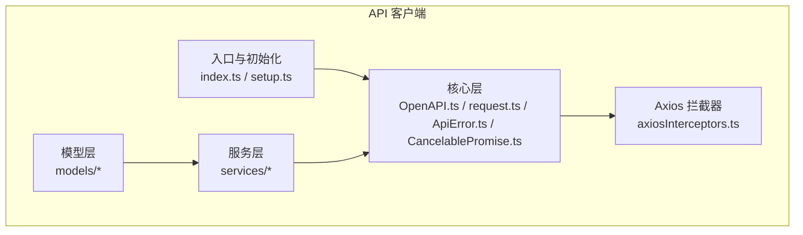
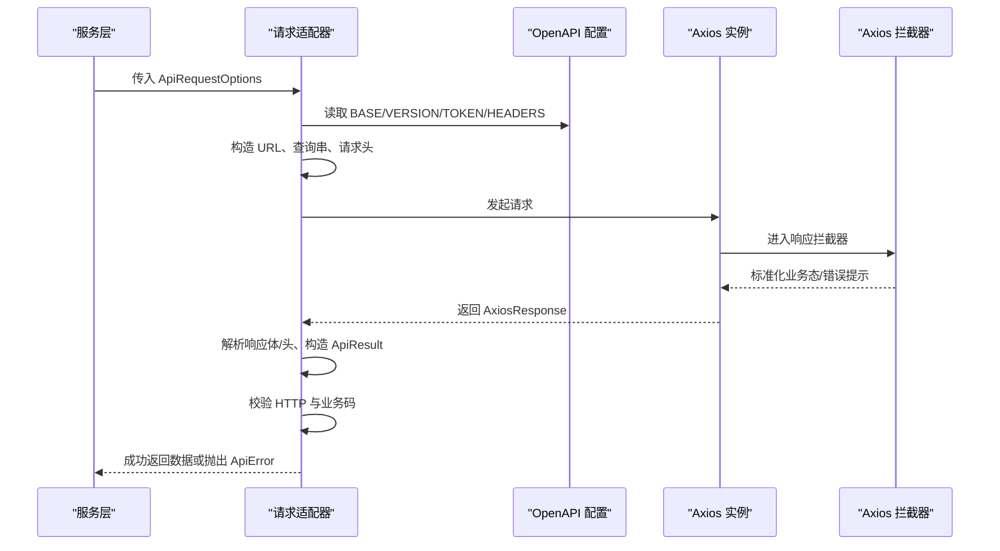
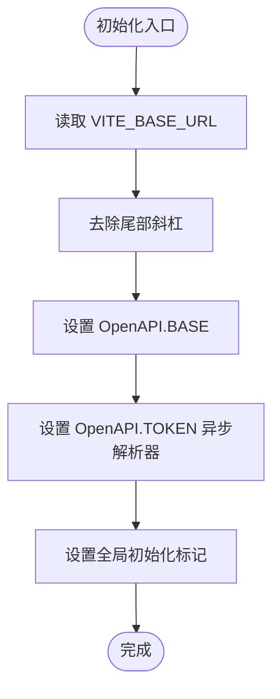
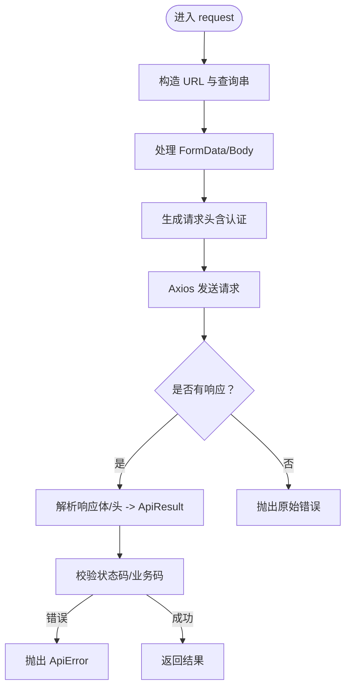
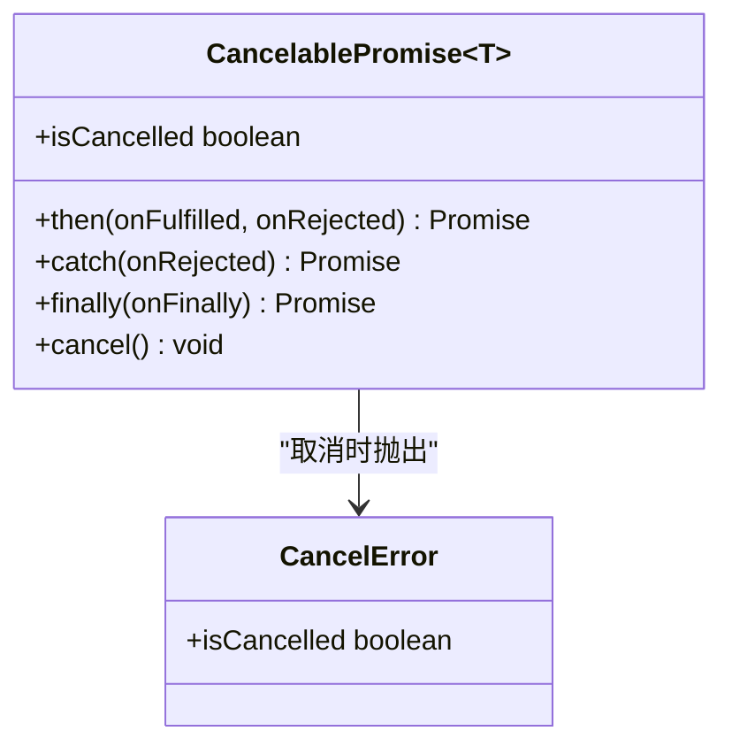
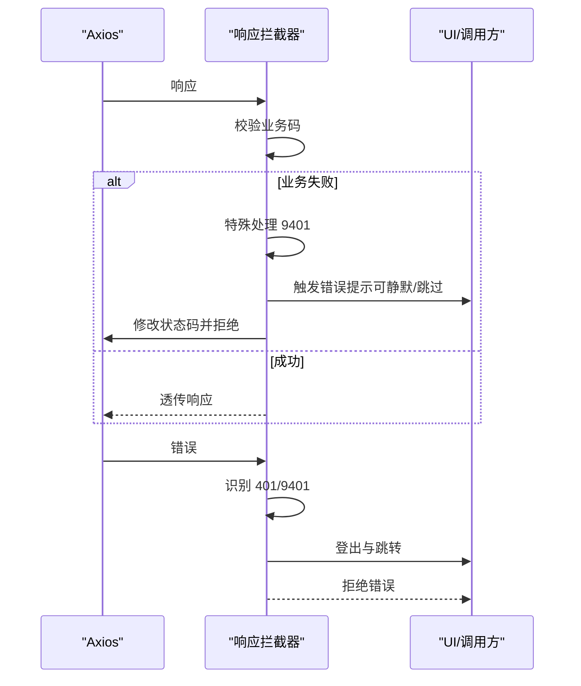
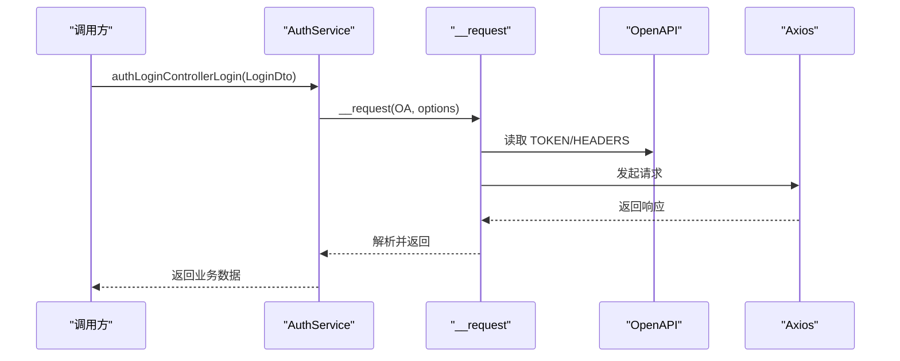
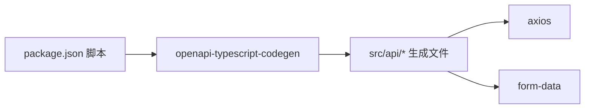

# OpenAPI 集成配置

<cite>
**本文档引用的文件**
- [OpenAPI.ts](file://src/api/core/OpenAPI.ts)
- [request.ts](file://src/api/core/request.ts)
- [ApiError.ts](file://src/api/core/ApiError.ts)
- [ApiRequestOptions.ts](file://src/api/core/ApiRequestOptions.ts)
- [ApiResult.ts](file://src/api/core/ApiResult.ts)
- [CancelablePromise.ts](file://src/api/core/CancelablePromise.ts)
- [setup.ts](file://src/api/setup.ts)
- [axiosInterceptors.ts](file://src/api/axiosInterceptors.ts)
- [AuthService.ts](file://src/api/services/AuthService.ts)
- [index.ts](file://src/api/index.ts)
- [.env.development](file://.env.development)
- [.env.production](file://.env.production)
- [package.json](file://package.json)
</cite>

## 目录
1. [简介](#简介)
2. [项目结构](#项目结构)
3. [核心组件](#核心组件)
4. [架构总览](#架构总览)
5. [详细组件分析](#详细组件分析)
6. [依赖关系分析](#依赖关系分析)
7. [性能考虑](#性能考虑)
8. [故障排查指南](#故障排查指南)
9. [结论](#结论)
10. [附录](#附录)

## 简介
本文件面向 OpenAPI 集成配置，围绕基于 openapi-typescript-codegen 生成的 API 客户端进行系统性技术说明。内容涵盖 SDK 生成配置、OpenAPI 配置参数、客户端初始化流程、请求拦截器工作机制、认证与错误处理策略，并提供开发与生产环境的最佳实践配置方案。

## 项目结构
OpenAPI 客户端位于 src/api 目录，采用“核心层 + 服务层 + 模型层”的分层组织：
- 核心层（core）：OpenAPI 配置、请求封装、取消能力、错误模型等
- 服务层（services）：按业务域划分的服务类，调用核心层发起请求
- 模型层（models）：接口契约 DTO
- 入口与初始化（index.ts、setup.ts）：导出 SDK 并集中初始化运行时配置
- Axios 拦截器（axiosInterceptors.ts）：统一处理响应与错误，补充业务态语义

**图表来源**
- [OpenAPI.ts](file://src/api/core/OpenAPI.ts#L1-L33)
- [request.ts](file://src/api/core/request.ts#L1-L324)
- [index.ts](file://src/api/index.ts#L1-L642)
- [setup.ts](file://src/api/setup.ts#L1-L35)
- [axiosInterceptors.ts](file://src/api/axiosInterceptors.ts#L1-L294)

**章节来源**
- [index.ts](file://src/api/index.ts#L1-L642)
- [setup.ts](file://src/api/setup.ts#L1-L35)

## 核心组件
- OpenAPI 配置对象：定义 BASE、VERSION、认证凭据、请求头、路径编码等
- 请求适配器：封装 URL 构造、查询串拼接、请求体与表单数据处理、请求头生成、Axios 发送与响应解析
- 取消能力：CancelablePromise 支持请求取消与取消回调链
- 错误模型：ApiError 提供统一错误包装，便于上层捕获与展示
- 初始化器：initOpenAPI 负责读取环境变量、规范化 BASE、注入 TOKEN 解析器

**章节来源**
- [OpenAPI.ts](file://src/api/core/OpenAPI.ts#L10-L32)
- [request.ts](file://src/api/core/request.ts#L92-L324)
- [ApiError.ts](file://src/api/core/ApiError.ts#L8-L25)
- [CancelablePromise.ts](file://src/api/core/CancelablePromise.ts#L25-L132)
- [setup.ts](file://src/api/setup.ts#L18-L34)

## 架构总览
OpenAPI 客户端工作流分为三层：
- 配置层：OpenAPI 运行时配置（BASE、TOKEN、HEADERS 等）
- 请求层：根据 ApiRequestOptions 生成最终请求，交由 request 方法执行
- 服务层：各业务服务类以静态方法形式调用 request，形成清晰的 API 接口

**图表来源**
- [request.ts](file://src/api/core/request.ts#L294-L324)
- [axiosInterceptors.ts](file://src/api/axiosInterceptors.ts#L204-L291)
- [OpenAPI.ts](file://src/api/core/OpenAPI.ts#L22-L32)

## 详细组件分析

### OpenAPI 配置类与初始化
- 配置项
  - BASE：后端基础地址，用于拼接最终 URL
  - VERSION：API 版本占位符替换
  - WITH_CREDENTIALS / CREDENTIALS：跨域凭证策略
  - TOKEN / USERNAME / PASSWORD：认证凭据来源（支持字符串或异步解析器）
  - HEADERS：附加请求头（支持对象或异步解析器）
  - ENCODE_PATH：自定义路径编码函数
- 初始化流程
  - 读取 import.meta.env.VITE_BASE_URL，去除尾部斜杠
  - 设置 OpenAPI.BASE
  - 设置 TOKEN 为异步解析器：从 localStorage 读取 accessToken
  - 通过全局标记确保仅初始化一次

**图表来源**
- [setup.ts](file://src/api/setup.ts#L18-L34)
- [OpenAPI.ts](file://src/api/core/OpenAPI.ts#L22-L32)

**章节来源**
- [OpenAPI.ts](file://src/api/core/OpenAPI.ts#L10-L32)
- [setup.ts](file://src/api/setup.ts#L18-L34)

### 请求适配器与错误处理
- URL 与查询串
  - 替换版本占位符与路径参数
  - 按需拼接查询串
- 请求头生成
  - 合并额外头部与请求头
  - 若提供 TOKEN，则自动注入 Authorization: Bearer
  - 若提供 USERNAME/PASSWORD，则注入 Authorization: Basic
  - 根据 body 类型推断 Content-Type
- Axios 发送与响应解析
  - withCredentials 与 withXSRFToken 依据配置联动
  - 捕获 AxiosError，若存在 response 则返回 response；否则抛出原错误
  - 解析响应体/头，构造 ApiResult
- 错误码处理
  - 内置常见 HTTP 错误映射
  - 合并请求选项中的自定义错误映射
  - 非 2xx 或业务错误均抛出 ApiError

**图表来源**
- [request.ts](file://src/api/core/request.ts#L92-L324)
- [ApiError.ts](file://src/api/core/ApiError.ts#L8-L25)

**章节来源**
- [request.ts](file://src/api/core/request.ts#L92-L324)
- [ApiError.ts](file://src/api/core/ApiError.ts#L8-L25)

### 取消能力与并发控制
- CancelablePromise 提供 then/catch/finally 与 cancel 接口
- 取消时触发所有注册的取消回调，最终以 CancelError 结束
- 适用于长列表加载、搜索防抖等场景，避免竞态与内存泄漏

**图表来源**
- [CancelablePromise.ts](file://src/api/core/CancelablePromise.ts#L25-L132)

**章节来源**
- [CancelablePromise.ts](file://src/api/core/CancelablePromise.ts#L25-L132)

### Axios 拦截器与业务错误标准化
- 统一响应结构：code/message/data/path/timestamp
- 业务错误码映射：将后端业务码转换为用户可读提示
- 401/9401 自动登出与重定向
- 支持 meta.silent、meta.skipErrorCodes、meta.skipBusinessCodes 控制提示行为
- 对业务错误修改响应状态码，使 generated client 正确识别为失败

**图表来源**
- [axiosInterceptors.ts](file://src/api/axiosInterceptors.ts#L204-L291)

**章节来源**
- [axiosInterceptors.ts](file://src/api/axiosInterceptors.ts#L1-L294)

### 服务层调用示例（认证）
AuthService 以静态方法封装具体端点，例如登录、注册、获取当前用户信息等。这些方法内部通过 __request 调用核心层，自动携带 OpenAPI 配置与拦截器增强的能力。

**图表来源**
- [AuthService.ts](file://src/api/services/AuthService.ts#L31-L53)
- [request.ts](file://src/api/core/request.ts#L294-L324)
- [OpenAPI.ts](file://src/api/core/OpenAPI.ts#L22-L32)

**章节来源**
- [AuthService.ts](file://src/api/services/AuthService.ts#L23-L84)

## 依赖关系分析
- 生成工具：openapi-typescript-codegen
- 运行时依赖：axios、form-data
- 构建脚本：通过 api:generate 脚本拉取后端 OpenAPI 文档并生成 SDK

**图表来源**
- [package.json](file://package.json#L130-L130)
- [request.ts](file://src/api/core/request.ts#L5-L14)

**章节来源**
- [package.json](file://package.json#L130-L130)

## 性能考虑
- 请求取消：在组件卸载或路由切换时调用 cancel()，避免无效渲染与内存泄漏
- 头部合并：尽量在 OpenAPI.HEADERS 中集中配置，减少重复计算
- 编码策略：ENCODE_PATH 可自定义路径编码，避免特殊字符导致的二次编码问题
- 业务错误快速失败：Axios 拦截器提前拒绝业务错误，缩短 Promise 链耗时

[本节为通用指导，无需特定文件引用]

## 故障排查指南
- 401/9401 未授权
  - 现象：自动清除本地 token 并跳转登录页
  - 排查：确认 TOKEN 解析器是否返回空值；检查后端签发与刷新逻辑
- 业务错误未提示
  - 现象：业务码非 1000 时不显示 toast
  - 排查：检查 meta.skipBusinessCodes 与 meta.silent；确认拦截器是否安装
- 跨域与 Cookie
  - 现象：登录成功但请求缺失会话
  - 排查：确认 WITH_CREDENTIALS 与 CREDENTIALS 配置；核对 BASE 与后端域名
- 路径拼接异常
  - 现象：出现重复斜杠或 404
  - 排查：确认 BASE 已去除尾部斜杠；检查 ENCODE_PATH 是否正确

**章节来源**
- [axiosInterceptors.ts](file://src/api/axiosInterceptors.ts#L166-L192)
- [setup.ts](file://src/api/setup.ts#L24-L34)
- [request.ts](file://src/api/core/request.ts#L212-L233)

## 结论
本项目通过 openapi-typescript-codegen 生成强类型的 API 客户端，并结合自研核心层与 Axios 拦截器，实现了统一的配置、认证、错误处理与取消能力。初始化器集中管理 BASE 与 TOKEN，服务层以静态方法封装端点，既保证了类型安全，也提升了可维护性。建议在开发与生产环境中遵循本文提供的最佳实践，确保稳定与一致的用户体验。

[本节为总结，无需特定文件引用]

## 附录

### 环境变量与部署建议
- 开发环境
  - VITE_BASE_URL：指向后端 API 基础地址（建议以 /api 形式）
  - 可选：DOWNLOADER_SECRET 等业务密钥
- 生产环境
  - VITE_BASE_URL：指向反向代理或 CDN 后的 API 域名
  - 确保与后端 CORS、Cookie 安全策略一致
- 初始化时机
  - 在应用入口或布局模块顶部调用 initOpenAPI，确保在任何服务调用前完成

**章节来源**
- [.env.development](file://.env.development#L1-L5)
- [.env.production](file://.env.production#L1-L5)
- [setup.ts](file://src/api/setup.ts#L18-L34)

### 最佳实践清单
- 配置
  - 在 initOpenAPI 中集中设置 BASE 与 TOKEN 解析器
  - 如需全局默认头，在 OpenAPI.HEADERS 中统一配置
- 认证
  - 使用 TOKEN 异步解析器从安全存储读取令牌
  - 避免在组件内硬编码敏感信息
- 错误处理
  - 业务错误统一由拦截器处理，服务层专注业务逻辑
  - 对于可预期的错误，使用 meta.skipErrorCodes/skipBusinessCodes 控制提示
- 取消与并发
  - 对长列表、搜索等场景使用 CancelablePromise 并在组件卸载时 cancel
- 生成与更新
  - 使用 api:generate 脚本定期同步后端 OpenAPI 文档
  - 更新后检查服务层调用签名与错误映射

[本节为通用指导，无需特定文件引用]