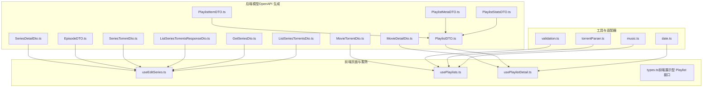
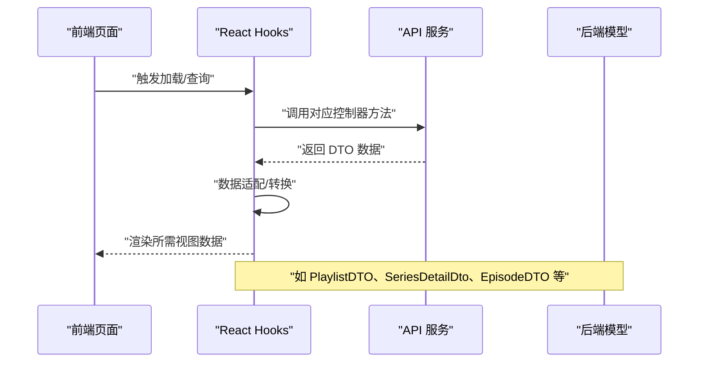
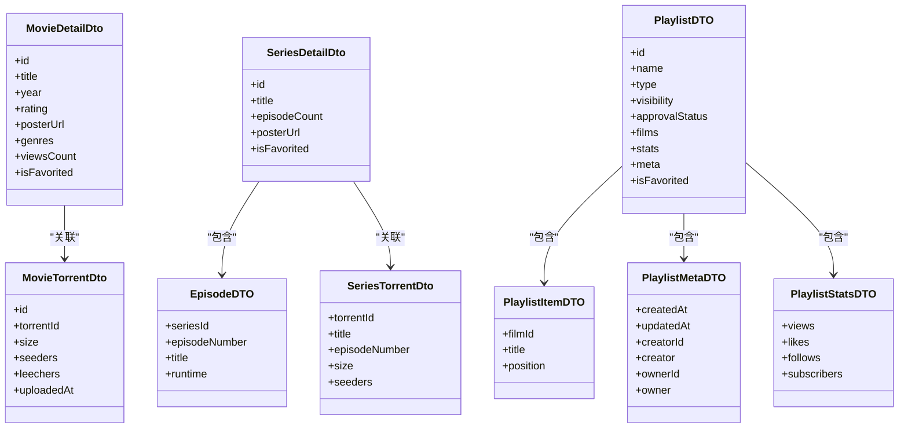
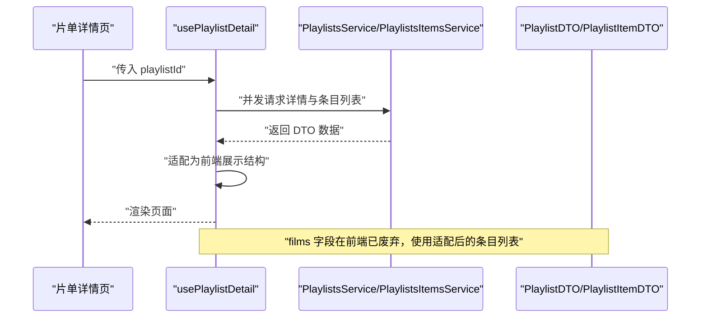
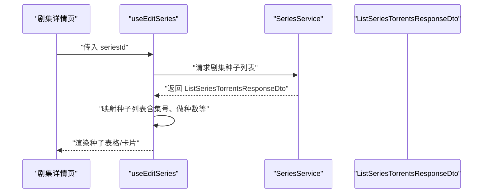
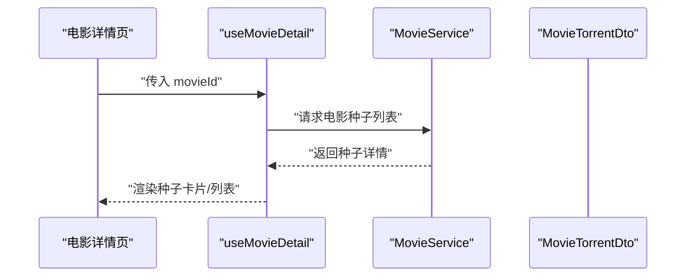
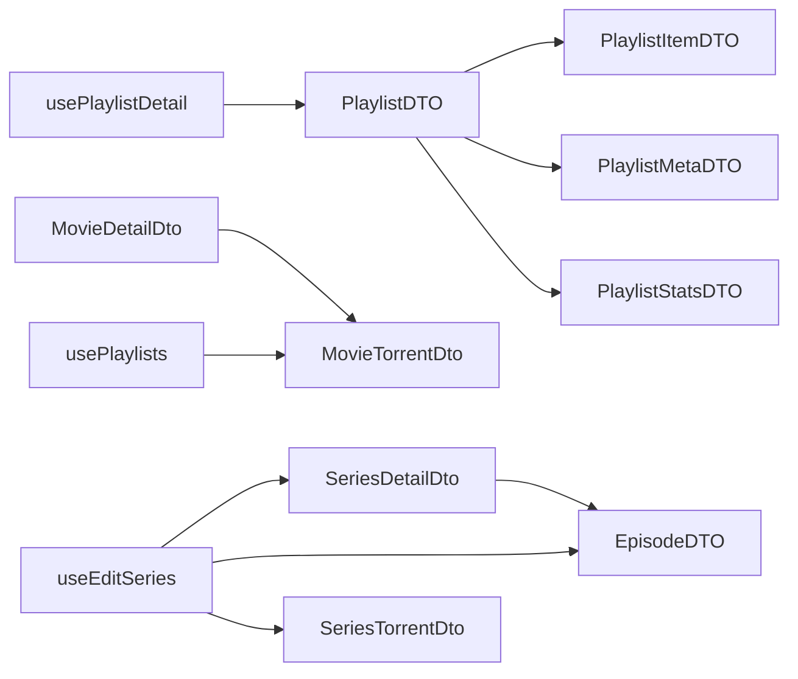

# 业务数据模型

<cite>
**本文引用的文件**
- [Torrent.ts](file://src/api/models/Torrent.ts)
- [MovieDetailDto.ts](file://src/api/models/MovieDetailDto.ts)
- [PlaylistDTO.ts](file://src/api/models/PlaylistDTO.ts)
- [SeriesDetailDto.ts](file://src/api/models/SeriesDetailDto.ts)
- [EpisodeDTO.ts](file://src/api/models/EpisodeDTO.ts)
- [PlaylistItemDTO.ts](file://src/api/models/PlaylistItemDTO.ts)
- [PlaylistMetaDTO.ts](file://src/api/models/PlaylistMetaDTO.ts)
- [PlaylistStatsDTO.ts](file://src/api/models/PlaylistStatsDTO.ts)
- [MovieTorrentDto.ts](file://src/api/models/MovieTorrentDto.ts)
- [SeriesTorrentDto.ts](file://src/api/models/SeriesTorrentDto.ts)
- [ListSeriesTorrentsResponseDto.ts](file://src/api/models/ListSeriesTorrentsResponseDto.ts)
- [GetSeriesDto.ts](file://src/api/models/GetSeriesDto.ts)
- [ListSeriesTorrentsDto.ts](file://src/api/models/ListSeriesTorrentsDto.ts)
- [types.ts（电影编辑页面）](file://src/modules/app/pages/Edit/movies/types.ts)
- [useEditSeries.ts（剧集编辑钩子）](file://src/modules/app/pages/Edit/series/hooks/useEditSeries.ts)
- [usePlaylists.ts（片单列表钩子）](file://src/modules/app/hooks/usePlaylists.ts)
- [usePlaylistDetail.ts（片单详情钩子）](file://src/modules/app/pages/PlaylistDetail/hooks/usePlaylistDetail.ts)
- [types.ts（前端展示型 Playlist 接口）](file://src/modules/app/pages/Playlists/types.ts)
- [music.ts（音乐适配器）](file://src/api/adapters/music.ts)
- [validation.ts（通用校验工具）](file://src/utils/validation.ts)
- [date.ts（日期工具）](file://src/modules/admin/utils/date.ts)
- [torrentParser.ts（种子解析工具）](file://src/modules/app/utils/torrentParser.ts)
</cite>

## 目录
1. [引言](#引言)
2. [项目结构](#项目结构)
3. [核心组件](#核心组件)
4. [架构总览](#架构总览)
5. [详细组件分析](#详细组件分析)
6. [依赖分析](#依赖分析)
7. [性能考虑](#性能考虑)
8. [故障排查指南](#故障排查指南)
9. [结论](#结论)
10. [附录](#附录)

## 引言
本技术文档聚焦于业务数据模型，系统性梳理种子（Torrent）、电影详情（MovieDetailDto）、播放列表（PlaylistDTO）、剧集详情（SeriesDetailDto）、剧集（EpisodeDTO）等核心实体的数据结构、字段定义、数据类型、业务规则与约束，并阐明它们之间的关系与依赖。同时，结合前端使用场景与数据流转过程，给出模型验证、数据转换与序列化处理建议，帮助开发者在前后端协作中高效、一致地传递与消费数据。

## 项目结构
围绕业务数据模型，相关代码主要分布在以下位置：
- 后端 OpenAPI 生成的 TypeScript 类型定义：src/api/models
- 前端页面与服务层：src/modules/app
- 通用工具与适配器：src/utils、src/api/adapters

图表来源
- [MovieDetailDto.ts](file://src/api/models/MovieDetailDto.ts#L5-L35)
- [SeriesDetailDto.ts](file://src/api/models/SeriesDetailDto.ts#L5-L36)
- [EpisodeDTO.ts](file://src/api/models/EpisodeDTO.ts#L5-L42)
- [PlaylistDTO.ts](file://src/api/models/PlaylistDTO.ts#L8-L31)
- [PlaylistItemDTO.ts](file://src/api/models/PlaylistItemDTO.ts#L5-L12)
- [PlaylistMetaDTO.ts](file://src/api/models/PlaylistMetaDTO.ts#L5-L30)
- [PlaylistStatsDTO.ts](file://src/api/models/PlaylistStatsDTO.ts#L5-L22)
- [MovieTorrentDto.ts](file://src/api/models/MovieTorrentDto.ts#L5-L24)
- [SeriesTorrentDto.ts](file://src/api/models/SeriesTorrentDto.ts#L5-L26)
- [ListSeriesTorrentsResponseDto.ts](file://src/api/models/ListSeriesTorrentsResponseDto.ts#L5-L15)
- [GetSeriesDto.ts](file://src/api/models/GetSeriesDto.ts#L5-L10)
- [ListSeriesTorrentsDto.ts](file://src/api/models/ListSeriesTorrentsDto.ts#L5-L18)
- [useEditSeries.ts](file://src/modules/app/pages/Edit/series/hooks/useEditSeries.ts#L285-L323)
- [usePlaylists.ts](file://src/modules/app/hooks/usePlaylists.ts#L15-L38)
- [usePlaylistDetail.ts](file://src/modules/app/pages/PlaylistDetail/hooks/usePlaylistDetail.ts#L26-L61)
- [types.ts（前端展示型 Playlist 接口）](file://src/modules/app/pages/Playlists/types.ts#L1-L16)
- [validation.ts](file://src/utils/validation.ts#L1-L12)
- [date.ts](file://src/modules/admin/utils/date.ts#L1-L25)
- [torrentParser.ts](file://src/modules/app/utils/torrentParser.ts#L1-L44)
- [music.ts](file://src/api/adapters/music.ts#L1-L36)

章节来源
- [MovieDetailDto.ts](file://src/api/models/MovieDetailDto.ts#L1-L37)
- [SeriesDetailDto.ts](file://src/api/models/SeriesDetailDto.ts#L1-L39)
- [EpisodeDTO.ts](file://src/api/models/EpsiodeDTO.ts#L1-L44)
- [PlaylistDTO.ts](file://src/api/models/PlaylistDTO.ts#L1-L56)
- [PlaylistItemDTO.ts](file://src/api/models/PlaylistItemDTO.ts#L1-L14)
- [PlaylistMetaDTO.ts](file://src/api/models/PlaylistMetaDTO.ts#L1-L32)
- [PlaylistStatsDTO.ts](file://src/api/models/PlaylistStatsDTO.ts#L1-L24)
- [MovieTorrentDto.ts](file://src/api/models/MovieTorrentDto.ts#L1-L25)
- [SeriesTorrentDto.ts](file://src/api/models/SeriesTorrentDto.ts#L1-L27)
- [ListSeriesTorrentsResponseDto.ts](file://src/api/models/ListSeriesTorrentsResponseDto.ts#L1-L16)
- [GetSeriesDto.ts](file://src/api/models/GetSeriesDto.ts#L1-L11)
- [ListSeriesTorrentsDto.ts](file://src/api/models/ListSeriesTorrentsDto.ts#L1-L19)

## 核心组件
本节对关键业务实体进行逐项说明，包括字段定义、数据类型、可选性、业务含义与约束。

- 种子（Torrent）
  - 字段概览：由后端模型定义，当前文件为占位类型，具体字段以服务端返回为准。
  - 约束与规则：无显式约束定义；实际字段以接口契约为准。
  - 章节来源
    - [Torrent.ts](file://src/api/models/Torrent.ts#L5-L6)

- 电影详情（MovieDetailDto）
  - 关键字段与类型
    - 标识与基础信息：id（字符串）、title（字符串）、originalTitle（字符串，可选）、year（字符串，可选）
    - 评分与媒体元信息：rating（数值，可选）、posterUrl（字符串，可选）、backdropUrl（字符串，可选）、duration（数值，可选）
    - 分类与标签：genres（字符串数组，可选）、categories（字符串数组，可选）
    - 观看与收藏统计：viewsCount（数值，可选）、collectionsCount（数值，可选）
    - 演职员与简介：director（字符串，可选）、cast（字符串数组，可选）、description（字符串，可选）
    - 豆瓣/IMDb 链接与评分：doubanLink（字符串，可选）、imdbLink（字符串，可选）、doubanRatingAverage（数值，可选）、imdbRatingAverage（数值，可选）
    - 创作者与所有权：creatorId（字符串，可选）、creator（字符串，可选）、ownerId（字符串，可选）、owner（字符串，可选）、createdAt（字符串，可选）、updatedAt（字符串，可选）
    - 收藏态：isFavorited（布尔，可选）
  - 业务规则与约束
    - 可选字段表示数据可能不完整或未设置；调用方应做好空值处理。
    - 时间字段通常为 ISO 字符串格式，前端可按需转换。
  - 章节来源
    - [MovieDetailDto.ts](file://src/api/models/MovieDetailDto.ts#L5-L35)

- 剧集详情（SeriesDetailDto）
  - 关键字段与类型
    - 标识与基础信息：id、title、originalTitle（可选）、year（可选）
    - 剧集统计：episodeCount（数值，可选）、episodeDuration（数值，可选）
    - 评分与媒体元信息：rating（数值，可选）、posterUrl（字符串，可选）、backdropUrl（字符串，可选）
    - 分类与标签：genres（字符串数组，可选）、categories（字符串数组，可选）
    - 观看与收藏统计：viewsCount（数值，可选）、collectionsCount（数值，可选）
    - 演职员与简介：director（字符串，可选）、cast（字符串数组，可选）、description（字符串，可选）
    - 豆瓣/IMDb 链接与评分：doubanLink（字符串，可选）、imdbLink（字符串，可选）、doubanRatingAverage（数值，可选）、imdbRatingAverage（数值，可选）
    - 创作者与所有权：creatorId、creator、ownerId、owner、createdAt、updatedAt（字符串，可选）
    - 收藏态：isFavorited（布尔，可选）
  - 业务规则与约束
    - episodeCount 表示剧集总集数；episodeDuration 表示单集时长（分钟）。
  - 章节来源
    - [SeriesDetailDto.ts](file://src/api/models/SeriesDetailDto.ts#L5-L36)

- 剧集（EpisodeDTO）
  - 关键字段与类型
    - 所属剧集ID：seriesId（字符串）
    - 集号：episodeNumber（数值）
    - 标题与原文标题：title（字符串）、originalTitle（字符串，可选）
    - 简介：overview（字符串，可选）
    - 播出日期：airDate（字符串，可选）
    - 剧照URL：stillUrl（字符串，可选）
    - 评分：voteAverage（数值，可选）
    - 时长（分钟）：runtime（数值，可选）
  - 业务规则与约束
    - episodeNumber 用于标识剧集中顺序；seriesId 与之共同构成剧集内唯一定位。
  - 章节来源
    - [EpisodeDTO.ts](file://src/api/models/EpisodeDTO.ts#L5-L42)

- 播放列表（PlaylistDTO）
  - 关键字段与类型
    - 标识与基础信息：id、name（字符串）、description（字符串，可选）
    - 片单类型：type（枚举，取值 movie、series、adult、music）
    - 可见性：visibility（枚举，取值 public、private）
    - 封面与标签：coverUrl（字符串，可选）、tags（字符串数组，可选）、category（字符串，可选）
    - 审核状态：approvalStatus（枚举，取值 pending、approved、rejected）
    - 内容与统计：films（PlaylistItemDTO 数组）、stats（PlaylistStatsDTO）、meta（PlaylistMetaDTO）
    - 收藏态：isFavorited（布尔，可选）
  - 子模型
    - PlaylistItemDTO：filmId、title、poster（可选）、year（可选）、duration（可选）、position（数值）
    - PlaylistMetaDTO：createdAt、updatedAt、creatorId、creator、ownerId、owner
    - PlaylistStatsDTO：views、likes、follows、subscribers
  - 业务规则与约束
    - type 与 films 的内容类型需保持一致；visibility 控制访问范围；approvalStatus 影响对外可见性。
  - 章节来源
    - [PlaylistDTO.ts](file://src/api/models/PlaylistDTO.ts#L8-L31)
    - [PlaylistItemDTO.ts](file://src/api/models/PlaylistItemDTO.ts#L5-L12)
    - [PlaylistMetaDTO.ts](file://src/api/models/PlaylistMetaDTO.ts#L5-L30)
    - [PlaylistStatsDTO.ts](file://src/api/models/PlaylistStatsDTO.ts#L5-L22)

- 种子关联模型
  - MovieTorrentDto：电影种子详情，包含种子标识、标题、大小、做种/下载人数、上传时间、视频/音频编码、制作组、语言、字幕类型、标签与徽章等。
  - SeriesTorrentDto：剧集种子详情，包含种子ID、标题、集号、大小、做种数等。
  - ListSeriesTorrentsResponseDto：剧集种子列表响应，包含 items（SeriesTorrentDto 数组）与 total（总数）。
  - GetSeriesDto：查询剧集详情的参数 DTO，包含 id。
  - ListSeriesTorrentsDto：查询剧集种子列表的参数 DTO，包含 seriesId、page、limit。
  - 章节来源
    - [MovieTorrentDto.ts](file://src/api/models/MovieTorrentDto.ts#L5-L24)
    - [SeriesTorrentDto.ts](file://src/api/models/SeriesTorrentDto.ts#L5-L26)
    - [ListSeriesTorrentsResponseDto.ts](file://src/api/models/ListSeriesTorrentsResponseDto.ts#L5-L15)
    - [GetSeriesDto.ts](file://src/api/models/GetSeriesDto.ts#L5-L10)
    - [ListSeriesTorrentsDto.ts](file://src/api/models/ListSeriesTorrentsDto.ts#L5-L18)

## 架构总览
下图展示了前端页面与服务层如何消费后端模型，以及数据在各层之间的流转关系。

图表来源
- [usePlaylists.ts](file://src/modules/app/hooks/usePlaylists.ts#L21-L38)
- [usePlaylistDetail.ts](file://src/modules/app/pages/PlaylistDetail/hooks/usePlaylistDetail.ts#L26-L61)
- [useEditSeries.ts](file://src/modules/app/pages/Edit/series/hooks/useEditSeries.ts#L306-L323)
- [PlaylistDTO.ts](file://src/api/models/PlaylistDTO.ts#L8-L31)
- [SeriesDetailDto.ts](file://src/api/models/SeriesDetailDto.ts#L5-L36)
- [EpisodeDTO.ts](file://src/api/models/EpisodeDTO.ts#L5-L42)

## 详细组件分析

### 组件关系与依赖
- MovieDetailDto 与 MovieTorrentDto：电影详情与电影种子详情通过电影维度关联，种子详情常用于“电影详情页”的资源选择与下载入口。
- SeriesDetailDto 与 EpisodeDTO：剧集详情包含剧集基本信息，EpisodeDTO 描述单集信息，二者共同支撑“剧集详情页”与“分集详情页”。
- SeriesDetailDto 与 SeriesTorrentDto：剧集详情与剧集种子详情通过剧集维度关联，种子列表用于筛选某集或整季的资源。
- PlaylistDTO 与 PlaylistItemDTO：播放列表聚合多个影片条目，PlaylistItemDTO 描述条目的基础信息与排序位置。
- PlaylistDTO 与 PlaylistMetaDTO/PlaylistStatsDTO：元信息与统计数据作为列表卡片与详情页的重要数据来源。

图表来源
- [MovieDetailDto.ts](file://src/api/models/MovieDetailDto.ts#L5-L35)
- [MovieTorrentDto.ts](file://src/api/models/MovieTorrentDto.ts#L5-L24)
- [SeriesDetailDto.ts](file://src/api/models/SeriesDetailDto.ts#L5-L36)
- [EpisodeDTO.ts](file://src/api/models/EpisodeDTO.ts#L5-L42)
- [SeriesTorrentDto.ts](file://src/api/models/SeriesTorrentDto.ts#L5-L26)
- [PlaylistDTO.ts](file://src/api/models/PlaylistDTO.ts#L8-L31)
- [PlaylistItemDTO.ts](file://src/api/models/PlaylistItemDTO.ts#L5-L12)
- [PlaylistMetaDTO.ts](file://src/api/models/PlaylistMetaDTO.ts#L5-L30)
- [PlaylistStatsDTO.ts](file://src/api/models/PlaylistStatsDTO.ts#L5-L22)

章节来源
- [MovieDetailDto.ts](file://src/api/models/MovieDetailDto.ts#L5-L35)
- [SeriesDetailDto.ts](file://src/api/models/SeriesDetailDto.ts#L5-L36)
- [EpisodeDTO.ts](file://src/api/models/EpisodeDTO.ts#L5-L42)
- [PlaylistDTO.ts](file://src/api/models/PlaylistDTO.ts#L8-L31)
- [PlaylistItemDTO.ts](file://src/api/models/PlaylistItemDTO.ts#L5-L12)
- [PlaylistMetaDTO.ts](file://src/api/models/PlaylistMetaDTO.ts#L5-L30)
- [PlaylistStatsDTO.ts](file://src/api/models/PlaylistStatsDTO.ts#L5-L22)
- [MovieTorrentDto.ts](file://src/api/models/MovieTorrentDto.ts#L5-L24)
- [SeriesTorrentDto.ts](file://src/api/models/SeriesTorrentDto.ts#L5-L26)
- [ListSeriesTorrentsResponseDto.ts](file://src/api/models/ListSeriesTorrentsResponseDto.ts#L5-L15)
- [GetSeriesDto.ts](file://src/api/models/GetSeriesDto.ts#L5-L10)
- [ListSeriesTorrentsDto.ts](file://src/api/models/ListSeriesTorrentsDto.ts#L5-L18)

### 数据流转与使用示例

- 片单详情页数据流
  - 并行请求：详情与条目列表
  - 适配：将后端 DTO 映射为前端展示型结构
  - 渲染：封面、标签、统计、收藏态等

图表来源
- [usePlaylistDetail.ts](file://src/modules/app/pages/PlaylistDetail/hooks/usePlaylistDetail.ts#L26-L61)
- [PlaylistDTO.ts](file://src/api/models/PlaylistDTO.ts#L8-L31)
- [PlaylistItemDTO.ts](file://src/api/models/PlaylistItemDTO.ts#L5-L12)

- 剧集种子列表数据流
  - 查询参数：seriesId、page、limit
  - 请求响应：ListSeriesTorrentsResponseDto
  - 适配：将种子列表映射为前端可用结构（含剧集集号、做种数等）

图表来源
- [useEditSeries.ts](file://src/modules/app/pages/Edit/series/hooks/useEditSeries.ts#L306-L323)
- [ListSeriesTorrentsResponseDto.ts](file://src/api/models/ListSeriesTorrentsResponseDto.ts#L5-L15)
- [ListSeriesTorrentsDto.ts](file://src/api/models/ListSeriesTorrentsDto.ts#L5-L18)

- 电影种子详情数据流
  - 场景：电影详情页展示可用种子，供用户选择下载
  - 数据：MovieTorrentDto 提供种子关键信息（大小、做种/下载、编码等）

图表来源
- [MovieTorrentDto.ts](file://src/api/models/MovieTorrentDto.ts#L5-L24)

### 验证逻辑与数据转换

- 密码强度校验（通用）
  - 规则：长度≥8，必须包含字母与数字
  - 返回：布尔值与错误提示
  - 章节来源
    - [validation.ts](file://src/utils/validation.ts#L1-L12)

- 日期标准化（深度遍历）
  - 功能：将对象中的日期统一为 ISO 字符串
  - 适用：序列化前的日期规范化
  - 章节来源
    - [date.ts](file://src/modules/admin/utils/date.ts#L8-L25)

- 种子文件解析（Bencode）
  - 功能：解析 .torrent 文件，提取 info 字典片段
  - 适用：本地上传种子的元数据提取
  - 章节来源
    - [torrentParser.ts](file://src/modules/app/utils/torrentParser.ts#L1-L44)

- 命名风格转换（驼峰）
  - 功能：将下划线命名转为驼峰命名
  - 适用：后端返回字段与前端命名一致性
  - 章节来源
    - [caseTransform.test.ts](file://src/utils/caseTransform.test.ts#L1-L22)

## 依赖分析
- 组件耦合
  - PlaylistDTO 对 PlaylistItemDTO、PlaylistMetaDTO、PlaylistStatsDTO 具有强依赖，三者共同构成播放列表的完整视图。
  - SeriesDetailDto 与 EpisodeDTO 在剧集维度上形成一对多关系，EpisodeDTO 通过 seriesId 与 SeriesDetailDto 关联。
  - MovieDetailDto 与 MovieTorrentDto 在电影维度上形成一对多关系，种子详情用于丰富电影详情页的资源选择。
- 外部依赖
  - 前端通过 React Hooks 与 API 服务交互，服务层负责调用后端接口并返回 DTO。
  - 工具模块（validation、date、torrentParser、caseTransform）为数据校验、序列化与解析提供支持。

图表来源
- [PlaylistDTO.ts](file://src/api/models/PlaylistDTO.ts#L8-L31)
- [PlaylistItemDTO.ts](file://src/api/models/PlaylistItemDTO.ts#L5-L12)
- [PlaylistMetaDTO.ts](file://src/api/models/PlaylistMetaDTO.ts#L5-L30)
- [PlaylistStatsDTO.ts](file://src/api/models/PlaylistStatsDTO.ts#L5-L22)
- [SeriesDetailDto.ts](file://src/api/models/SeriesDetailDto.ts#L5-L36)
- [EpisodeDTO.ts](file://src/api/models/EpisodeDTO.ts#L5-L42)
- [MovieDetailDto.ts](file://src/api/models/MovieDetailDto.ts#L5-L35)
- [MovieTorrentDto.ts](file://src/api/models/MovieTorrentDto.ts#L5-L24)
- [usePlaylistDetail.ts](file://src/modules/app/pages/PlaylistDetail/hooks/usePlaylistDetail.ts#L26-L61)
- [useEditSeries.ts](file://src/modules/app/pages/Edit/series/hooks/useEditSeries.ts#L306-L323)
- [usePlaylists.ts](file://src/modules/app/hooks/usePlaylists.ts#L21-L38)

## 性能考虑
- 并发请求：在片单详情页，详情与条目列表采用并发请求，减少首屏等待时间。
- 列表分页：剧集种子列表支持 page/limit 参数，避免一次性拉取过多数据。
- 数据缓存：前端可在 Hook 层引入缓存策略，避免重复请求相同资源。
- 序列化优化：对大对象进行深度日期标准化时，注意仅在必要时执行，避免不必要的开销。

## 故障排查指南
- DTO 字段缺失或类型不符
  - 现象：页面渲染异常或报错
  - 处理：检查后端返回是否符合 DTO 定义；对可选字段进行空值判断
- 日期格式问题
  - 现象：时间显示异常或计算错误
  - 处理：使用日期工具进行标准化；确保前后端统一 ISO 字符串格式
- 种子解析失败
  - 现象：上传种子后无法提取元数据
  - 处理：确认 .torrent 文件完整性；检查解析流程与边界条件
- 片单数据错位
  - 现象：films 字段与实际条目不一致
  - 处理：前端已废弃 films 字段，使用适配后的条目列表；确保映射逻辑正确

章节来源
- [usePlaylistDetail.ts](file://src/modules/app/pages/PlaylistDetail/hooks/usePlaylistDetail.ts#L26-L61)
- [date.ts](file://src/modules/admin/utils/date.ts#L8-L25)
- [torrentParser.ts](file://src/modules/app/utils/torrentParser.ts#L1-L44)

## 结论
本文档系统梳理了种子、电影详情、播放列表、剧集详情与剧集等核心业务实体的数据结构与关系，明确了字段定义、数据类型、业务规则与约束，并结合前端使用场景给出了数据流转与适配建议。通过遵循本文档的验证与转换规范，可有效提升前后端协作效率与数据一致性。

## 附录
- 前端展示型 Playlist 接口（用于页面渲染）
  - 字段：id、title、description、coverImage、creator、creatorAvatar、moviesCount、followersCount、viewsCount、rating、isFollowing、createdAt、updatedAt、tags
  - 章节来源
    - [types.ts（前端展示型 Playlist 接口）](file://src/modules/app/pages/Playlists/types.ts#L1-L16)

- 音乐相关适配器（扩展能力）
  - 包含歌曲、专辑、歌单、歌词、评论、相似推荐等服务的统一封装
  - 章节来源
    - [music.ts（音乐适配器）](file://src/api/adapters/music.ts#L1-L36)