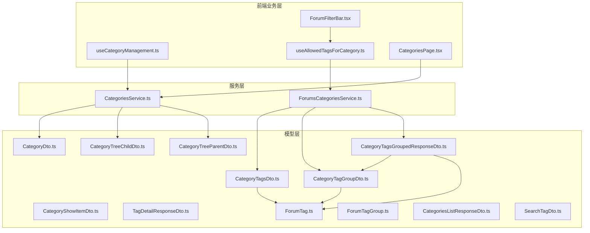
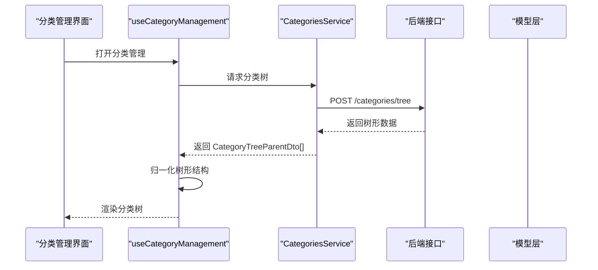
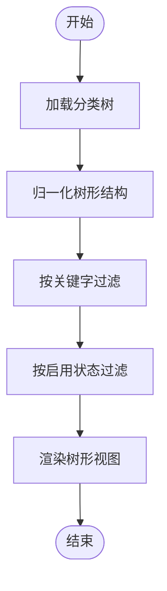
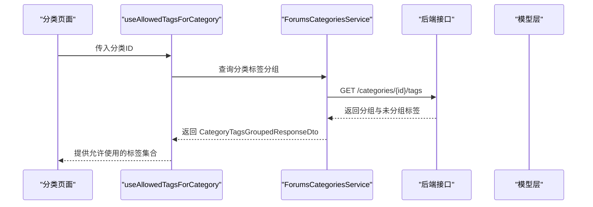
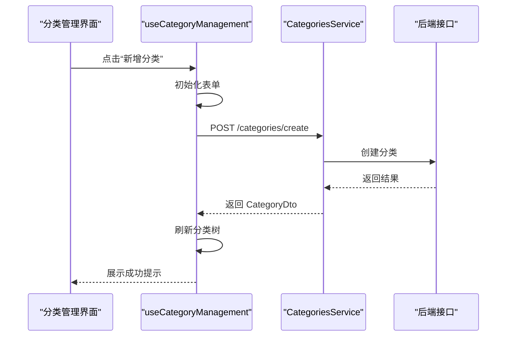
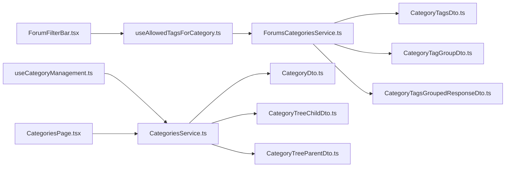
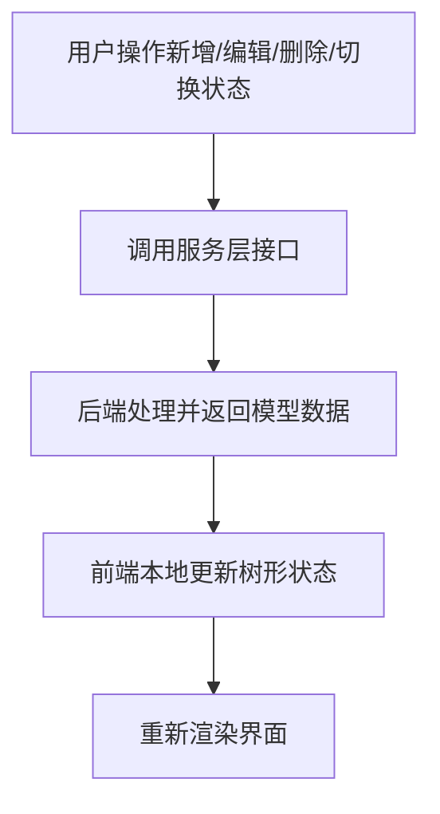

# 分类标签模型

<cite>
**本文引用的文件**
- [CategoryDto.ts](file://src/api/models/CategoryDto.ts)
- [CategoryShowItemDto.ts](file://src/api/models/CategoryShowItemDto.ts)
- [TagDetailResponseDto.ts](file://src/api/models/TagDetailResponseDto.ts)
- [CategoryTagsDto.ts](file://src/api/models/CategoryTagsDto.ts)
- [CategoryTagGroupDto.ts](file://src/api/models/CategoryTagGroupDto.ts)
- [CategoryTagsGroupedResponseDto.ts](file://src/api/models/CategoryTagsGroupedResponseDto.ts)
- [CategoryTreeChildDto.ts](file://src/api/models/CategoryTreeChildDto.ts)
- [CategoryTreeParentDto.ts](file://src/api/models/CategoryTreeParentDto.ts)
- [ForumTag.ts](file://src/api/models/ForumTag.ts)
- [ForumTagGroup.ts](file://src/api/models/ForumTagGroup.ts)
- [CategoriesService.ts](file://src/api/services/CategoriesService.ts)
- [ForumsCategoriesService.ts](file://src/api/services/ForumsCategoriesService.ts)
- [useCategoryManagement.ts](file://src/modules/admin/shared/categories/hooks/useCategoryManagement.ts)
- [useAllowedTagsForCategory.ts](file://src/modules/forum/hooks/useAllowedTagsForCategory.ts)
- [ForumFilterBar.tsx](file://src/modules/forum/components/TopicList/components/ForumFilterBar.tsx)
- [CategoriesListResponseDto.ts](file://src/api/models/CategoriesListResponseDto.ts)
- [SearchTagDto.ts](file://src/api/models/SearchTagDto.ts)
- [CategoriesPage.tsx](file://src/modules/forum/pages/CategoriesPage.tsx)
</cite>

## 目录
1. [引言](#引言)
2. [项目结构](#项目结构)
3. [核心组件](#核心组件)
4. [架构总览](#架构总览)
5. [详细组件分析](#详细组件分析)
6. [依赖分析](#依赖分析)
7. [性能考虑](#性能考虑)
8. [故障排查指南](#故障排查指南)
9. [结论](#结论)
10. [附录](#附录)

## 引言
本技术文档聚焦于分类标签系统的核心数据模型与实现，覆盖以下主题：
- 分类（CategoryDto）、分类项（CategoryShowItemDto）、标签详情（TagDetailResponseDto）等数据结构定义
- 分类层级关系（树形结构）、标签组管理、分类可见性控制
- 分类树形结构、标签关联关系与分类权限控制的实现方式
- 分类管理、标签搜索与内容分类的实际使用示例
- 分类缓存策略、性能优化与数据一致性保障

## 项目结构
分类标签模型主要由三部分构成：
- 数据模型层：位于 src/api/models，定义了分类、标签、树形结构及分页响应等类型
- 服务层：位于 src/api/services，封装对后端接口的调用
- 前端业务层：位于 src/modules，包含分类管理 Hook、标签筛选 Hook 以及页面组件

图表来源
- [CategoriesService.ts](file://src/api/services/CategoriesService.ts#L1-L36)
- [ForumsCategoriesService.ts](file://src/api/services/ForumsCategoriesService.ts#L1-L29)
- [useCategoryManagement.ts](file://src/modules/admin/shared/categories/hooks/useCategoryManagement.ts#L1-L299)
- [useAllowedTagsForCategory.ts](file://src/modules/forum/hooks/useAllowedTagsForCategory.ts#L1-L47)
- [ForumFilterBar.tsx](file://src/modules/forum/components/TopicList/components/ForumFilterBar.tsx#L173-L203)
- [CategoriesPage.tsx](file://src/modules/forum/pages/CategoriesPage.tsx#L176-L215)

章节来源
- [CategoriesService.ts](file://src/api/services/CategoriesService.ts#L1-L36)
- [ForumsCategoriesService.ts](file://src/api/services/ForumsCategoriesService.ts#L1-L29)

## 核心组件
本节从数据模型角度梳理分类标签系统的关键实体及其职责。

- 分类基础模型
  - CategoryDto：描述分类的基本属性，包括标识、键、标签、启用状态、排序、默认展示标记与时间戳
  - CategoryShowItemDto：用于展示场景的分类项，包含分类键与是否显示
- 树形结构模型
  - CategoryTreeParentDto：树形父节点，包含子节点数组
  - CategoryTreeChildDto：树形子节点，包含父级标识
- 标签与分组模型
  - ForumTag：标签名称与使用计数
  - ForumTagGroup：标签组名称、颜色与排序权重
  - CategoryTagGroupDto：分类下的标签组，包含组内标签列表
  - CategoryTagsDto：查询分类标签时的请求参数（分类ID、是否分组、分页）
  - CategoryTagsGroupedResponseDto：分类标签分组响应，包含分组标签、未分组标签与分页信息
  - TagDetailResponseDto：标签详情，包含标签ID、名称、使用次数与时间戳
- 列表与搜索模型
  - CategoriesListResponseDto：分类列表响应（字符串数组）
  - SearchTagDto：标签搜索请求参数（关键词与限制数量）

章节来源
- [CategoryDto.ts](file://src/api/models/CategoryDto.ts#L1-L17)
- [CategoryShowItemDto.ts](file://src/api/models/CategoryShowItemDto.ts#L1-L16)
- [CategoryTreeChildDto.ts](file://src/api/models/CategoryTreeChildDto.ts#L1-L16)
- [CategoryTreeParentDto.ts](file://src/api/models/CategoryTreeParentDto.ts#L1-L18)
- [ForumTag.ts](file://src/api/models/ForumTag.ts#L1-L16)
- [ForumTagGroup.ts](file://src/api/models/ForumTagGroup.ts#L1-L20)
- [CategoryTagGroupDto.ts](file://src/api/models/CategoryTagGroupDto.ts#L1-L29)
- [CategoryTagsDto.ts](file://src/api/models/CategoryTagsDto.ts#L1-L24)
- [CategoryTagsGroupedResponseDto.ts](file://src/api/models/CategoryTagsGroupedResponseDto.ts#L1-L22)
- [TagDetailResponseDto.ts](file://src/api/models/TagDetailResponseDto.ts#L1-L32)
- [CategoriesListResponseDto.ts](file://src/api/models/CategoriesListResponseDto.ts#L1-L11)
- [SearchTagDto.ts](file://src/api/models/SearchTagDto.ts#L1-L15)

## 架构总览
分类标签系统从前端 Hook 调用服务层，服务层通过统一的请求封装访问后端接口，最终返回模型层定义的数据结构。分类树形结构与标签分组在前端进行本地化处理与展示。

图表来源
- [useCategoryManagement.ts](file://src/modules/admin/shared/categories/hooks/useCategoryManagement.ts#L65-L85)
- [CategoriesService.ts](file://src/api/services/CategoriesService.ts#L1-L36)
- [CategoryTreeParentDto.ts](file://src/api/models/CategoryTreeParentDto.ts#L1-L18)

## 详细组件分析

### 分类树形结构与层级关系
- 树形节点
  - 父节点：CategoryTreeParentDto，包含子节点数组
  - 子节点：CategoryTreeChildDto，包含父级标识
- 本地归一化
  - useCategoryManagement 将后端返回的树形数据归一化为 CategoryItem 结构，便于前端渲染与交互
- 过滤与搜索
  - 支持按关键字与启用状态进行本地过滤，递归保留匹配的父子节点

图表来源
- [useCategoryManagement.ts](file://src/modules/admin/shared/categories/hooks/useCategoryManagement.ts#L34-L62)
- [useCategoryManagement.ts](file://src/modules/admin/shared/categories/hooks/useCategoryManagement.ts#L92-L119)

章节来源
- [CategoryTreeChildDto.ts](file://src/api/models/CategoryTreeChildDto.ts#L1-L16)
- [CategoryTreeParentDto.ts](file://src/api/models/CategoryTreeParentDto.ts#L1-L18)
- [useCategoryManagement.ts](file://src/modules/admin/shared/categories/hooks/useCategoryManagement.ts#L1-L299)

### 标签组管理与分类可见性控制
- 标签分组查询
  - 通过 ForumsCategoriesService 查询指定分类下的标签分组，支持分页与不分组两种模式
  - 响应体包含分组标签与未分组标签，以及分页信息
- 标签详情
  - TagDetailResponseDto 提供标签的ID、名称、使用次数与时间戳
- 可见性控制
  - 分类启用/禁用与默认展示状态通过 CategoriesService 的更新接口进行切换
  - 前端 Hook 在更新成功后，本地递归更新树形节点状态，确保 UI 与后端一致

图表来源
- [useAllowedTagsForCategory.ts](file://src/modules/forum/hooks/useAllowedTagsForCategory.ts#L1-L47)
- [ForumsCategoriesService.ts](file://src/api/services/ForumsCategoriesService.ts#L1-L29)
- [CategoryTagsGroupedResponseDto.ts](file://src/api/models/CategoryTagsGroupedResponseDto.ts#L1-L22)

章节来源
- [CategoryTagsDto.ts](file://src/api/models/CategoryTagsDto.ts#L1-L24)
- [CategoryTagsGroupedResponseDto.ts](file://src/api/models/CategoryTagsGroupedResponseDto.ts#L1-L22)
- [TagDetailResponseDto.ts](file://src/api/models/TagDetailResponseDto.ts#L1-L32)
- [useCategoryManagement.ts](file://src/modules/admin/shared/categories/hooks/useCategoryManagement.ts#L234-L264)

### 分类管理、标签搜索与内容分类
- 分类管理
  - 新增/编辑/删除分类：通过 CategoriesService 的创建、更新、删除接口完成；前端 Hook 负责表单初始化与本地状态更新
  - 启用/禁用与默认展示切换：调用更新接口后，本地递归更新树节点状态
- 标签搜索
  - 使用 SearchTagDto 作为搜索参数，结合 ForumFilterBar 的下拉选择实现标签筛选
- 内容分类
  - 通过分类树与标签分组，用户可对内容进行分类与打标

图表来源
- [useCategoryManagement.ts](file://src/modules/admin/shared/categories/hooks/useCategoryManagement.ts#L169-L187)
- [CategoriesService.ts](file://src/api/services/CategoriesService.ts#L22-L36)

章节来源
- [useCategoryManagement.ts](file://src/modules/admin/shared/categories/hooks/useCategoryManagement.ts#L144-L187)
- [useCategoryManagement.ts](file://src/modules/admin/shared/categories/hooks/useCategoryManagement.ts#L217-L232)
- [SearchTagDto.ts](file://src/api/models/SearchTagDto.ts#L1-L15)
- [ForumFilterBar.tsx](file://src/modules/forum/components/TopicList/components/ForumFilterBar.tsx#L173-L203)

## 依赖分析
- 组件耦合
  - useCategoryManagement 依赖 CategoriesService 与模型层的树形结构类型
  - useAllowedTagsForCategory 依赖 ForumsCategoriesService 与标签分组模型
  - 页面组件 CategoriesPage 与 ForumFilterBar 依赖服务层与 Hook
- 外部依赖
  - 统一请求封装 OpenAPI 与 request 用于发起网络请求
- 循环依赖
  - 当前结构以服务层为中介，避免了模型层与业务层之间的直接循环依赖

图表来源
- [useCategoryManagement.ts](file://src/modules/admin/shared/categories/hooks/useCategoryManagement.ts#L1-L299)
- [useAllowedTagsForCategory.ts](file://src/modules/forum/hooks/useAllowedTagsForCategory.ts#L1-L47)
- [CategoriesService.ts](file://src/api/services/CategoriesService.ts#L1-L36)
- [ForumsCategoriesService.ts](file://src/api/services/ForumsCategoriesService.ts#L1-L29)
- [CategoryDto.ts](file://src/api/models/CategoryDto.ts#L1-L17)
- [CategoryTreeChildDto.ts](file://src/api/models/CategoryTreeChildDto.ts#L1-L16)
- [CategoryTreeParentDto.ts](file://src/api/models/CategoryTreeParentDto.ts#L1-L18)
- [CategoryTagsDto.ts](file://src/api/models/CategoryTagsDto.ts#L1-L24)
- [CategoryTagGroupDto.ts](file://src/api/models/CategoryTagGroupDto.ts#L1-L29)
- [CategoryTagsGroupedResponseDto.ts](file://src/api/models/CategoryTagsGroupedResponseDto.ts#L1-L22)

章节来源
- [CategoriesService.ts](file://src/api/services/CategoriesService.ts#L1-L36)
- [ForumsCategoriesService.ts](file://src/api/services/ForumsCategoriesService.ts#L1-L29)

## 性能考虑
- 本地树形归一化与过滤
  - 在 useCategoryManagement 中对树形数据进行本地归一化与过滤，减少重复渲染与网络请求
- 标签分组查询的分页与上限
  - useAllowedTagsForCategory 对标签分组查询设置了较大的分页上限，确保一次性获取全部可用标签，降低多次请求带来的延迟
- 缓存策略建议
  - 分类树与标签分组可采用基于查询参数的内存缓存，结合路由与分类ID作为键，避免重复拉取
  - 对于频繁变更的分类状态（启用/禁用、默认展示），可在更新成功后主动失效相关缓存或局部刷新
- 数据一致性
  - 更新操作成功后，前端先本地更新树节点状态，再触发重新加载，确保 UI 与后端一致

章节来源
- [useCategoryManagement.ts](file://src/modules/admin/shared/categories/hooks/useCategoryManagement.ts#L34-L62)
- [useCategoryManagement.ts](file://src/modules/admin/shared/categories/hooks/useCategoryManagement.ts#L92-L119)
- [useAllowedTagsForCategory.ts](file://src/modules/forum/hooks/useAllowedTagsForCategory.ts#L1-L47)

## 故障排查指南
- 分类树加载失败
  - 现象：分类树加载报错或为空
  - 排查：检查后端接口 /categories/tree 的返回格式与权限；确认 useCategoryManagement 的归一化逻辑是否正确
- 标签筛选无效
  - 现象：选择标签后无结果
  - 排查：确认 useAllowedTagsForCategory 是否正确获取分组标签；检查 ForumFilterBar 的标签选择逻辑
- 分类状态更新不生效
  - 现象：启用/禁用或默认展示切换后 UI 未更新
  - 排查：确认 CategoriesService 的更新接口返回码；检查 useCategoryManagement 的本地状态更新逻辑

章节来源
- [useCategoryManagement.ts](file://src/modules/admin/shared/categories/hooks/useCategoryManagement.ts#L80-L84)
- [useAllowedTagsForCategory.ts](file://src/modules/forum/hooks/useAllowedTagsForCategory.ts#L12-L37)
- [CategoriesPage.tsx](file://src/modules/forum/pages/CategoriesPage.tsx#L207-L215)

## 结论
分类标签模型通过清晰的数据结构与服务层抽象，实现了分类树形管理、标签分组与筛选、以及分类可见性控制。前端 Hook 负责本地状态管理与用户体验优化，服务层负责与后端接口的对接。通过合理的缓存与一致性策略，系统在性能与稳定性方面具备良好表现。

## 附录
- 关键流程图（概念性）
