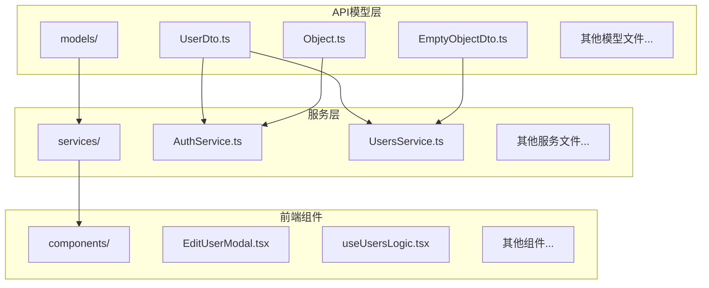
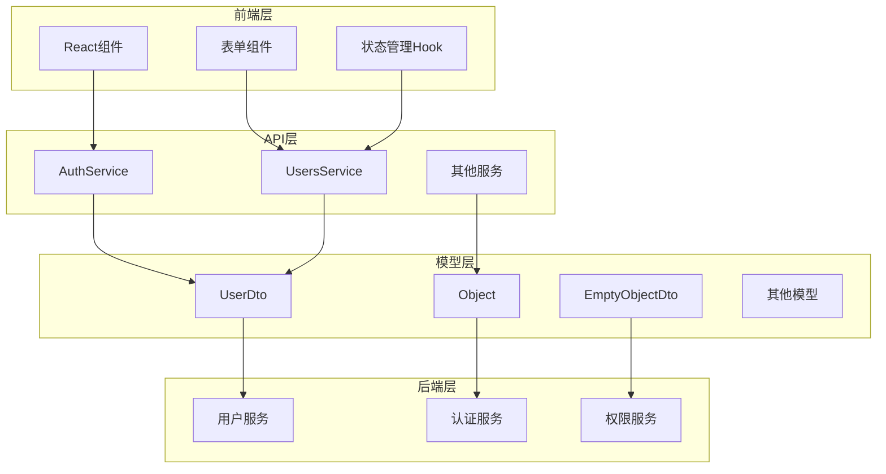
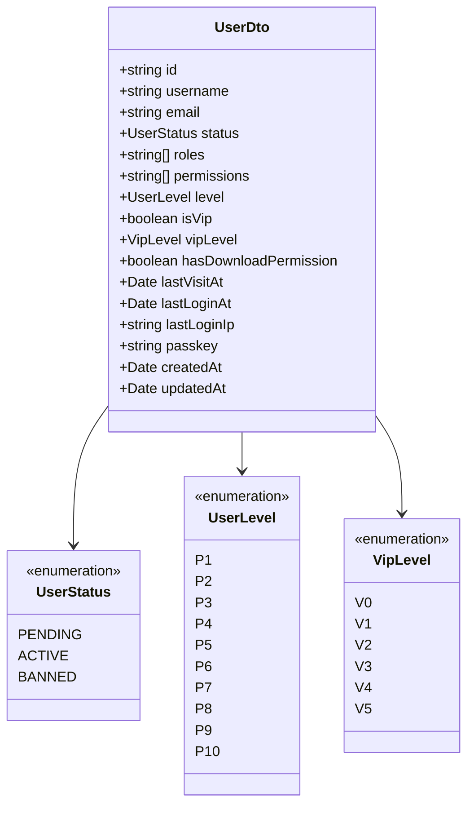
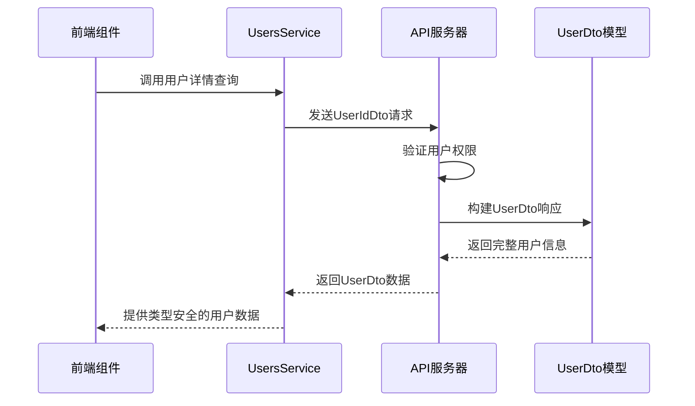
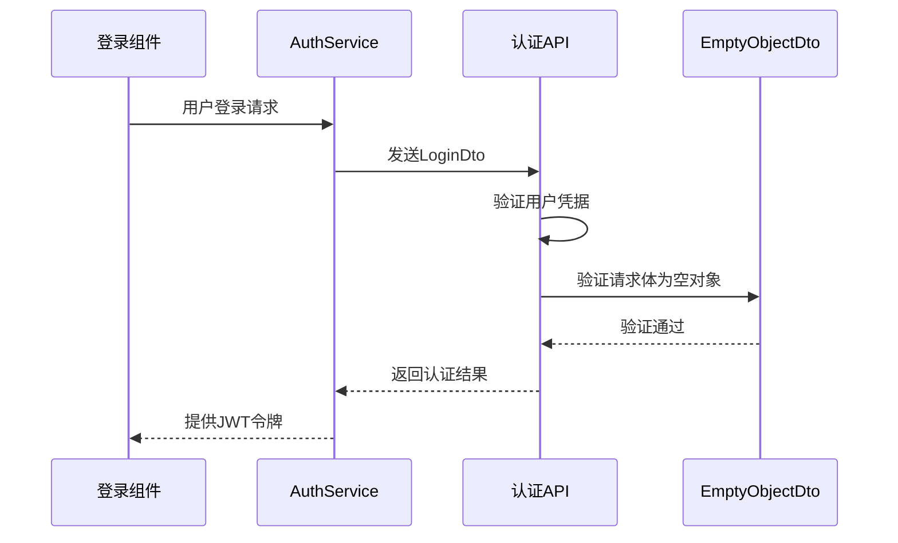
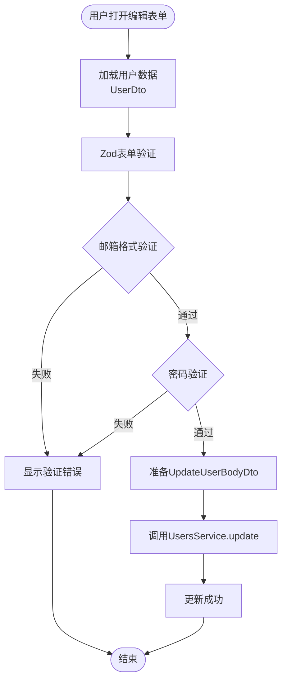
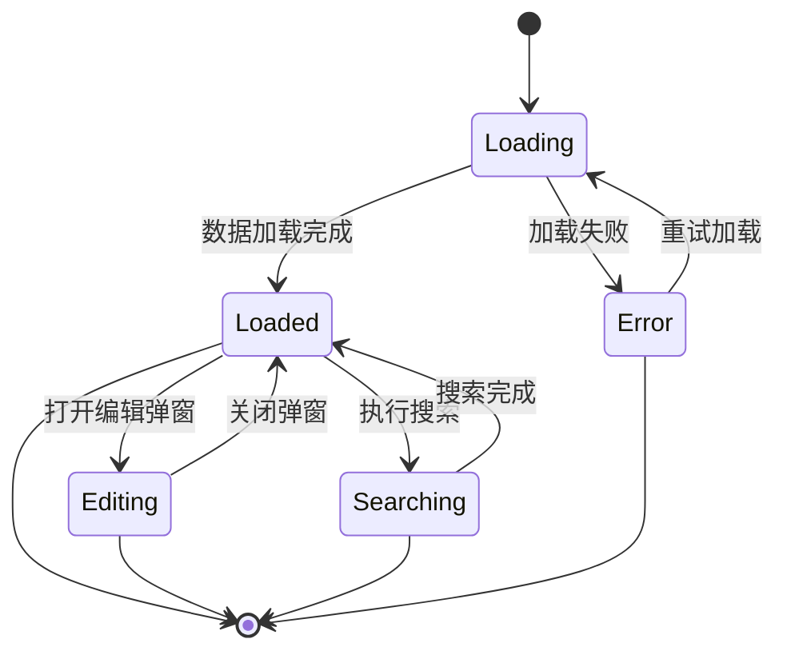
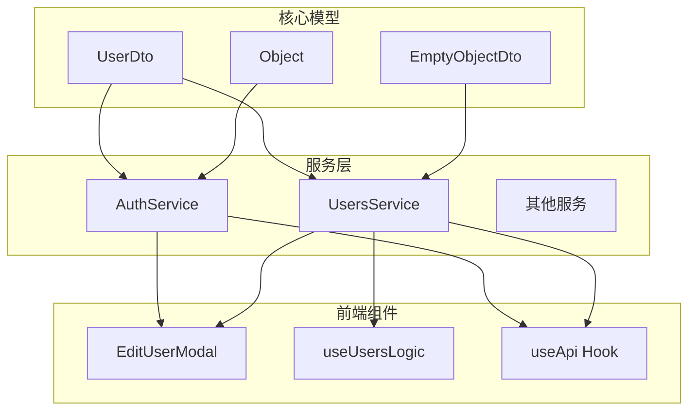

# 基础数据模型

<cite>
**本文档引用的文件**
- [UserDto.ts](file://src/api/models/UserDto.ts)
- [Object.ts](file://src/api/models/Object.ts)
- [EmptyObjectDto.ts](file://src/api/models/EmptyObjectDto.ts)
- [AuthService.ts](file://src/api/services/AuthService.ts)
- [UsersService.ts](file://src/api/services/UsersService.ts)
- [EditUserModal.tsx](file://src/modules/admin/pages/users-security/users/UsersPage/components/EditUserModal.tsx)
- [useUsersLogic.tsx](file://src/modules/admin/pages/users-security/users/UsersPage/useUsersLogic.tsx)
- [useApi.ts](file://src/hooks/useApi.ts)
</cite>

## 目录
1. [简介](#简介)
2. [项目结构](#项目结构)
3. [核心组件](#核心组件)
4. [架构概览](#架构概览)
5. [详细组件分析](#详细组件分析)
6. [依赖分析](#依赖分析)
7. [性能考虑](#性能考虑)
8. [故障排除指南](#故障排除指南)
9. [结论](#结论)

## 简介

本文档详细介绍了zTorrent网站项目中的基础数据模型，重点涵盖用户相关模型(UserDto)、通用对象模型(Object)和空对象模型(EmptyObjectDto)。这些模型构成了整个系统的数据交换基础，为前后端通信提供了类型安全的契约。

基础数据模型在系统中扮演着至关重要的角色：
- **类型安全保证**：通过TypeScript接口确保数据结构的一致性
- **API契约定义**：为RESTful API提供标准化的数据格式
- **前端状态管理**：支撑React组件的状态管理和表单验证
- **后端业务逻辑**：作为服务层和数据层之间的桥梁

## 项目结构

基础数据模型位于项目的API模型目录中，采用按功能模块组织的方式：

**图表来源**
- [UserDto.ts](file://src/api/models/UserDto.ts#L1-L108)
- [Object.ts](file://src/api/models/Object.ts#L1-L8)
- [EmptyObjectDto.ts](file://src/api/models/EmptyObjectDto.ts#L1-L12)

**章节来源**
- [UserDto.ts](file://src/api/models/UserDto.ts#L1-L108)
- [Object.ts](file://src/api/models/Object.ts#L1-L8)
- [EmptyObjectDto.ts](file://src/api/models/EmptyObjectDto.ts#L1-L12)

## 核心组件

### UserDto - 用户数据传输对象

UserDto是系统中最复杂的用户相关模型，包含了用户的所有基本信息和权限相关信息。

#### 字段定义

| 字段名 | 类型 | 必填 | 描述 | 示例值 |
|--------|------|------|------|--------|
| id | string | 是 | 用户唯一标识符 | "user_12345" |
| username | string | 是 | 用户名 | "john_doe" |
| email | string | 是 | 用户邮箱地址 | "john@example.com" |
| status | UserDto.status | 是 | 用户状态枚举 | "active" |
| roles | string[] | 是 | 用户角色列表 | ["member", "uploader"] |
| permissions | string[] | 是 | 用户权限列表 | ["torrent:download", "forum:post"] |
| level | UserDto.level | 是 | 用户等级 | "P5" |
| isVip | boolean | 是 | 是否为VIP用户 | true |
| vipLevel | UserDto.vipLevel | 是 | VIP等级 | "V3" |
| hasDownloadPermission | boolean | 是 | 是否有下载权限 | true |
| lastVisitAt | Record<string, any> \| null | 否 | 最后访问时间 | "2024-01-15T10:30:00Z" |
| lastLoginAt | Record<string, any> \| null | 否 | 最后登录时间 | "2024-01-15T09:15:00Z" |
| lastLoginIp | Record<string, any> \| null | 否 | 最后登录IP地址 | "192.168.1.100" |
| passkey | string | 是 | 下载密钥（敏感信息） | "abc123xyz" |
| createdAt | string | 是 | 创建时间 | "2024-01-01T00:00:00Z" |
| updatedAt | string | 是 | 更新时间 | "2024-01-15T10:30:00Z" |

#### 枚举类型

**用户状态枚举 (UserDto.status)**
- PENDING: 待审核状态
- ACTIVE: 活跃状态  
- BANNED: 封禁状态

**用户等级枚举 (UserDto.level)**
支持P1到P10等级，数字越大等级越高

**VIP等级枚举 (UserDto.vipLevel)**
支持V0到V5等级，V0表示非VIP用户

#### 数据类型说明

- **Record<string, any>**: 动态对象类型，用于存储任意结构的数据
- **null联合类型**: 表示该字段可能为空值
- **字符串日期格式**: 使用ISO 8601标准的时间格式

**章节来源**
- [UserDto.ts](file://src/api/models/UserDto.ts#L5-L70)
- [UserDto.ts](file://src/api/models/UserDto.ts#L71-L106)

### Object - 通用对象模型

Object是一个空接口定义，没有任何字段约束，主要用于需要通用对象类型的场景。

#### 特点
- **零字段设计**: 不包含任何属性定义
- **灵活用途**: 可以接受任何对象结构
- **类型占位符**: 作为通用类型参数使用

#### 使用场景
- API响应体的通用容器
- 需要动态类型支持的参数传递
- 作为泛型类型参数的基础类型

**章节来源**
- [Object.ts](file://src/api/models/Object.ts#L5-L6)

### EmptyObjectDto - 空对象数据传输对象

EmptyObjectDto是一个特殊的空对象模型，虽然本身没有字段，但通过可选的通用字段提供灵活性。

#### 结构定义

| 字段名 | 类型 | 必填 | 描述 |
|--------|------|------|------|
| _ | Record<string, any> | 可选 | 通用占位字段，支持任意键值对 |

#### 设计目的
- **API兼容性**: 为不需要参数的API端点提供标准输入
- **扩展性**: 通过通用字段支持未来可能的参数扩展
- **类型一致性**: 确保所有API调用都遵循相同的类型约定

**章节来源**
- [EmptyObjectDto.ts](file://src/api/models/EmptyObjectDto.ts#L5-L10)

## 架构概览

基础数据模型在整个系统中的架构位置如下：

**图表来源**
- [AuthService.ts](file://src/api/services/AuthService.ts#L23-L84)
- [UsersService.ts](file://src/api/services/UsersService.ts#L26-L113)
- [UserDto.ts](file://src/api/models/UserDto.ts#L5-L70)

## 详细组件分析

### UserDto 模型分析

#### 类型安全性设计

UserDto采用了严格的类型安全设计，确保每个字段都有明确的类型定义和约束条件。

**图表来源**
- [UserDto.ts](file://src/api/models/UserDto.ts#L5-L70)
- [UserDto.ts](file://src/api/models/UserDto.ts#L71-L106)

#### 字段验证规则

基于UserDto的字段定义，可以推导出以下验证规则：

1. **标识符验证**
   - id: 非空字符串，唯一性由后端保证
   - username: 非空字符串，长度限制通常在1-50字符之间

2. **邮箱验证**
   - email: 标准邮箱格式验证
   - 必须是有效的邮箱地址格式

3. **枚举验证**
   - status: 必须是预定义的三个枚举值之一
   - level: 必须是P1-P10范围内的有效等级
   - vipLevel: 必须是V0-V5范围内的有效等级

4. **布尔值验证**
   - isVip: true/false
   - hasDownloadPermission: true/false

5. **时间戳验证**
   - 日期字段必须符合ISO 8601格式
   - 时间戳必须是有效的JavaScript Date对象

**章节来源**
- [UserDto.ts](file://src/api/models/UserDto.ts#L5-L70)

### 服务集成模式

#### 用户服务集成

UsersService展示了UserDto在实际服务中的使用模式：

**图表来源**
- [UsersService.ts](file://src/api/services/UsersService.ts#L62-L83)
- [EditUserModal.tsx](file://src/modules/admin/pages/users-security/users/UsersPage/components/EditUserModal.tsx#L58-L72)

#### 认证服务集成

AuthService展示了EmptyObjectDto的典型使用场景：

**图表来源**
- [AuthService.ts](file://src/api/services/AuthService.ts#L31-L53)
- [AuthService.ts](file://src/api/services/AuthService.ts#L61-L84)

**章节来源**
- [UsersService.ts](file://src/api/services/UsersService.ts#L26-L113)
- [AuthService.ts](file://src/api/services/AuthService.ts#L23-L84)

### 前端使用模式

#### 表单验证集成

EditUserModal组件展示了UserDto在前端表单中的实际应用：

**图表来源**
- [EditUserModal.tsx](file://src/modules/admin/pages/users-security/users/UsersPage/components/EditUserModal.tsx#L13-L17)
- [EditUserModal.tsx](file://src/modules/admin/pages/users-security/users/UsersPage/components/EditUserModal.tsx#L58-L72)

#### 状态管理模式

useUsersLogic展示了UserDto在状态管理中的使用：

**图表来源**
- [useUsersLogic.tsx](file://src/modules/admin/pages/users-security/users/UsersPage/useUsersLogic.tsx#L28-L63)

**章节来源**
- [EditUserModal.tsx](file://src/modules/admin/pages/users-security/users/UsersPage/components/EditUserModal.tsx#L1-L90)
- [useUsersLogic.tsx](file://src/modules/admin/pages/users-security/users/UsersPage/useUsersLogic.tsx#L27-L63)

## 依赖分析

### 模型间依赖关系

**图表来源**
- [AuthService.ts](file://src/api/services/AuthService.ts#L1-L22)
- [UsersService.ts](file://src/api/services/UsersService.ts#L1-L25)

### 外部依赖

基础数据模型主要依赖于以下外部库和框架：

1. **TypeScript**: 提供静态类型检查
2. **React Hook Form**: 表单验证和状态管理
3. **Zod**: 运行时类型验证
4. **TanStack Query**: 数据获取和缓存
5. **OpenAPI Generator**: 自动生成的API客户端

**章节来源**
- [EditUserModal.tsx](file://src/modules/admin/pages/users-security/users/UsersPage/components/EditUserModal.tsx#L1-L12)
- [useApi.ts](file://src/hooks/useApi.ts#L1-L6)

## 性能考虑

### 类型检查优化

1. **编译时验证**: TypeScript在编译时进行类型检查，避免运行时错误
2. **增量编译**: 利用TypeScript的增量编译特性提高开发效率
3. **模块拆分**: 将大型模型拆分为独立模块，支持按需加载

### 内存使用优化

1. **只读数据结构**: UserDto使用不可变数据结构，减少内存占用
2. **延迟初始化**: 对于可选字段，在需要时才创建实例
3. **对象池模式**: 对于频繁创建的对象，考虑使用对象池技术

### 网络传输优化

1. **数据压缩**: 对于大量用户数据，考虑启用Gzip压缩
2. **分页策略**: 使用分页API减少单次传输的数据量
3. **缓存策略**: 实现智能缓存机制，避免重复请求

## 故障排除指南

### 常见问题及解决方案

#### 类型不匹配错误

**问题描述**: 编译时报错，提示UserDto字段类型不匹配

**解决方案**:
1. 检查后端API返回的数据格式是否符合UserDto定义
2. 确认枚举值是否在允许范围内
3. 验证日期格式是否符合ISO 8601标准

#### 空值处理错误

**问题描述**: 运行时出现空指针异常

**解决方案**:
1. 在访问UserDto字段前检查是否为null
2. 使用可选链操作符(?.)安全访问嵌套属性
3. 为可选字段提供默认值

#### API调用失败

**问题描述**: 服务调用返回错误状态

**解决方案**:
1. 检查网络连接和API可用性
2. 验证请求参数是否符合模型定义
3. 查看服务端日志获取详细错误信息

**章节来源**
- [UserDto.ts](file://src/api/models/UserDto.ts#L49-L57)
- [EditUserModal.tsx](file://src/modules/admin/pages/users-security/users/UsersPage/components/EditUserModal.tsx#L58-L72)

## 结论

基础数据模型为zTorrent网站项目提供了坚实的数据结构基础。通过精心设计的UserDto、Object和EmptyObjectDto模型，系统实现了：

1. **强类型安全保障**: 通过TypeScript确保数据结构的一致性和完整性
2. **清晰的API契约**: 为前后端通信提供了明确的数据交换规范
3. **良好的扩展性**: 模型设计支持未来的功能扩展和业务变化
4. **优秀的开发体验**: 类型安全和IDE支持提高了开发效率

这些基础模型不仅满足了当前的功能需求，还为系统的长期发展奠定了坚实的技术基础。建议在后续开发中继续遵循现有的类型设计原则，确保系统的整体质量和可维护性。