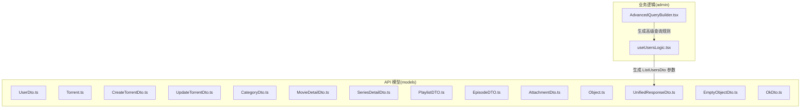
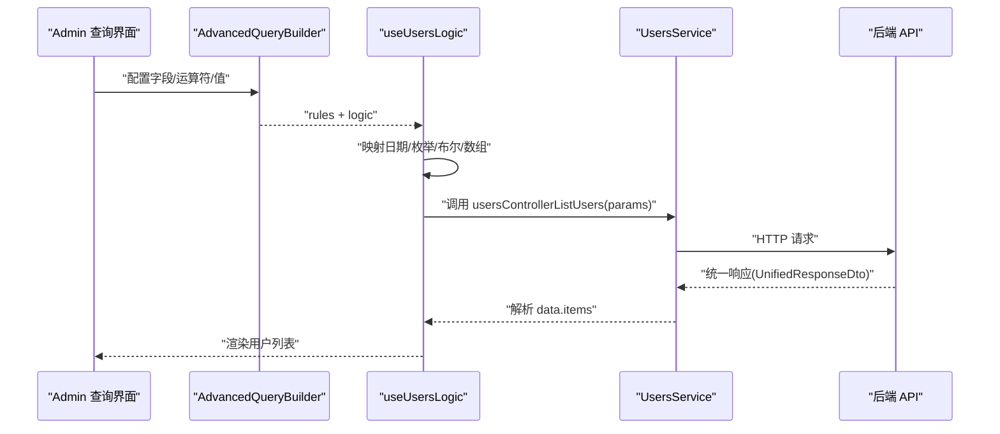
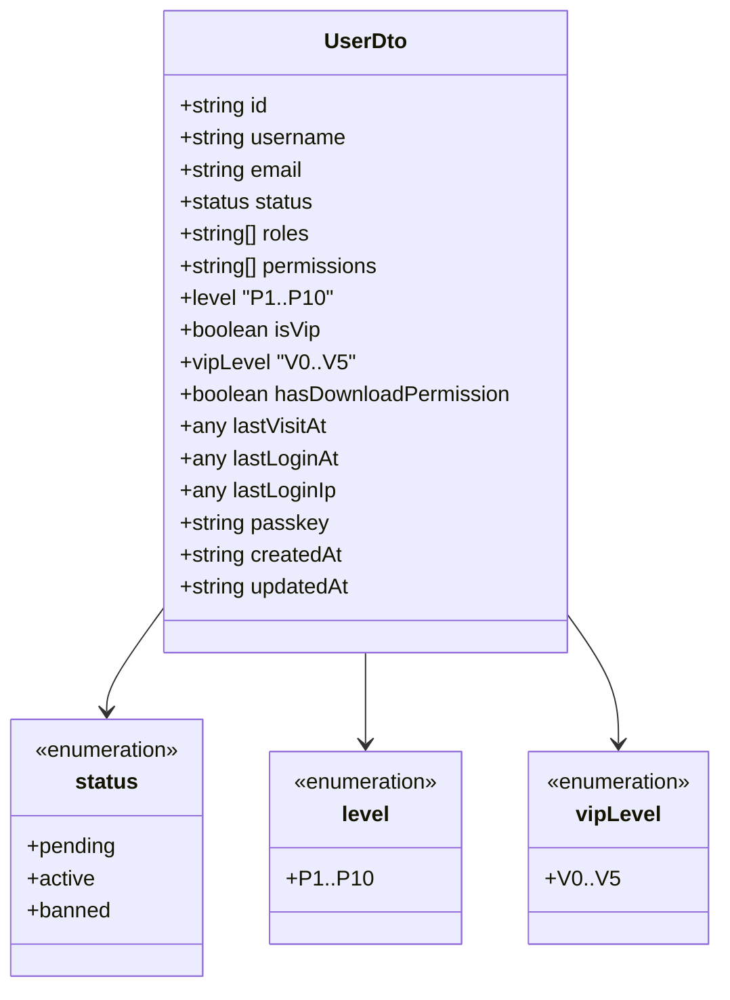
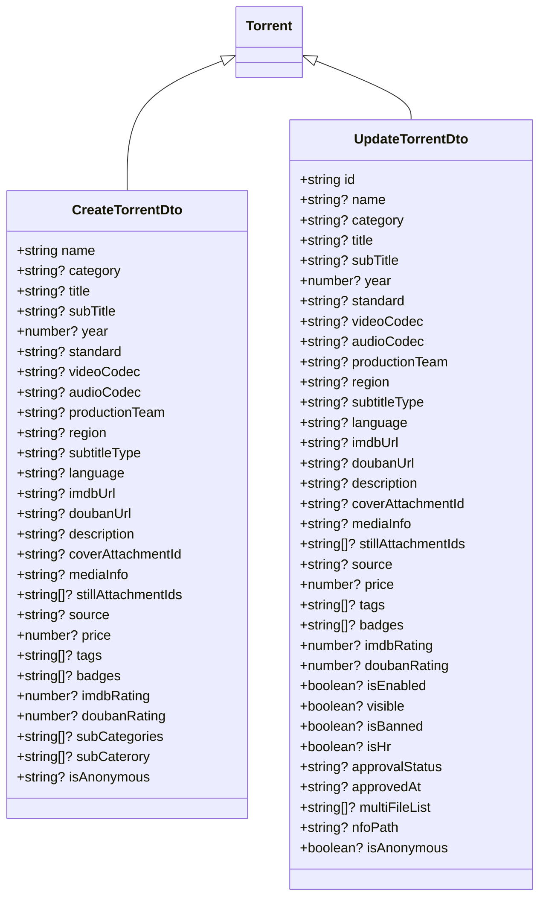
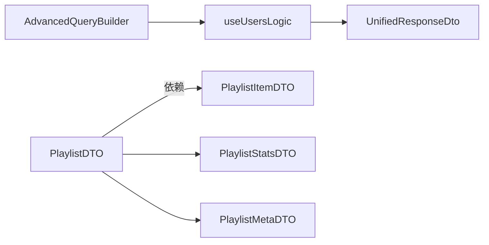

# 数据模型定义

<cite>
**本文引用的文件**
- [src/api/models/UserDto.ts](file://src/api/models/UserDto.ts)
- [src/api/models/Torrent.ts](file://src/api/models/Torrent.ts)
- [src/api/models/CreateTorrentDto.ts](file://src/api/models/CreateTorrentDto.ts)
- [src/api/models/UpdateTorrentDto.ts](file://src/api/models/UpdateTorrentDto.ts)
- [src/api/models/CategoryDto.ts](file://src/api/models/CategoryDto.ts)
- [src/api/models/MovieDetailDto.ts](file://src/api/models/MovieDetailDto.ts)
- [src/api/models/SeriesDetailDto.ts](file://src/api/models/SeriesDetailDto.ts)
- [src/api/models/PlaylistDTO.ts](file://src/api/models/PlaylistDTO.ts)
- [src/api/models/EpisodeDTO.ts](file://src/api/models/EpisodeDTO.ts)
- [src/api/models/AttachmentDto.ts](file://src/api/models/AttachmentDto.ts)
- [src/api/models/Object.ts](file://src/api/models/Object.ts)
- [src/api/models/UnifiedResponseDto.ts](file://src/api/models/UnifiedResponseDto.ts)
- [src/api/models/EmptyObjectDto.ts](file://src/api/models/EmptyObjectDto.ts)
- [src/api/models/OkDto.ts](file://src/api/models/OkDto.ts)
- [src/modules/admin/components/AdvancedQueryBuilder.tsx](file://src/modules/admin/components/AdvancedQueryBuilder.tsx)
- [src/modules/admin/pages/users-security/users/UsersPage/useUsersLogic.tsx](file://src/modules/admin/pages/users-security/users/UsersPage/useUsersLogic.tsx)
</cite>

## 目录
1. [简介](#简介)
2. [项目结构](#项目结构)
3. [核心组件](#核心组件)
4. [架构总览](#架构总览)
5. [详细组件分析](#详细组件分析)
6. [依赖分析](#依赖分析)
7. [性能考虑](#性能考虑)
8. [故障排除指南](#故障排除指南)
9. [结论](#结论)
10. [附录](#附录)

## 简介
本文件系统性梳理 zTorrent 站点前端 API 层的数据传输对象（DTO）与核心数据模型，覆盖以下方面：
- DTO 结构、字段定义与数据类型
- 实体关系、主键外键约束与索引设计
- 数据验证规则、业务规则与数据转换逻辑
- 模型使用示例、数据流处理与类型安全保证
- 模型扩展机制、自定义模型开发与数据迁移策略

本仓库中的模型主要由 OpenAPI TypeScript Codegen 自动生成，位于 src/api/models 目录下；部分业务场景下的查询构建器与参数映射在 src/modules/admin 中实现。

## 项目结构
前端 API 模型集中于 src/api/models，采用按功能域分层组织的目录结构：
- models：存放所有 DTO 类型定义
- services：存放服务封装（当前未展开）
- 其他模块：如 admin 页面通过查询构建器将用户输入映射为 ListUsersDto 等参数

图表来源
- [src/api/models/UserDto.ts](file://src/api/models/UserDto.ts#L1-L108)
- [src/api/models/Torrent.ts](file://src/api/models/Torrent.ts#L1-L8)
- [src/api/models/CreateTorrentDto.ts](file://src/api/models/CreateTorrentDto.ts#L1-L74)
- [src/api/models/UpdateTorrentDto.ts](file://src/api/models/UpdateTorrentDto.ts#L1-L96)
- [src/api/models/CategoryDto.ts](file://src/api/models/CategoryDto.ts#L1-L17)
- [src/api/models/MovieDetailDto.ts](file://src/api/models/MovieDetailDto.ts#L1-L37)
- [src/api/models/SeriesDetailDto.ts](file://src/api/models/SeriesDetailDto.ts#L1-L39)
- [src/api/models/PlaylistDTO.ts](file://src/api/models/PlaylistDTO.ts#L1-L56)
- [src/api/models/EpisodeDTO.ts](file://src/api/models/EpisodeDTO.ts#L1-L44)
- [src/api/models/AttachmentDto.ts](file://src/api/models/AttachmentDto.ts#L1-L28)
- [src/api/models/Object.ts](file://src/api/models/Object.ts#L1-L8)
- [src/api/models/UnifiedResponseDto.ts](file://src/api/models/UnifiedResponseDto.ts#L1-L28)
- [src/api/models/EmptyObjectDto.ts](file://src/api/models/EmptyObjectDto.ts#L1-L12)
- [src/api/models/OkDto.ts](file://src/api/models/OkDto.ts#L1-L12)
- [src/modules/admin/components/AdvancedQueryBuilder.tsx](file://src/modules/admin/components/AdvancedQueryBuilder.tsx#L62-L140)
- [src/modules/admin/pages/users-security/users/UsersPage/useUsersLogic.tsx](file://src/modules/admin/pages/users-security/users/UsersPage/useUsersLogic.tsx#L165-L202)

章节来源
- [src/api/models](file://src/api/models/UserDto.ts#L1-L108)
- [src/modules/admin](file://src/modules/admin/components/AdvancedQueryBuilder.tsx#L62-L140)

## 核心组件
本节对关键 DTO 进行逐项解析，涵盖字段语义、数据类型、可选性与取值范围，并结合业务上下文给出使用建议。

- 用户模型 UserDto
  - 字段要点：id、username、email、status、roles、permissions、level、isVip、vipLevel、hasDownloadPermission、lastVisitAt、lastLoginAt、lastLoginIp、passkey、createdAt、updatedAt
  - 关键枚举：status（待激活/pending、激活/active、封禁/banned）、level（P1-P10）、vipLevel（V0-V5）
  - 使用建议：敏感字段（如 passkey）仅在受控接口返回；状态字段用于权限与展示控制

- 种子模型 Torrent
  - 字段要点：空对象占位（由生成器保留）
  - 使用建议：作为通用种子基类型，配合 CreateTorrentDto/UpdateTorrentDto 使用

- 创建种子 DTO CreateTorrentDto
  - 字段要点：name、category、title、subTitle、year、standard、videoCodec、audioCodec、productionTeam、region、subtitleType、language、imdbUrl、doubanUrl、description、coverAttachmentId、mediaInfo、stillAttachmentIds、source、price、tags、badges、imdbRating、doubanRating、subCategories/subCaterory（兼容字段）、isAnonymous（字符串形式）
  - 使用建议：isAnonymous 传入字符串“true”/“false”，服务端需进行显式转换；subCategories 与 subCaterory 二选一或同时提供以兼容旧版本

- 更新种子 DTO UpdateTorrentDto
  - 字段要点：id（必填）、name、category、title、subTitle、year、standard、videoCodec、audioCodec、productionTeam、region、subtitleType、language、imdbUrl、doubanUrl、description、coverAttachmentId、mediaInfo、stillAttachmentIds、source、price、tags、badges、imdbRating、doubanRating、isEnabled、visible、isBanned、isHr、approvalStatus、approvedAt、multiFileList、nfoPath；isAnonymous 支持布尔
  - 使用建议：更新操作必须携带 id；启用/可见/封禁等状态字段应与审批流程联动

- 分类 DTO CategoryDto
  - 字段要点：id、key、label、description、enabled、isDefault、sort、createdAt、updatedAt
  - 使用建议：key 唯一标识分类；sort 决定排序；enabled 控制是否对外展示

- 媒体详情 DTO（电影/剧集）
  - MovieDetailDto：id、title、originalTitle、year、rating、posterUrl、genres、categories、viewsCount、collectionsCount、description、duration、director、backdropUrl、cast、doubanLink、imdbLink、doubanRatingAverage、imdbRatingAverage、creatorId/creator、ownerId/owner、createdAt/updatedAt、isFavorited
  - SeriesDetailDto：id、title、originalTitle、year、episodeCount、status、rating、posterUrl、genres、categories、viewsCount、collectionsCount、description、episodeDuration、director、backdropUrl、cast、doubanLink、imdbLink、doubanRatingAverage、imdbRatingAverage、creatorId/creator、ownerId/owner、createdAt/updatedAt、isFavorited
  - 使用建议：isFavorited 用于前端收藏态显示；ratingAverage 用于聚合评分展示

- 片单 DTO PlaylistDTO
  - 字段要点：id、name、description、type（movie/series/adult/music）、visibility（public/private）、coverUrl、tags、category、approvalStatus（pending/approved/rejected）、films（PlaylistItemDTO 数组）、stats（PlaylistStatsDTO）、meta（PlaylistMetaDTO）、isFavorited
  - 使用建议：type 与 visibility 影响访问控制；approvalStatus 与审核流程强关联

- 剧集分集 DTO EpisodeDTO
  - 字段要点：seriesId、episodeNumber、title、originalTitle、overview、airDate、stillUrl、voteAverage、runtime
  - 使用建议：episodeNumber 作为剧集内唯一序号；runtime 用于时长统计

- 附件 DTO AttachmentDto
  - 字段要点：id、kind（image/file/audio）、mime、size、url、storagePath、originalName、uploaderUserId、attachableType、attachableId、field、sortOrder、meta
  - 使用建议：kind 决定资源类型；attachableType/Id 与字段 field 组成多态绑定；sortOrder 控制展示顺序

- 统一响应 DTO UnifiedResponseDto
  - 字段要点：code（1000 成功）、message、data、path、timestamp
  - 使用建议：作为所有 API 响应的统一包装，便于前端一致化处理

- 占位 DTO
  - Object：空对象占位
  - EmptyObjectDto：无固定字段的占位对象
  - OkDto：ok 字段表示操作结果
  - 使用建议：用于特定接口的空参/空返回场景

章节来源
- [src/api/models/UserDto.ts](file://src/api/models/UserDto.ts#L1-L108)
- [src/api/models/Torrent.ts](file://src/api/models/Torrent.ts#L1-L8)
- [src/api/models/CreateTorrentDto.ts](file://src/api/models/CreateTorrentDto.ts#L1-L74)
- [src/api/models/UpdateTorrentDto.ts](file://src/api/models/UpdateTorrentDto.ts#L1-L96)
- [src/api/models/CategoryDto.ts](file://src/api/models/CategoryDto.ts#L1-L17)
- [src/api/models/MovieDetailDto.ts](file://src/api/models/MovieDetailDto.ts#L1-L37)
- [src/api/models/SeriesDetailDto.ts](file://src/api/models/SeriesDetailDto.ts#L1-L39)
- [src/api/models/PlaylistDTO.ts](file://src/api/models/PlaylistDTO.ts#L1-L56)
- [src/api/models/EpisodeDTO.ts](file://src/api/models/EpisodeDTO.ts#L1-L44)
- [src/api/models/AttachmentDto.ts](file://src/api/models/AttachmentDto.ts#L1-L28)
- [src/api/models/Object.ts](file://src/api/models/Object.ts#L1-L8)
- [src/api/models/UnifiedResponseDto.ts](file://src/api/models/UnifiedResponseDto.ts#L1-L28)
- [src/api/models/EmptyObjectDto.ts](file://src/api/models/EmptyObjectDto.ts#L1-L12)
- [src/api/models/OkDto.ts](file://src/api/models/OkDto.ts#L1-L12)

## 架构总览
下图展示前端模型与业务逻辑之间的交互关系，以及统一响应的封装方式：

图表来源
- [src/modules/admin/components/AdvancedQueryBuilder.tsx](file://src/modules/admin/components/AdvancedQueryBuilder.tsx#L62-L140)
- [src/modules/admin/pages/users-security/users/UsersPage/useUsersLogic.tsx](file://src/modules/admin/pages/users-security/users/UsersPage/useUsersLogic.tsx#L165-L202)
- [src/api/models/UnifiedResponseDto.ts](file://src/api/models/UnifiedResponseDto.ts#L1-L28)

## 详细组件分析

### 用户模型 UserDto
- 数据结构与复杂度
  - 结构简单，字段数量有限，读写复杂度 O(1)
  - 枚举字段提供有限取值空间，便于校验与展示
- 依赖链
  - 无外部依赖，独立使用
- 错误处理与边界
  - passkey 为敏感字段，需确保仅在受控接口返回
  - lastVisitAt/lastLoginAt/lastLoginIp 可能为空，调用方需判空
- 性能影响
  - 作为高频传输对象，建议避免不必要的序列化/反序列化开销

图表来源
- [src/api/models/UserDto.ts](file://src/api/models/UserDto.ts#L1-L108)

章节来源
- [src/api/models/UserDto.ts](file://src/api/models/UserDto.ts#L1-L108)

### 种子模型族（Torrent/创建/更新）
- 设计模式
  - 采用“基类 + 创建/更新变体”的模式，减少重复字段
- 数据流
  - CreateTorrentDto 用于创建，UpdateTorrentDto 用于更新，均包含媒体元信息、评分、标签、徽章、封面/剧照附件等
- 业务规则
  - isAnonymous 在创建时为字符串，在更新时支持布尔，需在服务端进行显式转换
  - subCategories 与 subCaterory 为兼容字段，建议优先使用 subCategories
- 错误处理
  - 评分字段（imdbRating/doubanRating）需限制范围（0-10）
  - 附件 ID 列表需校验存在性与权限

图表来源
- [src/api/models/Torrent.ts](file://src/api/models/Torrent.ts#L1-L8)
- [src/api/models/CreateTorrentDto.ts](file://src/api/models/CreateTorrentDto.ts#L1-L74)
- [src/api/models/UpdateTorrentDto.ts](file://src/api/models/UpdateTorrentDto.ts#L1-L96)

章节来源
- [src/api/models/Torrent.ts](file://src/api/models/Torrent.ts#L1-L8)
- [src/api/models/CreateTorrentDto.ts](file://src/api/models/CreateTorrentDto.ts#L1-L74)
- [src/api/models/UpdateTorrentDto.ts](file://src/api/models/UpdateTorrentDto.ts#L1-L96)

### 分类模型 CategoryDto
- 设计要点
  - key 唯一标识分类；enabled 控制展示；sort 决定排序
- 使用建议
  - 前端展示时按 sort 排序；过滤时以 enabled 为准

章节来源
- [src/api/models/CategoryDto.ts](file://src/api/models/CategoryDto.ts#L1-L17)

### 媒体详情模型（电影/剧集）
- 设计要点
  - 包含评分、海报、导演、演员、链接、聚合统计等
  - isFavorited 用于前端收藏态
- 使用建议
  - ratingAverage 与 douban/imdb 链接用于聚合展示；creatorId/ownerId 用于归属展示

章节来源
- [src/api/models/MovieDetailDto.ts](file://src/api/models/MovieDetailDto.ts#L1-L37)
- [src/api/models/SeriesDetailDto.ts](file://src/api/models/SeriesDetailDto.ts#L1-L39)

### 片单模型 PlaylistDTO
- 设计要点
  - type 控制内容类型；visibility 控制可见性；approvalStatus 控制审核态
  - films/stats/meta 组合提供完整片单视图
- 使用建议
  - 审核流程与 approvalStatus 强耦合；公开/私密策略与 visibility 对齐

章节来源
- [src/api/models/PlaylistDTO.ts](file://src/api/models/PlaylistDTO.ts#L1-L56)

### 剧集分集模型 EpisodeDTO
- 设计要点
  - seriesId + episodeNumber 唯一定位分集；runtime 与时长统计相关
- 使用建议
  - 分集列表按 episodeNumber 排序；runtime 用于播放时长提示

章节来源
- [src/api/models/EpisodeDTO.ts](file://src/api/models/EpisodeDTO.ts#L1-L44)

### 附件模型 AttachmentDto
- 设计要点
  - kind 决定资源类型；attachableType/Id/field 组成多态绑定
- 使用建议
  - 上传后记录 storagePath 与 url；排序由 sortOrder 控制

章节来源
- [src/api/models/AttachmentDto.ts](file://src/api/models/AttachmentDto.ts#L1-L28)

### 统一响应模型 UnifiedResponseDto
- 设计要点
  - code=1000 表示成功；data 为任意对象；path/timestamp 辅助定位
- 使用建议
  - 前端统一解析 code/message/data，异常时展示 message 并记录 path/timestamp

章节来源
- [src/api/models/UnifiedResponseDto.ts](file://src/api/models/UnifiedResponseDto.ts#L1-L28)

### 占位模型
- Object/EmptyObjectDto/OkDto 用于特定接口的空参/空返回场景，保持接口一致性

章节来源
- [src/api/models/Object.ts](file://src/api/models/Object.ts#L1-L8)
- [src/api/models/EmptyObjectDto.ts](file://src/api/models/EmptyObjectDto.ts#L1-L12)
- [src/api/models/OkDto.ts](file://src/api/models/OkDto.ts#L1-L12)

## 依赖分析
- 组件内聚与耦合
  - DTO 之间低耦合，通过字段与枚举进行弱关联
  - 片单模型依赖子项类型（PlaylistItemDTO/PlaylistStatsDTO/PlaylistMetaDTO），但这些类型未在当前快照中出现
- 外部依赖
  - AdvancedQueryBuilder 与 useUsersLogic 通过 ListUsersDto 等参数与后端交互
  - 所有请求最终封装为 UnifiedResponseDto 返回

图表来源
- [src/modules/admin/components/AdvancedQueryBuilder.tsx](file://src/modules/admin/components/AdvancedQueryBuilder.tsx#L62-L140)
- [src/modules/admin/pages/users-security/users/UsersPage/useUsersLogic.tsx](file://src/modules/admin/pages/users-security/users/UsersPage/useUsersLogic.tsx#L165-L202)
- [src/api/models/UnifiedResponseDto.ts](file://src/api/models/UnifiedResponseDto.ts#L1-L28)
- [src/api/models/PlaylistDTO.ts](file://src/api/models/PlaylistDTO.ts#L1-L56)

章节来源
- [src/modules/admin/components/AdvancedQueryBuilder.tsx](file://src/modules/admin/components/AdvancedQueryBuilder.tsx#L62-L140)
- [src/modules/admin/pages/users-security/users/UsersPage/useUsersLogic.tsx](file://src/modules/admin/pages/users-security/users/UsersPage/useUsersLogic.tsx#L165-L202)
- [src/api/models/PlaylistDTO.ts](file://src/api/models/PlaylistDTO.ts#L1-L56)

## 性能考虑
- DTO 序列化/反序列化
  - 建议在服务端对大型对象（如 mediaInfo、meta）进行压缩或延迟加载
- 枚举与常量
  - 使用枚举替代字符串常量，减少传输体积与解析成本
- 响应封装
  - 统一响应 DTO 便于前端缓存与错误处理，但会增加一次 JSON 解析

## 故障排除指南
- 常见问题
  - isAnonymous 类型不一致：创建时为字符串“true”/“false”，更新时为布尔；需在服务端进行显式转换
  - 评分字段越界：imdbRating/doubanRating 需限制在 0-10
  - 附件 ID 缺失：stillAttachmentIds/coverAttachmentId 需校验存在性与权限
- 诊断步骤
  - 检查 UnifiedResponseDto.code/message，定位后端错误
  - 校验 ListUsersDto.rules 中日期/枚举/布尔/数组的映射是否正确
- 相关实现参考
  - AdvancedQueryBuilder 的运算符选项与字段类型映射
  - useUsersLogic 对日期范围与值类型的转换

章节来源
- [src/modules/admin/components/AdvancedQueryBuilder.tsx](file://src/modules/admin/components/AdvancedQueryBuilder.tsx#L62-L140)
- [src/modules/admin/pages/users-security/users/UsersPage/useUsersLogic.tsx](file://src/modules/admin/pages/users-security/users/UsersPage/useUsersLogic.tsx#L165-L202)
- [src/api/models/UnifiedResponseDto.ts](file://src/api/models/UnifiedResponseDto.ts#L1-L28)

## 结论
本数据模型体系以 DTO 为核心，围绕用户、种子、分类、媒体、片单、分集与附件等实体构建，配合统一响应封装与前端查询构建器，形成从输入到输出的完整类型安全闭环。建议在后续迭代中：
- 明确主键/外键与索引设计（基于业务实体关系）
- 完善数据验证与业务规则（如评分范围、附件权限）
- 扩展模型以支持缺失的子类型（如 PlaylistItemDTO/Stats/Meta）
- 增强迁移策略与向后兼容（如 subCaterory 向 subCategories 的平滑过渡）

## 附录
- 实体关系与索引设计（建议）
  - 用户：id（PK）、username（UK）、email（UK）、status、level、vipLevel
  - 种子：id（PK）、name、category、approvalStatus、isEnabled、visible、isBanned、isHr
  - 分类：id（PK）、key（UK）、enabled、sort
  - 媒体详情：id（PK）、title、year、creatorId/ownerId
  - 片单：id（PK）、type、visibility、approvalStatus
  - 分集：seriesId + episodeNumber（PK）、runtime
  - 附件：id（PK）、attachableType/Id/field（多态索引）、sortOrder
- 数据验证与转换
  - isAnonymous：字符串与布尔互转
  - 评分：0-10 闭区间
  - 日期：ISO 8601 字符串
- 模型扩展与迁移
  - 新增字段建议采用可选属性并提供默认值
  - 兼容字段（如 subCaterory）应在服务端统一映射至新字段（如 subCategories）
  - 迁移期间保留双向兼容，逐步淘汰旧字段