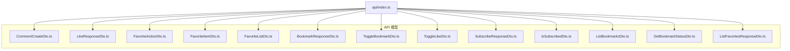
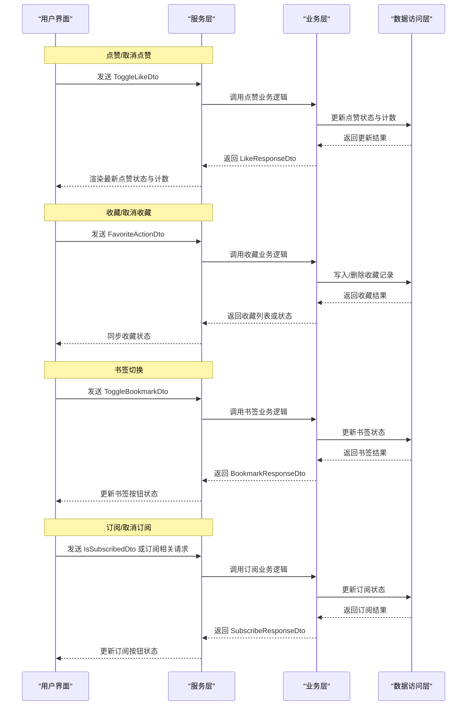
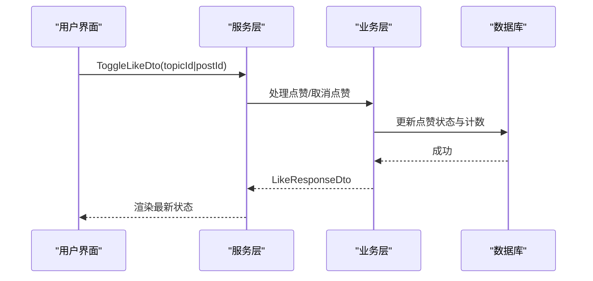
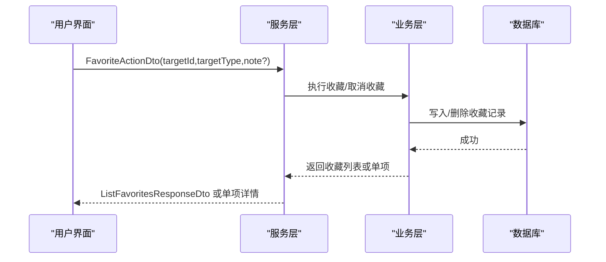
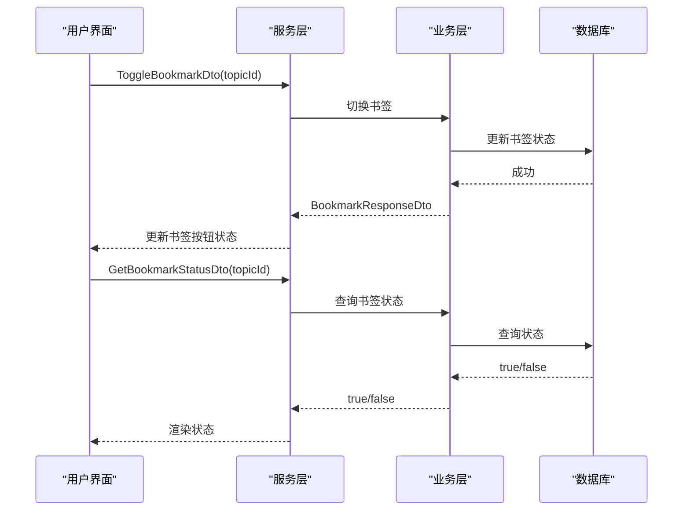
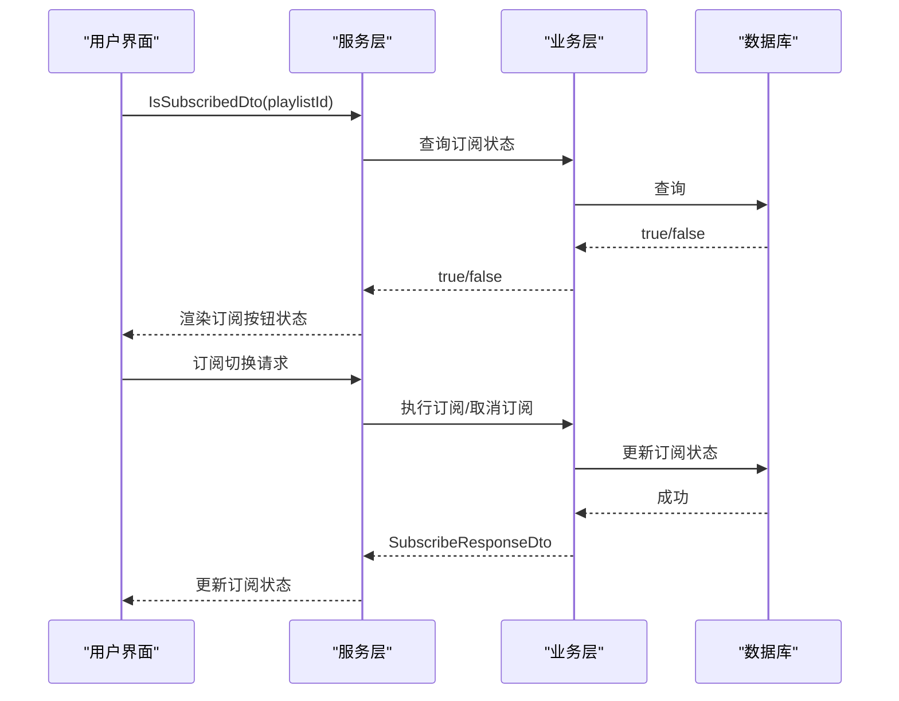
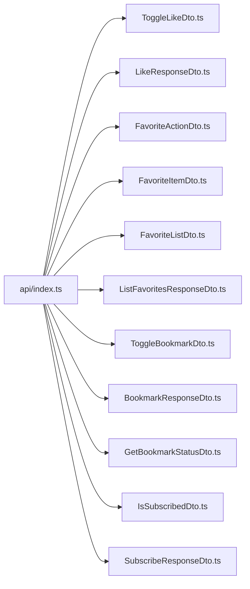

# 用户交互模型

<cite>
**本文引用的文件**
- [CommentCreateDto.ts](file://src/api/models/CommentCreateDto.ts)
- [LikeResponseDto.ts](file://src/api/models/LikeResponseDto.ts)
- [FavoriteActionDto.ts](file://src/api/models/FavoriteActionDto.ts)
- [FavoriteItemDto.ts](file://src/api/models/FavoriteItemDto.ts)
- [FavoriteListDto.ts](file://src/api/models/FavoriteListDto.ts)
- [BookmarkResponseDto.ts](file://src/api/models/BookmarkResponseDto.ts)
- [ToggleBookmarkDto.ts](file://src/api/models/ToggleBookmarkDto.ts)
- [ToggleLikeDto.ts](file://src/api/models/ToggleLikeDto.ts)
- [SubscribeResponseDto.ts](file://src/api/models/SubscribeResponseDto.ts)
- [IsSubscribedDto.ts](file://src/api/models/IsSubscribedDto.ts)
- [ListBookmarksDto.ts](file://src/api/models/ListBookmarksDto.ts)
- [GetBookmarkStatusDto.ts](file://src/api/models/GetBookmarkStatusDto.ts)
- [ListFavoritesResponseDto.ts](file://src/api/models/ListFavoritesResponseDto.ts)
- [api/index.ts](file://src/api/index.ts)
</cite>

## 目录
1. [引言](#引言)
2. [项目结构](#项目结构)
3. [核心组件](#核心组件)
4. [架构总览](#架构总览)
5. [详细组件分析](#详细组件分析)
6. [依赖关系分析](#依赖关系分析)
7. [性能考虑](#性能考虑)
8. [故障排查指南](#故障排查指南)
9. [结论](#结论)
10. [附录](#附录)

## 引言
本技术文档聚焦于用户交互相关的核心数据模型，涵盖评论创建、点赞、收藏、书签、订阅等行为的数据结构与业务逻辑。通过对各 DTO 的字段定义、取值范围、可选性与约束进行系统化梳理，并结合调用流程与状态管理，帮助开发者快速理解前端与后端之间的数据契约，确保交互功能的正确实现与性能优化。

## 项目结构
用户交互模型位于 API 层的数据契约目录中，采用按功能域划分的模型组织方式，便于在服务层与控制器层之间传递一致的数据结构。

**图表来源**
- [api/index.ts](file://src/api/index.ts#L451-L471)
- [CommentCreateDto.ts](file://src/api/models/CommentCreateDto.ts#L1-L8)
- [LikeResponseDto.ts](file://src/api/models/LikeResponseDto.ts#L1-L16)
- [FavoriteActionDto.ts](file://src/api/models/FavoriteActionDto.ts#L1-L31)
- [FavoriteItemDto.ts](file://src/api/models/FavoriteItemDto.ts#L1-L47)
- [FavoriteListDto.ts](file://src/api/models/FavoriteListDto.ts#L1-L21)
- [BookmarkResponseDto.ts](file://src/api/models/BookmarkResponseDto.ts#L1-L12)
- [ToggleBookmarkDto.ts](file://src/api/models/ToggleBookmarkDto.ts#L1-L12)
- [ToggleLikeDto.ts](file://src/api/models/ToggleLikeDto.ts#L1-L16)
- [SubscribeResponseDto.ts](file://src/api/models/SubscribeResponseDto.ts#L1-L12)
- [IsSubscribedDto.ts](file://src/api/models/IsSubscribedDto.ts#L1-L12)
- [ListBookmarksDto.ts](file://src/api/models/ListBookmarksDto.ts#L1-L15)
- [GetBookmarkStatusDto.ts](file://src/api/models/GetBookmarkStatusDto.ts#L1-L11)
- [ListFavoritesResponseDto.ts](file://src/api/models/ListFavoritesResponseDto.ts#L1-L12)

**章节来源**
- [api/index.ts](file://src/api/index.ts#L451-L471)

## 核心组件
本节对关键用户交互数据模型进行逐项解析，明确字段含义、约束与典型使用场景。

- 评论创建
  - 模型：CommentCreateDto
  - 用途：提交新评论时的输入载体
  - 字段要点：当前文件未声明具体字段，实际字段以接口定义为准
  - 参考路径：[CommentCreateDto.ts](file://src/api/models/CommentCreateDto.ts#L1-L8)

- 点赞响应
  - 模型：LikeResponseDto
  - 字段：
    - liked：布尔，表示当前用户是否已点赞
    - likeCount：整数，点赞总数
  - 典型场景：点击“点赞”或“取消点赞”后的状态更新与计数返回
  - 参考路径：[LikeResponseDto.ts](file://src/api/models/LikeResponseDto.ts#L1-L16)

- 收藏操作
  - 模型：FavoriteActionDto
  - 字段：
    - targetId：字符串，目标资源 ID
    - targetType：枚举，目标类型（torrent/movie/series/playlist）
    - note：可选，备注
  - 验证规则：
    - targetId 必填且非空
    - targetType 必须为允许值之一
    - note 可选
  - 参考路径：[FavoriteActionDto.ts](file://src/api/models/FavoriteActionDto.ts#L1-L31)

- 收藏条目详情
  - 模型：FavoriteItemDto
  - 字段：
    - id：收藏记录 ID
    - targetId：目标资源 ID
    - targetType：目标类型枚举
    - targetTitle/targetCover：目标资源标题与封面信息（可选）
    - note：备注（可选）
    - createdAt：收藏时间
  - 参考路径：[FavoriteItemDto.ts](file://src/api/models/FavoriteItemDto.ts#L1-L47)

- 收藏列表查询
  - 模型：FavoriteListDto
  - 字段：
    - targetType：可选，按类型过滤
    - page/limit：分页参数
  - 参考路径：[FavoriteListDto.ts](file://src/api/models/FavoriteListDto.ts#L1-L21)

- 收藏列表响应
  - 模型：ListFavoritesResponseDto
  - 字段：
    - items：收藏条目数组
    - total/page/limit：分页统计
  - 参考路径：[ListFavoritesResponseDto.ts](file://src/api/models/ListFavoritesResponseDto.ts#L1-L12)

- 书签响应
  - 模型：BookmarkResponseDto
  - 字段：
    - bookmarked：布尔，表示是否已收藏
  - 参考路径：[BookmarkResponseDto.ts](file://src/api/models/BookmarkResponseDto.ts#L1-L12)

- 切换书签
  - 模型：ToggleBookmarkDto
  - 字段：
    - topicId：话题 ID
  - 参考路径：[ToggleBookmarkDto.ts](file://src/api/models/ToggleBookmarkDto.ts#L1-L12)

- 获取书签状态
  - 模型：GetBookmarkStatusDto
  - 字段：
    - topicId：话题 ID
  - 参考路径：[GetBookmarkStatusDto.ts](file://src/api/models/GetBookmarkStatusDto.ts#L1-L11)

- 书签列表查询
  - 模型：ListBookmarksDto
  - 字段：
    - page/limit：分页参数
  - 参考路径：[ListBookmarksDto.ts](file://src/api/models/ListBookmarksDto.ts#L1-L15)

- 点赞切换
  - 模型：ToggleLikeDto
  - 字段：
    - topicId/postId：二选一，分别对应话题或回复
  - 参考路径：[ToggleLikeDto.ts](file://src/api/models/ToggleLikeDto.ts#L1-L16)

- 订阅响应
  - 模型：SubscribeResponseDto
  - 字段：
    - subscribed：布尔，当前订阅状态
  - 参考路径：[SubscribeResponseDto.ts](file://src/api/models/SubscribeResponseDto.ts#L1-L12)

- 订阅状态查询
  - 模型：IsSubscribedDto
  - 字段：
    - playlistId：片单 ID
  - 参考路径：[IsSubscribedDto.ts](file://src/api/models/IsSubscribedDto.ts#L1-L12)

**章节来源**
- [CommentCreateDto.ts](file://src/api/models/CommentCreateDto.ts#L1-L8)
- [LikeResponseDto.ts](file://src/api/models/LikeResponseDto.ts#L1-L16)
- [FavoriteActionDto.ts](file://src/api/models/FavoriteActionDto.ts#L1-L31)
- [FavoriteItemDto.ts](file://src/api/models/FavoriteItemDto.ts#L1-L47)
- [FavoriteListDto.ts](file://src/api/models/FavoriteListDto.ts#L1-L21)
- [ListFavoritesResponseDto.ts](file://src/api/models/ListFavoritesResponseDto.ts#L1-L12)
- [BookmarkResponseDto.ts](file://src/api/models/BookmarkResponseDto.ts#L1-L12)
- [ToggleBookmarkDto.ts](file://src/api/models/ToggleBookmarkDto.ts#L1-L12)
- [GetBookmarkStatusDto.ts](file://src/api/models/GetBookmarkStatusDto.ts#L1-L11)
- [ListBookmarksDto.ts](file://src/api/models/ListBookmarksDto.ts#L1-L15)
- [ToggleLikeDto.ts](file://src/api/models/ToggleLikeDto.ts#L1-L16)
- [SubscribeResponseDto.ts](file://src/api/models/SubscribeResponseDto.ts#L1-L12)
- [IsSubscribedDto.ts](file://src/api/models/IsSubscribedDto.ts#L1-L12)

## 架构总览
下图展示了用户在前端触发交互动作后，到后端处理与返回结果的整体流程。该流程覆盖点赞、收藏、书签与订阅等常见用户行为。

[此图为概念性流程示意，不直接映射具体源文件，故无图表来源]

## 详细组件分析

### 点赞交互（ToggleLikeDto 与 LikeResponseDto）
- 数据流
  - 前端根据用户点击发送 ToggleLikeDto（topicId 或 postId 二选一）
  - 服务层调用业务逻辑，更新数据库中的点赞状态与计数
  - 返回 LikeResponseDto，包含 liked 与 likeCount
- 状态管理
  - 前端应缓存当前资源的点赞状态，避免重复请求
  - 成功后立即更新 UI 并回写本地状态
- 性能建议
  - 使用防抖/去抖减少频繁点击导致的重复请求
  - 批量更新计数，降低网络往返

**图表来源**
- [ToggleLikeDto.ts](file://src/api/models/ToggleLikeDto.ts#L1-L16)
- [LikeResponseDto.ts](file://src/api/models/LikeResponseDto.ts#L1-L16)

**章节来源**
- [ToggleLikeDto.ts](file://src/api/models/ToggleLikeDto.ts#L1-L16)
- [LikeResponseDto.ts](file://src/api/models/LikeResponseDto.ts#L1-L16)

### 收藏交互（FavoriteActionDto、FavoriteItemDto、FavoriteListDto、ListFavoritesResponseDto）
- 数据流
  - 前端发送 FavoriteActionDto（targetId、targetType、note）
  - 服务层执行收藏/取消收藏，返回收藏列表或单项详情
  - 列表查询使用 FavoriteListDto，响应为 ListFavoritesResponseDto
- 状态管理
  - 前端维护收藏状态映射（如 id->bookmarked），用于即时反馈
  - 列表分页加载，支持 targetType 过滤
- 性能建议
  - 对收藏列表启用本地缓存与增量更新
  - 在批量收藏/取消收藏时合并请求，减少网络开销

**图表来源**
- [FavoriteActionDto.ts](file://src/api/models/FavoriteActionDto.ts#L1-L31)
- [FavoriteItemDto.ts](file://src/api/models/FavoriteItemDto.ts#L1-L47)
- [FavoriteListDto.ts](file://src/api/models/FavoriteListDto.ts#L1-L21)
- [ListFavoritesResponseDto.ts](file://src/api/models/ListFavoritesResponseDto.ts#L1-L12)

**章节来源**
- [FavoriteActionDto.ts](file://src/api/models/FavoriteActionDto.ts#L1-L31)
- [FavoriteItemDto.ts](file://src/api/models/FavoriteItemDto.ts#L1-L47)
- [FavoriteListDto.ts](file://src/api/models/FavoriteListDto.ts#L1-L21)
- [ListFavoritesResponseDto.ts](file://src/api/models/ListFavoritesResponseDto.ts#L1-L12)

### 书签交互（ToggleBookmarkDto、BookmarkResponseDto、GetBookmarkStatusDto、ListBookmarksDto）
- 数据流
  - 切换：发送 ToggleBookmarkDto（topicId），返回 BookmarkResponseDto（bookmarked）
  - 查询状态：发送 GetBookmarkStatusDto（topicId），返回布尔状态
  - 列表：使用 ListBookmarksDto（page/limit）分页获取书签列表
- 状态管理
  - 前端缓存每个 topicId 的书签状态，避免重复查询
  - 列表懒加载，滚动到底部继续分页
- 性能建议
  - 对书签状态使用弱引用缓存，定期清理过期键
  - 列表分页采用虚拟滚动优化长列表渲染

**图表来源**
- [ToggleBookmarkDto.ts](file://src/api/models/ToggleBookmarkDto.ts#L1-L12)
- [BookmarkResponseDto.ts](file://src/api/models/BookmarkResponseDto.ts#L1-L12)
- [GetBookmarkStatusDto.ts](file://src/api/models/GetBookmarkStatusDto.ts#L1-L11)

**章节来源**
- [ToggleBookmarkDto.ts](file://src/api/models/ToggleBookmarkDto.ts#L1-L12)
- [BookmarkResponseDto.ts](file://src/api/models/BookmarkResponseDto.ts#L1-L12)
- [GetBookmarkStatusDto.ts](file://src/api/models/GetBookmarkStatusDto.ts#L1-L11)
- [ListBookmarksDto.ts](file://src/api/models/ListBookmarksDto.ts#L1-L15)

### 订阅交互（IsSubscribedDto、SubscribeResponseDto）
- 数据流
  - 查询：发送 IsSubscribedDto（playlistId），返回订阅状态
  - 切换：调用订阅相关接口，返回 SubscribeResponseDto（subscribed）
- 状态管理
  - 前端维护每个 playlistId 的订阅状态映射
  - 成功后立即刷新按钮状态与列表展示
- 性能建议
  - 对订阅状态进行本地持久化，应用启动时预热
  - 批量订阅/取消订阅时合并请求，避免频繁网络请求

**图表来源**
- [IsSubscribedDto.ts](file://src/api/models/IsSubscribedDto.ts#L1-L12)
- [SubscribeResponseDto.ts](file://src/api/models/SubscribeResponseDto.ts#L1-L12)

**章节来源**
- [IsSubscribedDto.ts](file://src/api/models/IsSubscribedDto.ts#L1-L12)
- [SubscribeResponseDto.ts](file://src/api/models/SubscribeResponseDto.ts#L1-L12)

## 依赖关系分析
- 模块导出
  - api/index.ts 统一导出上述模型，便于上层模块按需引入
- 关键依赖链
  - ToggleLikeDto -> LikeResponseDto
  - FavoriteActionDto -> FavoriteItemDto / ListFavoritesResponseDto
  - ToggleBookmarkDto -> BookmarkResponseDto / GetBookmarkStatusDto
  - IsSubscribedDto -> SubscribeResponseDto

**图表来源**
- [api/index.ts](file://src/api/index.ts#L451-L471)
- [ToggleLikeDto.ts](file://src/api/models/ToggleLikeDto.ts#L1-L16)
- [LikeResponseDto.ts](file://src/api/models/LikeResponseDto.ts#L1-L16)
- [FavoriteActionDto.ts](file://src/api/models/FavoriteActionDto.ts#L1-L31)
- [FavoriteItemDto.ts](file://src/api/models/FavoriteItemDto.ts#L1-L47)
- [FavoriteListDto.ts](file://src/api/models/FavoriteListDto.ts#L1-L21)
- [ListFavoritesResponseDto.ts](file://src/api/models/ListFavoritesResponseDto.ts#L1-L12)
- [ToggleBookmarkDto.ts](file://src/api/models/ToggleBookmarkDto.ts#L1-L12)
- [BookmarkResponseDto.ts](file://src/api/models/BookmarkResponseDto.ts#L1-L12)
- [GetBookmarkStatusDto.ts](file://src/api/models/GetBookmarkStatusDto.ts#L1-L11)
- [IsSubscribedDto.ts](file://src/api/models/IsSubscribedDto.ts#L1-L12)
- [SubscribeResponseDto.ts](file://src/api/models/SubscribeResponseDto.ts#L1-L12)

**章节来源**
- [api/index.ts](file://src/api/index.ts#L451-L471)

## 性能考虑
- 请求合并
  - 对同一页面内的多个交互（如批量点赞、收藏）进行合并请求，减少网络往返
- 缓存策略
  - 为点赞、收藏、书签、订阅状态建立本地缓存，优先命中缓存再发起网络请求
  - 对列表类数据采用分页+增量更新，避免全量重载
- 防抖与去抖
  - 对高频交互（如点赞）使用防抖，避免短时间内的重复请求
- 渲染优化
  - 使用虚拟列表渲染长列表
  - 对按钮状态进行细粒度更新，避免整页重绘

[本节为通用性能建议，无需特定文件引用]

## 故障排查指南
- 字段缺失或类型错误
  - 症状：接口报错或返回空数据
  - 排查：确认 DTO 字段是否完整（如 targetId、targetType、topicId 等）
  - 参考路径：[FavoriteActionDto.ts](file://src/api/models/FavoriteActionDto.ts#L1-L31)、[ToggleBookmarkDto.ts](file://src/api/models/ToggleBookmarkDto.ts#L1-L12)、[ToggleLikeDto.ts](file://src/api/models/ToggleLikeDto.ts#L1-L16)
- 状态不一致
  - 症状：UI 显示与后端状态不符
  - 排查：检查前端缓存是否及时更新；必要时主动调用状态查询接口
  - 参考路径：[LikeResponseDto.ts](file://src/api/models/LikeResponseDto.ts#L1-L16)、[BookmarkResponseDto.ts](file://src/api/models/BookmarkResponseDto.ts#L1-L12)、[SubscribeResponseDto.ts](file://src/api/models/SubscribeResponseDto.ts#L1-L12)
- 分页异常
  - 症状：列表加载重复或缺页
  - 排查：核对 page/limit 参数与服务端分页实现的一致性
  - 参考路径：[FavoriteListDto.ts](file://src/api/models/FavoriteListDto.ts#L1-L21)、[ListBookmarksDto.ts](file://src/api/models/ListBookmarksDto.ts#L1-L15)

**章节来源**
- [FavoriteActionDto.ts](file://src/api/models/FavoriteActionDto.ts#L1-L31)
- [ToggleBookmarkDto.ts](file://src/api/models/ToggleBookmarkDto.ts#L1-L12)
- [ToggleLikeDto.ts](file://src/api/models/ToggleLikeDto.ts#L1-L16)
- [LikeResponseDto.ts](file://src/api/models/LikeResponseDto.ts#L1-L16)
- [BookmarkResponseDto.ts](file://src/api/models/BookmarkResponseDto.ts#L1-L12)
- [SubscribeResponseDto.ts](file://src/api/models/SubscribeResponseDto.ts#L1-L12)
- [FavoriteListDto.ts](file://src/api/models/FavoriteListDto.ts#L1-L21)
- [ListBookmarksDto.ts](file://src/api/models/ListBookmarksDto.ts#L1-L15)

## 结论
通过统一的数据模型与清晰的交互流程，用户在平台上的点赞、收藏、书签与订阅行为得以高效、一致地实现。建议在开发过程中严格遵循 DTO 的字段约束与取值范围，并结合缓存与请求合并等策略提升用户体验与系统性能。

[本节为总结性内容，无需特定文件引用]

## 附录
- 常见问题速查
  - 如何判断用户是否已点赞/收藏/书签/订阅？使用对应的查询 DTO 并读取响应中的布尔字段
  - 如何批量更新状态？在前端聚合多个操作，合并为一次请求，减少网络开销
- 最佳实践清单
  - 始终校验 DTO 字段完整性
  - 对热点数据建立本地缓存并设置合理的失效策略
  - 对高频交互进行防抖与去抖处理
  - 使用分页与虚拟滚动优化长列表渲染

[本节为通用指导，无需特定文件引用]