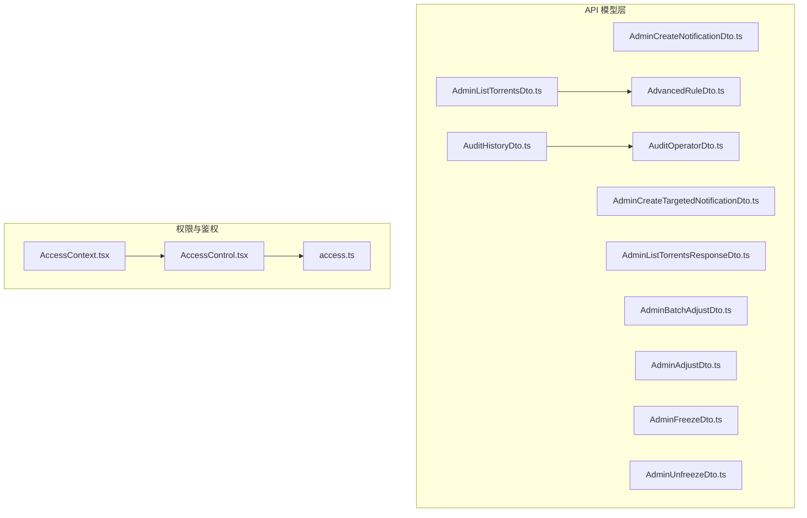
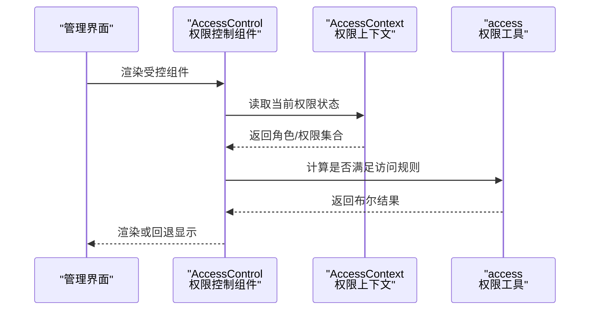
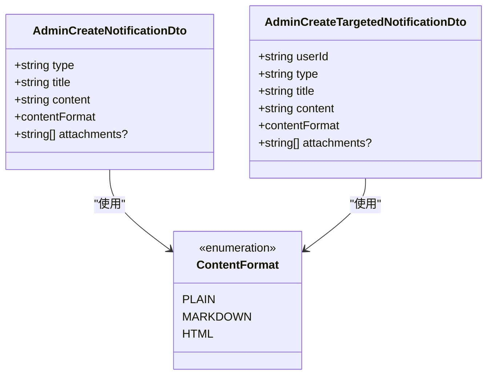
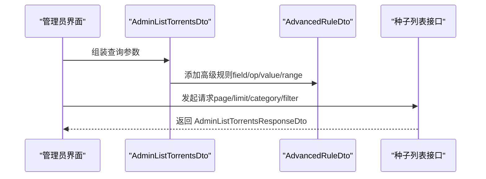
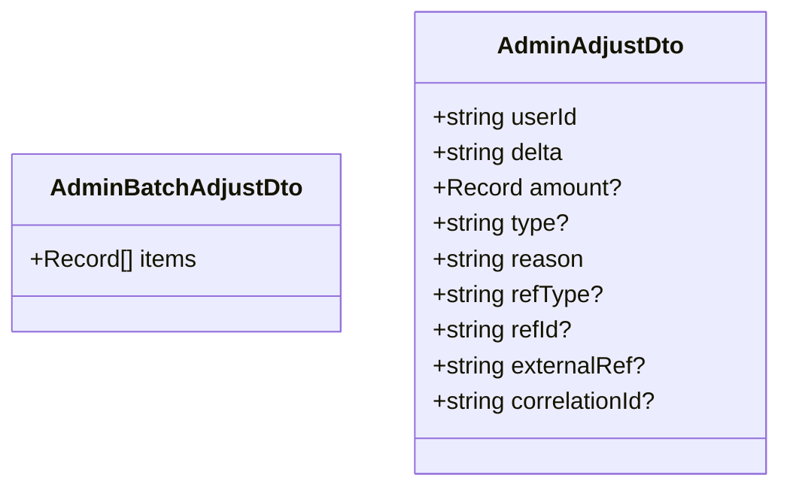
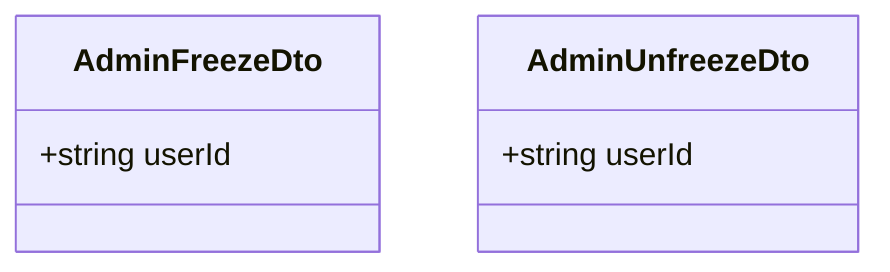
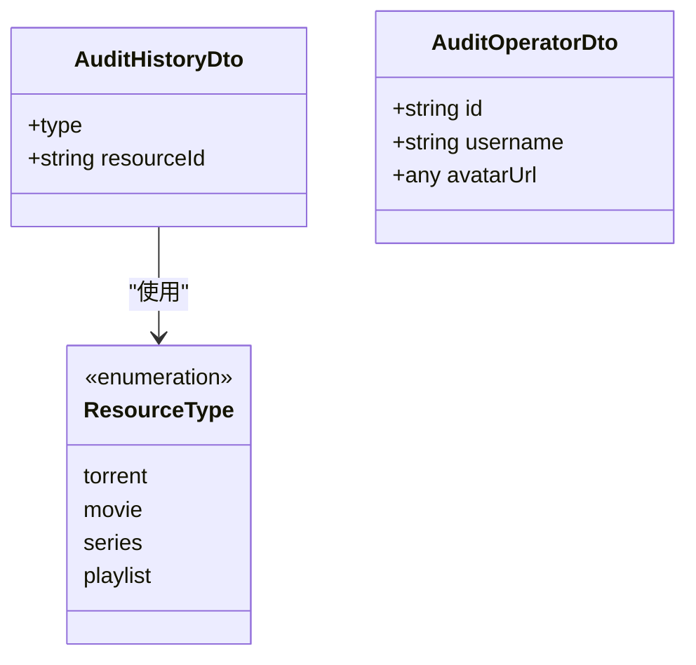
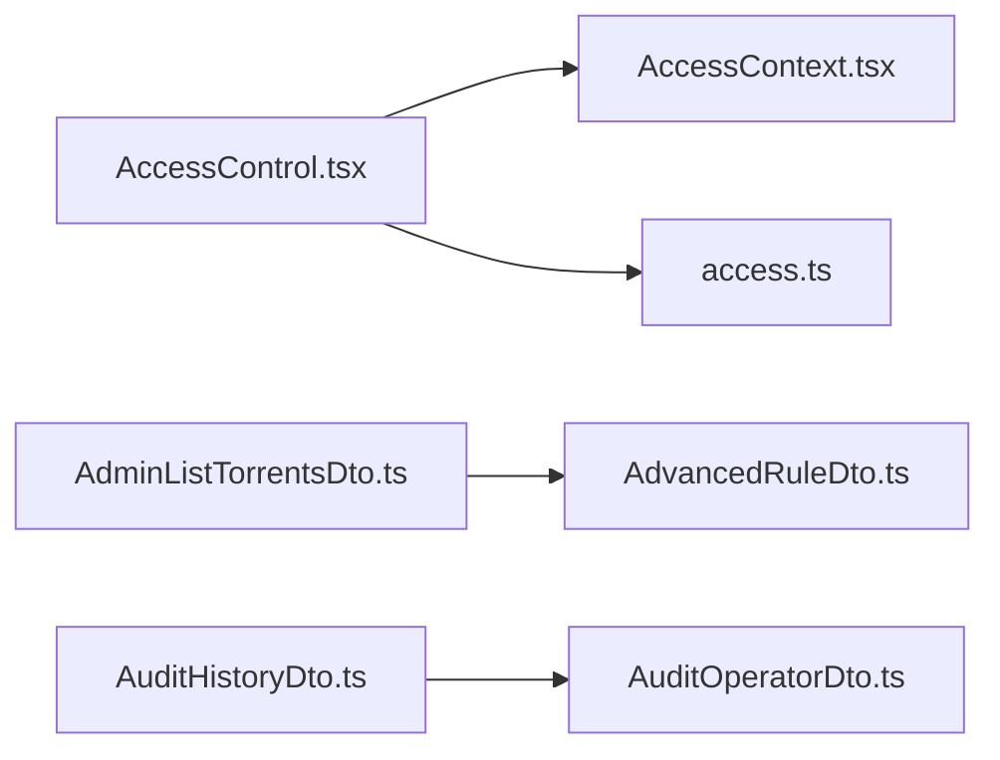

# 管理员操作模型

<cite>
**本文档引用的文件**
- [AdminCreateNotificationDto.ts](file://src/api/models/AdminCreateNotificationDto.ts)
- [AdminCreateTargetedNotificationDto.ts](file://src/api/models/AdminCreateTargetedNotificationDto.ts)
- [AdminListTorrentsDto.ts](file://src/api/models/AdminListTorrentsDto.ts)
- [AdminListTorrentsResponseDto.ts](file://src/api/models/AdminListTorrentsResponseDto.ts)
- [AdminBatchAdjustDto.ts](file://src/api/models/AdminBatchAdjustDto.ts)
- [AdminAdjustDto.ts](file://src/api/models/AdminAdjustDto.ts)
- [AdminFreezeDto.ts](file://src/api/models/AdminFreezeDto.ts)
- [AdminUnfreezeDto.ts](file://src/api/models/AdminUnfreezeDto.ts)
- [AdvancedRuleDto.ts](file://src/api/models/AdvancedRuleDto.ts)
- [AuditHistoryDto.ts](file://src/api/models/AuditHistoryDto.ts)
- [AuditOperatorDto.ts](file://src/api/models/AuditOperatorDto.ts)
- [AccessControl.tsx](file://src/permissions/AccessControl.tsx)
- [AccessContext.tsx](file://src/context/AccessContext.tsx)
- [access.ts](file://src/utils/access.ts)
</cite>

## 目录
1. [简介](#简介)
2. [项目结构](#项目结构)
3. [核心组件](#核心组件)
4. [架构总览](#架构总览)
5. [详细组件分析](#详细组件分析)
6. [依赖分析](#依赖分析)
7. [性能考虑](#性能考虑)
8. [故障排除指南](#故障排除指南)
9. [结论](#结论)
10. [附录](#附录)

## 简介
本文件面向管理员操作的数据模型与权限控制，系统性梳理以下能力的数据结构与业务规则：
- 通知创建：通用通知与定向通知
- 种子列表查询：分页、筛选、排序与高级规则
- 批量调账：批量处理奖金余额变动
- 封禁/解封：用户账户状态变更
- 审核流程：资源类型与审计追踪
- 权限验证：前端权限控制与鉴权策略
- 安全与审计：幂等键、关联ID、审计历史

目标是帮助开发者与运维人员准确理解各模型字段、约束条件、调用流程与安全控制点。

## 项目结构
管理员相关模型位于 API 模型层，权限控制与鉴权逻辑分布在前端上下文与工具模块中。下图展示与管理员操作模型相关的文件组织与职责划分：



图表来源
- [AdminListTorrentsDto.ts](file://src/api/models/AdminListTorrentsDto.ts#L1-L81)
- [AdvancedRuleDto.ts](file://src/api/models/AdvancedRuleDto.ts#L1-L46)
- [AdminListTorrentsResponseDto.ts](file://src/api/models/AdminListTorrentsResponseDto.ts#L1-L12)
- [AdminCreateNotificationDto.ts](file://src/api/models/AdminCreateNotificationDto.ts#L1-L38)
- [AdminCreateTargetedNotificationDto.ts](file://src/api/models/AdminCreateTargetedNotificationDto.ts#L1-L42)
- [AdminBatchAdjustDto.ts](file://src/api/models/AdminBatchAdjustDto.ts#L1-L12)
- [AdminAdjustDto.ts](file://src/api/models/AdminAdjustDto.ts#L1-L44)
- [AdminFreezeDto.ts](file://src/api/models/AdminFreezeDto.ts#L1-L12)
- [AdminUnfreezeDto.ts](file://src/api/models/AdminUnfreezeDto.ts#L1-L12)
- [AuditHistoryDto.ts](file://src/api/models/AuditHistoryDto.ts#L1-L27)
- [AuditOperatorDto.ts](file://src/api/models/AuditOperatorDto.ts#L1-L20)
- [AccessContext.tsx](file://src/context/AccessContext.tsx#L1-L181)
- [AccessControl.tsx](file://src/permissions/AccessControl.tsx#L1-L43)
- [access.ts](file://src/utils/access.ts#L1-L65)

章节来源
- [AdminCreateNotificationDto.ts](file://src/api/models/AdminCreateNotificationDto.ts#L1-L38)
- [AdminCreateTargetedNotificationDto.ts](file://src/api/models/AdminCreateTargetedNotificationDto.ts#L1-L42)
- [AdminListTorrentsDto.ts](file://src/api/models/AdminListTorrentsDto.ts#L1-L81)
- [AdminListTorrentsResponseDto.ts](file://src/api/models/AdminListTorrentsResponseDto.ts#L1-L12)
- [AdminBatchAdjustDto.ts](file://src/api/models/AdminBatchAdjustDto.ts#L1-L12)
- [AdminAdjustDto.ts](file://src/api/models/AdminAdjustDto.ts#L1-L44)
- [AdminFreezeDto.ts](file://src/api/models/AdminFreezeDto.ts#L1-L12)
- [AdminUnfreezeDto.ts](file://src/api/models/AdminUnfreezeDto.ts#L1-L12)
- [AdvancedRuleDto.ts](file://src/api/models/AdvancedRuleDto.ts#L1-L46)
- [AuditHistoryDto.ts](file://src/api/models/AuditHistoryDto.ts#L1-L27)
- [AuditOperatorDto.ts](file://src/api/models/AuditOperatorDto.ts#L1-L20)
- [AccessContext.tsx](file://src/context/AccessContext.tsx#L1-L181)
- [AccessControl.tsx](file://src/permissions/AccessControl.tsx#L1-L43)
- [access.ts](file://src/utils/access.ts#L1-L65)

## 核心组件
本节对管理员操作涉及的关键数据模型进行逐项说明，包括字段语义、取值范围、约束条件与典型用途。

- 通知创建（AdminCreateNotificationDto）
  - 字段要点：通知类型、标题、内容、内容格式（plain/markdown/html）、可选附件URL列表
  - 适用场景：面向全体用户的公告发布、站务通知
  - 数据验证建议：校验内容长度、格式枚举值、附件URL合法性
  - 章节来源
    - [AdminCreateNotificationDto.ts](file://src/api/models/AdminCreateNotificationDto.ts#L5-L26)

- 定向通知（AdminCreateTargetedNotificationDto）
  - 字段要点：目标用户ID、通知类型、标题、内容、内容格式、可选附件URL列表
  - 适用场景：针对特定用户的个性化提醒
  - 数据验证建议：校验用户ID存在性、内容格式枚举值、附件URL合法性
  - 章节来源
    - [AdminCreateTargetedNotificationDto.ts](file://src/api/models/AdminCreateTargetedNotificationDto.ts#L5-L29)

- 种子列表查询（AdminListTorrentsDto）
  - 字段要点：分页参数（page/limit）、分类过滤（category）、上传者ID（uploaderId）、启用/可见/封禁状态（isEnabled/visible/isBanned）、排序字段（sortBy）与方向（order）、高级规则逻辑（logic）与规则数组（rules）
  - 排序字段：uploadedAt/updatedAt/size/seeders/downloads/approvedAt/price
  - 排序方向：ASC/DESC
  - 高级规则逻辑：AND/OR
  - 规则对象（AdvancedRuleDto）：字段名、运算符（op）、匹配值或范围值
  - 适用场景：后台种子检索、批量治理、统计分析
  - 数据验证建议：分页参数边界、排序字段与方向枚举、高级规则字段与运算符一致性
  - 章节来源
    - [AdminListTorrentsDto.ts](file://src/api/models/AdminListTorrentsDto.ts#L6-L50)
    - [AdvancedRuleDto.ts](file://src/api/models/AdvancedRuleDto.ts#L5-L21)

- 种子列表响应（AdminListTorrentsResponseDto）
  - 字段要点：items（条目数组）、total（总数）、page、limit
  - 适用场景：分页展示查询结果
  - 章节来源
    - [AdminListTorrentsResponseDto.ts](file://src/api/models/AdminListTorrentsResponseDto.ts#L5-L10)

- 批量调账（AdminBatchAdjustDto）
  - 字段要点：items（批量调账条目数组）
  - 适用场景：批量奖金余额调整
  - 数据验证建议：每条目字段完整性与类型校验
  - 章节来源
    - [AdminBatchAdjustDto.ts](file://src/api/models/AdminBatchAdjustDto.ts#L5-L10)

- 单条调账（AdminAdjustDto）
  - 字段要点：目标用户ID、变动值（delta，字符串大整数，支持负数）、变动数量（amount，正数，需配合type）、变动类型（type，如add/reduce）、调账原因（reason，必填）、业务引用类型（refType）与ID（refId）、幂等键（externalRef）、关联ID（correlationId）
  - 适用场景：单用户奖金余额精确调整
  - 数据验证建议：reason必填、amount与type一致性、delta格式与数值范围、幂等键唯一性
  - 章节来源
    - [AdminAdjustDto.ts](file://src/api/models/AdminAdjustDto.ts#L5-L42)

- 封禁（AdminFreezeDto）
  - 字段要点：目标用户ID（userId）
  - 适用场景：临时限制用户账户
  - 数据验证建议：用户ID存在性
  - 章节来源
    - [AdminFreezeDto.ts](file://src/api/models/AdminFreezeDto.ts#L5-L10)

- 解封（AdminUnfreezeDto）
  - 字段要点：目标用户ID（userId）
  - 适用场景：恢复用户账户
  - 数据验证建议：用户ID存在性
  - 章节来源
    - [AdminUnfreezeDto.ts](file://src/api/models/AdminUnfreezeDto.ts#L5-L10)

- 审核历史（AuditHistoryDto）
  - 字段要点：资源类型（type，torrent/movie/series/playlist）、资源ID（resourceId）
  - 适用场景：审计追踪与溯源
  - 章节来源
    - [AuditHistoryDto.ts](file://src/api/models/AuditHistoryDto.ts#L5-L14)

- 审核操作员（AuditOperatorDto）
  - 字段要点：用户ID、用户名、头像URL（可为空）
  - 适用场景：记录操作人信息
  - 章节来源
    - [AuditOperatorDto.ts](file://src/api/models/AuditOperatorDto.ts#L5-L17)

## 架构总览
管理员操作的前端权限控制与数据模型交互如下所示：



图表来源
- [AccessControl.tsx](file://src/permissions/AccessControl.tsx#L17-L41)
- [AccessContext.tsx](file://src/context/AccessContext.tsx#L83-L154)
- [access.ts](file://src/utils/access.ts#L16-L63)

## 详细组件分析

### 通知创建模型
- 类图概览（模型类与枚举）



图表来源
- [AdminCreateNotificationDto.ts](file://src/api/models/AdminCreateNotificationDto.ts#L5-L36)
- [AdminCreateTargetedNotificationDto.ts](file://src/api/models/AdminCreateTargetedNotificationDto.ts#L5-L40)

- 业务规则与验证要点
  - 通知类型与标题不能为空；内容长度与格式需符合平台规范
  - 内容格式必须为枚举值之一；附件URL应为有效链接
  - 定向通知需校验目标用户ID存在性
  - 建议引入幂等键避免重复推送
  - 章节来源
    - [AdminCreateNotificationDto.ts](file://src/api/models/AdminCreateNotificationDto.ts#L5-L26)
    - [AdminCreateTargetedNotificationDto.ts](file://src/api/models/AdminCreateTargetedNotificationDto.ts#L5-L29)

### 种子列表查询模型
- 类图概览（查询模型与高级规则）

```mermaid
classDiagram
class AdminListTorrentsDto {
+number page?
+number limit?
+string category?
+string uploaderId?
+boolean isEnabled?
+boolean visible?
+boolean isBanned?
+sortBy
+order
+logic
+AdvancedRuleDto[] rules?
}
class AdvancedRuleDto {
+string field
+op
+any value?
+string[] range?
}
class SortBy {
<<enumeration>>
uploadedAt
updatedAt
size
seeders
downloads
approvedAt
price
}
class Order {
<<enumeration>>
ASC
DESC
}
class Logic {
<<enumeration>>
AND
OR
}
class Op {
<<enumeration>>
Equal
"Not Equal"
Like
"Not Like"
"Like Left"
"Like Right"
"Not In"
In
Between
"Greater Than"
"Greater Than or Equal"
"Less Than"
"Less Than or Equal"
"Is Null"
"Is Not Null"
}
AdminListTorrentsDto --> SortBy : "使用"
AdminListTorrentsDto --> Order : "使用"
AdminListTorrentsDto --> Logic : "使用"
AdminListTorrentsDto --> AdvancedRuleDto : "包含"
AdvancedRuleDto --> Op : "使用"
```

图表来源
- [AdminListTorrentsDto.ts](file://src/api/models/AdminListTorrentsDto.ts#L6-L79)
- [AdvancedRuleDto.ts](file://src/api/models/AdvancedRuleDto.ts#L5-L44)

- 查询流程时序



图表来源
- [AdminListTorrentsDto.ts](file://src/api/models/AdminListTorrentsDto.ts#L6-L50)
- [AdvancedRuleDto.ts](file://src/api/models/AdvancedRuleDto.ts#L5-L21)
- [AdminListTorrentsResponseDto.ts](file://src/api/models/AdminListTorrentsResponseDto.ts#L5-L10)

- 业务规则与验证要点
  - 分页参数需在合理范围内；排序字段与方向必须为枚举值
  - 高级规则的字段名需与后端支持的索引一致；Between 需提供两元素范围
  - 多个规则之间由逻辑（AND/OR）组合，注意性能与索引匹配
  - 章节来源
    - [AdminListTorrentsDto.ts](file://src/api/models/AdminListTorrentsDto.ts#L52-L79)
    - [AdvancedRuleDto.ts](file://src/api/models/AdvancedRuleDto.ts#L23-L44)

### 批量调账与单条调账
- 类图概览（调账模型）



图表来源
- [AdminBatchAdjustDto.ts](file://src/api/models/AdminBatchAdjustDto.ts#L5-L10)
- [AdminAdjustDto.ts](file://src/api/models/AdminAdjustDto.ts#L5-L42)

- 业务规则与验证要点
  - 单条调账：reason 必填；amount 与 type 需配套；delta 支持负数表示减少
  - 批量调账：每条目需包含必要字段，建议引入幂等键 externalRef 避免重复入账
  - 关联ID correlationId 用于跨系统对账与审计
  - 章节来源
    - [AdminAdjustDto.ts](file://src/api/models/AdminAdjustDto.ts#L11-L42)
    - [AdminBatchAdjustDto.ts](file://src/api/models/AdminBatchAdjustDto.ts#L5-L10)

### 封禁与解封
- 类图概览（账户状态变更）



图表来源
- [AdminFreezeDto.ts](file://src/api/models/AdminFreezeDto.ts#L5-L10)
- [AdminUnfreezeDto.ts](file://src/api/models/AdminUnfreezeDto.ts#L5-L10)

- 业务规则与验证要点
  - 用户ID需存在且可识别；建议记录操作人与审计历史
  - 封禁/解封应具备明确原因与审批流程
  - 章节来源
    - [AdminFreezeDto.ts](file://src/api/models/AdminFreezeDto.ts#L5-L10)
    - [AdminUnfreezeDto.ts](file://src/api/models/AdminUnfreezeDto.ts#L5-L10)

### 审计与操作员
- 类图概览（审计模型）



图表来源
- [AuditHistoryDto.ts](file://src/api/models/AuditHistoryDto.ts#L5-L25)
- [AuditOperatorDto.ts](file://src/api/models/AuditOperatorDto.ts#L5-L18)

- 业务规则与验证要点
  - 资源类型需为枚举值之一；资源ID需存在且可关联
  - 操作员信息用于审计与追溯，建议统一记录时间戳与IP
  - 章节来源
    - [AuditHistoryDto.ts](file://src/api/models/AuditHistoryDto.ts#L15-L25)
    - [AuditOperatorDto.ts](file://src/api/models/AuditOperatorDto.ts#L5-L17)

## 依赖分析
- 模型间依赖
  - AdminListTorrentsDto 依赖 AdvancedRuleDto 进行复杂查询
  - 审核相关模型（AuditHistoryDto/AuditOperatorDto）独立存在，服务于审计追踪
- 前端权限依赖
  - AccessControl 组件依赖 AccessContext 提供的权限状态
  - access 工具函数负责权限判定逻辑，支持角色与权限的“与/或”组合



图表来源
- [AccessControl.tsx](file://src/permissions/AccessControl.tsx#L17-L41)
- [AccessContext.tsx](file://src/context/AccessContext.tsx#L83-L154)
- [access.ts](file://src/utils/access.ts#L16-L63)
- [AdminListTorrentsDto.ts](file://src/api/models/AdminListTorrentsDto.ts#L5-L50)
- [AdvancedRuleDto.ts](file://src/api/models/AdvancedRuleDto.ts#L5-L21)
- [AuditHistoryDto.ts](file://src/api/models/AuditHistoryDto.ts#L5-L14)
- [AuditOperatorDto.ts](file://src/api/models/AuditOperatorDto.ts#L5-L17)

章节来源
- [AccessControl.tsx](file://src/permissions/AccessControl.tsx#L1-L43)
- [AccessContext.tsx](file://src/context/AccessContext.tsx#L1-L181)
- [access.ts](file://src/utils/access.ts#L1-L65)
- [AdminListTorrentsDto.ts](file://src/api/models/AdminListTorrentsDto.ts#L1-L81)
- [AdvancedRuleDto.ts](file://src/api/models/AdvancedRuleDto.ts#L1-L46)
- [AuditHistoryDto.ts](file://src/api/models/AuditHistoryDto.ts#L1-L27)
- [AuditOperatorDto.ts](file://src/api/models/AuditOperatorDto.ts#L1-L20)

## 性能考虑
- 种子列表查询
  - 合理设置分页大小与排序字段，避免全表扫描
  - 高级规则尽量使用可索引字段，减少 Between 与模糊匹配的使用频率
- 调账操作
  - 批量调账建议分批提交并设置幂等键，降低重复处理成本
  - 单条调账需快速校验与落库，确保事务一致性
- 权限控制
  - 前端权限判定逻辑简单高效，避免在渲染路径上做重型计算
  - 权限数据懒加载与缓存结合，提升首屏与切换体验

## 故障排除指南
- 权限不生效
  - 检查 AccessContext 是否成功拉取聚合权限；确认用户名与角色/权限集合正确
  - 章节来源
    - [AccessContext.tsx](file://src/context/AccessContext.tsx#L102-L154)
    - [access.ts](file://src/utils/access.ts#L16-L63)

- 查询无结果或异常
  - 校验 AdminListTorrentsDto 的分页参数、排序字段与高级规则是否合法
  - 章节来源
    - [AdminListTorrentsDto.ts](file://src/api/models/AdminListTorrentsDto.ts#L52-L79)
    - [AdvancedRuleDto.ts](file://src/api/models/AdvancedRuleDto.ts#L23-L44)

- 调账失败
  - 核对 AdminAdjustDto 的 reason、amount/type、delta 格式与外部引用键
  - 章节来源
    - [AdminAdjustDto.ts](file://src/api/models/AdminAdjustDto.ts#L11-L42)

- 通知发送问题
  - 确认内容格式枚举值与附件URL有效性；定向通知需校验用户ID
  - 章节来源
    - [AdminCreateNotificationDto.ts](file://src/api/models/AdminCreateNotificationDto.ts#L5-L26)
    - [AdminCreateTargetedNotificationDto.ts](file://src/api/models/AdminCreateTargetedNotificationDto.ts#L5-L29)

## 结论
管理员操作模型围绕“通知、种子治理、资金调账、账户状态变更、审计追踪”五大维度构建，数据模型清晰、职责明确。结合前端权限控制与鉴权工具，可在保证安全的前提下高效完成后台管理任务。建议在生产环境中强化输入校验、审计日志与幂等控制，确保操作可追溯、可回滚、可监控。

## 附录
- 实现示例（步骤化说明）
  - 通知创建
    - 组装 AdminCreateNotificationDto 或 AdminCreateTargetedNotificationDto
    - 校验内容格式与附件URL
    - 调用对应接口并记录审计历史
  - 种子列表查询
    - 组装 AdminListTorrentsDto，按需添加 AdvancedRuleDto
    - 发起请求并解析 AdminListTorrentsResponseDto
  - 调账
    - 单条：AdminAdjustDto（含 reason、amount/type/delta）
    - 批量：AdminBatchAdjustDto（items 数组）
  - 账户状态
    - AdminFreezeDto / AdminUnfreezeDto（userId）
  - 审计
    - AuditHistoryDto（type/resourceId）+ AuditOperatorDto（id/username/avatarUrl）

- 安全控制措施
  - 幂等键 externalRef 与关联ID correlationId 用于防重与对账
  - 前端权限组件 AccessControl 与 access 工具保障最小权限原则
  - 审计历史与操作员信息用于责任追溯