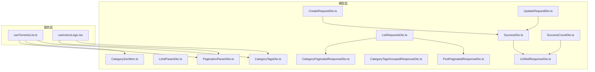
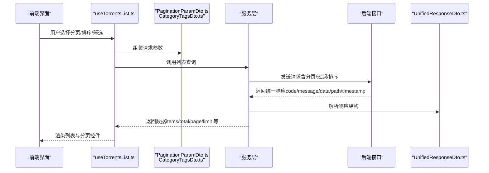
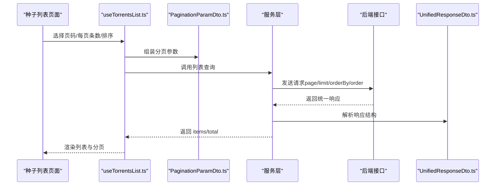
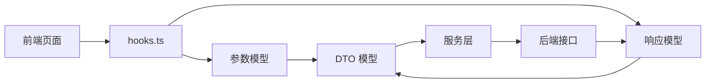

# 请求响应模型

<cite>
**本文引用的文件**
- [src/api/models/CreateRequestDto.ts](file://src/api/models/CreateRequestDto.ts)
- [src/api/models/UpdateRequestDto.ts](file://src/api/models/UpdateRequestDto.ts)
- [src/api/models/ListRequestsDto.ts](file://src/api/models/ListRequestsDto.ts)
- [src/api/models/SuccessDto.ts](file://src/api/models/SuccessDto.ts)
- [src/api/models/SuccessCountDto.ts](file://src/api/models/SuccessCountDto.ts)
- [src/api/models/PaginationParamDto.ts](file://src/api/models/PaginationParamDto.ts)
- [src/api/models/LimitParamDto.ts](file://src/api/models/LimitParamDto.ts)
- [src/api/models/UnifiedResponseDto.ts](file://src/api/models/UnifiedResponseDto.ts)
- [src/api/models/CategorySortItem.ts](file://src/api/models/CategorySortItem.ts)
- [src/api/models/CategoryTagsDto.ts](file://src/api/models/CategoryTagsDto.ts)
- [src/api/models/CategoryTagsGroupedResponseDto.ts](file://src/api/models/CategoryTagsGroupedResponseDto.ts)
- [src/api/models/CategoryPaginatedResponseDto.ts](file://src/api/models/CategoryPaginatedResponseDto.ts)
- [src/api/models/PostPaginatedResponseDto.ts](file://src/api/models/PostPaginatedResponseDto.ts)
- [src/modules/app/pages/TorrentsList/hooks/useTorrentsList.ts](file://src/modules/app/pages/TorrentsList/hooks/useTorrentsList.ts)
- [src/modules/admin/pages/users-security/users/UsersPage/useUsersLogic.tsx](file://src/modules/admin/pages/users-security/users/UsersPage/useUsersLogic.tsx)
</cite>

## 目录
1. [引言](#引言)
2. [项目结构](#项目结构)
3. [核心组件](#核心组件)
4. [架构总览](#架构总览)
5. [详细组件分析](#详细组件分析)
6. [依赖分析](#依赖分析)
7. [性能考虑](#性能考虑)
8. [故障排除指南](#故障排除指南)
9. [结论](#结论)
10. [附录](#附录)

## 引言
本文件系统性梳理并说明本仓库中的“请求-响应”模型体系，重点覆盖以下内容：
- 请求模型：创建请求（CreateRequestDto）、更新请求（UpdateRequestDto）、列表请求（ListRequestsDto）等
- 响应模型：成功响应（SuccessDto）、计数成功响应（SuccessCountDto）、统一响应（UnifiedResponseDto）等
- 参数模型：分页（PaginationParamDto）、限制（LimitParamDto）、排序项（CategorySortItem）、分类标签查询（CategoryTagsDto）等
- 验证规则、状态码约定、设计原则与使用场景
- 实际调用示例与错误处理策略
- 过滤模型与排序模型在前端的映射与使用方法

## 项目结构
请求-响应模型主要位于 src/api/models 目录中，采用 TypeScript 类型声明生成，配合服务层进行 API 调用与数据处理。前端页面通过 hooks 将 UI 交互转换为模型参数，并调用服务层发起请求。

图表来源
- [src/api/models/CreateRequestDto.ts](file://src/api/models/CreateRequestDto.ts#L1-L8)
- [src/api/models/UpdateRequestDto.ts](file://src/api/models/UpdateRequestDto.ts#L1-L8)
- [src/api/models/ListRequestsDto.ts](file://src/api/models/ListRequestsDto.ts#L1-L8)
- [src/api/models/SuccessDto.ts](file://src/api/models/SuccessDto.ts#L1-L12)
- [src/api/models/SuccessCountDto.ts](file://src/api/models/SuccessCountDto.ts#L1-L10)
- [src/api/models/PaginationParamDto.ts](file://src/api/models/PaginationParamDto.ts#L1-L16)
- [src/api/models/LimitParamDto.ts](file://src/api/models/LimitParamDto.ts#L1-L12)
- [src/api/models/UnifiedResponseDto.ts](file://src/api/models/UnifiedResponseDto.ts#L1-L28)
- [src/api/models/CategorySortItem.ts](file://src/api/models/CategorySortItem.ts#L1-L16)
- [src/api/models/CategoryTagsDto.ts](file://src/api/models/CategoryTagsDto.ts#L1-L24)
- [src/api/models/CategoryTagsGroupedResponseDto.ts](file://src/api/models/CategoryTagsGroupedResponseDto.ts#L1-L22)
- [src/api/models/CategoryPaginatedResponseDto.ts](file://src/api/models/CategoryPaginatedResponseDto.ts#L1-L29)
- [src/api/models/PostPaginatedResponseDto.ts](file://src/api/models/PostPaginatedResponseDto.ts#L1-L33)
- [src/modules/app/pages/TorrentsList/hooks/useTorrentsList.ts](file://src/modules/app/pages/TorrentsList/hooks/useTorrentsList.ts#L57-L100)
- [src/modules/admin/pages/users-security/users/UsersPage/useUsersLogic.tsx](file://src/modules/admin/pages/users-security/users/UsersPage/useUsersLogic.tsx#L165-L202)

章节来源
- [src/api/models/PaginationParamDto.ts](file://src/api/models/PaginationParamDto.ts#L1-L16)
- [src/api/models/CategoryPaginatedResponseDto.ts](file://src/api/models/CategoryPaginatedResponseDto.ts#L1-L29)
- [src/api/models/PostPaginatedResponseDto.ts](file://src/api/models/PostPaginatedResponseDto.ts#L1-L33)

## 核心组件
本节对关键请求与响应模型进行逐项说明，包括字段含义、典型用途与约束。

- 创建请求模型（CreateRequestDto）
  - 定位：用于创建资源的请求载荷
  - 结构要点：由代码生成器生成，当前为空对象类型，实际字段需以具体业务 DTO 为准
  - 典型用途：新增电影、剧集、种子、播放列表等
  - 章节来源
    - [src/api/models/CreateRequestDto.ts](file://src/api/models/CreateRequestDto.ts#L1-L8)

- 更新请求模型（UpdateRequestDto）
  - 定位：用于更新资源的请求载荷
  - 结构要点：当前为空对象类型，实际字段以具体业务 DTO 为准
  - 典型用途：修改电影、剧集、种子、播放列表等属性
  - 章节来源
    - [src/api/models/UpdateRequestDto.ts](file://src/api/models/UpdateRequestDto.ts#L1-L8)

- 列表请求模型（ListRequestsDto）
  - 定位：用于获取列表的请求载荷
  - 结构要点：当前为空对象类型，实际字段以具体业务 DTO 为准
  - 典型用途：分页、过滤、排序的组合查询
  - 章节来源
    - [src/api/models/ListRequestsDto.ts](file://src/api/models/ListRequestsDto.ts#L1-L8)

- 成功响应模型（SuccessDto）
  - 定位：通用成功标志响应
  - 字段：success（布尔）
  - 典型用途：确认操作是否成功
  - 章节来源
    - [src/api/models/SuccessDto.ts](file://src/api/models/SuccessDto.ts#L1-L12)

- 计数成功响应模型（SuccessCountDto）
  - 定位：带计数的成功响应
  - 字段：success（布尔）、count（数字）
  - 典型用途：批量操作后的数量统计
  - 章节来源
    - [src/api/models/SuccessCountDto.ts](file://src/api/models/SuccessCountDto.ts#L1-L10)

- 统一响应模型（UnifiedResponseDto）
  - 定位：全站统一的响应结构
  - 字段：code（数字）、message（字符串）、data（任意对象）、path（字符串）、timestamp（ISO 8601）
  - 状态码约定：1000 表示成功，其他为失败
  - 典型用途：后端统一返回封装
  - 章节来源
    - [src/api/models/UnifiedResponseDto.ts](file://src/api/models/UnifiedResponseDto.ts#L1-L28)

- 分页参数模型（PaginationParamDto）
  - 定位：分页查询参数
  - 字段：page（可选数字）、limit（可选数字）
  - 典型用途：列表分页
  - 章节来源
    - [src/api/models/PaginationParamDto.ts](file://src/api/models/PaginationParamDto.ts#L1-L16)

- 限制参数模型（LimitParamDto）
  - 定位：限制返回条数的参数
  - 字段：limit（可选数字）
  - 典型用途：查询结果上限控制
  - 章节来源
    - [src/api/models/LimitParamDto.ts](file://src/api/models/LimitParamDto.ts#L1-L12)

- 分类排序项（CategorySortItem）
  - 定位：分类排序配置
  - 字段：id（字符串）、sortOrder（数字）
  - 典型用途：批量更新分类排序
  - 章节来源
    - [src/api/models/CategorySortItem.ts](file://src/api/models/CategorySortItem.ts#L1-L16)

- 分类标签查询（CategoryTagsDto）
  - 定位：按分类查询标签的请求参数
  - 字段：categoryId（字符串）、grouped（可选布尔）、page（可选数字）、limit（可选数字）
  - 典型用途：标签分组与分页查询
  - 章节来源
    - [src/api/models/CategoryTagsDto.ts](file://src/api/models/CategoryTagsDto.ts#L1-L24)

- 分类标签分组响应（CategoryTagsGroupedResponseDto）
  - 定位：标签分组与未分组标签的响应
  - 字段：groups（数组）、ungroupedTags（数组）、pagination（对象）
  - 典型用途：渲染标签面板
  - 章节来源
    - [src/api/models/CategoryTagsGroupedResponseDto.ts](file://src/api/models/CategoryTagsGroupedResponseDto.ts#L1-L22)

- 分类分页响应（CategoryPaginatedResponseDto）
  - 定位：分类列表分页响应
  - 字段：items（数组）、total（数字）、page（数字）、limit（数字）、totalPages（数字）
  - 典型用途：分类列表展示
  - 章节来源
    - [src/api/models/CategoryPaginatedResponseDto.ts](file://src/api/models/CategoryPaginatedResponseDto.ts#L1-L29)

- 帖子分页响应（PostPaginatedResponseDto）
  - 定位：帖子列表分页响应
  - 字段：items（数组）、total（数字）、page（数字）、limit（数字）、hasNext（布尔）、hasPrevious（布尔）
  - 典型用途：话题回复列表加载
  - 章节来源
    - [src/api/models/PostPaginatedResponseDto.ts](file://src/api/models/PostPaginatedResponseDto.ts#L1-L33)

## 架构总览
请求-响应模型遵循“前端参数 → 服务层 → 后端接口”的标准流程。前端通过 hooks 将用户交互转化为模型参数，服务层负责调用 API 并解析统一响应结构。

图表来源
- [src/modules/app/pages/TorrentsList/hooks/useTorrentsList.ts](file://src/modules/app/pages/TorrentsList/hooks/useTorrentsList.ts#L57-L100)
- [src/api/models/PaginationParamDto.ts](file://src/api/models/PaginationParamDto.ts#L1-L16)
- [src/api/models/CategoryTagsDto.ts](file://src/api/models/CategoryTagsDto.ts#L1-L24)
- [src/api/models/UnifiedResponseDto.ts](file://src/api/models/UnifiedResponseDto.ts#L1-L28)

## 详细组件分析

### 请求-响应模式设计原则
- 单一职责：每个 DTO 专注于特定场景（创建、更新、列表、分页、计数等）
- 可扩展性：空 DTO 作为占位，便于后续补充字段；统一响应封装便于跨模块一致性
- 前后端契约：通过 TypeScript 类型约束减少对接歧义
- 错误与成功分离：成功/计数 DTO 与统一响应 DTO 各司其职

### 请求模型详解
- CreateRequestDto
  - 用途：新增资源时携带必要字段
  - 注意：当前为空对象，实际字段以具体业务 DTO 为准
  - 章节来源
    - [src/api/models/CreateRequestDto.ts](file://src/api/models/CreateRequestDto.ts#L1-L8)

- UpdateRequestDto
  - 用途：更新资源时携带变更字段
  - 注意：当前为空对象，实际字段以具体业务 DTO 为准
  - 章节来源
    - [src/api/models/UpdateRequestDto.ts](file://src/api/models/UpdateRequestDto.ts#L1-L8)

- ListRequestsDto
  - 用途：组合分页、过滤、排序等查询条件
  - 注意：当前为空对象，实际字段以具体业务 DTO 为准
  - 章节来源
    - [src/api/models/ListRequestsDto.ts](file://src/api/models/ListRequestsDto.ts#L1-L8)

### 响应模型详解
- SuccessDto
  - 字段：success（布尔）
  - 使用场景：轻量成功确认
  - 章节来源
    - [src/api/models/SuccessDto.ts](file://src/api/models/SuccessDto.ts#L1-L12)

- SuccessCountDto
  - 字段：success（布尔）、count（数字）
  - 使用场景：批量操作后的数量统计
  - 章节来源
    - [src/api/models/SuccessCountDto.ts](file://src/api/models/SuccessCountDto.ts#L1-L10)

- UnifiedResponseDto
  - 字段：code（数字）、message（字符串）、data（任意对象）、path（字符串）、timestamp（ISO 8601）
  - 状态码：1000 表示成功，其他为失败
  - 使用场景：全站统一响应封装
  - 章节来源
    - [src/api/models/UnifiedResponseDto.ts](file://src/api/models/UnifiedResponseDto.ts#L1-L28)

### 参数模型详解
- PaginationParamDto
  - 字段：page（可选数字）、limit（可选数字）
  - 使用场景：列表分页
  - 章节来源
    - [src/api/models/PaginationParamDto.ts](file://src/api/models/PaginationParamDto.ts#L1-L16)

- LimitParamDto
  - 字段：limit（可选数字）
  - 使用场景：限制返回条数
  - 章节来源
    - [src/api/models/LimitParamDto.ts](file://src/api/models/LimitParamDto.ts#L1-L12)

- CategorySortItem
  - 字段：id（字符串）、sortOrder（数字）
  - 使用场景：批量更新分类排序
  - 章节来源
    - [src/api/models/CategorySortItem.ts](file://src/api/models/CategorySortItem.ts#L1-L16)

- CategoryTagsDto
  - 字段：categoryId（字符串）、grouped（可选布尔）、page（可选数字）、limit（可选数字）
  - 使用场景：按分类查询标签并支持分组与分页
  - 章节来源
    - [src/api/models/CategoryTagsDto.ts](file://src/api/models/CategoryTagsDto.ts#L1-L24)

### 响应模型详解
- CategoryTagsGroupedResponseDto
  - 字段：groups（数组）、ungroupedTags（数组）、pagination（对象）
  - 使用场景：渲染标签面板
  - 章节来源
    - [src/api/models/CategoryTagsGroupedResponseDto.ts](file://src/api/models/CategoryTagsGroupedResponseDto.ts#L1-L22)

- CategoryPaginatedResponseDto
  - 字段：items（数组）、total（数字）、page（数字）、limit（数字）、totalPages（数字）
  - 使用场景：分类列表展示
  - 章节来源
    - [src/api/models/CategoryPaginatedResponseDto.ts](file://src/api/models/CategoryPaginatedResponseDto.ts#L1-L29)

- PostPaginatedResponseDto
  - 字段：items（数组）、total（数字）、page（数字）、limit（数字）、hasNext（布尔）、hasPrevious（布尔）
  - 使用场景：话题回复列表加载
  - 章节来源
    - [src/api/models/PostPaginatedResponseDto.ts](file://src/api/models/PostPaginatedResponseDto.ts#L1-L33)

### 过滤与排序模型使用方法
- 过滤模型（以用户列表为例）
  - 前端逻辑将用户输入与高级规则映射为过滤条件，结合分页参数组装为 ListUsersDto
  - 关键点：支持 AND/OR 逻辑、范围过滤（如日期范围）、值类型适配（日期转 ISO 字符串）
  - 章节来源
    - [src/modules/admin/pages/users-security/users/UsersPage/useUsersLogic.tsx](file://src/modules/admin/pages/users-security/users/UsersPage/useUsersLogic.tsx#L165-L202)

- 排序模型（以种子列表为例）
  - 前端将 UI 排序选项映射为 orderBy 与 order（统一降序），并传入分页参数
  - 关键点：排序字段映射（如 seeders、size、completedCount、uploadedAt）
  - 章节来源
    - [src/modules/app/pages/TorrentsList/hooks/useTorrentsList.ts](file://src/modules/app/pages/TorrentsList/hooks/useTorrentsList.ts#L57-L100)

### 请求-响应序列图（种子列表）

图表来源
- [src/modules/app/pages/TorrentsList/hooks/useTorrentsList.ts](file://src/modules/app/pages/TorrentsList/hooks/useTorrentsList.ts#L57-L100)
- [src/api/models/PaginationParamDto.ts](file://src/api/models/PaginationParamDto.ts#L1-L16)
- [src/api/models/UnifiedResponseDto.ts](file://src/api/models/UnifiedResponseDto.ts#L1-L28)

## 依赖分析
- 模块耦合
  - 前端 hooks 依赖参数模型（分页、过滤、排序）与响应模型（统一响应、分页响应）
  - 服务层依赖统一响应模型进行数据解析
- 外部依赖
  - 统一响应模型（UnifiedResponseDto）作为跨模块契约，降低前后端耦合
- 潜在循环依赖
  - 模型之间无直接循环导入，保持低耦合高内聚

图表来源
- [src/modules/app/pages/TorrentsList/hooks/useTorrentsList.ts](file://src/modules/app/pages/TorrentsList/hooks/useTorrentsList.ts#L57-L100)
- [src/api/models/PaginationParamDto.ts](file://src/api/models/PaginationParamDto.ts#L1-L16)
- [src/api/models/UnifiedResponseDto.ts](file://src/api/models/UnifiedResponseDto.ts#L1-L28)

## 性能考虑
- 分页参数（page/limit）优先使用 PaginationParamDto，避免一次性拉取大量数据
- 过滤与排序在后端实现，前端仅传递最小必要参数，减少网络传输
- 对日期范围等复杂过滤，建议在前端做类型适配（如日期转 ISO 字符串），减轻后端解析成本
- 批量操作使用 SuccessCountDto 获取计数，避免多次往返

## 故障排除指南
- 统一响应状态码
  - code=1000：成功；其他：失败
  - message：友好提示；data：失败时可能包含描述信息
  - 章节来源
    - [src/api/models/UnifiedResponseDto.ts](file://src/api/models/UnifiedResponseDto.ts#L1-L28)
- 成功/计数响应
  - SuccessDto.success：true/false
  - SuccessCountDto.success/count：用于批量操作后的统计
  - 章节来源
    - [src/api/models/SuccessDto.ts](file://src/api/models/SuccessDto.ts#L1-L12)
    - [src/api/models/SuccessCountDto.ts](file://src/api/models/SuccessCountDto.ts#L1-L10)
- 常见问题定位
  - 列表为空：检查 page/limit 是否合理，确认后端分页逻辑
  - 过滤无效：确认过滤字段与值类型是否匹配，日期范围是否正确转换
  - 排序异常：确认 orderBy 与后端支持字段一致，order 统一为降序

## 结论
本仓库的请求-响应模型以 TypeScript 类型为核心，结合统一响应结构与参数模型，实现了前后端清晰的契约与一致的数据格式。通过分页、过滤、排序等参数模型，前端能够灵活地表达查询意图；通过 SuccessDto/SuccessCountDto/UnifiedResponseDto，后端提供了明确的成功与错误反馈。建议在后续迭代中逐步完善 CreateRequestDto/UpdateRequestDto/ListRequestsDto 的字段定义，确保与业务 API 保持一致。

## 附录
- 实际调用示例（步骤说明）
  - 种子列表查询
    - 步骤：组装分页参数（page/limit），映射排序字段（orderBy/order），调用服务层接口，解析统一响应
    - 章节来源
      - [src/modules/app/pages/TorrentsList/hooks/useTorrentsList.ts](file://src/modules/app/pages/TorrentsList/hooks/useTorrentsList.ts#L57-L100)
      - [src/api/models/PaginationParamDto.ts](file://src/api/models/PaginationParamDto.ts#L1-L16)
      - [src/api/models/UnifiedResponseDto.ts](file://src/api/models/UnifiedResponseDto.ts#L1-L28)
  - 用户列表查询（高级过滤）
    - 步骤：将用户输入映射为规则数组，处理日期范围与值类型，组装 ListUsersDto，调用服务层接口
    - 章节来源
      - [src/modules/admin/pages/users-security/users/UsersPage/useUsersLogic.tsx](file://src/modules/admin/pages/users-security/users/UsersPage/useUsersLogic.tsx#L165-L202)
  - 标签分组查询
    - 步骤：传入 categoryId/grouped/page/limit，解析 CategoryTagsGroupedResponseDto
    - 章节来源
      - [src/api/models/CategoryTagsDto.ts](file://src/api/models/CategoryTagsDto.ts#L1-L24)
      - [src/api/models/CategoryTagsGroupedResponseDto.ts](file://src/api/models/CategoryTagsGroupedResponseDto.ts#L1-L22)