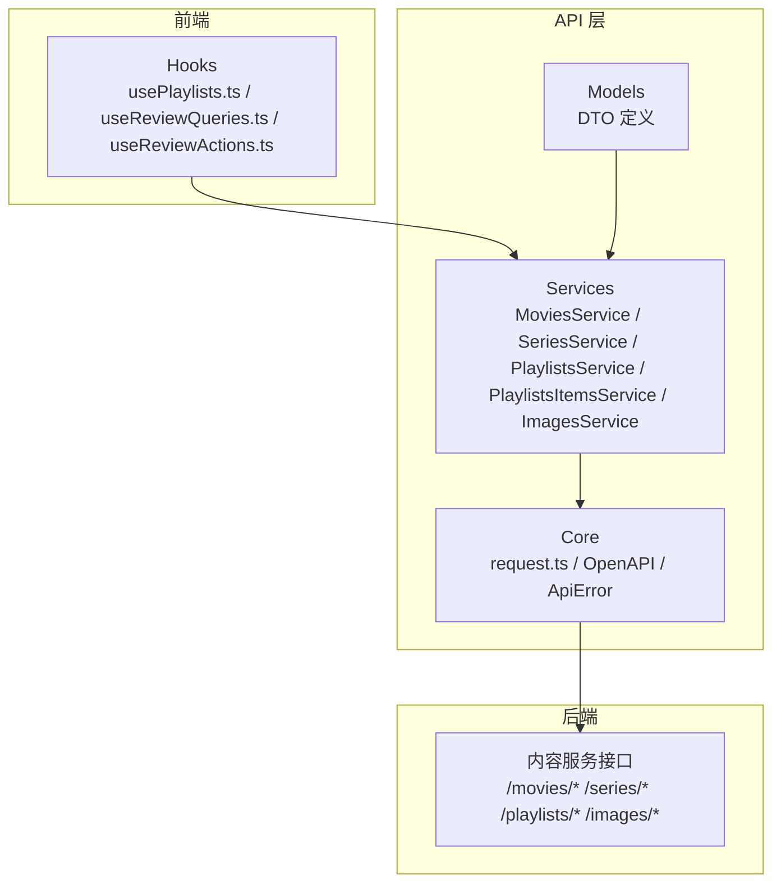
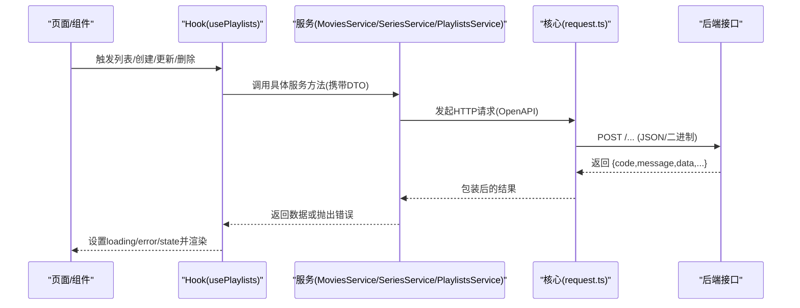
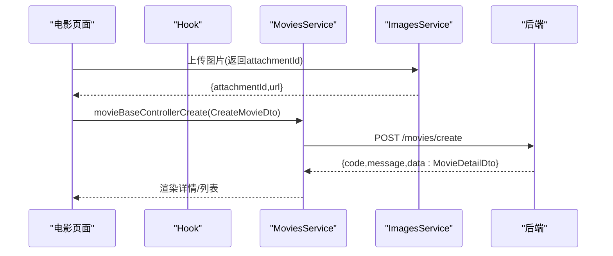
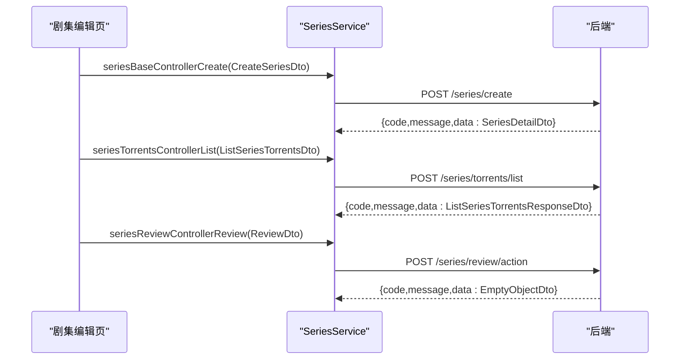
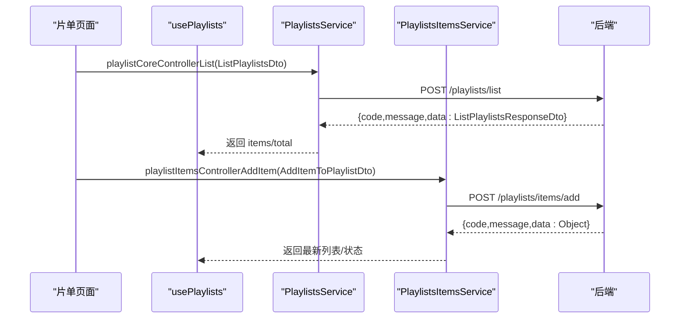
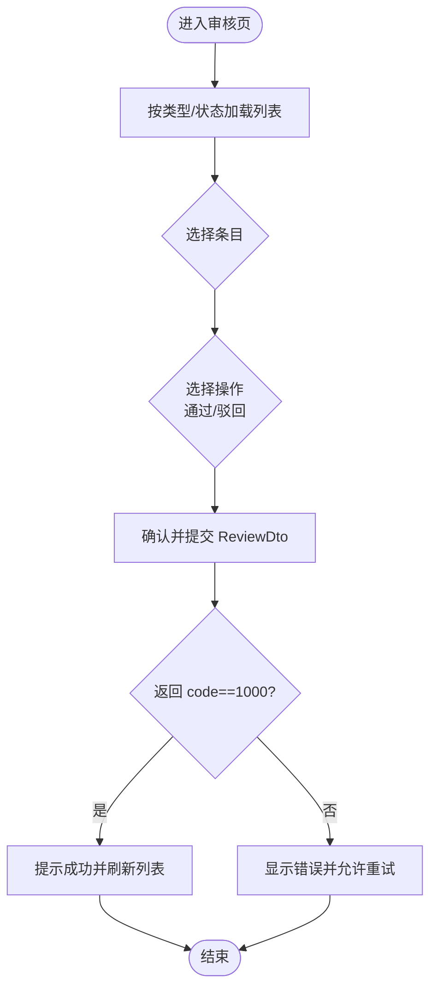
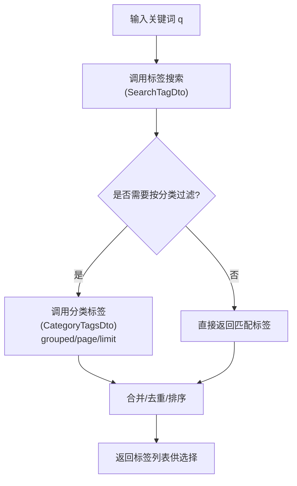
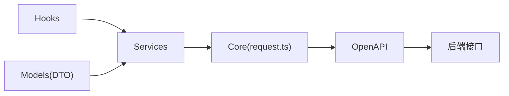

# 内容管理服务

<cite>
**本文引用的文件**
- [MoviesService.ts](file://src/api/services/MoviesService.ts)
- [SeriesService.ts](file://src/api/services/SeriesService.ts)
- [PlaylistsService.ts](file://src/api/services/PlaylistsService.ts)
- [PlaylistsItemsService.ts](file://src/api/services/PlaylistsItemsService.ts)
- [ImagesService.ts](file://src/api/services/ImagesService.ts)
- [CreateMovieDto.ts](file://src/api/models/CreateMovieDto.ts)
- [CreateSeriesDto.ts](file://src/api/models/CreateSeriesDto.ts)
- [CreatePlaylistDto.ts](file://src/api/models/CreatePlaylistDto.ts)
- [SearchTagDto.ts](file://src/api/models/SearchTagDto.ts)
- [CategoryTagsDto.ts](file://src/api/models/CategoryTagsDto.ts)
- [SearchTorrentsDto.ts](file://src/api/models/SearchTorrentsDto.ts)
- [ReviewDto.ts](file://src/api/models/ReviewDto.ts)
- [usePlaylists.ts](file://src/modules/app/hooks/usePlaylists.ts)
- [useReviewQueries.ts](file://src/modules/app/pages/Review/hooks/useReviewQueries.ts)
- [useReviewActions.ts](file://src/modules/app/pages/Review/hooks/useReviewActions.ts)
- [useAllowedTagsForCategory.ts](file://src/modules/forum/hooks/useAllowedTagsForCategory.ts)
- [2025-12-18_剧集分集与种子管理_需求文档.md](file://docs/api-requirements/2025-12-18_剧集分集与种子管理_需求文档.md)
- [request.ts](file://src/api/core/request.ts)
</cite>

## 目录
1. [引言](#引言)
2. [项目结构](#项目结构)
3. [核心组件](#核心组件)
4. [架构总览](#架构总览)
5. [详细组件分析](#详细组件分析)
6. [依赖关系分析](#依赖关系分析)
7. [性能考虑](#性能考虑)
8. [故障排查指南](#故障排查指南)
9. [结论](#结论)
10. [附录](#附录)

## 引言
本技术文档面向内容管理服务，聚焦电影、电视剧、播放列表三类核心内容的 CRUD 操作、状态与审核流程、内容分类与标签体系、搜索能力、上传与编辑最佳实践、推荐配置与统计、以及性能优化策略。文档基于仓库中已生成的服务层与模型定义，结合前端 Hook 使用方式，给出可落地的实现与运维建议，并提供 API 调用示例路径与数据处理模式。

## 项目结构
内容管理服务由三层组成：
- 模型层（Models）：定义内容创建/更新/查询的输入输出结构，如电影、剧集、播放列表的 DTO。
- 服务层（Services）：封装对后端接口的调用，暴露统一的方法名与参数签名，便于前端使用。
- 前端 Hook 层：在页面中组合服务调用与状态管理，完成业务流程编排。

图表来源
- [usePlaylists.ts](file://src/modules/app/hooks/usePlaylists.ts#L1-L156)
- [useReviewQueries.ts](file://src/modules/app/pages/Review/hooks/useReviewQueries.ts#L159-L190)
- [useReviewActions.ts](file://src/modules/app/pages/Review/hooks/useReviewActions.ts#L1-L37)
- [MoviesService.ts](file://src/api/services/MoviesService.ts#L1-L163)
- [SeriesService.ts](file://src/api/services/SeriesService.ts#L1-L409)
- [PlaylistsService.ts](file://src/api/services/PlaylistsService.ts#L1-L250)
- [PlaylistsItemsService.ts](file://src/api/services/PlaylistsItemsService.ts#L1-L31)
- [ImagesService.ts](file://src/api/services/ImagesService.ts#L1-L67)
- [request.ts](file://src/api/core/request.ts#L1-L39)

章节来源
- [MoviesService.ts](file://src/api/services/MoviesService.ts#L1-L163)
- [SeriesService.ts](file://src/api/services/SeriesService.ts#L1-L409)
- [PlaylistsService.ts](file://src/api/services/PlaylistsService.ts#L1-L250)
- [PlaylistsItemsService.ts](file://src/api/services/PlaylistsItemsService.ts#L1-L31)
- [ImagesService.ts](file://src/api/services/ImagesService.ts#L1-L67)
- [usePlaylists.ts](file://src/modules/app/hooks/usePlaylists.ts#L1-L156)
- [useReviewQueries.ts](file://src/modules/app/pages/Review/hooks/useReviewQueries.ts#L159-L190)
- [useReviewActions.ts](file://src/modules/app/pages/Review/hooks/useReviewActions.ts#L1-L37)

## 核心组件
- 电影服务：提供创建、更新、删除、详情、列表等接口，参数与响应结构由 CreateMovieDto、MovieDetailDto 等模型定义。
- 剧集服务：提供剧集 CRUD、关联种子列表/绑定/解绑、待审/审核/历史等接口，满足“分集与种子管理”的需求。
- 播放列表服务：提供片单 CRUD、列表、详情、管理员列表、分类、精选推荐等接口。
- 播放列表项服务：提供向片单添加/移除内容、重新排序、搜索可添加项等接口。
- 图片服务：提供图片上传（支持 base64/二进制），可选绑定目标类型与字段。
- 审核与状态：ReviewDto 定义了审核动作（通过/驳回），配合各资源的 review 控制器使用。
- 标签与分类：SearchTagDto、CategoryTagsDto 定义了标签搜索与分类下的标签查询；useAllowedTagsForCategory 在论坛场景中限制可用标签。
- 搜索：SearchTorrentsDto 定义了种子搜索的关键字段，用于内容检索。

章节来源
- [CreateMovieDto.ts](file://src/api/models/CreateMovieDto.ts#L1-L80)
- [CreateSeriesDto.ts](file://src/api/models/CreateSeriesDto.ts#L1-L98)
- [CreatePlaylistDto.ts](file://src/api/models/CreatePlaylistDto.ts#L1-L54)
- [SearchTagDto.ts](file://src/api/models/SearchTagDto.ts#L1-L15)
- [CategoryTagsDto.ts](file://src/api/models/CategoryTagsDto.ts#L1-L23)
- [SearchTorrentsDto.ts](file://src/api/models/SearchTorrentsDto.ts#L1-L32)
- [ReviewDto.ts](file://src/api/models/ReviewDto.ts#L1-L27)

## 架构总览
内容管理服务采用“模型驱动 + 服务封装 + Hook 编排”的分层架构。前端通过 Hook 组合服务方法，完成状态加载、错误处理、UI 更新与路由跳转等逻辑。

图表来源
- [usePlaylists.ts](file://src/modules/app/hooks/usePlaylists.ts#L15-L156)
- [MoviesService.ts](file://src/api/services/MoviesService.ts#L16-L163)
- [SeriesService.ts](file://src/api/services/SeriesService.ts#L30-L409)
- [PlaylistsService.ts](file://src/api/services/PlaylistsService.ts#L21-L250)
- [request.ts](file://src/api/core/request.ts#L1-L39)

## 详细组件分析

### 电影内容管理
- CRUD 接口：通过 MoviesService.movieBaseControllerCreate/Update/Delete/GetDetail/List 提供完整的电影生命周期管理。
- 输入模型：CreateMovieDto 定义了标题、年份、评分、导演、演员、类型、分类、链接、启用状态等字段。
- 输出模型：MovieDetailDto 作为详情返回体，列表返回 ListMoviesResponseDto。
- 最佳实践：
  - 上传封面/背景图优先使用 ImagesService.imagesControllerUpload，再将返回的附件ID填入 CreateMovieDto。
  - 批量查询时使用 ListMoviesDto，合理设置分页与过滤条件。
  - 更新时仅传递变更字段，避免冗余写入。

图表来源
- [MoviesService.ts](file://src/api/services/MoviesService.ts#L16-L163)
- [ImagesService.ts](file://src/api/services/ImagesService.ts#L8-L67)
- [CreateMovieDto.ts](file://src/api/models/CreateMovieDto.ts#L5-L80)

章节来源
- [MoviesService.ts](file://src/api/services/MoviesService.ts#L16-L163)
- [CreateMovieDto.ts](file://src/api/models/CreateMovieDto.ts#L5-L80)

### 电视剧内容管理
- 基础能力：SeriesService.seriesBaseControllerCreate/Update/Delete/GetDetail/List 支持剧集元数据管理。
- 分集与种子：根据需求文档，需支持分集管理与种子绑定/解绑、查询关联种子。当前仓库中 SeriesService 已提供 torrents/list/bind/unbind 接口。
- 审核流程：SeriesService.seriesReviewControllerListPending/Review/History/Approved/Rejected 实现审核闭环。
- 最佳实践：
  - 创建时先上传海报/背景图，获取附件ID后再提交 CreateSeriesDto。
  - 关联种子前校验种子有效性，绑定后刷新列表。
  - 审核通过/驳回需记录备注与原因码，便于审计。

图表来源
- [SeriesService.ts](file://src/api/services/SeriesService.ts#L30-L409)
- [2025-12-18_剧集分集与种子管理_需求文档.md](file://docs/api-requirements/2025-12-18_剧集分集与种子管理_需求文档.md#L1-L15)
- [CreateSeriesDto.ts](file://src/api/models/CreateSeriesDto.ts#L5-L98)
- [ReviewDto.ts](file://src/api/models/ReviewDto.ts#L5-L27)

章节来源
- [SeriesService.ts](file://src/api/services/SeriesService.ts#L30-L409)
- [2025-12-18_剧集分集与种子管理_需求文档.md](file://docs/api-requirements/2025-12-18_剧集分集与种子管理_需求文档.md#L1-L15)

### 播放列表内容管理
- 片单 CRUD：PlaylistsService.playlistCoreControllerCreate/Update/Delete/Get/List/AdminList 提供基础管理能力。
- 片单分类与推荐：listCategories、featured/list 支持分类与精选推荐。
- 片单项管理：PlaylistsItemsService 提供 addItem/removeItem/reorder/searchAddableItems 等能力。
- 前端 Hook：usePlaylists 封装了列表、更新、删除、添加/移除影片、排序等常用操作，并内置错误处理与 loading 状态。

图表来源
- [PlaylistsService.ts](file://src/api/services/PlaylistsService.ts#L21-L250)
- [PlaylistsItemsService.ts](file://src/api/services/PlaylistsItemsService.ts#L16-L31)
- [usePlaylists.ts](file://src/modules/app/hooks/usePlaylists.ts#L15-L156)

章节来源
- [PlaylistsService.ts](file://src/api/services/PlaylistsService.ts#L21-L250)
- [PlaylistsItemsService.ts](file://src/api/services/PlaylistsItemsService.ts#L16-L31)
- [usePlaylists.ts](file://src/modules/app/hooks/usePlaylists.ts#L15-L156)

### 审核流程与状态管理
- 审核模型：ReviewDto 定义了内容ID、动作（通过/驳回）、备注与拒绝原因码。
- 审核入口：useReviewQueries 按类型与状态（待审/通过/驳回）拉取不同列表；useReviewActions 负责提交审核动作。
- 适用范围：电影、剧集、播放列表均具备对应的 review 控制器（参见对应 Service 方法）。

图表来源
- [useReviewQueries.ts](file://src/modules/app/pages/Review/hooks/useReviewQueries.ts#L159-L190)
- [useReviewActions.ts](file://src/modules/app/pages/Review/hooks/useReviewActions.ts#L17-L37)
- [ReviewDto.ts](file://src/api/models/ReviewDto.ts#L5-L27)

章节来源
- [useReviewQueries.ts](file://src/modules/app/pages/Review/hooks/useReviewQueries.ts#L159-L190)
- [useReviewActions.ts](file://src/modules/app/pages/Review/hooks/useReviewActions.ts#L17-L37)
- [ReviewDto.ts](file://src/api/models/ReviewDto.ts#L5-L27)

### 内容分类、标签系统与搜索
- 分类与标签：
  - SearchTagDto 定义标签搜索关键词与数量限制。
  - CategoryTagsDto 支持按分类查询标签（可分组/不分组）。
  - useAllowedTagsForCategory 在论坛场景中限制可用标签集合，确保内容标签合规。
- 搜索：
  - SearchTorrentsDto 定义种子搜索的关键词、分类、排序字段与分页参数。
- 最佳实践：
  - 创建内容时同步维护分类与标签，保证搜索与筛选一致性。
  - 标签搜索优先使用 q 与 limit，避免一次性返回过多结果。

图表来源
- [SearchTagDto.ts](file://src/api/models/SearchTagDto.ts#L5-L15)
- [CategoryTagsDto.ts](file://src/api/models/CategoryTagsDto.ts#L5-L23)
- [useAllowedTagsForCategory.ts](file://src/modules/forum/hooks/useAllowedTagsForCategory.ts#L1-L47)

章节来源
- [SearchTagDto.ts](file://src/api/models/SearchTagDto.ts#L5-L15)
- [CategoryTagsDto.ts](file://src/api/models/CategoryTagsDto.ts#L5-L23)
- [useAllowedTagsForCategory.ts](file://src/modules/forum/hooks/useAllowedTagsForCategory.ts#L1-L47)

### 内容上传、编辑与删除最佳实践
- 上传：
  - 优先使用 ImagesService.imagesControllerUpload，支持 base64 与二进制；可选 attachableType/attachableId/field/sortOrder 等绑定参数。
  - 上传成功后保存 attachmentId，随后在 CreateMovieDto/CreateSeriesDto/CreatePlaylistDto 中引用。
- 编辑：
  - 仅传递变更字段，减少无效写入；更新前先拉取详情，对比差异。
  - 审核中的内容更新需谨慎，必要时走“重新提交审核”流程。
- 删除：
  - 删除前确认无关联种子/片单项；删除后清理缓存与索引。
- 错误处理：
  - 统一通过 Hook 内部的 unwrap 与错误捕获，设置 error 状态并提示用户。

章节来源
- [ImagesService.ts](file://src/api/services/ImagesService.ts#L8-L67)
- [usePlaylists.ts](file://src/modules/app/hooks/usePlaylists.ts#L5-L13)

### 推荐算法与统计
- 推荐配置：
  - Create/Update/RecommendationConfigDto 定义了推荐标题、关联 Tab、策略类型（最新/热门下载/热门浏览/最多做种/近期活跃）、时间范围、数量、排序权重、启用状态与样式标识。
  - 前端可通过推荐配置管理界面进行增删改查与启用/停用。
- 统计：
  - StatisticsResponseDto 提供桶状统计结构，可用于生成趋势图与报表。
- 最佳实践：
  - 不同内容类型可配置独立推荐策略；热点内容可缩短 timeRange 以提升时效性。
  - 推荐位样式与 Tab 绑定需保持一致，避免错配。

章节来源
- [CreateRecommendationConfigDto.ts](file://src/api/models/CreateRecommendationConfigDto.ts#L5-L51)
- [UpdateRecommendationConfigDto.ts](file://src/api/models/UpdateRecommendationConfigDto.ts#L5-L51)
- [RecommendationConfigDto.ts](file://src/api/models/RecommendationConfigDto.ts#L5-L27)
- [StatisticsResponseDto.ts](file://src/api/models/StatisticsResponseDto.ts#L5-L8)

### API 调用示例与数据处理模式
- 电影创建示例路径
  - 请求：MoviesService.movieBaseControllerCreate(CreateMovieDto)
  - 响应：MovieDetailDto
- 剧集关联种子示例路径
  - 查询：SeriesService.seriesTorrentsControllerList(ListSeriesTorrentsDto)
  - 绑定：SeriesService.seriesTorrentsControllerBind(BindTorrentDto)
  - 解绑：SeriesService.seriesTorrentsControllerUnbind(UnbindTorrentDto)
- 播放列表项操作示例路径
  - 添加：PlaylistsItemsService.playlistItemsControllerAddItem(AddItemToPlaylistDto)
  - 移除：PlaylistsItemsService.playlistItemsControllerRemoveItem(RemoveItemFromPlaylistDto)
  - 排序：PlaylistsItemsService.playlistItemsControllerReorderItems(ReorderItemsInPlaylistDto)
- 图片上传示例路径
  - ImagesService.imagesControllerUpload({content,filename,attachableType?,attachableId?,field?,sortOrder?,mimeType?})
- 审核示例路径
  - useReviewActions 提交 ReviewDto 至对应 review/action 接口

章节来源
- [MoviesService.ts](file://src/api/services/MoviesService.ts#L23-L45)
- [SeriesService.ts](file://src/api/services/SeriesService.ts#L182-L262)
- [PlaylistsItemsService.ts](file://src/api/services/PlaylistsItemsService.ts#L23-L31)
- [ImagesService.ts](file://src/api/services/ImagesService.ts#L15-L67)
- [useReviewActions.ts](file://src/modules/app/pages/Review/hooks/useReviewActions.ts#L23-L37)

## 依赖关系分析
- 低耦合高内聚：每个 Service 聚焦单一资源域，方法职责清晰。
- 依赖链路：Hook -> Service -> Core(request.ts) -> OpenAPI -> 后端接口。
- 潜在风险：
  - Service 方法命名与后端路由需保持一致，避免调用失败。
  - DTO 字段变更需同步更新前端与后端，建议通过 OpenAPI 自动生成与校验。

图表来源
- [request.ts](file://src/api/core/request.ts#L1-L39)
- [MoviesService.ts](file://src/api/services/MoviesService.ts#L1-L163)
- [SeriesService.ts](file://src/api/services/SeriesService.ts#L1-L409)
- [PlaylistsService.ts](file://src/api/services/PlaylistsService.ts#L1-L250)

章节来源
- [request.ts](file://src/api/core/request.ts#L1-L39)

## 性能考虑
- 分页与限流：列表查询使用 page/limit 控制返回规模；对高频接口增加本地缓存与防抖。
- 上传优化：图片上传优先使用二进制，减少 base64 带来的体积膨胀；对大图进行压缩与尺寸裁剪。
- 审核批处理：批量审核时采用队列化与幂等设计，避免重复提交。
- 推荐策略：热点内容缩短 timeRange，冷门内容扩大范围并降低频率；对推荐位进行懒加载与占位符优化。
- 网络层：统一拦截器处理超时与重试，对 4xx/5xx 错误进行降级与提示。

## 故障排查指南
- 常见错误码
  - 400 参数错误：检查 DTO 字段类型与必填项。
  - 401 未认证：确认登录态与 Token。
  - 403 禁止访问：检查权限与账号状态。
  - 404 资源不存在：确认 ID 与路由正确。
  - 500 服务器错误：查看后端日志与重试。
- 前端错误处理
  - usePlaylists 中的 unwrap 统一解析 code/message/data，错误时抛出并设置 error 状态。
  - useReviewActions 对缺失 ID 进行前置校验，避免空 ID 提交。
- 审核问题
  - 若审核失败，检查 ReviewDto 的 action 与 note/reasonCode 是否符合后端要求。

章节来源
- [usePlaylists.ts](file://src/modules/app/hooks/usePlaylists.ts#L5-L13)
- [useReviewActions.ts](file://src/modules/app/pages/Review/hooks/useReviewActions.ts#L26-L31)

## 结论
内容管理服务通过清晰的模型、服务与 Hook 分层，实现了电影、电视剧、播放列表的全生命周期管理。结合审核、分类标签、搜索与推荐配置，能够支撑复杂的内容运营场景。建议在后续迭代中持续完善分集与种子管理细节，强化上传与搜索性能，并完善推荐算法的 A/B 实验与效果评估。

## 附录
- 术语
  - DTO：数据传输对象，用于前后端交互的数据结构。
  - OpenAPI：统一的 API 描述与生成工具链。
  - 审核：内容发布前的质量控制流程，包含待审、通过、驳回与历史记录。
- 参考文件
  - [2025-12-18_剧集分集与种子管理_需求文档.md](file://docs/api-requirements/2025-12-18_剧集分集与种子管理_需求文档.md#L1-L15)