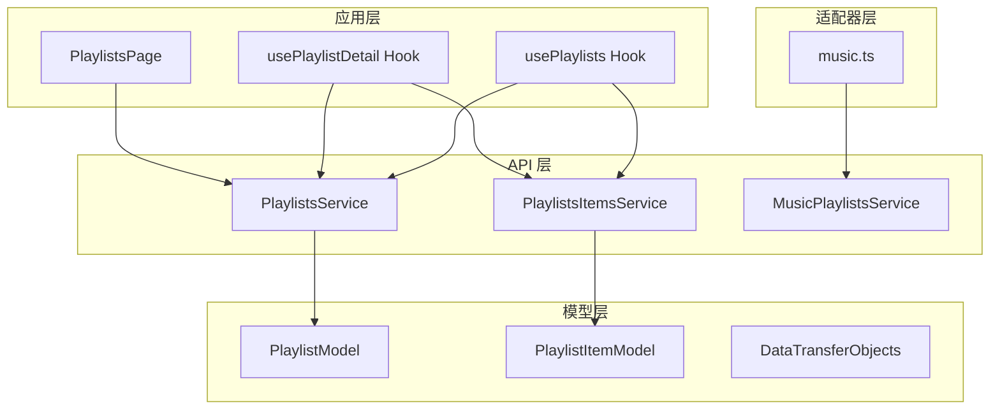
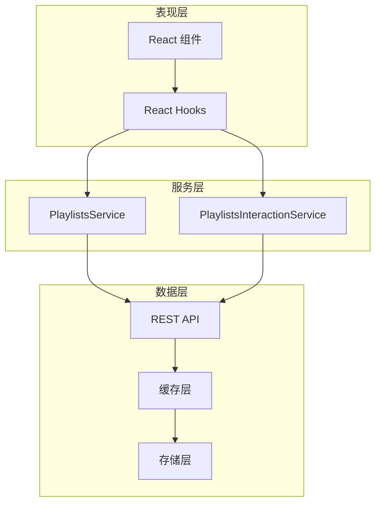
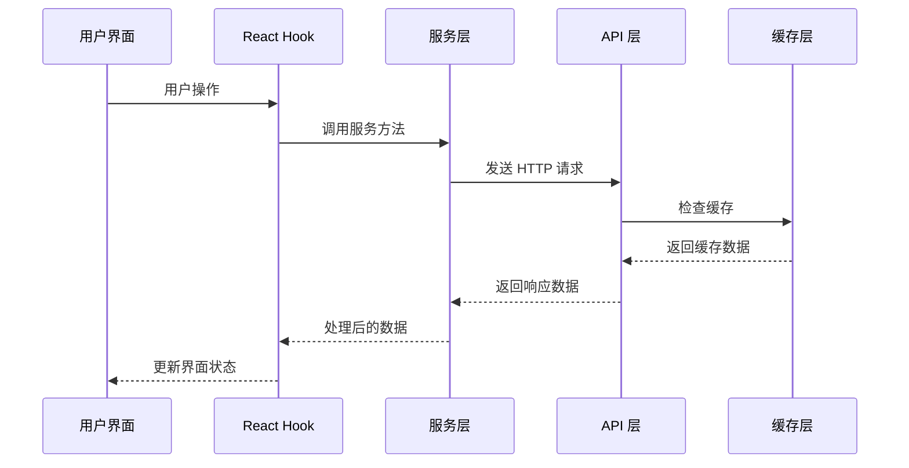
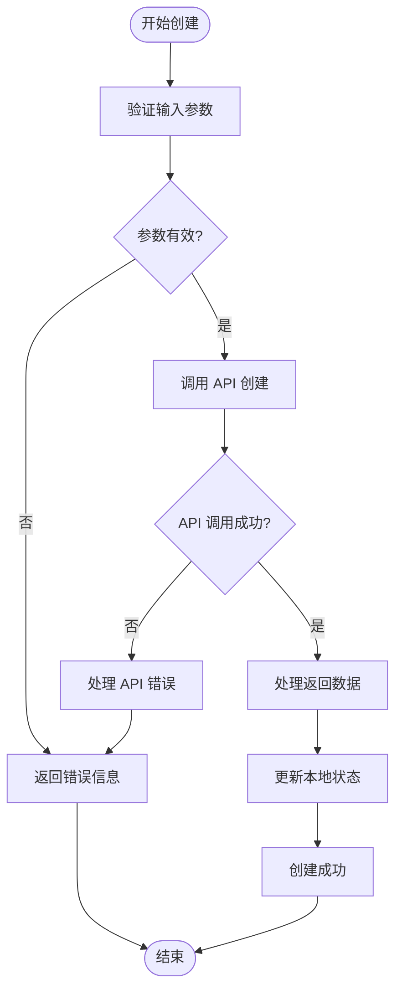
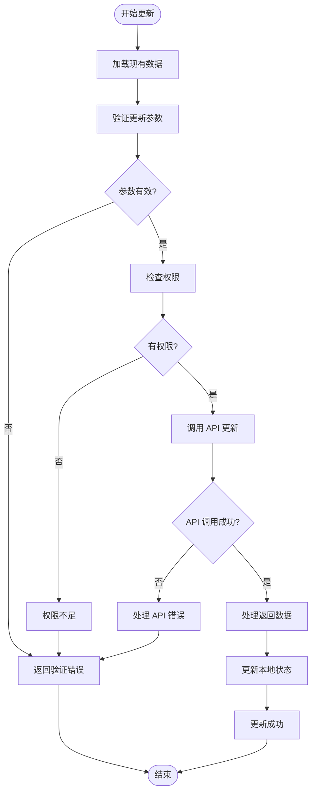
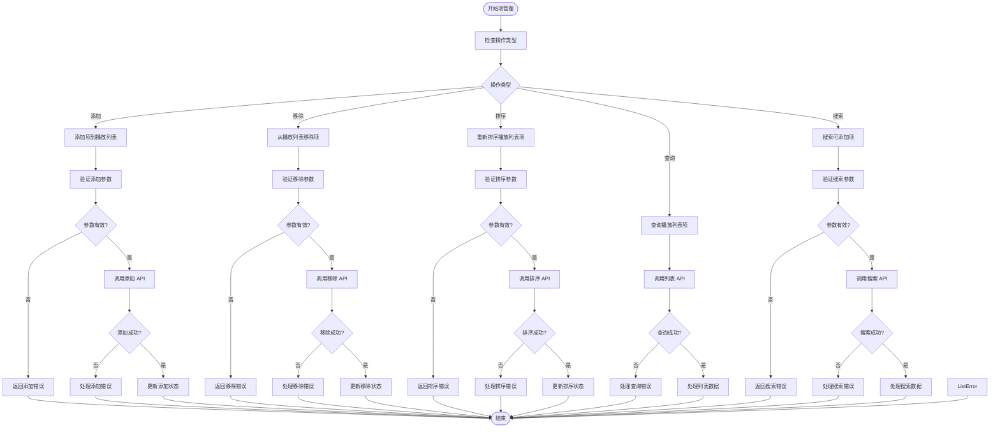
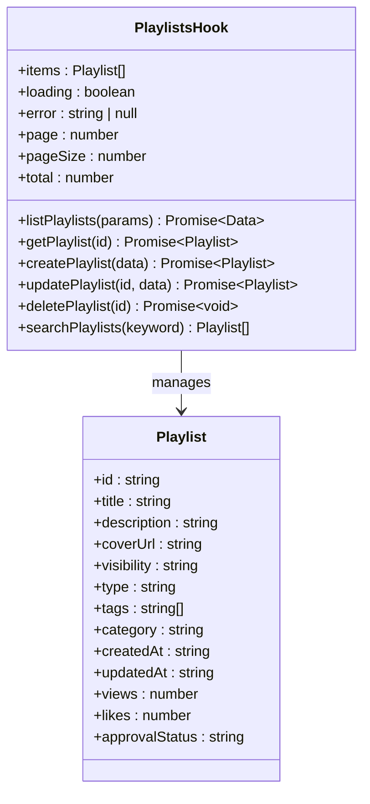
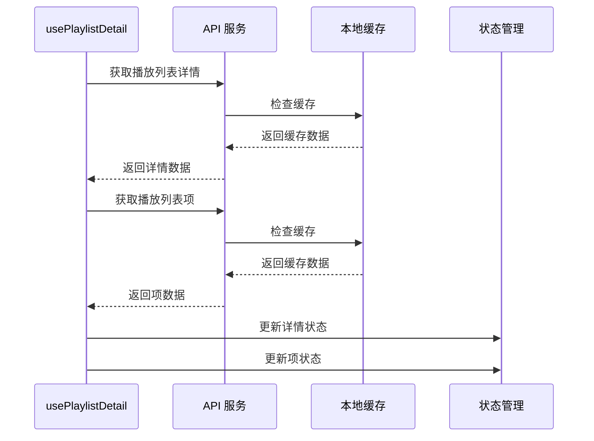
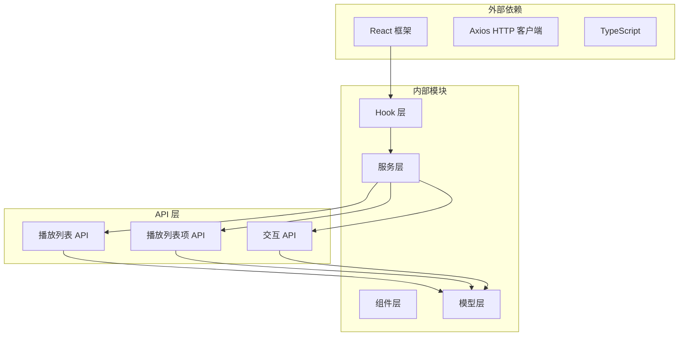

# 播放列表内容服务

<cite>
**本文档引用的文件**
- [PlaylistsService.ts](file://src/api/services/PlaylistsService.ts)
- [PlaylistsItemsService.ts](file://src/api/services/PlaylistsItemsService.ts)
- [usePlaylists.ts](file://src/modules/app/hooks/usePlaylists.ts)
- [usePlaylistDetail.ts](file://src/modules/app/pages/PlaylistDetail/hooks/usePlaylistDetail.ts)
- [PlaylistsPage.tsx](file://src/modules/admin/pages/content/media/PlaylistsPage/index.tsx)
- [PlaylistsService.ts](file://src/api/services/PlaylistsService.ts)
- [PlaylistsItemsService.ts](file://src/api/services/PlaylistsItemsService.ts)
- [music.ts](file://src/api/adapters/music.ts)
</cite>

## 目录
1. [简介](#简介)
2. [项目结构](#项目结构)
3. [核心组件](#核心组件)
4. [架构概览](#架构概览)
5. [详细组件分析](#详细组件分析)
6. [依赖关系分析](#依赖关系分析)
7. [性能考虑](#性能考虑)
8. [故障排除指南](#故障排除指南)
9. [结论](#结论)

## 简介

播放列表内容服务是 zTorrent 站点中的核心功能模块，负责管理用户的影片收藏和播放列表。该服务提供了完整的播放列表生命周期管理，包括创建、更新、删除、详情查询和列表获取等功能。系统支持多种播放列表类型（通用、专题、系列、导演、策展），并具备完善的权限控制和审核机制。

该服务采用现代化的 React Hooks 架构，结合 TypeScript 类型安全，为用户提供流畅的播放列表管理体验。系统还集成了用户交互统计、收藏功能和审核流程，形成了完整的播放列表生态系统。

## 项目结构

播放列表内容服务在项目中的组织结构如下：

**图表来源**
- [PlaylistsService.ts](file://src/api/services/PlaylistsService.ts#L1-L100)
- [PlaylistsItemsService.ts](file://src/api/services/PlaylistsItemsService.ts#L1-L100)
- [usePlaylists.ts](file://src/modules/app/hooks/usePlaylists.ts#L1-L100)

**章节来源**
- [PlaylistsService.ts](file://src/api/services/PlaylistsService.ts#L1-L100)
- [PlaylistsItemsService.ts](file://src/api/services/PlaylistsItemsService.ts#L1-L100)
- [usePlaylists.ts](file://src/modules/app/hooks/usePlaylists.ts#L1-L100)

## 核心组件

### PlaylistsService - 播放列表核心服务

PlaylistsService 是播放列表管理的核心服务，提供以下主要功能：

- **创建播放列表** (`playlistCoreControllerCreate`)
- **更新播放列表** (`playlistCoreControllerUpdate`)  
- **删除播放列表** (`playlistCoreControllerDelete`)
- **列表查询** (`playlistCoreControllerList`)
- **详情获取** (`playlistCoreControllerGet`)
- **管理员列表** (`playlistCoreControllerAdminList`)
- **分类管理** (`playlistCoreControllerListCategories`)

### PlaylistsItemsService - 播放列表项服务

PlaylistsItemsService 专门处理播放列表项的管理：

- **添加内容** (`playlistItemsControllerAddItem`)
- **移除内容** (`playlistItemsControllerRemoveItem`)
- **重新排序** (`playlistItemsControllerReorderItems`)
- **列表查询** (`playlistItemsControllerListItems`)
- **搜索可添加内容** (`playlistItemsControllerSearchAddableItems`)

### 应用层 Hook

- **usePlaylists** - 应用首页播放列表管理
- **usePlaylistDetail** - 播放列表详情页管理

**章节来源**
- [PlaylistsService.ts](file://src/api/services/PlaylistsService.ts#L1-L100)
- [PlaylistsItemsService.ts](file://src/api/services/PlaylistsItemsService.ts#L1-L100)
- [usePlaylists.ts](file://src/modules/app/hooks/usePlaylists.ts#L1-L100)
- [usePlaylistDetail.ts](file://src/modules/app/pages/PlaylistDetail/hooks/usePlaylistDetail.ts#L1-L100)

## 架构概览

播放列表内容服务采用分层架构设计，确保各层职责清晰分离：

**图表来源**
- [PlaylistsService.ts](file://src/api/services/PlaylistsService.ts#L1-L100)
- [PlaylistsItemsService.ts](file://src/api/services/PlaylistsItemsService.ts#L1-L100)

### 数据流处理

系统采用异步数据流处理模式，确保用户体验的流畅性：

**图表来源**
- [usePlaylists.ts](file://src/modules/app/hooks/usePlaylists.ts#L1-L100)
- [usePlaylistDetail.ts](file://src/modules/app/pages/PlaylistDetail/hooks/usePlaylistDetail.ts#L1-L100)

## 详细组件分析

### PlaylistsService 实现机制

PlaylistsService 提供了完整的播放列表 CRUD 操作：

#### 创建播放列表流程

**图表来源**
- [PlaylistsService.ts](file://src/api/services/PlaylistsService.ts#L1-L100)

#### 更新播放列表流程

更新操作遵循相同的模式，但增加了数据验证和冲突检测：

**图表来源**
- [PlaylistsService.ts](file://src/api/services/PlaylistsService.ts#L1-L100)

**章节来源**
- [PlaylistsService.ts](file://src/api/services/PlaylistsService.ts#L1-L100)

### PlaylistsItemsService 实现机制

PlaylistsItemsService 专注于播放列表项的管理，提供了灵活的内容操作能力：

#### 播放列表项管理流程

**图表来源**
- [PlaylistsItemsService.ts](file://src/api/services/PlaylistsItemsService.ts#L1-L100)

**章节来源**
- [PlaylistsItemsService.ts](file://src/api/services/PlaylistsItemsService.ts#L1-L100)

### 应用层 Hook 分析

#### usePlaylists Hook

usePlaylists Hook 提供了播放列表的完整管理能力：

**图表来源**
- [usePlaylists.ts](file://src/modules/app/hooks/usePlaylists.ts#L1-L100)

#### usePlaylistDetail Hook

usePlaylistDetail Hook 专门处理播放列表详情页的数据管理：

**图表来源**
- [usePlaylistDetail.ts](file://src/modules/app/pages/PlaylistDetail/hooks/usePlaylistDetail.ts#L1-L100)

**章节来源**
- [usePlaylists.ts](file://src/modules/app/hooks/usePlaylists.ts#L1-L100)
- [usePlaylistDetail.ts](file://src/modules/app/pages/PlaylistDetail/hooks/usePlaylistDetail.ts#L1-L100)

## 依赖关系分析

播放列表内容服务的依赖关系呈现清晰的分层结构：

**图表来源**
- [PlaylistsService.ts](file://src/api/services/PlaylistsService.ts#L1-L100)
- [PlaylistsItemsService.ts](file://src/api/services/PlaylistsItemsService.ts#L1-L100)

### 组件耦合度分析

系统采用了低耦合的设计原则：

- **服务层与表现层解耦**：通过 Hook 抽象，表现层不直接依赖具体的服务实现
- **API 层抽象**：统一的 API 接口，便于替换和扩展
- **数据模型标准化**：统一的数据传输对象，简化了数据处理逻辑

**章节来源**
- [PlaylistsService.ts](file://src/api/services/PlaylistsService.ts#L1-L100)
- [PlaylistsItemsService.ts](file://src/api/services/PlaylistsItemsService.ts#L1-L100)

## 性能考虑

### 缓存策略

系统实现了多层次的缓存策略来提升性能：

1. **本地缓存**：React Query 等状态管理库提供的智能缓存
2. **API 缓存**：后端提供的缓存机制
3. **浏览器缓存**：静态资源和图片的浏览器缓存

### 异步加载优化

- **并发请求**：使用 `Promise.all` 并发获取多个数据源
- **懒加载**：滚动加载和分页加载减少初始负载
- **防抖处理**：搜索和过滤操作的防抖优化

### 内存管理

- **状态清理**：组件卸载时自动清理状态和订阅
- **垃圾回收**：及时释放不再使用的数据引用
- **虚拟化渲染**：大数据列表的虚拟化处理

## 故障排除指南

### 常见问题及解决方案

#### API 调用失败

**症状**：播放列表操作失败，显示错误信息

**可能原因**：
- 网络连接问题
- 服务器超时
- 权限不足
- 参数验证失败

**解决步骤**：
1. 检查网络连接状态
2. 验证 API 端点可用性
3. 确认用户权限
4. 检查请求参数格式

#### 数据同步问题

**症状**：界面显示的数据与实际不符

**解决步骤**：
1. 清除本地缓存
2. 刷新页面
3. 检查数据更新逻辑
4. 验证状态管理正确性

#### 性能问题

**症状**：页面加载缓慢或操作卡顿

**优化措施**：
1. 实施分页加载
2. 启用数据缓存
3. 减少不必要的重渲染
4. 优化图片和资源加载

**章节来源**
- [usePlaylists.ts](file://src/modules/app/hooks/usePlaylists.ts#L1-L100)
- [usePlaylistDetail.ts](file://src/modules/app/pages/PlaylistDetail/hooks/usePlaylistDetail.ts#L1-L100)

## 结论

播放列表内容服务展现了现代前端开发的最佳实践，通过清晰的分层架构、完善的错误处理机制和优化的性能策略，为用户提供了稳定可靠的播放列表管理体验。

### 主要优势

1. **架构清晰**：分层设计确保了代码的可维护性和可扩展性
2. **类型安全**：TypeScript 的强类型系统减少了运行时错误
3. **性能优化**：多层缓存和异步处理提升了用户体验
4. **错误处理**：完善的错误处理机制保证了系统的稳定性

### 技术亮点

- **Hook 模式**：React Hooks 提供了简洁的状态管理和副作用处理
- **异步数据流**：现代化的异步数据管理模式
- **组件化设计**：高度模块化的组件结构
- **类型安全**：完整的 TypeScript 类型定义

该服务为 zTorrent 站点的播放列表功能奠定了坚实的技术基础，为未来的功能扩展和性能优化提供了良好的架构支撑。