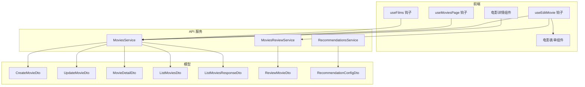
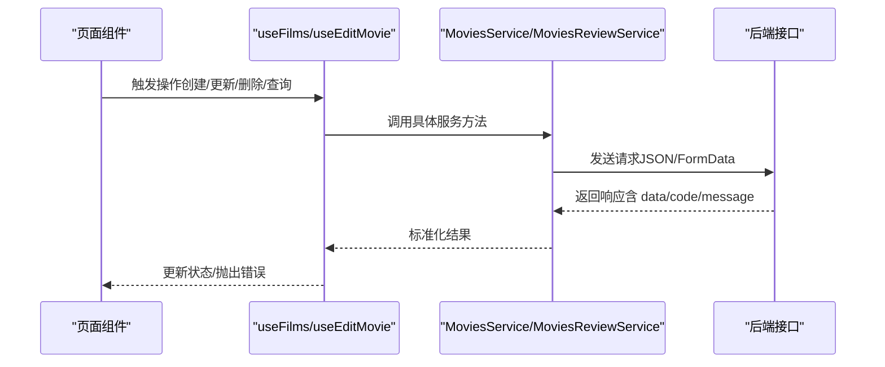
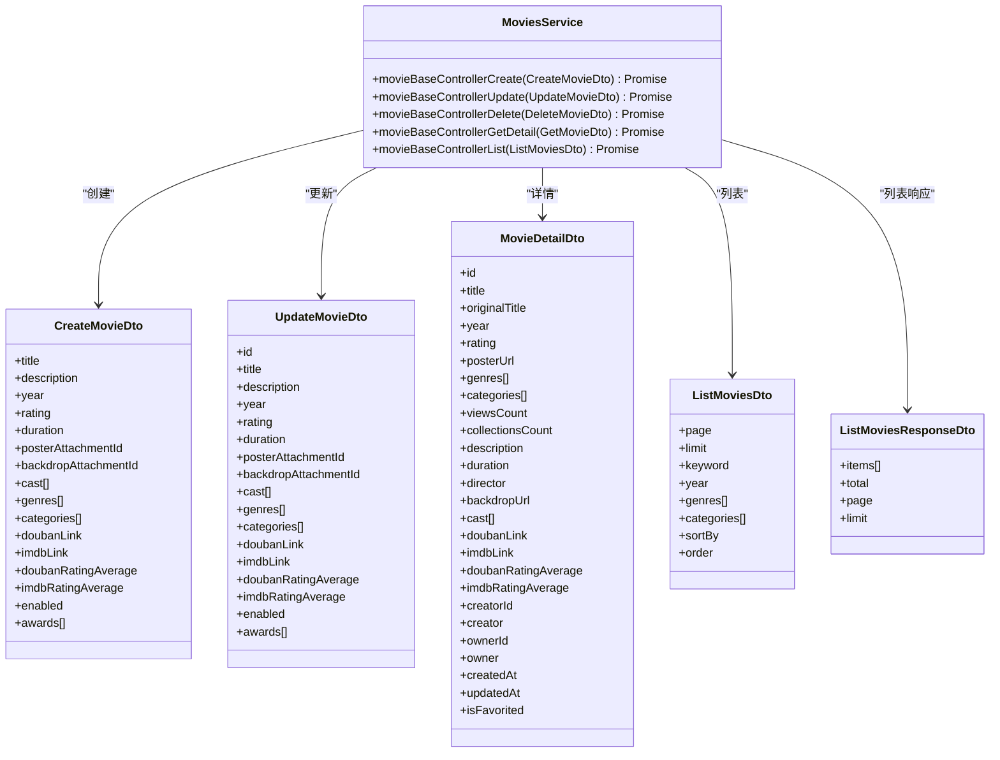
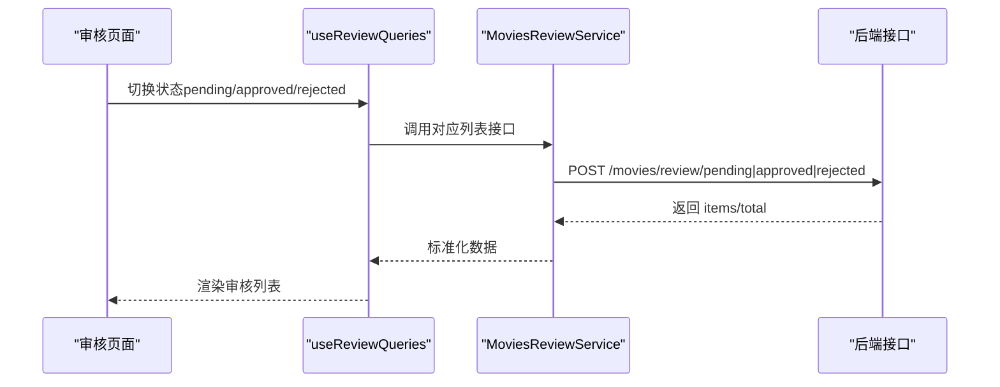
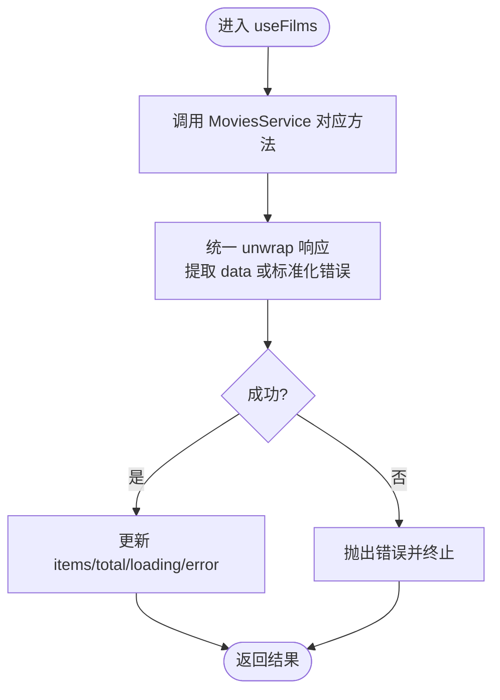
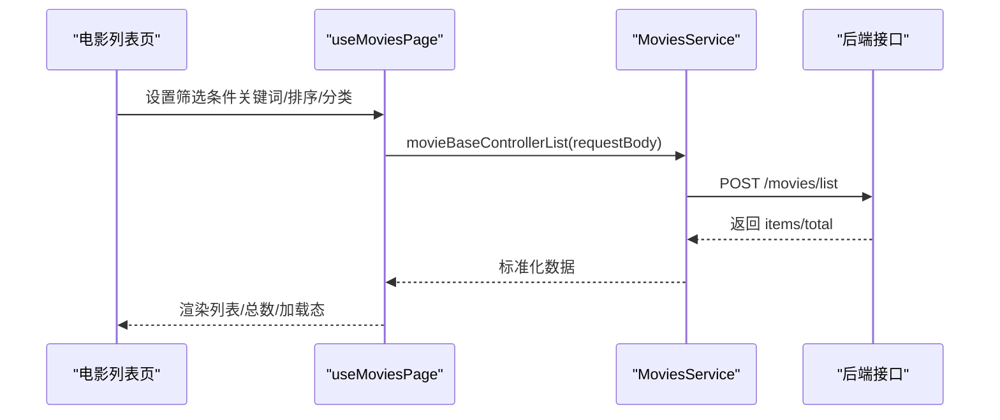
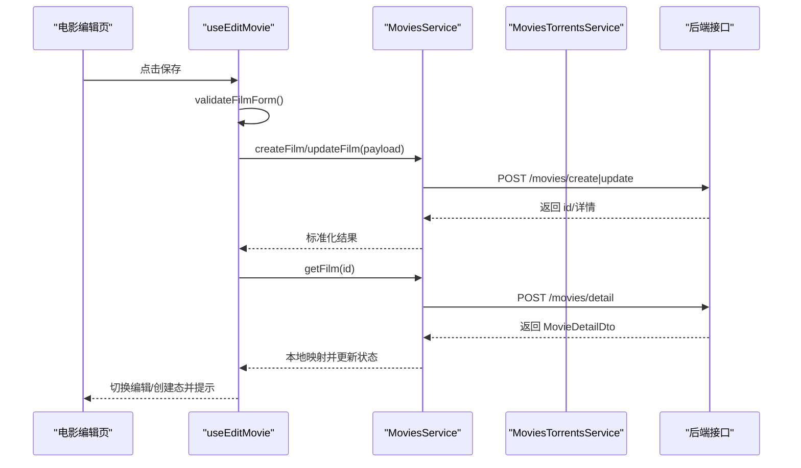
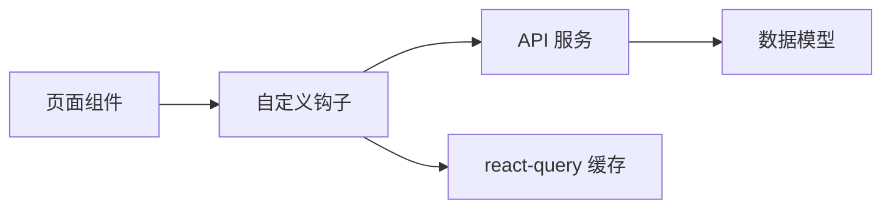

# 电影内容服务

<cite>
**本文引用的文件**
- [MoviesService.ts](file://src/api/services/MoviesService.ts)
- [MoviesReviewService.ts](file://src/api/services/MoviesReviewService.ts)
- [useFilms.ts](file://src/modules/app/hooks/useFilms.ts)
- [useEditMovie.ts](file://src/modules/app/pages/Edit/movies/hooks/useEditMovie.ts)
- [useMoviesPage.ts](file://src/modules/app/pages/Movies/hooks/UseMoviesPage.ts)
- [CreateMovieDto.ts](file://src/api/models/CreateMovieDto.ts)
- [UpdateMovieDto.ts](file://src/api/models/UpdateMovieDto.ts)
- [MovieDetailDto.ts](file://src/api/models/MovieDetailDto.ts)
- [ListMoviesDto.ts](file://src/api/models/ListMoviesDto.ts)
- [ListMoviesResponseDto.ts](file://src/api/models/ListMoviesResponseDto.ts)
- [MovieTorrentDto.ts](file://src/api/models/MovieTorrentDto.ts)
- [ReviewMovieDto.ts](file://src/api/models/ReviewMovieDto.ts)
- [RecommendationsService.ts](file://src/api/services/RecommendationsService.ts)
- [RecommendationConfigDto.ts](file://src/api/models/RecommendationConfigDto.ts)
- [useReviewQueries.ts](file://src/modules/app/pages/Review/hooks/useReviewQueries.ts)
- [ReviewHeader.tsx](file://src/modules/app/pages/Review/components/ReviewHeader.tsx)
- [types.ts](file://src/modules/app/pages/Review/types.ts)
- [constants.ts](file://src/modules/admin/pages/content/media/FilmsPage/constants.ts)
- [types.ts](file://src/modules/admin/pages/content/media/FilmsPage/types.ts)
- [MovieForm.tsx](file://src/modules/app/pages/Edit/movies/components/MovieForm.tsx)
- [index.tsx](file://src/modules/app/pages/Edit/movies/index.tsx)
- [MovieDetailBody.tsx](file://src/modules/app/components/business/MovieDetailBody.tsx)
</cite>

## 目录
1. [简介](#简介)
2. [项目结构](#项目结构)
3. [核心组件](#核心组件)
4. [架构总览](#架构总览)
5. [详细组件分析](#详细组件分析)
6. [依赖关系分析](#依赖关系分析)
7. [性能考虑](#性能考虑)
8. [故障排查指南](#故障排查指南)
9. [结论](#结论)
10. [附录](#附录)

## 简介
本技术文档围绕电影内容服务展开，聚焦 MoviesService 的实现机制与周边能力，覆盖电影的创建、更新、删除、详情查询、列表获取、审核流程、电影与种子关联关系、电影详情页面的数据处理、分类与标签系统、搜索功能、上传与编辑最佳实践、推荐算法与统计、性能优化策略以及 API 调用示例与数据处理模式。文档旨在帮助开发者快速理解并高效扩展电影模块。

## 项目结构
电影相关内容主要分布在以下区域：
- API 层：MoviesService、MoviesReviewService 提供电影基础与审核相关接口封装
- Hooks 层：useFilms、useMoviesPage、useEditMovie 封装前端业务逻辑与状态
- 模型层：CreateMovieDto、UpdateMovieDto、MovieDetailDto、ListMoviesDto 等定义数据契约
- 页面与组件：电影编辑页、电影列表页、审核中心、详情页组件
- 推荐与统计：RecommendationsService 与推荐配置模型

图表来源
- [MoviesService.ts](file://src/api/services/MoviesService.ts#L1-L163)
- [MoviesReviewService.ts](file://src/api/services/MoviesReviewService.ts#L1-L165)
- [useFilms.ts](file://src/modules/app/hooks/useFilms.ts#L1-L173)
- [useMoviesPage.ts](file://src/modules/app/pages/Movies/hooks/UseMoviesPage.ts#L1-L96)
- [useEditMovie.ts](file://src/modules/app/pages/Edit/movies/hooks/useEditMovie.ts#L1-L391)
- [CreateMovieDto.ts](file://src/api/models/CreateMovieDto.ts#L1-L80)
- [UpdateMovieDto.ts](file://src/api/models/UpdateMovieDto.ts#L1-L84)
- [MovieDetailDto.ts](file://src/api/models/MovieDetailDto.ts#L1-L37)
- [ListMoviesDto.ts](file://src/api/models/ListMoviesDto.ts#L1-L52)
- [ListMoviesResponseDto.ts](file://src/api/models/ListMoviesResponseDto.ts#L1-L24)
- [ReviewMovieDto.ts](file://src/api/models/ReviewMovieDto.ts#L1-L32)
- [RecommendationConfigDto.ts](file://src/api/models/RecommendationConfigDto.ts#L1-L27)
- [RecommendationsService.ts](file://src/api/services/RecommendationsService.ts#L110-L156)

章节来源
- [MoviesService.ts](file://src/api/services/MoviesService.ts#L1-L163)
- [MoviesReviewService.ts](file://src/api/services/MoviesReviewService.ts#L1-L165)
- [useFilms.ts](file://src/modules/app/hooks/useFilms.ts#L1-L173)
- [useMoviesPage.ts](file://src/modules/app/pages/Movies/hooks/UseMoviesPage.ts#L1-L96)
- [useEditMovie.ts](file://src/modules/app/pages/Edit/movies/hooks/useEditMovie.ts#L1-L391)

## 核心组件
- MoviesService：提供电影的创建、更新、删除、详情查询、列表查询等基础能力
- MoviesReviewService：提供电影审核相关能力（待审、通过/驳回、历史）
- useFilms：统一的电影数据访问钩子，封装 CRUD 与种子绑定/解绑
- useMoviesPage：电影列表页的状态与筛选逻辑
- useEditMovie：电影编辑页的表单、校验、种子搜索与绑定、PTGen 自动填充
- 模型层：CreateMovieDto、UpdateMovieDto、MovieDetailDto、ListMoviesDto 等
- 推荐与统计：RecommendationsService 与 RecommendationConfigDto

章节来源
- [MoviesService.ts](file://src/api/services/MoviesService.ts#L16-L161)
- [MoviesReviewService.ts](file://src/api/services/MoviesReviewService.ts#L18-L163)
- [useFilms.ts](file://src/modules/app/hooks/useFilms.ts#L23-L171)
- [useMoviesPage.ts](file://src/modules/app/pages/Movies/hooks/UseMoviesPage.ts#L15-L95)
- [useEditMovie.ts](file://src/modules/app/pages/Edit/movies/hooks/useEditMovie.ts#L12-L389)

## 架构总览
电影模块采用“页面/组件 → 钩子 → 服务 → 模型”的分层设计：
- 页面组件负责视图与交互
- 钩子封装业务逻辑与状态管理
- 服务层对接 API，屏蔽网络细节
- 模型层定义数据契约，确保前后端一致

图表来源
- [useFilms.ts](file://src/modules/app/hooks/useFilms.ts#L29-L115)
- [useEditMovie.ts](file://src/modules/app/pages/Edit/movies/hooks/useEditMovie.ts#L266-L316)
- [MoviesService.ts](file://src/api/services/MoviesService.ts#L23-L161)
- [MoviesReviewService.ts](file://src/api/services/MoviesReviewService.ts#L25-L76)

## 详细组件分析

### 电影基础服务（MoviesService）
- 能力范围
  - 创建电影：movieBaseControllerCreate
  - 更新电影：movieBaseControllerUpdate
  - 删除电影：movieBaseControllerDelete
  - 查询详情：movieBaseControllerGetDetail
  - 列表查询：movieBaseControllerList
- 错误码与状态
  - 统一返回结构包含 code/message/data/path/timestamp
  - 常见错误：400 参数错误、401 未认证、403 禁止访问、404 资源不存在、500 服务器错误
- 数据契约
  - 请求体：CreateMovieDto、UpdateMovieDto、GetMovieDto、ListMoviesDto
  - 响应体：MovieDetailDto、ListMoviesResponseDto

图表来源
- [MoviesService.ts](file://src/api/services/MoviesService.ts#L16-L161)
- [CreateMovieDto.ts](file://src/api/models/CreateMovieDto.ts#L5-L78)
- [UpdateMovieDto.ts](file://src/api/models/UpdateMovieDto.ts#L5-L82)
- [MovieDetailDto.ts](file://src/api/models/MovieDetailDto.ts#L5-L35)
- [ListMoviesDto.ts](file://src/api/models/ListMoviesDto.ts#L5-L32)
- [ListMoviesResponseDto.ts](file://src/api/models/ListMoviesResponseDto.ts#L5-L22)

章节来源
- [MoviesService.ts](file://src/api/services/MoviesService.ts#L16-L161)
- [CreateMovieDto.ts](file://src/api/models/CreateMovieDto.ts#L1-L80)
- [UpdateMovieDto.ts](file://src/api/models/UpdateMovieDto.ts#L1-L84)
- [MovieDetailDto.ts](file://src/api/models/MovieDetailDto.ts#L1-L37)
- [ListMoviesDto.ts](file://src/api/models/ListMoviesDto.ts#L1-L52)
- [ListMoviesResponseDto.ts](file://src/api/models/ListMoviesResponseDto.ts#L1-L24)

### 电影审核服务（MoviesReviewService）
- 能力范围
  - 待审核列表：movieReviewControllerListPending
  - 审核操作（通过/驳回）：movieReviewControllerReview
  - 审核历史：movieReviewControllerReviewHistory
  - 已通过列表：movieReviewControllerApproved
  - 已驳回列表：movieReviewControllerRejected
- 数据契约
  - ReviewMovieDto：包含 id、action（approve/reject）、note、reasonCode

图表来源
- [useReviewQueries.ts](file://src/modules/app/pages/Review/hooks/useReviewQueries.ts#L136-L160)
- [MoviesReviewService.ts](file://src/api/services/MoviesReviewService.ts#L25-L163)
- [ReviewMovieDto.ts](file://src/api/models/ReviewMovieDto.ts#L5-L31)

章节来源
- [MoviesReviewService.ts](file://src/api/services/MoviesReviewService.ts#L18-L163)
- [useReviewQueries.ts](file://src/modules/app/pages/Review/hooks/useReviewQueries.ts#L136-L160)
- [ReviewHeader.tsx](file://src/modules/app/pages/Review/components/ReviewHeader.tsx#L1-L48)
- [types.ts](file://src/modules/app/pages/Review/types.ts#L1-L44)

### 电影数据访问钩子（useFilms）
- 职责
  - 封装电影 CRUD 与详情查询
  - 统一错误处理与加载状态
  - 提供种子绑定/解绑能力（addTorrent/removeTorrent）
- 关键方法
  - listFilms(params)：支持分页、关键词、分类/类型筛选
  - getFilm(id)：详情查询
  - createFilm(payload)、updateFilm(id, payload)、deleteFilm(id)
  - addTorrent(filmId, torrentId)、removeTorrent(filmId, torrentId)

图表来源
- [useFilms.ts](file://src/modules/app/hooks/useFilms.ts#L13-L21)
- [useFilms.ts](file://src/modules/app/hooks/useFilms.ts#L29-L115)

章节来源
- [useFilms.ts](file://src/modules/app/hooks/useFilms.ts#L23-L171)

### 电影列表页（useMoviesPage）
- 职责
  - 管理搜索关键词、排序字段、分类筛选
  - 基于 react-query 进行查询缓存与并发控制
  - 导航到详情页
- 关键点
  - queryKey 包含筛选条件，避免重复请求
  - 支持关键字与分类双维度筛选
  - 默认按评分降序

图表来源
- [useMoviesPage.ts](file://src/modules/app/pages/Movies/hooks/UseMoviesPage.ts#L43-L61)
- [MoviesService.ts](file://src/api/services/MoviesService.ts#L139-L161)
- [ListMoviesDto.ts](file://src/api/models/ListMoviesDto.ts#L5-L32)

章节来源
- [useMoviesPage.ts](file://src/modules/app/pages/Movies/hooks/UseMoviesPage.ts#L15-L95)

### 电影编辑页（useEditMovie）
- 职责
  - 表单状态管理与校验
  - PTGen 自动填充（豆瓣/IMDb）
  - 种子搜索与绑定、移除
  - 与后端交互完成创建/更新/删除
- 关键流程
  - 保存：validateFilmForm → createFilm/updateFilm → getFilm → 本地映射与状态更新
  - 删除：deleteFilm → 本地移除选中项
  - 种子：addTorrent/removeTorrent → fetchMovieTorrents 刷新列表

图表来源
- [useEditMovie.ts](file://src/modules/app/pages/Edit/movies/hooks/useEditMovie.ts#L266-L316)
- [MoviesService.ts](file://src/api/services/MoviesService.ts#L23-L132)

章节来源
- [useEditMovie.ts](file://src/modules/app/pages/Edit/movies/hooks/useEditMovie.ts#L12-L391)
- [MovieForm.tsx](file://src/modules/app/pages/Edit/movies/components/MovieForm.tsx#L25-L43)
- [index.tsx](file://src/modules/app/pages/Edit/movies/index.tsx#L12-L74)

### 电影详情页面的数据处理
- 详情组件接收 MovieDetailDto，渲染基本信息、演员、导演、评分、简介等
- 详情页通常还会联动种子列表（通过 MoviesTorrentsService），但种子模型在当前上下文以 MovieTorrentDto 为准

章节来源
- [MovieDetailBody.tsx](file://src/modules/app/components/business/MovieDetailBody.tsx#L95-L132)
- [MovieDetailDto.ts](file://src/api/models/MovieDetailDto.ts#L5-L35)
- [MovieTorrentDto.ts](file://src/api/models/MovieTorrentDto.ts#L5-L24)

### 电影分类、标签系统与搜索
- 分类与标签
  - 分类来源于偏好分类存储（movie/film），编辑页与列表页均消费该数据
  - 编辑页支持根据 genres 模糊匹配分类 label，自动填充 categories
- 搜索
  - 列表页支持关键词搜索与分类筛选
  - 编辑页支持基于标题/原名/导演的本地过滤

章节来源
- [useMoviesPage.ts](file://src/modules/app/pages/Movies/hooks/UseMoviesPage.ts#L26-L35)
- [useEditMovie.ts](file://src/modules/app/pages/Edit/movies/hooks/useEditMovie.ts#L136-L150)
- [constants.ts](file://src/modules/admin/pages/content/media/FilmsPage/constants.ts#L6-L16)
- [types.ts](file://src/modules/admin/pages/content/media/FilmsPage/types.ts#L25-L28)

### 电影与种子关联关系
- 关联能力
  - 通过 MoviesService 的种子绑定/解绑方法实现
  - 编辑页提供种子搜索与绑定入口
- 数据模型
  - 种子条目以 MovieTorrentDto 描述，包含标题、大小、做种者数、标签等

章节来源
- [useFilms.ts](file://src/modules/app/hooks/useFilms.ts#L117-L157)
- [useEditMovie.ts](file://src/modules/app/pages/Edit/movies/hooks/useEditMovie.ts#L72-L89)
- [MovieTorrentDto.ts](file://src/api/models/MovieTorrentDto.ts#L5-L24)

### 电影上传、编辑与删除最佳实践
- 上传封面/背景图
  - 通过 ImagesService 上传图片并获取附件 ID，再作为 posterAttachmentId/backdropAttachmentId 提交
- 表单校验
  - 使用 validateFilmForm 在保存前进行必填与格式校验
- 编辑流程
  - 先 getFilm 再 updateFilm，保证幂等与一致性
- 删除策略
  - 删除电影会级联删除关联种子，需二次确认

章节来源
- [useEditMovie.ts](file://src/modules/app/pages/Edit/movies/hooks/useEditMovie.ts#L290-L316)
- [useEditMovie.ts](file://src/modules/app/pages/Edit/movies/hooks/useEditMovie.ts#L318-L330)

### 推荐算法与统计
- 推荐配置
  - RecommendationConfigDto 定义推荐类型（最新、最热下载、最多做种等）
  - RecommendationsService 提供后台列表与用户端获取接口
- 统计
  - 电影详情包含 viewsCount/collectionsCount 等指标
  - 列表页可按 viewsCount 排序

章节来源
- [RecommendationConfigDto.ts](file://src/api/models/RecommendationConfigDto.ts#L5-L26)
- [RecommendationsService.ts](file://src/api/services/RecommendationsService.ts#L110-L156)
- [MovieDetailDto.ts](file://src/api/models/MovieDetailDto.ts#L14-L15)
- [ListMoviesDto.ts](file://src/api/models/ListMoviesDto.ts#L37-L42)

## 依赖关系分析
- 组件耦合
  - 页面组件仅依赖钩子，钩子依赖服务，服务依赖模型，降低耦合度
- 外部依赖
  - react-query 用于查询缓存与并发控制
  - OpenAPI/request 用于网络请求封装
- 潜在风险
  - 服务方法与模型需保持同步，避免字段不一致导致的运行时错误

图表来源
- [useMoviesPage.ts](file://src/modules/app/pages/Movies/hooks/UseMoviesPage.ts#L43-L61)
- [MoviesService.ts](file://src/api/services/MoviesService.ts#L14-L15)

章节来源
- [useMoviesPage.ts](file://src/modules/app/pages/Movies/hooks/UseMoviesPage.ts#L15-L95)
- [MoviesService.ts](file://src/api/services/MoviesService.ts#L1-L163)

## 性能考虑
- 查询缓存
  - 使用 react-query 的 queryKey 缓存电影列表，避免重复请求
- 防抖与节流
  - 编辑页种子搜索使用防抖（setTimeout）减少请求频率
- 本地映射
  - 将后端数据映射为本地结构，减少重复转换成本
- 分页与排序
  - 列表默认 limit=100，sortBy 默认 rating+DESC，兼顾性能与体验

章节来源
- [useMoviesPage.ts](file://src/modules/app/pages/Movies/hooks/UseMoviesPage.ts#L43-L61)
- [useEditMovie.ts](file://src/modules/app/pages/Edit/movies/hooks/useEditMovie.ts#L97-L127)

## 故障排查指南
- 常见错误定位
  - 400 参数错误：检查请求体字段是否符合 CreateMovieDto/UpdateMovieDto
  - 401 未认证：确认登录状态与权限
  - 403 禁止访问：检查角色与分类开关
  - 404 资源不存在：确认 id 是否正确
  - 500 服务器错误：查看后端日志与接口返回 message
- 前端错误处理
  - useFilms/useEditMovie 统一 unwrap 响应，提取 message 并抛错
  - 列表页 useMoviesPage 将错误消息透传给 UI

章节来源
- [MoviesService.ts](file://src/api/services/MoviesService.ts#L37-L43)
- [MoviesReviewService.ts](file://src/api/services/MoviesReviewService.ts#L39-L46)
- [useFilms.ts](file://src/modules/app/hooks/useFilms.ts#L13-L21)
- [useMoviesPage.ts](file://src/modules/app/pages/Movies/hooks/UseMoviesPage.ts#L64-L64)

## 结论
电影内容服务通过清晰的分层设计与完善的模型契约，实现了从创建、编辑、审核到详情与种子关联的完整闭环。结合推荐与统计能力，能够支撑高质量的内容运营。建议在后续迭代中持续完善字段校验、错误提示与性能监控，确保用户体验与系统稳定性。

## 附录
- API 调用示例（路径参考）
  - 创建电影：POST /movies/create
  - 更新电影：POST /movies/update
  - 删除电影：POST /movies/delete
  - 电影详情：POST /movies/detail
  - 电影列表：POST /movies/list
  - 待审核列表：POST /movies/review/pending
  - 审核操作：POST /movies/review/action
  - 已通过列表：POST /movies/review/approved
  - 已驳回列表：POST /movies/review/rejected
  - 用户端推荐：POST /recommendations/index/get
  - 推荐内容：POST /recommendations/content/get

章节来源
- [MoviesService.ts](file://src/api/services/MoviesService.ts#L23-L161)
- [MoviesReviewService.ts](file://src/api/services/MoviesReviewService.ts#L25-L163)
- [RecommendationsService.ts](file://src/api/services/RecommendationsService.ts#L133-L154)