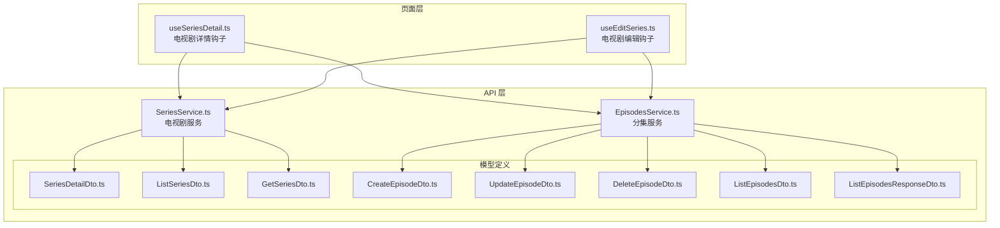
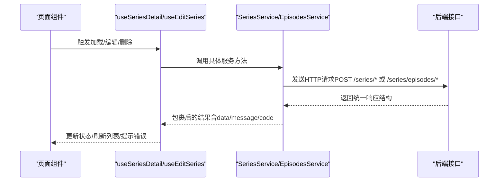
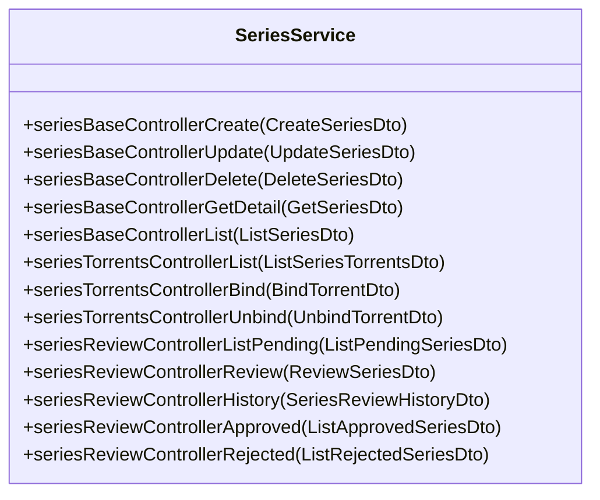
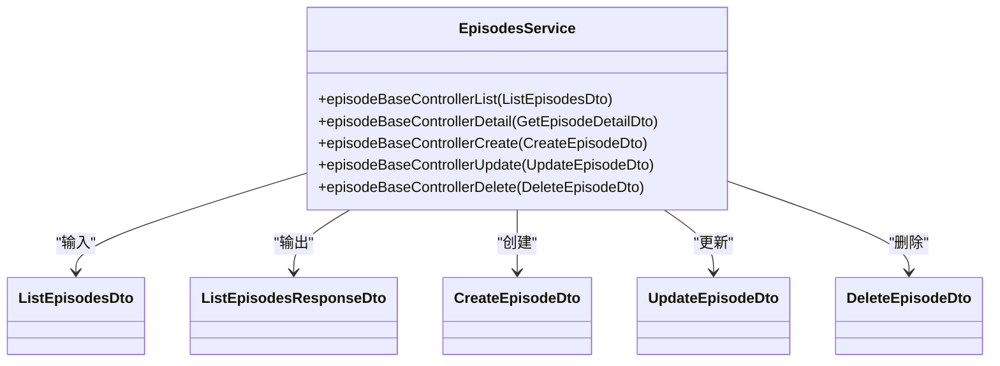
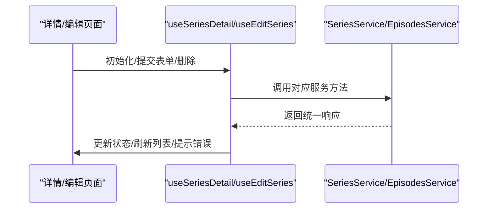
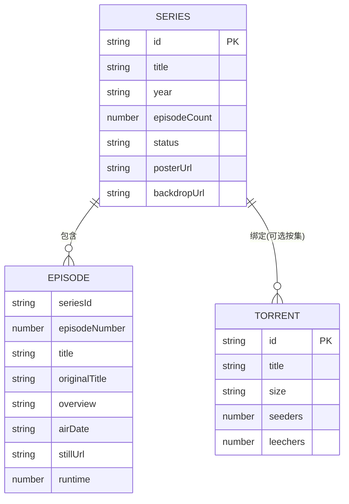
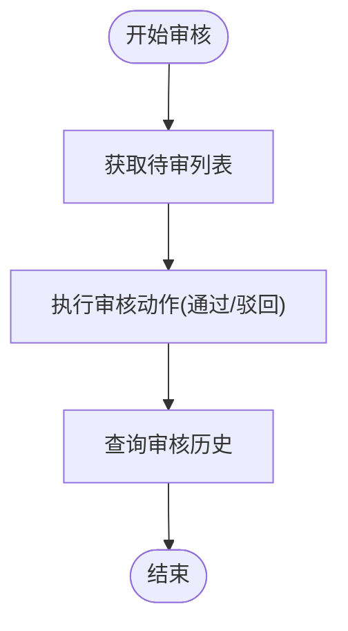
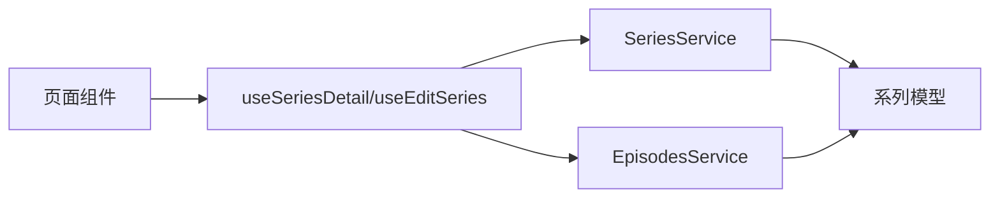

# 电视剧内容服务

<cite>
**本文引用的文件**
- [SeriesService.ts](file://src/api/services/SeriesService.ts)
- [EpisodesService.ts](file://src/api/services/EpisodesService.ts)
- [SeriesDetailDto.ts](file://src/api/models/SeriesDetailDto.ts)
- [CreateSeriesDto.ts](file://src/api/models/CreateSeriesDto.ts)
- [UpdateSeriesDto.ts](file://src/api/models/UpdateSeriesDto.ts)
- [DeleteSeriesDto.ts](file://src/api/models/DeleteSeriesDto.ts)
- [CreateEpisodeDto.ts](file://src/api/models/CreateEpisodeDto.ts)
- [UpdateEpisodeDto.ts](file://src/api/models/UpdateEpisodeDto.ts)
- [DeleteEpisodeDto.ts](file://src/api/models/DeleteEpisodeDto.ts)
- [ListEpisodesDto.ts](file://src/api/models/ListEpisodesDto.ts)
- [ListEpisodesResponseDto.ts](file://src/api/models/ListEpisodesResponseDto.ts)
- [ListSeriesDto.ts](file://src/api/models/ListSeriesDto.ts)
- [GetSeriesDto.ts](file://src/api/models/GetSeriesDto.ts)
- [useSeriesDetail.ts](file://src/modules/app/pages/SeriesDetail/hooks/useSeriesDetail.ts)
- [useEditSeries.ts](file://src/modules/app/pages/Edit/series/hooks/useEditSeries.ts)
- [types.ts](file://src/modules/app/pages/Edit/series/types.ts)
- [utils.ts](file://src/modules/app/pages/Edit/series/utils.ts)
- [2025-12-18_剧集分集与种子管理_需求文档.md](file://docs/api-requirements/2025-12-18_剧集分集与种子管理_需求文档.md)
</cite>

## 目录
1. [引言](#引言)
2. [项目结构](#项目结构)
3. [核心组件](#核心组件)
4. [架构总览](#架构总览)
5. [详细组件分析](#详细组件分析)
6. [依赖分析](#依赖分析)
7. [性能考虑](#性能考虑)
8. [故障排查指南](#故障排查指南)
9. [结论](#结论)
10. [附录](#附录)

## 引言
本技术文档围绕电视剧内容服务展开，系统性梳理 SeriesService 与 EpisodesService 的实现机制，覆盖电视剧的创建、更新、删除、详情查询与列表获取；深入解析电视剧与剧集的关系管理、分集编辑与批量操作；解释电视剧审核流程、剧集状态管理与播放列表集成；并提供上传、编辑与删除的最佳实践，以及推荐算法、统计数据收集与性能优化策略。文档同时给出 API 调用示例与数据处理模式，帮助开发者快速理解与落地。

## 项目结构
本项目采用前后端分离的模块化组织方式，电视剧相关内容主要分布在以下位置：
- API 层：服务类与模型定义位于 src/api/services 与 src/api/models
- 页面层：电视剧详情与编辑页面的业务逻辑位于 src/modules/app/pages/.../hooks 与 types/utils
- 文档层：接口需求说明位于 docs/api-requirements

图表来源
- [useSeriesDetail.ts](file://src/modules/app/pages/SeriesDetail/hooks/useSeriesDetail.ts#L1-L43)
- [useEditSeries.ts](file://src/modules/app/pages/Edit/series/hooks/useEditSeries.ts#L1-L461)
- [SeriesService.ts](file://src/api/services/SeriesService.ts#L30-L409)
- [EpisodesService.ts](file://src/api/services/EpisodesService.ts#L21-L67)
- [SeriesDetailDto.ts](file://src/api/models/SeriesDetailDto.ts#L5-L37)
- [ListSeriesDto.ts](file://src/api/models/ListSeriesDto.ts#L5-L62)
- [GetSeriesDto.ts](file://src/api/models/GetSeriesDto.ts#L5-L10)
- [CreateEpisodeDto.ts](file://src/api/models/CreateEpisodeDto.ts#L5-L38)
- [UpdateEpisodeDto.ts](file://src/api/models/UpdateEpisodeDto.ts#L5-L38)
- [DeleteEpisodeDto.ts](file://src/api/models/DeleteEpisodeDto.ts#L5-L10)
- [ListEpisodesDto.ts](file://src/api/models/ListEpisodesDto.ts#L5-L10)
- [ListEpisodesResponseDto.ts](file://src/api/models/ListEpisodesResponseDto.ts#L5-L15)

章节来源
- [useSeriesDetail.ts](file://src/modules/app/pages/SeriesDetail/hooks/useSeriesDetail.ts#L1-L43)
- [useEditSeries.ts](file://src/modules/app/pages/Edit/series/hooks/useEditSeries.ts#L1-L461)
- [SeriesService.ts](file://src/api/services/SeriesService.ts#L30-L409)
- [EpisodesService.ts](file://src/api/services/EpisodesService.ts#L21-L67)

## 核心组件
- SeriesService：提供电视剧的创建、更新、删除、详情查询、列表查询、种子关联/解绑、审核相关接口。
- EpisodesService：提供分集列表、详情、创建、更新、删除等接口。
- 页面钩子 useSeriesDetail/useEditSeries：负责在页面中拉取电视剧详情与分集列表，并协调编辑与审核流程。
- 类型与模型：SeriesDetailDto、CreateSeriesDto、UpdateSeriesDto、CreateEpisodeDto、UpdateEpisodeDto、ListEpisodesDto 等，定义了请求与响应的数据结构。

章节来源
- [SeriesService.ts](file://src/api/services/SeriesService.ts#L30-L409)
- [EpisodesService.ts](file://src/api/services/EpisodesService.ts#L21-L67)
- [SeriesDetailDto.ts](file://src/api/models/SeriesDetailDto.ts#L5-L37)
- [CreateSeriesDto.ts](file://src/api/models/CreateSeriesDto.ts#L5-L97)
- [UpdateSeriesDto.ts](file://src/api/models/UpdateSeriesDto.ts#L5-L101)
- [CreateEpisodeDto.ts](file://src/api/models/CreateEpisodeDto.ts#L5-L38)
- [UpdateEpisodeDto.ts](file://src/api/models/UpdateEpisodeDto.ts#L5-L38)
- [ListEpisodesDto.ts](file://src/api/models/ListEpisodesDto.ts#L5-L10)
- [useSeriesDetail.ts](file://src/modules/app/pages/SeriesDetail/hooks/useSeriesDetail.ts#L11-L43)
- [useEditSeries.ts](file://src/modules/app/pages/Edit/series/hooks/useEditSeries.ts#L26-L461)

## 架构总览
电视剧内容服务的调用链路分为三层：
- 页面层：通过 useSeriesDetail/useEditSeries 发起业务请求
- 服务层：SeriesService/EpisodesService 封装 HTTP 请求与错误映射
- 数据层：基于 OpenAPI 生成的请求封装与 CancelablePromise 返回值

图表来源
- [useSeriesDetail.ts](file://src/modules/app/pages/SeriesDetail/hooks/useSeriesDetail.ts#L23-L43)
- [useEditSeries.ts](file://src/modules/app/pages/Edit/series/hooks/useEditSeries.ts#L74-L89)
- [SeriesService.ts](file://src/api/services/SeriesService.ts#L37-L174)
- [EpisodesService.ts](file://src/api/services/EpisodesService.ts#L29-L51)

## 详细组件分析

### SeriesService 组件分析
- 功能范围
  - 电视剧 CRUD：创建、更新、删除、详情、列表
  - 种子管理：关联/解绑种子，按剧集列出种子
  - 审核管理：待审/已审/已拒列表，审核动作与历史查询
- 关键接口与数据模型
  - 创建/更新/删除/详情/列表：对应 CreateSeriesDto/UpdateSeriesDto/DeleteSeriesDto/SeriesDetailDto/GetSeriesDto/ListSeriesDto
  - 种子关联/解绑/列表：对应 BindTorrentDto/UnbindTorrentDto/ListSeriesTorrentsDto
  - 审核相关：ReviewSeriesDto、各状态列表 DTO、历史 DTO
- 错误处理
  - 统一映射 400/401/403/404/500 等错误码，便于前端统一处理

图表来源
- [SeriesService.ts](file://src/api/services/SeriesService.ts#L30-L409)
- [CreateSeriesDto.ts](file://src/api/models/CreateSeriesDto.ts#L5-L97)
- [UpdateSeriesDto.ts](file://src/api/models/UpdateSeriesDto.ts#L5-L101)
- [DeleteSeriesDto.ts](file://src/api/models/DeleteSeriesDto.ts#L5-L10)
- [GetSeriesDto.ts](file://src/api/models/GetSeriesDto.ts#L5-L10)
- [ListSeriesDto.ts](file://src/api/models/ListSeriesDto.ts#L5-L62)

章节来源
- [SeriesService.ts](file://src/api/services/SeriesService.ts#L30-L409)
- [CreateSeriesDto.ts](file://src/api/models/CreateSeriesDto.ts#L5-L97)
- [UpdateSeriesDto.ts](file://src/api/models/UpdateSeriesDto.ts#L5-L101)
- [DeleteSeriesDto.ts](file://src/api/models/DeleteSeriesDto.ts#L5-L10)
- [GetSeriesDto.ts](file://src/api/models/GetSeriesDto.ts#L5-L10)
- [ListSeriesDto.ts](file://src/api/models/ListSeriesDto.ts#L5-L62)

### EpisodesService 组件分析
- 功能范围
  - 分集列表与详情：按剧集 ID 查询分集集合
  - 分集 CRUD：创建、更新、删除分集
- 关键接口与数据模型
  - 列表：ListEpisodesDto → ListEpisodesResponseDto → EpisodeDTO[]
  - 详情：GetEpisodeDetailDto（模型存在但未在服务中暴露，需后续补充）
  - CRUD：CreateEpisodeDto/UpdateEpisodeDto/DeleteEpisodeDto
- 批量与关系管理
  - 通过 seriesId 与 episodeNumber 组合标识分集
  - 支持与种子的多对多关系（按整季或单集）

图表来源
- [EpisodesService.ts](file://src/api/services/EpisodesService.ts#L21-L67)
- [ListEpisodesDto.ts](file://src/api/models/ListEpisodesDto.ts#L5-L10)
- [ListEpisodesResponseDto.ts](file://src/api/models/ListEpisodesResponseDto.ts#L5-L15)
- [CreateEpisodeDto.ts](file://src/api/models/CreateEpisodeDto.ts#L5-L38)
- [UpdateEpisodeDto.ts](file://src/api/models/UpdateEpisodeDto.ts#L5-L38)
- [DeleteEpisodeDto.ts](file://src/api/models/DeleteEpisodeDto.ts#L5-L10)

章节来源
- [EpisodesService.ts](file://src/api/services/EpisodesService.ts#L21-L67)
- [ListEpisodesDto.ts](file://src/api/models/ListEpisodesDto.ts#L5-L10)
- [ListEpisodesResponseDto.ts](file://src/api/models/ListEpisodesResponseDto.ts#L5-L15)
- [CreateEpisodeDto.ts](file://src/api/models/CreateEpisodeDto.ts#L5-L38)
- [UpdateEpisodeDto.ts](file://src/api/models/UpdateEpisodeDto.ts#L5-L38)
- [DeleteEpisodeDto.ts](file://src/api/models/DeleteEpisodeDto.ts#L5-L10)

### 页面钩子：useSeriesDetail 与 useEditSeries
- useSeriesDetail
  - 加载电视剧详情与分集列表，统一错误处理
  - 依赖 SeriesService.detail 与 EpisodesService.list
- useEditSeries
  - 电视剧 CRUD：列表、搜索、创建、更新、删除
  - 分集 CRUD：创建、更新、删除
  - 种子管理：绑定/解绑、搜索种子
  - 表单校验与 PTGen 数据填充（豆瓣/IMDb 等）

图表来源
- [useSeriesDetail.ts](file://src/modules/app/pages/SeriesDetail/hooks/useSeriesDetail.ts#L23-L43)
- [useEditSeries.ts](file://src/modules/app/pages/Edit/series/hooks/useEditSeries.ts#L183-L270)
- [SeriesService.ts](file://src/api/services/SeriesService.ts#L37-L174)
- [EpisodesService.ts](file://src/api/services/EpisodesService.ts#L29-L51)

章节来源
- [useSeriesDetail.ts](file://src/modules/app/pages/SeriesDetail/hooks/useSeriesDetail.ts#L11-L43)
- [useEditSeries.ts](file://src/modules/app/pages/Edit/series/hooks/useEditSeries.ts#L26-L461)

### 数据模型与关系管理
- 电视剧与分集
  - 一对多关系：Series → Episode
  - 分集标识：seriesId + episodeNumber（复合键）
- 电视剧与种子
  - 多对多关系：Series ↔ Torrent（可按整季或单集绑定）
  - 绑定信息包含 episodeNumber 字段以区分分集
- 页面类型
  - Series、Episode、SeriesTorrent、Torrent 等本地类型用于 UI 展示与编辑

图表来源
- [SeriesDetailDto.ts](file://src/api/models/SeriesDetailDto.ts#L5-L37)
- [CreateEpisodeDto.ts](file://src/api/models/CreateEpisodeDto.ts#L5-L38)
- [types.ts](file://src/modules/app/pages/Edit/series/types.ts#L1-L118)

章节来源
- [SeriesDetailDto.ts](file://src/api/models/SeriesDetailDto.ts#L5-L37)
- [CreateEpisodeDto.ts](file://src/api/models/CreateEpisodeDto.ts#L5-L38)
- [types.ts](file://src/modules/app/pages/Edit/series/types.ts#L1-L118)

### 审核流程与状态管理
- 审核接口
  - 待审/已审/已拒列表
  - 审核动作（通过/驳回）
  - 审核历史查询
- 状态枚举
  - 剧集状态：airing/ended/upcoming
  - 排序字段与方向：rating/year/createdAt/viewsCount 等

图表来源
- [SeriesService.ts](file://src/api/services/SeriesService.ts#L269-L349)
- [ListSeriesDto.ts](file://src/api/models/ListSeriesDto.ts#L37-L62)

章节来源
- [SeriesService.ts](file://src/api/services/SeriesService.ts#L269-L349)
- [ListSeriesDto.ts](file://src/api/models/ListSeriesDto.ts#L37-L62)

### 播放列表集成
- 当前仓库未发现播放列表专用服务与模型
- 若需集成播放列表，建议新增 PlaylistService 与 PlaylistItemDTO，并在 Series/Episode 侧增加 addToPlaylist 的关联能力

[本节为概念性说明，不直接分析具体文件]

## 依赖分析
- 组件耦合
  - 页面钩子依赖服务层，服务层依赖 OpenAPI 与请求封装
  - 模型定义贯穿服务与页面，确保前后端契约一致
- 外部依赖
  - OpenAPI 与 request/CancelablePromise 提供统一的网络层抽象
- 潜在风险
  - 分集 DTO 缺少 ID 字段，可能导致更新/删除困难；建议后端补齐复合键或主键

图表来源
- [useSeriesDetail.ts](file://src/modules/app/pages/SeriesDetail/hooks/useSeriesDetail.ts#L1-L43)
- [useEditSeries.ts](file://src/modules/app/pages/Edit/series/hooks/useEditSeries.ts#L1-L461)
- [SeriesService.ts](file://src/api/services/SeriesService.ts#L30-L409)
- [EpisodesService.ts](file://src/api/services/EpisodesService.ts#L21-L67)

章节来源
- [useSeriesDetail.ts](file://src/modules/app/pages/SeriesDetail/hooks/useSeriesDetail.ts#L1-L43)
- [useEditSeries.ts](file://src/modules/app/pages/Edit/series/hooks/useEditSeries.ts#L1-L461)
- [SeriesService.ts](file://src/api/services/SeriesService.ts#L30-L409)
- [EpisodesService.ts](file://src/api/services/EpisodesService.ts#L21-L67)

## 性能考虑
- 列表分页与排序
  - 使用 ListSeriesDto 的分页与排序字段，避免一次性加载过多数据
- 并发请求
  - 在详情页并发发起电视剧详情与分集列表请求，减少等待时间
- 缓存策略
  - 对静态元数据（如电视剧基础信息）进行短期缓存，降低重复请求
- 批量操作
  - 分集与种子的批量绑定/解绑建议后端支持批量接口，前端聚合后再提交
- 网络层优化
  - 使用 CancelablePromise 及早取消无用请求，避免竞态与内存泄漏

[本节提供通用指导，不直接分析具体文件]

## 故障排查指南
- 常见错误码
  - 400 参数错误：检查请求 DTO 字段是否完整与合法
  - 401 未认证：确认登录状态与权限
  - 403 禁止访问：检查角色与站点配置
  - 404 资源不存在：确认 ID 是否正确
  - 500 服务器错误：查看后端日志并重试
- 前端处理
  - 使用统一的错误提示与重试机制
  - 对空数据与异常响应进行兜底处理

章节来源
- [SeriesService.ts](file://src/api/services/SeriesService.ts#L51-L57)
- [EpisodesService.ts](file://src/api/services/EpisodesService.ts#L43-L49)

## 结论
本技术文档系统性梳理了电视剧内容服务的实现与使用方式，明确了 SeriesService 与 EpisodesService 的职责边界、数据模型与调用流程，并结合页面钩子展示了从详情到编辑的完整业务闭环。针对分集与种子的复杂关系，建议补齐后端 DTO 与接口，以支撑更稳健的更新/删除与批量操作。同时，结合审核流程与状态管理，可进一步完善内容治理与用户体验。

## 附录

### API 调用示例与数据处理模式
- 电视剧详情与分集列表
  - 详情：SeriesService.seriesBaseControllerGetDetail(GetSeriesDto)
  - 分集列表：EpisodesService.episodeBaseControllerList(ListEpisodesDto)
- 电视剧 CRUD
  - 创建：SeriesService.seriesBaseControllerCreate(CreateSeriesDto)
  - 更新：SeriesService.seriesBaseControllerUpdate(UpdateSeriesDto)
  - 删除：SeriesService.seriesBaseControllerDelete(DeleteSeriesDto)
  - 列表：SeriesService.seriesBaseControllerList(ListSeriesDto)
- 种子管理
  - 列表：SeriesService.seriesTorrentsControllerList(ListSeriesTorrentsDto)
  - 绑定：SeriesService.seriesTorrentsControllerBind(BindTorrentDto)
  - 解绑：SeriesService.seriesTorrentsControllerUnbind(UnbindTorrentDto)
- 审核流程
  - 待审/已审/已拒：seriesReviewControllerListPending/Approved/Rejected
  - 审核动作：seriesReviewControllerReview(ReviewSeriesDto)
  - 历史：seriesReviewControllerHistory(SeriesReviewHistoryDto)

章节来源
- [SeriesService.ts](file://src/api/services/SeriesService.ts#L37-L349)
- [EpisodesService.ts](file://src/api/services/EpisodesService.ts#L29-L67)
- [GetSeriesDto.ts](file://src/api/models/GetSeriesDto.ts#L5-L10)
- [ListEpisodesDto.ts](file://src/api/models/ListEpisodesDto.ts#L5-L10)
- [ListSeriesDto.ts](file://src/api/models/ListSeriesDto.ts#L5-L62)

### 最佳实践
- 上传与编辑
  - 使用 PTGen 填充基础元数据，再手动校正
  - 表单校验优先于提交，避免无效请求
- 删除
  - 删除前二次确认，删除后刷新列表并清理选中项
- 分集与种子
  - 明确绑定粒度（整季 vs 单集），避免歧义
  - 批量操作建议后端支持，前端聚合后再提交
- 审核
  - 审核动作需记录历史，便于追溯
  - 审核状态与电视剧状态保持一致

章节来源
- [useEditSeries.ts](file://src/modules/app/pages/Edit/series/hooks/useEditSeries.ts#L183-L270)
- [utils.ts](file://src/modules/app/pages/Edit/series/utils.ts#L14-L24)

### 需求与扩展
- 当前需求文档明确了分集管理与种子关联能力，建议尽快补齐后端接口与 DTO，以支撑前端的分集编辑与批量操作。

章节来源
- [2025-12-18_剧集分集与种子管理_需求文档.md](file://docs/api-requirements/2025-12-18_剧集分集与种子管理_需求文档.md#L6-L15)