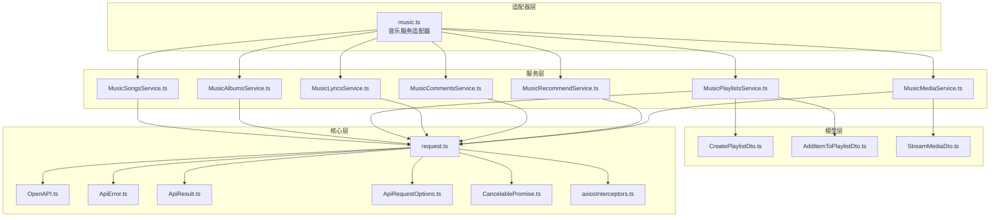
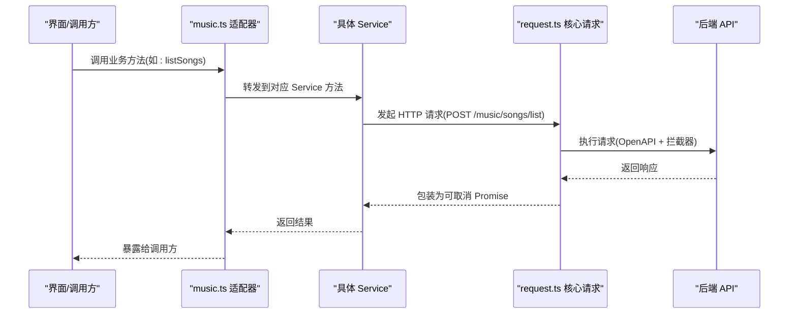
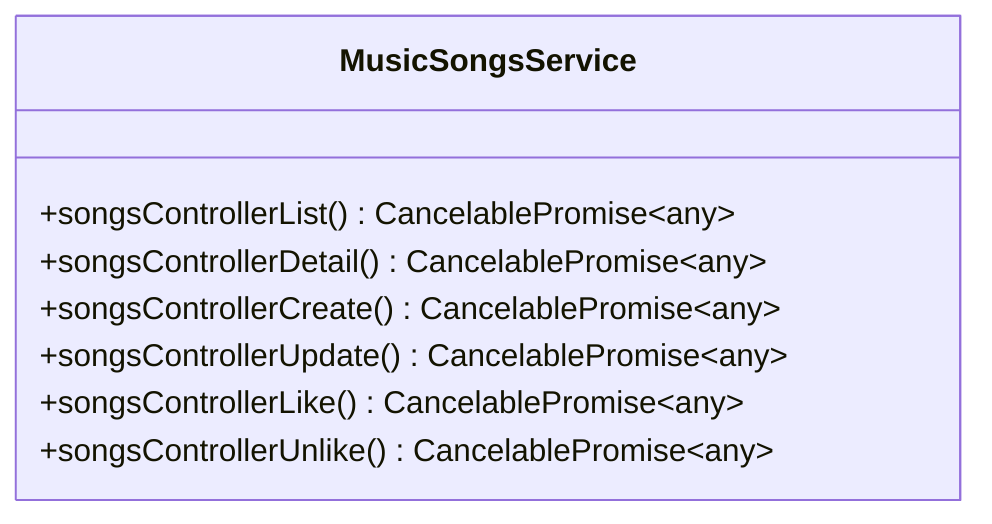
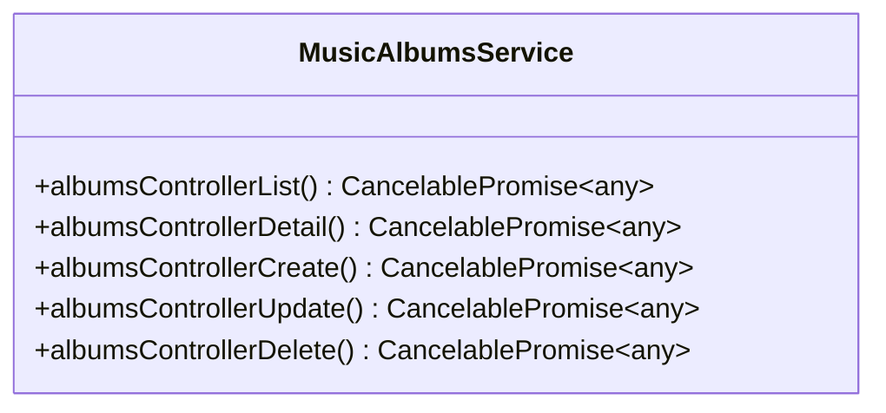
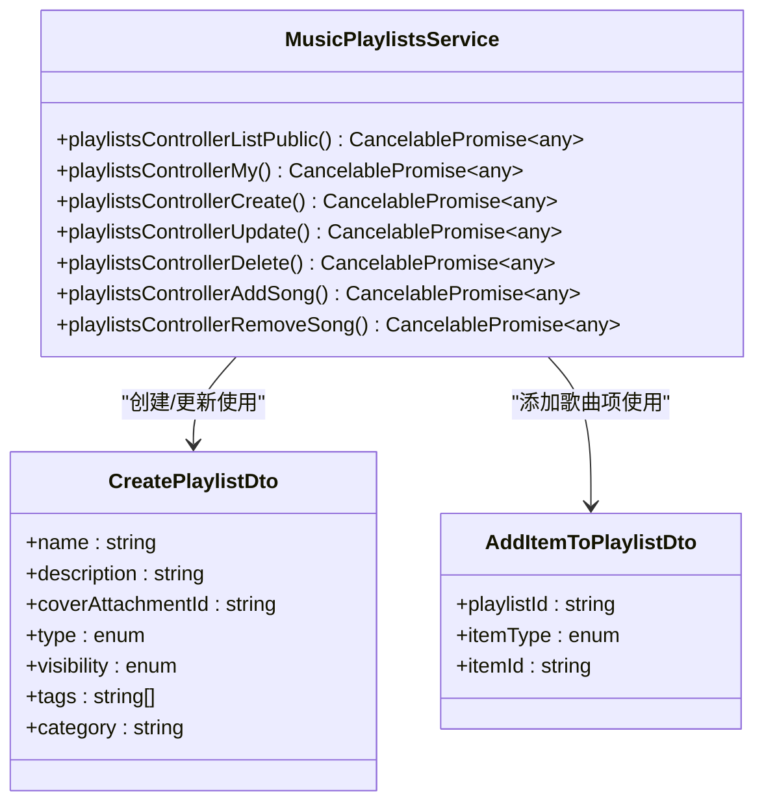
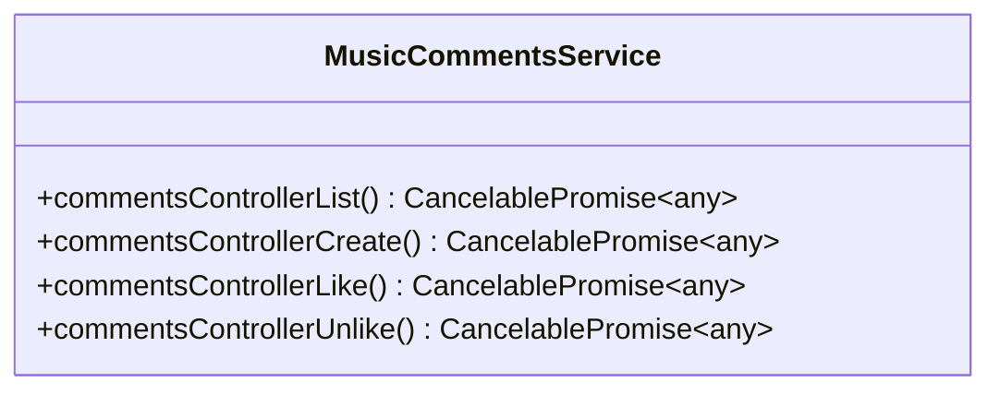
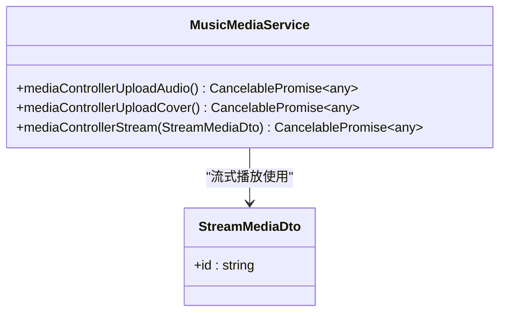
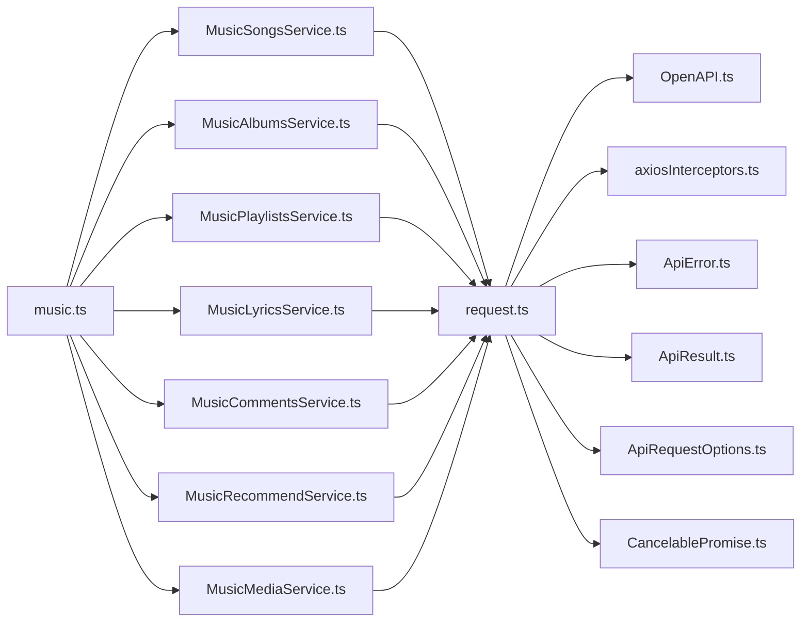

# 音乐内容服务

<cite>
**本文引用的文件**
- [README.md](file://README.md)
- [music.ts](file://src/api/adapters/music.ts)
- [MusicSongsService.ts](file://src/api/services/MusicSongsService.ts)
- [MusicAlbumsService.ts](file://src/api/services/MusicAlbumsService.ts)
- [MusicPlaylistsService.ts](file://src/api/services/MusicPlaylistsService.ts)
- [MusicLyricsService.ts](file://src/api/services/MusicLyricsService.ts)
- [MusicCommentsService.ts](file://src/api/services/MusicCommentsService.ts)
- [MusicRecommendService.ts](file://src/api/services/MusicRecommendService.ts)
- [MusicMediaService.ts](file://src/api/services/MusicMediaService.ts)
- [CreatePlaylistDto.ts](file://src/api/models/CreatePlaylistDto.ts)
- [AddItemToPlaylistDto.ts](file://src/api/models/AddItemToPlaylistDto.ts)
- [StreamMediaDto.ts](file://src/api/models/StreamMediaDto.ts)
- [ApiError.ts](file://src/api/core/ApiError.ts)
- [ApiRequestOptions.ts](file://src/api/core/ApiRequestOptions.ts)
- [ApiResult.ts](file://src/api/core/ApiResult.ts)
- [CancelablePromise.ts](file://src/api/core/CancelablePromise.ts)
- [OpenAPI.ts](file://src/api/core/OpenAPI.ts)
- [request.ts](file://src/api/core/request.ts)
- [axiosInterceptors.ts](file://src/api/axiosInterceptors.ts)
- [index.ts](file://src/api/index.ts)
</cite>

## 目录
1. [简介](#简介)
2. [项目结构](#项目结构)
3. [核心组件](#核心组件)
4. [架构总览](#架构总览)
5. [详细组件分析](#详细组件分析)
6. [依赖关系分析](#依赖关系分析)
7. [性能考虑](#性能考虑)
8. [故障排查指南](#故障排查指南)
9. [结论](#结论)
10. [附录](#附录)

## 简介
本技术文档面向音乐内容服务模块，系统梳理并解析音乐专辑、艺术家、歌曲、播放列表等音乐相关内容服务的实现机制；深入分析音乐媒体文件管理、评论系统与推荐算法的接口设计；解释音乐内容的分类体系、标签管理与搜索能力；提供音乐内容上传、编辑与管理的最佳实践；并给出播放统计、用户偏好分析与个性化推荐策略的落地建议。文档同时展示音乐相关 API 的调用示例与数据处理模式，帮助开发者快速理解与扩展音乐服务。

## 项目结构
音乐服务位于前端 API 层，采用“适配器 + 服务 + 模型”的分层组织方式：
- 适配器层：统一导出业务方法，封装具体服务调用
- 服务层：基于 OpenAPI 自动生成的 Service 类，定义各端点请求
- 模型层：DTO 与枚举类型，约束请求/响应数据结构
- 核心层：通用的请求封装、错误处理与拦截器

图表来源
- [music.ts](file://src/api/adapters/music.ts#L1-L36)
- [MusicSongsService.ts](file://src/api/services/MusicSongsService.ts#L1-L49)
- [MusicAlbumsService.ts](file://src/api/services/MusicAlbumsService.ts#L1-L60)
- [MusicPlaylistsService.ts](file://src/api/services/MusicPlaylistsService.ts#L1-L46)
- [MusicLyricsService.ts](file://src/api/services/MusicLyricsService.ts#L1-L20)
- [MusicCommentsService.ts](file://src/api/services/MusicCommentsService.ts#L1-L50)
- [MusicRecommendService.ts](file://src/api/services/MusicRecommendService.ts#L1-L20)
- [MusicMediaService.ts](file://src/api/services/MusicMediaService.ts#L1-L46)
- [CreatePlaylistDto.ts](file://src/api/models/CreatePlaylistDto.ts#L1-L54)
- [AddItemToPlaylistDto.ts](file://src/api/models/AddItemToPlaylistDto.ts#L1-L29)
- [StreamMediaDto.ts](file://src/api/models/StreamMediaDto.ts#L1-L12)
- [OpenAPI.ts](file://src/api/core/OpenAPI.ts)
- [request.ts](file://src/api/core/request.ts)
- [ApiError.ts](file://src/api/core/ApiError.ts)
- [ApiResult.ts](file://src/api/core/ApiResult.ts)
- [ApiRequestOptions.ts](file://src/api/core/ApiRequestOptions.ts)
- [CancelablePromise.ts](file://src/api/core/CancelablePromise.ts)
- [axiosInterceptors.ts](file://src/api/axiosInterceptors.ts)

章节来源
- [README.md](file://README.md#L1-L11)
- [music.ts](file://src/api/adapters/music.ts#L1-L36)

## 核心组件
本节聚焦音乐服务的关键组件及其职责：
- 音乐歌曲服务：提供歌曲列表、详情、创建、更新、点赞/取消点赞等操作
- 音乐专辑服务：提供专辑列表、详情、创建、更新、删除等操作
- 音乐播放列表服务：提供公开列表、我的列表、创建、更新、添加/移除歌曲、删除等操作
- 歌词服务：获取歌词详情
- 评论服务：列出评论、创建评论、点赞/取消点赞
- 推荐服务：获取相似歌曲
- 媒体服务：音频上传（音频/封面）、媒体流式播放

章节来源
- [MusicSongsService.ts](file://src/api/services/MusicSongsService.ts#L1-L49)
- [MusicAlbumsService.ts](file://src/api/services/MusicAlbumsService.ts#L1-L60)
- [MusicPlaylistsService.ts](file://src/api/services/MusicPlaylistsService.ts#L1-L46)
- [MusicLyricsService.ts](file://src/api/services/MusicLyricsService.ts#L1-L20)
- [MusicCommentsService.ts](file://src/api/services/MusicCommentsService.ts#L1-L50)
- [MusicRecommendService.ts](file://src/api/services/MusicRecommendService.ts#L1-L20)
- [MusicMediaService.ts](file://src/api/services/MusicMediaService.ts#L1-L46)

## 架构总览
音乐服务采用“适配器 + 服务 + 模型 + 核心”四层架构：
- 适配器层将业务方法统一封装，便于上层调用与测试
- 服务层通过 OpenAPI 请求工具发起 HTTP 调用，统一处理路径、方法与参数
- 模型层提供 DTO 与枚举，确保数据结构一致与可维护
- 核心层提供请求封装、错误处理、可取消 Promise、拦截器等基础设施

图表来源
- [music.ts](file://src/api/adapters/music.ts#L10-L11)
- [MusicSongsService.ts](file://src/api/services/MusicSongsService.ts#L13-L18)
- [request.ts](file://src/api/core/request.ts)
- [OpenAPI.ts](file://src/api/core/OpenAPI.ts)

## 详细组件分析

### 音乐歌曲服务（MusicSongsService）
- 主要能力：歌曲列表、详情、创建、更新、点赞/取消点赞
- 关键端点：POST /music/songs/list, POST /music/songs/detail, POST /music/songs/create, POST /music/songs/update, POST /music/songs/like, POST /music/songs/unlike
- 数据契约：通过服务方法返回可取消 Promise，实际请求由核心请求工具执行

图表来源
- [MusicSongsService.ts](file://src/api/services/MusicSongsService.ts#L1-L49)

章节来源
- [MusicSongsService.ts](file://src/api/services/MusicSongsService.ts#L1-L49)

### 音乐专辑服务（MusicAlbumsService）
- 主要能力：专辑列表、详情、创建、更新、删除
- 关键端点：POST /music/albums/list, POST /music/albums/detail, POST /music/albums/create, POST /music/albums/update, POST /music/albums/delete

图表来源
- [MusicAlbumsService.ts](file://src/api/services/MusicAlbumsService.ts#L1-L60)

章节来源
- [MusicAlbumsService.ts](file://src/api/services/MusicAlbumsService.ts#L1-L60)

### 音乐播放列表服务（MusicPlaylistsService）
- 主要能力：公开列表、我的列表、创建、更新、删除；添加/移除歌曲项
- 关键端点：POST /music/playlists/public/list, POST /music/playlists/my, POST /music/playlists/create, POST /music/playlists/update, POST /music/playlists/delete, POST /music/playlists/add-song, POST /music/playlists/remove-song
- 数据契约：CreatePlaylistDto、AddItemToPlaylistDto 等

图表来源
- [MusicPlaylistsService.ts](file://src/api/services/MusicPlaylistsService.ts#L1-L46)
- [CreatePlaylistDto.ts](file://src/api/models/CreatePlaylistDto.ts#L1-L54)
- [AddItemToPlaylistDto.ts](file://src/api/models/AddItemToPlaylistDto.ts#L1-L29)

章节来源
- [MusicPlaylistsService.ts](file://src/api/services/MusicPlaylistsService.ts#L1-L46)
- [CreatePlaylistDto.ts](file://src/api/models/CreatePlaylistDto.ts#L1-L54)
- [AddItemToPlaylistDto.ts](file://src/api/models/AddItemToPlaylistDto.ts#L1-L29)

### 歌词服务（MusicLyricsService）
- 主要能力：获取歌词详情
- 关键端点：POST /music/songs/lyrics/detail

图表来源
- [MusicLyricsService.ts](file://src/api/services/MusicLyricsService.ts#L1-L20)

章节来源
- [MusicLyricsService.ts](file://src/api/services/MusicLyricsService.ts#L1-L20)

### 评论服务（MusicCommentsService）
- 主要能力：列出评论、创建评论、点赞/取消点赞
- 关键端点：POST /music/comments/list, POST /music/comments/create, POST /music/comments/like, POST /music/comments/unlike

图表来源
- [MusicCommentsService.ts](file://src/api/services/MusicCommentsService.ts#L1-L50)

章节来源
- [MusicCommentsService.ts](file://src/api/services/MusicCommentsService.ts#L1-L50)

### 推荐服务（MusicRecommendService）
- 主要能力：获取相似歌曲
- 关键端点：POST /music/songs/similar

图表来源
- [MusicRecommendService.ts](file://src/api/services/MusicRecommendService.ts#L1-L20)

章节来源
- [MusicRecommendService.ts](file://src/api/services/MusicRecommendService.ts#L1-L20)

### 媒体服务（MusicMediaService）
- 主要能力：音频上传（音频/封面）、媒体流式播放
- 关键端点：POST /music/songs/audio/upload, POST /music/songs/cover/upload, POST /music/songs/media/stream
- 数据契约：StreamMediaDto

图表来源
- [MusicMediaService.ts](file://src/api/services/MusicMediaService.ts#L1-L46)
- [StreamMediaDto.ts](file://src/api/models/StreamMediaDto.ts#L1-L12)

章节来源
- [MusicMediaService.ts](file://src/api/services/MusicMediaService.ts#L1-L46)
- [StreamMediaDto.ts](file://src/api/models/StreamMediaDto.ts#L1-L12)

### 适配器层（music.ts）
- 统一导出业务方法，屏蔽具体服务细节，便于上层直接调用
- 示例：listSongs、listAlbums、listMyPlaylists、getLyrics、listComments、getSimilarSongs、likeSong、unlikeSong、createPlaylist、addSongToPlaylist、removeSongFromPlaylist、deletePlaylist

图表来源
- [music.ts](file://src/api/adapters/music.ts#L10-L35)

章节来源
- [music.ts](file://src/api/adapters/music.ts#L1-L36)

## 依赖关系分析
- 适配器依赖具体服务类
- 服务类依赖核心请求工具与 OpenAPI 配置
- 模型类型在服务与适配器之间传递
- 拦截器贯穿请求生命周期，统一处理认证、错误与日志

图表来源
- [music.ts](file://src/api/adapters/music.ts#L1-L36)
- [MusicSongsService.ts](file://src/api/services/MusicSongsService.ts#L1-L49)
- [MusicAlbumsService.ts](file://src/api/services/MusicAlbumsService.ts#L1-L60)
- [MusicPlaylistsService.ts](file://src/api/services/MusicPlaylistsService.ts#L1-L46)
- [MusicLyricsService.ts](file://src/api/services/MusicLyricsService.ts#L1-L20)
- [MusicCommentsService.ts](file://src/api/services/MusicCommentsService.ts#L1-L50)
- [MusicRecommendService.ts](file://src/api/services/MusicRecommendService.ts#L1-L20)
- [MusicMediaService.ts](file://src/api/services/MusicMediaService.ts#L1-L46)
- [request.ts](file://src/api/core/request.ts)
- [OpenAPI.ts](file://src/api/core/OpenAPI.ts)
- [axiosInterceptors.ts](file://src/api/axiosInterceptors.ts)
- [ApiError.ts](file://src/api/core/ApiError.ts)
- [ApiResult.ts](file://src/api/core/ApiResult.ts)
- [ApiRequestOptions.ts](file://src/api/core/ApiRequestOptions.ts)
- [CancelablePromise.ts](file://src/api/core/CancelablePromise.ts)

章节来源
- [index.ts](file://src/api/index.ts#L598-L617)

## 性能考虑
- 流式媒体播放：利用媒体服务的流式接口支持 Range 请求，提升播放体验与带宽利用率
- 请求取消：使用可取消 Promise，在页面切换或组件卸载时及时取消未完成请求，避免资源浪费
- 错误重试与降级：在拦截器中实现幂等重试与降级策略，保障稳定性
- 缓存策略：对列表与详情接口引入缓存，减少重复请求；对歌词与封面等静态资源启用 CDN 加速
- 并发控制：批量操作（如批量添加歌曲到播放列表）应限制并发数，避免阻塞 UI

## 故障排查指南
- 常见错误类型：网络异常、鉴权失败、参数校验失败、服务端内部错误
- 定位手段：检查拦截器中的错误日志、统一错误包装类、请求参数与响应状态码
- 处理流程：捕获 ApiError，区分业务错误与系统错误，向用户反馈明确提示并记录上下文信息

章节来源
- [ApiError.ts](file://src/api/core/ApiError.ts)
- [ApiResult.ts](file://src/api/core/ApiResult.ts)
- [axiosInterceptors.ts](file://src/api/axiosInterceptors.ts)

## 结论
音乐内容服务通过清晰的分层架构实现了歌曲、专辑、播放列表、歌词、评论与推荐等核心能力，并以统一的适配器对外暴露简洁的调用接口。结合媒体流式播放与可取消请求等特性，能够满足高性能与高可用的音乐应用需求。后续可在推荐算法、播放统计与用户偏好分析方面进一步完善，以实现更智能的个性化体验。

## 附录

### API 调用示例与数据处理模式
- 列表与详情
  - 使用适配器方法调用对应 Service 的列表/详情方法，返回可取消 Promise
  - 示例路径参考：[music.ts](file://src/api/adapters/music.ts#L10-L11)、[MusicSongsService.ts](file://src/api/services/MusicSongsService.ts#L13-L18)
- 媒体流播放
  - 使用媒体服务的流式播放接口，传入 StreamMediaDto
  - 示例路径参考：[MusicMediaService.ts](file://src/api/services/MusicMediaService.ts#L36-L45)、[StreamMediaDto.ts](file://src/api/models/StreamMediaDto.ts#L1-L12)
- 播放列表管理
  - 创建播放列表使用 CreatePlaylistDto，添加歌曲使用 AddItemToPlaylistDto
  - 示例路径参考：[MusicPlaylistsService.ts](file://src/api/services/MusicPlaylistsService.ts#L33-L38)、[CreatePlaylistDto.ts](file://src/api/models/CreatePlaylistDto.ts#L1-L54)、[AddItemToPlaylistDto.ts](file://src/api/models/AddItemToPlaylistDto.ts#L1-L29)
- 评论与点赞
  - 列出评论与创建评论使用 MusicCommentsService 对应方法
  - 示例路径参考：[MusicCommentsService.ts](file://src/api/services/MusicCommentsService.ts#L13-L18)

### 最佳实践
- 上传与存储
  - 音频与封面分别上传，封面用于专辑与播放列表展示，音频 ID 作为流式播放依据
  - 示例路径参考：[MusicMediaService.ts](file://src/api/services/MusicMediaService.ts#L14-L19)
- 分类与标签
  - 播放列表支持分类与标签，便于检索与聚合
  - 示例路径参考：[CreatePlaylistDto.ts](file://src/api/models/CreatePlaylistDto.ts#L31-L33)
- 搜索与推荐
  - 利用相似歌曲推荐接口构建个性化推荐，结合用户行为数据优化排序
  - 示例路径参考：[MusicRecommendService.ts](file://src/api/services/MusicRecommendService.ts#L13-L18)