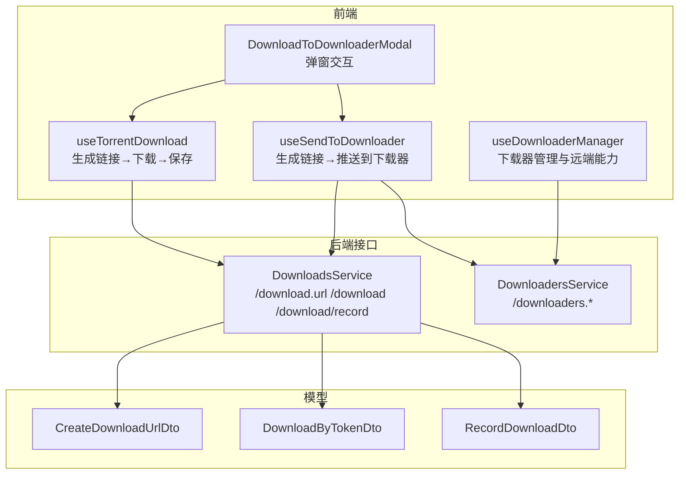
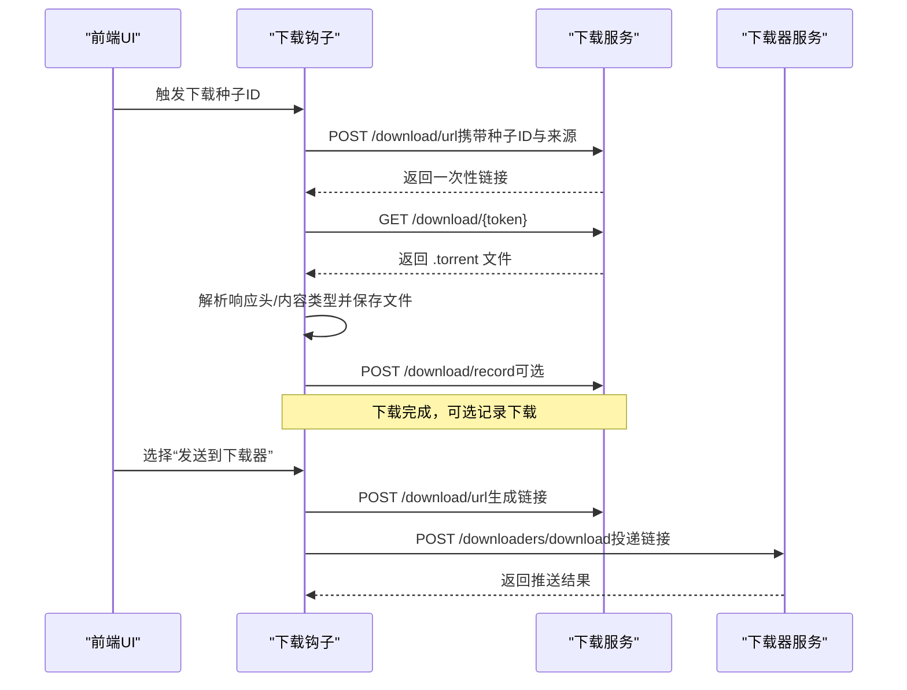
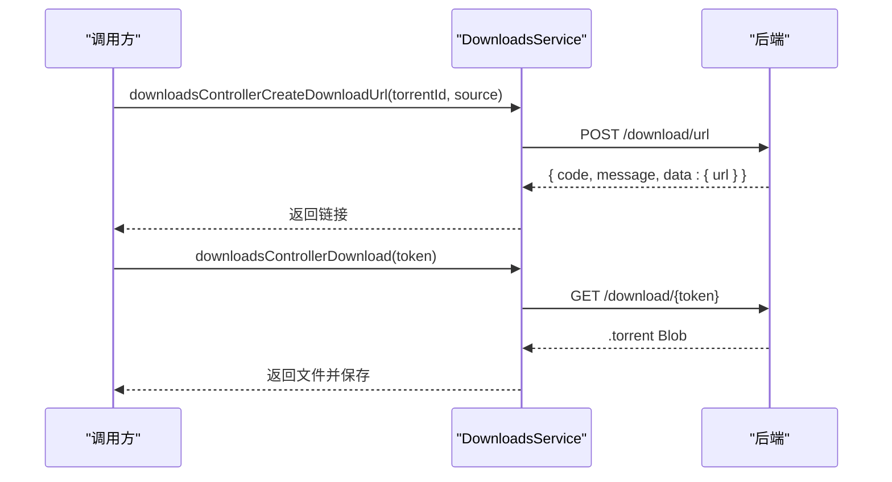
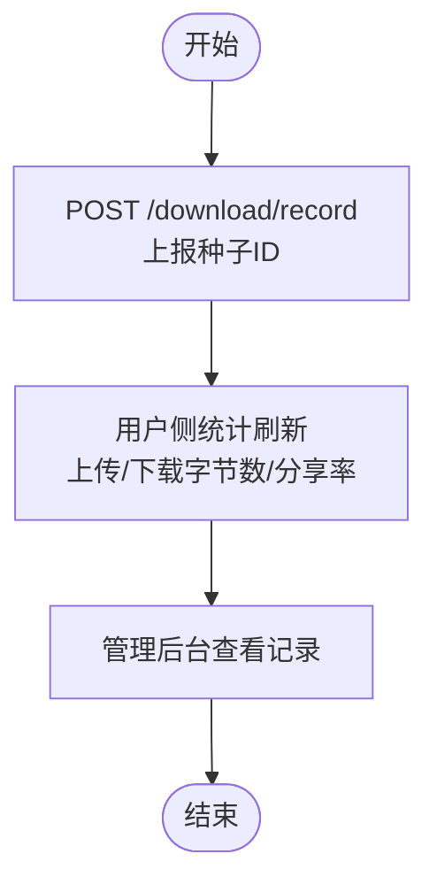
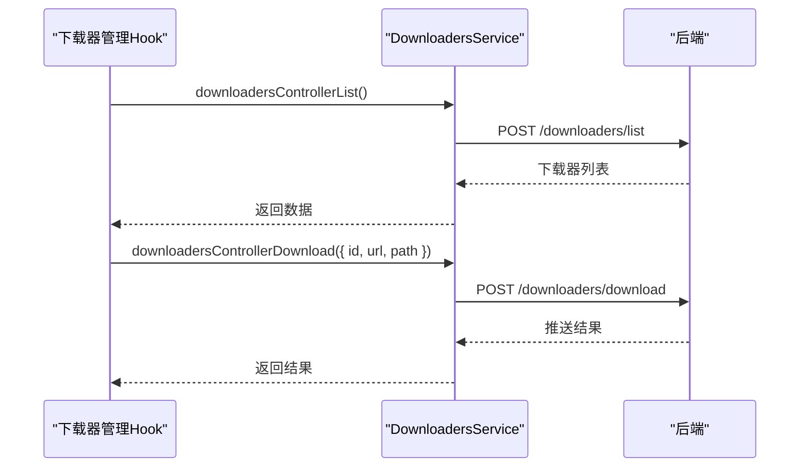
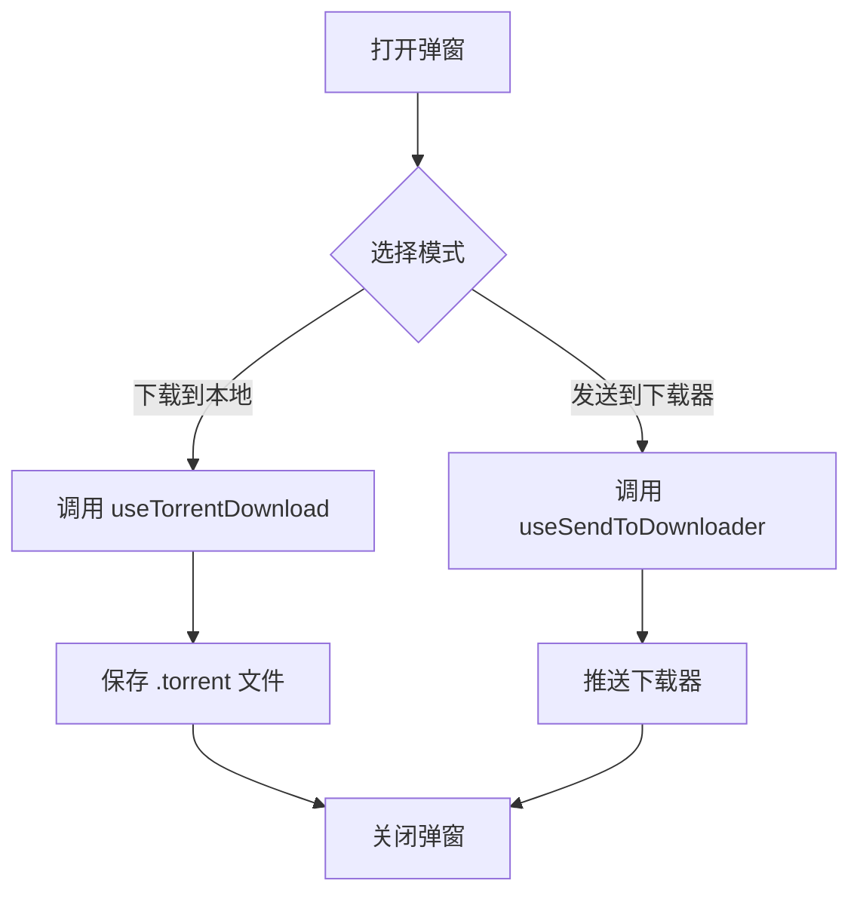
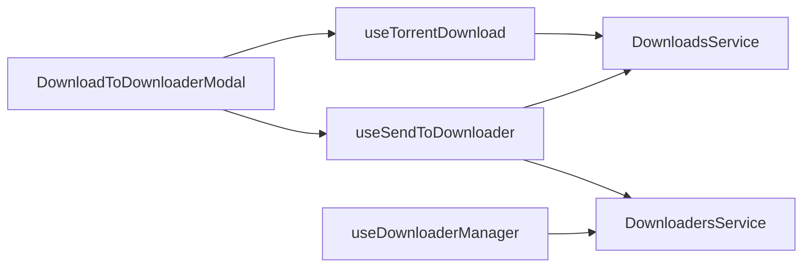

# 下载服务

<cite>
**本文引用的文件**
- [src/api/services/DownloadsService.ts](file://src/api/services/DownloadsService.ts)
- [src/api/services/DownloadersService.ts](file://src/api/services/DownloadersService.ts)
- [src/api/models/CreateDownloadUrlDto.ts](file://src/api/models/CreateDownloadUrlDto.ts)
- [src/api/models/DownloadByTokenDto.ts](file://src/api/models/DownloadByTokenDto.ts)
- [src/api/models/RecordDownloadDto.ts](file://src/api/models/RecordDownloadDto.ts)
- [src/modules/app/hooks/useTorrentDownload.ts](file://src/modules/app/hooks/useTorrentDownload.ts)
- [src/modules/app/hooks/useSendToDownloader.ts](file://src/modules/app/hooks/useSendToDownloader.ts)
- [src/modules/app/pages/Downloader/hooks/useDownloaderManager.ts](file://src/modules/app/pages/Downloader/hooks/useDownloaderManager.ts)
- [src/modules/app/components/DownloadToDownloaderModal.tsx](file://src/modules/app/components/DownloadToDownloaderModal.tsx)
- [src/modules/admin/pages/system/SystemSettingsPage/components/SettingItem.tsx](file://src/modules/admin/pages/system/SystemSettingsPage/components/SettingItem.tsx)
- [src/modules/app/context/UserSummaryContext.tsx](file://src/modules/app/context/UserSummaryContext.tsx)
- [src/modules/admin/pages/content/torrents/TorrentDownloadRecords/index.tsx](file://src/modules/admin/pages/content/torrents/TorrentDownloadRecords/index.tsx)
- [src/modules/admin/pages/content/torrents/UserDownloadRecords/index.tsx](file://src/modules/admin/pages/content/torrents/UserDownloadRecords/index.tsx)
- [src/modules/admin/geo-block-cn-frontend.md](file://src/modules/admin/geo-block-cn-frontend.md)
</cite>

## 目录
1. [简介](#简介)
2. [项目结构](#项目结构)
3. [核心组件](#核心组件)
4. [架构总览](#架构总览)
5. [详细组件分析](#详细组件分析)
6. [依赖关系分析](#依赖关系分析)
7. [性能考量](#性能考量)
8. [故障排查指南](#故障排查指南)
9. [结论](#结论)
10. [附录](#附录)

## 简介
本技术文档围绕下载服务进行系统化梳理，重点覆盖以下方面：
- 种子文件下载流程：一次性下载链接生成、令牌验证与消费、下载执行与保存
- 下载权限控制、并发与带宽管理策略
- 下载统计、流量监控与用户行为追踪
- 下载加速、断点续传与多线程下载优化
- 下载安全防护、恶意请求拦截与访问频率控制

文档面向开发者与运维人员，既提供高层架构视图，也给出关键实现细节与可视化图示。

## 项目结构
下载服务涉及前后端协作的关键模块如下：
- 前端模块
  - 下载流程封装钩子：生成一次性链接、执行下载、保存文件、记录下载
  - 下载器集成：添加/编辑/删除下载器、测试连接、获取标签与路径、推送下载
  - UI 组件：下载到本地或发送到下载器的弹窗
- 后端接口
  - 下载相关服务：生成一次性链接、通过令牌下载、记录下载
  - 下载器相关服务：下载器生命周期与远端能力查询

图表来源
- [src/modules/app/hooks/useTorrentDownload.ts](file://src/modules/app/hooks/useTorrentDownload.ts#L1-L142)
- [src/modules/app/hooks/useSendToDownloader.ts](file://src/modules/app/hooks/useSendToDownloader.ts#L1-L57)
- [src/modules/app/pages/Downloader/hooks/useDownloaderManager.ts](file://src/modules/app/pages/Downloader/hooks/useDownloaderManager.ts#L1-L316)
- [src/modules/app/components/DownloadToDownloaderModal.tsx](file://src/modules/app/components/DownloadToDownloaderModal.tsx#L1-L189)
- [src/api/services/DownloadsService.ts](file://src/api/services/DownloadsService.ts#L1-L112)
- [src/api/services/DownloadersService.ts](file://src/api/services/DownloadersService.ts#L1-L425)
- [src/api/models/CreateDownloadUrlDto.ts](file://src/api/models/CreateDownloadUrlDto.ts#L1-L11)
- [src/api/models/DownloadByTokenDto.ts](file://src/api/models/DownloadByTokenDto.ts#L1-L12)
- [src/api/models/RecordDownloadDto.ts](file://src/api/models/RecordDownloadDto.ts#L1-L12)

章节来源
- [src/api/services/DownloadsService.ts](file://src/api/services/DownloadsService.ts#L1-L112)
- [src/api/services/DownloadersService.ts](file://src/api/services/DownloadersService.ts#L1-L425)
- [src/modules/app/hooks/useTorrentDownload.ts](file://src/modules/app/hooks/useTorrentDownload.ts#L1-L142)
- [src/modules/app/hooks/useSendToDownloader.ts](file://src/modules/app/hooks/useSendToDownloader.ts#L1-L57)
- [src/modules/app/pages/Downloader/hooks/useDownloaderManager.ts](file://src/modules/app/pages/Downloader/hooks/useDownloaderManager.ts#L1-L316)
- [src/modules/app/components/DownloadToDownloaderModal.tsx](file://src/modules/app/components/DownloadToDownloaderModal.tsx#L1-L189)

## 核心组件
- 一次性下载链接生成与消费
  - 生成：POST /download/url，返回包含一次性链接的数据对象
  - 消费：GET /download/{token}，一次性原子消费，返回 .torrent 文件
- 下载记录
  - POST /download/record，记录某种子的下载请求（可选）
- 下载器集成
  - 列表/新增/编辑/删除/测试连接
  - 获取远端标签、路径列表，按索引删除标签/路径
  - 推送下载：将一次性链接投递到指定下载器

章节来源
- [src/api/services/DownloadsService.ts](file://src/api/services/DownloadsService.ts#L14-L110)
- [src/api/services/DownloadersService.ts](file://src/api/services/DownloadersService.ts#L14-L424)

## 架构总览
下图展示了从前端到后端的下载链路，以及下载器推送的扩展路径。

图表来源
- [src/modules/app/hooks/useTorrentDownload.ts](file://src/modules/app/hooks/useTorrentDownload.ts#L35-L138)
- [src/modules/app/hooks/useSendToDownloader.ts](file://src/modules/app/hooks/useSendToDownloader.ts#L19-L53)
- [src/api/services/DownloadsService.ts](file://src/api/services/DownloadsService.ts#L59-L110)
- [src/api/services/DownloadersService.ts](file://src/api/services/DownloadersService.ts#L215-L241)

## 详细组件分析

### 组件A：一次性下载链接生成与消费
- 生成流程
  - 输入：种子ID与来源信息（filmId/playListId）
  - 输出：一次性链接（包含 token）
- 消费流程
  - 使用一次性 token 访问 /download/{token}
  - 服务端验证 token 并一次性消费，返回 .torrent 文件
  - 前端解析响应头，确保内容类型为 application/x-bittorrent，否则提示警告
- 错误处理
  - 401/403/404/429 等状态码映射为用户可理解的提示
  - 优先读取后端返回的 message 字段，增强可读性

图表来源
- [src/api/services/DownloadsService.ts](file://src/api/services/DownloadsService.ts#L59-L81)
- [src/api/services/DownloadsService.ts](file://src/api/services/DownloadsService.ts#L20-L52)
- [src/modules/app/hooks/useTorrentDownload.ts](file://src/modules/app/hooks/useTorrentDownload.ts#L50-L120)

章节来源
- [src/api/models/CreateDownloadUrlDto.ts](file://src/api/models/CreateDownloadUrlDto.ts#L6-L9)
- [src/api/models/DownloadByTokenDto.ts](file://src/api/models/DownloadByTokenDto.ts#L5-L10)
- [src/modules/app/hooks/useTorrentDownload.ts](file://src/modules/app/hooks/useTorrentDownload.ts#L35-L138)
- [src/api/services/DownloadsService.ts](file://src/api/services/DownloadsService.ts#L14-L110)

### 组件B：下载记录与统计
- 下载记录
  - POST /download/record，上报种子ID，用于统计与审计
- 用户统计
  - 前端定期拉取用户上传/下载字节数与分享率，用于界面展示与埋点
- 管理后台
  - 提供“种子下载记录”和“用户下载记录”页面，支持检索与导出

图表来源
- [src/api/services/DownloadsService.ts](file://src/api/services/DownloadsService.ts#L88-L110)
- [src/modules/app/context/UserSummaryContext.tsx](file://src/modules/app/context/UserSummaryContext.tsx#L45-L88)
- [src/modules/admin/pages/content/torrents/TorrentDownloadRecords/index.tsx](file://src/modules/admin/pages/content/torrents/TorrentDownloadRecords/index.tsx)
- [src/modules/admin/pages/content/torrents/UserDownloadRecords/index.tsx](file://src/modules/admin/pages/content/torrents/UserDownloadRecords/index.tsx)

章节来源
- [src/api/models/RecordDownloadDto.ts](file://src/api/models/RecordDownloadDto.ts#L5-L10)
- [src/modules/app/context/UserSummaryContext.tsx](file://src/modules/app/context/UserSummaryContext.tsx#L45-L88)
- [src/modules/admin/pages/content/torrents/TorrentDownloadRecords/index.tsx](file://src/modules/admin/pages/content/torrents/TorrentDownloadRecords/index.tsx)
- [src/modules/admin/pages/content/torrents/UserDownloadRecords/index.tsx](file://src/modules/admin/pages/content/torrents/UserDownloadRecords/index.tsx)

### 组件C：下载器管理与推送
- 下载器管理
  - 列表、新增、编辑、删除、测试连接
  - 拉取远端标签与下载路径，按索引删除
- 推送下载
  - 生成一次性链接后，调用 /downloaders/download 投递到指定下载器
  - 支持选择下载路径

图表来源
- [src/modules/app/pages/Downloader/hooks/useDownloaderManager.ts](file://src/modules/app/pages/Downloader/hooks/useDownloaderManager.ts#L42-L134)
- [src/modules/app/pages/Downloader/hooks/useDownloaderManager.ts](file://src/modules/app/pages/Downloader/hooks/useDownloaderManager.ts#L169-L191)
- [src/api/services/DownloadersService.ts](file://src/api/services/DownloadersService.ts#L215-L241)

章节来源
- [src/modules/app/pages/Downloader/hooks/useDownloaderManager.ts](file://src/modules/app/pages/Downloader/hooks/useDownloaderManager.ts#L1-L316)
- [src/api/services/DownloadersService.ts](file://src/api/services/DownloadersService.ts#L14-L424)

### 组件D：前端弹窗与交互
- 弹窗支持“下载到本地”与“发送到下载器”两种模式
- 选择下载器后可切换其提供的下载路径
- 下载状态通过状态存储进行反馈

图表来源
- [src/modules/app/components/DownloadToDownloaderModal.tsx](file://src/modules/app/components/DownloadToDownloaderModal.tsx#L60-L89)
- [src/modules/app/hooks/useTorrentDownload.ts](file://src/modules/app/hooks/useTorrentDownload.ts#L35-L138)
- [src/modules/app/hooks/useSendToDownloader.ts](file://src/modules/app/hooks/useSendToDownloader.ts#L19-L53)

章节来源
- [src/modules/app/components/DownloadToDownloaderModal.tsx](file://src/modules/app/components/DownloadToDownloaderModal.tsx#L1-L189)
- [src/modules/app/hooks/useTorrentDownload.ts](file://src/modules/app/hooks/useTorrentDownload.ts#L1-L142)
- [src/modules/app/hooks/useSendToDownloader.ts](file://src/modules/app/hooks/useSendToDownloader.ts#L1-L57)

## 依赖关系分析
- 前端依赖
  - 下载钩子依赖下载服务与下载器服务
  - 弹窗组件依赖下载钩子与下载器上下文
- 后端接口
  - 下载服务提供链接生成、令牌消费、下载记录
  - 下载器服务提供下载器生命周期与远端能力查询

图表来源
- [src/modules/app/hooks/useTorrentDownload.ts](file://src/modules/app/hooks/useTorrentDownload.ts#L1-L142)
- [src/modules/app/hooks/useSendToDownloader.ts](file://src/modules/app/hooks/useSendToDownloader.ts#L1-L57)
- [src/modules/app/pages/Downloader/hooks/useDownloaderManager.ts](file://src/modules/app/pages/Downloader/hooks/useDownloaderManager.ts#L1-L316)
- [src/modules/app/components/DownloadToDownloaderModal.tsx](file://src/modules/app/components/DownloadToDownloaderModal.tsx#L1-L189)
- [src/api/services/DownloadsService.ts](file://src/api/services/DownloadsService.ts#L1-L112)
- [src/api/services/DownloadersService.ts](file://src/api/services/DownloadersService.ts#L1-L425)

章节来源
- [src/api/services/DownloadsService.ts](file://src/api/services/DownloadsService.ts#L1-L112)
- [src/api/services/DownloadersService.ts](file://src/api/services/DownloadersService.ts#L1-L425)
- [src/modules/app/hooks/useTorrentDownload.ts](file://src/modules/app/hooks/useTorrentDownload.ts#L1-L142)
- [src/modules/app/hooks/useSendToDownloader.ts](file://src/modules/app/hooks/useSendToDownloader.ts#L1-L57)
- [src/modules/app/pages/Downloader/hooks/useDownloaderManager.ts](file://src/modules/app/pages/Downloader/hooks/useDownloaderManager.ts#L1-L316)
- [src/modules/app/components/DownloadToDownloaderModal.tsx](file://src/modules/app/components/DownloadToDownloaderModal.tsx#L1-L189)

## 性能考量
- 并发与限流
  - 前端对同一种子ID在短时间内进行多次下载请求进行轻量节流（示例：5 秒内去抖），降低触发服务端限流的概率
  - 真正的限流由服务端负责，前端仅做体验优化
- 带宽管理
  - 通过下载器远端能力（如上传/下载速度、活动种子数、总种子数、剩余空间）进行策略决策，避免在低资源状态下继续推送
- 断点续传与多线程
  - 本仓库未见断点续传或多线程下载的实现细节；若需支持，可在下载器侧配置（如 qBittorrent 的分块与连接数设置）

章节来源
- [src/modules/app/hooks/useTorrentDownload.ts](file://src/modules/app/hooks/useTorrentDownload.ts#L18-L23)
- [src/modules/app/pages/Downloader/hooks/useDownloaderManager.ts](file://src/modules/app/pages/Downloader/hooks/useDownloaderManager.ts#L20-L40)

## 故障排查指南
- 常见错误与提示
  - 401：未登录或令牌无效
  - 403：无权限或无下载权限
  - 404：链接无效、过期或已被消费
  - 429：触发限流，请稍后再试
- 响应解析
  - 优先读取后端返回的 message 字段，回退到其他字段或纯文本，提升可读性
- 地区拦截
  - 当启用地理拦截（如针对中国大陆）时，服务端返回 451，前端应统一处理并引导用户到“地区不可用”页面
- 访问频率控制
  - 系统设置支持按“同 IP 最短间隔/每小时最大请求数/每天最大请求数”进行配置，超限时可选择抛出异常或提示

章节来源
- [src/modules/app/hooks/useTorrentDownload.ts](file://src/modules/app/hooks/useTorrentDownload.ts#L75-L107)
- [src/modules/admin/geo-block-cn-frontend.md](file://src/modules/admin/geo-block-cn-frontend.md#L31-L77)
- [src/modules/admin/pages/system/SystemSettingsPage/components/SettingItem.tsx](file://src/modules/admin/pages/system/SystemSettingsPage/components/SettingItem.tsx#L36-L131)

## 结论
本下载服务通过“一次性链接 + 令牌消费”的设计，实现了安全可控的种子文件下载；结合下载器推送能力，满足本地与远端下载场景。前端在用户体验层面做了限流与错误提示优化，后端提供完善的下载记录与统计能力。后续可在下载器侧完善断点续传与多线程配置，并持续优化带宽与并发策略以提升整体吞吐与稳定性。

## 附录
- 术语
  - 一次性链接：包含 token 的临时下载地址，服务端一次性消费
  - 下载器：远端下载客户端（如 qBittorrent），通过 API 接入
- 相关页面
  - 管理后台：种子下载记录、用户下载记录
  - 系统设置：访问频率控制参数配置