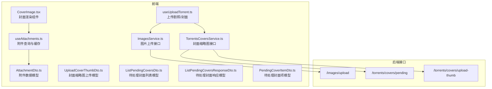
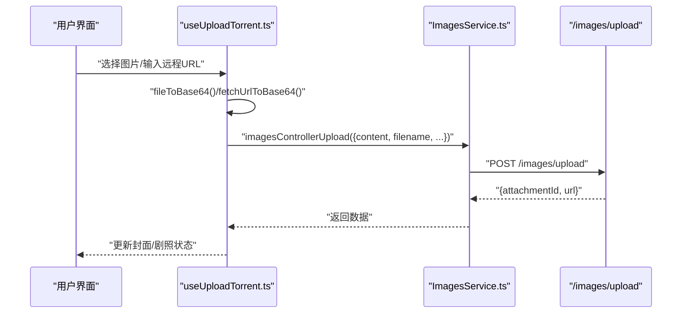
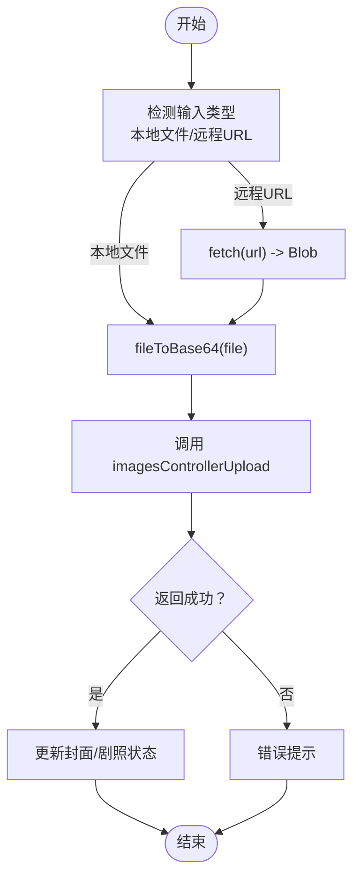
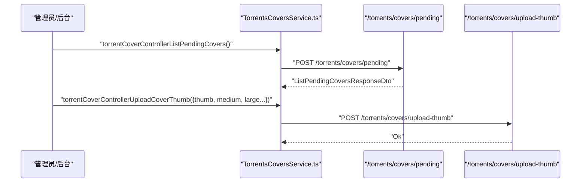
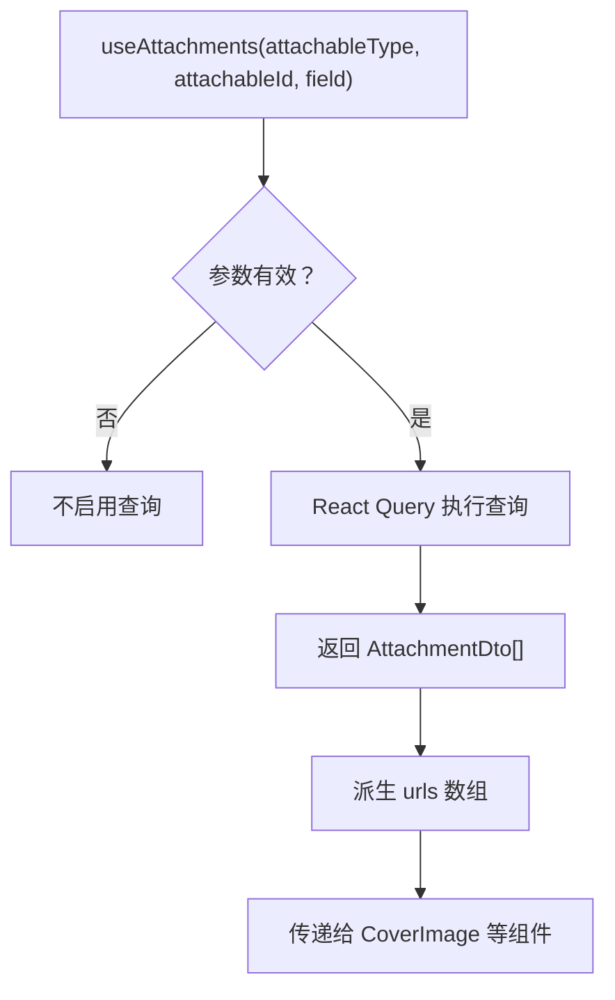
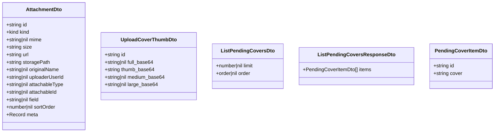
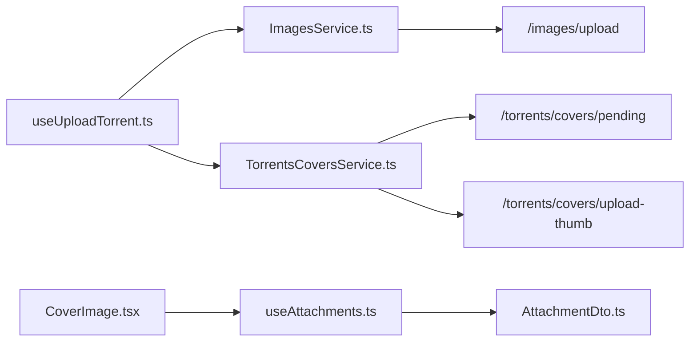

# 图片服务

<cite>
**本文引用的文件**
- [src/api/services/ImagesService.ts](file://src/api/services/ImagesService.ts)
- [src/api/services/TorrentsCoversService.ts](file://src/api/services/TorrentsCoversService.ts)
- [src/api/models/AttachmentDto.ts](file://src/api/models/AttachmentDto.ts)
- [src/api/models/UploadCoverThumbDto.ts](file://src/api/models/UploadCoverThumbDto.ts)
- [src/api/models/ListPendingCoversDto.ts](file://src/api/models/ListPendingCoversDto.ts)
- [src/api/models/ListPendingCoversResponseDto.ts](file://src/api/models/ListPendingCoversResponseDto.ts)
- [src/api/models/PendingCoverItemDto.ts](file://src/api/models/PendingCoverItemDto.ts)
- [src/modules/app/pages/UploadTorrent/hooks/useUploadTorrent.ts](file://src/modules/app/pages/UploadTorrent/hooks/useUploadTorrent.ts)
- [src/modules/app/hooks/useAttachments.ts](file://src/modules/app/hooks/useAttachments.ts)
- [src/modules/app/components/media/CoverImage.tsx](file://src/modules/app/components/media/CoverImage.tsx)
- [src/hooks/useApi.ts](file://src/hooks/useApi.ts)
- [src/utils/http/saveBlobAsFile.ts](file://src/utils/http/saveBlobAsFile.ts)
- [torrents-attachments-migration.md](file://torrents-attachments-migration.md)
</cite>

## 目录
1. [简介](#简介)
2. [项目结构](#项目结构)
3. [核心组件](#核心组件)
4. [架构总览](#架构总览)
5. [详细组件分析](#详细组件分析)
6. [依赖分析](#依赖分析)
7. [性能考虑](#性能考虑)
8. [故障排除指南](#故障排除指南)
9. [结论](#结论)
10. [附录](#附录)

## 简介
本技术文档围绕图片服务展开，系统性阐述图片上传、缩略图生成与封面处理的实现机制，深入分析格式转换、尺寸调整与质量优化的处理流程，解释封面缩略图上传的数据模型与处理逻辑，提供图片安全验证、文件类型检查与大小限制的实现方案，并总结图片缓存策略、CDN 集成与性能优化的最佳实践。本文所有分析均基于仓库现有代码与迁移文档，确保与实际实现一致。

## 项目结构
图片服务相关能力由前端 OpenAPI 客户端、业务页面 Hook、附件查询与展示组件构成，配合后端接口完成从上传到展示的全链路闭环。

**图表来源**
- [src/modules/app/pages/UploadTorrent/hooks/useUploadTorrent.ts](file://src/modules/app/pages/UploadTorrent/hooks/useUploadTorrent.ts#L188-L293)
- [src/modules/app/hooks/useAttachments.ts](file://src/modules/app/hooks/useAttachments.ts#L1-L38)
- [src/modules/app/components/media/CoverImage.tsx](file://src/modules/app/components/media/CoverImage.tsx#L1-L48)
- [src/api/services/ImagesService.ts](file://src/api/services/ImagesService.ts#L1-L68)
- [src/api/services/TorrentsCoversService.ts](file://src/api/services/TorrentsCoversService.ts#L1-L72)
- [src/api/models/AttachmentDto.ts](file://src/api/models/AttachmentDto.ts#L1-L28)
- [src/api/models/UploadCoverThumbDto.ts](file://src/api/models/UploadCoverThumbDto.ts#L1-L13)
- [src/api/models/ListPendingCoversDto.ts](file://src/api/models/ListPendingCoversDto.ts#L1-L16)
- [src/api/models/ListPendingCoversResponseDto.ts](file://src/api/models/ListPendingCoversResponseDto.ts#L1-L10)
- [src/api/models/PendingCoverItemDto.ts](file://src/api/models/PendingCoverItemDto.ts#L1-L10)

**章节来源**
- [src/modules/app/pages/UploadTorrent/hooks/useUploadTorrent.ts](file://src/modules/app/pages/UploadTorrent/hooks/useUploadTorrent.ts#L188-L293)
- [src/modules/app/hooks/useAttachments.ts](file://src/modules/app/hooks/useAttachments.ts#L1-L38)
- [src/modules/app/components/media/CoverImage.tsx](file://src/modules/app/components/media/CoverImage.tsx#L1-L48)
- [src/api/services/ImagesService.ts](file://src/api/services/ImagesService.ts#L1-L68)
- [src/api/services/TorrentsCoversService.ts](file://src/api/services/TorrentsCoversService.ts#L1-L72)
- [src/api/models/AttachmentDto.ts](file://src/api/models/AttachmentDto.ts#L1-L28)
- [src/api/models/UploadCoverThumbDto.ts](file://src/api/models/UploadCoverThumbDto.ts#L1-L13)
- [src/api/models/ListPendingCoversDto.ts](file://src/api/models/ListPendingCoversDto.ts#L1-L16)
- [src/api/models/ListPendingCoversResponseDto.ts](file://src/api/models/ListPendingCoversResponseDto.ts#L1-L10)
- [src/api/models/PendingCoverItemDto.ts](file://src/api/models/PendingCoverItemDto.ts#L1-L10)

## 核心组件
- 图片上传客户端：提供统一的图片上传入口，支持 base64 或二进制内容，返回附件标识与可访问 URL。
- 封面处理服务：提供待处理封面列表查询与封面缩略图上传标记能力。
- 附件数据模型：描述附件的元信息、存储路径、原始名称、绑定关系与排序等。
- 附件查询 Hook：按业务对象与语义字段查询附件列表，并内置缓存。
- 封面渲染组件：根据业务类型与尺寸派生最终 URL，统一占位图与加载体验。
- 头像上传校验：在上传头像时进行类型与大小限制，体现图片安全策略的落地方式。

**章节来源**
- [src/api/services/ImagesService.ts](file://src/api/services/ImagesService.ts#L15-L66)
- [src/api/services/TorrentsCoversService.ts](file://src/api/services/TorrentsCoversService.ts#L19-L70)
- [src/api/models/AttachmentDto.ts](file://src/api/models/AttachmentDto.ts#L5-L26)
- [src/modules/app/hooks/useAttachments.ts](file://src/modules/app/hooks/useAttachments.ts#L13-L38)
- [src/modules/app/components/media/CoverImage.tsx](file://src/modules/app/components/media/CoverImage.tsx#L20-L48)
- [src/hooks/useApi.ts](file://src/hooks/useApi.ts#L258-L302)

## 架构总览
图片服务从前端上传到后端处理再到前端展示，形成闭环。上传阶段支持本地文件与远程 URL，统一转为 base64 后提交；后端返回附件标识与 URL；前端通过附件查询 Hook 按字段与尺寸派生最终 URL；封面渲染组件负责最终展示。

**图表来源**
- [src/modules/app/pages/UploadTorrent/hooks/useUploadTorrent.ts](file://src/modules/app/pages/UploadTorrent/hooks/useUploadTorrent.ts#L188-L293)
- [src/api/services/ImagesService.ts](file://src/api/services/ImagesService.ts#L15-L66)

**章节来源**
- [src/modules/app/pages/UploadTorrent/hooks/useUploadTorrent.ts](file://src/modules/app/pages/UploadTorrent/hooks/useUploadTorrent.ts#L188-L293)
- [src/api/services/ImagesService.ts](file://src/api/services/ImagesService.ts#L15-L66)

## 详细组件分析

### 图片上传流程
- 输入处理：支持本地文件与远程 URL。远程 URL 会先下载为 Blob，再转为 base64；本地文件直接转为 base64。
- 提交上传：调用图片上传接口，携带文件名、可选 MIME 类型、排序等信息。
- 返回值：后端返回附件标识与可访问 URL，前端据此更新状态或绑定到业务对象。

**图表来源**
- [src/modules/app/pages/UploadTorrent/hooks/useUploadTorrent.ts](file://src/modules/app/pages/UploadTorrent/hooks/useUploadTorrent.ts#L188-L293)
- [src/api/services/ImagesService.ts](file://src/api/services/ImagesService.ts#L15-L66)

**章节来源**
- [src/modules/app/pages/UploadTorrent/hooks/useUploadTorrent.ts](file://src/modules/app/pages/UploadTorrent/hooks/useUploadTorrent.ts#L188-L293)
- [src/api/services/ImagesService.ts](file://src/api/services/ImagesService.ts#L15-L66)

### 封面缩略图上传与处理
- 待处理封面列表：后端提供待处理封面的列表查询接口，便于后台任务批量处理。
- 缩略图上传：前端将生成的多尺寸缩略图（full/thumbnail/medium/large）以 base64 形式提交，后端标记处理完成。
- 数据模型：缩略图上传模型定义了各尺寸字段；待处理封面列表与单项模型定义了返回结构。

**图表来源**
- [src/api/services/TorrentsCoversService.ts](file://src/api/services/TorrentsCoversService.ts#L19-L70)
- [src/api/models/UploadCoverThumbDto.ts](file://src/api/models/UploadCoverThumbDto.ts#L5-L11)
- [src/api/models/ListPendingCoversDto.ts](file://src/api/models/ListPendingCoversDto.ts#L5-L14)
- [src/api/models/ListPendingCoversResponseDto.ts](file://src/api/models/ListPendingCoversResponseDto.ts#L5-L9)
- [src/api/models/PendingCoverItemDto.ts](file://src/api/models/PendingCoverItemDto.ts#L5-L8)

**章节来源**
- [src/api/services/TorrentsCoversService.ts](file://src/api/services/TorrentsCoversService.ts#L19-L70)
- [src/api/models/UploadCoverThumbDto.ts](file://src/api/models/UploadCoverThumbDto.ts#L5-L11)
- [src/api/models/ListPendingCoversDto.ts](file://src/api/models/ListPendingCoversDto.ts#L5-L14)
- [src/api/models/ListPendingCoversResponseDto.ts](file://src/api/models/ListPendingCoversResponseDto.ts#L5-L9)
- [src/api/models/PendingCoverItemDto.ts](file://src/api/models/PendingCoverItemDto.ts#L5-L8)

### 附件查询与缓存
- 查询维度：按业务对象类型、业务对象 ID 与语义字段（如 cover、cover_thumb、cover_medium、cover_large、still 等）查询附件列表。
- 缓存策略：基于 React Query 的 queryKey 缓存，避免重复请求；当绑定关系变化时可主动 refetch。
- 展示派生：封面渲染组件根据业务类型与尺寸自动派生字段名，统一占位图与加载体验。

**图表来源**
- [src/modules/app/hooks/useAttachments.ts](file://src/modules/app/hooks/useAttachments.ts#L13-L38)
- [src/modules/app/components/media/CoverImage.tsx](file://src/modules/app/components/media/CoverImage.tsx#L20-L48)
- [src/api/models/AttachmentDto.ts](file://src/api/models/AttachmentDto.ts#L5-L26)

**章节来源**
- [src/modules/app/hooks/useAttachments.ts](file://src/modules/app/hooks/useAttachments.ts#L13-L38)
- [src/modules/app/components/media/CoverImage.tsx](file://src/modules/app/components/media/CoverImage.tsx#L20-L48)
- [src/api/models/AttachmentDto.ts](file://src/api/models/AttachmentDto.ts#L5-L26)

### 图片安全验证与限制
- 类型限制：头像上传处对 MIME 类型进行白名单校验（PNG/JPEG）。
- 大小限制：头像上传处对文件大小进行上限控制（例如不超过 2MB）。
- 远程 URL 校验：对输入的远程图片 URL 进行扩展名判断，仅接受常见图片扩展名。
- 建议补充：在上传前对 MIME 类型与文件大小进行二次校验，结合后端统一的白名单与限额策略。

**章节来源**
- [src/hooks/useApi.ts](file://src/hooks/useApi.ts#L258-L302)
- [src/modules/app/pages/UploadTorrent/hooks/useUploadTorrent.ts](file://src/modules/app/pages/UploadTorrent/hooks/useUploadTorrent.ts#L215-L223)

### 数据模型与处理逻辑
- 附件模型：包含附件 ID、类型、MIME、大小、URL、存储路径、原始名称、上传者、绑定关系、排序与元信息等。
- 缩略图上传模型：定义封面的多尺寸 base64 字段，便于后端生成不同规格的缩略图。
- 待处理封面模型：列表与单项模型定义了待处理封面的返回结构，便于后台任务调度与人工复核。

**图表来源**
- [src/api/models/AttachmentDto.ts](file://src/api/models/AttachmentDto.ts#L5-L26)
- [src/api/models/UploadCoverThumbDto.ts](file://src/api/models/UploadCoverThumbDto.ts#L5-L11)
- [src/api/models/ListPendingCoversDto.ts](file://src/api/models/ListPendingCoversDto.ts#L5-L14)
- [src/api/models/ListPendingCoversResponseDto.ts](file://src/api/models/ListPendingCoversResponseDto.ts#L5-L9)
- [src/api/models/PendingCoverItemDto.ts](file://src/api/models/PendingCoverItemDto.ts#L5-L8)

**章节来源**
- [src/api/models/AttachmentDto.ts](file://src/api/models/AttachmentDto.ts#L5-L26)
- [src/api/models/UploadCoverThumbDto.ts](file://src/api/models/UploadCoverThumbDto.ts#L5-L11)
- [src/api/models/ListPendingCoversDto.ts](file://src/api/models/ListPendingCoversDto.ts#L5-L14)
- [src/api/models/ListPendingCoversResponseDto.ts](file://src/api/models/ListPendingCoversResponseDto.ts#L5-L9)
- [src/api/models/PendingCoverItemDto.ts](file://src/api/models/PendingCoverItemDto.ts#L5-L8)

## 依赖分析
- 组件耦合：上传 Hook 依赖图片上传服务；附件查询 Hook 依赖附件服务；封面渲染组件依赖附件查询 Hook。
- 外部依赖：Axios 作为 HTTP 客户端，React Query 负责缓存与并发控制。
- 接口契约：前端通过 OpenAPI 客户端调用后端接口，数据模型在前后端保持一致。

**图表来源**
- [src/modules/app/pages/UploadTorrent/hooks/useUploadTorrent.ts](file://src/modules/app/pages/UploadTorrent/hooks/useUploadTorrent.ts#L188-L293)
- [src/modules/app/hooks/useAttachments.ts](file://src/modules/app/hooks/useAttachments.ts#L13-L38)
- [src/modules/app/components/media/CoverImage.tsx](file://src/modules/app/components/media/CoverImage.tsx#L20-L48)
- [src/api/services/ImagesService.ts](file://src/api/services/ImagesService.ts#L15-L66)
- [src/api/services/TorrentsCoversService.ts](file://src/api/services/TorrentsCoversService.ts#L19-L70)
- [src/api/models/AttachmentDto.ts](file://src/api/models/AttachmentDto.ts#L5-L26)

**章节来源**
- [src/modules/app/pages/UploadTorrent/hooks/useUploadTorrent.ts](file://src/modules/app/pages/UploadTorrent/hooks/useUploadTorrent.ts#L188-L293)
- [src/modules/app/hooks/useAttachments.ts](file://src/modules/app/hooks/useAttachments.ts#L13-L38)
- [src/modules/app/components/media/CoverImage.tsx](file://src/modules/app/components/media/CoverImage.tsx#L20-L48)
- [src/api/services/ImagesService.ts](file://src/api/services/ImagesService.ts#L15-L66)
- [src/api/services/TorrentsCoversService.ts](file://src/api/services/TorrentsCoversService.ts#L19-L70)
- [src/api/models/AttachmentDto.ts](file://src/api/models/AttachmentDto.ts#L5-L26)

## 性能考虑
- 上传阶段
  - 使用 Promise.all 并发上传多个剧照，减少等待时间。
  - 对远程 URL 先下载为 Blob 再转 base64，避免一次性大块内存占用。
- 展示阶段
  - 附件查询 Hook 内置缓存，避免重复请求；封面渲染组件统一派生尺寸 URL，减少重复计算。
  - 统一占位图与懒加载策略，降低首屏压力。
- 后端处理
  - 缩略图生成建议采用异步队列与 CDN 分发，前端轮询或监听变更事件，提升用户体验。
- CDN 集成
  - 附件 URL 已具备可直接访问能力，结合 CDN 可显著提升全球访问速度与稳定性。

[本节为通用性能建议，无需特定文件引用]

## 故障排除指南
- 上传失败
  - 检查网络状态与后端接口可用性；查看返回的状态码与消息。
  - 确认文件类型与大小是否满足限制要求。
- 缩略图未生效
  - 确认已正确提交多尺寸 base64 并调用上传缩略图接口。
  - 检查后端处理任务是否执行完成。
- 封面不显示
  - 使用附件查询 Hook 确认返回的 URL 是否为空；检查业务对象绑定关系与字段名是否正确。
  - 确认封面渲染组件的尺寸参数与业务类型匹配。

**章节来源**
- [src/hooks/useApi.ts](file://src/hooks/useApi.ts#L258-L302)
- [src/modules/app/pages/UploadTorrent/hooks/useUploadTorrent.ts](file://src/modules/app/pages/UploadTorrent/hooks/useUploadTorrent.ts#L260-L283)
- [src/modules/app/hooks/useAttachments.ts](file://src/modules/app/hooks/useAttachments.ts#L17-L29)
- [src/modules/app/components/media/CoverImage.tsx](file://src/modules/app/components/media/CoverImage.tsx#L38-L47)

## 结论
图片服务通过统一的上传接口、严谨的附件模型与便捷的查询缓存机制，实现了从上传到展示的完整闭环。封面缩略图上传与待处理列表为后端处理提供了清晰的契约。结合类型与大小限制、CDN 与缓存策略，可在保证安全性的同时获得良好的性能与用户体验。后续可进一步完善异步处理与监控告警，持续优化处理效率与稳定性。

## 附录
- 前端改造要点（来自迁移文档）
  - 种子上传页：封面输入从“URL/文本”改为“上传图片 -> attachmentId”。
  - 种子编辑页：封面/剧照保存改为提交 coverAttachmentId 与 stillAttachmentIds。
  - 图片展示组件：允许 null，统一占位图。
  - 若用到封面缩略图字段：改为调用 /attachments 获取 cover_thumb/cover_medium/cover_large。

**章节来源**
- [torrents-attachments-migration.md](file://torrents-attachments-migration.md#L177-L184)