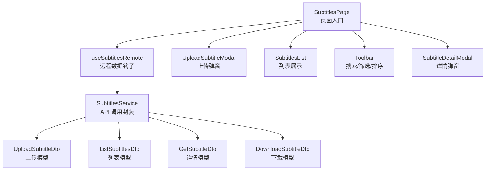
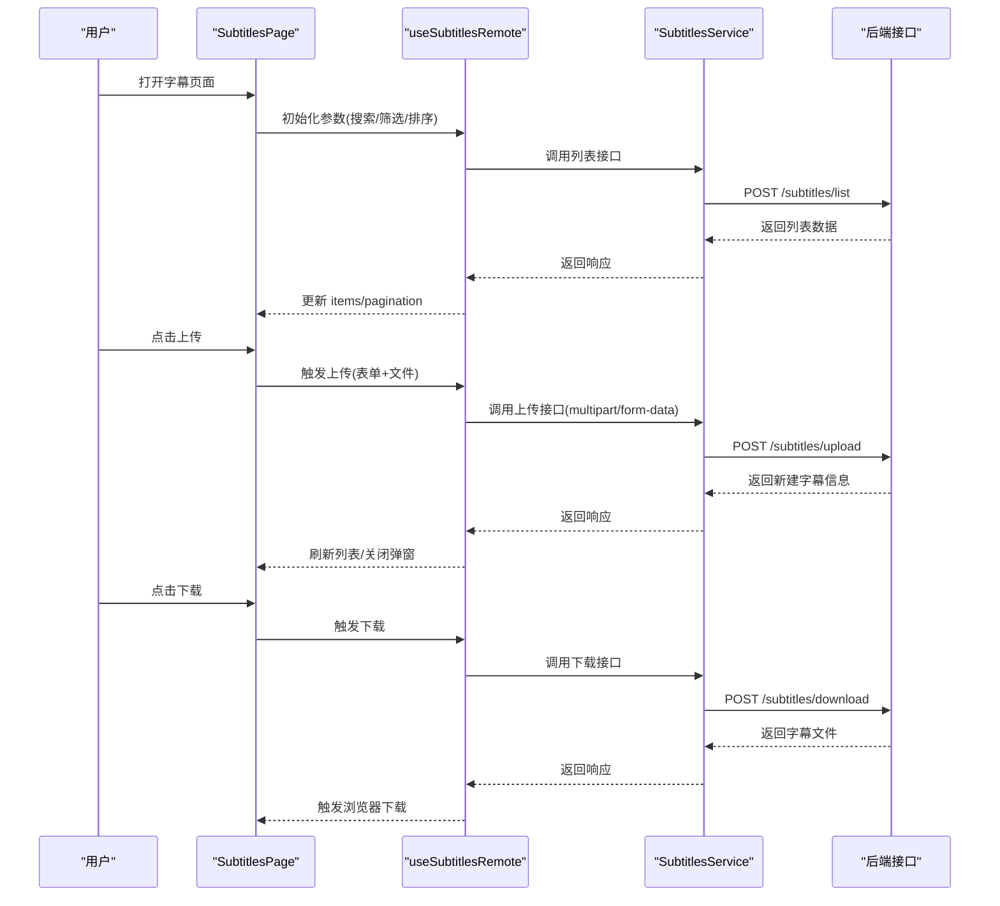
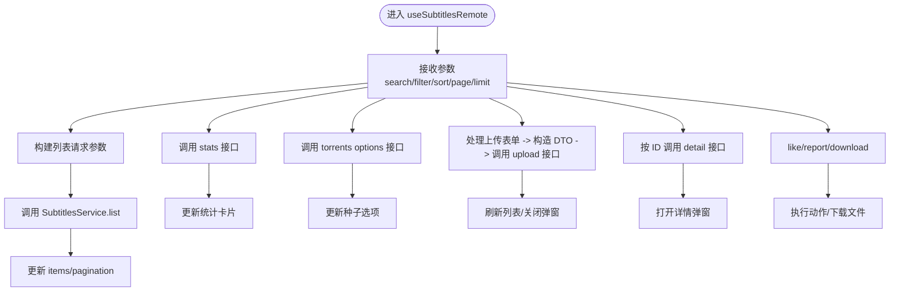
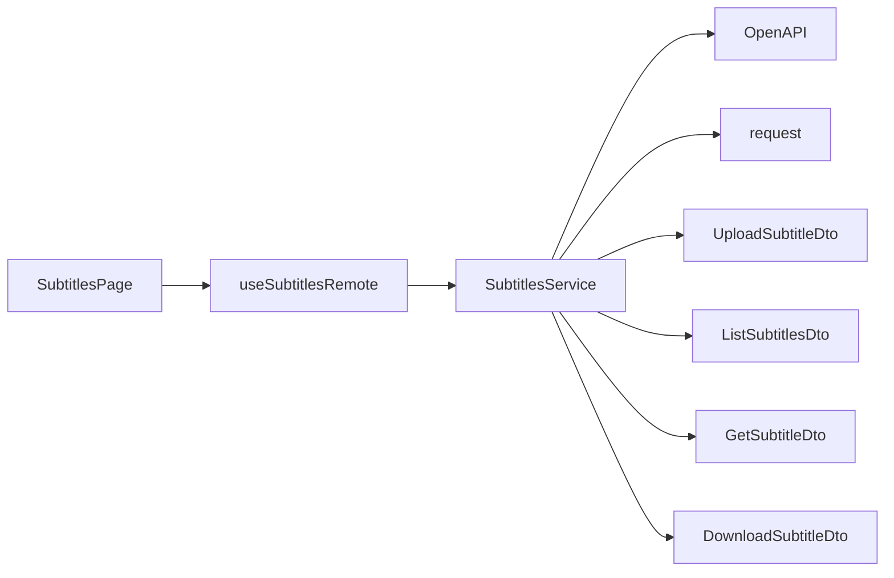

# 字幕服务

<cite>
**本文引用的文件**
- [src/modules/app/pages/Subtitles/index.tsx](file://src/modules/app/pages/Subtitles/index.tsx)
- [src/modules/app/pages/Subtitles/types.ts](file://src/modules/app/pages/Subtitles/types.ts)
- [src/modules/app/pages/Subtitles/hooks/useSubtitlesRemote.ts](file://src/modules/app/pages/Subtitles/hooks/useSubtitlesRemote.ts)
- [src/modules/app/pages/Subtitles/components/UploadSubtitleModal.tsx](file://src/modules/app/pages/Subtitles/components/UploadSubtitleModal.tsx)
- [src/modules/app/pages/Subtitles/components/SubtitlesList.tsx](file://src/modules/app/pages/Subtitles/components/SubtitlesList.tsx)
- [src/modules/app/pages/Subtitles/components/Toolbar.tsx](file://src/modules/app/pages/Subtitles/components/Toolbar.tsx)
- [src/modules/app/pages/Subtitles/components/SubtitleDetailModal.tsx](file://src/modules/app/pages/Subtitles/components/SubtitleDetailModal.tsx)
- [src/modules/app/pages/Subtitles/utils.ts](file://src/modules/app/pages/Subtitles/utils.ts)
- [src/api/services/SubtitlesService.ts](file://src/api/services/SubtitlesService.ts)
- [src/api/models/UploadSubtitleDto.ts](file://src/api/models/UploadSubtitleDto.ts)
- [src/api/models/ListSubtitlesDto.ts](file://src/api/models/ListSubtitlesDto.ts)
- [src/api/models/GetSubtitleDto.ts](file://src/api/models/GetSubtitleDto.ts)
- [src/api/models/DownloadSubtitleDto.ts](file://src/api/models/DownloadSubtitleDto.ts)
</cite>

## 目录
1. [简介](#简介)
2. [项目结构](#项目结构)
3. [核心组件](#核心组件)
4. [架构总览](#架构总览)
5. [详细组件分析](#详细组件分析)
6. [依赖关系分析](#依赖关系分析)
7. [性能考量](#性能考量)
8. [故障排查指南](#故障排查指南)
9. [结论](#结论)
10. [附录](#附录)

## 简介
本技术文档围绕字幕服务的前端实现进行系统化梳理，覆盖字幕上传、解析与管理的完整流程；明确字幕格式支持、语言识别与元数据提取的前端表现；分析上传数据模型与验证规则；并给出安全扫描、格式转换与质量检查的技术方案建议，以及缓存、预览生成与多语言支持的实现指南。

## 项目结构
字幕服务采用“页面 + 组件 + 钩子 + API 封装”的分层组织方式：
- 页面层负责状态编排与交互入口
- 组件层负责 UI 展示与用户输入
- 钩子层封装远程数据获取与业务动作
- API 层通过服务类暴露 REST 接口

图表来源
- [src/modules/app/pages/Subtitles/index.tsx](file://src/modules/app/pages/Subtitles/index.tsx#L1-L102)
- [src/modules/app/pages/Subtitles/hooks/useSubtitlesRemote.ts](file://src/modules/app/pages/Subtitles/hooks/useSubtitlesRemote.ts#L1-L156)
- [src/api/services/SubtitlesService.ts](file://src/api/services/SubtitlesService.ts#L1-L131)
- [src/api/models/UploadSubtitleDto.ts](file://src/api/models/UploadSubtitleDto.ts#L1-L43)
- [src/api/models/ListSubtitlesDto.ts](file://src/api/models/ListSubtitlesDto.ts#L1-L49)
- [src/api/models/GetSubtitleDto.ts](file://src/api/models/GetSubtitleDto.ts#L1-L12)
- [src/api/models/DownloadSubtitleDto.ts](file://src/api/models/DownloadSubtitleDto.ts#L1-L12)

章节来源
- [src/modules/app/pages/Subtitles/index.tsx](file://src/modules/app/pages/Subtitles/index.tsx#L1-L102)
- [src/modules/app/pages/Subtitles/hooks/useSubtitlesRemote.ts](file://src/modules/app/pages/Subtitles/hooks/useSubtitlesRemote.ts#L1-L156)
- [src/api/services/SubtitlesService.ts](file://src/api/services/SubtitlesService.ts#L1-L131)

## 核心组件
- 页面组件 SubtitlesPage：聚合状态、调用钩子、渲染列表与弹窗
- 钩子 useSubtitlesRemote：封装列表、详情、统计、上传、点赞、举报、下载等动作
- 上传弹窗 UploadSubtitleModal：表单收集、校验与提交
- 列表组件 SubtitlesList：展示字幕条目与关键指标
- 工具函数 utils：语言标志映射
- API 服务 SubtitlesService：对后端接口的统一封装
- 数据模型：UploadSubtitleDto、ListSubtitlesDto、GetSubtitleDto、DownloadSubtitleDto

章节来源
- [src/modules/app/pages/Subtitles/index.tsx](file://src/modules/app/pages/Subtitles/index.tsx#L1-L102)
- [src/modules/app/pages/Subtitles/hooks/useSubtitlesRemote.ts](file://src/modules/app/pages/Subtitles/hooks/useSubtitlesRemote.ts#L1-L156)
- [src/modules/app/pages/Subtitles/components/UploadSubtitleModal.tsx](file://src/modules/app/pages/Subtitles/components/UploadSubtitleModal.tsx#L1-L184)
- [src/modules/app/pages/Subtitles/components/SubtitlesList.tsx](file://src/modules/app/pages/Subtitles/components/SubtitlesList.tsx#L1-L124)
- [src/modules/app/pages/Subtitles/utils.ts](file://src/modules/app/pages/Subtitles/utils.ts#L1-L13)
- [src/api/services/SubtitlesService.ts](file://src/api/services/SubtitlesService.ts#L1-L131)
- [src/api/models/UploadSubtitleDto.ts](file://src/api/models/UploadSubtitleDto.ts#L1-L43)
- [src/api/models/ListSubtitlesDto.ts](file://src/api/models/ListSubtitlesDto.ts#L1-L49)
- [src/api/models/GetSubtitleDto.ts](file://src/api/models/GetSubtitleDto.ts#L1-L12)
- [src/api/models/DownloadSubtitleDto.ts](file://src/api/models/DownloadSubtitleDto.ts#L1-L12)

## 架构总览
前端通过 SubtitlesService 调用后端接口，完成字幕的查询、上传、下载、点赞、举报与统计。页面通过 useSubtitlesRemote 钩子统一管理状态与副作用，组件间通过 props 传递数据与回调。

图表来源
- [src/modules/app/pages/Subtitles/hooks/useSubtitlesRemote.ts](file://src/modules/app/pages/Subtitles/hooks/useSubtitlesRemote.ts#L70-L156)
- [src/api/services/SubtitlesService.ts](file://src/api/services/SubtitlesService.ts#L19-L76)

章节来源
- [src/modules/app/pages/Subtitles/hooks/useSubtitlesRemote.ts](file://src/modules/app/pages/Subtitles/hooks/useSubtitlesRemote.ts#L1-L156)
- [src/api/services/SubtitlesService.ts](file://src/api/services/SubtitlesService.ts#L1-L131)

## 详细组件分析

### 页面与状态编排
- SubtitlesPage 负责：
  - 维护搜索词、语言过滤、排序方式
  - 维护上传表单与弹窗开关
  - 调用 useSubtitlesRemote 获取列表、详情、统计数据与种子选项
  - 处理上传成功后的重置与刷新

章节来源
- [src/modules/app/pages/Subtitles/index.tsx](file://src/modules/app/pages/Subtitles/index.tsx#L1-L102)

### 远程数据钩子 useSubtitlesRemote
- 功能要点：
  - 列表加载：根据搜索词、语言、排序与分页参数请求后端
  - 统计卡片：获取字幕总量、下载量、上传量、平均评分
  - 种子选项：获取可选的种子列表用于关联
  - 上传：构造 UploadSubtitleDto 并发起 multipart 请求
  - 详情：按 ID 获取字幕详情
  - 点赞/举报：发送对应动作请求
  - 下载：拼接 BASE 与 TOKEN，触发文件下载

图表来源
- [src/modules/app/pages/Subtitles/hooks/useSubtitlesRemote.ts](file://src/modules/app/pages/Subtitles/hooks/useSubtitlesRemote.ts#L22-L156)
- [src/api/services/SubtitlesService.ts](file://src/api/services/SubtitlesService.ts#L19-L130)

章节来源
- [src/modules/app/pages/Subtitles/hooks/useSubtitlesRemote.ts](file://src/modules/app/pages/Subtitles/hooks/useSubtitlesRemote.ts#L1-L156)

### 上传弹窗 UploadSubtitleModal
- 表单字段与校验：
  - 文件：必填，限制 .srt/.ass/.ssa/.sub
  - 关联种子：必填
  - 名称：必填
  - 类型：必填（SRT/ASS/SSA/SUB）
  - 语言：可选（zh/zh-TW/en/jp/kr）
  - 说明：可选
- 交互行为：
  - 文件选择与预览
  - 下拉选择种子、类型、语言
  - 提交按钮在必填项缺失时禁用
  - 提交后关闭弹窗并清空表单

章节来源
- [src/modules/app/pages/Subtitles/components/UploadSubtitleModal.tsx](file://src/modules/app/pages/Subtitles/components/UploadSubtitleModal.tsx#L1-L184)

### 列表组件 SubtitlesList
- 展示字段：
  - 名称、关联种子、类型、语言、下载量、上传量、评分
- 交互：
  - 点击行打开详情弹窗
  - 支持官方认证标识与语言国旗展示

章节来源
- [src/modules/app/pages/Subtitles/components/SubtitlesList.tsx](file://src/modules/app/pages/Subtitles/components/SubtitlesList.tsx#L1-L124)
- [src/modules/app/pages/Subtitles/utils.ts](file://src/modules/app/pages/Subtitles/utils.ts#L1-L13)

### 工具函数 utils
- 语言代码到旗帜符号的映射，用于 UI 展示

章节来源
- [src/modules/app/pages/Subtitles/utils.ts](file://src/modules/app/pages/Subtitles/utils.ts#L1-L13)

### API 服务与数据模型
- SubtitlesService：
  - 列表：POST /subtitles/list
  - 详情：POST /subtitles/detail
  - 下载：POST /subtitles/download
  - 上传：POST /subtitles/upload（multipart/form-data）
  - 点赞：POST /subtitles/like
  - 举报：POST /subtitles/report
  - 统计：POST /subtitles/stats
  - 种子选项：POST /api/subtitles/torrents/options
- 数据模型：
  - UploadSubtitleDto：file/name/type/language/torrentId/description?
  - ListSubtitlesDto：search/language(sortBy)/page/limit
  - GetSubtitleDto：id
  - DownloadSubtitleDto：id

章节来源
- [src/api/services/SubtitlesService.ts](file://src/api/services/SubtitlesService.ts#L1-L131)
- [src/api/models/UploadSubtitleDto.ts](file://src/api/models/UploadSubtitleDto.ts#L1-L43)
- [src/api/models/ListSubtitlesDto.ts](file://src/api/models/ListSubtitlesDto.ts#L1-L49)
- [src/api/models/GetSubtitleDto.ts](file://src/api/models/GetSubtitleDto.ts#L1-L12)
- [src/api/models/DownloadSubtitleDto.ts](file://src/api/models/DownloadSubtitleDto.ts#L1-L12)

## 依赖关系分析
- 组件耦合：
  - SubtitlesPage 依赖 useSubtitlesRemote 与多个子组件
  - 子组件之间低耦合，通过 props 传值
- 钩子与服务：
  - useSubtitlesRemote 仅依赖 SubtitlesService 的方法签名
  - SubtitlesService 仅依赖 OpenAPI 与 request 封装
- 模型依赖：
  - 各接口使用对应的 DTO，保持请求/响应结构清晰

图表来源
- [src/modules/app/pages/Subtitles/hooks/useSubtitlesRemote.ts](file://src/modules/app/pages/Subtitles/hooks/useSubtitlesRemote.ts#L1-L156)
- [src/api/services/SubtitlesService.ts](file://src/api/services/SubtitlesService.ts#L1-L131)
- [src/api/models/UploadSubtitleDto.ts](file://src/api/models/UploadSubtitleDto.ts#L1-L43)
- [src/api/models/ListSubtitlesDto.ts](file://src/api/models/ListSubtitlesDto.ts#L1-L49)
- [src/api/models/GetSubtitleDto.ts](file://src/api/models/GetSubtitleDto.ts#L1-L12)
- [src/api/models/DownloadSubtitleDto.ts](file://src/api/models/DownloadSubtitleDto.ts#L1-L12)

章节来源
- [src/modules/app/pages/Subtitles/hooks/useSubtitlesRemote.ts](file://src/modules/app/pages/Subtitles/hooks/useSubtitlesRemote.ts#L1-L156)
- [src/api/services/SubtitlesService.ts](file://src/api/services/SubtitlesService.ts#L1-L131)

## 性能考量
- 列表分页与懒加载：
  - 使用 page/limit 控制每次请求的数据量，避免一次性加载过多
- 响应解包：
  - 对后端可能返回 { data } 包裹结构进行解包，减少上层判断成本
- 下载直连：
  - 下载时直接拼接 BASE 与 TOKEN，避免额外中间层，降低延迟
- UI 渲染优化：
  - 列表组件使用网格布局与最小宽度策略，保证长文本截断与可读性
- 缓存建议（实现指南）：
  - 列表结果可按查询参数组合做内存缓存，命中则跳过网络请求
  - 详情弹窗首次打开时请求，后续复用缓存
  - 图标与语言映射可做静态常量缓存

## 故障排查指南
- 上传失败
  - 检查文件类型与大小限制（前端已限制 .srt/.ass/.ssa/.sub）
  - 确认必填字段（文件、名称、种子）均已填写
  - 查看网络面板中 multipart 请求是否正确发送
- 下载异常
  - 确认下载接口返回的是二进制流
  - 检查 OpenAPI.BASE 与 TOKEN 是否可用
- 列表为空
  - 检查搜索词、语言过滤与排序参数是否导致无结果
  - 确认分页参数 page/limit 是否合理
- 详情未显示
  - 确认 ID 参数正确且存在
  - 检查详情弹窗的打开条件与 fetchDetail 调用时机

章节来源
- [src/modules/app/pages/Subtitles/hooks/useSubtitlesRemote.ts](file://src/modules/app/pages/Subtitles/hooks/useSubtitlesRemote.ts#L117-L156)
- [src/modules/app/pages/Subtitles/components/UploadSubtitleModal.tsx](file://src/modules/app/pages/Subtitles/components/UploadSubtitleModal.tsx#L166-L178)

## 结论
字幕服务前端以清晰的分层设计实现了从上传到管理的全链路功能。通过统一的 API 封装与类型化 DTO，提升了可维护性与可扩展性。建议在现有基础上完善后端的格式转换、质量检查与安全扫描能力，并结合前端缓存策略进一步提升用户体验。

## 附录

### 字幕格式支持与语言识别
- 支持格式：SRT、ASS、SSA、SUB
- 语言代码：zh、zh-TW、en、jp、kr
- 语言展示：通过工具函数映射为旗帜图标

章节来源
- [src/api/models/UploadSubtitleDto.ts](file://src/api/models/UploadSubtitleDto.ts#L31-L41)
- [src/modules/app/pages/Subtitles/utils.ts](file://src/modules/app/pages/Subtitles/utils.ts#L1-L13)

### 元数据提取与展示
- 列表展示：名称、类型、语言、关联种子、下载/上传/评分
- 详情展示：名称、类型、语言、下载/上传/评分、上传者、上传时间、描述、是否认证
- 上传表单：名称、类型、语言、种子、描述、文件

章节来源
- [src/modules/app/pages/Subtitles/components/SubtitlesList.tsx](file://src/modules/app/pages/Subtitles/components/SubtitlesList.tsx#L1-L124)
- [src/modules/app/pages/Subtitles/components/SubtitleDetailModal.tsx](file://src/modules/app/pages/Subtitles/components/SubtitleDetailModal.tsx#L1-L155)
- [src/modules/app/pages/Subtitles/components/UploadSubtitleModal.tsx](file://src/modules/app/pages/Subtitles/components/UploadSubtitleModal.tsx#L1-L184)
- [src/modules/app/pages/Subtitles/types.ts](file://src/modules/app/pages/Subtitles/types.ts#L7-L32)

### 上传数据模型与验证规则
- UploadSubtitleDto 字段与约束：
  - file：必填（Blob）
  - name：必填（字符串）
  - type：必填（枚举 SRT/ASS/SSA/SUB）
  - language：必填（字符串，建议使用 zh/zh-TW/en/jp/kr）
  - torrentId：必填（字符串，关联种子 ID）
  - description：可选（字符串）

章节来源
- [src/api/models/UploadSubtitleDto.ts](file://src/api/models/UploadSubtitleDto.ts#L5-L30)

### 安全扫描、格式转换与质量检查（技术方案建议）
- 安全扫描（建议在后端实施）：
  - 文件类型二次校验（基于 MIME 与文件头）
  - 内容白名单与长度限制
  - 禁止嵌入脚本与可疑路径
- 格式转换（建议在后端实施）：
  - 统一转为 SRT 或 ASS，确保播放兼容性
  - 时间轴对齐与帧率适配
- 质量检查（建议在后端实施）：
  - 时间轴连续性与重复检查
  - 字符编码检测（优先 UTF-8）
  - 文本可读性与常见错误提示

### 缓存、预览生成与多语言支持（实现指南）
- 缓存：
  - 列表：按 {search,language,sortBy,page,limit} 维度缓存
  - 详情：按 id 缓存
  - 静态资源：语言映射与图标缓存
- 预览生成（建议在后端实施）：
  - 生成缩略预览片段（如前 30 秒字幕截图）
  - 提供在线预览链接
- 多语言支持：
  - UI 文案国际化（当前页面已包含部分文案）
  - 语言代码标准化（zh/zh-TW/en/jp/kr）