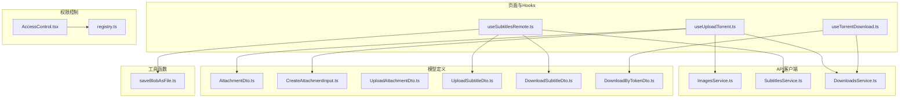
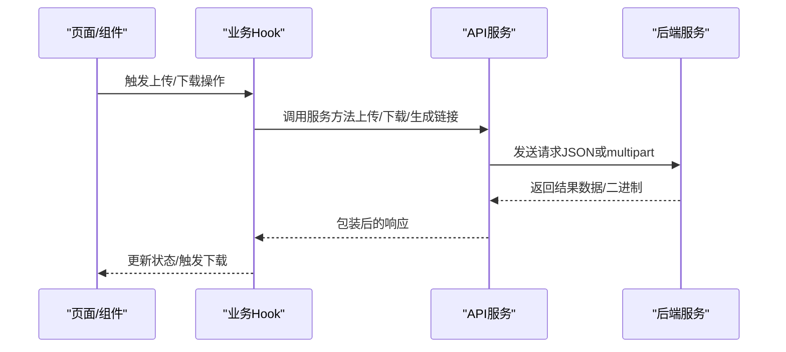
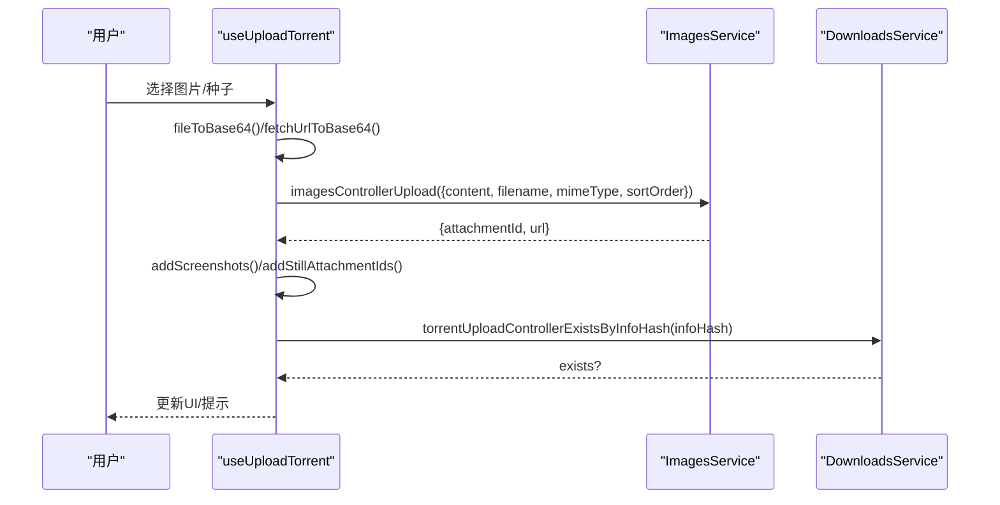
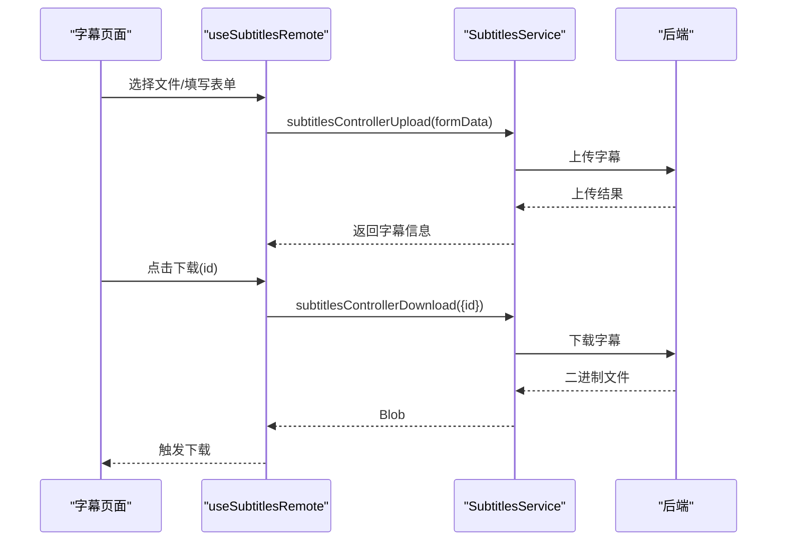
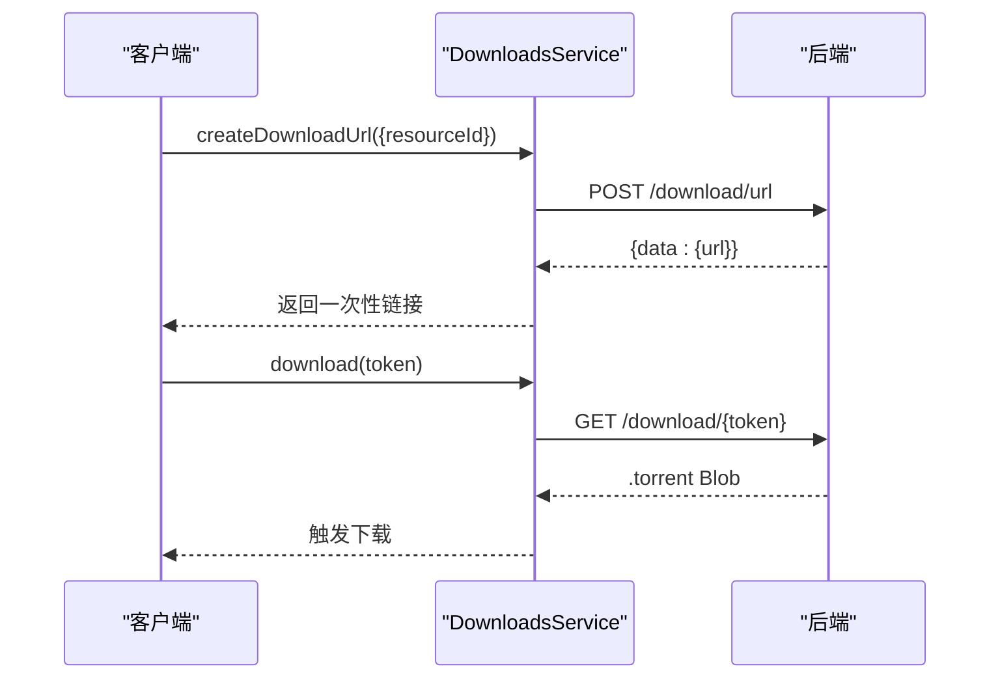
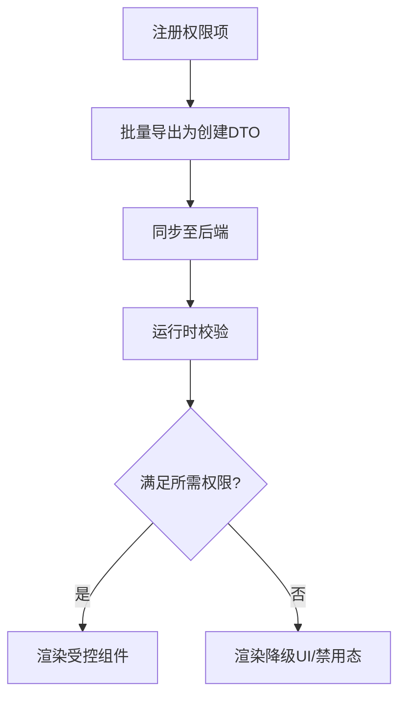
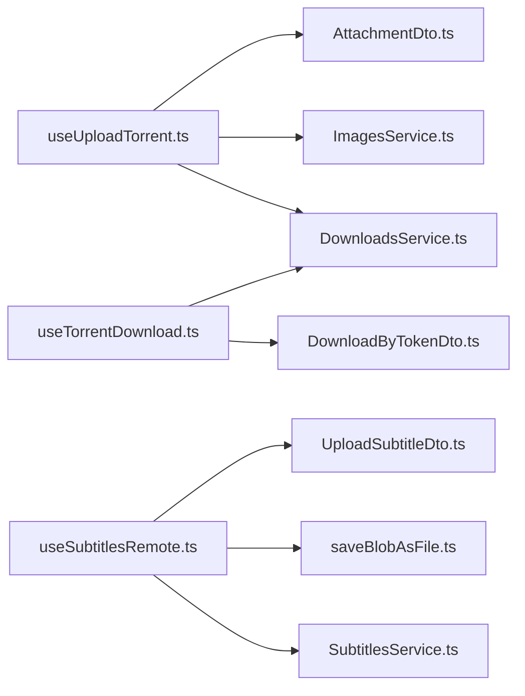

# 工具服务

<cite>
**本文引用的文件**
- [ImagesService.ts](file://src/api/services/ImagesService.ts)
- [SubtitlesService.ts](file://src/api/services/SubtitlesService.ts)
- [DownloadsService.ts](file://src/api/services/DownloadsService.ts)
- [AttachmentDto.ts](file://src/api/models/AttachmentDto.ts)
- [CreateAttachmentInput.ts](file://src/api/models/CreateAttachmentInput.ts)
- [UploadAttachmentDto.ts](file://src/api/models/UploadAttachmentDto.ts)
- [UploadSubtitleDto.ts](file://src/api/models/UploadSubtitleDto.ts)
- [DownloadSubtitleDto.ts](file://src/api/models/DownloadSubtitleDto.ts)
- [DownloadByTokenDto.ts](file://src/api/models/DownloadByTokenDto.ts)
- [useUploadTorrent.ts](file://src/modules/app/pages/UploadTorrent/hooks/useUploadTorrent.ts)
- [useSubtitlesRemote.ts](file://src/modules/app/pages/Subtitles/hooks/useSubtitlesRemote.ts)
- [SubtitlesList.tsx](file://src/modules/app/pages/Subtitles/components/SubtitlesList.tsx)
- [useTorrentDownload.ts](file://src/modules/app/hooks/useTorrentDownload.ts)
- [saveBlobAsFile.ts](file://src/utils/http/saveBlobAsFile.ts)
- [torrents-attachments-migration.md](file://torrents-attachments-migration.md)
- [AccessControl.tsx](file://src/permissions/AccessControl.tsx)
- [registry.ts](file://src/permissions/registry.ts)
</cite>

## 目录
1. [简介](#简介)
2. [项目结构](#项目结构)
3. [核心组件](#核心组件)
4. [架构总览](#架构总览)
5. [详细组件分析](#详细组件分析)
6. [依赖关系分析](#依赖关系分析)
7. [性能考虑](#性能考虑)
8. [故障排除指南](#故障排除指南)
9. [结论](#结论)
10. [附录](#附录)

## 简介
本技术文档围绕工具服务中的附件上传、图片处理、字幕管理与下载服务展开，系统性阐述前端如何通过 API 服务完成文件上传、格式验证、存储策略、图片缩略图生成、字幕文件处理以及下载链接生成等关键能力，并提供安全扫描、病毒检测与访问控制的开发指南，同时给出大文件上传优化、断点续传与并发处理的解决方案建议。

## 项目结构
工具服务相关代码主要分布在以下区域：
- API 客户端层：封装对后端服务的调用，包括图片上传、字幕上传/下载、种子下载链接生成等。
- 页面与 Hooks：封装上传、下载、字幕管理等业务逻辑。
- 工具函数：下载响应处理、文件名解析等。
- 权限与访问控制：基于权限键的访问控制组件与注册表。

图表来源
- [useUploadTorrent.ts](file://src/modules/app/pages/UploadTorrent/hooks/useUploadTorrent.ts#L1-L574)
- [useSubtitlesRemote.ts](file://src/modules/app/pages/Subtitles/hooks/useSubtitlesRemote.ts#L1-L201)
- [useTorrentDownload.ts](file://src/modules/app/hooks/useTorrentDownload.ts#L1-L112)
- [ImagesService.ts](file://src/api/services/ImagesService.ts#L1-L67)
- [SubtitlesService.ts](file://src/api/services/SubtitlesService.ts#L1-L131)
- [DownloadsService.ts](file://src/api/services/DownloadsService.ts#L1-L83)
- [AttachmentDto.ts](file://src/api/models/AttachmentDto.ts#L1-L28)
- [CreateAttachmentInput.ts](file://src/api/models/CreateAttachmentInput.ts#L1-L9)
- [UploadAttachmentDto.ts](file://src/api/models/UploadAttachmentDto.ts#L1-L16)
- [UploadSubtitleDto.ts](file://src/api/models/UploadSubtitleDto.ts#L1-L43)
- [DownloadSubtitleDto.ts](file://src/api/models/DownloadSubtitleDto.ts#L1-L11)
- [DownloadByTokenDto.ts](file://src/api/models/DownloadByTokenDto.ts#L1-L11)
- [saveBlobAsFile.ts](file://src/utils/http/saveBlobAsFile.ts#L1-L54)
- [AccessControl.tsx](file://src/permissions/AccessControl.tsx)
- [registry.ts](file://src/permissions/registry.ts#L77-L128)

章节来源
- [useUploadTorrent.ts](file://src/modules/app/pages/UploadTorrent/hooks/useUploadTorrent.ts#L1-L574)
- [useSubtitlesRemote.ts](file://src/modules/app/pages/Subtitles/hooks/useSubtitlesRemote.ts#L1-L201)
- [useTorrentDownload.ts](file://src/modules/app/hooks/useTorrentDownload.ts#L1-L112)
- [ImagesService.ts](file://src/api/services/ImagesService.ts#L1-L67)
- [SubtitlesService.ts](file://src/api/services/SubtitlesService.ts#L1-L131)
- [DownloadsService.ts](file://src/api/services/DownloadsService.ts#L1-L83)
- [AttachmentDto.ts](file://src/api/models/AttachmentDto.ts#L1-L28)
- [CreateAttachmentInput.ts](file://src/api/models/CreateAttachmentInput.ts#L1-L9)
- [UploadAttachmentDto.ts](file://src/api/models/UploadAttachmentDto.ts#L1-L16)
- [UploadSubtitleDto.ts](file://src/api/models/UploadSubtitleDto.ts#L1-L43)
- [DownloadSubtitleDto.ts](file://src/api/models/DownloadSubtitleDto.ts#L1-L11)
- [DownloadByTokenDto.ts](file://src/api/models/DownloadByTokenDto.ts#L1-L11)
- [saveBlobAsFile.ts](file://src/utils/http/saveBlobAsFile.ts#L1-L54)
- [AccessControl.tsx](file://src/permissions/AccessControl.tsx)
- [registry.ts](file://src/permissions/registry.ts#L77-L128)

## 核心组件
- 附件与图片上传
  - 图片上传接口：通过图片服务上传 base64 或二进制图片，支持绑定目标类型、ID、字段与排序。
  - 附件模型：描述附件的标识、类型、MIME、大小、URL、存储路径、原始名、上传者、可绑定对象、字段、排序与元信息。
  - 创建附件输入：用于创建时绑定附件 ID 的输入结构。
- 字幕管理
  - 字幕上传：支持 multipart 表单上传，包含文件、名称、类型、语言、关联种子 ID、说明等。
  - 字幕下载：通过 ID 请求下载二进制字幕文件。
  - 字幕列表与详情：支持搜索、筛选、排序、分页与统计。
- 下载服务
  - 一次性下载链接生成：POST 生成带一次性 Token 的下载地址。
  - 通过 Token 下载：GET 接口公开、原子消费，直接返回 .torrent 文件。
  - 下载响应处理：解析 Content-Disposition 头部获取文件名，保存为 Blob 并触发下载。

章节来源
- [ImagesService.ts](file://src/api/services/ImagesService.ts#L15-L66)
- [AttachmentDto.ts](file://src/api/models/AttachmentDto.ts#L5-L27)
- [CreateAttachmentInput.ts](file://src/api/models/CreateAttachmentInput.ts#L5-L8)
- [UploadSubtitleDto.ts](file://src/api/models/UploadSubtitleDto.ts#L5-L30)
- [DownloadSubtitleDto.ts](file://src/api/models/DownloadSubtitleDto.ts#L5-L10)
- [SubtitlesService.ts](file://src/api/services/SubtitlesService.ts#L19-L76)
- [DownloadsService.ts](file://src/api/services/DownloadsService.ts#L20-L81)
- [saveBlobAsFile.ts](file://src/utils/http/saveBlobAsFile.ts#L7-L53)

## 架构总览
工具服务采用“页面/Hook + API 客户端 + 模型 + 工具函数”的分层设计，前端通过服务封装调用后端接口，完成文件上传、字幕管理与下载流程。

图表来源
- [useUploadTorrent.ts](file://src/modules/app/pages/UploadTorrent/hooks/useUploadTorrent.ts#L260-L326)
- [useSubtitlesRemote.ts](file://src/modules/app/pages/Subtitles/hooks/useSubtitlesRemote.ts#L117-L175)
- [useTorrentDownload.ts](file://src/modules/app/hooks/useTorrentDownload.ts#L21-L112)
- [ImagesService.ts](file://src/api/services/ImagesService.ts#L15-L66)
- [SubtitlesService.ts](file://src/api/services/SubtitlesService.ts#L67-L76)
- [DownloadsService.ts](file://src/api/services/DownloadsService.ts#L59-L81)

## 详细组件分析

### 附件上传与图片处理
- 流程控制
  - 文件转 base64：使用 FileReader 读取文件，去除 dataURL 前缀，仅保留主体部分。
  - 远程图片 URL 转换：支持将外链图片下载为 base64，统一走附件化上传流程。
  - 并发上传：对多张截图使用 Promise.all 并行上传，提升效率。
  - 排序与绑定：计算剧照排序值，确保后端绑定顺序与前端展示一致；上传成功后写入 URL 与 attachmentId。
- 格式验证
  - 种子文件去重：读取 .torrent 文件的 info bytes，计算 SHA-1 得到 infoHash，调用后端接口检查是否已存在。
- 存储策略
  - 附件模型包含 kind、mime、size、url、storagePath、originalName 等字段，便于后续缩略图生成与访问控制。
  - 前端迁移建议：封面缩略图字段改为通过附件接口获取 cover_thumb/cover_medium/cover_large。

图表来源
- [useUploadTorrent.ts](file://src/modules/app/pages/UploadTorrent/hooks/useUploadTorrent.ts#L182-L302)
- [ImagesService.ts](file://src/api/services/ImagesService.ts#L15-L66)
- [DownloadsService.ts](file://src/api/services/DownloadsService.ts#L1-L83)

章节来源
- [useUploadTorrent.ts](file://src/modules/app/pages/UploadTorrent/hooks/useUploadTorrent.ts#L182-L302)
- [ImagesService.ts](file://src/api/services/ImagesService.ts#L15-L66)
- [torrents-attachments-migration.md](file://torrents-attachments-migration.md#L177-L183)

### 字幕管理
- 上传流程
  - 使用 SubtitlesService 的 upload 方法，以 multipart 表单提交文件、名称、类型、语言、关联种子 ID、说明等。
- 列表与详情
  - 支持搜索、筛选、排序、分页与统计卡片数据。
- 下载流程
  - 通过 SubtitlesService 的 download 方法，携带字幕 ID 请求二进制文件；前端解析响应并触发下载。

图表来源
- [useSubtitlesRemote.ts](file://src/modules/app/pages/Subtitles/hooks/useSubtitlesRemote.ts#L117-L175)
- [SubtitlesService.ts](file://src/api/services/SubtitlesService.ts#L67-L76)
- [SubtitlesList.tsx](file://src/modules/app/pages/Subtitles/components/SubtitlesList.tsx#L15-L42)

章节来源
- [useSubtitlesRemote.ts](file://src/modules/app/pages/Subtitles/hooks/useSubtitlesRemote.ts#L1-L201)
- [SubtitlesService.ts](file://src/api/services/SubtitlesService.ts#L1-L131)
- [SubtitlesList.tsx](file://src/modules/app/pages/Subtitles/components/SubtitlesList.tsx#L1-L42)
- [UploadSubtitleDto.ts](file://src/api/models/UploadSubtitleDto.ts#L5-L30)
- [DownloadSubtitleDto.ts](file://src/api/models/DownloadSubtitleDto.ts#L5-L10)

### 下载服务
- 一次性链接生成
  - 调用 downloadsControllerCreateDownloadUrl，返回包含一次性下载链接的数据结构。
- 通过 Token 下载
  - GET /download/{token}，公开、原子消费，直接返回 .torrent 文件。
- 响应处理
  - 解析 Content-Disposition 头部获取文件名，保存为 Blob 并触发下载。
  - 对 401/403/404/429 等状态码进行统一错误提示。

图表来源
- [DownloadsService.ts](file://src/api/services/DownloadsService.ts#L59-L81)
- [useTorrentDownload.ts](file://src/modules/app/hooks/useTorrentDownload.ts#L21-L112)
- [saveBlobAsFile.ts](file://src/utils/http/saveBlobAsFile.ts#L7-L53)

章节来源
- [DownloadsService.ts](file://src/api/services/DownloadsService.ts#L1-L83)
- [useTorrentDownload.ts](file://src/modules/app/hooks/useTorrentDownload.ts#L1-L112)
- [saveBlobAsFile.ts](file://src/utils/http/saveBlobAsFile.ts#L1-L54)

### 访问控制与权限
- 权限键注册与导出：通过权限注册表批量创建权限项，支持将路径安全追加到 urls 字段。
- 访问控制组件：基于 requiredPermissions 控制 UI 元素的显示与交互，未满足权限时显示禁用态或替代内容。

图表来源
- [registry.ts](file://src/permissions/registry.ts#L89-L101)
- [AccessControl.tsx](file://src/permissions/AccessControl.tsx)

章节来源
- [registry.ts](file://src/permissions/registry.ts#L77-L128)
- [AccessControl.tsx](file://src/permissions/AccessControl.tsx)

## 依赖关系分析
- 组件耦合
  - 页面/Hook 依赖 API 客户端，API 客户端依赖 OpenAPI 配置与请求封装。
  - 工具函数被下载与上传流程复用，降低重复逻辑。
- 数据模型
  - 附件、字幕、下载相关模型定义清晰，便于前后端契约一致。
- 外部依赖
  - 后端接口契约（URL、方法、请求体/响应体）通过服务类统一暴露。

图表来源
- [useUploadTorrent.ts](file://src/modules/app/pages/UploadTorrent/hooks/useUploadTorrent.ts#L1-L574)
- [useSubtitlesRemote.ts](file://src/modules/app/pages/Subtitles/hooks/useSubtitlesRemote.ts#L1-L201)
- [useTorrentDownload.ts](file://src/modules/app/hooks/useTorrentDownload.ts#L1-L112)
- [ImagesService.ts](file://src/api/services/ImagesService.ts#L1-L67)
- [SubtitlesService.ts](file://src/api/services/SubtitlesService.ts#L1-L131)
- [DownloadsService.ts](file://src/api/services/DownloadsService.ts#L1-L83)
- [saveBlobAsFile.ts](file://src/utils/http/saveBlobAsFile.ts#L1-L54)
- [AttachmentDto.ts](file://src/api/models/AttachmentDto.ts#L1-L28)
- [UploadSubtitleDto.ts](file://src/api/models/UploadSubtitleDto.ts#L1-L43)
- [DownloadByTokenDto.ts](file://src/api/models/DownloadByTokenDto.ts#L1-L11)

章节来源
- [useUploadTorrent.ts](file://src/modules/app/pages/UploadTorrent/hooks/useUploadTorrent.ts#L1-L574)
- [useSubtitlesRemote.ts](file://src/modules/app/pages/Subtitles/hooks/useSubtitlesRemote.ts#L1-L201)
- [useTorrentDownload.ts](file://src/modules/app/hooks/useTorrentDownload.ts#L1-L112)
- [ImagesService.ts](file://src/api/services/ImagesService.ts#L1-L67)
- [SubtitlesService.ts](file://src/api/services/SubtitlesService.ts#L1-L131)
- [DownloadsService.ts](file://src/api/services/DownloadsService.ts#L1-L83)
- [saveBlobAsFile.ts](file://src/utils/http/saveBlobAsFile.ts#L1-L54)
- [AttachmentDto.ts](file://src/api/models/AttachmentDto.ts#L1-L28)
- [UploadSubtitleDto.ts](file://src/api/models/UploadSubtitleDto.ts#L1-L43)
- [DownloadByTokenDto.ts](file://src/api/models/DownloadByTokenDto.ts#L1-L11)

## 性能考虑
- 并发上传
  - 截图上传采用 Promise.all 并行处理，减少总耗时；可根据网络状况调整并发度。
- 防抖与节流
  - MediaInfo 文本解析使用防抖，避免频繁计算；下载按钮设置轻量节流，降低 429 风险。
- 响应处理
  - 下载响应解析文件名时遵循 RFC 5987，兼容多种编码场景，提升用户体验。

章节来源
- [useUploadTorrent.ts](file://src/modules/app/pages/UploadTorrent/hooks/useUploadTorrent.ts#L304-L326)
- [useTorrentDownload.ts](file://src/modules/app/hooks/useTorrentDownload.ts#L21-L112)
- [saveBlobAsFile.ts](file://src/utils/http/saveBlobAsFile.ts#L7-L37)

## 故障排除指南
- 下载失败
  - 检查 Token 是否有效或已过期；关注 404/429 等状态码，结合统一错误提示定位问题。
- 上传失败
  - 图片上传：确认 base64 内容与 MIME 类型正确；检查排序参数与绑定字段。
  - 字幕上传：确认文件类型与语言代码符合枚举范围；检查关联种子 ID 是否有效。
- 文件名解析异常
  - 确认 Content-Disposition 头部格式正确；必要时回退到默认文件名。

章节来源
- [useTorrentDownload.ts](file://src/modules/app/hooks/useTorrentDownload.ts#L85-L112)
- [ImagesService.ts](file://src/api/services/ImagesService.ts#L58-L65)
- [SubtitlesService.ts](file://src/api/services/SubtitlesService.ts#L67-L76)
- [saveBlobAsFile.ts](file://src/utils/http/saveBlobAsFile.ts#L7-L37)

## 结论
工具服务通过清晰的分层设计与完善的模型定义，实现了从文件上传、图片处理、字幕管理到下载服务的完整闭环。配合权限控制与响应处理工具，能够满足大多数业务场景下的文件管理需求。建议在生产环境中进一步完善安全扫描与病毒检测机制，并针对大文件场景引入断点续传与更精细的并发控制策略。

## 附录
- 开发指南
  - 安全扫描与病毒检测：在上传入口增加内容类型与大小校验，结合后端安全扫描与病毒检测服务，对可疑文件进行隔离与二次审核。
  - 访问控制：基于权限键注册表统一管理路由与功能权限，确保最小权限原则与细粒度控制。
  - 大文件优化：采用分片上传、断点续传与进度回调，结合服务端校验与去重策略，提升稳定性与用户体验。
  - 并发处理：合理设置并发阈值，结合队列与背压策略，避免资源争用与超时。