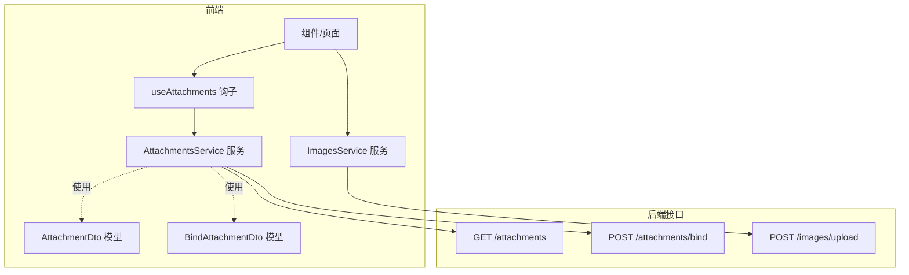
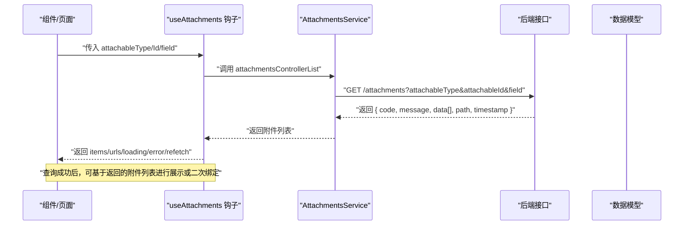
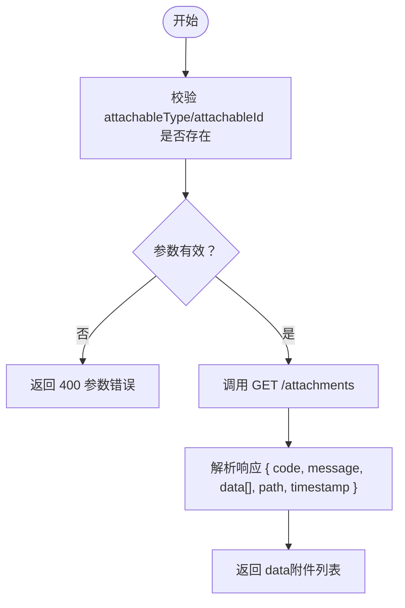
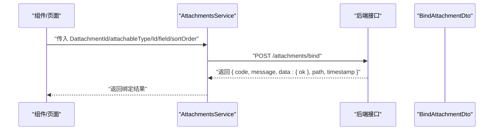
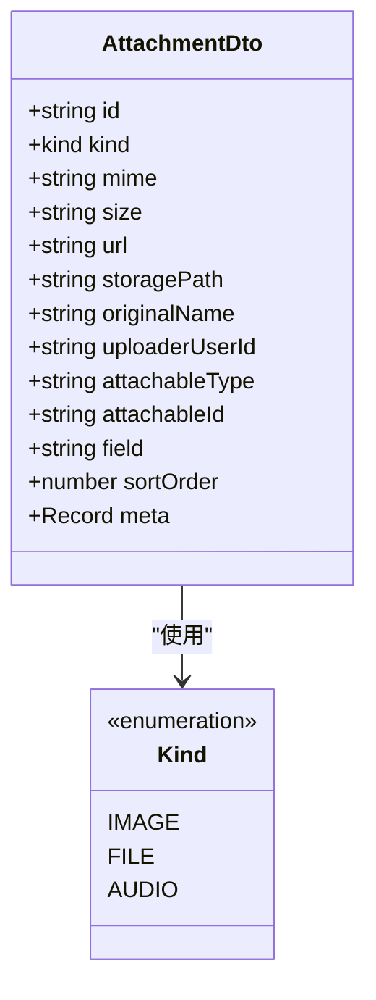
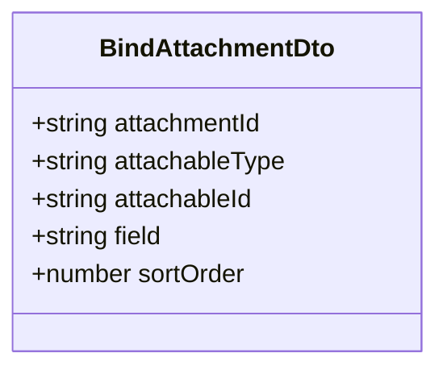
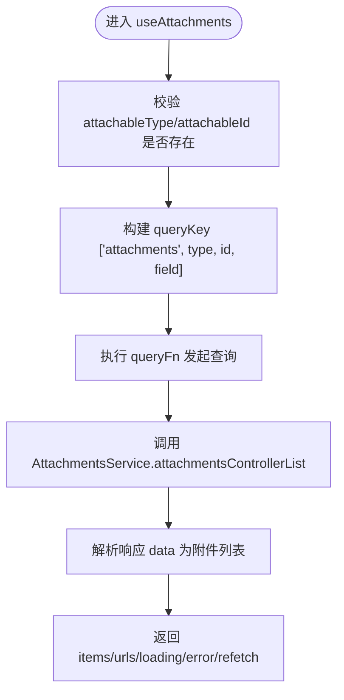
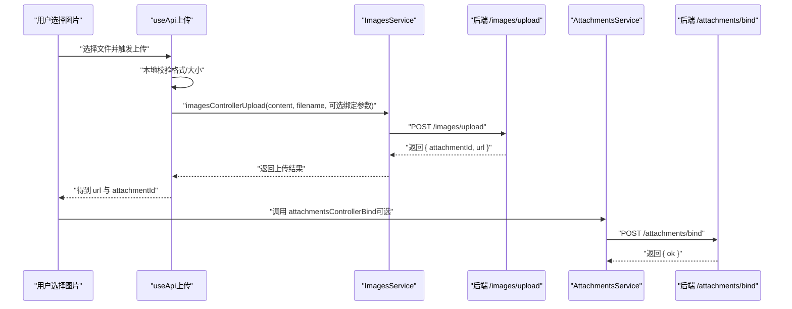
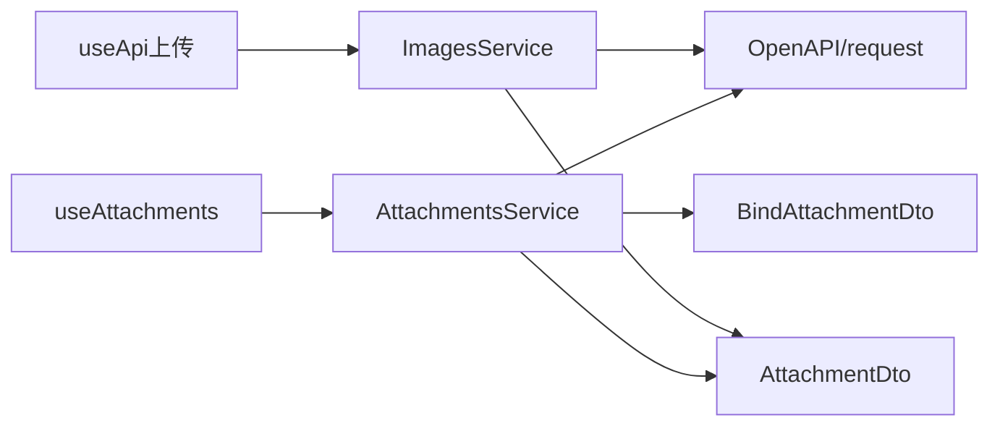

# 附件服务

<cite>
**本文引用的文件**
- [src/api/services/AttachmentsService.ts](file://src/api/services/AttachmentsService.ts)
- [src/modules/app/hooks/useAttachments.ts](file://src/modules/app/hooks/useAttachments.ts)
- [src/api/models/AttachmentDto.ts](file://src/api/models/AttachmentDto.ts)
- [src/api/models/BindAttachmentDto.ts](file://src/api/models/BindAttachmentDto.ts)
- [src/api/models/CreateAttachmentInput.ts](file://src/api/models/CreateAttachmentInput.ts)
- [src/api/models/ReplyAttachmentInput.ts](file://src/api/models/ReplyAttachmentInput.ts)
- [src/api/models/UploadAttachmentDto.ts](file://src/api/models/UploadAttachmentDto.ts)
- [src/api/services/ImagesService.ts](file://src/api/services/ImagesService.ts)
- [src/hooks/useApi.ts](file://src/hooks/useApi.ts)
- [src/api/core/ApiError.ts](file://src/api/core/ApiError.ts)
</cite>

## 目录
1. [简介](#简介)
2. [项目结构](#项目结构)
3. [核心组件](#核心组件)
4. [架构总览](#架构总览)
5. [详细组件分析](#详细组件分析)
6. [依赖分析](#依赖分析)
7. [性能考虑](#性能考虑)
8. [故障排查指南](#故障排查指南)
9. [结论](#结论)
10. [附录](#附录)

## 简介
本技术文档围绕附件服务展开，系统性阐述附件上传、绑定与管理的完整流程，重点覆盖：
- 附件控制器的查询接口实现：按目标类型、ID 和字段查询附件的参数配置与返回值结构
- 附件绑定功能的业务逻辑：BindAttachmentDto 的数据模型与绑定验证机制
- 附件管理最佳实践：文件类型限制、大小控制与安全验证
- 错误处理策略与 API 调用示例路径

## 项目结构
附件能力由前端 SDK 与 Hook 协同构成：
- 服务层：通过 AttachmentsService 提供查询与绑定接口
- 数据模型：AttachmentDto、BindAttachmentDto 等定义了数据契约
- 查询 Hook：useAttachments 封装查询、缓存与 URL 抽取
- 图片上传：ImagesService 提供图片上传能力，结合 useApi 做本地校验与调用
- 错误模型：ApiError 提供统一的错误封装

图表来源
- [src/api/services/AttachmentsService.ts](file://src/api/services/AttachmentsService.ts#L19-L46)
- [src/api/services/AttachmentsService.ts](file://src/api/services/AttachmentsService.ts#L53-L77)
- [src/api/services/ImagesService.ts](file://src/api/services/ImagesService.ts#L15-L66)
- [src/modules/app/hooks/useAttachments.ts](file://src/modules/app/hooks/useAttachments.ts#L13-L38)
- [src/api/models/AttachmentDto.ts](file://src/api/models/AttachmentDto.ts#L5-L19)
- [src/api/models/BindAttachmentDto.ts](file://src/api/models/BindAttachmentDto.ts#L5-L11)

章节来源
- [src/api/services/AttachmentsService.ts](file://src/api/services/AttachmentsService.ts#L1-L79)
- [src/modules/app/hooks/useAttachments.ts](file://src/modules/app/hooks/useAttachments.ts#L1-L39)
- [src/api/models/AttachmentDto.ts](file://src/api/models/AttachmentDto.ts#L1-L28)
- [src/api/models/BindAttachmentDto.ts](file://src/api/models/BindAttachmentDto.ts#L1-L13)
- [src/api/services/ImagesService.ts](file://src/api/services/ImagesService.ts#L1-L67)
- [src/hooks/useApi.ts](file://src/hooks/useApi.ts#L260-L312)

## 核心组件
- 附件查询服务：提供按 attachableType、attachableId、field 查询附件列表的能力
- 附件绑定服务：提供将附件绑定到业务对象的能力
- 附件数据模型：描述附件字段与分类
- 绑定数据模型：描述绑定请求的必要字段
- 查询 Hook：统一封装查询、缓存与 URL 抽取
- 图片上传服务：提供图片上传能力，结合本地校验
- 错误模型：统一捕获与抛出 API 异常

章节来源
- [src/api/services/AttachmentsService.ts](file://src/api/services/AttachmentsService.ts#L19-L77)
- [src/api/models/AttachmentDto.ts](file://src/api/models/AttachmentDto.ts#L5-L26)
- [src/api/models/BindAttachmentDto.ts](file://src/api/models/BindAttachmentDto.ts#L5-L11)
- [src/modules/app/hooks/useAttachments.ts](file://src/modules/app/hooks/useAttachments.ts#L13-L38)
- [src/api/services/ImagesService.ts](file://src/api/services/ImagesService.ts#L15-L66)
- [src/api/core/ApiError.ts](file://src/api/core/ApiError.ts#L8-L25)

## 架构总览
下图展示了从组件到服务再到后端接口的调用链路，以及数据在各层之间的传递。

图表来源
- [src/modules/app/hooks/useAttachments.ts](file://src/modules/app/hooks/useAttachments.ts#L17-L29)
- [src/api/services/AttachmentsService.ts](file://src/api/services/AttachmentsService.ts#L19-L46)
- [src/api/models/AttachmentDto.ts](file://src/api/models/AttachmentDto.ts#L5-L19)

## 详细组件分析

### 附件查询接口（按目标查询）
- 接口路径：GET /attachments
- 请求参数
  - attachableType: 业务对象类型（例如 torrent、series、movie、playlist 等）
  - attachableId: 业务对象 ID
  - field: 可选，语义字段（如 cover、cover_thumb、cover_medium、cover_large、still 等）
- 返回值结构
  - code: 状态码
  - message: 描述信息
  - data: 附件数组（元素为 AttachmentDto）
  - path: 请求路径
  - timestamp: 时间戳
- 错误码
  - 400：参数错误
  - 401：未认证
  - 403：禁止访问或账号禁用
  - 404：资源不存在
  - 500：服务器错误

图表来源
- [src/api/services/AttachmentsService.ts](file://src/api/services/AttachmentsService.ts#L19-L46)
- [src/modules/app/hooks/useAttachments.ts](file://src/modules/app/hooks/useAttachments.ts#L13-L29)

章节来源
- [src/api/services/AttachmentsService.ts](file://src/api/services/AttachmentsService.ts#L19-L46)
- [src/modules/app/hooks/useAttachments.ts](file://src/modules/app/hooks/useAttachments.ts#L13-L38)

### 附件绑定接口（绑定到业务对象）
- 接口路径：POST /attachments/bind
- 请求体：BindAttachmentDto
  - attachmentId: 附件 ID
  - attachableType: 业务对象类型
  - attachableId: 业务对象 ID
  - field: 语义字段
  - sortOrder: 可选，排序序号
- 返回值结构
  - code: 状态码
  - message: 描述信息
  - data.ok: 绑定是否成功
  - path: 请求路径
  - timestamp: 时间戳
- 错误码
  - 400：参数错误
  - 401：未认证
  - 403：禁止访问或账号禁用
  - 404：资源不存在
  - 500：服务器错误

图表来源
- [src/api/services/AttachmentsService.ts](file://src/api/services/AttachmentsService.ts#L53-L77)
- [src/api/models/BindAttachmentDto.ts](file://src/api/models/BindAttachmentDto.ts#L5-L11)

章节来源
- [src/api/services/AttachmentsService.ts](file://src/api/services/AttachmentsService.ts#L53-L77)
- [src/api/models/BindAttachmentDto.ts](file://src/api/models/BindAttachmentDto.ts#L5-L11)

### 附件数据模型（AttachmentDto）
- 关键字段
  - id: 附件唯一标识
  - kind: 附件类型（image/file/audio）
  - mime: MIME 类型
  - size: 字符串形式的大小
  - url: 访问地址
  - storagePath: 存储路径
  - originalName: 原始文件名
  - uploaderUserId: 上传者用户 ID
  - attachableType: 绑定的业务对象类型
  - attachableId: 绑定的业务对象 ID
  - field: 绑定语义字段
  - sortOrder: 排序序号
  - meta: 元信息（任意 JSON）

图表来源
- [src/api/models/AttachmentDto.ts](file://src/api/models/AttachmentDto.ts#L5-L26)

章节来源
- [src/api/models/AttachmentDto.ts](file://src/api/models/AttachmentDto.ts#L5-L26)

### 绑定数据模型（BindAttachmentDto）
- 关键字段
  - attachmentId: 附件 ID
  - attachableType: 业务对象类型
  - attachableId: 业务对象 ID
  - field: 语义字段
  - sortOrder: 可选，排序序号

图表来源
- [src/api/models/BindAttachmentDto.ts](file://src/api/models/BindAttachmentDto.ts#L5-L11)

章节来源
- [src/api/models/BindAttachmentDto.ts](file://src/api/models/BindAttachmentDto.ts#L5-L11)

### 查询 Hook（useAttachments）
- 功能
  - 统一按附件绑定关系查询图片/文件列表，并缓存结果
  - 自动抽取每个附件的 URL 列表
  - 支持 refetch 主动刷新
- 参数
  - attachableType: 业务对象类型（如 torrent、series、movie、playlist）
  - attachableId: 业务对象 ID
  - field: 可选，语义字段（如 cover、cover_thumb、cover_medium、cover_large、still）
- 返回
  - loading: 加载状态
  - error: 错误对象
  - items: 附件列表（AttachmentDto[]）
  - urls: 附件 URL 数组
  - refetch: 刷新函数

图表来源
- [src/modules/app/hooks/useAttachments.ts](file://src/modules/app/hooks/useAttachments.ts#L13-L38)
- [src/api/services/AttachmentsService.ts](file://src/api/services/AttachmentsService.ts#L19-L46)

章节来源
- [src/modules/app/hooks/useAttachments.ts](file://src/modules/app/hooks/useAttachments.ts#L13-L38)

### 图片上传与绑定（含本地校验）
- 图片上传
  - 接口：POST /images/upload
  - 输入：content（base64/dataURL）、filename、可选 attachableType/attachableId/field/sortOrder/mimeType
  - 输出：attachmentId、url
- 本地校验（示例）
  - 仅允许 JPG/PNG
  - 限制大小不超过 2MB
  - 读取文件为 dataURL 后再上传
- 绑定流程
  - 先上传获取 attachmentId
  - 再调用绑定接口将附件绑定到业务对象

图表来源
- [src/api/services/ImagesService.ts](file://src/api/services/ImagesService.ts#L15-L66)
- [src/hooks/useApi.ts](file://src/hooks/useApi.ts#L260-L312)
- [src/api/services/AttachmentsService.ts](file://src/api/services/AttachmentsService.ts#L53-L77)

章节来源
- [src/api/services/ImagesService.ts](file://src/api/services/ImagesService.ts#L15-L66)
- [src/hooks/useApi.ts](file://src/hooks/useApi.ts#L260-L312)
- [src/api/services/AttachmentsService.ts](file://src/api/services/AttachmentsService.ts#L53-L77)

### 附件管理最佳实践
- 文件类型限制
  - 优先在前端进行格式校验（如仅允许 JPG/PNG），减少无效请求
  - 在后端同样进行类型校验，确保安全性
- 大小控制
  - 前端限制常见尺寸（如 2MB），避免大文件拖慢接口
  - 后端应设置上限并返回明确错误
- 安全验证
  - 严格校验 attachableType/attachableId/field 的合法性
  - 对上传内容进行 MIME 自动识别与白名单匹配
  - 对排序字段 sortOrder 进行范围校验
- 缓存与性能
  - 使用查询 Hook 对查询结果进行缓存，避免重复请求
  - 合理使用 field 过滤，缩小返回数据量
- 错误处理
  - 明确区分 400/401/403/404/500 的含义，前端给出友好提示
  - 统一使用错误模型封装异常，便于调试与日志追踪

章节来源
- [src/hooks/useApi.ts](file://src/hooks/useApi.ts#L260-L312)
- [src/api/services/AttachmentsService.ts](file://src/api/services/AttachmentsService.ts#L38-L44)
- [src/api/services/AttachmentsService.ts](file://src/api/services/AttachmentsService.ts#L69-L75)
- [src/api/core/ApiError.ts](file://src/api/core/ApiError.ts#L8-L25)

## 依赖分析
- 组件耦合
  - useAttachments 依赖 AttachmentsService
  - AttachmentsService 依赖 OpenAPI 与 request 工具
  - ImagesService 独立提供图片上传能力
- 数据模型
  - 附件查询与绑定均依赖 AttachmentDto 与 BindAttachmentDto
- 外部依赖
  - TanStack React Query 用于查询缓存与并发控制
  - 统一的错误模型 ApiError 用于异常封装

图表来源
- [src/modules/app/hooks/useAttachments.ts](file://src/modules/app/hooks/useAttachments.ts#L1-L39)
- [src/api/services/AttachmentsService.ts](file://src/api/services/AttachmentsService.ts#L1-L79)
- [src/api/services/ImagesService.ts](file://src/api/services/ImagesService.ts#L1-L67)
- [src/api/models/AttachmentDto.ts](file://src/api/models/AttachmentDto.ts#L5-L19)
- [src/api/models/BindAttachmentDto.ts](file://src/api/models/BindAttachmentDto.ts#L5-L11)

章节来源
- [src/modules/app/hooks/useAttachments.ts](file://src/modules/app/hooks/useAttachments.ts#L1-L39)
- [src/api/services/AttachmentsService.ts](file://src/api/services/AttachmentsService.ts#L1-L79)
- [src/api/services/ImagesService.ts](file://src/api/services/ImagesService.ts#L1-L67)
- [src/api/models/AttachmentDto.ts](file://src/api/models/AttachmentDto.ts#L5-L19)
- [src/api/models/BindAttachmentDto.ts](file://src/api/models/BindAttachmentDto.ts#L5-L11)

## 性能考虑
- 查询缓存
  - 使用 queryKey 将 attachableType/attachableId/field 组合作为缓存键，避免重复请求
- 分页与过滤
  - 通过 field 过滤减少不必要的数据传输
- 并发控制
  - 合理使用 refetch 控制刷新频率，避免频繁并发请求
- 上传优化
  - 前端压缩与校验，降低上传失败率
  - 上传完成后立即绑定，减少中间态

## 故障排查指南
- 常见错误与定位
  - 400 参数错误：检查 attachableType/attachableId/field 是否为空或非法
  - 401 未认证：确认登录状态与权限
  - 403 禁止访问：检查账号状态与操作权限
  - 404 资源不存在：确认业务对象是否存在
  - 500 服务器错误：查看后端日志与网络状态
- 前端错误封装
  - 使用统一错误模型 ApiError，便于定位请求与响应详情
- 上传失败排查
  - 检查本地格式与大小限制
  - 确认上传接口返回的 attachmentId 与 url 是否存在

章节来源
- [src/api/services/AttachmentsService.ts](file://src/api/services/AttachmentsService.ts#L38-L44)
- [src/api/services/AttachmentsService.ts](file://src/api/services/AttachmentsService.ts#L69-L75)
- [src/hooks/useApi.ts](file://src/hooks/useApi.ts#L260-L312)
- [src/api/core/ApiError.ts](file://src/api/core/ApiError.ts#L8-L25)

## 结论
附件服务通过清晰的查询与绑定接口、规范的数据模型与完善的错误处理，实现了对图片与文件的统一管理。配合查询 Hook 的缓存机制与前端上传校验，能够在保证安全性的前提下提升用户体验与系统性能。建议在后续迭代中进一步完善后端校验与限流策略，并持续优化前端交互细节。

## 附录
- 相关输入模型
  - CreateAttachmentInput：用于创建场景的附件输入（仅包含 attachmentId）
  - ReplyAttachmentInput：用于回复场景的附件输入（仅包含 attachmentId）
  - UploadAttachmentDto：上传场景的附加信息（purpose、ticketId 等）

章节来源
- [src/api/models/CreateAttachmentInput.ts](file://src/api/models/CreateAttachmentInput.ts#L5-L7)
- [src/api/models/ReplyAttachmentInput.ts](file://src/api/models/ReplyAttachmentInput.ts#L5-L7)
- [src/api/models/UploadAttachmentDto.ts](file://src/api/models/UploadAttachmentDto.ts#L5-L14)