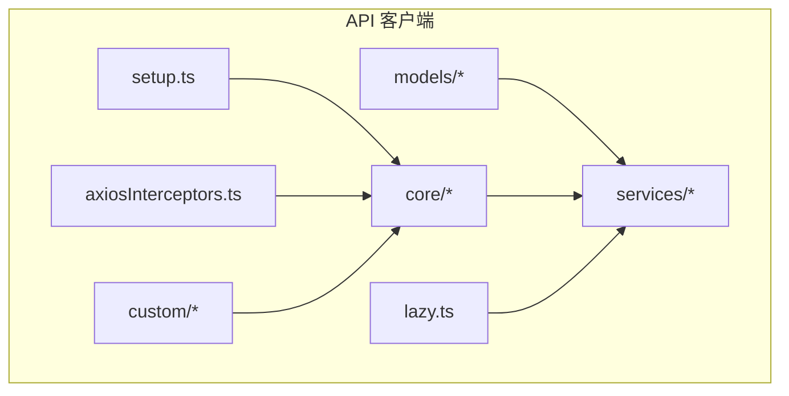
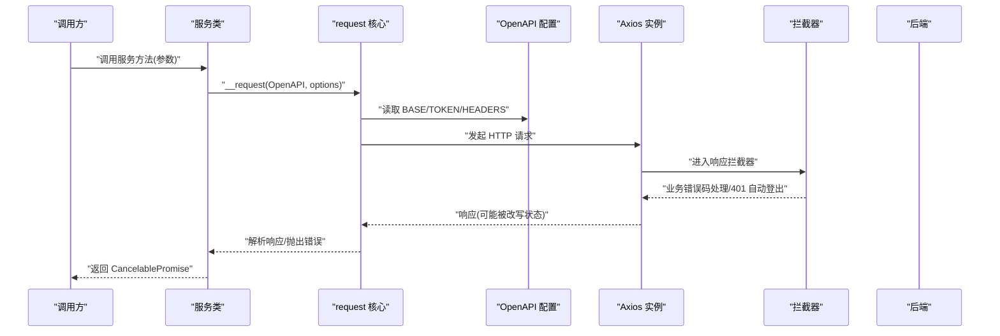
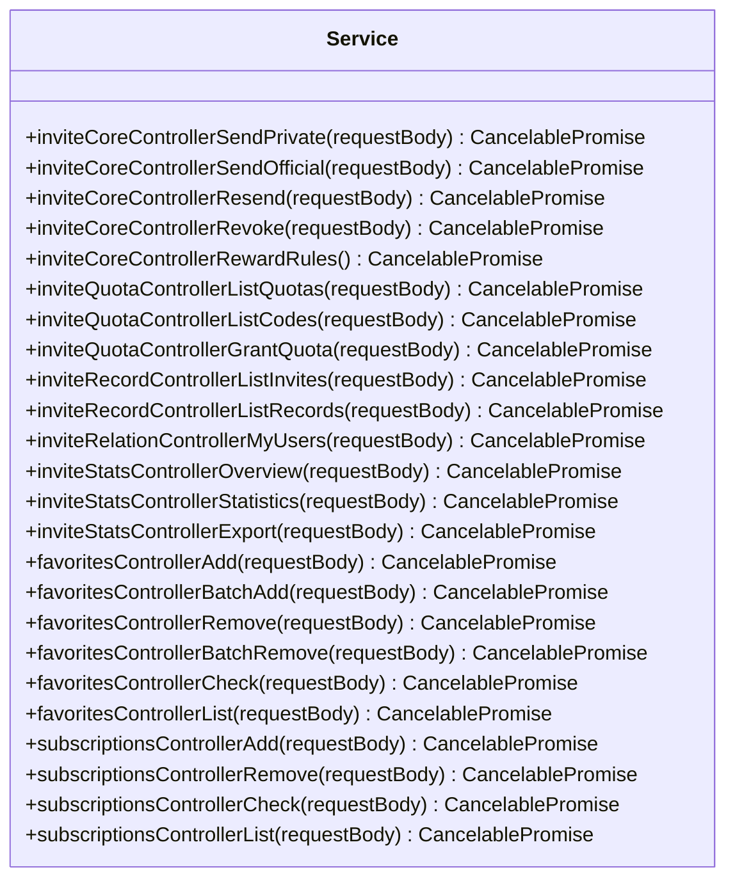
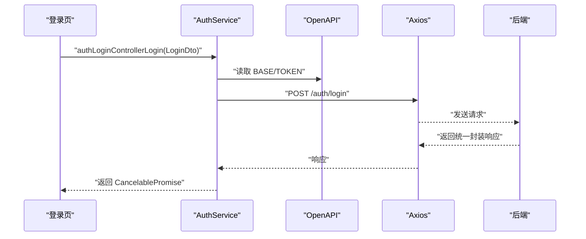
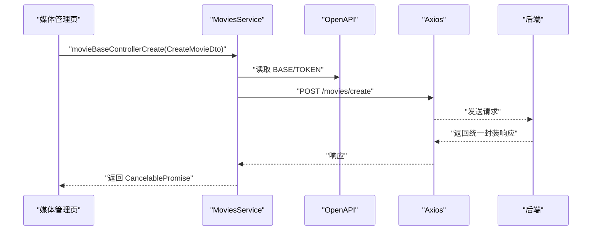
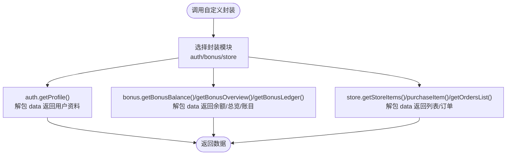
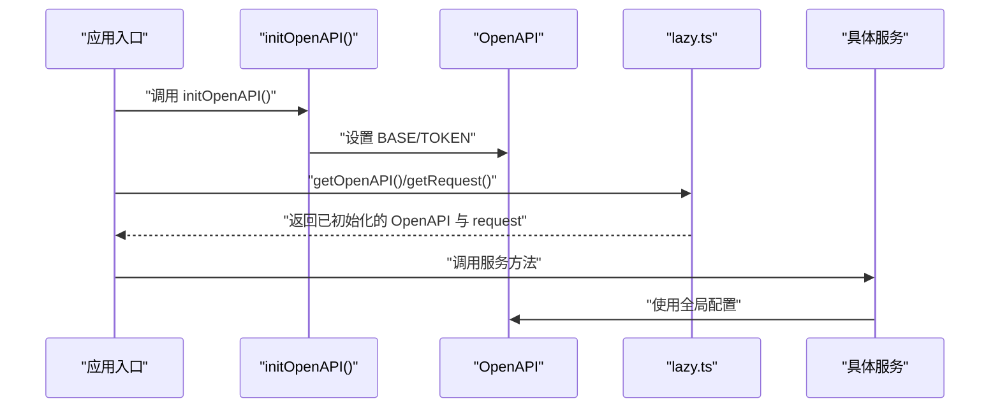
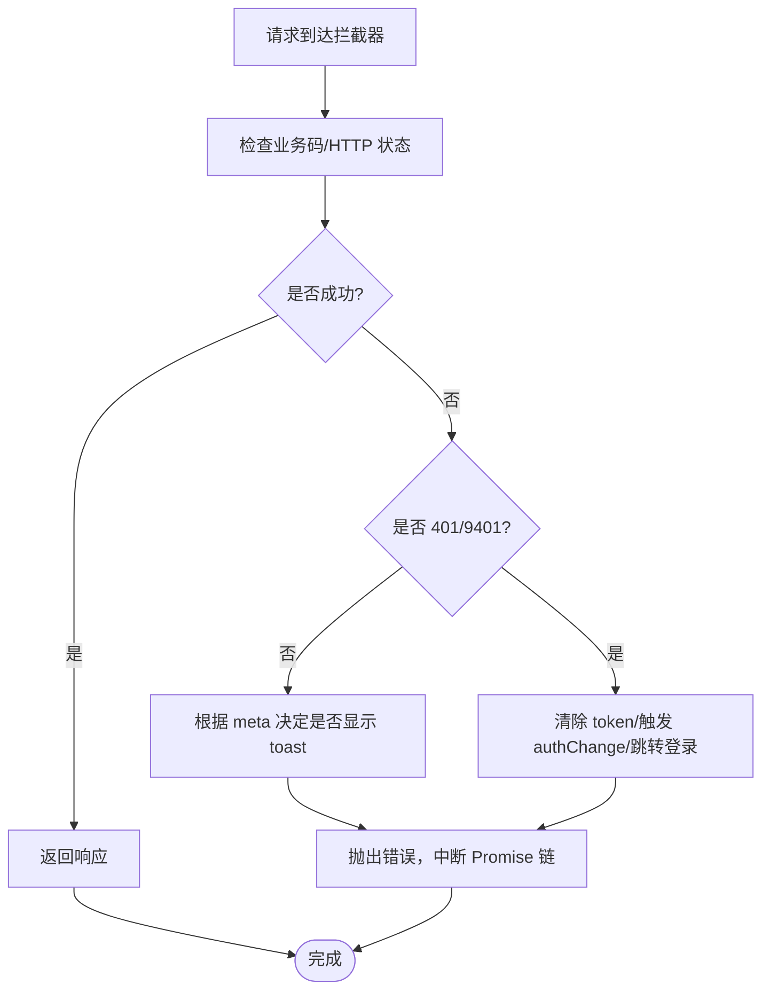
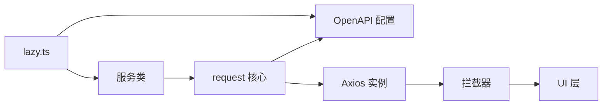

# 服务层设计

<cite>
**本文档引用的文件**
- [src/api/index.ts](file://src/api/index.ts)
- [src/api/setup.ts](file://src/api/setup.ts)
- [src/api/lazy.ts](file://src/api/lazy.ts)
- [src/api/axiosInterceptors.ts](file://src/api/axiosInterceptors.ts)
- [src/api/core/OpenAPI.ts](file://src/api/core/OpenAPI.ts)
- [src/api/core/request.ts](file://src/api/core/request.ts)
- [src/api/services/Service.ts](file://src/api/services/Service.ts)
- [src/api/services/AuthService.ts](file://src/api/services/AuthService.ts)
- [src/api/services/MoviesService.ts](file://src/api/services/MoviesService.ts)
- [src/api/custom/auth.ts](file://src/api/custom/auth.ts)
- [src/api/custom/bonus.ts](file://src/api/custom/bonus.ts)
- [src/api/custom/store.ts](file://src/api/custom/store.ts)
</cite>

## 目录
1. [引言](#引言)
2. [项目结构](#项目结构)
3. [核心组件](#核心组件)
4. [架构总览](#架构总览)
5. [详细组件分析](#详细组件分析)
6. [依赖关系分析](#依赖关系分析)
7. [性能考虑](#性能考虑)
8. [故障排查指南](#故障排查指南)
9. [结论](#结论)
10. [附录](#附录)

## 引言
本文件面向服务层设计，系统性阐述基于 OpenAPI 生成的 API 客户端架构、服务分类组织与 API 调用封装策略。重点覆盖以下方面：
- 架构模式：以 OpenAPI 生成的 SDK 为核心，结合统一请求封装与拦截器，形成“模型-服务-核心”三层结构。
- 服务分类：围绕认证、媒体内容、收藏与订阅、邀请与配额、账务与积分、商店等业务域划分服务模块。
- 调用封装：统一请求、取消、错误处理与响应解包策略，支持静态与动态加载以平衡构建体积与运行时性能。
- 设计原则：单一职责、依赖注入（通过 OpenAPI 配置）、错误处理与可观察性。
- 使用方法：参数传递模式、响应数据处理、扩展机制与自定义服务开发指南。
- 性能优化：请求去重、并发控制、缓存策略、懒加载与构建优化。

## 项目结构
服务层位于 src/api 目录，采用“模型-服务-核心”分层：
- models：由 OpenAPI 生成的类型定义，覆盖各业务 DTO。
- services：按领域拆分的服务类，每个类包含一组同源 API 的封装方法。
- core：请求核心（OpenAPI 配置、请求发送、取消、错误处理）。
- custom：轻量封装与业务适配，用于简化响应解包与参数标准化。
- setup/lazy：运行时初始化与按需加载策略。
- axiosInterceptors：统一响应拦截与错误提示。

图表来源
- [src/api/index.ts](file://src/api/index.ts#L1-L642)
- [src/api/services/Service.ts](file://src/api/services/Service.ts#L1-L734)
- [src/api/core/request.ts](file://src/api/core/request.ts#L1-L324)
- [src/api/core/OpenAPI.ts](file://src/api/core/OpenAPI.ts#L1-L33)
- [src/api/lazy.ts](file://src/api/lazy.ts#L1-L75)
- [src/api/setup.ts](file://src/api/setup.ts#L1-L35)
- [src/api/axiosInterceptors.ts](file://src/api/axiosInterceptors.ts#L1-L294)

章节来源
- [src/api/index.ts](file://src/api/index.ts#L1-L642)
- [src/api/services/Service.ts](file://src/api/services/Service.ts#L1-L734)
- [src/api/core/OpenAPI.ts](file://src/api/core/OpenAPI.ts#L1-L33)
- [src/api/core/request.ts](file://src/api/core/request.ts#L1-L324)
- [src/api/lazy.ts](file://src/api/lazy.ts#L1-L75)
- [src/api/setup.ts](file://src/api/setup.ts#L1-L35)
- [src/api/axiosInterceptors.ts](file://src/api/axiosInterceptors.ts#L1-L294)

## 核心组件
- OpenAPI 配置：集中管理 BASE、TOKEN、凭证与头部等全局配置。
- request 核心：负责 URL 拼接、请求头构造、请求发送、响应解析与错误捕获。
- CancelablePromise：支持取消与回调注册，便于 UI 中断长请求。
- 服务类：以领域为中心的方法集合，统一调用 request 并返回 CancelablePromise。
- 自定义封装：对特定接口进行响应解包、参数标准化与幂等键透传。
- 拦截器：统一处理业务错误码、401 自动登出、静默模式与错误提示。

章节来源
- [src/api/core/OpenAPI.ts](file://src/api/core/OpenAPI.ts#L1-L33)
- [src/api/core/request.ts](file://src/api/core/request.ts#L1-L324)
- [src/api/services/Service.ts](file://src/api/services/Service.ts#L1-L734)
- [src/api/custom/bonus.ts](file://src/api/custom/bonus.ts#L1-L90)
- [src/api/custom/store.ts](file://src/api/custom/store.ts#L1-L145)
- [src/api/axiosInterceptors.ts](file://src/api/axiosInterceptors.ts#L1-L294)

## 架构总览
服务层遵循“模型-服务-核心”的分层设计，配合 OpenAPI 初始化与拦截器，形成稳定的调用链路。

图表来源
- [src/api/services/Service.ts](file://src/api/services/Service.ts#L41-L734)
- [src/api/core/request.ts](file://src/api/core/request.ts#L294-L324)
- [src/api/core/OpenAPI.ts](file://src/api/core/OpenAPI.ts#L22-L32)
- [src/api/axiosInterceptors.ts](file://src/api/axiosInterceptors.ts#L196-L292)

章节来源
- [src/api/services/Service.ts](file://src/api/services/Service.ts#L41-L734)
- [src/api/core/request.ts](file://src/api/core/request.ts#L294-L324)
- [src/api/core/OpenAPI.ts](file://src/api/core/OpenAPI.ts#L22-L32)
- [src/api/axiosInterceptors.ts](file://src/api/axiosInterceptors.ts#L196-L292)

## 详细组件分析

### 组件 A：通用服务基类 Service
- 职责：提供通用邀请、收藏、订阅等跨模块 API 的封装，统一错误映射与返回结构。
- 接口定义：每个方法接收请求体 DTO，返回统一封装的响应对象（含 code/message/data/path/timestamp）。
- 使用方法：直接调用静态方法，获得 CancelablePromise，可在 UI 中使用取消能力与错误处理。
- 参数传递：请求体为对应 DTO；部分接口支持分页与过滤参数。
- 响应处理：外层统一封装，内部由拦截器或调用方自行解包 data 字段。

图表来源
- [src/api/services/Service.ts](file://src/api/services/Service.ts#L41-L734)

章节来源
- [src/api/services/Service.ts](file://src/api/services/Service.ts#L41-L734)

### 组件 B：认证服务 AuthService
- 职责：提供登录、注册、验证码、邀请码校验与当前用户信息等认证相关接口。
- 接口定义：登录返回令牌与用户信息；注册返回结果；验证码流程支持请求与验证；查询注册开关与邀请码有效性。
- 使用方法：在登录页与注册页调用相应方法；登录成功后将令牌保存至本地存储，OpenAPI 会自动携带。
- 参数传递：LoginDto、RegisterDto、RequestEmailCodeDto、VerifyEmailCodeDto、VerifyInviteCodeDto 等。
- 响应处理：返回统一封装对象，data 字段包含业务数据。

图表来源
- [src/api/services/AuthService.ts](file://src/api/services/AuthService.ts#L31-L52)
- [src/api/core/OpenAPI.ts](file://src/api/core/OpenAPI.ts#L22-L32)
- [src/api/core/request.ts](file://src/api/core/request.ts#L294-L324)

章节来源
- [src/api/services/AuthService.ts](file://src/api/services/AuthService.ts#L23-L200)

### 组件 C：媒体服务 MoviesService
- 职责：提供电影的增删改查与列表接口，支持详情查询与分页列表。
- 接口定义：create、update、delete、detail、list 等。
- 使用方法：在媒体管理页面调用对应方法；列表支持分页与筛选参数。
- 参数传递：CreateMovieDto、UpdateMovieDto、DeleteMovieDto、GetMovieDto、ListMoviesDto。
- 响应处理：返回统一封装对象，data 字段为 MovieDetailDto 或 ListMoviesResponseDto。

图表来源
- [src/api/services/MoviesService.ts](file://src/api/services/MoviesService.ts#L23-L44)
- [src/api/core/OpenAPI.ts](file://src/api/core/OpenAPI.ts#L22-L32)
- [src/api/core/request.ts](file://src/api/core/request.ts#L294-L324)

章节来源
- [src/api/services/MoviesService.ts](file://src/api/services/MoviesService.ts#L16-L163)

### 组件 D：自定义封装 custom
- custom/auth.ts：对 /auth/profile 进行轻量封装，自动解包 data 字段，返回用户资料。
- custom/bonus.ts：对魔力值/积分相关接口进行封装，提供余额、总览与账目明细的类型与解包逻辑。
- custom/store.ts：对积分商城接口进行封装，提供商品列表、购买下单与订单查询的类型与解包逻辑，并支持幂等键透传。

图表来源
- [src/api/custom/auth.ts](file://src/api/custom/auth.ts#L1-L14)
- [src/api/custom/bonus.ts](file://src/api/custom/bonus.ts#L1-L90)
- [src/api/custom/store.ts](file://src/api/custom/store.ts#L1-L145)

章节来源
- [src/api/custom/auth.ts](file://src/api/custom/auth.ts#L1-L14)
- [src/api/custom/bonus.ts](file://src/api/custom/bonus.ts#L1-L90)
- [src/api/custom/store.ts](file://src/api/custom/store.ts#L1-L145)

### 组件 E：运行时初始化与懒加载
- setup.ts：集中初始化 OpenAPI 的 BASE 与 TOKEN，规范化基础地址，避免重复斜杠；仅初始化一次，防止热更新重复污染。
- lazy.ts：提供 getOpenAPI/getRequest 以及若干服务的懒加载/静态返回函数，避免构建器警告与过度分包；对多处静态导入的服务采用静态返回策略。

图表来源
- [src/api/setup.ts](file://src/api/setup.ts#L18-L34)
- [src/api/lazy.ts](file://src/api/lazy.ts#L11-L29)

章节来源
- [src/api/setup.ts](file://src/api/setup.ts#L1-L35)
- [src/api/lazy.ts](file://src/api/lazy.ts#L1-L75)

### 组件 F：统一拦截器与错误处理
- axiosInterceptors.ts：定义统一响应结构与错误映射，支持静默模式、跳过特定错误码、自定义错误消息；对 9401 未授权进行自动登出与跳转；在开发环境打印详细错误信息；将业务错误转换为 AxiosError 以便上层捕获。

图表来源
- [src/api/axiosInterceptors.ts](file://src/api/axiosInterceptors.ts#L196-L292)

章节来源
- [src/api/axiosInterceptors.ts](file://src/api/axiosInterceptors.ts#L1-L294)

## 依赖关系分析
- 低耦合高内聚：服务类仅依赖 core/request 与 core/OpenAPI，不直接依赖 UI，便于测试与复用。
- 依赖注入：通过 OpenAPI 全局配置注入 BASE/TOKEN/HEADERS，实现跨服务一致性。
- 错误处理：request 核心统一捕获 HTTP 与业务错误，拦截器统一处理 UI 层提示与登出逻辑。
- 动态与静态混合：lazy.ts 对多处静态导入的服务采用静态返回，减少构建警告；对按需服务采用动态导入。

图表来源
- [src/api/services/Service.ts](file://src/api/services/Service.ts#L41-L734)
- [src/api/core/request.ts](file://src/api/core/request.ts#L294-L324)
- [src/api/core/OpenAPI.ts](file://src/api/core/OpenAPI.ts#L22-L32)
- [src/api/lazy.ts](file://src/api/lazy.ts#L11-L29)
- [src/api/axiosInterceptors.ts](file://src/api/axiosInterceptors.ts#L196-L292)

章节来源
- [src/api/services/Service.ts](file://src/api/services/Service.ts#L41-L734)
- [src/api/core/request.ts](file://src/api/core/request.ts#L294-L324)
- [src/api/core/OpenAPI.ts](file://src/api/core/OpenAPI.ts#L22-L32)
- [src/api/lazy.ts](file://src/api/lazy.ts#L1-L75)
- [src/api/axiosInterceptors.ts](file://src/api/axiosInterceptors.ts#L1-L294)

## 性能考虑
- 请求取消：使用 CancelablePromise，在路由切换或组件卸载时及时取消未完成请求，避免内存泄漏与无意义网络消耗。
- 懒加载与静态返回：对多处静态导入的服务采用静态返回策略，减少构建体积与分包警告；对按需服务采用动态导入。
- 去重与节流：在 UI 层对高频请求进行去重与节流，避免重复触发相同请求。
- 缓存策略：对只读列表与详情接口，结合 UI 状态管理实现缓存；对实时性要求高的接口避免缓存。
- 构建优化：避免在全局与多服务中静态导入同一模块导致的分包警告，统一通过 lazy.ts 提供的异步函数接口。

## 故障排查指南
- 401/9401 未授权：拦截器会自动清除 token、触发 authChange 事件并跳转登录页；检查本地存储中的 accessToken 是否存在与过期。
- 业务错误码：拦截器根据 code 映射默认文案，可通过 meta.skipBusinessCodes 跳过特定错误提示；必要时使用 meta.customErrorMessage 覆盖默认消息。
- 网络错误：拦截器区分 ECONNABORTED 与 ERR_NETWORK 并给出不同提示；检查网络连接与代理设置。
- 请求未达后端：确认 OpenAPI.BASE 是否正确初始化，路径是否包含重复斜杠；检查拦截器是否被重复安装。
- 响应解包：若后端返回包裹结构或直接数组，custom 封装提供统一解包逻辑；若返回结构不一致，需在自定义封装中扩展解包策略。

章节来源
- [src/api/axiosInterceptors.ts](file://src/api/axiosInterceptors.ts#L166-L192)
- [src/api/axiosInterceptors.ts](file://src/api/axiosInterceptors.ts#L204-L291)
- [src/api/custom/bonus.ts](file://src/api/custom/bonus.ts#L47-L50)
- [src/api/custom/store.ts](file://src/api/custom/store.ts#L47-L50)

## 结论
服务层以 OpenAPI 生成的 SDK 为基础，结合统一请求核心与拦截器，实现了清晰的分层与可维护的调用链路。通过服务分类组织、参数与响应封装、错误处理与可观察性，满足了复杂业务场景下的稳定性与可扩展性。建议在后续迭代中持续完善自定义封装、引入缓存与去重策略，并保持拦截器与 OpenAPI 配置的一致性。

## 附录
- 扩展机制：新增服务时，遵循现有命名与目录规范，将方法封装在对应服务类中；如需特殊解包或参数处理，优先在 custom 下扩展。
- 自定义服务开发指南：参考 custom/auth.ts/bonus.ts/store.ts 的模式，定义类型、封装解包逻辑与错误处理；在 lazy.ts 中提供获取函数以避免构建警告。
- 最佳实践：统一使用 CancelablePromise；在 UI 层合理使用 meta.silent/skipErrorCodes；对关键接口增加重试与降级策略。