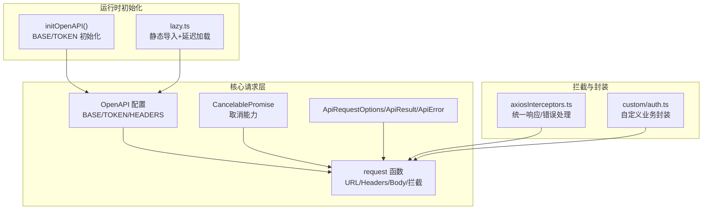
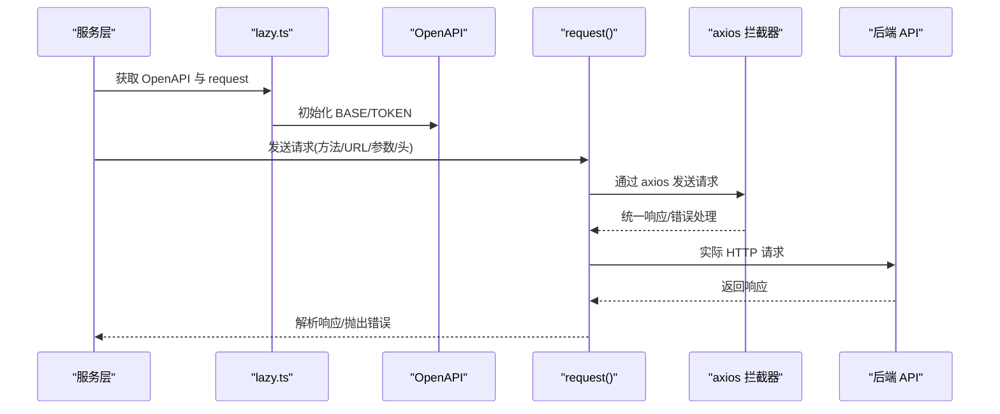
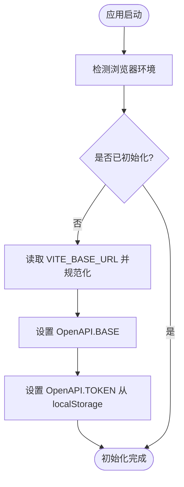
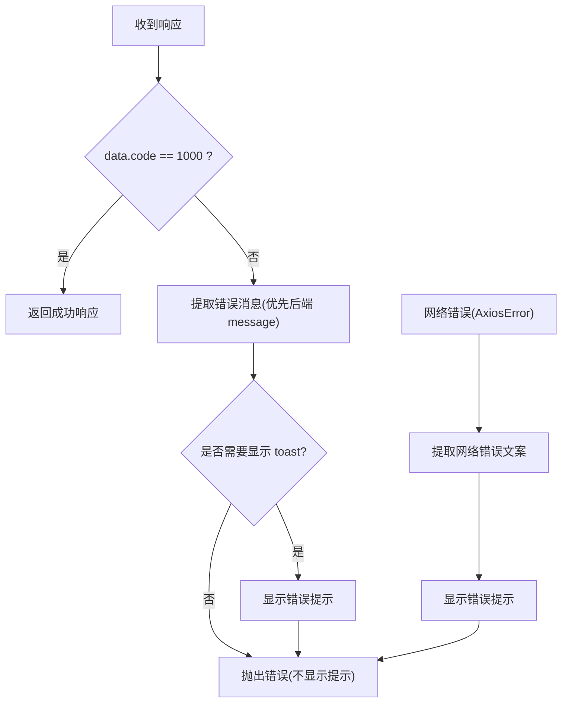
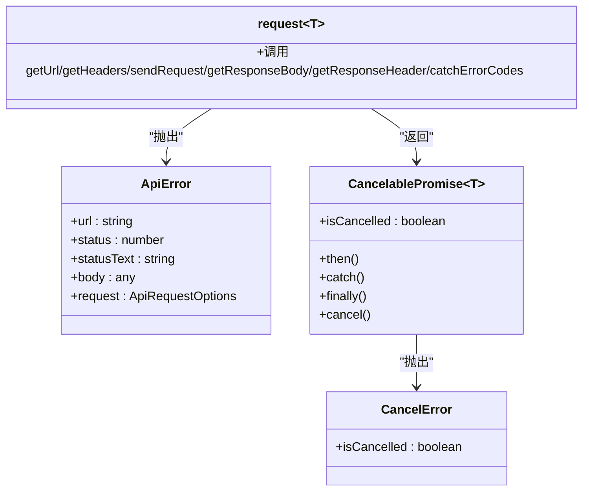
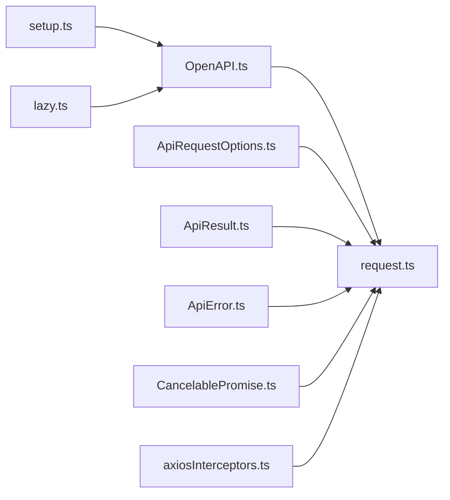

# 核心服务架构

<cite>
**本文档引用的文件**
- [src/api/core/request.ts](file://src/api/core/request.ts)
- [src/api/core/OpenAPI.ts](file://src/api/core/OpenAPI.ts)
- [src/api/core/ApiError.ts](file://src/api/core/ApiError.ts)
- [src/api/core/ApiResult.ts](file://src/api/core/ApiResult.ts)
- [src/api/core/ApiRequestOptions.ts](file://src/api/core/ApiRequestOptions.ts)
- [src/api/core/CancelablePromise.ts](file://src/api/core/CancelablePromise.ts)
- [src/api/setup.ts](file://src/api/setup.ts)
- [src/api/index.ts](file://src/api/index.ts)
- [src/api/lazy.ts](file://src/api/lazy.ts)
- [src/api/axiosInterceptors.ts](file://src/api/axiosInterceptors.ts)
- [src/api/custom/auth.ts](file://src/api/custom/auth.ts)
- [src/api/custom/store.ts](file://src/api/custom/store.ts)
</cite>

## 目录
1. [简介](#简介)
2. [项目结构](#项目结构)
3. [核心组件](#核心组件)
4. [架构总览](#架构总览)
5. [组件详细分析](#组件详细分析)
6. [依赖关系分析](#依赖关系分析)
7. [性能考量](#性能考量)
8. [故障排查指南](#故障排查指南)
9. [结论](#结论)
10. [附录](#附录)

## 简介
本文件面向核心服务架构，系统性阐述服务层基础设计、Service 基类实现原理、API 客户端初始化与请求拦截器工作机制。重点覆盖：
- 服务层继承体系与职责边界
- 错误处理策略与响应数据处理流程
- 服务实例化最佳实践、配置选项与扩展方法
- 服务层与 API 客户端的关系、依赖注入模式与生命周期管理

## 项目结构
核心服务架构围绕 openapi-typescript-codegen 生成的客户端与自定义封装展开，主要目录与文件如下：
- core：通用请求引擎与类型定义（OpenAPI、ApiRequestOptions、ApiResult、ApiError、CancelablePromise、request）
- setup：运行时 OpenAPI 配置初始化（BASE、TOKEN）
- lazy：延迟加载与静态导入兼容（避免构建警告）
- axiosInterceptors：统一响应拦截与错误提示
- custom：业务定制封装（如认证、积分商城）
- index：导出所有服务与核心类型

**图表来源**
- [src/api/core/request.ts](file://src/api/core/request.ts#L294-L324)
- [src/api/core/OpenAPI.ts](file://src/api/core/OpenAPI.ts#L10-L32)
- [src/api/core/CancelablePromise.ts](file://src/api/core/CancelablePromise.ts#L25-L132)
- [src/api/setup.ts](file://src/api/setup.ts#L18-L34)
- [src/api/lazy.ts](file://src/api/lazy.ts#L11-L29)
- [src/api/axiosInterceptors.ts](file://src/api/axiosInterceptors.ts#L196-L292)
- [src/api/custom/auth.ts](file://src/api/custom/auth.ts#L3-L13)

**章节来源**
- [src/api/core/request.ts](file://src/api/core/request.ts#L1-L324)
- [src/api/core/OpenAPI.ts](file://src/api/core/OpenAPI.ts#L1-L33)
- [src/api/core/ApiError.ts](file://src/api/core/ApiError.ts#L1-L26)
- [src/api/core/ApiResult.ts](file://src/api/core/ApiResult.ts#L1-L12)
- [src/api/core/ApiRequestOptions.ts](file://src/api/core/ApiRequestOptions.ts#L1-L18)
- [src/api/core/CancelablePromise.ts](file://src/api/core/CancelablePromise.ts#L1-L132)
- [src/api/setup.ts](file://src/api/setup.ts#L1-L35)
- [src/api/index.ts](file://src/api/index.ts#L559-L642)
- [src/api/lazy.ts](file://src/api/lazy.ts#L1-L75)
- [src/api/axiosInterceptors.ts](file://src/api/axiosInterceptors.ts#L1-L294)
- [src/api/custom/auth.ts](file://src/api/custom/auth.ts#L1-L14)
- [src/api/custom/store.ts](file://src/api/custom/store.ts#L1-L145)

## 核心组件
- OpenAPI 配置：集中管理 BASE、VERSION、WITH_CREDENTIALS、CREDENTIALS、TOKEN、USERNAME、PASSWORD、HEADERS、ENCODE_PATH 等运行时配置。
- ApiRequestOptions：描述一次请求的元数据（方法、URL、路径参数、查询参数、头、体、媒体类型、响应头选择、自定义错误映射等）。
- ApiResult：描述一次请求的响应结果（URL、状态码、状态文本、是否成功、响应体）。
- ApiError：统一错误包装，携带请求与响应上下文。
- CancelablePromise：可取消的 Promise 实现，支持取消回调注册与状态查询。
- request：核心请求函数，负责 URL 构造、表单数据处理、头部解析、发送请求、响应体/头提取、错误分类与抛出。

这些组件共同构成服务层的基础设施，支撑上层服务类的统一行为与可测试性。

**章节来源**
- [src/api/core/OpenAPI.ts](file://src/api/core/OpenAPI.ts#L10-L32)
- [src/api/core/ApiRequestOptions.ts](file://src/api/core/ApiRequestOptions.ts#L5-L17)
- [src/api/core/ApiResult.ts](file://src/api/core/ApiResult.ts#L5-L11)
- [src/api/core/ApiError.ts](file://src/api/core/ApiError.ts#L8-L24)
- [src/api/core/CancelablePromise.ts](file://src/api/core/CancelablePromise.ts#L25-L132)
- [src/api/core/request.ts](file://src/api/core/request.ts#L294-L324)

## 架构总览
服务层通过懒加载与静态导入结合的方式，避免构建工具告警，同时保证运行时配置的集中初始化。请求拦截器在 axios 层面统一处理业务错误码与 HTTP 错误，将错误标准化并触发用户提示或路由跳转。

**图表来源**
- [src/api/lazy.ts](file://src/api/lazy.ts#L11-L29)
- [src/api/core/request.ts](file://src/api/core/request.ts#L294-L324)
- [src/api/axiosInterceptors.ts](file://src/api/axiosInterceptors.ts#L204-L291)

**章节来源**
- [src/api/lazy.ts](file://src/api/lazy.ts#L1-L75)
- [src/api/axiosInterceptors.ts](file://src/api/axiosInterceptors.ts#L196-L292)
- [src/api/core/request.ts](file://src/api/core/request.ts#L294-L324)

## 组件详细分析

### Service 基类与继承体系
- 生成服务：index 导出大量服务类（如 AchievementsService、AuthService、UsersService 等），这些服务基于 ApiRequestOptions 发起请求。
- 继承关系：未在当前上下文中发现显式 Service 基类的 TypeScript 定义文件。通常这类服务会复用 request、OpenAPI、ApiRequestOptions 等核心能力，形成统一的请求与错误处理语义。
- 职责边界：每个服务聚焦单一领域（如用户、电影、种子、论坛等），通过统一的请求层完成 HTTP 交互，并在上层进行数据转换与业务编排。

最佳实践
- 服务内聚：每个服务只暴露必要的方法，避免跨域耦合。
- 参数标准化：统一使用 ApiRequestOptions 描述请求参数，便于拦截与测试。
- 错误处理：在服务层捕获并转换 ApiError，提供领域特定的错误消息与回退逻辑。

**章节来源**
- [src/api/index.ts](file://src/api/index.ts#L559-L642)

### API 客户端初始化与运行时配置
- initOpenAPI：在浏览器环境初始化 OpenAPI，设置 BASE（去除末尾斜杠）、TOKEN（从 localStorage 读取 accessToken），并确保仅初始化一次。
- lazy.ts：提供 getOpenAPI/getRequest 等异步函数，内部静态导入核心模块，避免与全局静态引用混用导致的构建告警。

**图表来源**
- [src/api/setup.ts](file://src/api/setup.ts#L18-L34)
- [src/api/lazy.ts](file://src/api/lazy.ts#L11-L24)

**章节来源**
- [src/api/setup.ts](file://src/api/setup.ts#L1-L35)
- [src/api/lazy.ts](file://src/api/lazy.ts#L1-L75)

### 请求拦截器工作机制
- 统一响应结构：约定后端返回 code/message/data/path/timestamp 结构。
- 业务错误码映射：将业务错误码（如 9401 未授权）与 HTTP 状态码映射到统一文案。
- 401/9401 处理：清除本地 token、触发 authChange 事件、非公开页跳转登录。
- 静默模式与跳过规则：支持 meta.silent、meta.skipErrorCodes、meta.skipBusinessCodes 控制提示行为。
- 错误提取优先级：后端 message > 自定义消息 > 默认文案 > 网络错误 fallback。

**图表来源**
- [src/api/axiosInterceptors.ts](file://src/api/axiosInterceptors.ts#L109-L144)
- [src/api/axiosInterceptors.ts](file://src/api/axiosInterceptors.ts#L204-L291)

**章节来源**
- [src/api/axiosInterceptors.ts](file://src/api/axiosInterceptors.ts#L1-L294)

### 错误处理策略与响应数据处理
- ApiError：封装请求与响应上下文，便于上层捕获与记录。
- catchErrorCodes：将 HTTP 与业务错误映射为统一异常，支持自定义错误映射。
- CancelablePromise：提供取消能力，避免竞态与内存泄漏；在取消时抛出 CancelError。

**图表来源**
- [src/api/core/ApiError.ts](file://src/api/core/ApiError.ts#L8-L24)
- [src/api/core/CancelablePromise.ts](file://src/api/core/CancelablePromise.ts#L25-L132)
- [src/api/core/request.ts](file://src/api/core/request.ts#L294-L324)

**章节来源**
- [src/api/core/ApiError.ts](file://src/api/core/ApiError.ts#L1-L26)
- [src/api/core/ApiResult.ts](file://src/api/core/ApiResult.ts#L1-L12)
- [src/api/core/ApiRequestOptions.ts](file://src/api/core/ApiRequestOptions.ts#L1-L18)
- [src/api/core/CancelablePromise.ts](file://src/api/core/CancelablePromise.ts#L1-L132)
- [src/api/core/request.ts](file://src/api/core/request.ts#L252-L284)

### 服务实例化最佳实践、配置选项与扩展方法
- 配置选项
  - OpenAPI.BASE：后端基础地址，初始化时规范化（去尾斜杠）。
  - OpenAPI.TOKEN：令牌解析器，建议从 localStorage 读取 accessToken。
  - OpenAPI.HEADERS：附加请求头，支持静态或异步解析。
  - OpenAPI.CREDENTIALS/WITH_CREDENTIALS：跨域凭据策略。
- 实例化与生命周期
  - 在应用入口调用 initOpenAPI 一次性初始化。
  - 通过 lazy.ts 的 getOpenAPI/getRequest 获取运行时配置与请求函数，避免构建告警。
- 扩展方法
  - 自定义业务封装：参考 custom/auth.ts 与 custom/store.ts，统一响应解包与错误处理。
  - 拦截器扩展：在 axiosInterceptors 中增加新的错误码映射或提示策略。

**章节来源**
- [src/api/setup.ts](file://src/api/setup.ts#L18-L34)
- [src/api/lazy.ts](file://src/api/lazy.ts#L11-L29)
- [src/api/axiosInterceptors.ts](file://src/api/axiosInterceptors.ts#L52-L60)
- [src/api/custom/auth.ts](file://src/api/custom/auth.ts#L3-L13)
- [src/api/custom/store.ts](file://src/api/custom/store.ts#L47-L88)

## 依赖关系分析
- 模块耦合
  - core/request 依赖 core/OpenAPI、core/ApiRequestOptions、core/ApiResult、core/ApiError、core/CancelablePromise。
  - setup/lazy 为运行时配置与加载提供入口，被各服务间接依赖。
  - axiosInterceptors 与 request 形成“请求-拦截-响应”的闭环。
- 外部依赖
  - axios：HTTP 客户端与拦截器。
  - form-data：multipart/form-data 支持。
- 循环依赖
  - 当前结构未见循环导入；lazy.ts 通过静态导入核心模块避免与全局静态引用冲突。

**图表来源**
- [src/api/core/request.ts](file://src/api/core/request.ts#L9-L14)
- [src/api/core/OpenAPI.ts](file://src/api/core/OpenAPI.ts#L10-L20)
- [src/api/setup.ts](file://src/api/setup.ts#L1-L35)
- [src/api/lazy.ts](file://src/api/lazy.ts#L4-L5)
- [src/api/axiosInterceptors.ts](file://src/api/axiosInterceptors.ts#L1-L2)

**章节来源**
- [src/api/core/request.ts](file://src/api/core/request.ts#L1-L324)
- [src/api/core/OpenAPI.ts](file://src/api/core/OpenAPI.ts#L1-L33)
- [src/api/setup.ts](file://src/api/setup.ts#L1-L35)
- [src/api/lazy.ts](file://src/api/lazy.ts#L1-L75)
- [src/api/axiosInterceptors.ts](file://src/api/axiosInterceptors.ts#L1-L294)

## 性能考量
- 取消与竞态：使用 CancelablePromise 在组件卸载或请求切换时取消旧请求，避免竞态与无效渲染。
- 拦截器开销：axiosInterceptors 对每个响应进行解析与判定，建议在 meta 中合理使用 silent/skip* 降低 UI 提示频率。
- 构建优化：lazy.ts 采用静态导入+延迟加载策略，减少分包告警并保持调用接口一致性。

[本节为通用指导，无需列出具体文件来源]

## 故障排查指南
- 401 未授权
  - 现象：自动清除 token、触发 authChange、跳转登录页。
  - 排查：确认 localStorage 中 accessToken 是否存在；检查路由是否为公开页。
- 业务错误码
  - 现象：显示对应业务错误提示，响应状态码被修改以便生成客户端识别为错误。
  - 排查：查看控制台输出的详细错误信息（开发环境），确认后端返回 code/message/data。
- 网络错误
  - 现象：根据错误码映射显示网络/超时/连接失败提示。
  - 排查：检查网络连通性、代理与 CORS 设置。
- 请求未发送或重复发送
  - 现象：组件卸载后仍有请求残留或重复请求。
  - 排查：确保在取消钩子中调用 CancelablePromise.cancel；避免在 useEffect 中遗漏清理。

**章节来源**
- [src/api/axiosInterceptors.ts](file://src/api/axiosInterceptors.ts#L166-L192)
- [src/api/axiosInterceptors.ts](file://src/api/axiosInterceptors.ts#L210-L249)
- [src/api/axiosInterceptors.ts](file://src/api/axiosInterceptors.ts#L277-L281)
- [src/api/core/CancelablePromise.ts](file://src/api/core/CancelablePromise.ts#L109-L126)

## 结论
核心服务架构以 openapi-typescript-codegen 生成的客户端为基础，结合统一的运行时配置、可取消请求与 axios 拦截器，实现了高内聚、低耦合、易扩展的服务层设计。通过 initOpenAPI 与 lazy.ts 的配合，既满足了构建稳定性，又提供了灵活的运行时配置能力。建议在实际开发中遵循本文的最佳实践，确保服务层的一致性与可维护性。

[本节为总结性内容，无需列出具体文件来源]

## 附录
- 自定义封装示例
  - 认证：参考 custom/auth.ts，统一 profile 接口调用与响应解包。
  - 商城：参考 custom/store.ts，支持列表、购买、订单详情与列表等接口，统一封装响应结构。

**章节来源**
- [src/api/custom/auth.ts](file://src/api/custom/auth.ts#L1-L14)
- [src/api/custom/store.ts](file://src/api/custom/store.ts#L1-L145)