# 用户交互服务

<cite>
**本文引用的文件**
- [src/api/custom/auth.ts](file://src/api/custom/auth.ts)
- [src/api/services/ForumsBookmarksService.ts](file://src/api/services/ForumsBookmarksService.ts)
- [src/modules/forum/pages/BookmarksPage.tsx](file://src/modules/forum/pages/BookmarksPage.tsx)
- [src/modules/forum/pages/TopicDetail/components/TopicFooter.tsx](file://src/modules/forum/pages/TopicDetail/components/TopicFooter.tsx)
- [src/modules/forum/components/Interaction/LikeButton.tsx](file://src/modules/forum/components/Interaction/LikeButton.tsx)
- [src/modules/forum/components/Interaction/BookmarkButton.tsx](file://src/modules/forum/components/Interaction/BookmarkButton.tsx)
- [src/modules/forum/components/Interaction/ReportDialog.tsx](file://src/modules/forum/components/Interaction/ReportDialog.tsx)
- [src/modules/app/pages/Control/hooks/useControlState.ts](file://src/modules/app/pages/Control/hooks/useControlState.ts)
- [src/api/services/UsersService.ts](file://src/api/services/UsersService.ts)
- [src/hooks/useApi.ts](file://src/hooks/useApi.ts)
- [src/modules/app/pages/Control/components/tabs/ProfileTab.tsx](file://src/modules/app/pages/Control/components/tabs/ProfileTab.tsx)
- [src/api/models/ForumTopic.ts](file://src/api/models/ForumTopic.ts)
- [src/api/models/ForumPost.ts](file://src/api/models/ForumPost.ts)
- [src/modules/forum/hooks/useForumsTopicsQuery.ts](file://src/modules/forum/hooks/useForumsTopicsQuery.ts)
- [src/modules/forum/pages/TopicDetail/hooks/UseTopicDetail.ts](file://src/modules/forum/pages/TopicDetail/hooks/UseTopicDetail.ts)
- [src/api/models/PostPaginatedResponseDto.ts](file://src/api/models/PostPaginatedResponseDto.ts)
- [src/api/models/UpdateRecommendationConfigDto.ts](file://src/api/models/UpdateRecommendationConfigDto.ts)
- [src/api/services/RecommendationsService.ts](file://src/api/services/RecommendationsService.ts)
- [src/api/models/CreateRecommendationConfigDto.ts](file://src/api/models/CreateRecommendationConfigDto.ts)
- [src/modules/admin/pages/operations/interaction/RecommendationsPage/index.tsx](file://src/modules/admin/pages/operations/interaction/RecommendationsPage/index.tsx)
- [src/modules/admin/pages/operations/interaction/RecommendationsPage/useRecommendationsLogic.tsx](file://src/modules/admin/pages/operations/interaction/RecommendationsPage/useRecommendationsLogic.tsx)
- [src/modules/admin/pages/operations/interaction/RecommendationsPage/types.ts](file://src/modules/admin/pages/operations/interaction/RecommendationsPage/types.ts)
- [src/api/models/RecommendationConfigDto.ts](file://src/api/models/RecommendationConfigDto.ts)
- [src/modules/app/pages/MovieDetail/components/Hero.tsx](file://src/modules/app/pages/MovieDetail/components/Hero.tsx)
- [src/api/models/BookmarkResponseDto.ts](file://src/api/models/BookmarkResponseDto.ts)
</cite>

## 目录
1. [简介](#简介)
2. [项目结构](#项目结构)
3. [核心组件](#核心组件)
4. [架构总览](#架构总览)
5. [详细组件分析](#详细组件分析)
6. [依赖分析](#依赖分析)
7. [性能考虑](#性能考虑)
8. [故障排查指南](#故障排查指南)
9. [结论](#结论)
10. [附录](#附录)

## 简介
本技术文档围绕“用户交互服务”展开，系统性梳理用户资料管理、关注与收藏、点赞与举报、通知与偏好设置、以及论坛主题/帖子/回复的管理机制，并延伸到互动功能（如感谢）与个性化推荐的实现思路。文档以代码级分析为基础，辅以可视化图表，帮助开发者快速理解与扩展功能。

## 项目结构
用户交互相关能力主要分布在以下模块：
- 前端交互组件：位于 forum 与 app 页面及组件目录，负责点赞、收藏、举报、主题/帖子查询等。
- API 客户端：通过自动生成的服务类封装后端接口，如 UsersService、ForumsBookmarksService、RecommendationsService。
- 配置与状态：通过 TanStack Query 管理远端状态，结合本地 hooks 实现乐观更新与错误回滚。
- 数据模型：通过 OpenAPI 自动生成的模型定义论坛主题、帖子、推荐配置等数据结构。

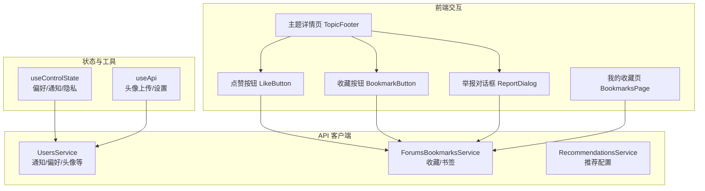

**图表来源**
- [src/modules/forum/components/Interaction/LikeButton.tsx](file://src/modules/forum/components/Interaction/LikeButton.tsx#L1-L117)
- [src/modules/forum/components/Interaction/BookmarkButton.tsx](file://src/modules/forum/components/Interaction/BookmarkButton.tsx#L1-L96)
- [src/modules/forum/components/Interaction/ReportDialog.tsx](file://src/modules/forum/components/Interaction/ReportDialog.tsx#L1-L132)
- [src/modules/forum/pages/TopicDetail/components/TopicFooter.tsx](file://src/modules/forum/pages/TopicDetail/components/TopicFooter.tsx#L1-L34)
- [src/modules/forum/pages/BookmarksPage.tsx](file://src/modules/forum/pages/BookmarksPage.tsx#L1-L47)
- [src/api/services/ForumsBookmarksService.ts](file://src/api/services/ForumsBookmarksService.ts#L78-L101)
- [src/api/services/UsersService.ts](file://src/api/services/UsersService.ts#L279-L324)
- [src/modules/app/pages/Control/hooks/useControlState.ts](file://src/modules/app/pages/Control/hooks/useControlState.ts#L223-L396)
- [src/hooks/useApi.ts](file://src/hooks/useApi.ts#L227-L270)

**章节来源**
- [src/modules/forum/components/Interaction/LikeButton.tsx](file://src/modules/forum/components/Interaction/LikeButton.tsx#L1-L117)
- [src/modules/forum/components/Interaction/BookmarkButton.tsx](file://src/modules/forum/components/Interaction/BookmarkButton.tsx#L1-L96)
- [src/modules/forum/components/Interaction/ReportDialog.tsx](file://src/modules/forum/components/Interaction/ReportDialog.tsx#L1-L132)
- [src/modules/forum/pages/TopicDetail/components/TopicFooter.tsx](file://src/modules/forum/pages/TopicDetail/components/TopicFooter.tsx#L1-L34)
- [src/modules/forum/pages/BookmarksPage.tsx](file://src/modules/forum/pages/BookmarksPage.tsx#L1-L47)
- [src/api/services/ForumsBookmarksService.ts](file://src/api/services/ForumsBookmarksService.ts#L78-L101)
- [src/api/services/UsersService.ts](file://src/api/services/UsersService.ts#L279-L324)
- [src/modules/app/pages/Control/hooks/useControlState.ts](file://src/modules/app/pages/Control/hooks/useControlState.ts#L223-L396)
- [src/hooks/useApi.ts](file://src/hooks/useApi.ts#L227-L270)

## 核心组件
- 用户资料管理
  - 头像上传与设置：通过 useApi 的上传与设置流程，结合 UsersService 的头像接口完成。
  - 基本资料编辑：在 ProfileTab 中收集变更字段并调用更新接口。
- 关注与收藏
  - 收藏列表与切换：BookmarksPage 通过 ForumsBookmarksService.list 获取收藏列表；BookmarkButton 切换收藏状态并乐观更新。
- 点赞与互动
  - LikeButton 实现话题/帖子的点赞切换，支持图标模式与标准模式，包含动画与乐观更新。
  - 举报 ReportDialog 提供举报原因选择与描述输入，提交后提示反馈。
- 论坛主题/帖子/回复管理
  - 主题列表查询：useForumsTopicsQuery 封装分页与排序映射。
  - 帖子详情分页：UseTopicDetail 通过 TanStack Query 实现前后向分页与请求页码追踪。
- 通知与偏好设置
  - useControlState 在不同 Tab 下拉取/保存通知、偏好、隐私设置，支持乐观更新与回滚。
- 个性化推荐
  - RecommendationsService 提供推荐配置的增删改查；Admin 页面通过 useRecommendationsLogic 管理配置与表单。

**章节来源**
- [src/modules/app/pages/Control/components/tabs/ProfileTab.tsx](file://src/modules/app/pages/Control/components/tabs/ProfileTab.tsx#L30-L69)
- [src/hooks/useApi.ts](file://src/hooks/useApi.ts#L227-L270)
- [src/modules/forum/pages/BookmarksPage.tsx](file://src/modules/forum/pages/BookmarksPage.tsx#L1-L47)
- [src/modules/forum/components/Interaction/BookmarkButton.tsx](file://src/modules/forum/components/Interaction/BookmarkButton.tsx#L1-L96)
- [src/modules/forum/components/Interaction/LikeButton.tsx](file://src/modules/forum/components/Interaction/LikeButton.tsx#L1-L117)
- [src/modules/forum/components/Interaction/ReportDialog.tsx](file://src/modules/forum/components/Interaction/ReportDialog.tsx#L1-L132)
- [src/modules/forum/hooks/useForumsTopicsQuery.ts](file://src/modules/forum/hooks/useForumsTopicsQuery.ts#L88-L128)
- [src/modules/forum/pages/TopicDetail/hooks/UseTopicDetail.ts](file://src/modules/forum/pages/TopicDetail/hooks/UseTopicDetail.ts#L221-L260)
- [src/modules/app/pages/Control/hooks/useControlState.ts](file://src/modules/app/pages/Control/hooks/useControlState.ts#L223-L396)
- [src/api/services/RecommendationsService.ts](file://src/api/services/RecommendationsService.ts#L1-L29)

## 架构总览
用户交互服务采用“组件-服务-模型”的分层设计：
- 组件层：负责用户交互与状态展示（点赞、收藏、举报、主题/帖子列表）。
- 服务层：封装 API 请求（UsersService、ForumsBookmarksService、RecommendationsService）。
- 模型层：通过 OpenAPI 生成的数据模型统一数据结构（ForumTopic、ForumPost、RecommendationConfigDto 等）。
- 状态层：TanStack Query 管理远端状态，配合 hooks 实现乐观更新与错误回滚。

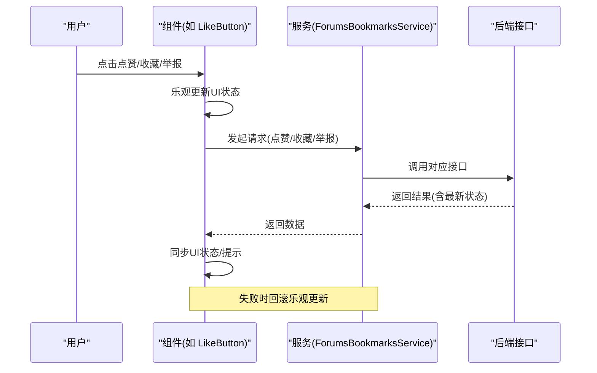

**图表来源**
- [src/modules/forum/components/Interaction/LikeButton.tsx](file://src/modules/forum/components/Interaction/LikeButton.tsx#L31-L61)
- [src/modules/forum/components/Interaction/BookmarkButton.tsx](file://src/modules/forum/components/Interaction/BookmarkButton.tsx#L26-L48)
- [src/modules/forum/components/Interaction/ReportDialog.tsx](file://src/modules/forum/components/Interaction/ReportDialog.tsx#L45-L66)
- [src/api/services/ForumsBookmarksService.ts](file://src/api/services/ForumsBookmarksService.ts#L78-L101)

## 详细组件分析

### 点赞功能（LikeButton）
- 功能要点
  - 支持话题/帖子两种类型的目标。
  - 乐观更新点赞状态与计数，失败时回滚。
  - 图标模式与标准模式，带点击动画。
- 数据流
  - 组件内部维护 liked 与 count，调用 ForumsLikesService.likesControllerToggle 切换。
  - 成功后同步后端返回的 liked 与 likeCount，触发外部 onUpdate。

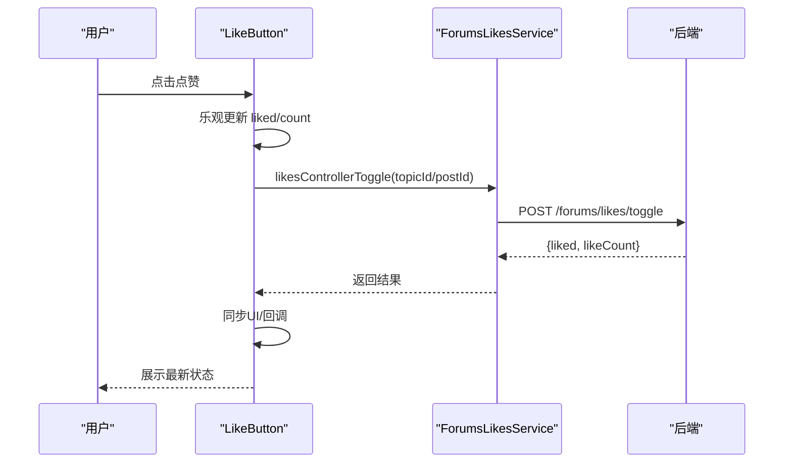

**图表来源**
- [src/modules/forum/components/Interaction/LikeButton.tsx](file://src/modules/forum/components/Interaction/LikeButton.tsx#L18-L61)
- [src/modules/forum/components/Interaction/LikeButton.tsx](file://src/modules/forum/components/Interaction/LikeButton.tsx#L42-L50)

**章节来源**
- [src/modules/forum/components/Interaction/LikeButton.tsx](file://src/modules/forum/components/Interaction/LikeButton.tsx#L1-L117)

### 收藏功能（BookmarkButton 与 BookmarksPage）
- 功能要点
  - BookmarkButton 切换收藏状态，支持图标模式与标准模式。
  - BookmarksPage 通过 ForumsBookmarksService.bookmarksControllerList 获取收藏列表。
- 数据流
  - 切换时乐观更新，失败回滚。
  - 列表页按分页参数查询，返回 items 与 total。

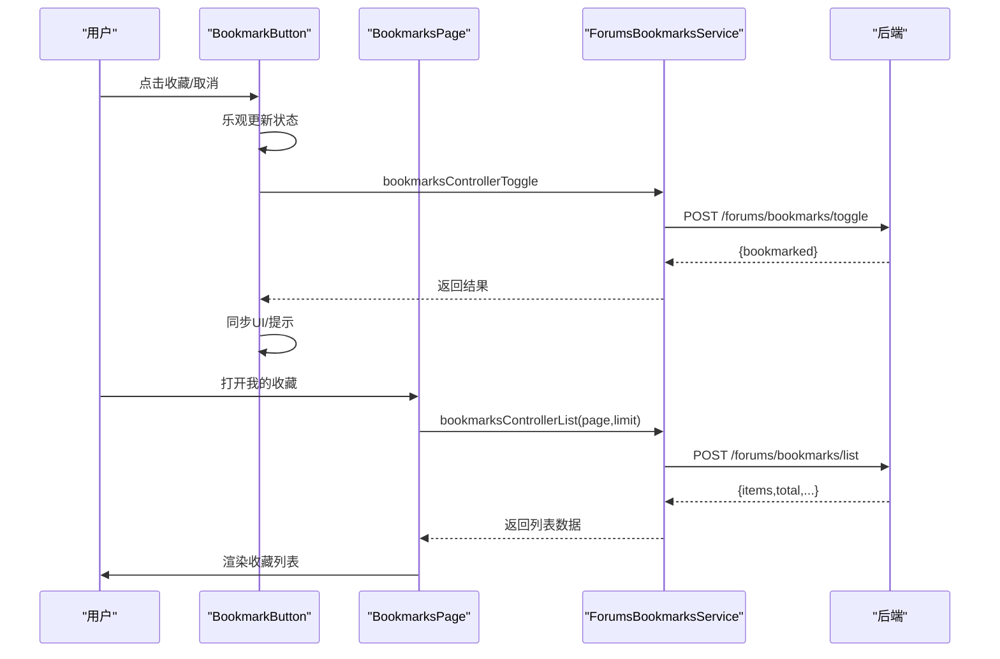

**图表来源**
- [src/modules/forum/components/Interaction/BookmarkButton.tsx](file://src/modules/forum/components/Interaction/BookmarkButton.tsx#L16-L48)
- [src/modules/forum/pages/BookmarksPage.tsx](file://src/modules/forum/pages/BookmarksPage.tsx#L16-L25)
- [src/api/services/ForumsBookmarksService.ts](file://src/api/services/ForumsBookmarksService.ts#L78-L101)

**章节来源**
- [src/modules/forum/components/Interaction/BookmarkButton.tsx](file://src/modules/forum/components/Interaction/BookmarkButton.tsx#L1-L96)
- [src/modules/forum/pages/BookmarksPage.tsx](file://src/modules/forum/pages/BookmarksPage.tsx#L1-L47)
- [src/api/services/ForumsBookmarksService.ts](file://src/api/services/ForumsBookmarksService.ts#L78-L101)

### 举报功能（ReportDialog）
- 功能要点
  - 提供举报原因下拉与可选描述。
  - 提交后弹出成功提示，关闭对话框并重置表单。
- 数据流
  - 选择 targetType/topicId/postId，构造 CreateReportDto 并调用 reportsControllerCreate。

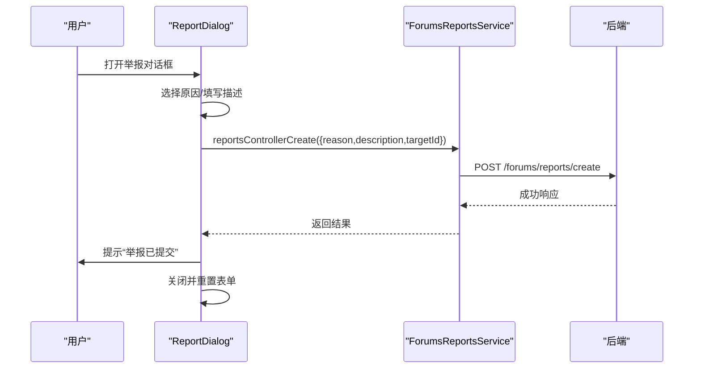

**图表来源**
- [src/modules/forum/components/Interaction/ReportDialog.tsx](file://src/modules/forum/components/Interaction/ReportDialog.tsx#L39-L66)

**章节来源**
- [src/modules/forum/components/Interaction/ReportDialog.tsx](file://src/modules/forum/components/Interaction/ReportDialog.tsx#L1-L132)

### 论坛主题/帖子/回复管理
- 主题列表查询
  - useForumsTopicsQuery 将 sortBy 映射为后端 sort 字段，使用 TanStack Query 分页与缓存。
- 帖子详情分页
  - UseTopicDetail 对后端 page 字段进行修正，使用 requestedPage 追踪真实页码，避免死循环。

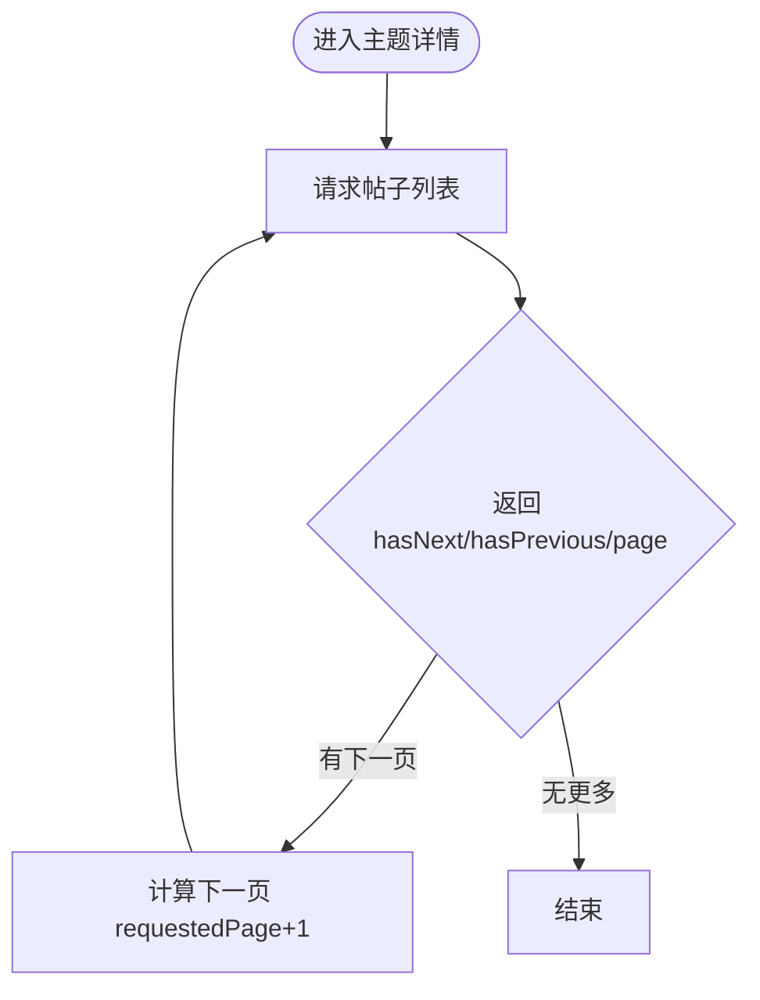

**图表来源**
- [src/modules/forum/pages/TopicDetail/hooks/UseTopicDetail.ts](file://src/modules/forum/pages/TopicDetail/hooks/UseTopicDetail.ts#L221-L260)

**章节来源**
- [src/modules/forum/hooks/useForumsTopicsQuery.ts](file://src/modules/forum/hooks/useForumsTopicsQuery.ts#L88-L128)
- [src/modules/forum/pages/TopicDetail/hooks/UseTopicDetail.ts](file://src/modules/forum/pages/TopicDetail/hooks/UseTopicDetail.ts#L221-L260)
- [src/api/models/PostPaginatedResponseDto.ts](file://src/api/models/PostPaginatedResponseDto.ts#L1-L32)

### 通知与偏好设置（useControlState）
- 功能要点
  - 在“通知/偏好/隐私”标签页分别拉取与保存设置。
  - 通知设置包含邮件通知、种子评论、私信、系统公告、下载完成、留种预警等。
  - 偏好设置包含主题、默认视图、成人内容显示、默认分类等。
- 数据流
  - usersNotificationsControllerGet 获取当前通知设置，usersNotificationsControllerUpdate 更新。
  - usersPreferencesControllerListCategories 获取分类列表，用于偏好设置中的默认分类选择。

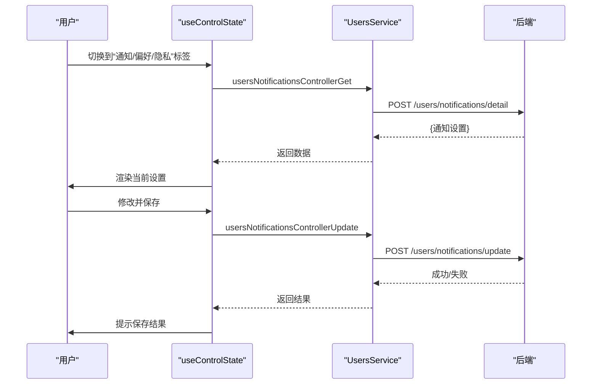

**图表来源**
- [src/modules/app/pages/Control/hooks/useControlState.ts](file://src/modules/app/pages/Control/hooks/useControlState.ts#L235-L256)
- [src/modules/app/pages/Control/hooks/useControlState.ts](file://src/modules/app/pages/Control/hooks/useControlState.ts#L348-L382)
- [src/api/services/UsersService.ts](file://src/api/services/UsersService.ts#L304-L322)

**章节来源**
- [src/modules/app/pages/Control/hooks/useControlState.ts](file://src/modules/app/pages/Control/hooks/useControlState.ts#L223-L396)
- [src/api/services/UsersService.ts](file://src/api/services/UsersService.ts#L279-L324)

### 用户资料管理（头像上传与设置）
- 功能要点
  - ProfileTab 中选择文件，useApi 执行上传与设置，最终更新本地头像。
- 数据流
  - 上传校验格式与大小，返回 dataUrl 与 attachmentId。
  - 调用 usersProfileControllerSetAvatar 设置头像，更新 profileData。

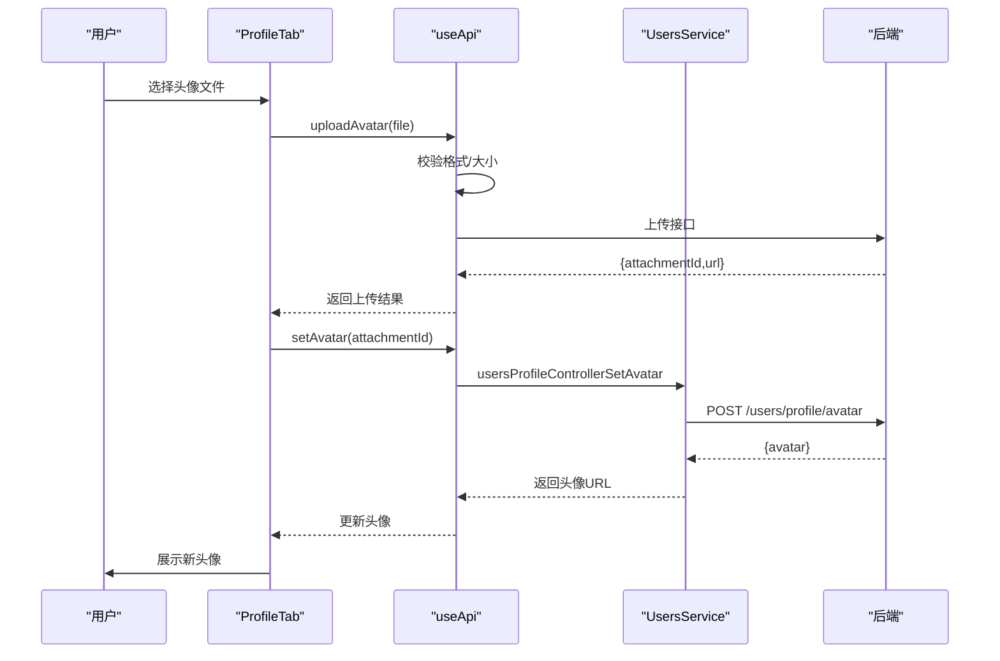

**图表来源**
- [src/modules/app/pages/Control/components/tabs/ProfileTab.tsx](file://src/modules/app/pages/Control/components/tabs/ProfileTab.tsx#L36-L51)
- [src/hooks/useApi.ts](file://src/hooks/useApi.ts#L236-L270)
- [src/api/services/UsersService.ts](file://src/api/services/UsersService.ts#L279-L299)

**章节来源**
- [src/modules/app/pages/Control/components/tabs/ProfileTab.tsx](file://src/modules/app/pages/Control/components/tabs/ProfileTab.tsx#L30-L69)
- [src/hooks/useApi.ts](file://src/hooks/useApi.ts#L227-L270)
- [src/api/models/SetUserAvatarDto.ts](file://src/api/models/SetUserAvatarDto.ts#L1-L11)

### 个性化推荐（RecommendationsService 与 Admin 页面）
- 功能要点
  - 支持创建/更新推荐配置，包含标题、关联 Tab、策略类型、时间范围、数量、排序权重、启用状态与样式。
  - Admin 页面提供表格、搜索、弹窗表单与删除确认。
- 数据流
  - RecommendationsService 封装 create/update/delete/list 等接口。
  - Admin 页面 useRecommendationsLogic 管理查询参数、表单与异步操作。

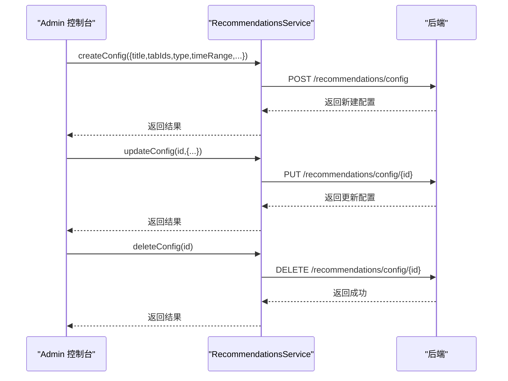

**图表来源**
- [src/api/services/RecommendationsService.ts](file://src/api/services/RecommendationsService.ts#L16-L29)
- [src/api/models/CreateRecommendationConfigDto.ts](file://src/api/models/CreateRecommendationConfigDto.ts#L1-L51)
- [src/api/models/UpdateRecommendationConfigDto.ts](file://src/api/models/UpdateRecommendationConfigDto.ts#L1-L51)
- [src/api/models/RecommendationConfigDto.ts](file://src/api/models/RecommendationConfigDto.ts#L1-L27)
- [src/modules/admin/pages/operations/interaction/RecommendationsPage/index.tsx](file://src/modules/admin/pages/operations/interaction/RecommendationsPage/index.tsx#L1-L49)
- [src/modules/admin/pages/operations/interaction/RecommendationsPage/useRecommendationsLogic.tsx](file://src/modules/admin/pages/operations/interaction/RecommendationsPage/useRecommendationsLogic.tsx#L1-L31)

**章节来源**
- [src/api/services/RecommendationsService.ts](file://src/api/services/RecommendationsService.ts#L1-L29)
- [src/api/models/CreateRecommendationConfigDto.ts](file://src/api/models/CreateRecommendationConfigDto.ts#L1-L51)
- [src/api/models/UpdateRecommendationConfigDto.ts](file://src/api/models/UpdateRecommendationConfigDto.ts#L1-L51)
- [src/api/models/RecommendationConfigDto.ts](file://src/api/models/RecommendationConfigDto.ts#L1-L27)
- [src/modules/admin/pages/operations/interaction/RecommendationsPage/index.tsx](file://src/modules/admin/pages/operations/interaction/RecommendationsPage/index.tsx#L1-L49)
- [src/modules/admin/pages/operations/interaction/RecommendationsPage/useRecommendationsLogic.tsx](file://src/modules/admin/pages/operations/interaction/RecommendationsPage/useRecommendationsLogic.tsx#L1-L31)
- [src/modules/admin/pages/operations/interaction/RecommendationsPage/types.ts](file://src/modules/admin/pages/operations/interaction/RecommendationsPage/types.ts#L1-L22)

### 感谢功能（电影详情页 Hero 组件）
- 功能要点
  - 电影详情页提供“感谢”按钮，支持切换状态并在 UI 上高亮。
- 数据流
  - 组件内部维护 hasThanked 状态，切换时更新 UI。

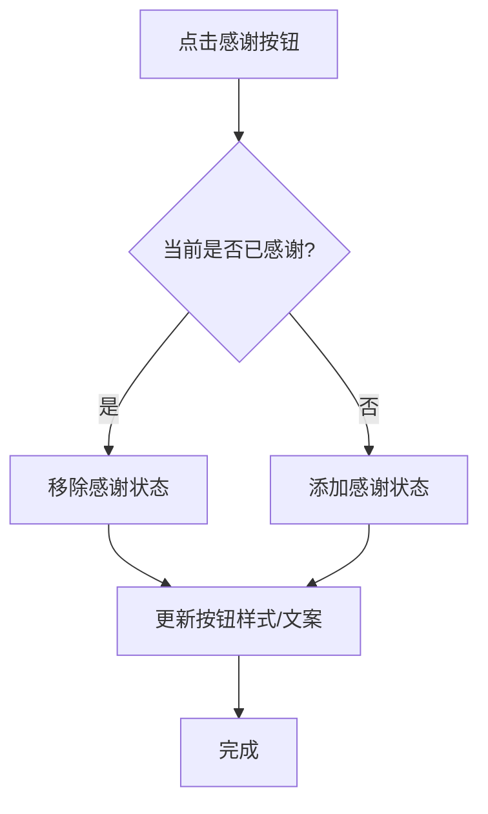

**图表来源**
- [src/modules/app/pages/MovieDetail/components/Hero.tsx](file://src/modules/app/pages/MovieDetail/components/Hero.tsx#L126-L137)

**章节来源**
- [src/modules/app/pages/MovieDetail/components/Hero.tsx](file://src/modules/app/pages/MovieDetail/components/Hero.tsx#L122-L148)

## 依赖分析
- 组件与服务
  - LikeButton/BookmarkButton/ReportDialog 依赖 ForumsBookmarksService 与对应的 API。
  - BookmarksPage 依赖 ForumsBookmarksService 的 list 接口。
  - useControlState 依赖 UsersService 的通知/偏好/头像接口。
  - RecommendationsService 依赖推荐配置接口。
- 数据模型
  - ForumTopic/ForumPost 定义主题与帖子字段。
  - PostPaginatedResponseDto 定义帖子分页响应结构。
  - BookmarkResponseDto 定义收藏状态响应。
- 状态管理
  - TanStack Query 负责缓存、分页与并发请求管理。

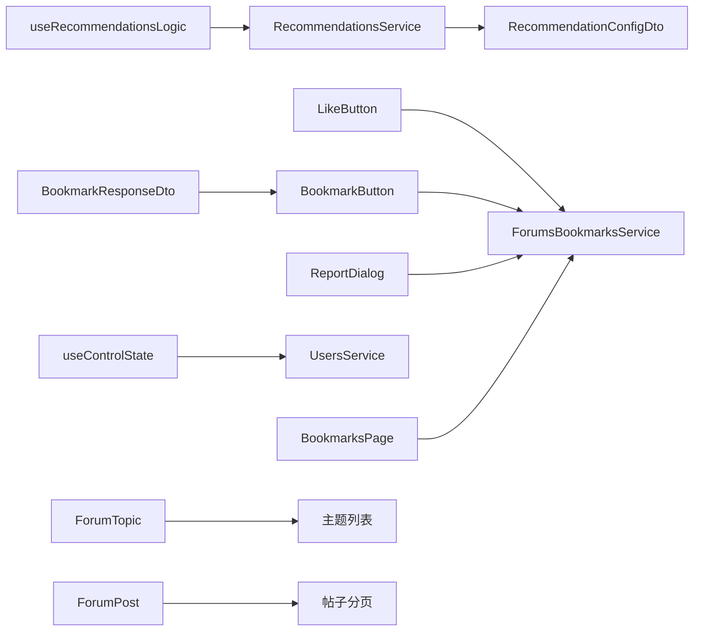

**图表来源**
- [src/modules/forum/components/Interaction/LikeButton.tsx](file://src/modules/forum/components/Interaction/LikeButton.tsx#L1-L117)
- [src/modules/forum/components/Interaction/BookmarkButton.tsx](file://src/modules/forum/components/Interaction/BookmarkButton.tsx#L1-L96)
- [src/modules/forum/components/Interaction/ReportDialog.tsx](file://src/modules/forum/components/Interaction/ReportDialog.tsx#L1-L132)
- [src/modules/forum/pages/BookmarksPage.tsx](file://src/modules/forum/pages/BookmarksPage.tsx#L1-L47)
- [src/modules/app/pages/Control/hooks/useControlState.ts](file://src/modules/app/pages/Control/hooks/useControlState.ts#L223-L396)
- [src/api/services/ForumsBookmarksService.ts](file://src/api/services/ForumsBookmarksService.ts#L78-L101)
- [src/api/services/UsersService.ts](file://src/api/services/UsersService.ts#L279-L324)
- [src/api/services/RecommendationsService.ts](file://src/api/services/RecommendationsService.ts#L1-L29)
- [src/api/models/ForumTopic.ts](file://src/api/models/ForumTopic.ts#L1-L60)
- [src/api/models/ForumPost.ts](file://src/api/models/ForumPost.ts#L1-L36)
- [src/api/models/PostPaginatedResponseDto.ts](file://src/api/models/PostPaginatedResponseDto.ts#L1-L32)
- [src/api/models/BookmarkResponseDto.ts](file://src/api/models/BookmarkResponseDto.ts#L1-L11)

**章节来源**
- [src/api/models/ForumTopic.ts](file://src/api/models/ForumTopic.ts#L1-L60)
- [src/api/models/ForumPost.ts](file://src/api/models/ForumPost.ts#L1-L36)
- [src/api/models/PostPaginatedResponseDto.ts](file://src/api/models/PostPaginatedResponseDto.ts#L1-L32)
- [src/api/models/BookmarkResponseDto.ts](file://src/api/models/BookmarkResponseDto.ts#L1-L11)

## 性能考虑
- 乐观更新与回滚
  - 点赞/收藏/举报均采用乐观更新，减少等待时间；失败时立即回滚，保证一致性。
- 分页与缓存
  - TanStack Query 的 staleTime 与 getNextPageParam/ getPreviousPageParam 优化分页体验，避免后端 page 字段不一致导致的死循环。
- 请求合并与去抖
  - 对频繁交互（如点赞）建议在组件层做防抖或批量提交，降低请求频率。
- 图片上传
  - useApi 对头像上传进行格式与大小校验，避免无效请求与后端压力。

[本节为通用指导，不直接分析具体文件]

## 故障排查指南
- 点赞/收藏/举报失败
  - 现象：点击后状态未变化或出现错误提示。
  - 排查：检查服务端返回与拦截器错误提示；确认网络与认证状态；组件会自动回滚乐观更新。
- 收藏列表为空
  - 现象：我的收藏页 items 为空。
  - 排查：确认分页参数与登录状态；检查 ForumsBookmarksService.bookmarksControllerList 返回。
- 帖子分页异常
  - 现象：翻页卡住或重复加载。
  - 排查：确认 UseTopicDetail 使用 requestedPage 跟踪真实页码，避免依赖后端 page 字段。
- 通知/偏好/隐私未生效
  - 现象：保存后未见更新。
  - 排查：确认 useControlState 的保存动作已执行；检查 UsersService 的对应接口返回；必要时刷新页面。

**章节来源**
- [src/modules/forum/components/Interaction/LikeButton.tsx](file://src/modules/forum/components/Interaction/LikeButton.tsx#L51-L56)
- [src/modules/forum/components/Interaction/BookmarkButton.tsx](file://src/modules/forum/components/Interaction/BookmarkButton.tsx#L42-L45)
- [src/modules/forum/pages/TopicDetail/hooks/UseTopicDetail.ts](file://src/modules/forum/pages/TopicDetail/hooks/UseTopicDetail.ts#L235-L240)
- [src/modules/app/pages/Control/hooks/useControlState.ts](file://src/modules/app/pages/Control/hooks/useControlState.ts#L348-L382)

## 结论
用户交互服务通过清晰的组件-服务-模型分层，结合 TanStack Query 的状态管理与乐观更新策略，实现了流畅的点赞、收藏、举报、通知与偏好设置体验。论坛主题/帖子/回复的分页与排序机制进一步提升了浏览效率。个性化推荐配置为后续社交图谱与内容分发提供了基础能力。建议在现有基础上持续完善错误提示与性能优化，并扩展社交图谱与推荐算法的集成。

[本节为总结性内容，不直接分析具体文件]

## 附录
- 开发建议
  - 为所有交互操作提供明确的加载态与错误提示。
  - 对高频请求进行节流/去抖处理。
  - 在 Admin 页面完善推荐配置的校验与默认值设置。
- 扩展方向
  - 社交图谱：基于关注/互动记录构建用户关系网络。
  - 行为追踪：埋点统计用户行为，为推荐与风控提供数据支撑。
  - 个性化推荐：结合用户画像与内容特征，实现多策略推荐。

[本节为通用指导，不直接分析具体文件]