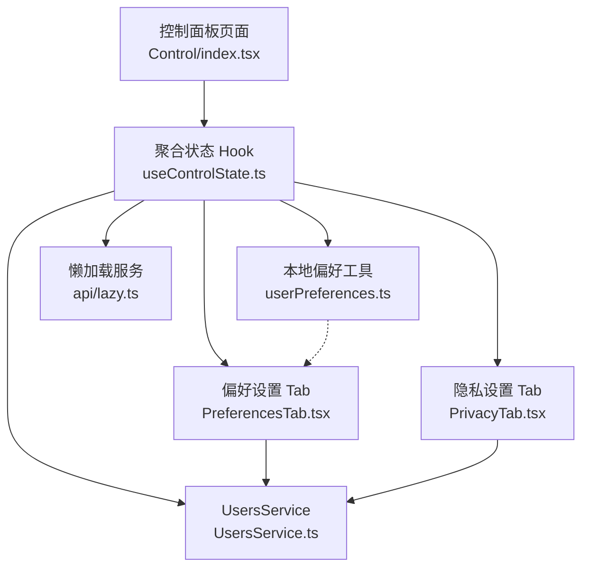
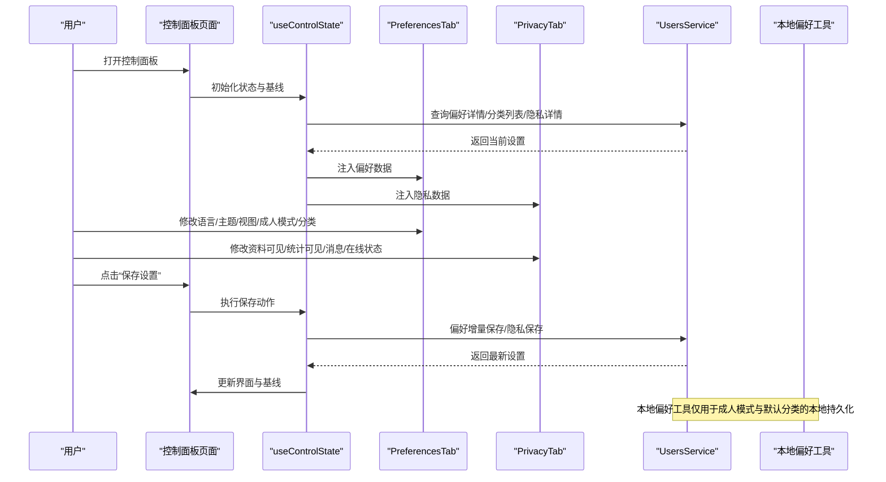
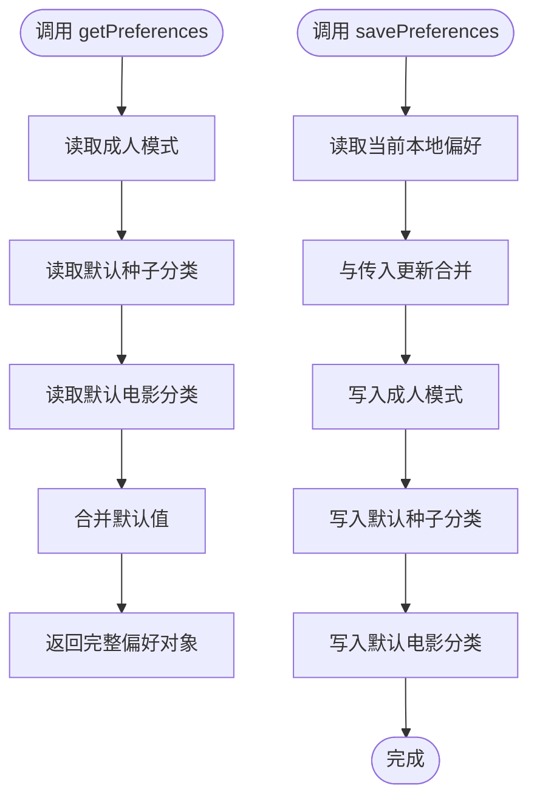
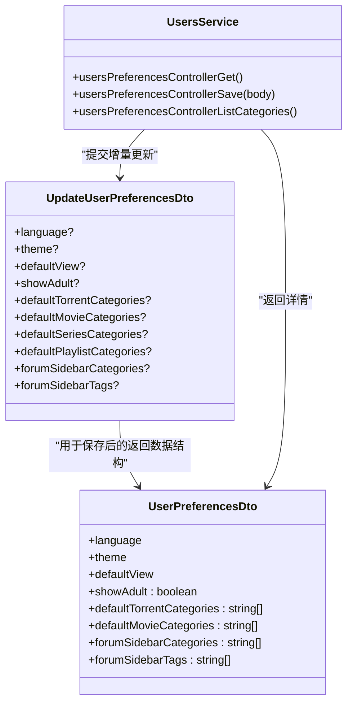
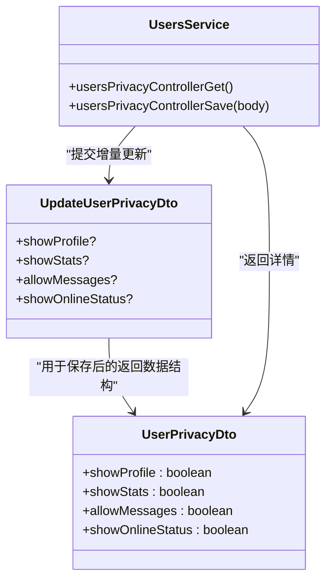
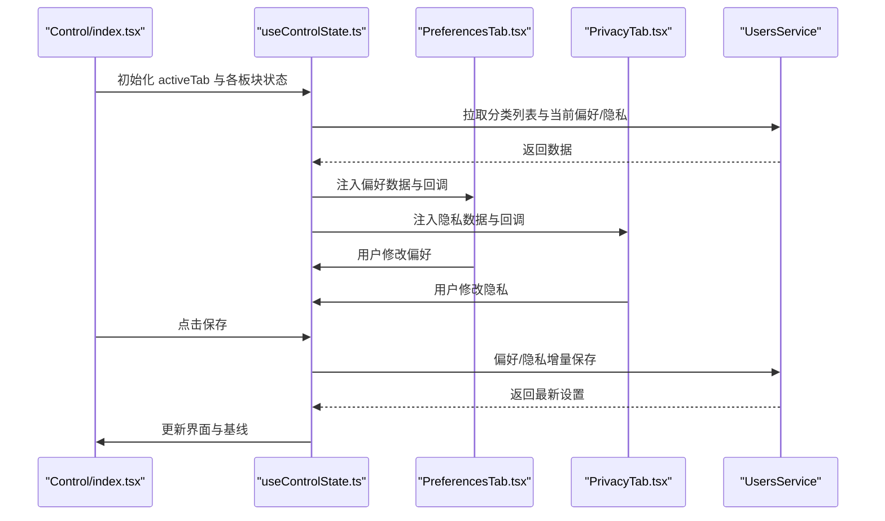
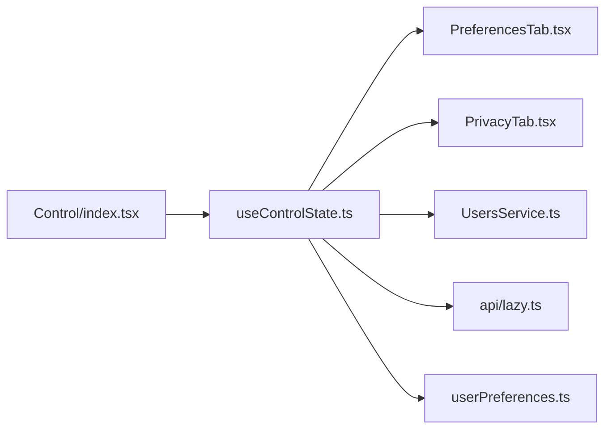

# 用户偏好设置与隐私控制

<cite>
**本文档引用的文件**
- [src/utils/userPreferences.ts](file://src/utils/userPreferences.ts)
- [src/api/models/UserPreferencesDto.ts](file://src/api/models/UserPreferencesDto.ts)
- [src/api/models/UpdateUserPreferencesDto.ts](file://src/api/models/UpdateUserPreferencesDto.ts)
- [src/api/models/UserPrivacyDto.ts](file://src/api/models/UserPrivacyDto.ts)
- [src/api/models/UpdateUserPrivacyDto.ts](file://src/api/models/UpdateUserPrivacyDto.ts)
- [src/api/services/UsersService.ts](file://src/api/services/UsersService.ts)
- [src/modules/app/pages/Control/index.tsx](file://src/modules/app/pages/Control/index.tsx)
- [src/modules/app/pages/Control/hooks/useControlState.ts](file://src/modules/app/pages/Control/hooks/useControlState.ts)
- [src/modules/app/pages/Control/components/tabs/PreferencesTab.tsx](file://src/modules/app/pages/Control/components/tabs/PreferencesTab.tsx)
- [src/modules/app/pages/Control/components/tabs/PrivacyTab.tsx](file://src/modules/app/pages/Control/components/tabs/PrivacyTab.tsx)
- [src/api/lazy.ts](file://src/api/lazy.ts)
- [src/hooks/useApi.ts](file://src/hooks/useApi.ts)
</cite>

## 目录
1. [简介](#简介)
2. [项目结构](#项目结构)
3. [核心组件](#核心组件)
4. [架构总览](#架构总览)
5. [详细组件分析](#详细组件分析)
6. [依赖关系分析](#依赖关系分析)
7. [性能考量](#性能考量)
8. [故障排查指南](#故障排查指南)
9. [结论](#结论)
10. [附录](#附录)

## 简介
本技术文档围绕用户偏好设置与隐私控制功能展开，覆盖以下方面：
- 用户偏好管理机制：显示设置（语言、主题、默认视图）、成人模式开关、默认种子/电影/剧集分类等个性化选项。
- 隐私设置实现：资料可见性、统计信息展示、消息接收、在线状态等。
- 增量保存机制与数据同步策略：本地临时存储与后端持久化的协同工作方式。
- 用户界面交互设计指南与最佳实践：表单校验、变更检测、保存按钮状态、错误提示等。
- 隐私保护与合规性考虑：最小化数据收集、本地存储边界、敏感字段处理。
- 配置示例与前端集成方案：如何在现有组件中扩展新的偏好项。

## 项目结构
该功能主要分布在以下模块与文件：
- 前端页面与状态管理：控制面板页面、聚合状态 Hook、各 Tab 组件。
- API 客户端与模型：用户偏好与隐私的 DTO、UsersService 服务方法。
- 本地偏好工具：用户偏好本地存储与增量保存。
- 懒加载服务：按需加载 UsersService，避免打包体积与循环依赖。

图表来源
- [src/modules/app/pages/Control/index.tsx](file://src/modules/app/pages/Control/index.tsx#L31-L170)
- [src/modules/app/pages/Control/hooks/useControlState.ts](file://src/modules/app/pages/Control/hooks/useControlState.ts#L28-L200)
- [src/modules/app/pages/Control/components/tabs/PreferencesTab.tsx](file://src/modules/app/pages/Control/components/tabs/PreferencesTab.tsx#L29-L270)
- [src/modules/app/pages/Control/components/tabs/PrivacyTab.tsx](file://src/modules/app/pages/Control/components/tabs/PrivacyTab.tsx#L11-L68)
- [src/utils/userPreferences.ts](file://src/utils/userPreferences.ts#L1-L103)
- [src/api/services/UsersService.ts](file://src/api/services/UsersService.ts#L227-L276)
- [src/api/lazy.ts](file://src/api/lazy.ts#L31-L34)

章节来源
- [src/modules/app/pages/Control/index.tsx](file://src/modules/app/pages/Control/index.tsx#L31-L170)
- [src/modules/app/pages/Control/hooks/useControlState.ts](file://src/modules/app/pages/Control/hooks/useControlState.ts#L28-L200)

## 核心组件
- 本地偏好工具：提供成人模式、默认种子分类、默认电影分类的本地持久化读写与增量保存能力，作为后端接口未就绪时的临时方案。
- 用户偏好模型：定义语言、主题、默认视图、成人模式以及各类别默认展示集合等字段。
- 用户隐私模型：定义资料可见、统计可见、消息接收、在线状态等字段。
- UsersService：提供偏好详情查询、偏好增量保存、分类列表查询、隐私详情查询、隐私保存等接口。
- 控制面板页面与状态 Hook：负责 Tab 切换、数据加载、变更检测、保存执行、错误处理与提示。
- 偏好与隐私 Tab 组件：提供可视化的表单控件与交互行为。

章节来源
- [src/utils/userPreferences.ts](file://src/utils/userPreferences.ts#L7-L103)
- [src/api/models/UserPreferencesDto.ts](file://src/api/models/UserPreferencesDto.ts#L5-L45)
- [src/api/models/UpdateUserPreferencesDto.ts](file://src/api/models/UpdateUserPreferencesDto.ts#L5-L47)
- [src/api/models/UserPrivacyDto.ts](file://src/api/models/UserPrivacyDto.ts#L5-L12)
- [src/api/models/UpdateUserPrivacyDto.ts](file://src/api/models/UpdateUserPrivacyDto.ts#L5-L12)
- [src/api/services/UsersService.ts](file://src/api/services/UsersService.ts#L227-L276)
- [src/modules/app/pages/Control/index.tsx](file://src/modules/app/pages/Control/index.tsx#L31-L170)
- [src/modules/app/pages/Control/components/tabs/PreferencesTab.tsx](file://src/modules/app/pages/Control/components/tabs/PreferencesTab.tsx#L29-L270)
- [src/modules/app/pages/Control/components/tabs/PrivacyTab.tsx](file://src/modules/app/pages/Control/components/tabs/PrivacyTab.tsx#L11-L68)

## 架构总览
用户偏好与隐私控制采用“本地临时存储 + 后端持久化”的双层架构：
- 本地层：通过本地工具读写成人模式与默认分类等偏好，保证即时可用与离线体验。
- 后端层：通过 UsersService 提供的接口进行偏好与隐私的查询与增量保存，确保跨设备一致性与服务端策略生效。

图表来源
- [src/modules/app/pages/Control/index.tsx](file://src/modules/app/pages/Control/index.tsx#L147-L163)
- [src/modules/app/pages/Control/hooks/useControlState.ts](file://src/modules/app/pages/Control/hooks/useControlState.ts#L114-L136)
- [src/modules/app/pages/Control/components/tabs/PreferencesTab.tsx](file://src/modules/app/pages/Control/components/tabs/PreferencesTab.tsx#L29-L270)
- [src/modules/app/pages/Control/components/tabs/PrivacyTab.tsx](file://src/modules/app/pages/Control/components/tabs/PrivacyTab.tsx#L11-L68)
- [src/api/services/UsersService.ts](file://src/api/services/UsersService.ts#L227-L276)
- [src/utils/userPreferences.ts](file://src/utils/userPreferences.ts#L76-L101)

## 详细组件分析

### 本地偏好工具（userPreferences.ts）
- 数据结构：包含成人模式开关、默认种子分类数组、默认电影分类数组。
- 读取策略：安全解析布尔值与字符串数组，支持多种输入格式，异常时回退到默认值。
- 写入策略：仅写入指定键，保证增量更新；布尔值统一序列化为字符串。
- 增量保存：基于当前本地状态与传入更新合并后写入，避免覆盖未修改字段。
- 适用范围：当前用于成人模式与两类默认分类的本地持久化，作为后端接口未就绪时的临时方案。

图表来源
- [src/utils/userPreferences.ts](file://src/utils/userPreferences.ts#L76-L101)

章节来源
- [src/utils/userPreferences.ts](file://src/utils/userPreferences.ts#L7-L103)

### 用户偏好模型与服务（UserPreferencesDto.ts、UpdateUserPreferencesDto.ts、UsersService.ts）
- 模型字段：语言（枚举）、主题（枚举）、默认视图（枚举）、成人模式、默认种子分类、默认电影分类、默认剧集分类、默认播放列表分类、论坛侧边栏分类与标签等。
- 服务方法：
  - 获取偏好详情：usersPreferencesControllerGet
  - 偏好增量保存：usersPreferencesControllerSave
  - 分类列表查询：usersPreferencesControllerListCategories
- 交互流程：页面进入偏好 Tab 时拉取分类列表与当前偏好；保存时构造增量更新体并提交。

图表来源
- [src/api/models/UserPreferencesDto.ts](file://src/api/models/UserPreferencesDto.ts#L5-L45)
- [src/api/models/UpdateUserPreferencesDto.ts](file://src/api/models/UpdateUserPreferencesDto.ts#L5-L47)
- [src/api/services/UsersService.ts](file://src/api/services/UsersService.ts#L227-L298)

章节来源
- [src/api/models/UserPreferencesDto.ts](file://src/api/models/UserPreferencesDto.ts#L5-L45)
- [src/api/models/UpdateUserPreferencesDto.ts](file://src/api/models/UpdateUserPreferencesDto.ts#L5-L47)
- [src/api/services/UsersService.ts](file://src/api/services/UsersService.ts#L227-L298)

### 用户隐私模型与服务（UserPrivacyDto.ts、UpdateUserPrivacyDto.ts、UsersService.ts）
- 模型字段：资料可见、统计可见、允许消息、在线状态。
- 服务方法：
  - 获取隐私详情：usersPrivacyControllerGet
  - 保存隐私：usersPrivacyControllerSave
- 交互流程：进入隐私 Tab 时拉取当前隐私设置；保存时提交增量更新。

图表来源
- [src/api/models/UserPrivacyDto.ts](file://src/api/models/UserPrivacyDto.ts#L5-L12)
- [src/api/models/UpdateUserPrivacyDto.ts](file://src/api/models/UpdateUserPrivacyDto.ts#L5-L12)
- [src/api/services/UsersService.ts](file://src/api/services/UsersService.ts#L197-L196)

章节来源
- [src/api/models/UserPrivacyDto.ts](file://src/api/models/UserPrivacyDto.ts#L5-L12)
- [src/api/models/UpdateUserPrivacyDto.ts](file://src/api/models/UpdateUserPrivacyDto.ts#L5-L12)
- [src/api/services/UsersService.ts](file://src/api/services/UsersService.ts#L197-L196)

### 控制面板页面与状态 Hook（Control/index.tsx、useControlState.ts）
- 页面职责：拼装左右布局、Tab 切换、保存区域、向各 Tab 下发状态与回调。
- 状态管理：
  - 偏好基线：记录每次加载/保存后的状态，用于变更检测与增量保存。
  - 分类数据：从字典与服务端聚合接口获取，支持回退与映射。
  - 保存逻辑：校验所选分类的有效性，构造增量更新体，调用服务端保存并更新本地状态。
- 隐私 Tab：进入时拉取隐私详情，保存时提交增量更新。

图表来源
- [src/modules/app/pages/Control/index.tsx](file://src/modules/app/pages/Control/index.tsx#L31-L170)
- [src/modules/app/pages/Control/hooks/useControlState.ts](file://src/modules/app/pages/Control/hooks/useControlState.ts#L114-L136)
- [src/modules/app/pages/Control/components/tabs/PreferencesTab.tsx](file://src/modules/app/pages/Control/components/tabs/PreferencesTab.tsx#L29-L270)
- [src/modules/app/pages/Control/components/tabs/PrivacyTab.tsx](file://src/modules/app/pages/Control/components/tabs/PrivacyTab.tsx#L11-L68)
- [src/api/services/UsersService.ts](file://src/api/services/UsersService.ts#L227-L276)

章节来源
- [src/modules/app/pages/Control/index.tsx](file://src/modules/app/pages/Control/index.tsx#L31-L170)
- [src/modules/app/pages/Control/hooks/useControlState.ts](file://src/modules/app/pages/Control/hooks/useControlState.ts#L114-L136)

### 偏好与隐私 Tab 组件（PreferencesTab.tsx、PrivacyTab.tsx）
- 偏好 Tab：
  - 提供语言、主题、默认视图的选择器。
  - 提供多选分类的交互面板，支持点击切换选中状态。
  - 通过 Switch 控件控制成人模式。
- 隐私 Tab：
  - 提供四个开关：公开资料、显示统计、允许私信、显示在线状态。
- 交互设计要点：清晰的说明文案、选中态视觉反馈、禁用态提示、保存按钮状态联动。

章节来源
- [src/modules/app/pages/Control/components/tabs/PreferencesTab.tsx](file://src/modules/app/pages/Control/components/tabs/PreferencesTab.tsx#L29-L270)
- [src/modules/app/pages/Control/components/tabs/PrivacyTab.tsx](file://src/modules/app/pages/Control/components/tabs/PrivacyTab.tsx#L11-L68)

## 依赖关系分析
- 组件耦合：
  - Control/index.tsx 作为容器，聚合 useControlState.ts 的状态与回调，并向各 Tab 下发。
  - useControlState.ts 依赖 UsersService 与懒加载服务，同时维护本地偏好工具与字典数据。
- 外部依赖：
  - UsersService 提供偏好与隐私的后端接口。
  - 懒加载服务 api/lazy.ts 用于按需导入 UsersService，避免循环依赖与打包体积问题。
- 潜在风险：
  - 本地偏好工具与服务端偏好存在差异时的同步策略需谨慎设计。
  - 分类列表与用户选择的映射需考虑字典缺失时的回退逻辑。

图表来源
- [src/modules/app/pages/Control/index.tsx](file://src/modules/app/pages/Control/index.tsx#L31-L170)
- [src/modules/app/pages/Control/hooks/useControlState.ts](file://src/modules/app/pages/Control/hooks/useControlState.ts#L28-L200)
- [src/api/services/UsersService.ts](file://src/api/services/UsersService.ts#L227-L276)
- [src/api/lazy.ts](file://src/api/lazy.ts#L31-L34)
- [src/utils/userPreferences.ts](file://src/utils/userPreferences.ts#L1-L103)

章节来源
- [src/modules/app/pages/Control/index.tsx](file://src/modules/app/pages/Control/index.tsx#L31-L170)
- [src/modules/app/pages/Control/hooks/useControlState.ts](file://src/modules/app/pages/Control/hooks/useControlState.ts#L28-L200)
- [src/api/services/UsersService.ts](file://src/api/services/UsersService.ts#L227-L276)
- [src/api/lazy.ts](file://src/api/lazy.ts#L31-L34)
- [src/utils/userPreferences.ts](file://src/utils/userPreferences.ts#L1-L103)

## 性能考量
- 懒加载服务：通过 api/lazy.ts 按需导入 UsersService，减少初始包体积与避免循环依赖。
- 并行加载：useControlState.ts 在进入偏好 Tab 时并行获取分类列表与当前偏好/隐私详情，提升首屏速度。
- 变更检测：通过基线状态对比判断是否有实际变更，避免无效请求。
- 本地缓存：本地偏好工具使用 localStorage，减少网络往返，但需注意与服务端状态的最终一致性。

## 故障排查指南
- 保存失败：
  - 检查 UsersService 的返回结构与错误码映射，确认网络请求是否成功。
  - 确认增量更新体字段类型与枚举值是否符合模型定义。
- 分类列表为空：
  - 确认字典数据是否加载成功，若失败则回退到空列表并提示用户稍后重试。
  - 检查服务端分类列表接口是否返回有效数据。
- 本地偏好不同步：
  - 确认本地偏好工具的键名与写入逻辑，避免异常捕获导致写入失败。
  - 对比基线状态与服务端返回，确保保存后正确更新本地状态。

章节来源
- [src/modules/app/pages/Control/hooks/useControlState.ts](file://src/modules/app/pages/Control/hooks/useControlState.ts#L114-L136)
- [src/api/services/UsersService.ts](file://src/api/services/UsersService.ts#L227-L276)
- [src/utils/userPreferences.ts](file://src/utils/userPreferences.ts#L76-L101)

## 结论
本功能通过本地偏好工具与 UsersService 的协同，实现了用户偏好与隐私设置的本地即时体验与服务端持久化。控制面板页面与状态 Hook 提供了完善的变更检测、增量保存与错误处理机制。建议后续完善本地与服务端状态的冲突解决策略，并持续优化分类列表的加载与回退逻辑，以提升用户体验与系统稳定性。

## 附录

### 增量保存机制与数据同步策略
- 增量保存：
  - 偏好：仅提交发生变化的字段，避免覆盖未修改项。
  - 隐私：同上，仅提交变化项。
- 数据同步：
  - 保存成功后，以服务端返回为准更新本地状态与基线。
  - 若本地存在未提交的变更，应提示用户或自动合并。
- 本地与服务端差异：
  - 当本地与服务端状态不一致时，以服务端为准；本地仅作为临时方案。

章节来源
- [src/modules/app/pages/Control/hooks/useControlState.ts](file://src/modules/app/pages/Control/hooks/useControlState.ts#L393-L413)
- [src/api/services/UsersService.ts](file://src/api/services/UsersService.ts#L254-L276)

### 隐私保护与合规性考虑
- 最小化原则：仅收集必要字段，避免过度采集用户信息。
- 明示同意：在隐私设置中明确告知用户哪些信息会被展示或共享。
- 数据一致性：确保本地与服务端状态一致，防止因本地缓存导致的隐私泄露。
- 错误处理：对异常情况提供友好的错误提示，避免泄露内部状态。

章节来源
- [src/modules/app/pages/Control/components/tabs/PrivacyTab.tsx](file://src/modules/app/pages/Control/components/tabs/PrivacyTab.tsx#L11-L68)
- [src/api/models/UserPrivacyDto.ts](file://src/api/models/UserPrivacyDto.ts#L5-L12)

### 配置示例与前端集成方案
- 新增偏好项步骤：
  - 在模型中新增字段（如枚举或字符串数组）。
  - 在 UsersService 中增加对应的 GET/SAVE 方法。
  - 在 useControlState.ts 中维护状态与基线，并在保存时纳入增量更新体。
  - 在对应 Tab 组件中添加表单控件与交互逻辑。
  - 如需本地持久化，可在 userPreferences.ts 中新增键名与读写函数。
- 示例路径：
  - 偏好模型定义：[src/api/models/UpdateUserPreferencesDto.ts](file://src/api/models/UpdateUserPreferencesDto.ts#L5-L47)
  - 隐私模型定义：[src/api/models/UpdateUserPrivacyDto.ts](file://src/api/models/UpdateUserPrivacyDto.ts#L5-L12)
  - 服务方法：[src/api/services/UsersService.ts](file://src/api/services/UsersService.ts#L227-L276)
  - 状态与保存逻辑：[src/modules/app/pages/Control/hooks/useControlState.ts](file://src/modules/app/pages/Control/hooks/useControlState.ts#L393-L446)
  - 懒加载服务：[src/api/lazy.ts](file://src/api/lazy.ts#L31-L34)