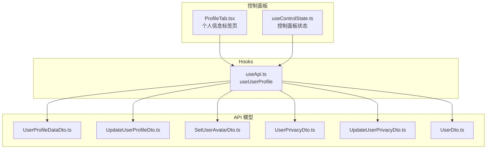
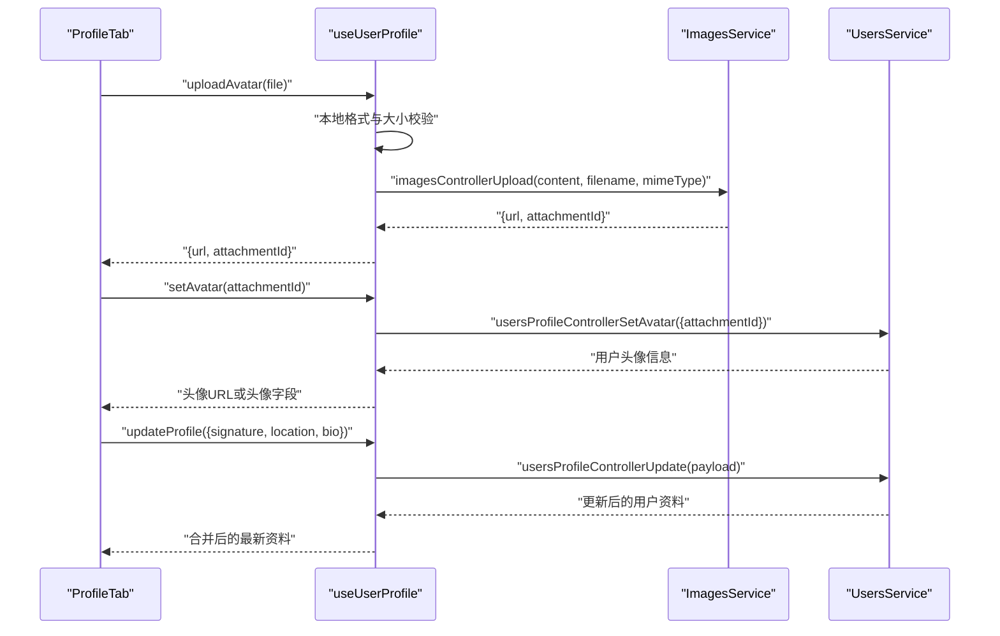
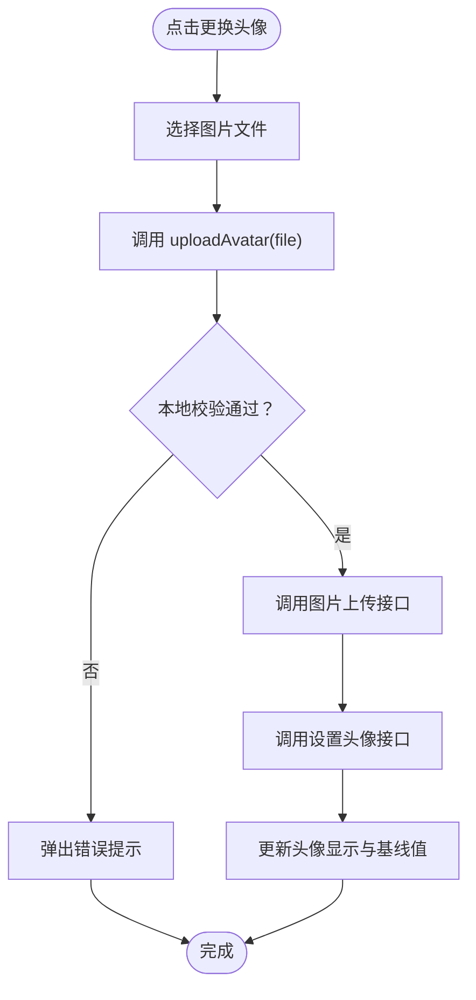
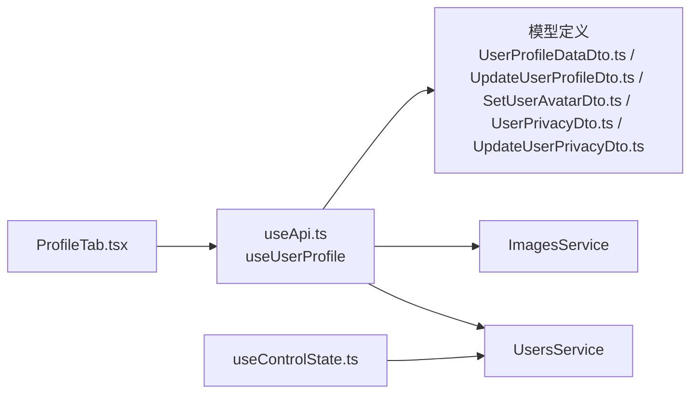
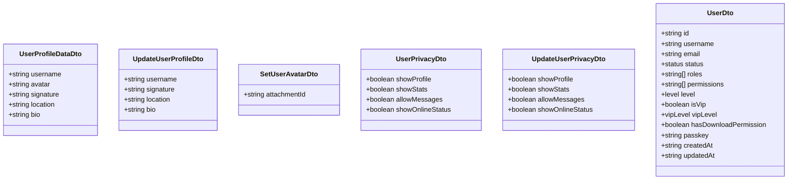

# 用户资料管理

<cite>
**本文引用的文件**
- [ProfileTab.tsx](file://src/modules/app/pages/Control/components/tabs/ProfileTab.tsx)
- [useApi.ts](file://src/hooks/useApi.ts)
- [UserProfileDataDto.ts](file://src/api/models/UserProfileDataDto.ts)
- [UpdateUserProfileDto.ts](file://src/api/models/UpdateUserProfileDto.ts)
- [SetUserAvatarDto.ts](file://src/api/models/SetUserAvatarDto.ts)
- [UserPrivacyDto.ts](file://src/api/models/UserPrivacyDto.ts)
- [UpdateUserPrivacyDto.ts](file://src/api/models/UpdateUserPrivacyDto.ts)
- [UserDto.ts](file://src/api/models/UserDto.ts)
- [useControlState.ts](file://src/modules/app/pages/Control/hooks/useControlState.ts)
</cite>

## 目录
1. [引言](#引言)
2. [项目结构](#项目结构)
3. [核心组件](#核心组件)
4. [架构总览](#架构总览)
5. [详细组件分析](#详细组件分析)
6. [依赖关系分析](#依赖关系分析)
7. [性能考量](#性能考量)
8. [故障排查指南](#故障排查指南)
9. [结论](#结论)
10. [附录](#附录)

## 引言
本技术文档聚焦于用户资料管理功能，涵盖用户个人信息的查看与更新、头像上传与设置、隐私设置以及相关数据模型与最佳实践。文档从代码层面解析实现机制，提供流程图与时序图帮助理解，并给出前端组件集成与 API 使用建议。

## 项目结构
用户资料管理主要分布在以下位置：
- 控制面板页面中的“个人信息”标签页负责渲染与编辑用户资料与头像
- 自定义 Hook useUserProfile 封装了资料更新、头像上传与设置的业务逻辑
- OpenAPI 模型定义了用户资料、头像设置、隐私设置等数据结构
- 控制面板状态 Hook useControlState 负责初始化与加载用户资料

图表来源
- [ProfileTab.tsx](file://src/modules/app/pages/Control/components/tabs/ProfileTab.tsx#L1-L155)
- [useApi.ts](file://src/hooks/useApi.ts#L200-L312)
- [UserProfileDataDto.ts](file://src/api/models/UserProfileDataDto.ts#L1-L27)
- [UpdateUserProfileDto.ts](file://src/api/models/UpdateUserProfileDto.ts#L1-L23)
- [SetUserAvatarDto.ts](file://src/api/models/SetUserAvatarDto.ts#L1-L12)
- [UserPrivacyDto.ts](file://src/api/models/UserPrivacyDto.ts#L1-L12)
- [UpdateUserPrivacyDto.ts](file://src/api/models/UpdateUserPrivacyDto.ts#L1-L12)
- [UserDto.ts](file://src/api/models/UserDto.ts#L1-L108)
- [useControlState.ts](file://src/modules/app/pages/Control/hooks/useControlState.ts#L288-L316)

章节来源
- [ProfileTab.tsx](file://src/modules/app/pages/Control/components/tabs/ProfileTab.tsx#L1-L155)
- [useApi.ts](file://src/hooks/useApi.ts#L200-L312)
- [UserProfileDataDto.ts](file://src/api/models/UserProfileDataDto.ts#L1-L27)
- [UpdateUserProfileDto.ts](file://src/api/models/UpdateUserProfileDto.ts#L1-L23)
- [SetUserAvatarDto.ts](file://src/api/models/SetUserAvatarDto.ts#L1-L12)
- [UserPrivacyDto.ts](file://src/api/models/UserPrivacyDto.ts#L1-L12)
- [UpdateUserPrivacyDto.ts](file://src/api/models/UpdateUserPrivacyDto.ts#L1-L12)
- [UserDto.ts](file://src/api/models/UserDto.ts#L1-L108)
- [useControlState.ts](file://src/modules/app/pages/Control/hooks/useControlState.ts#L288-L316)

## 核心组件
- ProfileTab：负责渲染头像、个性签名、所在地、个人简介等字段，提供头像选择与上传、保存更改等交互
- useUserProfile：封装资料更新、头像上传与设置的异步逻辑，包含本地校验与错误提取
- OpenAPI 模型：定义用户资料、头像设置、隐私设置的数据结构与约束
- useControlState：在控制面板中加载并初始化用户资料，用于 ProfileTab 的数据源

章节来源
- [ProfileTab.tsx](file://src/modules/app/pages/Control/components/tabs/ProfileTab.tsx#L1-L155)
- [useApi.ts](file://src/hooks/useApi.ts#L200-L312)
- [UserProfileDataDto.ts](file://src/api/models/UserProfileDataDto.ts#L1-L27)
- [UpdateUserProfileDto.ts](file://src/api/models/UpdateUserProfileDto.ts#L1-L23)
- [SetUserAvatarDto.ts](file://src/api/models/SetUserAvatarDto.ts#L1-L12)
- [UserPrivacyDto.ts](file://src/api/models/UserPrivacyDto.ts#L1-L12)
- [UpdateUserPrivacyDto.ts](file://src/api/models/UpdateUserPrivacyDto.ts#L1-L12)
- [UserDto.ts](file://src/api/models/UserDto.ts#L1-L108)
- [useControlState.ts](file://src/modules/app/pages/Control/hooks/useControlState.ts#L288-L316)

## 架构总览
用户资料管理采用“视图组件 + 自定义 Hook + OpenAPI 模型”的分层设计：
- 视图层：ProfileTab 负责 UI 渲染与用户输入收集
- 逻辑层：useUserProfile 提供上传头像、设置头像、更新资料等方法，并进行本地校验与错误处理
- 数据层：OpenAPI 模型定义请求与响应的数据结构；useControlState 在进入控制面板时加载初始资料

图表来源
- [ProfileTab.tsx](file://src/modules/app/pages/Control/components/tabs/ProfileTab.tsx#L32-L79)
- [useApi.ts](file://src/hooks/useApi.ts#L216-L302)

## 详细组件分析

### 组件：ProfileTab（个人信息标签页）
职责与行为
- 渲染头像、个性签名、所在地、个人简介等字段
- 支持头像选择与上传，调用 useUserProfile 的 uploadAvatar 与 setAvatar
- 支持保存更改，仅提交有变化的字段，调用 useUserProfile 的 updateProfile
- 使用 baselineRef 记录基线值，用于判断是否需要保存与禁用保存按钮

关键交互流程（头像设置）

图表来源
- [ProfileTab.tsx](file://src/modules/app/pages/Control/components/tabs/ProfileTab.tsx#L32-L51)
- [useApi.ts](file://src/hooks/useApi.ts#L258-L302)

章节来源
- [ProfileTab.tsx](file://src/modules/app/pages/Control/components/tabs/ProfileTab.tsx#L1-L155)

### 组件：useUserProfile（用户资料与头像 Hook）
职责与行为
- updateProfile：对传入的字段集合发起更新请求，返回合并后的最新资料
- setAvatar：使用附件 ID 设置头像
- uploadAvatar：本地校验图片格式与大小，将图片转为 DataURL 并调用图片上传接口，返回 URL 与附件 ID

错误处理与加载状态
- 统一通过 extractErrorMessage 提取可读错误消息
- isLoading 与 error 状态在 Hook 内部维护，供调用方渲染

章节来源
- [useApi.ts](file://src/hooks/useApi.ts#L200-L312)

### 数据模型：用户资料与隐私
用户资料模型
- UserProfileDataDto：用户名、头像 URL、个性签名、所在地、个人简介
- UpdateUserProfileDto：更新时允许的字段与长度限制（如个性签名不超过 100 字符）

头像设置模型
- SetUserAvatarDto：设置头像所需的附件 ID

隐私设置模型
- UserPrivacyDto：当前用户的隐私配置（是否展示资料、统计、允许私信、在线状态）
- UpdateUserPrivacyDto：更新隐私配置的可选字段

章节来源
- [UserProfileDataDto.ts](file://src/api/models/UserProfileDataDto.ts#L1-L27)
- [UpdateUserProfileDto.ts](file://src/api/models/UpdateUserProfileDto.ts#L1-L23)
- [SetUserAvatarDto.ts](file://src/api/models/SetUserAvatarDto.ts#L1-L12)
- [UserPrivacyDto.ts](file://src/api/models/UserPrivacyDto.ts#L1-L12)
- [UpdateUserPrivacyDto.ts](file://src/api/models/UpdateUserPrivacyDto.ts#L1-L12)

### 控制面板状态：useControlState
职责与行为
- 在进入控制面板时加载用户基础资料与个人资料，填充 ProfileTab 的初始值
- 通过 UsersService 获取用户偏好与隐私设置，用于其他标签页

章节来源
- [useControlState.ts](file://src/modules/app/pages/Control/hooks/useControlState.ts#L288-L316)

## 依赖关系分析
- ProfileTab 依赖 useUserProfile 完成头像上传与设置、资料更新
- useUserProfile 依赖 UsersService 与 ImagesService 完成头像设置与图片上传
- useControlState 依赖 UsersService 加载用户资料与偏好
- OpenAPI 模型为上述组件提供类型与约束

图表来源
- [ProfileTab.tsx](file://src/modules/app/pages/Control/components/tabs/ProfileTab.tsx#L1-L155)
- [useApi.ts](file://src/hooks/useApi.ts#L200-L312)
- [useControlState.ts](file://src/modules/app/pages/Control/hooks/useControlState.ts#L288-L316)
- [UserProfileDataDto.ts](file://src/api/models/UserProfileDataDto.ts#L1-L27)
- [UpdateUserProfileDto.ts](file://src/api/models/UpdateUserProfileDto.ts#L1-L23)
- [SetUserAvatarDto.ts](file://src/api/models/SetUserAvatarDto.ts#L1-L12)
- [UserPrivacyDto.ts](file://src/api/models/UserPrivacyDto.ts#L1-L12)
- [UpdateUserPrivacyDto.ts](file://src/api/models/UpdateUserPrivacyDto.ts#L1-L12)

章节来源
- [ProfileTab.tsx](file://src/modules/app/pages/Control/components/tabs/ProfileTab.tsx#L1-L155)
- [useApi.ts](file://src/hooks/useApi.ts#L200-L312)
- [useControlState.ts](file://src/modules/app/pages/Control/hooks/useControlState.ts#L288-L316)
- [UserProfileDataDto.ts](file://src/api/models/UserProfileDataDto.ts#L1-L27)
- [UpdateUserProfileDto.ts](file://src/api/models/UpdateUserProfileDto.ts#L1-L23)
- [SetUserAvatarDto.ts](file://src/api/models/SetUserAvatarDto.ts#L1-L12)
- [UserPrivacyDto.ts](file://src/api/models/UserPrivacyDto.ts#L1-L12)
- [UpdateUserPrivacyDto.ts](file://src/api/models/UpdateUserPrivacyDto.ts#L1-L12)

## 性能考量
- 本地头像校验：在上传前进行格式与大小校验，减少无效网络请求
- 变更检测：仅提交发生变化的字段，降低网络负载与数据库写入压力
- 加载状态：isLoading 与错误状态在 Hook 内统一管理，避免重复渲染与闪烁
- URL 绝对化：对返回的头像 URL 进行绝对化处理，确保跨环境一致性

## 故障排查指南
常见问题与定位
- 头像上传失败：检查文件类型与大小是否满足要求；确认图片上传接口返回的 URL 与附件 ID 是否存在
- 设置头像失败：确认附件 ID 是否正确传递至设置头像接口
- 更新资料失败：检查字段是否超出模型限制（如签名长度、简介长度等）；确认网络请求是否被拦截
- 错误信息提取：统一通过 extractErrorMessage 获取可读错误消息，便于前端提示与日志记录

章节来源
- [useApi.ts](file://src/hooks/useApi.ts#L258-L302)
- [ProfileTab.tsx](file://src/modules/app/pages/Control/components/tabs/ProfileTab.tsx#L36-L51)

## 结论
用户资料管理功能通过清晰的分层设计实现了“头像上传与设置、资料更新、隐私配置”的完整闭环。前端组件与自定义 Hook 解耦了 UI 与业务逻辑，OpenAPI 模型提供了强类型的约束与可维护性。结合变更检测与本地校验，系统在易用性与性能方面均具备良好表现。

## 附录

### 数据模型类图

图表来源
- [UserProfileDataDto.ts](file://src/api/models/UserProfileDataDto.ts#L1-L27)
- [UpdateUserProfileDto.ts](file://src/api/models/UpdateUserProfileDto.ts#L1-L23)
- [SetUserAvatarDto.ts](file://src/api/models/SetUserAvatarDto.ts#L1-L12)
- [UserPrivacyDto.ts](file://src/api/models/UserPrivacyDto.ts#L1-L12)
- [UpdateUserPrivacyDto.ts](file://src/api/models/UpdateUserPrivacyDto.ts#L1-L12)
- [UserDto.ts](file://src/api/models/UserDto.ts#L1-L108)

### API 调用示例（路径指引）
- 头像上传与设置
  - 上传图片：调用图片上传接口，返回 {url, attachmentId}
  - 设置头像：调用设置头像接口，传入 {attachmentId}
- 更新资料
  - 调用资料更新接口，传入 {signature, location, bio} 等字段
- 获取用户资料
  - 通过控制面板状态 Hook 加载用户基础资料与个人资料

章节来源
- [ProfileTab.tsx](file://src/modules/app/pages/Control/components/tabs/ProfileTab.tsx#L36-L79)
- [useApi.ts](file://src/hooks/useApi.ts#L216-L302)
- [useControlState.ts](file://src/modules/app/pages/Control/hooks/useControlState.ts#L288-L316)