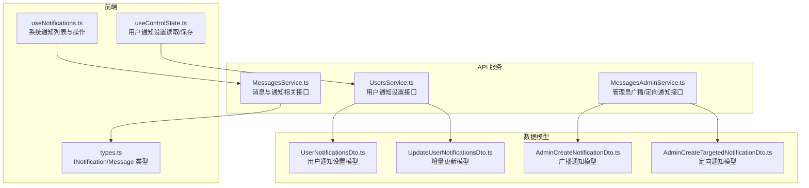
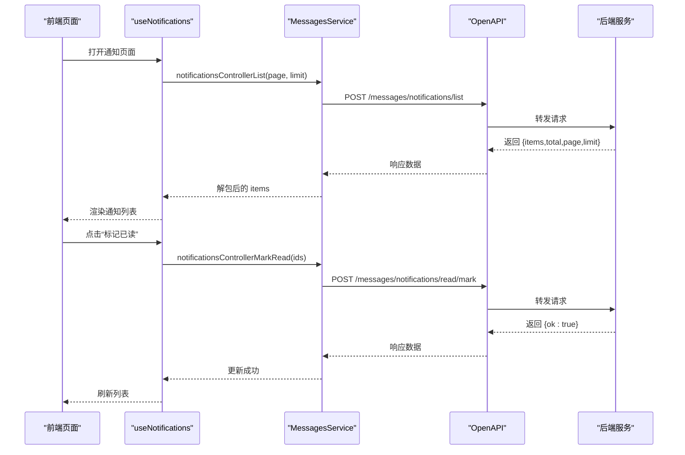
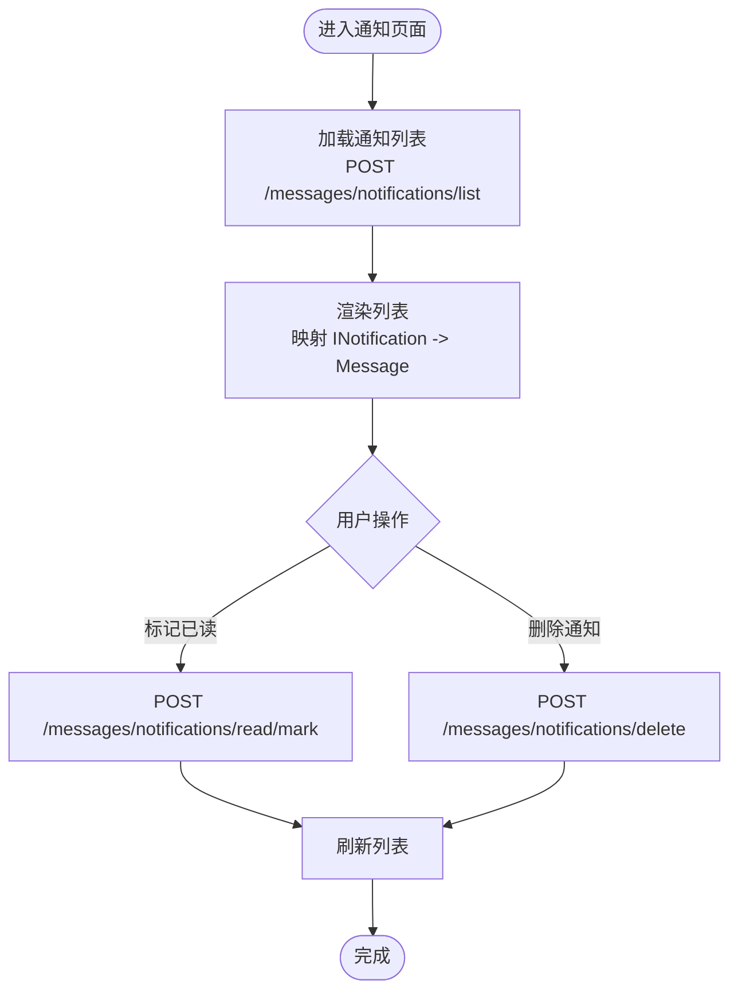
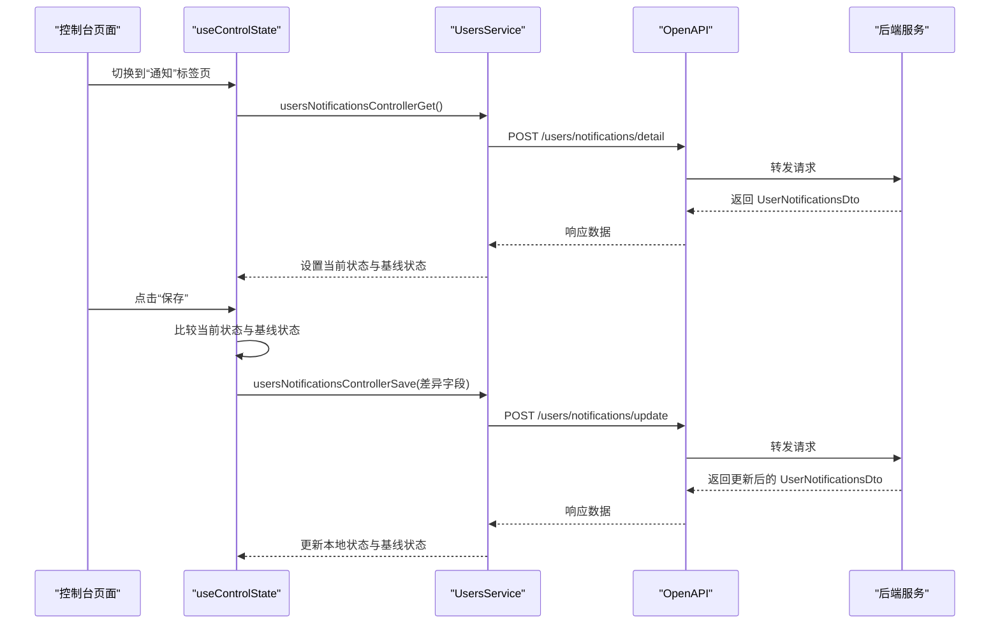
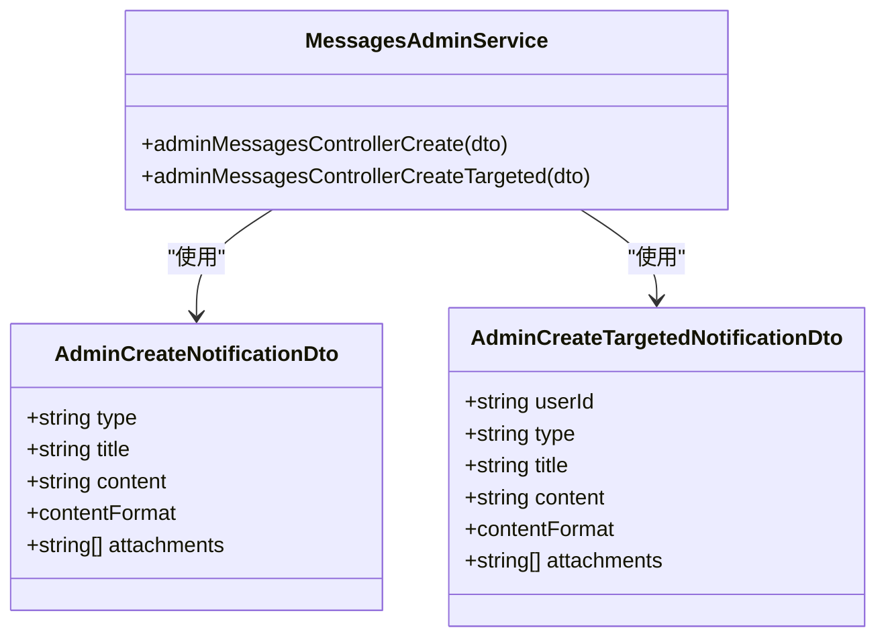
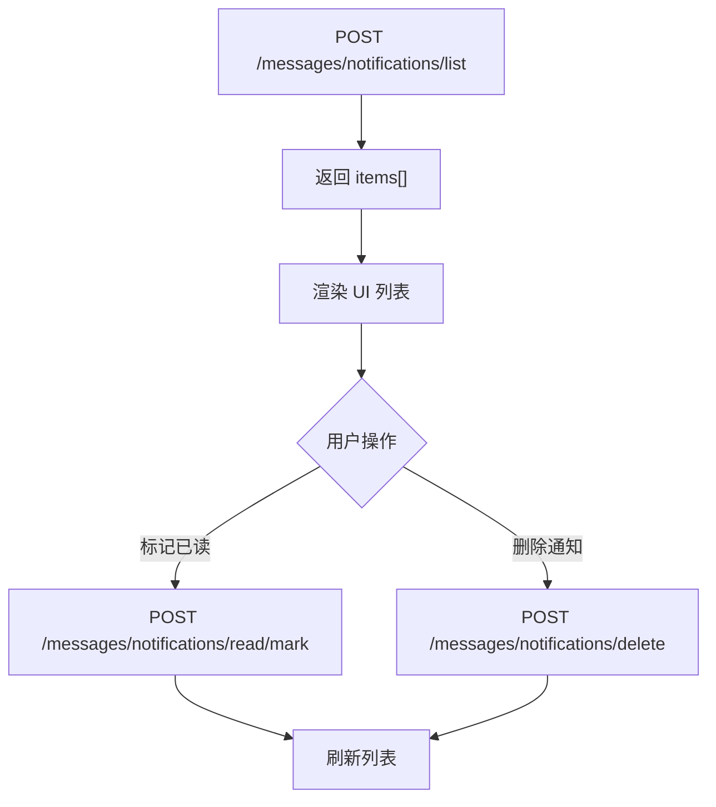
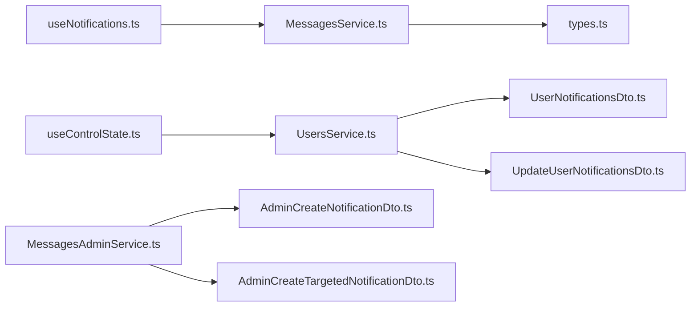

# 用户通知系统

<cite>
**本文引用的文件**
- [useNotifications.ts](file://src/modules/app/pages/Messages/hooks/useNotifications.ts)
- [useControlState.ts](file://src/modules/app/pages/Control/hooks/useControlState.ts)
- [MessagesService.ts](file://src/api/services/MessagesService.ts)
- [UsersService.ts](file://src/api/services/UsersService.ts)
- [MessagesAdminService.ts](file://src/api/services/MessagesAdminService.ts)
- [UserNotificationsDto.ts](file://src/api/models/UserNotificationsDto.ts)
- [UpdateUserNotificationsDto.ts](file://src/api/models/UpdateUserNotificationsDto.ts)
- [AdminCreateNotificationDto.ts](file://src/api/models/AdminCreateNotificationDto.ts)
- [AdminCreateTargetedNotificationDto.ts](file://src/api/models/AdminCreateTargetedNotificationDto.ts)
- [types.ts](file://src/modules/app/pages/Messages/types/types.ts)
</cite>

## 目录
1. [简介](#简介)
2. [项目结构](#项目结构)
3. [核心组件](#核心组件)
4. [架构总览](#架构总览)
5. [详细组件分析](#详细组件分析)
6. [依赖关系分析](#依赖关系分析)
7. [性能考量](#性能考量)
8. [故障排查指南](#故障排查指南)
9. [结论](#结论)
10. [附录](#附录)

## 简介
本文件面向“用户通知系统”的技术文档，聚焦以下方面：
- 通知设置的管理机制：邮件通知、站内信、推送通知等配置项的读取与增量保存
- 通知模板与内容格式：广播与定向通知的内容格式（纯文本/Markdown/HTML）
- 通知触发与投递：事件监听、消息队列与异步处理的实现思路
- 通知历史记录：列表、已读标记、删除（软删）与分页
- 性能优化与扩展性：分页、按需加载、变更检测与缓存策略
- 测试与监控：可用性测试方法与关键监控指标
- API 调用示例与前端组件集成：Hook、Service 与类型定义的使用方式

## 项目结构
通知系统由三部分组成：
- 前端 Hook 与页面：负责用户交互、状态管理与 API 调用
- API 服务层：封装 OpenAPI 请求，暴露统一的服务方法
- 数据模型：定义通知设置、广播/定向通知内容格式等

**图表来源**
- [useNotifications.ts](file://src/modules/app/pages/Messages/hooks/useNotifications.ts#L1-L91)
- [useControlState.ts](file://src/modules/app/pages/Control/hooks/useControlState.ts#L235-L382)
- [MessagesService.ts](file://src/api/services/MessagesService.ts#L515-L609)
- [UsersService.ts](file://src/api/services/UsersService.ts#L300-L350)
- [MessagesAdminService.ts](file://src/api/services/MessagesAdminService.ts#L1-L73)
- [UserNotificationsDto.ts](file://src/api/models/UserNotificationsDto.ts#L1-L14)
- [UpdateUserNotificationsDto.ts](file://src/api/models/UpdateUserNotificationsDto.ts#L1-L14)
- [AdminCreateNotificationDto.ts](file://src/api/models/AdminCreateNotificationDto.ts#L1-L37)
- [AdminCreateTargetedNotificationDto.ts](file://src/api/models/AdminCreateTargetedNotificationDto.ts#L1-L41)
- [types.ts](file://src/modules/app/pages/Messages/types/types.ts#L1-L70)

**章节来源**
- [useNotifications.ts](file://src/modules/app/pages/Messages/hooks/useNotifications.ts#L1-L91)
- [useControlState.ts](file://src/modules/app/pages/Control/hooks/useControlState.ts#L235-L382)
- [MessagesService.ts](file://src/api/services/MessagesService.ts#L515-L609)
- [UsersService.ts](file://src/api/services/UsersService.ts#L300-L350)
- [MessagesAdminService.ts](file://src/api/services/MessagesAdminService.ts#L1-L73)
- [UserNotificationsDto.ts](file://src/api/models/UserNotificationsDto.ts#L1-L14)
- [UpdateUserNotificationsDto.ts](file://src/api/models/UpdateUserNotificationsDto.ts#L1-L14)
- [AdminCreateNotificationDto.ts](file://src/api/models/AdminCreateNotificationDto.ts#L1-L37)
- [AdminCreateTargetedNotificationDto.ts](file://src/api/models/AdminCreateTargetedNotificationDto.ts#L1-L41)
- [types.ts](file://src/modules/app/pages/Messages/types/types.ts#L1-L70)

## 核心组件
- 系统通知 Hook：负责系统通知列表加载、分页、已读标记与删除
- 用户通知设置 Hook：负责读取与增量保存用户通知偏好
- API 服务：封装消息与通知相关接口、用户通知设置接口、管理员广播/定向通知接口
- 类型定义：INotification、Message 等，确保前后端数据结构一致

关键职责与入口：
- useNotifications：系统通知列表、分页、标记已读、删除
- useControlState：用户通知设置读取、变更检测、增量保存
- MessagesService：系统通知列表/标记已读/删除
- UsersService：用户通知设置读取/增量保存
- MessagesAdminService：管理员广播/定向通知创建

**章节来源**
- [useNotifications.ts](file://src/modules/app/pages/Messages/hooks/useNotifications.ts#L8-L91)
- [useControlState.ts](file://src/modules/app/pages/Control/hooks/useControlState.ts#L235-L382)
- [MessagesService.ts](file://src/api/services/MessagesService.ts#L515-L609)
- [UsersService.ts](file://src/api/services/UsersService.ts#L300-L350)
- [MessagesAdminService.ts](file://src/api/services/MessagesAdminService.ts#L1-L73)
- [types.ts](file://src/modules/app/pages/Messages/types/types.ts#L45-L56)

## 架构总览
通知系统采用“前端 Hook + API 服务 + 数据模型”的分层架构，前端通过 Hook 调用 API 服务，API 服务封装 OpenAPI 请求并返回标准化响应。

**图表来源**
- [useNotifications.ts](file://src/modules/app/pages/Messages/hooks/useNotifications.ts#L13-L31)
- [MessagesService.ts](file://src/api/services/MessagesService.ts#L515-L575)

**章节来源**
- [useNotifications.ts](file://src/modules/app/pages/Messages/hooks/useNotifications.ts#L13-L31)
- [MessagesService.ts](file://src/api/services/MessagesService.ts#L515-L575)

## 详细组件分析

### 组件一：系统通知列表与操作（useNotifications）
职责：
- 分页加载系统通知列表
- 将后端 INotification 映射为 UI Message 结构
- 标记已读、删除通知（软删）

流程要点：
- 列表加载：POST /messages/notifications/list，入参含 page、limit
- 已读标记：POST /messages/notifications/read/mark，入参为 ids 数组
- 删除通知：POST /messages/notifications/delete，入参为 id

**图表来源**
- [useNotifications.ts](file://src/modules/app/pages/Messages/hooks/useNotifications.ts#L13-L78)
- [MessagesService.ts](file://src/api/services/MessagesService.ts#L515-L609)
- [types.ts](file://src/modules/app/pages/Messages/types/types.ts#L45-L56)

**章节来源**
- [useNotifications.ts](file://src/modules/app/pages/Messages/hooks/useNotifications.ts#L8-L91)
- [MessagesService.ts](file://src/api/services/MessagesService.ts#L515-L609)
- [types.ts](file://src/modules/app/pages/Messages/types/types.ts#L45-L56)

### 组件二：用户通知设置（useControlState + UsersService）
职责：
- 进入“通知”标签页时读取用户通知设置
- 支持增量保存：仅提交发生变化的字段
- 保存成功后同步本地状态与基线状态

关键点：
- 读取设置：POST /users/notifications/detail
- 增量保存：POST /users/notifications/update，入参为 UpdateUserNotificationsDto
- 变更检测：对比当前状态与基线状态，仅提交差异字段

**图表来源**
- [useControlState.ts](file://src/modules/app/pages/Control/hooks/useControlState.ts#L235-L382)
- [UsersService.ts](file://src/api/services/UsersService.ts#L300-L350)
- [UserNotificationsDto.ts](file://src/api/models/UserNotificationsDto.ts#L1-L14)
- [UpdateUserNotificationsDto.ts](file://src/api/models/UpdateUserNotificationsDto.ts#L1-L14)

**章节来源**
- [useControlState.ts](file://src/modules/app/pages/Control/hooks/useControlState.ts#L235-L382)
- [UsersService.ts](file://src/api/services/UsersService.ts#L300-L350)
- [UserNotificationsDto.ts](file://src/api/models/UserNotificationsDto.ts#L1-L14)
- [UpdateUserNotificationsDto.ts](file://src/api/models/UpdateUserNotificationsDto.ts#L1-L14)

### 组件三：通知模板与内容格式（管理员接口）
管理员可创建两类通知：
- 广播通知：面向全体用户
- 定向通知：面向指定用户

内容格式支持：
- 纯文本（plain）
- Markdown（markdown）
- HTML（html）

**图表来源**
- [AdminCreateNotificationDto.ts](file://src/api/models/AdminCreateNotificationDto.ts#L1-L37)
- [AdminCreateTargetedNotificationDto.ts](file://src/api/models/AdminCreateTargetedNotificationDto.ts#L1-L41)
- [MessagesAdminService.ts](file://src/api/services/MessagesAdminService.ts#L1-L73)

**章节来源**
- [AdminCreateNotificationDto.ts](file://src/api/models/AdminCreateNotificationDto.ts#L1-L37)
- [AdminCreateTargetedNotificationDto.ts](file://src/api/models/AdminCreateTargetedNotificationDto.ts#L1-L41)
- [MessagesAdminService.ts](file://src/api/services/MessagesAdminService.ts#L1-L73)

### 组件四：通知历史记录（列表、分页、已读/删除）
- 列表接口：POST /messages/notifications/list，返回 items、total、page、limit
- 已读标记：POST /messages/notifications/read/mark，入参 ids
- 删除通知：POST /messages/notifications/delete，入参 id（软删）

**图表来源**
- [MessagesService.ts](file://src/api/services/MessagesService.ts#L515-L609)
- [useNotifications.ts](file://src/modules/app/pages/Messages/hooks/useNotifications.ts#L13-L78)

**章节来源**
- [MessagesService.ts](file://src/api/services/MessagesService.ts#L515-L609)
- [useNotifications.ts](file://src/modules/app/pages/Messages/hooks/useNotifications.ts#L13-L78)

## 依赖关系分析
- useNotifications 依赖 MessagesService 提供的通知接口
- useControlState 依赖 UsersService 提供的用户通知设置接口
- MessagesAdminService 依赖广播/定向通知模型
- 类型定义 INotification、Message 由页面 types.ts 统一管理

**图表来源**
- [useNotifications.ts](file://src/modules/app/pages/Messages/hooks/useNotifications.ts#L1-L91)
- [useControlState.ts](file://src/modules/app/pages/Control/hooks/useControlState.ts#L235-L382)
- [MessagesService.ts](file://src/api/services/MessagesService.ts#L515-L609)
- [UsersService.ts](file://src/api/services/UsersService.ts#L300-L350)
- [MessagesAdminService.ts](file://src/api/services/MessagesAdminService.ts#L1-L73)
- [types.ts](file://src/modules/app/pages/Messages/types/types.ts#L1-L70)
- [UserNotificationsDto.ts](file://src/api/models/UserNotificationsDto.ts#L1-L14)
- [UpdateUserNotificationsDto.ts](file://src/api/models/UpdateUserNotificationsDto.ts#L1-L14)
- [AdminCreateNotificationDto.ts](file://src/api/models/AdminCreateNotificationDto.ts#L1-L37)
- [AdminCreateTargetedNotificationDto.ts](file://src/api/models/AdminCreateTargetedNotificationDto.ts#L1-L41)

**章节来源**
- [useNotifications.ts](file://src/modules/app/pages/Messages/hooks/useNotifications.ts#L1-L91)
- [useControlState.ts](file://src/modules/app/pages/Control/hooks/useControlState.ts#L235-L382)
- [MessagesService.ts](file://src/api/services/MessagesService.ts#L515-L609)
- [UsersService.ts](file://src/api/services/UsersService.ts#L300-L350)
- [MessagesAdminService.ts](file://src/api/services/MessagesAdminService.ts#L1-L73)
- [types.ts](file://src/modules/app/pages/Messages/types/types.ts#L1-L70)
- [UserNotificationsDto.ts](file://src/api/models/UserNotificationsDto.ts#L1-L14)
- [UpdateUserNotificationsDto.ts](file://src/api/models/UpdateUserNotificationsDto.ts#L1-L14)
- [AdminCreateNotificationDto.ts](file://src/api/models/AdminCreateNotificationDto.ts#L1-L37)
- [AdminCreateTargetedNotificationDto.ts](file://src/api/models/AdminCreateTargetedNotificationDto.ts#L1-L41)

## 性能考量
- 分页与限流：列表接口支持 page/limit，避免一次性加载过多数据
- 变更检测：仅提交变化的字段，减少网络传输与数据库写入
- 按需加载：进入标签页时再拉取用户通知设置，降低首屏压力
- 错误提示：统一使用 toast 提示，提升用户体验与可观测性

[本节为通用建议，不直接分析具体文件]

## 故障排查指南
常见问题与定位思路：
- 列表为空或分页异常
  - 检查 /messages/notifications/list 的入参 page/limit 是否正确
  - 查看接口返回的数据结构是否符合预期
- 标记已读失败
  - 确认传入 ids 是否为数组且非空
  - 检查后端返回的 ok 字段
- 删除通知失败
  - 确认传入 id 是否存在且有效
  - 注意是软删，确认前端是否正确刷新列表
- 通知设置保存无效
  - 确认增量保存逻辑仅提交变化字段
  - 检查基线状态与当前状态的对比逻辑

**章节来源**
- [useNotifications.ts](file://src/modules/app/pages/Messages/hooks/useNotifications.ts#L13-L78)
- [MessagesService.ts](file://src/api/services/MessagesService.ts#L515-L609)
- [useControlState.ts](file://src/modules/app/pages/Control/hooks/useControlState.ts#L349-L382)

## 结论
用户通知系统以清晰的分层设计实现了“通知设置管理 + 通知历史记录 + 管理员广播/定向通知”的完整能力。前端通过 Hook 与 API 服务解耦，具备良好的可维护性与扩展性。后续可在以下方向持续优化：
- 引入事件总线或 WebSocket 实现实时通知
- 增加消息队列与异步处理，提升高并发场景下的稳定性
- 完善通知模板引擎与变量替换，支持更丰富的动态内容
- 增设通知统计与埋点，完善监控与分析体系

[本节为总结性内容，不直接分析具体文件]

## 附录

### API 调用示例（路径参考）
- 获取系统通知列表
  - 方法与路径：POST /messages/notifications/list
  - 入参：page、limit
  - 参考实现：[MessagesService.ts](file://src/api/services/MessagesService.ts#L515-L542)
- 标记通知为已读
  - 方法与路径：POST /messages/notifications/read/mark
  - 入参：ids（数组）
  - 参考实现：[MessagesService.ts](file://src/api/services/MessagesService.ts#L549-L575)
- 删除通知（软删）
  - 方法与路径：POST /messages/notifications/delete
  - 入参：id
  - 参考实现：[MessagesService.ts](file://src/api/services/MessagesService.ts#L582-L608)
- 获取用户通知设置
  - 方法与路径：POST /users/notifications/detail
  - 参考实现：[UsersService.ts](file://src/api/services/UsersService.ts#L304-L322)
- 增量保存用户通知设置
  - 方法与路径：POST /users/notifications/update
  - 入参：UpdateUserNotificationsDto（仅变化字段）
  - 参考实现：[UsersService.ts](file://src/api/services/UsersService.ts#L328-L350)
- 管理员创建广播通知
  - 方法与路径：POST /admin/messages/notifications/create
  - 入参：AdminCreateNotificationDto（type/title/content/contentFormat/attachments）
  - 参考实现：[MessagesAdminService.ts](file://src/api/services/MessagesAdminService.ts#L17-L40)
- 管理员创建定向通知
  - 方法与路径：POST /admin/messages/notifications/create-targeted
  - 入参：AdminCreateTargetedNotificationDto（userId/type/title/content/contentFormat/attachments）
  - 参考实现：[MessagesAdminService.ts](file://src/api/services/MessagesAdminService.ts#L48-L72)

### 前端组件集成指南
- 使用 useNotifications 管理系统通知列表与操作
  - 参考：[useNotifications.ts](file://src/modules/app/pages/Messages/hooks/useNotifications.ts#L8-L91)
- 在控制台页面集成用户通知设置读取与保存
  - 参考：[useControlState.ts](file://src/modules/app/pages/Control/hooks/useControlState.ts#L235-L382)
- 使用类型定义 INotification、Message 确保数据一致性
  - 参考：[types.ts](file://src/modules/app/pages/Messages/types/types.ts#L45-L56)