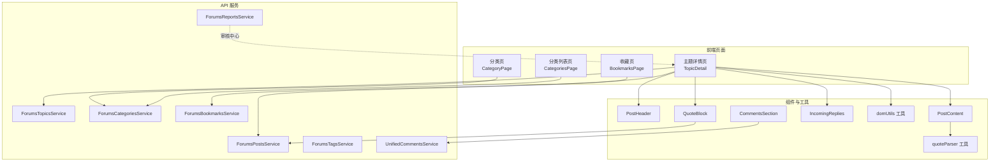
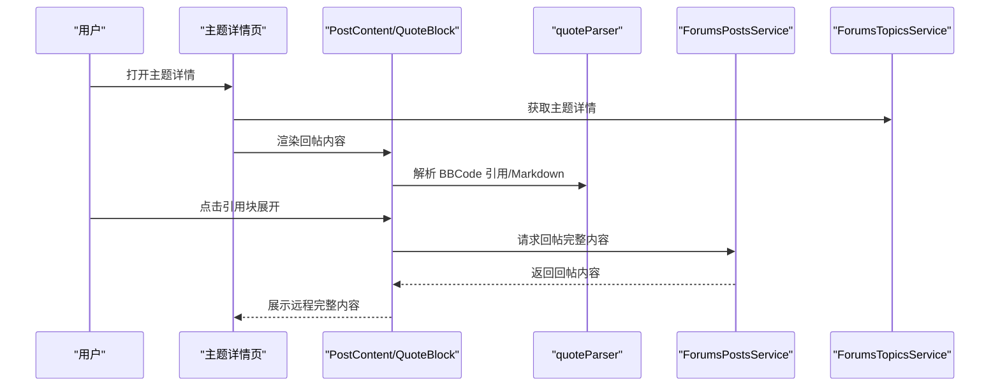
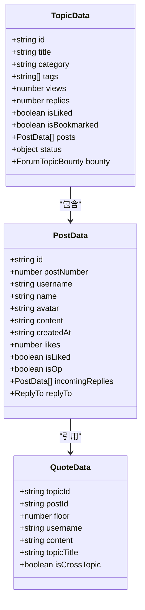
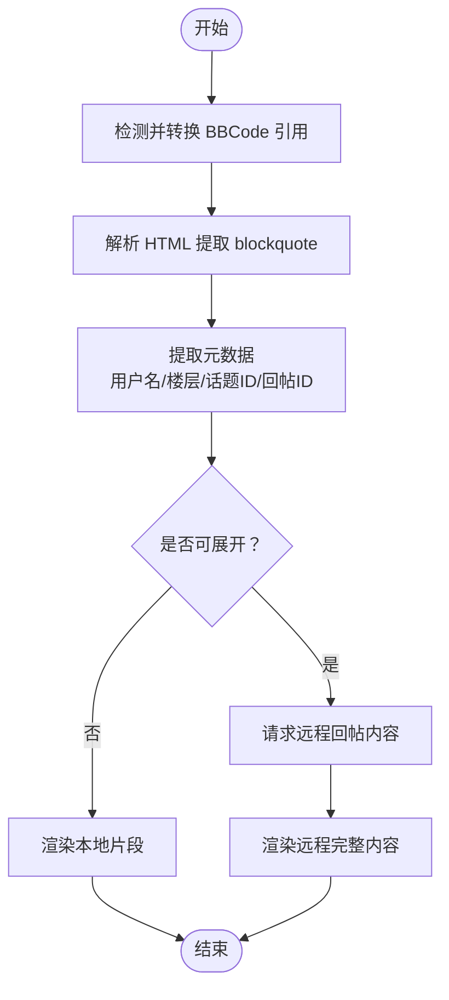
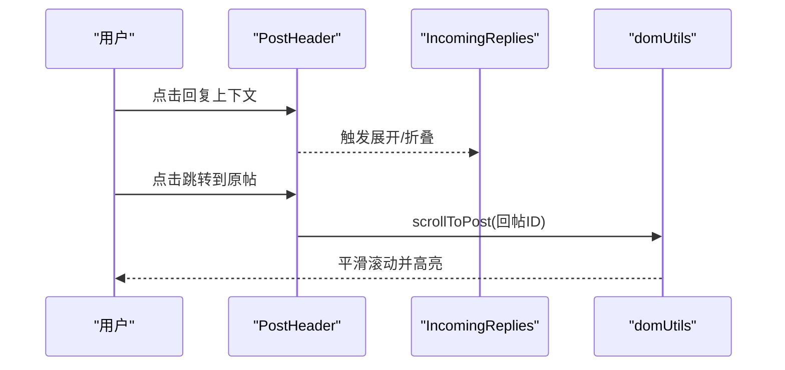
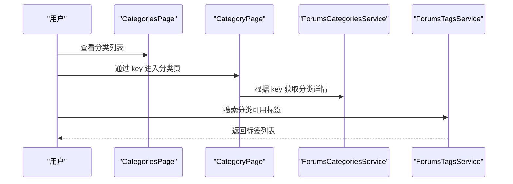
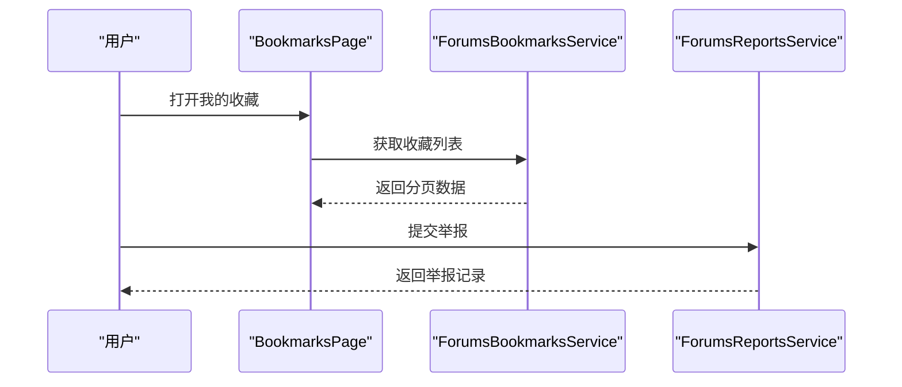
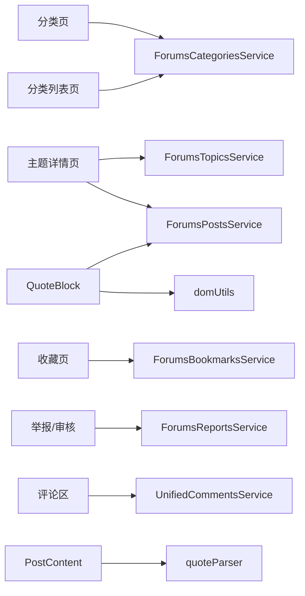

# 论坛互动功能

<cite>
**本文引用的文件**
- [src/modules/forum/pages/TopicDetail/types.ts](file://src/modules/forum/pages/TopicDetail/types.ts)
- [src/modules/forum/pages/TopicDetail/components/PostParts/PostContent.tsx](file://src/modules/forum/pages/TopicDetail/components/PostParts/PostContent.tsx)
- [src/modules/forum/pages/TopicDetail/components/PostParts/PostHeader.tsx](file://src/modules/forum/pages/TopicDetail/components/PostParts/PostHeader.tsx)
- [src/modules/forum/pages/TopicDetail/components/QuoteBlock.tsx](file://src/modules/forum/pages/TopicDetail/components/QuoteBlock.tsx)
- [src/modules/forum/pages/TopicDetail/components/PostParts/IncomingReplies.tsx](file://src/modules/forum/pages/TopicDetail/components/PostParts/IncomingReplies.tsx)
- [src/modules/forum/pages/TopicDetail/utils/quoteParser.ts](file://src/modules/forum/pages/TopicDetail/utils/quoteParser.ts)
- [src/modules/forum/pages/TopicDetail/utils/domUtils.ts](file://src/modules/forum/pages/TopicDetail/utils/domUtils.ts)
- [src/modules/forum/pages/CategoryPage/index.tsx](file://src/modules/forum/pages/CategoryPage/index.tsx)
- [src/modules/forum/pages/CategoriesPage.tsx](file://src/modules/forum/pages/CategoriesPage.tsx)
- [src/modules/forum/pages/BookmarksPage.tsx](file://src/modules/forum/pages/BookmarksPage.tsx)
- [src/api/services/ForumsTopicsService.ts](file://src/api/services/ForumsTopicsService.ts)
- [src/api/services/ForumsPostsService.ts](file://src/api/services/ForumsPostsService.ts)
- [src/api/services/ForumsCategoriesService.ts](file://src/api/services/ForumsCategoriesService.ts)
- [src/api/services/ForumsTagsService.ts](file://src/api/services/ForumsTagsService.ts)
- [src/api/services/ForumsBookmarksService.ts](file://src/api/services/ForumsBookmarksService.ts)
- [src/api/services/ForumsReportsService.ts](file://src/api/services/ForumsReportsService.ts)
- [src/api/services/UnifiedCommentsService.ts](file://src/api/services/UnifiedCommentsService.ts)
- [src/modules/app/components/CommentsSection/index.tsx](file://src/modules/app/components/CommentsSection/index.tsx)
- [src/modules/forum/pages/Admin/ForumAuditCenter/README.md](file://src/modules/forum/pages/Admin/ForumAuditCenter/README.md)
</cite>

## 目录
1. [简介](#简介)
2. [项目结构](#项目结构)
3. [核心组件](#核心组件)
4. [架构总览](#架构总览)
5. [详细组件分析](#详细组件分析)
6. [依赖关系分析](#依赖关系分析)
7. [性能考量](#性能考量)
8. [故障排查指南](#故障排查指南)
9. [结论](#结论)
10. [附录](#附录)

## 简介
本文件面向论坛互动功能，系统化梳理帖子与主题的管理机制（创建、编辑、删除、移动、状态变更）、用户互动（点赞、收藏、举报）、回复系统（嵌套回复、引用、跨话题跳转与高亮）、标签与分类体系、内容审核与违规处理、搜索与排序、以及与前端组件的集成方式。文档以代码为依据，辅以可视化图示帮助理解。

## 项目结构
论坛相关前端位于 src/modules/forum，后端 API 通过 src/api/services 下的服务类暴露。主题详情页、分类页、收藏页等页面组件负责组织交互；服务类封装对后端接口的调用；工具模块提供引用解析、滚动定位等能力。

图表来源
- [src/modules/forum/pages/TopicDetail/types.ts](file://src/modules/forum/pages/TopicDetail/types.ts#L1-L85)
- [src/modules/forum/pages/TopicDetail/components/PostParts/PostContent.tsx](file://src/modules/forum/pages/TopicDetail/components/PostParts/PostContent.tsx#L1-L53)
- [src/modules/forum/pages/TopicDetail/components/PostParts/PostHeader.tsx](file://src/modules/forum/pages/TopicDetail/components/PostParts/PostHeader.tsx#L1-L43)
- [src/modules/forum/pages/TopicDetail/components/QuoteBlock.tsx](file://src/modules/forum/pages/TopicDetail/components/QuoteBlock.tsx#L1-L258)
- [src/modules/forum/pages/TopicDetail/components/PostParts/IncomingReplies.tsx](file://src/modules/forum/pages/TopicDetail/components/PostParts/IncomingReplies.tsx#L1-L36)
- [src/modules/forum/pages/TopicDetail/utils/quoteParser.ts](file://src/modules/forum/pages/TopicDetail/utils/quoteParser.ts#L1-L127)
- [src/modules/forum/pages/TopicDetail/utils/domUtils.ts](file://src/modules/forum/pages/TopicDetail/utils/domUtils.ts#L1-L17)
- [src/modules/app/components/CommentsSection/index.tsx](file://src/modules/app/components/CommentsSection/index.tsx#L1-L126)
- [src/api/services/ForumsTopicsService.ts](file://src/api/services/ForumsTopicsService.ts#L1-L806)
- [src/api/services/ForumsPostsService.ts](file://src/api/services/ForumsPostsService.ts#L1-L280)
- [src/api/services/ForumsCategoriesService.ts](file://src/api/services/ForumsCategoriesService.ts#L1-L118)
- [src/api/services/ForumsTagsService.ts](file://src/api/services/ForumsTagsService.ts#L1-L165)
- [src/api/services/ForumsBookmarksService.ts](file://src/api/services/ForumsBookmarksService.ts#L1-L101)
- [src/api/services/ForumsReportsService.ts](file://src/api/services/ForumsReportsService.ts#L1-L156)
- [src/api/services/UnifiedCommentsService.ts](file://src/api/services/UnifiedCommentsService.ts#L40-L63)

章节来源
- [src/modules/forum/pages/TopicDetail/types.ts](file://src/modules/forum/pages/TopicDetail/types.ts#L1-L85)
- [src/modules/forum/pages/CategoryPage/index.tsx](file://src/modules/forum/pages/CategoryPage/index.tsx#L1-L34)
- [src/modules/forum/pages/CategoriesPage.tsx](file://src/modules/forum/pages/CategoriesPage.tsx#L1-L28)
- [src/modules/forum/pages/BookmarksPage.tsx](file://src/modules/forum/pages/BookmarksPage.tsx#L1-L47)

## 核心组件
- 主题详情模型：定义主题与回帖的数据结构，包含分类、标签、状态、统计、参与者、回帖树等。
- 回帖头部与内容：展示用户名、角色徽章、时间、回复上下文；内容解析支持 BBCode 引用与 Markdown。
- 引用块：支持本地片段与远程完整内容切换、跨话题跳转、楼层定位高亮。
- 嵌套回复：通过 incomingReplies 渲染层级连接线与子回复。
- 分类与标签：分类页按 key 查询分类详情，标签搜索与详情查询。
- 收藏与举报：收藏列表与状态切换；举报提交与管理员处理。
- 评论聚合：统一评论服务获取热评，前端评论区组件展示。

章节来源
- [src/modules/forum/pages/TopicDetail/types.ts](file://src/modules/forum/pages/TopicDetail/types.ts#L6-L85)
- [src/modules/forum/pages/TopicDetail/components/PostParts/PostHeader.tsx](file://src/modules/forum/pages/TopicDetail/components/PostParts/PostHeader.tsx#L1-L43)
- [src/modules/forum/pages/TopicDetail/components/PostParts/PostContent.tsx](file://src/modules/forum/pages/TopicDetail/components/PostParts/PostContent.tsx#L1-L53)
- [src/modules/forum/pages/TopicDetail/components/QuoteBlock.tsx](file://src/modules/forum/pages/TopicDetail/components/QuoteBlock.tsx#L1-L258)
- [src/modules/forum/pages/TopicDetail/components/PostParts/IncomingReplies.tsx](file://src/modules/forum/pages/TopicDetail/components/PostParts/IncomingReplies.tsx#L1-L36)
- [src/modules/forum/pages/CategoryPage/index.tsx](file://src/modules/forum/pages/CategoryPage/index.tsx#L1-L34)
- [src/modules/forum/pages/BookmarksPage.tsx](file://src/modules/forum/pages/BookmarksPage.tsx#L1-L47)
- [src/api/services/ForumsBookmarksService.ts](file://src/api/services/ForumsBookmarksService.ts#L1-L101)
- [src/api/services/ForumsReportsService.ts](file://src/api/services/ForumsReportsService.ts#L1-L156)
- [src/api/services/UnifiedCommentsService.ts](file://src/api/services/UnifiedCommentsService.ts#L40-L63)

## 架构总览
论坛互动从前端页面发起请求，经由 API 服务层调用后端接口，返回数据后在页面组件中渲染。引用解析与滚动定位等工具贯穿内容渲染与交互体验。

图表来源
- [src/modules/forum/pages/TopicDetail/components/PostParts/PostContent.tsx](file://src/modules/forum/pages/TopicDetail/components/PostParts/PostContent.tsx#L1-L53)
- [src/modules/forum/pages/TopicDetail/components/QuoteBlock.tsx](file://src/modules/forum/pages/TopicDetail/components/QuoteBlock.tsx#L79-L104)
- [src/modules/forum/pages/TopicDetail/utils/quoteParser.ts](file://src/modules/forum/pages/TopicDetail/utils/quoteParser.ts#L13-L33)
- [src/api/services/ForumsPostsService.ts](file://src/api/services/ForumsPostsService.ts#L53-L75)
- [src/api/services/ForumsTopicsService.ts](file://src/api/services/ForumsTopicsService.ts#L148-L170)

## 详细组件分析

### 主题与回帖数据模型
- 主题 TopicData：包含标题、分类、标签、统计、状态（锁定/置顶/归档/全局置顶/横幅/趋势）、悬赏、回帖树等。
- 回帖 PostData：包含楼层号、作者、头像、内容、点赞数、是否点赞、回复上下文、嵌套回复等。
- 引用 QuoteData：跨话题/同话题引用，支持楼层号、话题 ID、回帖 ID、用户名、内容与标题。

图表来源
- [src/modules/forum/pages/TopicDetail/types.ts](file://src/modules/forum/pages/TopicDetail/types.ts#L47-L85)

章节来源
- [src/modules/forum/pages/TopicDetail/types.ts](file://src/modules/forum/pages/TopicDetail/types.ts#L6-L85)

### 引用解析与渲染
- BBCode 引用转换：将 [quote=...] 转为 HTML blockquote 并注入元数据属性。
- 引用块解析：从 HTML 中提取 blockquote，解析用户名、楼层、话题/回帖 ID、内容。
- 渲染策略：默认显示本地片段，点击展开后请求远程回帖完整内容；支持跨话题跳转与同话题楼层/回帖定位高亮。

图表来源
- [src/modules/forum/pages/TopicDetail/utils/quoteParser.ts](file://src/modules/forum/pages/TopicDetail/utils/quoteParser.ts#L13-L33)
- [src/modules/forum/pages/TopicDetail/utils/quoteParser.ts](file://src/modules/forum/pages/TopicDetail/utils/quoteParser.ts#L35-L126)
- [src/modules/forum/pages/TopicDetail/components/QuoteBlock.tsx](file://src/modules/forum/pages/TopicDetail/components/QuoteBlock.tsx#L79-L104)

章节来源
- [src/modules/forum/pages/TopicDetail/utils/quoteParser.ts](file://src/modules/forum/pages/TopicDetail/utils/quoteParser.ts#L1-L127)
- [src/modules/forum/pages/TopicDetail/components/QuoteBlock.tsx](file://src/modules/forum/pages/TopicDetail/components/QuoteBlock.tsx#L1-L258)
- [src/modules/forum/pages/TopicDetail/utils/domUtils.ts](file://src/modules/forum/pages/TopicDetail/utils/domUtils.ts#L1-L17)

### 嵌套回复与上下文
- 上下文按钮：显示所回复的父楼层头像与用户名，点击可展开/折叠。
- 连接线与层级：通过网格与绝对定位绘制连接线，体现回复层级。
- 滚动定位：支持按楼层号或回帖 ID 定位并高亮目标回帖。

图表来源
- [src/modules/forum/pages/TopicDetail/components/PostParts/PostHeader.tsx](file://src/modules/forum/pages/TopicDetail/components/PostParts/PostHeader.tsx#L24-L38)
- [src/modules/forum/pages/TopicDetail/components/PostParts/IncomingReplies.tsx](file://src/modules/forum/pages/TopicDetail/components/PostParts/IncomingReplies.tsx#L13-L36)
- [src/modules/forum/pages/TopicDetail/utils/domUtils.ts](file://src/modules/forum/pages/TopicDetail/utils/domUtils.ts#L1-L17)

章节来源
- [src/modules/forum/pages/TopicDetail/components/PostParts/PostHeader.tsx](file://src/modules/forum/pages/TopicDetail/components/PostParts/PostHeader.tsx#L1-L43)
- [src/modules/forum/pages/TopicDetail/components/PostParts/IncomingReplies.tsx](file://src/modules/forum/pages/TopicDetail/components/PostParts/IncomingReplies.tsx#L1-L36)

### 分类与标签管理
- 分类列表：CategoriesPage 展示分类，支持管理操作（基于权限）。
- 分类详情：CategoryPage 通过 key 获取分类并筛选主题列表。
- 标签搜索：ForumsTagsService 提供搜索与详情接口，支持合并标签等管理能力。

图表来源
- [src/modules/forum/pages/CategoriesPage.tsx](file://src/modules/forum/pages/CategoriesPage.tsx#L1-L28)
- [src/modules/forum/pages/CategoryPage/index.tsx](file://src/modules/forum/pages/CategoryPage/index.tsx#L18-L34)
- [src/api/services/ForumsCategoriesService.ts](file://src/api/services/ForumsCategoriesService.ts#L79-L101)
- [src/api/services/ForumsTagsService.ts](file://src/api/services/ForumsTagsService.ts#L26-L34)

章节来源
- [src/modules/forum/pages/CategoriesPage.tsx](file://src/modules/forum/pages/CategoriesPage.tsx#L1-L28)
- [src/modules/forum/pages/CategoryPage/index.tsx](file://src/modules/forum/pages/CategoryPage/index.tsx#L1-L34)
- [src/api/services/ForumsCategoriesService.ts](file://src/api/services/ForumsCategoriesService.ts#L1-L118)
- [src/api/services/ForumsTagsService.ts](file://src/api/services/ForumsTagsService.ts#L1-L165)

### 收藏与举报
- 收藏：支持切换状态、获取状态、分页列出；页面提供收藏列表展示。
- 举报：提交举报、获取待处理列表、处理举报、统计与全量列表（管理员）。

图表来源
- [src/modules/forum/pages/BookmarksPage.tsx](file://src/modules/forum/pages/BookmarksPage.tsx#L16-L25)
- [src/api/services/ForumsBookmarksService.ts](file://src/api/services/ForumsBookmarksService.ts#L78-L100)
- [src/api/services/ForumsReportsService.ts](file://src/api/services/ForumsReportsService.ts#L21-L43)

章节来源
- [src/modules/forum/pages/BookmarksPage.tsx](file://src/modules/forum/pages/BookmarksPage.tsx#L1-L47)
- [src/api/services/ForumsBookmarksService.ts](file://src/api/services/ForumsBookmarksService.ts#L1-L101)
- [src/api/services/ForumsReportsService.ts](file://src/api/services/ForumsReportsService.ts#L1-L156)

### 评论聚合与热评
- CommentsSection 使用统一评论服务获取聚合热评，展示用户头像、用户名、内容、点赞数与跳转到主题的能力。

章节来源
- [src/modules/app/components/CommentsSection/index.tsx](file://src/modules/app/components/CommentsSection/index.tsx#L33-L126)
- [src/api/services/UnifiedCommentsService.ts](file://src/api/services/UnifiedCommentsService.ts#L40-L63)

### 审核与违规处理
- 审核中心页面说明：管理员/版主角色要求、扩展点（新增审核类型）、长列表优化建议。
- 举报处理：管理员可查看待处理列表、处理举报、统计与全量列表。

章节来源
- [src/modules/forum/pages/Admin/ForumAuditCenter/README.md](file://src/modules/forum/pages/Admin/ForumAuditCenter/README.md#L34-L42)
- [src/api/services/ForumsReportsService.ts](file://src/api/services/ForumsReportsService.ts#L50-L101)

## 依赖关系分析
- 页面依赖服务：主题详情依赖 ForumsTopicsService 与 ForumsPostsService；分类页依赖 ForumsCategoriesService；收藏页依赖 ForumsBookmarksService；举报依赖 ForumsReportsService；评论区依赖 UnifiedCommentsService。
- 组件内部依赖：PostContent 依赖 quoteParser；QuoteBlock 依赖 ForumsPostsService 与 domUtils；IncomingReplies 依赖 PostData 结构。
- 数据模型耦合：TopicData 与 PostData 通过引用与嵌套关系紧密耦合。

图表来源
- [src/api/services/ForumsTopicsService.ts](file://src/api/services/ForumsTopicsService.ts#L1-L806)
- [src/api/services/ForumsPostsService.ts](file://src/api/services/ForumsPostsService.ts#L1-L280)
- [src/api/services/ForumsCategoriesService.ts](file://src/api/services/ForumsCategoriesService.ts#L1-L118)
- [src/api/services/ForumsBookmarksService.ts](file://src/api/services/ForumsBookmarksService.ts#L1-L101)
- [src/api/services/ForumsReportsService.ts](file://src/api/services/ForumsReportsService.ts#L1-L156)
- [src/api/services/UnifiedCommentsService.ts](file://src/api/services/UnifiedCommentsService.ts#L40-L63)
- [src/modules/forum/pages/TopicDetail/components/PostParts/PostContent.tsx](file://src/modules/forum/pages/TopicDetail/components/PostParts/PostContent.tsx#L1-L53)
- [src/modules/forum/pages/TopicDetail/components/QuoteBlock.tsx](file://src/modules/forum/pages/TopicDetail/components/QuoteBlock.tsx#L1-L258)
- [src/modules/forum/pages/TopicDetail/utils/domUtils.ts](file://src/modules/forum/pages/TopicDetail/utils/domUtils.ts#L1-L17)

章节来源
- [src/api/services/ForumsTopicsService.ts](file://src/api/services/ForumsTopicsService.ts#L1-L806)
- [src/api/services/ForumsPostsService.ts](file://src/api/services/ForumsPostsService.ts#L1-L280)
- [src/api/services/ForumsCategoriesService.ts](file://src/api/services/ForumsCategoriesService.ts#L1-L118)
- [src/api/services/ForumsBookmarksService.ts](file://src/api/services/ForumsBookmarksService.ts#L1-L101)
- [src/api/services/ForumsReportsService.ts](file://src/api/services/ForumsReportsService.ts#L1-L156)
- [src/api/services/UnifiedCommentsService.ts](file://src/api/services/UnifiedCommentsService.ts#L40-L63)

## 性能考量
- 引用展开按需加载：仅在用户点击时请求远程回帖内容，避免一次性加载全部数据。
- 内容缓存与解析：PostContent 使用缓存的 Markdown 解析，减少重复计算。
- 列表懒加载：分类与主题列表采用分页与查询参数，避免一次性拉取过多数据。
- DOM 滚动高亮：滚动与高亮使用轻量级类名切换，避免复杂动画影响性能。

## 故障排查指南
- 引用无法展开：检查 QuoteBlock 的 postId 是否存在；确认 ForumsPostsService 请求是否成功。
- 跨话题跳转失败：确认 QuoteData 的 topicId 与 postId 是否正确；检查 QuoteBlock 的导航回调。
- 楼层定位不生效：确认 domUtils 的选择器与目标元素是否存在；检查 data-post-db-id 属性是否正确设置。
- 收藏/举报异常：检查对应服务的错误码与鉴权状态；确认用户登录与权限。
- 评论聚合为空：确认 UnifiedCommentsService 的查询参数与实体类型是否匹配。

章节来源
- [src/modules/forum/pages/TopicDetail/components/QuoteBlock.tsx](file://src/modules/forum/pages/TopicDetail/components/QuoteBlock.tsx#L79-L104)
- [src/modules/forum/pages/TopicDetail/utils/domUtils.ts](file://src/modules/forum/pages/TopicDetail/utils/domUtils.ts#L1-L17)
- [src/api/services/ForumsBookmarksService.ts](file://src/api/services/ForumsBookmarksService.ts#L1-L101)
- [src/api/services/ForumsReportsService.ts](file://src/api/services/ForumsReportsService.ts#L1-L156)
- [src/api/services/UnifiedCommentsService.ts](file://src/api/services/UnifiedCommentsService.ts#L40-L63)

## 结论
本论坛互动功能以清晰的数据模型与组件化架构为基础，围绕主题与回帖的生命周期提供创建、编辑、删除、状态管理与分类标签体系；通过引用解析与嵌套回复提升讨论深度；借助收藏与举报完善用户互动与治理；配合审核中心与统一评论聚合实现内容治理与曝光。前后端接口通过服务类抽象，便于扩展与维护。

## 附录

### API 接口与前端组件集成要点
- 主题管理
  - 获取主题详情：ForumsTopicsService.topicsControllerFindOne
  - 创建/更新/删除主题：ForumsTopicsService.topicsControllerCreate/update/remove
  - 状态管理（锁定/置顶/趋势/全局置顶/横幅/归档/移动/恢复）：对应 admin 接口
  - 搜索与列表：topicsControllerSearch/findAll
- 回复管理
  - 获取回帖列表/详情/创建/更新/删除：ForumsPostsService.postsControllerFindAll/findOne/create/update/remove
  - 管理员恢复/删除/设为系统消息
- 分类与标签
  - 分类：categoriesControllerFindAll/findByKey/findCategoryTags
  - 标签：tagsControllerSearch/detail/create
- 收藏
  - toggle/status/list：ForumsBookmarksService.bookmarksControllerToggle/getStatus/list
- 举报
  - create/pending/handle/stats/list：ForumsReportsService.reportsControllerCreate/findPending/handle/getStats/findAll
- 评论聚合
  - forumCommentsControllerGetTopPosts：UnifiedCommentsService.forumCommentsControllerGetTopPosts

章节来源
- [src/api/services/ForumsTopicsService.ts](file://src/api/services/ForumsTopicsService.ts#L148-L257)
- [src/api/services/ForumsPostsService.ts](file://src/api/services/ForumsPostsService.ts#L24-L162)
- [src/api/services/ForumsCategoriesService.ts](file://src/api/services/ForumsCategoriesService.ts#L79-L118)
- [src/api/services/ForumsTagsService.ts](file://src/api/services/ForumsTagsService.ts#L26-L165)
- [src/api/services/ForumsBookmarksService.ts](file://src/api/services/ForumsBookmarksService.ts#L20-L100)
- [src/api/services/ForumsReportsService.ts](file://src/api/services/ForumsReportsService.ts#L21-L154)
- [src/api/services/UnifiedCommentsService.ts](file://src/api/services/UnifiedCommentsService.ts#L40-L63)