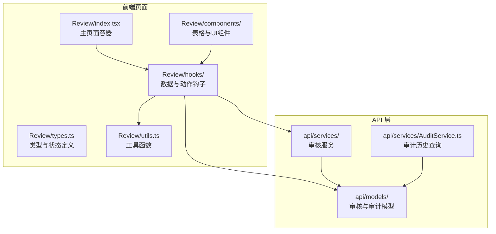
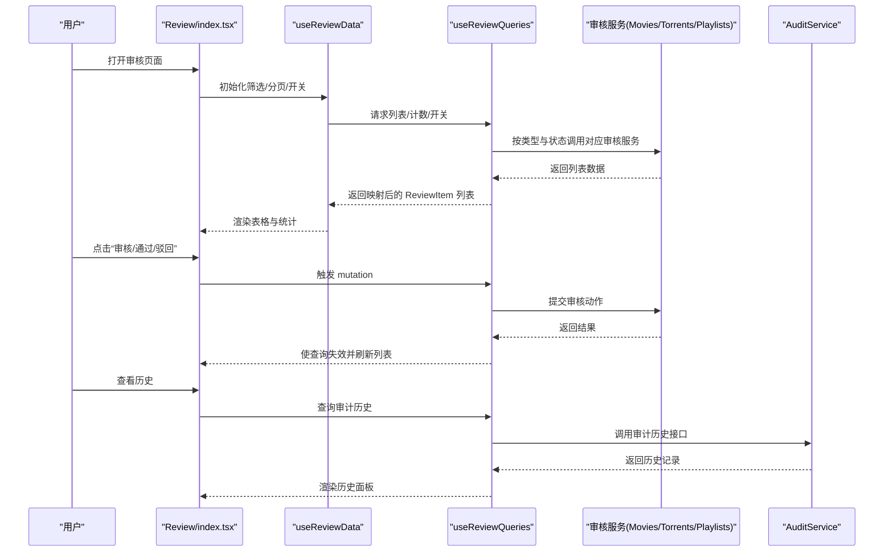
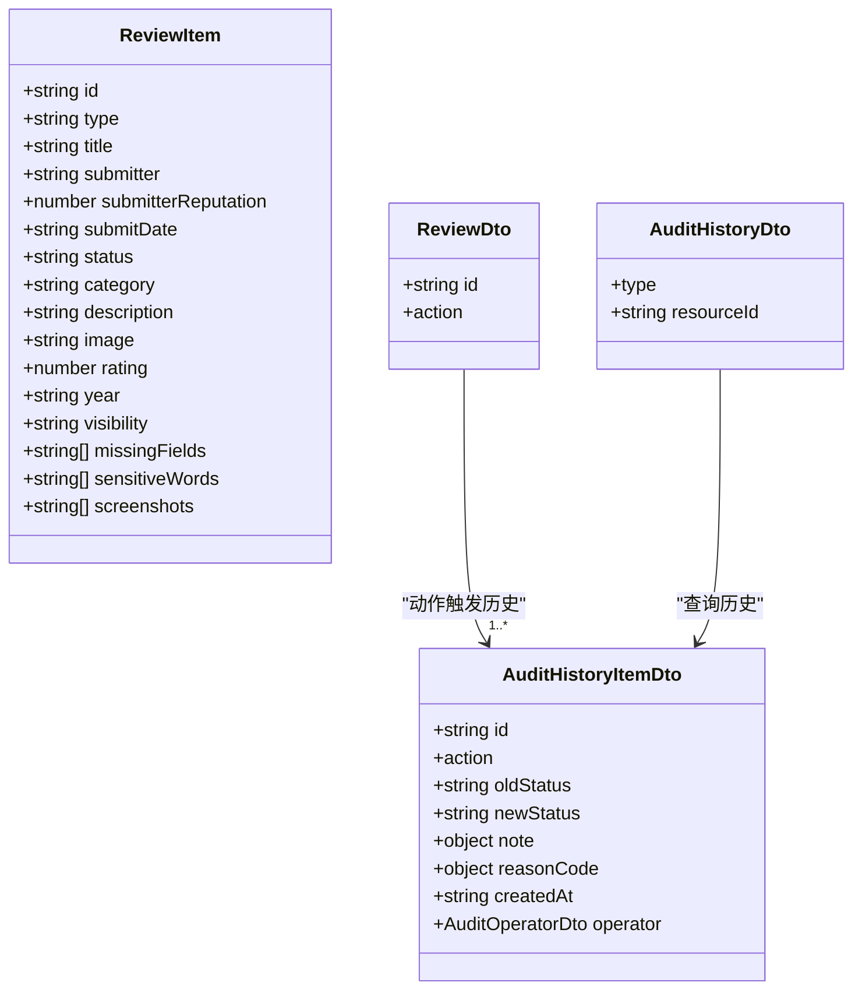
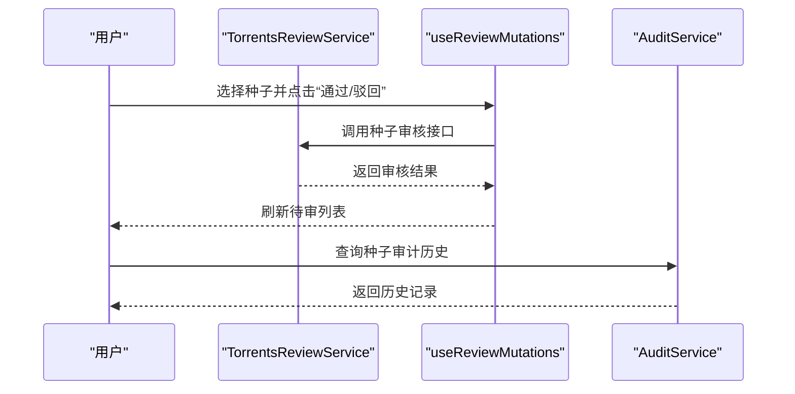
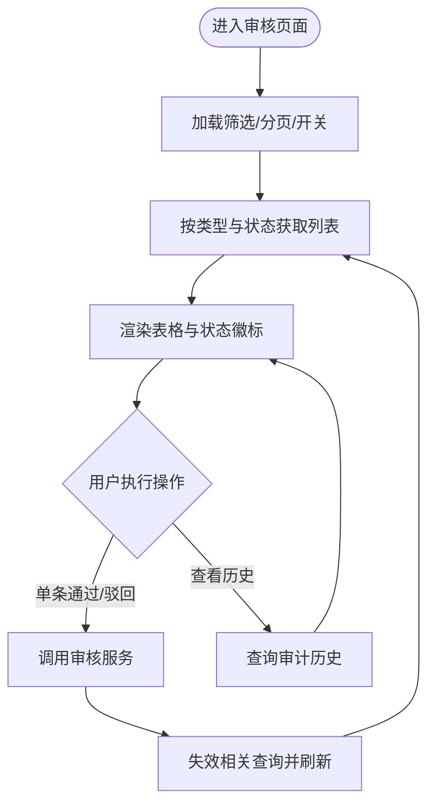
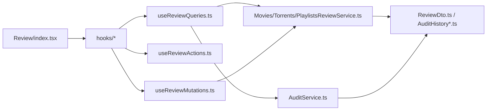

# 内容审核管理

<cite>
**本文引用的文件**
- [src/modules/app/pages/Review/index.tsx](file://src/modules/app/pages/Review/index.tsx)
- [src/modules/app/pages/Review/types.ts](file://src/modules/app/pages/Review/types.ts)
- [src/modules/app/pages/Review/utils.ts](file://src/modules/app/pages/Review/utils.ts)
- [src/modules/app/pages/Review/hooks/useReviewData.ts](file://src/modules/app/pages/Review/hooks/useReviewData.ts)
- [src/modules/app/pages/Review/hooks/useReviewActions.ts](file://src/modules/app/pages/Review/hooks/useReviewActions.ts)
- [src/modules/app/pages/Review/hooks/useReviewMutations.ts](file://src/modules/app/pages/Review/hooks/useReviewMutations.ts)
- [src/modules/app/pages/Review/hooks/useReviewQueries.ts](file://src/modules/app/pages/Review/hooks/useReviewQueries.ts)
- [src/modules/app/pages/Review/hooks/useReviewHistory.ts](file://src/modules/app/pages/Review/hooks/useReviewHistory.ts)
- [src/modules/app/pages/Review/components/ReviewTable.tsx](file://src/modules/app/pages/Review/components/ReviewTable.tsx)
- [src/api/models/ReviewDto.ts](file://src/api/models/ReviewDto.ts)
- [src/api/models/ReviewHistoryDto.ts](file://src/api/models/ReviewHistoryDto.ts)
- [src/api/models/ReviewHistoryItem.ts](file://src/api/models/ReviewHistoryItem.ts)
- [src/api/models/AuditHistoryDto.ts](file://src/api/models/AuditHistoryDto.ts)
- [src/api/models/AuditHistoryItemDto.ts](file://src/api/models/AuditHistoryItemDto.ts)
- [src/api/models/AuditHistoryResponseDto.ts](file://src/api/models/AuditHistoryResponseDto.ts)
- [src/api/services/AuditService.ts](file://src/api/services/AuditService.ts)
- [src/api/services/MoviesReviewService.ts](file://src/api/services/MoviesReviewService.ts)
- [src/api/services/PlaylistsReviewService.ts](file://src/api/services/PlaylistsReviewService.ts)
- [src/api/services/TorrentsReviewService.ts](file://src/api/services/TorrentsReviewService.ts)
</cite>

## 目录
1. [引言](#引言)
2. [项目结构](#项目结构)
3. [核心组件](#核心组件)
4. [架构总览](#架构总览)
5. [详细组件分析](#详细组件分析)
6. [依赖关系分析](#依赖关系分析)
7. [性能考量](#性能考量)
8. [故障排查指南](#故障排查指南)
9. [结论](#结论)
10. [附录](#附录)

## 引言
本技术文档围绕内容审核管理服务展开，系统性阐述种子内容审核、电影审核、电视剧审核与播放列表审核的前端实现机制。重点覆盖以下方面：
- 审核流程的状态管理与状态流转
- 单条与批量审核操作的前端实现路径
- 审核历史追踪与审计接口集成
- 审核数据模型、规则配置入口与结果处理
- 审核界面的数据展示、操作权限控制与进度监控
- 安全策略、异常处理与性能优化建议

## 项目结构
审核页面采用模块化组织，核心位于应用前端模块下的“Review”页面，配合API层的审核服务与模型定义，形成完整的前后端交互闭环。

图表来源
- [src/modules/app/pages/Review/index.tsx](file://src/modules/app/pages/Review/index.tsx#L1-L33)
- [src/modules/app/pages/Review/hooks/useReviewQueries.ts](file://src/modules/app/pages/Review/hooks/useReviewQueries.ts#L1-L281)
- [src/api/services/AuditService.ts](file://src/api/services/AuditService.ts#L1-L40)

章节来源
- [src/modules/app/pages/Review/index.tsx](file://src/modules/app/pages/Review/index.tsx#L1-L33)
- [src/modules/app/pages/Review/types.ts](file://src/modules/app/pages/Review/types.ts#L1-L44)

## 核心组件
- 页面容器与布局
  - 主页面容器负责组合头部、过滤器、表格、抽屉与弹窗等子组件，并协调数据与动作钩子。
- 数据钩子
  - useReviewData：统一管理筛选条件、分页、搜索、统计与开关配置。
  - useReviewItems/useReviewCounts/useReviewSwitches：按类型与状态拉取待审/已审/已拒列表与待审计数、审核开关。
  - useReviewHistory：基于资源ID与类型查询审计历史。
- 动作钩子
  - useReviewActions/useReviewMutations：封装审核动作（通过/驳回）的表单收集、校验与调用后端服务。
- UI 组件
  - ReviewTable：渲染审核列表，按状态显示不同操作按钮，支持查看详情、审核、历史等。
- 工具与模型
  - utils：响应体解包、错误提取、标签映射等。
  - models：ReviewDto、ReviewHistoryDto、AuditHistoryDto 等模型定义。

章节来源
- [src/modules/app/pages/Review/index.tsx](file://src/modules/app/pages/Review/index.tsx#L13-L33)
- [src/modules/app/pages/Review/hooks/useReviewData.ts](file://src/modules/app/pages/Review/hooks/useReviewData.ts#L1-L87)
- [src/modules/app/pages/Review/hooks/useReviewQueries.ts](file://src/modules/app/pages/Review/hooks/useReviewQueries.ts#L111-L201)
- [src/modules/app/pages/Review/hooks/useReviewActions.ts](file://src/modules/app/pages/Review/hooks/useReviewActions.ts#L1-L37)
- [src/modules/app/pages/Review/hooks/useReviewMutations.ts](file://src/modules/app/pages/Review/hooks/useReviewMutations.ts#L20-L47)
- [src/modules/app/pages/Review/components/ReviewTable.tsx](file://src/modules/app/pages/Review/components/ReviewTable.tsx#L38-L218)
- [src/modules/app/pages/Review/utils.ts](file://src/modules/app/pages/Review/utils.ts#L1-L29)

## 架构总览
审核页面的前端架构遵循“页面容器 + 钩子层 + UI 组件 + API 服务”的分层设计，通过 React Query 实现数据获取、缓存与失效，确保状态一致与用户体验流畅。

图表来源
- [src/modules/app/pages/Review/index.tsx](file://src/modules/app/pages/Review/index.tsx#L13-L33)
- [src/modules/app/pages/Review/hooks/useReviewData.ts](file://src/modules/app/pages/Review/hooks/useReviewData.ts#L34-L43)
- [src/modules/app/pages/Review/hooks/useReviewQueries.ts](file://src/modules/app/pages/Review/hooks/useReviewQueries.ts#L111-L201)
- [src/modules/app/pages/Review/hooks/useReviewMutations.ts](file://src/modules/app/pages/Review/hooks/useReviewMutations.ts#L23-L46)
- [src/api/services/AuditService.ts](file://src/api/services/AuditService.ts#L17-L39)

## 详细组件分析

### 审核数据模型与状态管理
- 审核项模型 ReviewItem
  - 字段涵盖：标识、类型、标题、提交人、信誉、提交时间、状态、分类、描述、封面、评分、年份、可见性、缺失字段、敏感词、截图等。
  - 状态包括：待审核、已通过、已驳回。
- 审核动作模型 ReviewDto
  - 包含内容ID、动作（通过/驳回）、备注、拒绝原因代码。
- 审核历史模型
  - AuditHistoryDto：资源类型与资源ID。
  - AuditHistoryItemDto：包含操作类型、旧状态、新状态、备注、原因代码、操作时间、操作人信息。
- 类型与状态枚举
  - ReviewType：movie、series、playlist、torrent。
  - ReviewStatus：pending、approved、rejected。

图表来源
- [src/modules/app/pages/Review/types.ts](file://src/modules/app/pages/Review/types.ts#L4-L25)
- [src/api/models/ReviewDto.ts](file://src/api/models/ReviewDto.ts#L5-L19)
- [src/api/models/AuditHistoryDto.ts](file://src/api/models/AuditHistoryDto.ts#L5-L14)
- [src/api/models/AuditHistoryItemDto.ts](file://src/api/models/AuditHistoryItemDto.ts#L6-L39)

章节来源
- [src/modules/app/pages/Review/types.ts](file://src/modules/app/pages/Review/types.ts#L1-L44)
- [src/api/models/ReviewDto.ts](file://src/api/models/ReviewDto.ts#L1-L27)
- [src/api/models/AuditHistoryDto.ts](file://src/api/models/AuditHistoryDto.ts#L1-L27)
- [src/api/models/AuditHistoryItemDto.ts](file://src/api/models/AuditHistoryItemDto.ts#L1-L49)

### 种子内容审核
- 列表与状态
  - 支持“待审核/已通过/已驳回”三类状态切换；种子列表通过 TorrentsReviewService 获取。
- 审核动作
  - 通过 useReviewMutations 将 ReviewDto 发送到后端，成功后失效相关查询以刷新列表。
- 历史追踪
  - 通过 AuditService.auditControllerHistory 查询种子的审计历史。

图表来源
- [src/modules/app/pages/Review/hooks/useReviewMutations.ts](file://src/modules/app/pages/Review/hooks/useReviewMutations.ts#L28-L38)
- [src/api/services/AuditService.ts](file://src/api/services/AuditService.ts#L17-L39)

章节来源
- [src/modules/app/pages/Review/hooks/useReviewQueries.ts](file://src/modules/app/pages/Review/hooks/useReviewQueries.ts#L118-L134)
- [src/modules/app/pages/Review/hooks/useReviewMutations.ts](file://src/modules/app/pages/Review/hooks/useReviewMutations.ts#L28-L38)
- [src/api/services/AuditService.ts](file://src/api/services/AuditService.ts#L17-L39)

### 电影审核
- 列表与状态
  - 通过 MoviesReviewService 的“待审/已通过/已驳回”接口获取数据。
- 审核动作
  - 使用 ReviewDto 提交审核请求。
- 历史追踪
  - 使用 AuditHistoryDto.type.MOVIE 查询电影审计历史。

章节来源
- [src/modules/app/pages/Review/hooks/useReviewQueries.ts](file://src/modules/app/pages/Review/hooks/useReviewQueries.ts#L135-L151)
- [src/api/models/AuditHistoryDto.ts](file://src/api/models/AuditHistoryDto.ts#L19-L24)

### 电视剧审核
- 列表与状态
  - 通过 SeriesService 的“待审/已通过/已驳回”接口获取数据。
- 审核动作
  - 使用 ReviewDto 提交审核请求。
- 历史追踪
  - 使用 AuditHistoryDto.type.SERIES 查询电视剧审计历史。

章节来源
- [src/modules/app/pages/Review/hooks/useReviewQueries.ts](file://src/modules/app/pages/Review/hooks/useReviewQueries.ts#L152-L168)
- [src/api/models/AuditHistoryDto.ts](file://src/api/models/AuditHistoryDto.ts#L19-L24)

### 播放列表审核
- 列表与状态
  - 通过 PlaylistsReviewService 的“待审/已通过/已驳回”接口获取数据；映射时兼容资源与评审对象结构差异。
- 审核动作
  - 使用 ReviewDto 提交审核请求。
- 历史追踪
  - 使用 AuditHistoryDto.type.PLAYLIST 查询播放列表审计历史。

章节来源
- [src/modules/app/pages/Review/hooks/useReviewQueries.ts](file://src/modules/app/pages/Review/hooks/useReviewQueries.ts#L169-L194)
- [src/modules/app/pages/Review/hooks/useReviewQueries.ts](file://src/modules/app/pages/Review/hooks/useReviewQueries.ts#L67-L101)
- [src/api/models/AuditHistoryDto.ts](file://src/api/models/AuditHistoryDto.ts#L19-L24)

### 审核流程状态管理与批量操作
- 状态管理
  - useReviewData 维护类型、状态、时间范围、关键词、分页等筛选条件；通过 useReviewCounts 获取各类型待审总数；通过 useReviewSwitches 获取审核开关。
- 批量操作
  - 当前实现聚焦单条审核动作（通过/驳回），未见批量审核接口直接调用；如需批量操作，可在前端聚合选中项并通过循环调用单条审核接口实现，或在后端扩展批量审核接口。
- 审核历史
  - useReviewItemHistory 基于资源ID与类型查询审计历史，返回标准化的 AuditHistory 列表。

图表来源
- [src/modules/app/pages/Review/hooks/useReviewData.ts](file://src/modules/app/pages/Review/hooks/useReviewData.ts#L34-L43)
- [src/modules/app/pages/Review/hooks/useReviewMutations.ts](file://src/modules/app/pages/Review/hooks/useReviewMutations.ts#L41-L46)
- [src/modules/app/pages/Review/hooks/useReviewQueries.ts](file://src/modules/app/pages/Review/hooks/useReviewQueries.ts#L240-L280)

章节来源
- [src/modules/app/pages/Review/hooks/useReviewData.ts](file://src/modules/app/pages/Review/hooks/useReviewData.ts#L1-L87)
- [src/modules/app/pages/Review/hooks/useReviewMutations.ts](file://src/modules/app/pages/Review/hooks/useReviewMutations.ts#L20-L47)
- [src/modules/app/pages/Review/hooks/useReviewHistory.ts](file://src/modules/app/pages/Review/hooks/useReviewHistory.ts#L1-L16)

### 审核界面的数据展示与交互
- 表格列与行为
  - 封面/类型、标题、提交人与信誉、提交时间、可见性、状态徽标、警告提示（缺失字段/敏感词）、操作按钮（审核/通过/驳回/历史）。
- 交互细节
  - 根据状态动态显示按钮；支持查看详情与审计历史。
- 可见性与类型标签
  - 通过工具函数映射为中文标签，提升可读性。

章节来源
- [src/modules/app/pages/Review/components/ReviewTable.tsx](file://src/modules/app/pages/Review/components/ReviewTable.tsx#L38-L218)
- [src/modules/app/pages/Review/utils.ts](file://src/modules/app/pages/Review/utils.ts#L11-L29)

### 审核规则配置与结果处理
- 规则配置入口
  - 审核开关通过 SettingsService.settingsControllerGetReviewSwitches 获取，分别控制电影、剧集、播放列表、种子的审核开关。
- 结果处理
  - 审核结果通过 ReviewDto.action（APPROVE/REJECT）传递；后端返回统一结构，前端通过 utils.unwrapResponse 解包并更新本地状态。

章节来源
- [src/modules/app/pages/Review/hooks/useReviewQueries.ts](file://src/modules/app/pages/Review/hooks/useReviewQueries.ts#L224-L238)
- [src/modules/app/pages/Review/utils.ts](file://src/modules/app/pages/Review/utils.ts#L1-L4)

### 审核安全策略与异常处理
- 输入校验
  - 在提交审核前对内容ID进行非空校验，防止无效ID导致后端错误。
- 错误提取
  - 通过 utils.extractErrorMessage 统一提取错误消息，避免前端抛出不可读异常。
- 权限控制
  - 审核页面属于管理员功能，应结合路由守卫与权限注册机制进行访问控制（参考权限注册与守卫相关文件）。

章节来源
- [src/modules/app/pages/Review/hooks/useReviewActions.ts](file://src/modules/app/pages/Review/hooks/useReviewActions.ts#L23-L31)
- [src/modules/app/pages/Review/utils.ts](file://src/modules/app/pages/Review/utils.ts#L6-L9)

## 依赖关系分析
- 组件耦合
  - 页面容器仅依赖钩子与工具，降低耦合度；钩子内部再依赖服务与模型，职责清晰。
- 查询与失效
  - 通过 React Query 的 queryKey 精准失效，避免全局刷新带来的性能损耗。
- 服务与模型
  - 各类型审核服务与审计服务均依赖统一的模型定义，保证前后端契约一致。

图表来源
- [src/modules/app/pages/Review/index.tsx](file://src/modules/app/pages/Review/index.tsx#L1-L33)
- [src/modules/app/pages/Review/hooks/useReviewQueries.ts](file://src/modules/app/pages/Review/hooks/useReviewQueries.ts#L1-L12)
- [src/modules/app/pages/Review/hooks/useReviewMutations.ts](file://src/modules/app/pages/Review/hooks/useReviewMutations.ts#L1-L11)
- [src/api/services/AuditService.ts](file://src/api/services/AuditService.ts#L1-L9)

章节来源
- [src/modules/app/pages/Review/hooks/useReviewQueries.ts](file://src/modules/app/pages/Review/hooks/useReviewQueries.ts#L1-L12)
- [src/modules/app/pages/Review/hooks/useReviewMutations.ts](file://src/modules/app/pages/Review/hooks/useReviewMutations.ts#L1-L11)
- [src/api/services/AuditService.ts](file://src/api/services/AuditService.ts#L1-L9)

## 性能考量
- 分页与占位
  - 使用 keepPreviousData 保持上一页数据，减少切换分页时的闪烁与空白。
- 搜索防抖
  - 对关键词搜索进行防抖处理，降低频繁请求带来的压力。
- 并行请求
  - 计数查询使用 Promise.all 并行拉取各类型待审数量，缩短首屏等待时间。
- 查询失效粒度
  - 仅失效与审核相关的查询键，避免不必要的全站刷新。

章节来源
- [src/modules/app/pages/Review/hooks/useReviewQueries.ts](file://src/modules/app/pages/Review/hooks/useReviewQueries.ts#L199-L201)
- [src/modules/app/pages/Review/hooks/useReviewData.ts](file://src/modules/app/pages/Review/hooks/useReviewData.ts#L19-L26)
- [src/modules/app/pages/Review/hooks/useReviewQueries.ts](file://src/modules/app/pages/Review/hooks/useReviewQueries.ts#L207-L212)
- [src/modules/app/pages/Review/hooks/useReviewMutations.ts](file://src/modules/app/pages/Review/hooks/useReviewMutations.ts#L41-L46)

## 故障排查指南
- 常见问题
  - 审核动作失败：检查网络请求与后端返回；确认内容ID有效且类型正确。
  - 历史为空：确认资源ID与类型匹配，以及后端是否已生成审计记录。
  - 列表不刷新：确认 mutation 成功后查询失效是否触发。
- 排查步骤
  - 打开浏览器开发者工具，查看 Network 面板中审核与历史接口的请求与响应。
  - 在控制台观察错误日志，结合 utils.extractErrorMessage 的错误消息定位问题。
  - 若出现“缺少内容 ID”的提示，检查前端校验逻辑与数据源映射。

章节来源
- [src/modules/app/pages/Review/hooks/useReviewActions.ts](file://src/modules/app/pages/Review/hooks/useReviewActions.ts#L23-L31)
- [src/modules/app/pages/Review/hooks/useReviewMutations.ts](file://src/modules/app/pages/Review/hooks/useReviewMutations.ts#L41-L46)
- [src/modules/app/pages/Review/utils.ts](file://src/modules/app/pages/Review/utils.ts#L6-L9)

## 结论
该审核管理服务通过清晰的分层设计与完善的模型定义，实现了种子、电影、电视剧与播放列表的统一审核体验。前端利用 React Query 实现高效的数据管理与状态同步，配合审计历史查询与开关配置，满足了运营与合规需求。后续可在现有基础上扩展批量操作与更细粒度的权限控制，进一步提升审核效率与安全性。

## 附录
- 关键实现路径
  - 审核页面容器：[src/modules/app/pages/Review/index.tsx](file://src/modules/app/pages/Review/index.tsx#L13-L33)
  - 数据与状态钩子：[src/modules/app/pages/Review/hooks/useReviewData.ts](file://src/modules/app/pages/Review/hooks/useReviewData.ts#L1-L87)、[src/modules/app/pages/Review/hooks/useReviewQueries.ts](file://src/modules/app/pages/Review/hooks/useReviewQueries.ts#L111-L201)
  - 审核动作与批量：[src/modules/app/pages/Review/hooks/useReviewMutations.ts](file://src/modules/app/pages/Review/hooks/useReviewMutations.ts#L20-L47)
  - 历史查询：[src/modules/app/pages/Review/hooks/useReviewQueries.ts](file://src/modules/app/pages/Review/hooks/useReviewQueries.ts#L240-L280)、[src/api/services/AuditService.ts](file://src/api/services/AuditService.ts#L17-L39)
  - UI 表格与标签：[src/modules/app/pages/Review/components/ReviewTable.tsx](file://src/modules/app/pages/Review/components/ReviewTable.tsx#L38-L218)、[src/modules/app/pages/Review/utils.ts](file://src/modules/app/pages/Review/utils.ts#L11-L29)