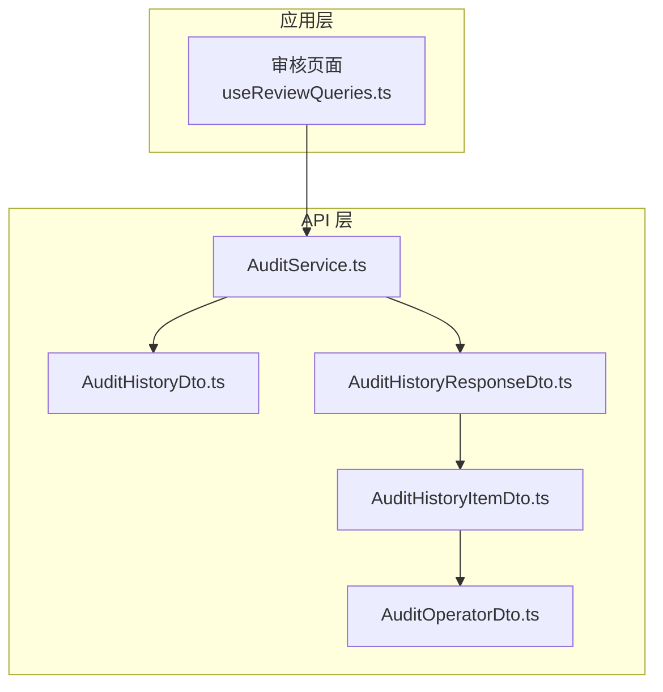
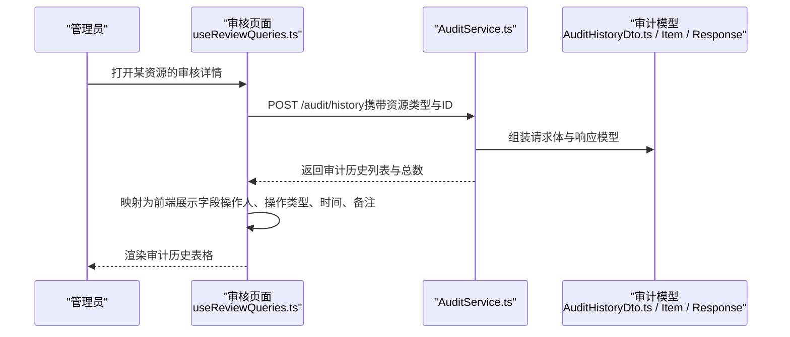
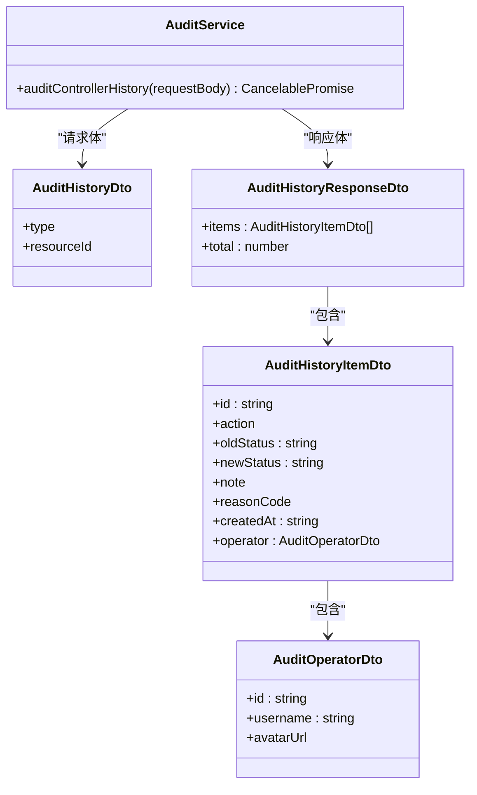
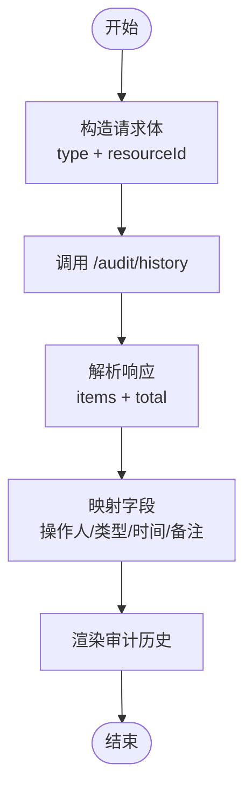
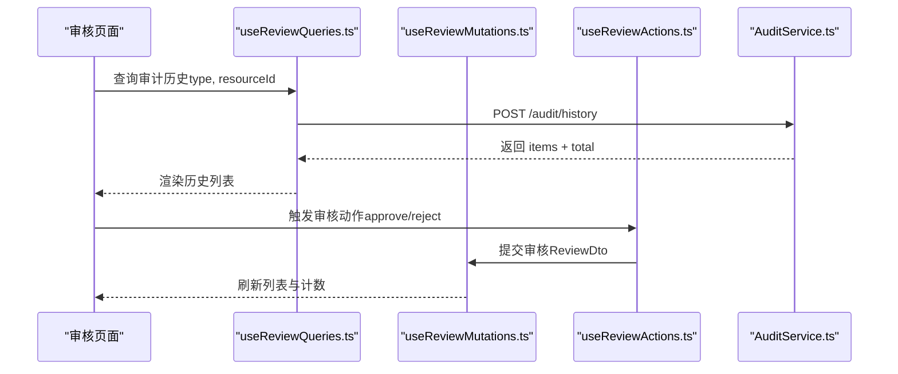
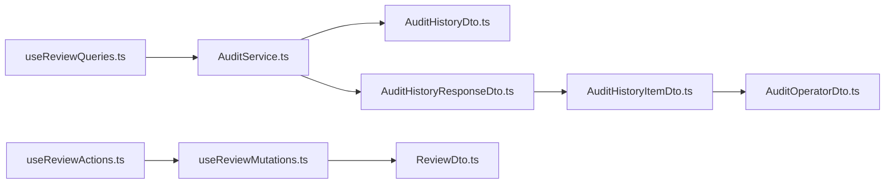

# 审计追踪系统

<cite>
**本文引用的文件**
- [AuditService.ts](file://src/api/services/AuditService.ts)
- [AuditHistoryDto.ts](file://src/api/models/AuditHistoryDto.ts)
- [AuditHistoryItemDto.ts](file://src/api/models/AuditHistoryItemDto.ts)
- [AuditHistoryResponseDto.ts](file://src/api/models/AuditHistoryResponseDto.ts)
- [AuditOperatorDto.ts](file://src/api/models/AuditOperatorDto.ts)
- [useReviewQueries.ts](file://src/modules/app/pages/Review/hooks/useReviewQueries.ts)
- [useReviewMutations.ts](file://src/modules/app/pages/Review/hooks/useReviewMutations.ts)
- [useReviewActions.ts](file://src/modules/app/pages/Review/hooks/useReviewActions.ts)
- [ReviewDto.ts](file://src/api/models/ReviewDto.ts)
</cite>

## 目录
1. [简介](#简介)
2. [项目结构](#项目结构)
3. [核心组件](#核心组件)
4. [架构总览](#架构总览)
5. [详细组件分析](#详细组件分析)
6. [依赖关系分析](#依赖关系分析)
7. [性能考虑](#性能考虑)
8. [故障排查指南](#故障排查指南)
9. [结论](#结论)
10. [附录](#附录)

## 简介
本文件面向审计追踪系统的实现与使用，聚焦于操作日志记录、用户行为追踪与管理员操作审计的前端集成方案。系统通过统一的审计历史查询接口，支持按资源类型与资源ID获取审核历史，并在内容审核界面中展示“操作类型”“操作人”“备注”“时间”等关键字段，便于管理员进行审计与复核。

## 项目结构
审计相关能力主要分布在以下位置：
- API 层：定义了审计历史查询接口与数据模型
- 应用层：在内容审核页面中调用审计接口并渲染历史记录
- 审计数据模型：描述审计记录的字段与取值范围

图表来源
- [AuditService.ts](file://src/api/services/AuditService.ts#L10-L39)
- [AuditHistoryDto.ts](file://src/api/models/AuditHistoryDto.ts#L5-L25)
- [AuditHistoryItemDto.ts](file://src/api/models/AuditHistoryItemDto.ts#L6-L38)
- [AuditHistoryResponseDto.ts](file://src/api/models/AuditHistoryResponseDto.ts#L6-L15)
- [AuditOperatorDto.ts](file://src/api/models/AuditOperatorDto.ts#L5-L18)

章节来源
- [AuditService.ts](file://src/api/services/AuditService.ts#L10-L39)
- [AuditHistoryDto.ts](file://src/api/models/AuditHistoryDto.ts#L5-L25)
- [AuditHistoryItemDto.ts](file://src/api/models/AuditHistoryItemDto.ts#L6-L38)
- [AuditHistoryResponseDto.ts](file://src/api/models/AuditHistoryResponseDto.ts#L6-L15)
- [AuditOperatorDto.ts](file://src/api/models/AuditOperatorDto.ts#L5-L18)

## 核心组件
- 审计服务类：封装审计历史查询接口，负责向后端发起请求并处理错误映射
- 审计历史查询模型：定义请求体的资源类型与资源ID
- 审计历史响应模型：定义返回的历史条目数组与总数
- 审计历史条目模型：定义每条审计记录的关键字段（操作类型、旧/新状态、备注、原因代码、时间、操作人）
- 审计操作人模型：定义操作人的标识与基本信息
- 审核页面查询钩子：在审核页面中根据资源类型与ID查询审计历史，并转换为前端可渲染的结构
- 审核动作钩子：封装审核批准/拒绝的提交流程，完成后触发相关查询失效

章节来源
- [AuditService.ts](file://src/api/services/AuditService.ts#L10-L39)
- [AuditHistoryDto.ts](file://src/api/models/AuditHistoryDto.ts#L5-L25)
- [AuditHistoryItemDto.ts](file://src/api/models/AuditHistoryItemDto.ts#L6-L38)
- [AuditHistoryResponseDto.ts](file://src/api/models/AuditHistoryResponseDto.ts#L6-L15)
- [AuditOperatorDto.ts](file://src/api/models/AuditOperatorDto.ts#L5-L18)
- [useReviewQueries.ts](file://src/modules/app/pages/Review/hooks/useReviewQueries.ts#L240-L280)
- [useReviewMutations.ts](file://src/modules/app/pages/Review/hooks/useReviewMutations.ts#L20-L47)
- [useReviewActions.ts](file://src/modules/app/pages/Review/hooks/useReviewActions.ts#L1-L37)

## 架构总览
下图展示了“审核页面”如何通过“审计服务”查询“审计历史”，并将其呈现给管理员：

图表来源
- [useReviewQueries.ts](file://src/modules/app/pages/Review/hooks/useReviewQueries.ts#L240-L280)
- [AuditService.ts](file://src/api/services/AuditService.ts#L17-L39)
- [AuditHistoryDto.ts](file://src/api/models/AuditHistoryDto.ts#L5-L25)
- [AuditHistoryResponseDto.ts](file://src/api/models/AuditHistoryResponseDto.ts#L6-L15)

## 详细组件分析

### 审计服务与接口
- 接口职责：提供按资源类型与资源ID查询审计历史的能力
- 请求体模型：包含资源类型与资源ID两个字段
- 响应模型：包含历史条目数组与总数
- 错误映射：对常见HTTP状态码进行语义化说明（参数错误、未认证、禁止访问、资源不存在、服务器错误）

图表来源
- [AuditService.ts](file://src/api/services/AuditService.ts#L10-L39)
- [AuditHistoryDto.ts](file://src/api/models/AuditHistoryDto.ts#L5-L25)
- [AuditHistoryResponseDto.ts](file://src/api/models/AuditHistoryResponseDto.ts#L6-L15)
- [AuditHistoryItemDto.ts](file://src/api/models/AuditHistoryItemDto.ts#L6-L38)
- [AuditOperatorDto.ts](file://src/api/models/AuditOperatorDto.ts#L5-L18)

章节来源
- [AuditService.ts](file://src/api/services/AuditService.ts#L10-L39)
- [AuditHistoryDto.ts](file://src/api/models/AuditHistoryDto.ts#L5-L25)
- [AuditHistoryItemDto.ts](file://src/api/models/AuditHistoryItemDto.ts#L6-L38)
- [AuditHistoryResponseDto.ts](file://src/api/models/AuditHistoryResponseDto.ts#L6-L15)
- [AuditOperatorDto.ts](file://src/api/models/AuditOperatorDto.ts#L5-L18)

### 审计历史数据结构与字段
- 审计记录字段
  - 记录ID：唯一标识
  - 操作类型：批准/拒绝
  - 旧状态与新状态：文本描述
  - 备注：可选文本
  - 原因代码：可选标识
  - 操作时间：标准时间格式
  - 操作人：包含用户ID、用户名与头像信息
- 资源类型
  - 支持种子、电影、剧集、歌单等类型枚举

图表来源
- [useReviewQueries.ts](file://src/modules/app/pages/Review/hooks/useReviewQueries.ts#L240-L280)
- [AuditHistoryDto.ts](file://src/api/models/AuditHistoryDto.ts#L19-L24)
- [AuditHistoryItemDto.ts](file://src/api/models/AuditHistoryItemDto.ts#L14-L34)
- [AuditOperatorDto.ts](file://src/api/models/AuditOperatorDto.ts#L9-L13)

章节来源
- [AuditHistoryItemDto.ts](file://src/api/models/AuditHistoryItemDto.ts#L6-L38)
- [AuditHistoryDto.ts](file://src/api/models/AuditHistoryDto.ts#L19-L24)
- [AuditOperatorDto.ts](file://src/api/models/AuditOperatorDto.ts#L5-L18)

### 审核页面中的审计集成
- 查询逻辑：根据资源类型与ID调用审计历史接口，将返回的历史条目映射为前端展示字段
- 审核动作：封装批准/拒绝提交流程，完成后使相关查询失效以刷新数据
- 行为追踪：通过“操作类型”“操作人”“时间”“备注”等字段形成管理员操作审计链路

图表来源
- [useReviewQueries.ts](file://src/modules/app/pages/Review/hooks/useReviewQueries.ts#L240-L280)
- [useReviewMutations.ts](file://src/modules/app/pages/Review/hooks/useReviewMutations.ts#L20-L47)
- [useReviewActions.ts](file://src/modules/app/pages/Review/hooks/useReviewActions.ts#L17-L37)
- [AuditService.ts](file://src/api/services/AuditService.ts#L17-L39)
- [ReviewDto.ts](file://src/api/models/ReviewDto.ts#L10-L18)

章节来源
- [useReviewQueries.ts](file://src/modules/app/pages/Review/hooks/useReviewQueries.ts#L240-L280)
- [useReviewMutations.ts](file://src/modules/app/pages/Review/hooks/useReviewMutations.ts#L20-L47)
- [useReviewActions.ts](file://src/modules/app/pages/Review/hooks/useReviewActions.ts#L17-L37)
- [AuditService.ts](file://src/api/services/AuditService.ts#L17-L39)
- [ReviewDto.ts](file://src/api/models/ReviewDto.ts#L10-L18)

## 依赖关系分析
- 审计服务依赖于审计历史查询模型与响应模型
- 审计历史条目依赖于操作人模型
- 审核页面查询钩子依赖于审计服务与模型
- 审核动作与提交流程依赖于审核模型与服务

图表来源
- [useReviewQueries.ts](file://src/modules/app/pages/Review/hooks/useReviewQueries.ts#L240-L280)
- [AuditService.ts](file://src/api/services/AuditService.ts#L17-L39)
- [AuditHistoryDto.ts](file://src/api/models/AuditHistoryDto.ts#L5-L25)
- [AuditHistoryResponseDto.ts](file://src/api/models/AuditHistoryResponseDto.ts#L6-L15)
- [AuditHistoryItemDto.ts](file://src/api/models/AuditHistoryItemDto.ts#L6-L38)
- [AuditOperatorDto.ts](file://src/api/models/AuditOperatorDto.ts#L5-L18)
- [useReviewMutations.ts](file://src/modules/app/pages/Review/hooks/useReviewMutations.ts#L20-L47)
- [useReviewActions.ts](file://src/modules/app/pages/Review/hooks/useReviewActions.ts#L17-L37)
- [ReviewDto.ts](file://src/api/models/ReviewDto.ts#L10-L18)

章节来源
- [useReviewQueries.ts](file://src/modules/app/pages/Review/hooks/useReviewQueries.ts#L240-L280)
- [AuditService.ts](file://src/api/services/AuditService.ts#L17-L39)
- [AuditHistoryDto.ts](file://src/api/models/AuditHistoryDto.ts#L5-L25)
- [AuditHistoryResponseDto.ts](file://src/api/models/AuditHistoryResponseDto.ts#L6-L15)
- [AuditHistoryItemDto.ts](file://src/api/models/AuditHistoryItemDto.ts#L6-L38)
- [AuditOperatorDto.ts](file://src/api/models/AuditOperatorDto.ts#L5-L18)
- [useReviewMutations.ts](file://src/modules/app/pages/Review/hooks/useReviewMutations.ts#L20-L47)
- [useReviewActions.ts](file://src/modules/app/pages/Review/hooks/useReviewActions.ts#L17-L37)
- [ReviewDto.ts](file://src/api/models/ReviewDto.ts#L10-L18)

## 性能考虑
- 查询缓存与分页：建议在前端使用查询缓存与合理的分页参数，避免重复请求
- 数据映射成本：历史列表映射为展示字段时，注意避免不必要的对象拷贝与DOM重排
- 批量刷新：审核动作成功后仅失效相关查询键，减少全量刷新带来的抖动
- 网络重试与超时：为审计接口配置合理的超时与重试策略，提升稳定性

## 故障排查指南
- 参数错误：检查请求体中的资源类型与资源ID是否正确
- 未认证/权限不足：确认登录状态与角色权限
- 资源不存在：确认资源ID有效且存在审计记录
- 服务器错误：关注后端日志与网络连通性

章节来源
- [AuditService.ts](file://src/api/services/AuditService.ts#L31-L37)

## 结论
本系统通过统一的审计历史查询接口，实现了对种子、电影、剧集、歌单等资源的审核历史记录展示，满足管理员对操作日志与行为追踪的需求。前端通过查询钩子与模型映射，将审计数据转化为直观的表格与统计视图，配合审核动作的自动刷新，形成完整的审计闭环。

## 附录
- 审计数据隐私保护建议
  - 对操作人头像等敏感字段进行最小化展示
  - 在导出或下载审计记录时，去除或脱敏个人身份信息
- 存储优化与长期保存
  - 对历史记录设置生命周期策略，定期归档或清理
  - 采用分页与索引优化，确保查询性能
- 查询与统计扩展
  - 支持按操作人、时间范围、操作类型等维度过滤
  - 提供导出功能，便于离线分析与合规审计