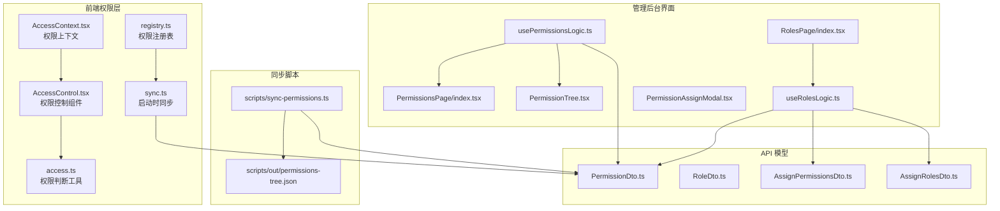
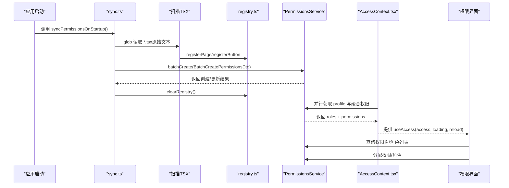
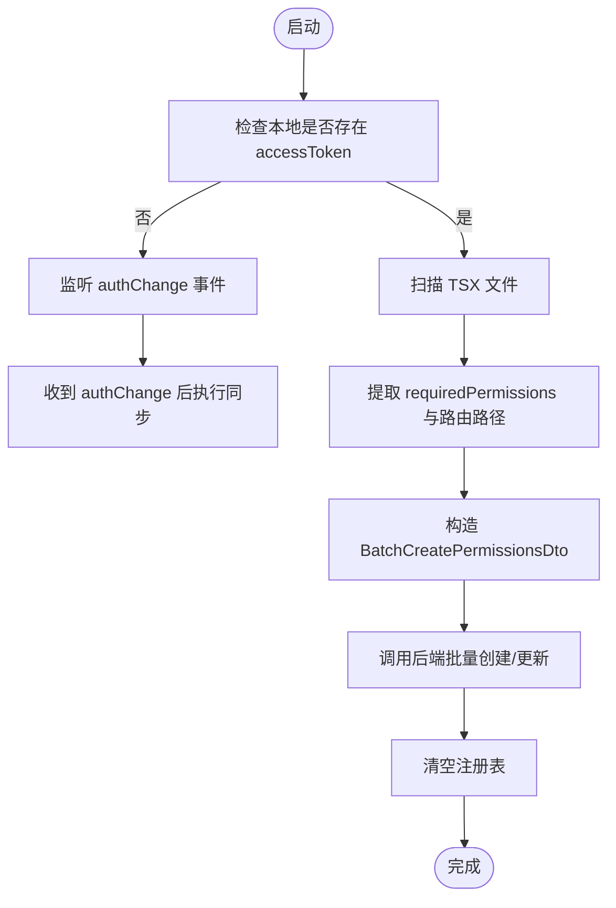
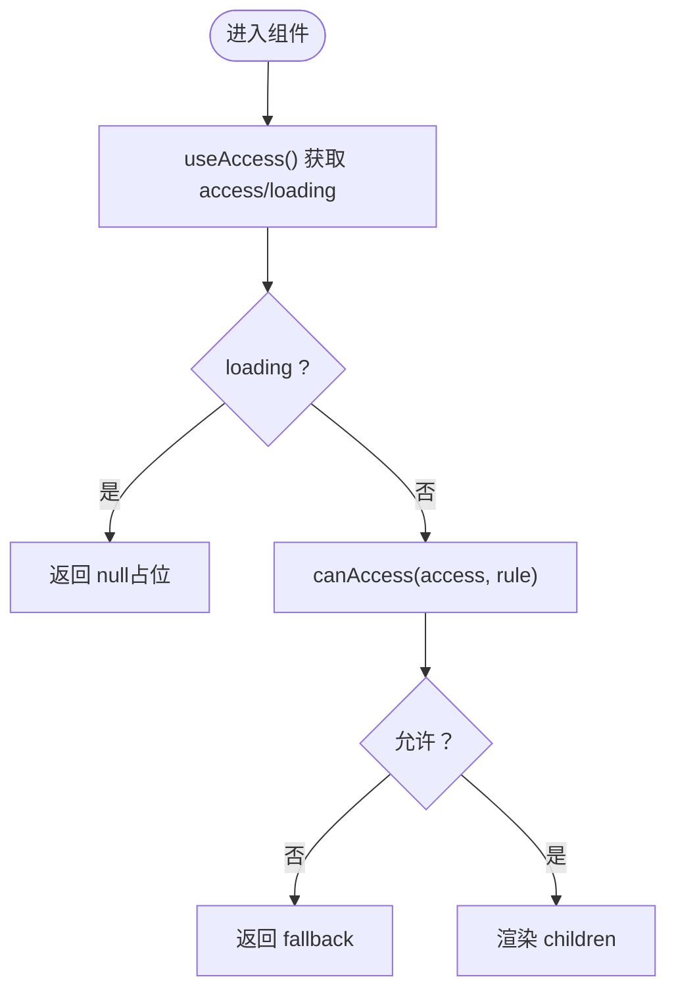
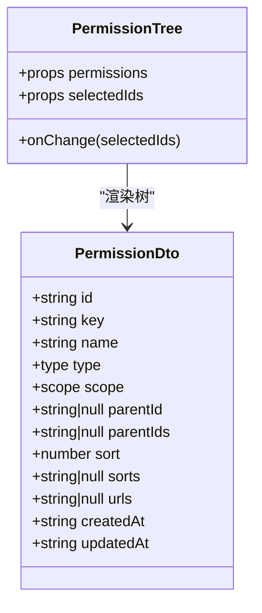
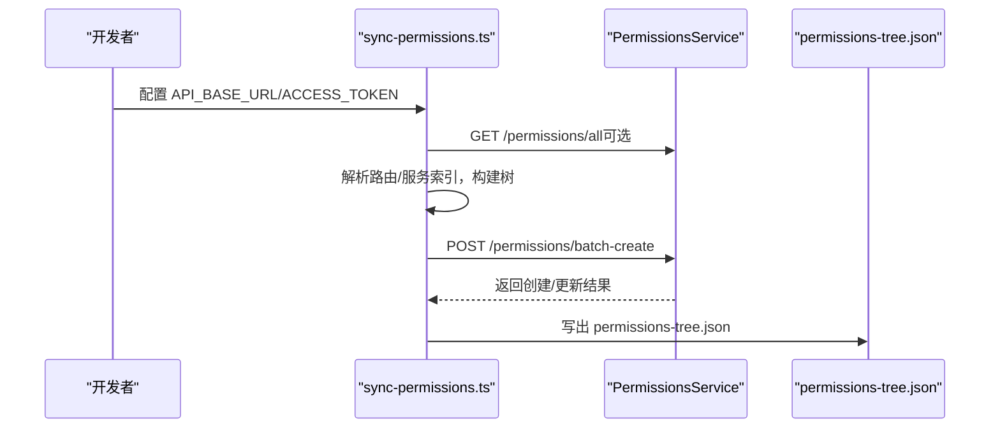
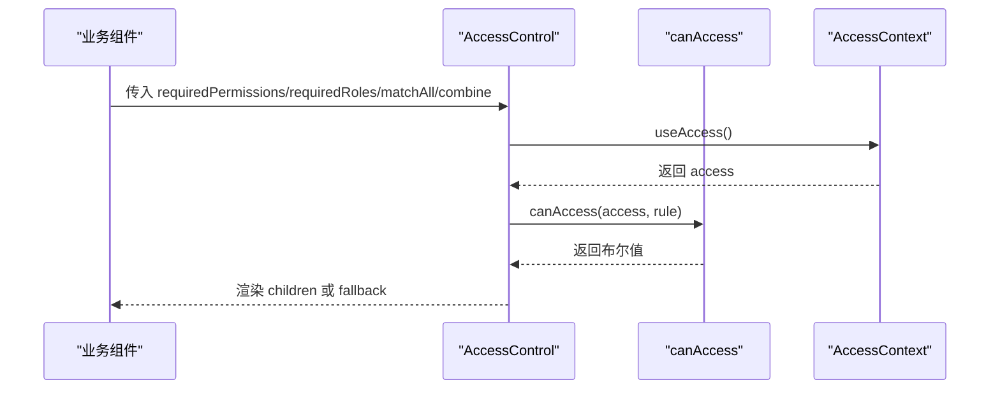
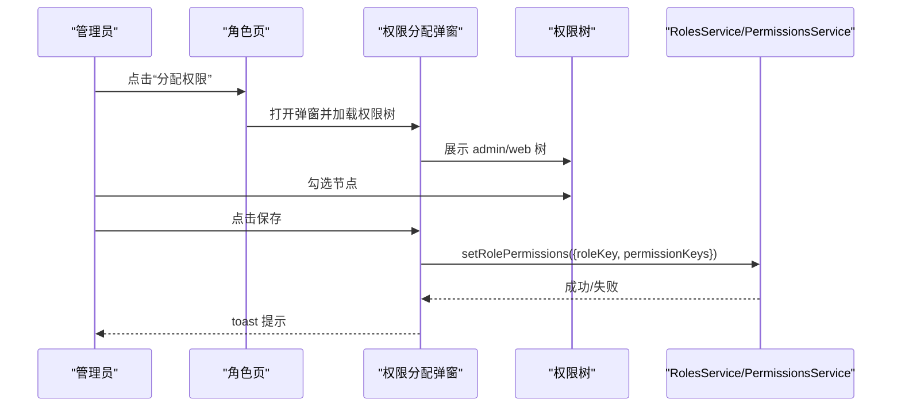
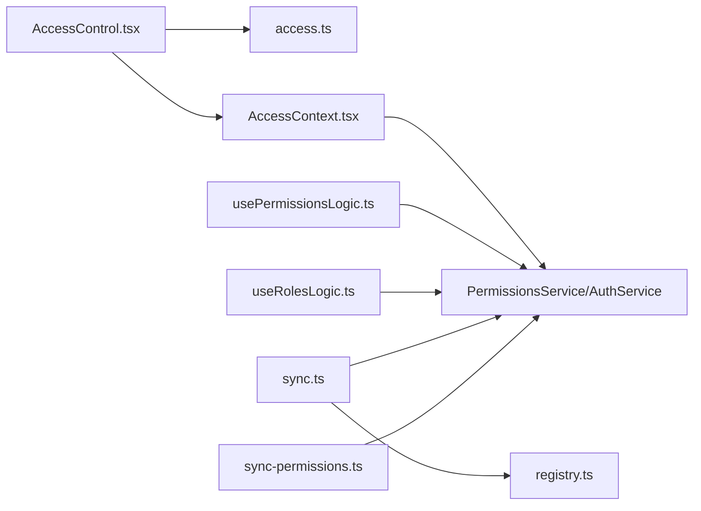

# 用户权限管理

<cite>
**本文引用的文件**
- [AccessControl.tsx](file://src/permissions/AccessControl.tsx)
- [registry.ts](file://src/permissions/registry.ts)
- [sync.ts](file://src/permissions/sync.ts)
- [AccessContext.tsx](file://src/context/AccessContext.tsx)
- [access.ts](file://src/utils/access.ts)
- [PermissionDto.ts](file://src/api/models/PermissionDto.ts)
- [RoleDto.ts](file://src/api/models/RoleDto.ts)
- [AssignPermissionsDto.ts](file://src/api/models/AssignPermissionsDto.ts)
- [AssignRolesDto.ts](file://src/api/models/AssignRolesDto.ts)
- [PermissionTree.tsx](file://src/modules/admin/pages/users-security/PermissionsPage/components/PermissionTree.tsx)
- [usePermissionsLogic.ts](file://src/modules/admin/pages/users-security/PermissionsPage/hooks/usePermissionsLogic.ts)
- [PermissionsPage/index.tsx](file://src/modules/admin/pages/users-security/PermissionsPage/index.tsx)
- [PermissionAssignModal.tsx](file://src/modules/admin/pages/users-security/PermissionsPage/components/PermissionAssignModal.tsx)
- [RolesPage/index.tsx](file://src/modules/admin/pages/users-security/RolesPage/index.tsx)
- [RolesPage/hooks/useRolesLogic.ts](file://src/modules/admin/pages/users-security/RolesPage/hooks/useRolesLogic.ts)
- [RolesPage/components/PermissionAssignModal.tsx](file://src/modules/admin/pages/users-security/RolesPage/components/PermissionAssignModal.tsx)
- [sync-permissions.ts](file://scripts/sync-permissions.ts)
- [permissions-tree.json](file://scripts/out/permissions-tree.json)
</cite>

## 目录
1. [简介](#简介)
2. [项目结构](#项目结构)
3. [核心组件](#核心组件)
4. [架构总览](#架构总览)
5. [详细组件分析](#详细组件分析)
6. [依赖分析](#依赖分析)
7. [性能考虑](#性能考虑)
8. [故障排查指南](#故障排查指南)
9. [结论](#结论)
10. [附录](#附录)

## 简介
本技术文档围绕用户权限管理服务，系统性阐述权限系统的设计架构、角色管理与权限分配机制，详解权限树结构、继承规则与动态同步策略，分析权限验证流程、访问控制组件与权限缓存策略，并给出权限管理界面（权限分配、角色编辑、权限查询）的实现要点与最佳实践。同时覆盖权限安全策略、审计与批量操作等关键主题。

## 项目结构
权限相关能力主要分布在以下区域：
- 前端权限注册与同步：src/permissions（registry、sync）
- 访问上下文与权限校验：src/context、src/utils
- 权限与角色模型：src/api/models
- 管理后台界面：src/modules/admin/pages/users-security（权限页、角色页）
- 权限同步脚本：scripts（sync-permissions.ts 及输出）

图表来源
- [registry.ts](file://src/permissions/registry.ts#L1-L129)
- [sync.ts](file://src/permissions/sync.ts#L1-L159)
- [AccessControl.tsx](file://src/permissions/AccessControl.tsx#L1-L43)
- [AccessContext.tsx](file://src/context/AccessContext.tsx#L1-L181)
- [access.ts](file://src/utils/access.ts#L1-L65)
- [PermissionTree.tsx](file://src/modules/admin/pages/users-security/PermissionsPage/components/PermissionTree.tsx#L1-L159)
- [usePermissionsLogic.ts](file://src/modules/admin/pages/users-security/PermissionsPage/hooks/usePermissionsLogic.ts#L1-L249)
- [PermissionsPage/index.tsx](file://src/modules/admin/pages/users-security/PermissionsPage/index.tsx#L1-L45)
- [RolesPage/index.tsx](file://src/modules/admin/pages/users-security/RolesPage/index.tsx#L86-L98)
- [RolesPage/hooks/useRolesLogic.ts](file://src/modules/admin/pages/users-security/RolesPage/hooks/useRolesLogic.ts#L1-L330)
- [RolesPage/components/PermissionAssignModal.tsx](file://src/modules/admin/pages/users-security/RolesPage/components/PermissionAssignModal.tsx#L1-L47)
- [sync-permissions.ts](file://scripts/sync-permissions.ts#L1-L718)
- [permissions-tree.json](file://scripts/out/permissions-tree.json#L1-L28)

章节来源
- [AccessControl.tsx](file://src/permissions/AccessControl.tsx#L1-L43)
- [registry.ts](file://src/permissions/registry.ts#L1-L129)
- [sync.ts](file://src/permissions/sync.ts#L1-L159)
- [AccessContext.tsx](file://src/context/AccessContext.tsx#L1-L181)
- [access.ts](file://src/utils/access.ts#L1-L65)
- [PermissionTree.tsx](file://src/modules/admin/pages/users-security/PermissionsPage/components/PermissionTree.tsx#L1-L159)
- [usePermissionsLogic.ts](file://src/modules/admin/pages/users-security/PermissionsPage/hooks/usePermissionsLogic.ts#L1-L249)
- [PermissionsPage/index.tsx](file://src/modules/admin/pages/users-security/PermissionsPage/index.tsx#L1-L45)
- [RolesPage/index.tsx](file://src/modules/admin/pages/users-security/RolesPage/index.tsx#L86-L98)
- [RolesPage/hooks/useRolesLogic.ts](file://src/modules/admin/pages/users-security/RolesPage/hooks/useRolesLogic.ts#L1-L330)
- [RolesPage/components/PermissionAssignModal.tsx](file://src/modules/admin/pages/users-security/RolesPage/components/PermissionAssignModal.tsx#L1-L47)
- [sync-permissions.ts](file://scripts/sync-permissions.ts#L1-L718)
- [permissions-tree.json](file://scripts/out/permissions-tree.json#L1-L28)

## 核心组件
- 权限注册表与批量同步
  - registry.ts：在应用启动或扫描阶段收集页面/按钮权限键，统一去重并导出批量创建 DTO。
  - sync.ts：启动时扫描 TSX 文件，提取权限键与路由路径，构造 BatchCreatePermissionsDto 并调用后端批量创建/更新接口；未登录时监听 authChange 事件再同步。
  - scripts/sync-permissions.ts：手动同步脚本，支持从路由与服务索引推导页面与按钮权限树，拉取后端 API 权限并合并，最终写出 permissions-tree.json。
- 访问上下文与权限判断
  - AccessContext.tsx：并行加载用户资料与聚合权限，暴露 reload、loading、error 等状态；监听 authChange 自动刷新。
  - access.ts：canAccess 实现权限与角色的组合判断，支持 matchAll 与 combine 策略。
  - AccessControl.tsx：基于 useAccess 与 canAccess 的权限控制组件，支持 fallback。
- 权限与角色模型
  - PermissionDto.ts：权限实体（含 key、type、scope、parentIds、sorts、urls 等）。
  - RoleDto.ts：角色实体（含 key、name、permissionsCount 等）。
  - AssignPermissionsDto.ts、AssignRolesDto.ts：权限/角色分配的请求体。
- 管理后台界面
  - 权限页：权限树展示、过滤、增删改、父子关系维护。
  - 角色页：角色列表、编辑、权限分配弹窗、权限树选择与保存。

章节来源
- [registry.ts](file://src/permissions/registry.ts#L1-L129)
- [sync.ts](file://src/permissions/sync.ts#L1-L159)
- [AccessContext.tsx](file://src/context/AccessContext.tsx#L1-L181)
- [access.ts](file://src/utils/access.ts#L1-L65)
- [AccessControl.tsx](file://src/permissions/AccessControl.tsx#L1-L43)
- [PermissionDto.ts](file://src/api/models/PermissionDto.ts#L1-L85)
- [RoleDto.ts](file://src/api/models/RoleDto.ts#L1-L36)
- [AssignPermissionsDto.ts](file://src/api/models/AssignPermissionsDto.ts#L1-L16)
- [AssignRolesDto.ts](file://src/api/models/AssignRolesDto.ts#L1-L16)
- [PermissionTree.tsx](file://src/modules/admin/pages/users-security/PermissionsPage/components/PermissionTree.tsx#L1-L159)
- [usePermissionsLogic.ts](file://src/modules/admin/pages/users-security/PermissionsPage/hooks/usePermissionsLogic.ts#L1-L249)
- [RolesPage/hooks/useRolesLogic.ts](file://src/modules/admin/pages/users-security/RolesPage/hooks/useRolesLogic.ts#L1-L330)

## 架构总览
权限系统从前端注册与同步开始，贯穿访问上下文、权限判断与管理后台界面，形成“前端扫描—后端聚合—前端展示—后台配置”的闭环。

图表来源
- [sync.ts](file://src/permissions/sync.ts#L17-L64)
- [registry.ts](file://src/permissions/registry.ts#L89-L101)
- [AccessContext.tsx](file://src/context/AccessContext.tsx#L83-L155)
- [PermissionsPage/index.tsx](file://src/modules/admin/pages/users-security/PermissionsPage/index.tsx#L12-L30)

## 详细组件分析

### 权限注册与动态同步
- 注册表（registry.ts）
  - 支持 registerPage(keys, routePath?, name?, description?) 与 registerButton(keys, location?, name?, description?)。
  - toBatchDto() 导出批量创建参数，包含 key、name、type、scope、description、urls。
  - clearRegistry()/getRegistrySnapshot() 用于清理与调试。
- 启动同步（sync.ts）
  - syncPermissionsOnStartup()：扫描 TSX、提取 requiredPermissions、构造 DTO、调用后端批量创建；未登录时监听 authChange。
  - scanProjectForPermissions()：使用 import.meta.glob 原始读取文件，正则匹配 PermissionRoute、AccessControl、canAccess 的 requiredPermissions。
- 手动同步脚本（scripts/sync-permissions.ts）
  - 递归扫描 src 下 .tsx，结合路由与服务索引推导页面/按钮/接口权限，构建树形结构并批量创建；输出 permissions-tree.json 供审计与可视化。

图表来源
- [sync.ts](file://src/permissions/sync.ts#L17-L64)
- [sync-permissions.ts](file://scripts/sync-permissions.ts#L62-L99)

章节来源
- [registry.ts](file://src/permissions/registry.ts#L1-L129)
- [sync.ts](file://src/permissions/sync.ts#L1-L159)
- [sync-permissions.ts](file://scripts/sync-permissions.ts#L1-L718)

### 访问上下文与权限判断
- AccessContext.tsx
  - 并行请求用户资料与聚合权限，优先使用聚合权限，失败时回退至 profile 中的权限。
  - 暴露 reload、loading、error，监听 authChange 自动刷新。
- access.ts
  - canAccess(access, rule)：支持 requiredPermissions、requiredRoles、matchAll（组内是否全满足）、combine（角色组与权限组关系 OR/AND）。
  - 特殊放行：用户名为 admin 直接通过。
- AccessControl.tsx
  - 包裹子组件，根据权限与角色决定渲染或 fallback。

图表来源
- [AccessControl.tsx](file://src/permissions/AccessControl.tsx#L25-L42)
- [access.ts](file://src/utils/access.ts#L16-L63)
- [AccessContext.tsx](file://src/context/AccessContext.tsx#L74-L155)

章节来源
- [AccessContext.tsx](file://src/context/AccessContext.tsx#L1-L181)
- [access.ts](file://src/utils/access.ts#L1-L65)
- [AccessControl.tsx](file://src/permissions/AccessControl.tsx#L1-L43)

### 权限树结构与继承规则
- 数据模型（PermissionDto.ts）
  - key 唯一键，type（PAGE/BUTTON/API）、scope（WEB/ADMIN）、parentId、parentIds、sort/sorts、urls（逗号分隔）。
- 权限树构建（usePermissionsLogic.ts）
  - 支持按 scope 查询树形结构，通过 parentId 与 key 路径推断父子关系，自动补全根节点并默认展开。
  - 支持按 type 过滤与全文检索（name/key/description）。
- 权限树选择（PermissionTree.tsx）
  - 展示树形结构，支持展开/折叠与勾选；勾选行为为“选中节点及其所有后代”。

图表来源
- [PermissionDto.ts](file://src/api/models/PermissionDto.ts#L5-L66)
- [PermissionTree.tsx](file://src/modules/admin/pages/users-security/PermissionsPage/components/PermissionTree.tsx#L9-L13)

章节来源
- [PermissionDto.ts](file://src/api/models/PermissionDto.ts#L1-L85)
- [usePermissionsLogic.ts](file://src/modules/admin/pages/users-security/PermissionsPage/hooks/usePermissionsLogic.ts#L54-L118)
- [PermissionTree.tsx](file://src/modules/admin/pages/users-security/PermissionsPage/components/PermissionTree.tsx#L1-L159)

### 动态权限同步与批量操作
- 前端启动同步（sync.ts）
  - 未登录时等待 authChange 再执行；成功后清空注册表，避免重复触发。
- 手动同步（scripts/sync-permissions.ts）
  - 从路由与服务索引推导页面/按钮/接口权限，构建树形结构并批量创建；输出 permissions-tree.json。
- 批量权限分配（RolesPage）
  - useRolesLogic.ts：并行加载权限树（admin/web），保存时将选中节点 ID 转换为 key，调用 rolesAclControllerSetRolePermissions。

图表来源
- [sync-permissions.ts](file://scripts/sync-permissions.ts#L62-L99)
- [sync-permissions.ts](file://scripts/sync-permissions.ts#L218-L260)
- [sync-permissions.ts](file://scripts/sync-permissions.ts#L459-L495)

章节来源
- [sync.ts](file://src/permissions/sync.ts#L17-L64)
- [sync-permissions.ts](file://scripts/sync-permissions.ts#L1-L718)
- [permissions-tree.json](file://scripts/out/permissions-tree.json#L1-L28)
- [RolesPage/hooks/useRolesLogic.ts](file://src/modules/admin/pages/users-security/RolesPage/hooks/useRolesLogic.ts#L172-L195)

### 权限验证流程与访问控制组件
- 权限验证流程
  - AccessContext.tsx：加载用户资料与聚合权限，暴露 access 与 reload。
  - AccessControl.tsx：在渲染前调用 canAccess(access, rule)，根据结果决定显示或 fallback。
- 规则策略
  - requiredPermissions/requiredRoles：必填权限/角色集合。
  - matchAll：组内是否要求全部满足（默认 true）。
  - combine：角色组与权限组关系（默认 AND，支持 OR）。
  - 特例：用户名为 admin 直接放行。

图表来源
- [AccessControl.tsx](file://src/permissions/AccessControl.tsx#L17-L42)
- [access.ts](file://src/utils/access.ts#L16-L63)
- [AccessContext.tsx](file://src/context/AccessContext.tsx#L178-L181)

章节来源
- [AccessControl.tsx](file://src/permissions/AccessControl.tsx#L1-L43)
- [access.ts](file://src/utils/access.ts#L1-L65)
- [AccessContext.tsx](file://src/context/AccessContext.tsx#L1-L181)

### 权限缓存策略
- 权限树缓存（useRolesLogic.ts）
  - 权限树查询 staleTime 设置为 5 分钟，减少频繁请求。
- 聚合权限加载（AccessContext.tsx）
  - 并行加载 profile 与聚合权限，失败时回退至 profile 权限，保证可用性。

章节来源
- [RolesPage/hooks/useRolesLogic.ts](file://src/modules/admin/pages/users-security/RolesPage/hooks/useRolesLogic.ts#L124-L125)
- [AccessContext.tsx](file://src/context/AccessContext.tsx#L102-L154)

### 权限管理界面实现
- 权限页（PermissionsPage）
  - usePermissionsLogic.ts：查询权限树/列表、过滤、增删改、父子关系维护。
  - PermissionTree.tsx：树形选择器，支持勾选节点及其后代。
  - PermissionsPage/index.tsx：页面容器，集成搜索、筛选、弹窗等。
- 角色页（RolesPage）
  - RolesPage/index.tsx：展示角色列表，打开权限分配弹窗。
  - PermissionAssignModal.tsx：admin/web 双树选择，保存时转换 ID 为 key。
  - useRolesLogic.ts：并行加载权限树，加载/保存角色权限，支持分页与搜索。

图表来源
- [RolesPage/index.tsx](file://src/modules/admin/pages/users-security/RolesPage/index.tsx#L86-L98)
- [RolesPage/components/PermissionAssignModal.tsx](file://src/modules/admin/pages/users-security/RolesPage/components/PermissionAssignModal.tsx#L23-L47)
- [RolesPage/hooks/useRolesLogic.ts](file://src/modules/admin/pages/users-security/RolesPage/hooks/useRolesLogic.ts#L216-L263)

章节来源
- [PermissionsPage/index.tsx](file://src/modules/admin/pages/users-security/PermissionsPage/index.tsx#L1-L45)
- [usePermissionsLogic.ts](file://src/modules/admin/pages/users-security/PermissionsPage/hooks/usePermissionsLogic.ts#L1-L249)
- [PermissionTree.tsx](file://src/modules/admin/pages/users-security/PermissionsPage/components/PermissionTree.tsx#L1-L159)
- [RolesPage/index.tsx](file://src/modules/admin/pages/users-security/RolesPage/index.tsx#L86-L98)
- [RolesPage/components/PermissionAssignModal.tsx](file://src/modules/admin/pages/users-security/RolesPage/components/PermissionAssignModal.tsx#L1-L47)
- [RolesPage/hooks/useRolesLogic.ts](file://src/modules/admin/pages/users-security/RolesPage/hooks/useRolesLogic.ts#L1-L330)

## 依赖分析
- 组件耦合
  - AccessControl 依赖 useAccess 与 canAccess，低耦合高内聚。
  - AccessContext 与 API 服务解耦，通过懒加载避免循环依赖。
  - 权限树组件与权限逻辑钩子分离，职责清晰。
- 外部依赖
  - 后端 API：权限树查询、聚合权限、角色权限分配、批量创建。
  - 脚本依赖：dotenv、axios、OpenAPI、服务索引构建。

图表来源
- [AccessControl.tsx](file://src/permissions/AccessControl.tsx#L1-L43)
- [access.ts](file://src/utils/access.ts#L1-L65)
- [AccessContext.tsx](file://src/context/AccessContext.tsx#L1-L181)
- [usePermissionsLogic.ts](file://src/modules/admin/pages/users-security/PermissionsPage/hooks/usePermissionsLogic.ts#L1-L249)
- [RolesPage/hooks/useRolesLogic.ts](file://src/modules/admin/pages/users-security/RolesPage/hooks/useRolesLogic.ts#L1-L330)
- [sync.ts](file://src/permissions/sync.ts#L1-L159)
- [registry.ts](file://src/permissions/registry.ts#L1-L129)
- [sync-permissions.ts](file://scripts/sync-permissions.ts#L1-L718)

章节来源
- [AccessControl.tsx](file://src/permissions/AccessControl.tsx#L1-L43)
- [access.ts](file://src/utils/access.ts#L1-L65)
- [AccessContext.tsx](file://src/context/AccessContext.tsx#L1-L181)
- [usePermissionsLogic.ts](file://src/modules/admin/pages/users-security/PermissionsPage/hooks/usePermissionsLogic.ts#L1-L249)
- [RolesPage/hooks/useRolesLogic.ts](file://src/modules/admin/pages/users-security/RolesPage/hooks/useRolesLogic.ts#L1-L330)
- [sync.ts](file://src/permissions/sync.ts#L1-L159)
- [registry.ts](file://src/permissions/registry.ts#L1-L129)
- [sync-permissions.ts](file://scripts/sync-permissions.ts#L1-L718)

## 性能考虑
- 权限树缓存：useRolesLogic.ts 设置 5 分钟 staleTime，降低请求频率。
- 并行加载：AccessContext.tsx 并行获取 profile 与聚合权限，提升首屏体验。
- 批量同步：前端与脚本均采用批量创建/更新，减少请求次数。
- 树构建优化：usePermissionsLogic.ts 通过 Map 与 Set 快速建立父子关系，避免深度遍历多次。

## 故障排查指南
- 启动同步失败
  - 现象：控制台警告“启动同步异常”或“批量创建接口调用失败”。
  - 排查：确认 accessToken 是否存在；检查 authChange 事件是否触发；核对后端批量创建接口可达性。
- 权限树为空
  - 现象：权限树/角色页无数据。
  - 排查：确认权限同步是否成功；检查后端 permissions/all 是否返回数据；核对 scope 与 type 参数。
- 权限分配无效
  - 现象：分配后权限未生效。
  - 排查：确认 roleKey 是否正确；检查 ID->Key 映射是否完整；确保保存时已转换为 key 列表。
- 访问控制不生效
  - 现象：组件未按预期显示/隐藏。
  - 排查：核对 requiredPermissions/requiredRoles/matchAll/combine；确认 useAccess 返回的 access 是否包含所需权限；检查用户名为 admin 的特例。

章节来源
- [sync.ts](file://src/permissions/sync.ts#L35-L64)
- [AccessContext.tsx](file://src/context/AccessContext.tsx#L157-L165)
- [RolesPage/hooks/useRolesLogic.ts](file://src/modules/admin/pages/users-security/RolesPage/hooks/useRolesLogic.ts#L243-L263)
- [AccessControl.tsx](file://src/permissions/AccessControl.tsx#L25-L42)

## 结论
本权限系统通过“前端注册与同步 + 上下文聚合 + 组件级校验 + 后台配置”的架构，实现了从开发期自动发现到运行期动态验证的全流程权限治理。配合权限树与角色体系，支持灵活的权限分配与批量操作，满足复杂场景下的权限管理需求。建议持续完善权限审计与变更追踪，确保权限治理的可追溯性与安全性。

## 附录
- 权限类型与范围
  - type：PAGE（页面）、BUTTON（按钮）、API（接口）
  - scope：WEB（前端）、ADMIN（管理端）
- 关键流程参考路径
  - 启动同步：[sync.ts](file://src/permissions/sync.ts#L17-L64)
  - 权限判断：[access.ts](file://src/utils/access.ts#L16-L63)
  - 权限树构建：[usePermissionsLogic.ts](file://src/modules/admin/pages/users-security/PermissionsPage/hooks/usePermissionsLogic.ts#L54-L118)
  - 角色权限分配：[RolesPage/hooks/useRolesLogic.ts](file://src/modules/admin/pages/users-security/RolesPage/hooks/useRolesLogic.ts#L243-L263)
  - 手动同步脚本：[sync-permissions.ts](file://scripts/sync-permissions.ts#L62-L99)