# 管理服务

<cite>
**本文引用的文件**
- [AccessControl.tsx](file://src/permissions/AccessControl.tsx)
- [registry.ts](file://src/permissions/registry.ts)
- [sync.ts](file://src/permissions/sync.ts)
- [AccessContext.tsx](file://src/context/AccessContext.tsx)
- [access.ts](file://src/utils/access.ts)
- [AdminLayout.tsx](file://src/modules/admin/layouts/AdminLayout.tsx)
- [PermissionsPage/index.tsx](file://src/modules/admin/pages/users-security/PermissionsPage/index.tsx)
- [RolesPage/index.tsx](file://src/modules/admin/pages/users-security/RolesPage/index.tsx)
- [TorrentsList/index.tsx](file://src/modules/admin/pages/content/torrents/TorrentsList/index.tsx)
- [TorrentsList/hooks/useTorrentsLogic.tsx](file://src/modules/admin/pages/content/torrents/TorrentsList/hooks/useTorrentsLogic.tsx)
- [BonusBatchAdjustPage/index.tsx](file://src/modules/admin/pages/economy/bonus/BonusBatchAdjustPage/index.tsx)
- [BonusBatchAdjustPage/hooks/useBonusBatchAdjustLogic.ts](file://src/modules/admin/pages/economy/bonus/BonusBatchAdjustPage/hooks/useBonusBatchAdjustLogic.ts)
- [SystemSettingsPage/index.tsx](file://src/modules/admin/pages/system/SystemSettingsPage/index.tsx)
- [SystemSettingsPage/types.ts](file://src/modules/admin/pages/system/SystemSettingsPage/types.ts)
- [StoreItemsPage/index.tsx](file://src/modules/admin/pages/economy/store/StoreItemsPage/index.tsx)
- [StoreOrdersPage/index.tsx](file://src/modules/admin/pages/economy/store/StoreOrdersPage/index.tsx)
- [TicketsPage/index.tsx](file://src/modules/admin/pages/operations/interaction/TicketsPage/index.tsx)
- [TicketsPage/hooks/useTicketsLogic.tsx](file://src/modules/admin/pages/operations/interaction/TicketsPage/hooks/useTicketsLogic.tsx)
- [AuditHistoryDto.ts](file://src/api/models/AuditHistoryDto.ts)
- [AuditHistoryItemDto.ts](file://src/api/models/AuditHistoryItemDto.ts)
- [AuditHistoryResponseDto.ts](file://src/api/models/AuditHistoryResponseDto.ts)
- [AuditOperatorDto.ts](file://src/api/models/AuditOperatorDto.ts)
- [ApiError.ts](file://src/api/core/ApiError.ts)
- [ApiResult.ts](file://src/api/core/ApiResult.ts)
- [request.ts](file://src/api/core/request.ts)
- [axiosInterceptors.ts](file://src/api/axiosInterceptors.ts)
- [guards.tsx](file://src/routes/guards.tsx)
- [AccessContext.tsx](file://src/context/AccessContext.tsx)
- [AccessControl.tsx](file://src/permissions/AccessControl.tsx)
- [access.ts](file://src/utils/access.ts)
</cite>

## 目录
1. [简介](#简介)
2. [项目结构](#项目结构)
3. [核心组件](#核心组件)
4. [架构总览](#架构总览)
5. [详细组件分析](#详细组件分析)
6. [依赖分析](#依赖分析)
7. [性能考虑](#性能考虑)
8. [故障排查指南](#故障排查指南)
9. [结论](#结论)
10. [附录](#附录)

## 简介
本技术文档面向管理服务，系统性阐述后台管理相关能力的实现与设计，覆盖内容审核、权限管理、用户管理、批量操作、审计日志、系统配置、数据统计与报表生成、管理界面数据流与状态同步、实时更新、安全策略与异常处理等主题。文档以代码为依据，结合可视化图示帮助读者快速理解与落地。

## 项目结构
管理服务位于前端模块化目录 src/modules/admin 下，采用按功能域划分的组织方式，包含布局、页面、组件、共享逻辑与工具。权限体系由前端权限注册、扫描与后端同步组成，并通过上下文与控制组件在运行时生效。

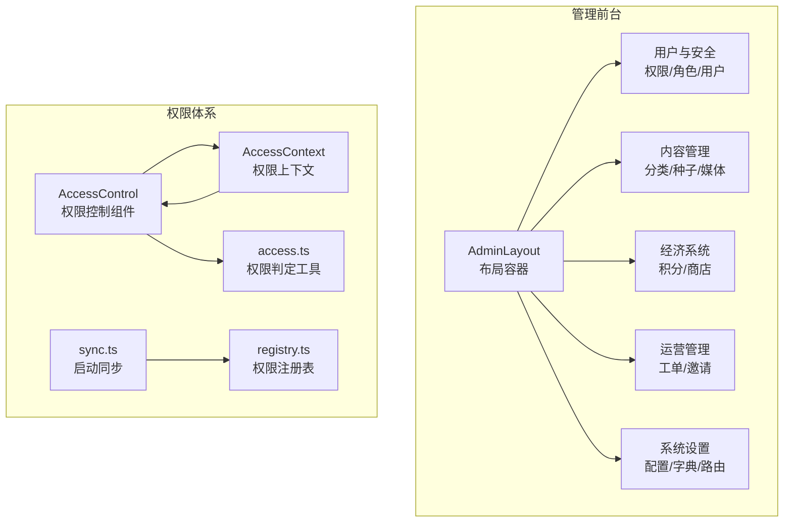

图表来源
- [AdminLayout.tsx](file://src/modules/admin/layouts/AdminLayout.tsx#L20-L94)
- [AccessControl.tsx](file://src/permissions/AccessControl.tsx#L17-L42)
- [registry.ts](file://src/permissions/registry.ts#L27-L101)
- [sync.ts](file://src/permissions/sync.ts#L17-L38)
- [AccessContext.tsx](file://src/context/AccessContext.tsx#L64-L172)
- [access.ts](file://src/utils/access.ts#L16-L63)

章节来源
- [AdminLayout.tsx](file://src/modules/admin/layouts/AdminLayout.tsx#L20-L94)
- [AccessControl.tsx](file://src/permissions/AccessControl.tsx#L17-L42)
- [registry.ts](file://src/permissions/registry.ts#L27-L101)
- [sync.ts](file://src/permissions/sync.ts#L17-L38)
- [AccessContext.tsx](file://src/context/AccessContext.tsx#L64-L172)
- [access.ts](file://src/utils/access.ts#L16-L63)

## 核心组件
- 权限控制组件：根据用户角色与权限集合，按策略匹配决定 UI 渲染与交互可用性。
- 权限注册与同步：在应用启动时扫描页面与按钮的权限键，批量创建/更新至后端。
- 权限上下文：统一拉取用户资料与聚合权限，提供全局访问状态与刷新能力。
- 管理布局：承载侧边菜单、标签页、KeepAlive、动态标题与图标等管理体验。
- 页面与逻辑：围绕权限、角色、用户、种子、积分、商店、工单、系统设置等业务域的页面与 Hooks。

章节来源
- [AccessControl.tsx](file://src/permissions/AccessControl.tsx#L17-L42)
- [registry.ts](file://src/permissions/registry.ts#L27-L101)
- [sync.ts](file://src/permissions/sync.ts#L17-L38)
- [AccessContext.tsx](file://src/context/AccessContext.tsx#L64-L172)
- [AdminLayout.tsx](file://src/modules/admin/layouts/AdminLayout.tsx#L20-L94)

## 架构总览
管理服务的权限与数据流由“前端权限体系 + 管理页面 + API 层 + 审计与异常处理”构成。权限体系在启动阶段完成注册与同步，运行时通过上下文与控制组件生效；页面通过 Hooks 管理状态与数据，结合表格、模态框、工具栏等 UI 组件实现批量操作与实时更新。

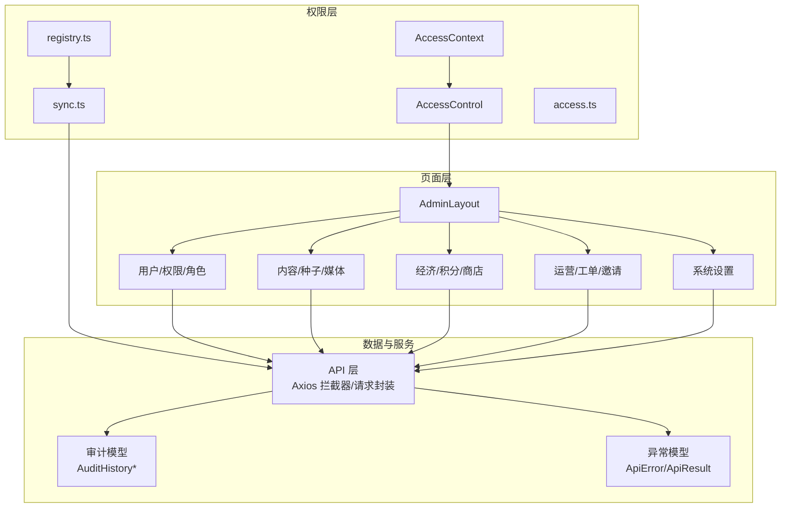

图表来源
- [registry.ts](file://src/permissions/registry.ts#L27-L101)
- [sync.ts](file://src/permissions/sync.ts#L17-L38)
- [AccessContext.tsx](file://src/context/AccessContext.tsx#L64-L172)
- [AccessControl.tsx](file://src/permissions/AccessControl.tsx#L17-L42)
- [access.ts](file://src/utils/access.ts#L16-L63)
- [AdminLayout.tsx](file://src/modules/admin/layouts/AdminLayout.tsx#L20-L94)
- [axiosInterceptors.ts](file://src/api/axiosInterceptors.ts)
- [request.ts](file://src/api/core/request.ts)
- [ApiError.ts](file://src/api/core/ApiError.ts)
- [ApiResult.ts](file://src/api/core/ApiResult.ts)
- [AuditHistoryDto.ts](file://src/api/models/AuditHistoryDto.ts)
- [AuditHistoryItemDto.ts](file://src/api/models/AuditHistoryItemDto.ts)
- [AuditHistoryResponseDto.ts](file://src/api/models/AuditHistoryResponseDto.ts)

## 详细组件分析

### 权限控制与上下文
- 权限控制组件：在加载完成前不渲染内容，基于规则计算是否允许访问，支持角色与权限的“与/或”组合与“全匹配/任一匹配”策略。
- 权限上下文：并行拉取用户资料与聚合权限，回退策略确保在部分接口异常时仍可展示用户名；提供 reload 以响应登录/登出事件。
- 权限判定工具：与后端动态路由策略一致，支持管理员豁免与灵活组合。

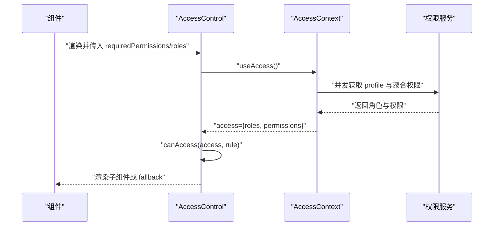

图表来源
- [AccessControl.tsx](file://src/permissions/AccessControl.tsx#L17-L42)
- [AccessContext.tsx](file://src/context/AccessContext.tsx#L83-L155)
- [access.ts](file://src/utils/access.ts#L16-L63)

章节来源
- [AccessControl.tsx](file://src/permissions/AccessControl.tsx#L17-L42)
- [AccessContext.tsx](file://src/context/AccessContext.tsx#L64-L172)
- [access.ts](file://src/utils/access.ts#L16-L63)

### 权限注册与启动同步
- 注册表：统一收集页面与按钮权限键，去重并导出批量创建 DTO。
- 启动同步：扫描项目源码提取权限键，按需发送批量创建请求；未登录时监听认证事件再同步；完成后清理注册表避免重复。

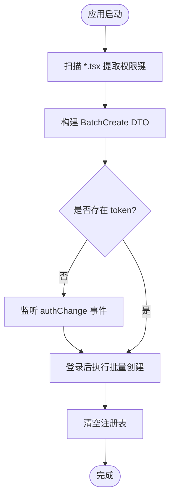

图表来源
- [sync.ts](file://src/permissions/sync.ts#L74-L115)
- [registry.ts](file://src/permissions/registry.ts#L89-L101)

章节来源
- [registry.ts](file://src/permissions/registry.ts#L27-L101)
- [sync.ts](file://src/permissions/sync.ts#L17-L38)
- [sync.ts](file://src/permissions/sync.ts#L74-L115)

### 管理布局与状态同步
- 布局：侧边栏折叠、标签页 KeepAlive、动态标题与图标注入、路由进度条。
- 状态同步：通过自定义事件在登录/登出时触发权限上下文刷新，保证 UI 与权限一致。

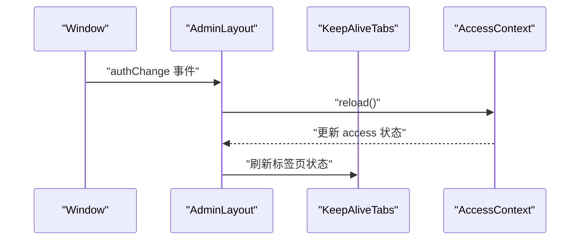

图表来源
- [AdminLayout.tsx](file://src/modules/admin/layouts/AdminLayout.tsx#L20-L94)
- [AccessContext.tsx](file://src/context/AccessContext.tsx#L157-L165)

章节来源
- [AdminLayout.tsx](file://src/modules/admin/layouts/AdminLayout.tsx#L20-L94)
- [AccessContext.tsx](file://src/context/AccessContext.tsx#L157-L165)

### 权限管理页面
- 权限树：支持关键词搜索、类型过滤、展开/收起、增删改、删除确认弹窗。
- 功能点：树形/列表视图切换、批量删除风险提示、添加根权限入口。

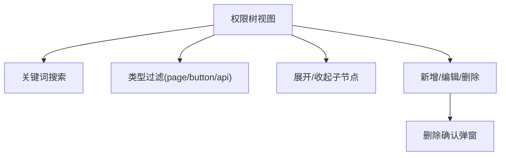

图表来源
- [PermissionsPage/index.tsx](file://src/modules/admin/pages/users-security/PermissionsPage/index.tsx#L42-L61)
- [PermissionsPage/index.tsx](file://src/modules/admin/pages/users-security/PermissionsPage/index.tsx#L148-L174)

章节来源
- [PermissionsPage/index.tsx](file://src/modules/admin/pages/users-security/PermissionsPage/index.tsx#L12-L177)

### 角色管理页面
- 角色表格：分页、搜索、新增/编辑/删除、分配权限。
- 权限分配：分别选择管理端与 Web 端权限集合，保存后更新角色权限。

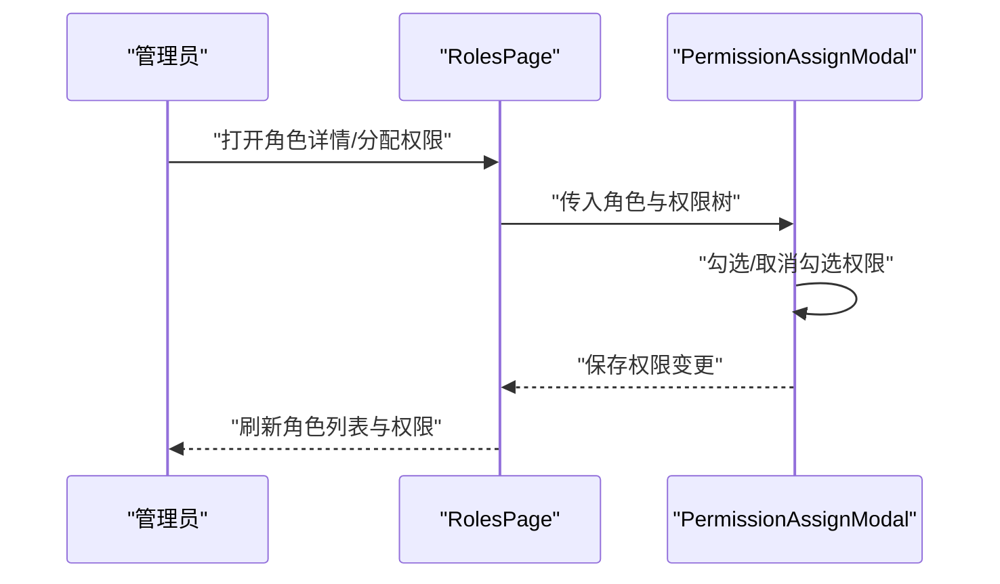

图表来源
- [RolesPage/index.tsx](file://src/modules/admin/pages/users-security/RolesPage/index.tsx#L6-L99)

章节来源
- [RolesPage/index.tsx](file://src/modules/admin/pages/users-security/RolesPage/index.tsx#L6-L99)

### 种子审核与内容管理
- 种子列表：高级搜索、工具栏、表格列、批量操作、审核弹窗。
- 审核流程：进入审核弹窗后，提交审核结果，列表刷新并联动状态变化。

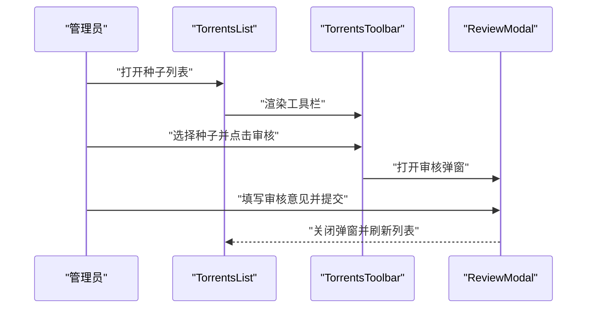

图表来源
- [TorrentsList/index.tsx](file://src/modules/admin/pages/content/torrents/TorrentsList/index.tsx)
- [TorrentsList/hooks/useTorrentsLogic.tsx](file://src/modules/admin/pages/content/torrents/TorrentsList/hooks/useTorrentsLogic.tsx)

章节来源
- [TorrentsList/index.tsx](file://src/modules/admin/pages/content/torrents/TorrentsList/index.tsx)
- [TorrentsList/hooks/useTorrentsLogic.tsx](file://src/modules/admin/pages/content/torrents/TorrentsList/hooks/useTorrentsLogic.tsx)

### 批量操作与批量调整
- 批量调整积分：导入面板、解析与校验、执行批量调整、结果汇总。
- 批量操作流程：上传文件 -> 预校验 -> 提交 -> 进度/结果反馈。

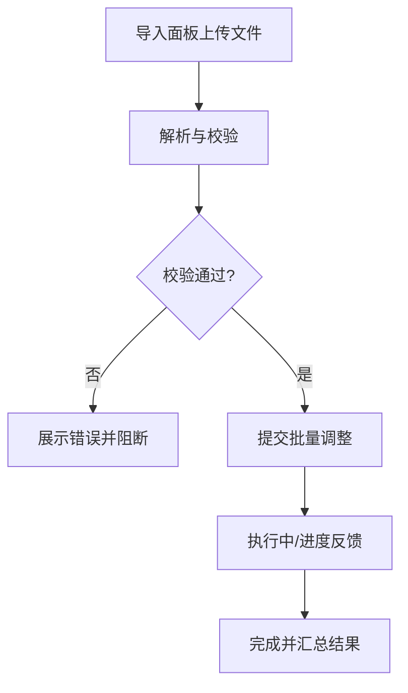

图表来源
- [BonusBatchAdjustPage/index.tsx](file://src/modules/admin/pages/economy/bonus/BonusBatchAdjustPage/index.tsx)
- [BonusBatchAdjustPage/hooks/useBonusBatchAdjustLogic.ts](file://src/modules/admin/pages/economy/bonus/BonusBatchAdjustPage/hooks/useBonusBatchAdjustLogic.ts)

章节来源
- [BonusBatchAdjustPage/index.tsx](file://src/modules/admin/pages/economy/bonus/BonusBatchAdjustPage/index.tsx)
- [BonusBatchAdjustPage/hooks/useBonusBatchAdjustLogic.ts](file://src/modules/admin/pages/economy/bonus/BonusBatchAdjustPage/hooks/useBonusBatchAdjustLogic.ts)

### 系统配置管理
- 系统设置页：按分组列出配置项，支持编辑与保存。
- 类型定义：配置项结构体与分组常量，便于统一管理。

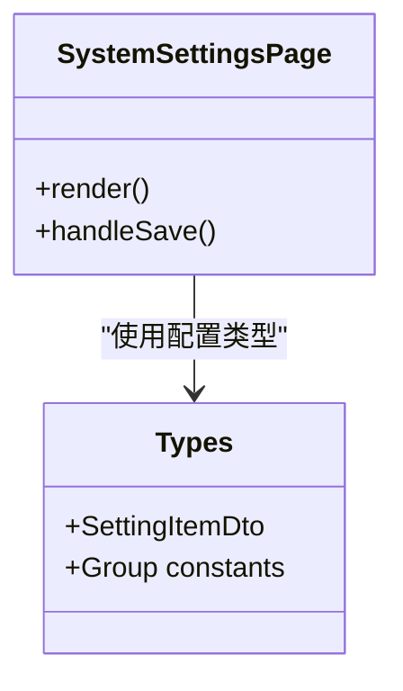

图表来源
- [SystemSettingsPage/index.tsx](file://src/modules/admin/pages/system/SystemSettingsPage/index.tsx)
- [SystemSettingsPage/types.ts](file://src/modules/admin/pages/system/SystemSettingsPage/types.ts)

章节来源
- [SystemSettingsPage/index.tsx](file://src/modules/admin/pages/system/SystemSettingsPage/index.tsx)
- [SystemSettingsPage/types.ts](file://src/modules/admin/pages/system/SystemSettingsPage/types.ts)

### 数据统计与报表
- 报表入口：工单/邀请/下载记录等页面提供筛选、导出与统计视图。
- 统计维度：时间范围、用户/种子维度、状态分布等，结合后端统计数据接口。

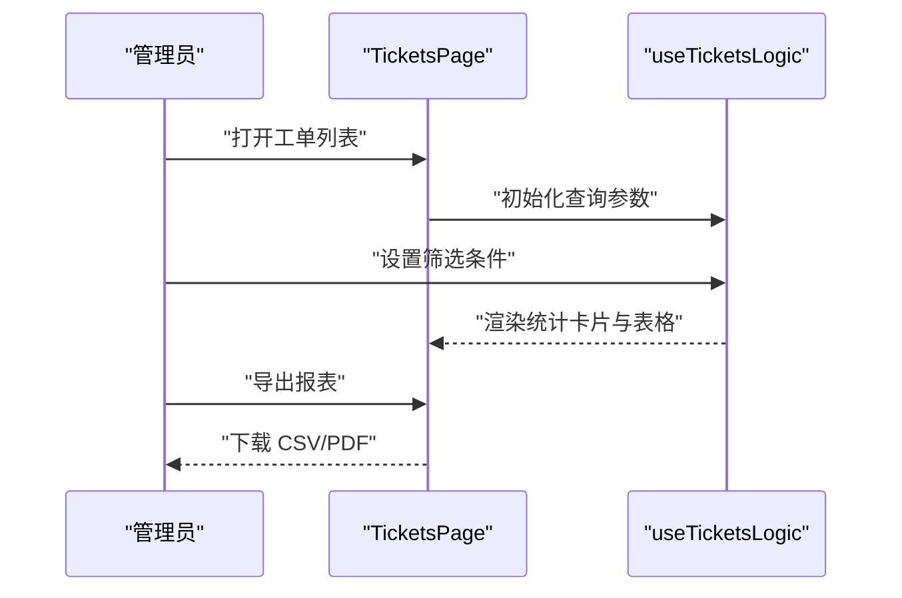

图表来源
- [TicketsPage/index.tsx](file://src/modules/admin/pages/operations/interaction/TicketsPage/index.tsx)
- [TicketsPage/hooks/useTicketsLogic.tsx](file://src/modules/admin/pages/operations/interaction/TicketsPage/hooks/useTicketsLogic.tsx)

章节来源
- [TicketsPage/index.tsx](file://src/modules/admin/pages/operations/interaction/TicketsPage/index.tsx)
- [TicketsPage/hooks/useTicketsLogic.tsx](file://src/modules/admin/pages/operations/interaction/TicketsPage/hooks/useTicketsLogic.tsx)

### 审计日志与操作记录
- 审计模型：包含审计历史、单项、操作者、分页响应等结构。
- 应用场景：种子审核、权限变更、角色调整、系统配置修改等均应记录审计日志。

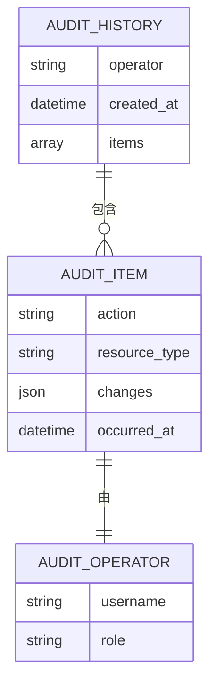

图表来源
- [AuditHistoryDto.ts](file://src/api/models/AuditHistoryDto.ts)
- [AuditHistoryItemDto.ts](file://src/api/models/AuditHistoryItemDto.ts)
- [AuditOperatorDto.ts](file://src/api/models/AuditOperatorDto.ts)
- [AuditHistoryResponseDto.ts](file://src/api/models/AuditHistoryResponseDto.ts)

章节来源
- [AuditHistoryDto.ts](file://src/api/models/AuditHistoryDto.ts)
- [AuditHistoryItemDto.ts](file://src/api/models/AuditHistoryItemDto.ts)
- [AuditOperatorDto.ts](file://src/api/models/AuditOperatorDto.ts)
- [AuditHistoryResponseDto.ts](file://src/api/models/AuditHistoryResponseDto.ts)

### 管理界面数据流、状态同步与实时更新
- 数据流：页面通过 Hooks 管理本地状态与远程数据，使用表格组件展示，工具栏触发批量操作。
- 状态同步：登录/登出事件触发权限上下文刷新；标签页 KeepAlive 保障多页签状态持久化。
- 实时更新：种子审核、积分调整、角色权限变更等操作完成后刷新列表与统计。

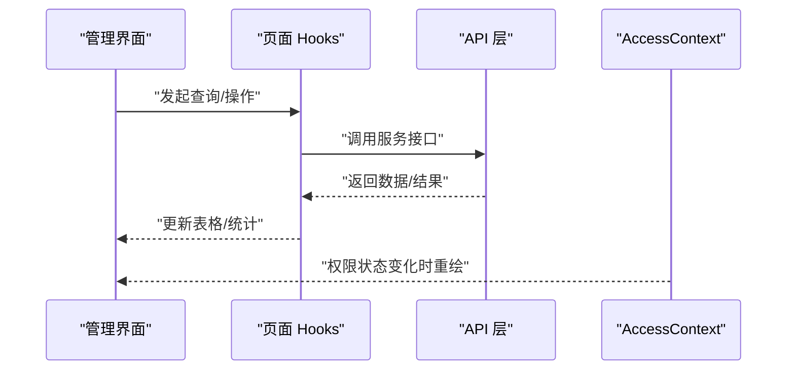

图表来源
- [AccessContext.tsx](file://src/context/AccessContext.tsx#L157-L165)
- [TorrentsList/hooks/useTorrentsLogic.tsx](file://src/modules/admin/pages/content/torrents/TorrentsList/hooks/useTorrentsLogic.tsx)
- [BonusBatchAdjustPage/hooks/useBonusBatchAdjustLogic.ts](file://src/modules/admin/pages/economy/bonus/BonusBatchAdjustPage/hooks/useBonusBatchAdjustLogic.ts)

章节来源
- [AccessContext.tsx](file://src/context/AccessContext.tsx#L157-L165)
- [TorrentsList/hooks/useTorrentsLogic.tsx](file://src/modules/admin/pages/content/torrents/TorrentsList/hooks/useTorrentsLogic.tsx)
- [BonusBatchAdjustPage/hooks/useBonusBatchAdjustLogic.ts](file://src/modules/admin/pages/economy/bonus/BonusBatchAdjustPage/hooks/useBonusBatchAdjustLogic.ts)

### 安全策略与异常处理
- 安全策略：管理员用户名豁免检查；权限判定与角色/权限组合策略；路由守卫与动态权限。
- 异常处理：API 层统一错误封装与拦截器处理；页面层对加载失败与网络异常进行降级提示。

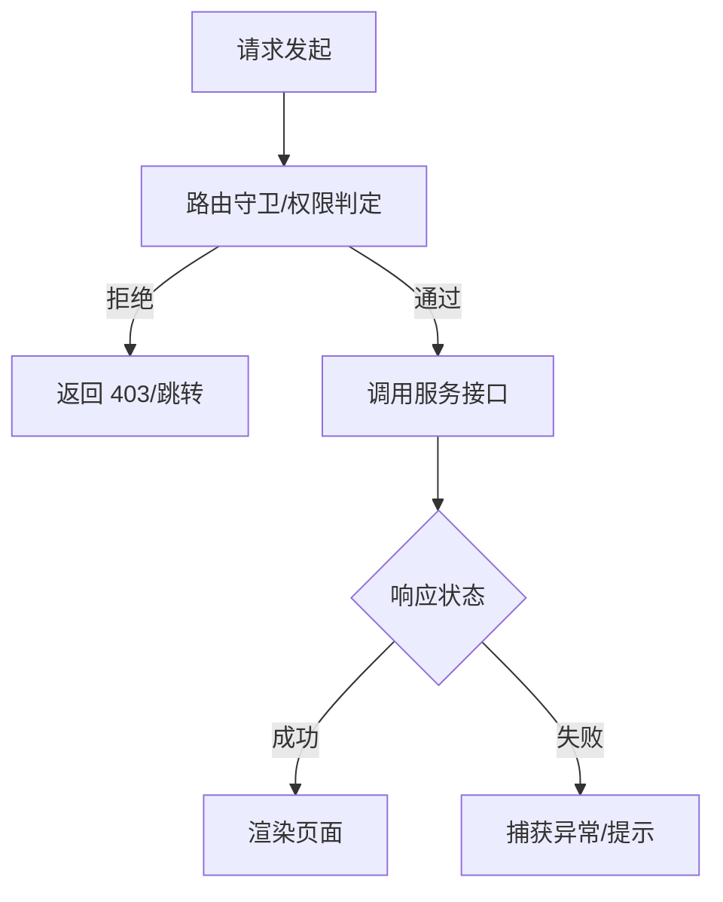

图表来源
- [access.ts](file://src/utils/access.ts#L28-L29)
- [ApiError.ts](file://src/api/core/ApiError.ts)
- [ApiResult.ts](file://src/api/core/ApiResult.ts)
- [axiosInterceptors.ts](file://src/api/axiosInterceptors.ts)
- [guards.tsx](file://src/routes/guards.tsx)

章节来源
- [access.ts](file://src/utils/access.ts#L28-L29)
- [ApiError.ts](file://src/api/core/ApiError.ts)
- [ApiResult.ts](file://src/api/core/ApiResult.ts)
- [axiosInterceptors.ts](file://src/api/axiosInterceptors.ts)
- [guards.tsx](file://src/routes/guards.tsx)

## 依赖分析
- 组件耦合：权限控制组件依赖权限上下文与判定工具；页面依赖对应 Hooks 与 UI 组件；布局依赖路由配置与 KeepAlive。
- 外部依赖：API 层提供统一请求封装与拦截器；模型定义支撑审计与配置等数据结构。
- 循环依赖规避：懒加载服务与并行请求避免初始化阶段的循环依赖问题。

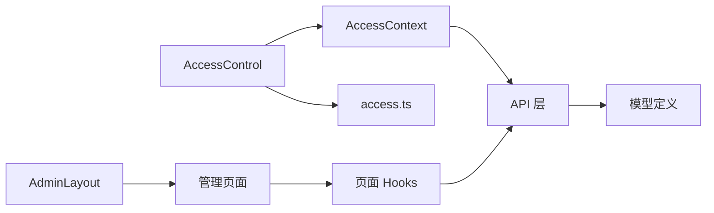

图表来源
- [AccessControl.tsx](file://src/permissions/AccessControl.tsx#L25-L35)
- [AccessContext.tsx](file://src/context/AccessContext.tsx#L96-L99)
- [AdminLayout.tsx](file://src/modules/admin/layouts/AdminLayout.tsx#L20-L94)
- [request.ts](file://src/api/core/request.ts)
- [axiosInterceptors.ts](file://src/api/axiosInterceptors.ts)

章节来源
- [AccessControl.tsx](file://src/permissions/AccessControl.tsx#L25-L35)
- [AccessContext.tsx](file://src/context/AccessContext.tsx#L96-L99)
- [AdminLayout.tsx](file://src/modules/admin/layouts/AdminLayout.tsx#L20-L94)
- [request.ts](file://src/api/core/request.ts)
- [axiosInterceptors.ts](file://src/api/axiosInterceptors.ts)

## 性能考虑
- 并行加载：权限上下文并行获取用户资料与聚合权限，减少首屏等待。
- 懒加载服务：避免模块间循环依赖与初始包体积膨胀。
- KeepAlive：多标签页缓存减少重复渲染与请求。
- 批量操作：批量导入与调整采用分步校验与进度反馈，降低卡顿感。

## 故障排查指南
- 权限不生效
  - 检查启动同步是否完成，确认权限键已注册并发送至后端。
  - 确认登录状态与 token 是否存在，监听 authChange 事件是否触发 reload。
- 页面空白或闪烁
  - 检查权限上下文 loading 状态，确保在加载完成前不渲染敏感内容。
- 审计日志缺失
  - 确认相关操作是否记录审计；核对审计模型字段与后端接口一致性。
- 批量导入失败
  - 检查文件格式与解析规则；查看校验错误与提交失败原因。

章节来源
- [sync.ts](file://src/permissions/sync.ts#L23-L34)
- [AccessContext.tsx](file://src/context/AccessContext.tsx#L73-L74)
- [AccessContext.tsx](file://src/context/AccessContext.tsx#L157-L165)
- [AuditHistoryDto.ts](file://src/api/models/AuditHistoryDto.ts)
- [BonusBatchAdjustPage/hooks/useBonusBatchAdjustLogic.ts](file://src/modules/admin/pages/economy/bonus/BonusBatchAdjustPage/hooks/useBonusBatchAdjustLogic.ts)

## 结论
管理服务通过完善的权限体系、清晰的页面职责与健壮的 API 支撑，实现了内容审核、权限管理、用户管理、批量操作、审计日志与系统配置等核心能力。配合布局与状态管理，提供了良好的用户体验与可维护性。建议持续完善审计日志覆盖与异常监控，进一步提升系统的可观测性与安全性。

## 附录
- 关键模型与类型：权限树、角色、用户、种子、积分、商店订单、工单、系统配置、审计历史等。
- 常用工具：权限判定、注册表、启动同步、动态标题与图标、KeepAlive 标签页。