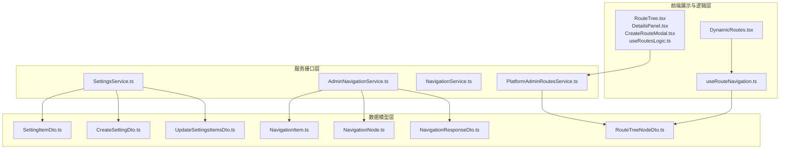
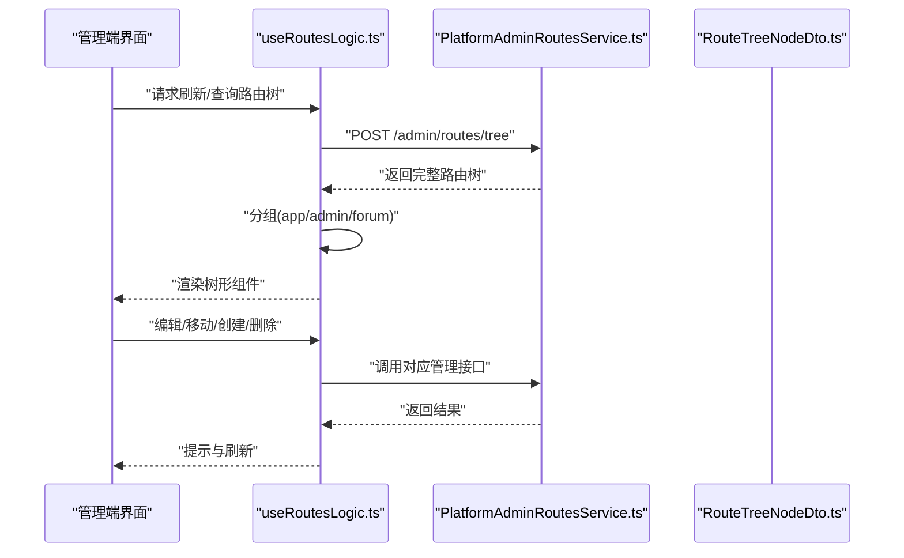
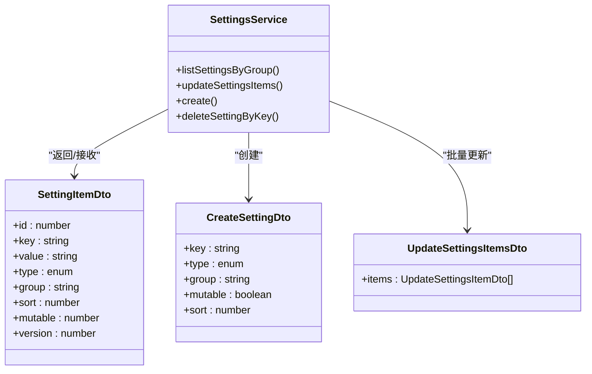
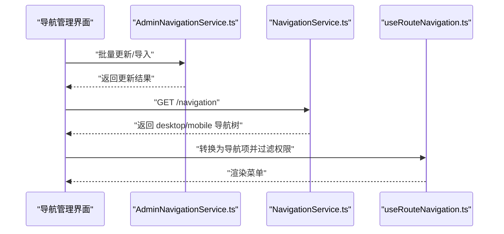
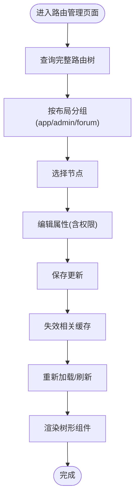
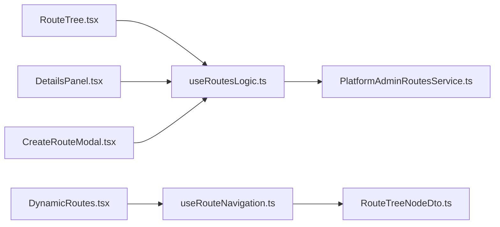

# 系统配置管理

<cite>
**本文引用的文件**
- [SettingItemDto.ts](file://src/api/models/SettingItemDto.ts)
- [CreateSettingDto.ts](file://src/api/models/CreateSettingDto.ts)
- [UpdateSettingsItemsDto.ts](file://src/api/models/UpdateSettingsItemsDto.ts)
- [SettingsService.ts](file://src/api/services/SettingsService.ts)
- [NavigationItem.ts](file://src/api/models/NavigationItem.ts)
- [NavigationNode.ts](file://src/api/models/NavigationNode.ts)
- [NavigationResponseDto.ts](file://src/api/models/NavigationResponseDto.ts)
- [AdminNavigationService.ts](file://src/api/services/AdminNavigationService.ts)
- [NavigationService.ts](file://src/api/services/NavigationService.ts)
- [RouteTreeNodeDto.ts](file://src/api/models/RouteTreeNodeDto.ts)
- [PlatformAdminRoutesService.ts](file://src/api/services/PlatformAdminRoutesService.ts)
- [DynamicRoutes.tsx](file://src/routes/DynamicRoutes.tsx)
- [useRouteNavigation.ts](file://src/hooks/useRouteNavigation.ts)
- [RouteTree.tsx](file://src/modules/admin/pages/system/routes/components/RouteTree.tsx)
- [DetailsPanel.tsx](file://src/modules/admin/pages/system/routes/components/DetailsPanel.tsx)
- [CreateRouteModal.tsx](file://src/modules/admin/pages/system/routes/components/CreateRouteModal.tsx)
- [useRoutesLogic.ts](file://src/modules/admin/pages/system/routes/hooks/useRoutesLogic.ts)
- [dynamic-routes-api.md](file://docs/dev/dynamic-routes-api.md)
</cite>

## 目录
1. [简介](#简介)
2. [项目结构](#项目结构)
3. [核心组件](#核心组件)
4. [架构总览](#架构总览)
5. [详细组件分析](#详细组件分析)
6. [依赖关系分析](#依赖关系分析)
7. [性能考虑](#性能考虑)
8. [故障排查指南](#故障排查指南)
9. [结论](#结论)
10. [附录](#附录)

## 简介
本技术文档围绕系统配置管理服务展开，重点覆盖以下方面：
- 系统设置管理：配置项的数据结构、分组与排序、动态加载与持久化。
- 导航菜单配置：桌面端/移动端导航树结构、可视化编辑与批量更新。
- 路由权限绑定：动态路由树、权限字段与前端渲染过滤。
- 配置变更生效机制、缓存策略与版本控制。
- 配置管理界面：设置编辑、导航配置与权限绑定的实现。
- 配置备份恢复、批量配置与配置验证的技术方案。

## 项目结构
系统配置管理涉及三层：
- 数据模型层：定义配置项、导航节点、路由树等数据结构。
- 服务接口层：提供设置、导航、路由的增删改查与批量操作。
- 前端展示与逻辑层：动态路由渲染、导航过滤、可视化配置界面。

**图表来源**
- [SettingItemDto.ts](file://src/api/models/SettingItemDto.ts#L1-L40)
- [CreateSettingDto.ts](file://src/api/models/CreateSettingDto.ts#L1-L46)
- [UpdateSettingsItemsDto.ts](file://src/api/models/UpdateSettingsItemsDto.ts#L1-L13)
- [SettingsService.ts](file://src/api/services/SettingsService.ts#L1-L155)
- [NavigationItem.ts](file://src/api/models/NavigationItem.ts#L1-L8)
- [NavigationNode.ts](file://src/api/models/NavigationNode.ts#L1-L12)
- [NavigationResponseDto.ts](file://src/api/models/NavigationResponseDto.ts#L1-L17)
- [AdminNavigationService.ts](file://src/api/services/AdminNavigationService.ts#L1-L148)
- [NavigationService.ts](file://src/api/services/NavigationService.ts#L1-L27)
- [RouteTreeNodeDto.ts](file://src/api/models/RouteTreeNodeDto.ts#L1-L75)
- [PlatformAdminRoutesService.ts](file://src/api/services/PlatformAdminRoutesService.ts#L1-L34)
- [DynamicRoutes.tsx](file://src/routes/DynamicRoutes.tsx#L254-L307)
- [useRouteNavigation.ts](file://src/hooks/useRouteNavigation.ts#L45-L92)
- [RouteTree.tsx](file://src/modules/admin/pages/system/routes/components/RouteTree.tsx#L1-L33)
- [DetailsPanel.tsx](file://src/modules/admin/pages/system/routes/components/DetailsPanel.tsx#L1-L33)
- [CreateRouteModal.tsx](file://src/modules/admin/pages/system/routes/components/CreateRouteModal.tsx#L32-L129)
- [useRoutesLogic.ts](file://src/modules/admin/pages/system/routes/hooks/useRoutesLogic.ts#L1-L113)

**章节来源**
- [SettingItemDto.ts](file://src/api/models/SettingItemDto.ts#L1-L40)
- [RouteTreeNodeDto.ts](file://src/api/models/RouteTreeNodeDto.ts#L1-L75)
- [NavigationResponseDto.ts](file://src/api/models/NavigationResponseDto.ts#L1-L17)

## 核心组件
- 设置项模型与服务
  - SettingItemDto：定义配置项的键、值、类型、分组、排序、可变性、版本号等字段。
  - SettingsService：提供按分组列出、批量更新、新增、删除等接口。
- 导航模型与服务
  - NavigationResponseDto：包含桌面端/移动端两套导航树。
  - AdminNavigationService：提供导航项的增删改查与批量更新、导入导出。
- 路由模型与服务
  - RouteTreeNodeDto：定义路由树节点的路径、组件、布局、权限、可见性、启用状态等。
  - PlatformAdminRoutesService：提供完整路由树查询与管理端操作接口。
- 前端动态路由与导航
  - DynamicRoutes.tsx：基于动态配置渲染路由元素。
  - useRouteNavigation.ts：将路由树转换为导航项并进行权限过滤。

**章节来源**
- [SettingsService.ts](file://src/api/services/SettingsService.ts#L1-L155)
- [AdminNavigationService.ts](file://src/api/services/AdminNavigationService.ts#L1-L148)
- [PlatformAdminRoutesService.ts](file://src/api/services/PlatformAdminRoutesService.ts#L1-L34)
- [DynamicRoutes.tsx](file://src/routes/DynamicRoutes.tsx#L254-L307)
- [useRouteNavigation.ts](file://src/hooks/useRouteNavigation.ts#L45-L92)

## 架构总览
系统配置管理采用“模型-服务-前端”三层协作：
- 模型层：通过 TypeScript DTO 描述配置项、导航与路由的结构。
- 服务层：通过 OpenAPI 生成的服务类封装 HTTP 请求，提供统一的 CRUD 与批量操作。
- 前端层：通过 React Query 进行数据拉取与缓存，结合自定义 Hook 实现动态渲染与权限过滤。

**图表来源**
- [useRoutesLogic.ts](file://src/modules/admin/pages/system/routes/hooks/useRoutesLogic.ts#L1-L113)
- [PlatformAdminRoutesService.ts](file://src/api/services/PlatformAdminRoutesService.ts#L1-L34)
- [RouteTreeNodeDto.ts](file://src/api/models/RouteTreeNodeDto.ts#L1-L75)

## 详细组件分析

### 系统设置管理
- 数据结构
  - 键值对与类型：键名、字符串/数值/布尔/JSON/时间戳/比率/密码等类型。
  - 分组与排序：按 group 分组，sort 决定同组内顺序。
  - 可变性与版本：mutable 控制是否允许运行时修改；version 支持版本控制。
  - 元信息：description、comment、updatedBy 等便于审计与说明。
- 分组管理与动态加载
  - 通过按分组列表接口获取指定分组的设置项，前端按分组聚合展示。
  - 支持按需加载与懒加载，避免一次性加载全部配置。
- 变更生效机制
  - 批量更新接口仅更新值，不支持重命名；新增接口仅当键不存在时创建。
  - 版本号可用于冲突检测与并发控制。
- 缓存策略
  - 建议在前端使用查询缓存与失效策略，变更后主动失效相关分组的缓存。
- 验证与备份
  - 建议在前端对输入进行 schema 校验（jsonSchema 字段可辅助）。
  - 支持导出/导入配置，便于备份与迁移。

**图表来源**
- [SettingItemDto.ts](file://src/api/models/SettingItemDto.ts#L1-L40)
- [CreateSettingDto.ts](file://src/api/models/CreateSettingDto.ts#L1-L46)
- [UpdateSettingsItemsDto.ts](file://src/api/models/UpdateSettingsItemsDto.ts#L1-L13)
- [SettingsService.ts](file://src/api/services/SettingsService.ts#L1-L155)

**章节来源**
- [SettingItemDto.ts](file://src/api/models/SettingItemDto.ts#L1-L40)
- [CreateSettingDto.ts](file://src/api/models/CreateSettingDto.ts#L1-L46)
- [UpdateSettingsItemsDto.ts](file://src/api/models/UpdateSettingsItemsDto.ts#L1-L13)
- [SettingsService.ts](file://src/api/services/SettingsService.ts#L1-L155)

### 导航菜单配置
- 数据结构
  - NavigationResponseDto：包含 desktop/mobile 两套导航树。
  - NavigationNode：子菜单集合，支持多级嵌套。
- 管理能力
  - 获取全部导航配置、创建、更新、删除、批量更新、导入。
- 前端渲染与过滤
  - 将后端返回的导航树转换为前端导航项，按 isVisible 渲染。
  - 结合用户权限进行递归过滤，超级管理员直接放行。

**图表来源**
- [AdminNavigationService.ts](file://src/api/services/AdminNavigationService.ts#L1-L148)
- [NavigationService.ts](file://src/api/services/NavigationService.ts#L1-L27)
- [useRouteNavigation.ts](file://src/hooks/useRouteNavigation.ts#L45-L92)

**章节来源**
- [NavigationResponseDto.ts](file://src/api/models/NavigationResponseDto.ts#L1-L17)
- [NavigationNode.ts](file://src/api/models/NavigationNode.ts#L1-L12)
- [AdminNavigationService.ts](file://src/api/services/AdminNavigationService.ts#L1-L148)
- [NavigationService.ts](file://src/api/services/NavigationService.ts#L1-L27)
- [useRouteNavigation.ts](file://src/hooks/useRouteNavigation.ts#L45-L92)

### 路由权限绑定与动态加载
- 数据结构
  - RouteTreeNodeDto：包含 path、component、layout、name、redirect、sortOrder、icon、isVisible、isEnabled、permissions、children 等。
- 动态路由渲染
  - DynamicRoutes.tsx 基于动态配置渲染路由元素，支持懒加载 404 页面。
- 可视化配置界面
  - RouteTree.tsx：树形展示与选择。
  - DetailsPanel.tsx：编辑路由属性（含权限数组）。
  - CreateRouteModal.tsx：创建路由，支持父节点选择与组件下拉。
  - useRoutesLogic.ts：查询、分组、查找、更新、移动、导入导出等逻辑。
- 权限绑定与过滤
  - 路由节点 permissions 字段与导航过滤一致，均基于用户权限进行递归过滤。

**图表来源**
- [useRoutesLogic.ts](file://src/modules/admin/pages/system/routes/hooks/useRoutesLogic.ts#L1-L113)
- [RouteTree.tsx](file://src/modules/admin/pages/system/routes/components/RouteTree.tsx#L1-L33)
- [DetailsPanel.tsx](file://src/modules/admin/pages/system/routes/components/DetailsPanel.tsx#L1-L33)
- [CreateRouteModal.tsx](file://src/modules/admin/pages/system/routes/components/CreateRouteModal.tsx#L32-L129)
- [DynamicRoutes.tsx](file://src/routes/DynamicRoutes.tsx#L254-L307)

**章节来源**
- [RouteTreeNodeDto.ts](file://src/api/models/RouteTreeNodeDto.ts#L1-L75)
- [PlatformAdminRoutesService.ts](file://src/api/services/PlatformAdminRoutesService.ts#L1-L34)
- [DynamicRoutes.tsx](file://src/routes/DynamicRoutes.tsx#L254-L307)
- [RouteTree.tsx](file://src/modules/admin/pages/system/routes/components/RouteTree.tsx#L1-L33)
- [DetailsPanel.tsx](file://src/modules/admin/pages/system/routes/components/DetailsPanel.tsx#L1-L33)
- [CreateRouteModal.tsx](file://src/modules/admin/pages/system/routes/components/CreateRouteModal.tsx#L32-L129)
- [useRoutesLogic.ts](file://src/modules/admin/pages/system/routes/hooks/useRoutesLogic.ts#L1-L113)

## 依赖关系分析
- 组件耦合
  - useRoutesLogic 依赖 PlatformAdminRoutesService 与 React Query，负责状态与副作用。
  - RouteTree/DetailsPanel/CreateRouteModal 依赖 useRoutesLogic 提供的数据与方法。
  - DynamicRoutes 与 useRouteNavigation 依赖路由树模型与权限过滤逻辑。
- 外部依赖
  - OpenAPI 生成的服务类封装 HTTP 请求。
  - 前端库：React Query、TanStack Router（通过 useQueryClient）、Zod（表单校验 schema）。

**图表来源**
- [useRoutesLogic.ts](file://src/modules/admin/pages/system/routes/hooks/useRoutesLogic.ts#L1-L113)
- [PlatformAdminRoutesService.ts](file://src/api/services/PlatformAdminRoutesService.ts#L1-L34)
- [RouteTree.tsx](file://src/modules/admin/pages/system/routes/components/RouteTree.tsx#L1-L33)
- [DetailsPanel.tsx](file://src/modules/admin/pages/system/routes/components/DetailsPanel.tsx#L1-L33)
- [CreateRouteModal.tsx](file://src/modules/admin/pages/system/routes/components/CreateRouteModal.tsx#L32-L129)
- [DynamicRoutes.tsx](file://src/routes/DynamicRoutes.tsx#L254-L307)
- [useRouteNavigation.ts](file://src/hooks/useRouteNavigation.ts#L45-L92)
- [RouteTreeNodeDto.ts](file://src/api/models/RouteTreeNodeDto.ts#L1-L75)

**章节来源**
- [useRoutesLogic.ts](file://src/modules/admin/pages/system/routes/hooks/useRoutesLogic.ts#L1-L113)
- [DynamicRoutes.tsx](file://src/routes/DynamicRoutes.tsx#L254-L307)
- [useRouteNavigation.ts](file://src/hooks/useRouteNavigation.ts#L45-L92)

## 性能考虑
- 查询缓存与失效
  - 对按分组列表与路由树查询使用查询缓存，变更后主动失效相关 key。
- 懒加载与虚拟化
  - 路由树使用虚拟化组件提升大数据量下的渲染性能。
- 权限过滤优化
  - 导航过滤与路由过滤均采用递归过滤，建议在用户权限稳定时缓存过滤结果。
- 并发控制
  - 批量更新与导入操作建议加锁或版本号校验，避免并发写入导致的冲突。

## 故障排查指南
- 路由管理
  - 常见问题：节点不可见/不可用。检查 isVisible/isEnabled 与 permissions 字段。
  - 缓存问题：手动清理缓存接口可用于调试。
- 导航管理
  - 导入失败：确认导入格式与层级结构正确。
  - 权限异常：核对用户权限列表与节点 permissions 的交集。
- 设置管理
  - 新增冲突：键已存在会返回冲突，需先删除再创建或改为更新。
  - 批量更新失败：检查 items 数组与字段合法性。

**章节来源**
- [dynamic-routes-api.md](file://docs/dev/dynamic-routes-api.md#L99-L127)
- [AdminNavigationService.ts](file://src/api/services/AdminNavigationService.ts#L1-L148)
- [SettingsService.ts](file://src/api/services/SettingsService.ts#L1-L155)

## 结论
系统配置管理通过清晰的数据模型、完善的管理服务与灵活的前端渲染，实现了设置、导航与路由的统一配置与动态管理。配合缓存与版本控制策略，可在保证一致性的同时提升用户体验与开发效率。后续可进一步完善配置验证、批量导入导出与审计日志能力。

## 附录
- 配置备份与恢复
  - 建议定期导出设置与导航配置，存储于安全位置；恢复时使用导入接口覆盖。
- 批量配置
  - 使用批量更新接口进行高频变更；使用批量导入接口进行大规模迁移。
- 配置验证
  - 前端基于 jsonSchema 进行表单校验；后端对关键字段进行参数校验与业务规则约束。