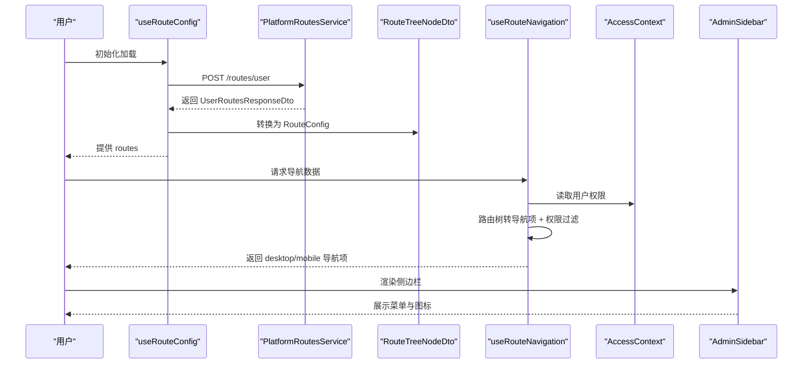
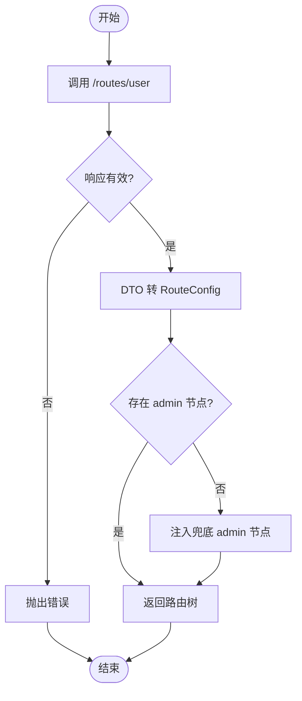
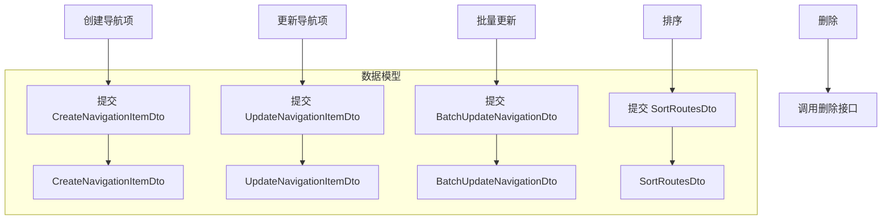
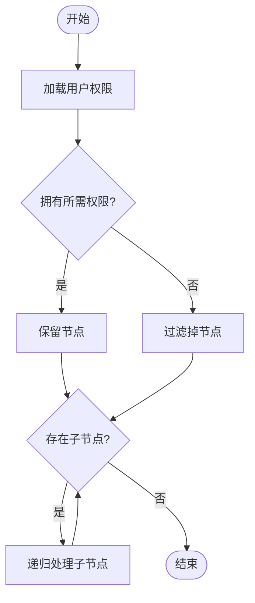
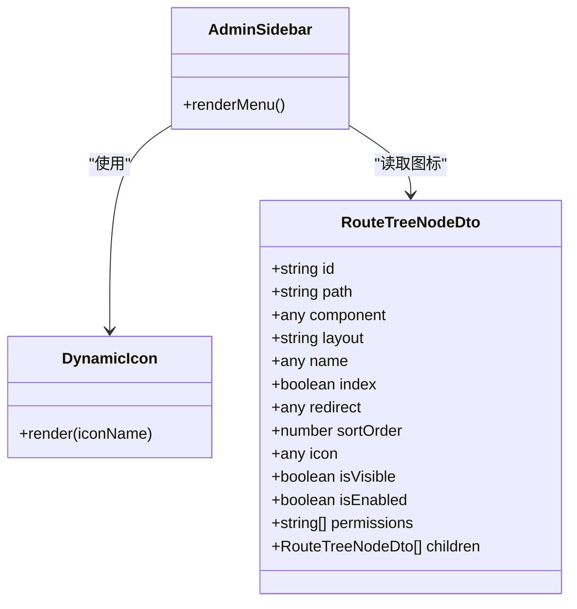
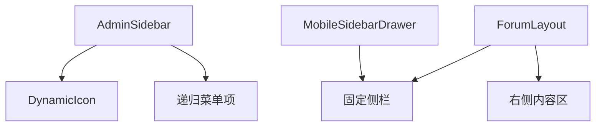
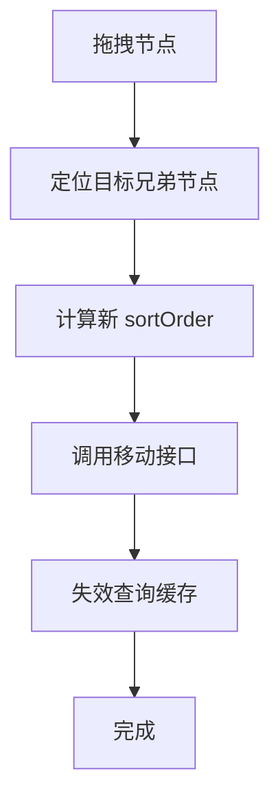
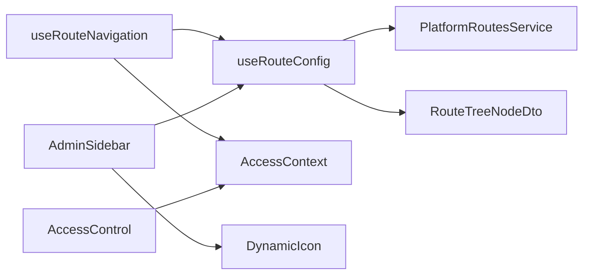

# 导航服务

<cite>
**本文引用的文件**
- [useRouteNavigation.ts](file://src/hooks/useRouteNavigation.ts)
- [useRouteConfig.ts](file://src/hooks/useRouteConfig.ts)
- [AccessContext.tsx](file://src/context/AccessContext.tsx)
- [AccessControl.tsx](file://src/permissions/AccessControl.tsx)
- [PlatformRoutesService.ts](file://src/api/services/PlatformRoutesService.ts)
- [RouteTreeNodeDto.ts](file://src/api/models/RouteTreeNodeDto.ts)
- [CreateNavigationItemDto.ts](file://src/api/models/CreateNavigationItemDto.ts)
- [UpdateNavigationItemDto.ts](file://src/api/models/UpdateNavigationItemDto.ts)
- [BatchUpdateNavigationDto.ts](file://src/api/models/BatchUpdateNavigationDto.ts)
- [SortRouteItemDto.ts](file://src/api/models/SortRouteItemDto.ts)
- [SortRoutesDto.ts](file://src/api/models/SortRoutesDto.ts)
- [dynamic-routes-api.md](file://docs/dev/dynamic-routes-api.md)
- [route-icon-frontend-guide.md](file://src/modules/admin/pages/system/routes/route-icon-frontend-guide.md)
- [AdminSidebar.tsx](file://src/modules/admin/layouts/AdminSidebar.tsx)
- [ForumLayout.tsx](file://src/modules/forum/layouts/ForumLayout.tsx)
- [MobileSidebarDrawer.tsx](file://src/modules/forum/layouts/MobileSidebarDrawer.tsx)
- [useRoutesLogic.ts](file://src/modules/admin/pages/system/routes/hooks/useRoutesLogic.ts)
- [CreateRouteModal.tsx](file://src/modules/admin/pages/system/routes/components/CreateRouteModal.tsx)
</cite>

## 目录
1. [简介](#简介)
2. [项目结构](#项目结构)
3. [核心组件](#核心组件)
4. [架构总览](#架构总览)
5. [详细组件分析](#详细组件分析)
6. [依赖关系分析](#依赖关系分析)
7. [性能考虑](#性能考虑)
8. [故障排查指南](#故障排查指南)
9. [结论](#结论)
10. [附录](#附录)

## 简介
本技术文档围绕导航服务展开，系统性阐述动态路由配置、路由树管理与权限控制机制，覆盖导航项的创建、更新、排序与删除流程；详解路由权限绑定、图标配置与前端路由映射；并给出多级菜单、面包屑导航与侧边栏布局的扩展方案，以及导航系统的性能优化、缓存策略与SEO友好实践。

## 项目结构
导航系统由“动态路由配置 + 导航项转换 + 权限过滤 + 布局渲染”四层组成：
- 动态路由配置层：通过后端接口获取用户可访问的路由树，支持按平台（桌面/移动端）与布局（app/admin/forum）拆分。
- 导航项转换层：将路由树转换为导航项结构，统一字段与层级关系，并进行权限过滤。
- 权限控制层：基于用户权限与角色进行细粒度访问控制，支持超级管理员豁免。
- 布局渲染层：在不同布局（管理后台、论坛等）中渲染侧边栏、移动端抽屉与菜单。

```mermaid
graph TB
subgraph "动态路由配置层"
A["useRouteConfig.ts<br/>获取路由树"]
B["PlatformRoutesService.ts<br/>调用 /routes/user"]
C["RouteTreeNodeDto.ts<br/>后端路由树模型"]
end
subgraph "导航项转换层"
D["useRouteNavigation.ts<br/>转换为导航项并过滤权限"]
E["AccessContext.tsx<br/>用户权限/角色"]
end
subgraph "布局渲染层"
F["AdminSidebar.tsx<br/>管理侧边栏"]
G["ForumLayout.tsx<br/>论坛布局"]
H["MobileSidebarDrawer.tsx<br/>移动端抽屉"]
end
A --> B
B --> C
A --> D
E --> D
D --> F
D --> G
G --> H
```

图表来源
- [useRouteConfig.ts](file://src/hooks/useRouteConfig.ts#L38-L108)
- [PlatformRoutesService.ts](file://src/api/services/PlatformRoutesService.ts#L11-L35)
- [RouteTreeNodeDto.ts](file://src/api/models/RouteTreeNodeDto.ts#L5-L75)
- [useRouteNavigation.ts](file://src/hooks/useRouteNavigation.ts#L105-L141)
- [AccessContext.tsx](file://src/context/AccessContext.tsx#L64-L181)
- [AdminSidebar.tsx](file://src/modules/admin/layouts/AdminSidebar.tsx#L169-L271)
- [ForumLayout.tsx](file://src/modules/forum/layouts/ForumLayout.tsx#L63-L84)
- [MobileSidebarDrawer.tsx](file://src/modules/forum/layouts/MobileSidebarDrawer.tsx#L55-L95)

章节来源
- [useRouteConfig.ts](file://src/hooks/useRouteConfig.ts#L38-L108)
- [useRouteNavigation.ts](file://src/hooks/useRouteNavigation.ts#L105-L141)
- [AccessContext.tsx](file://src/context/AccessContext.tsx#L64-L181)
- [PlatformRoutesService.ts](file://src/api/services/PlatformRoutesService.ts#L11-L35)
- [RouteTreeNodeDto.ts](file://src/api/models/RouteTreeNodeDto.ts#L5-L75)
- [AdminSidebar.tsx](file://src/modules/admin/layouts/AdminSidebar.tsx#L169-L271)
- [ForumLayout.tsx](file://src/modules/forum/layouts/ForumLayout.tsx#L63-L84)
- [MobileSidebarDrawer.tsx](file://src/modules/forum/layouts/MobileSidebarDrawer.tsx#L55-L95)

## 核心组件
- 动态路由配置 Hook：负责拉取后端路由树、本地兜底与缓存策略。
- 导航项转换 Hook：将路由树转换为导航项，处理路径拼接、可见性与权限过滤。
- 权限上下文：提供用户角色与权限，供权限过滤与细粒度控制使用。
- 布局组件：管理后台侧边栏与论坛侧边栏/移动端抽屉，渲染菜单与图标。

章节来源
- [useRouteConfig.ts](file://src/hooks/useRouteConfig.ts#L38-L108)
- [useRouteNavigation.ts](file://src/hooks/useRouteNavigation.ts#L105-L141)
- [AccessContext.tsx](file://src/context/AccessContext.tsx#L64-L181)
- [AdminSidebar.tsx](file://src/modules/admin/layouts/AdminSidebar.tsx#L169-L271)

## 架构总览
动态路由与导航的整体工作流如下：

图表来源
- [useRouteConfig.ts](file://src/hooks/useRouteConfig.ts#L63-L100)
- [PlatformRoutesService.ts](file://src/api/services/PlatformRoutesService.ts#L17-L35)
- [RouteTreeNodeDto.ts](file://src/api/models/RouteTreeNodeDto.ts#L5-L75)
- [useRouteNavigation.ts](file://src/hooks/useRouteNavigation.ts#L105-L141)
- [AccessContext.tsx](file://src/context/AccessContext.tsx#L64-L181)
- [AdminSidebar.tsx](file://src/modules/admin/layouts/AdminSidebar.tsx#L169-L271)

## 详细组件分析

### 动态路由配置与缓存策略
- 数据来源：通过服务类调用后端 /routes/user 接口，返回用户可访问的路由树。
- 数据转换：将后端 DTO 转换为前端 RouteConfig，保留关键字段（路径、组件、布局、权限、图标、可见性、启用状态、子节点等）。
- 本地兜底：若后端未返回 admin 节点，注入兜底节点以保证 /admin 路由可匹配。
- 缓存策略：React Query 的 staleTime 设置为 5 分钟，减少重复请求；同时提供缓存清理接口供后台维护。

图表来源
- [useRouteConfig.ts](file://src/hooks/useRouteConfig.ts#L63-L100)
- [PlatformRoutesService.ts](file://src/api/services/PlatformRoutesService.ts#L17-L35)
- [RouteTreeNodeDto.ts](file://src/api/models/RouteTreeNodeDto.ts#L5-L75)

章节来源
- [useRouteConfig.ts](file://src/hooks/useRouteConfig.ts#L38-L108)
- [PlatformRoutesService.ts](file://src/api/services/PlatformRoutesService.ts#L11-L35)
- [dynamic-routes-api.md](file://docs/dev/dynamic-routes-api.md#L1-L61)

### 导航项创建、更新、排序与删除
- 创建导航项：通过 CreateNavigationItemDto 定义字段（平台、父节点、标签、路径、图标、排序权重、可见性、目标窗口、所需权限）。后端提供批量导入与单条创建接口。
- 更新导航项：通过 UpdateNavigationItemDto 更新排序权重、可见性、所需权限与父节点。
- 批量更新：通过 BatchUpdateNavigationDto 对同一平台下的多个导航项进行批量更新。
- 排序：通过 SortRouteItemDto/SortRoutesDto 定义单个与批量排序项，支持拖拽排序与计算中间排序权重。
- 删除：通过后端删除接口移除导航项（具体接口位于后端，前端通过服务类调用）。

图表来源
- [CreateNavigationItemDto.ts](file://src/api/models/CreateNavigationItemDto.ts#L5-L53)
- [UpdateNavigationItemDto.ts](file://src/api/models/UpdateNavigationItemDto.ts#L5-L27)
- [BatchUpdateNavigationDto.ts](file://src/api/models/BatchUpdateNavigationDto.ts#L5-L26)
- [SortRouteItemDto.ts](file://src/api/models/SortRouteItemDto.ts#L5-L16)
- [SortRoutesDto.ts](file://src/api/models/SortRoutesDto.ts#L5-L13)

章节来源
- [CreateNavigationItemDto.ts](file://src/api/models/CreateNavigationItemDto.ts#L5-L53)
- [UpdateNavigationItemDto.ts](file://src/api/models/UpdateNavigationItemDto.ts#L5-L27)
- [BatchUpdateNavigationDto.ts](file://src/api/models/BatchUpdateNavigationDto.ts#L5-L26)
- [SortRouteItemDto.ts](file://src/api/models/SortRouteItemDto.ts#L5-L16)
- [SortRoutesDto.ts](file://src/api/models/SortRoutesDto.ts#L5-L13)

### 路由权限绑定与权限过滤
- 权限来源：AccessContext 提供用户角色与权限列表，支持从后端聚合接口与用户资料接口获取。
- 权限过滤：useRouteNavigation 在转换路由树为导航项时，对每个节点进行权限校验；超级管理员（用户名为 admin）直接放行。
- 细粒度控制：AccessControl 组件支持按权限与角色组合进行访问控制，可选择匹配全部或任意，支持与/或组合。

图表来源
- [AccessContext.tsx](file://src/context/AccessContext.tsx#L64-L181)
- [useRouteNavigation.ts](file://src/hooks/useRouteNavigation.ts#L71-L99)
- [AccessControl.tsx](file://src/permissions/AccessControl.tsx#L17-L43)

章节来源
- [AccessContext.tsx](file://src/context/AccessContext.tsx#L64-L181)
- [useRouteNavigation.ts](file://src/hooks/useRouteNavigation.ts#L71-L99)
- [AccessControl.tsx](file://src/permissions/AccessControl.tsx#L17-L43)

### 图标配置与前端路由映射
- 图标字段：RouteTreeNodeDto 新增 icon 字段，前端通过 DynamicIcon 组件解析并渲染不同图库（如 Lucide/Ant Design）的图标。
- 前端映射：AdminSidebar 使用 DynamicIcon 渲染菜单图标，支持不同层级的尺寸与颜色。
- 路由映射：useRouteConfig 将后端 component 字段映射为前端组件标识符，用于路由渲染。

图表来源
- [RouteTreeNodeDto.ts](file://src/api/models/RouteTreeNodeDto.ts#L5-L75)
- [route-icon-frontend-guide.md](file://src/modules/admin/pages/system/routes/route-icon-frontend-guide.md#L1-L55)
- [AdminSidebar.tsx](file://src/modules/admin/layouts/AdminSidebar.tsx#L154-L160)

章节来源
- [RouteTreeNodeDto.ts](file://src/api/models/RouteTreeNodeDto.ts#L5-L75)
- [route-icon-frontend-guide.md](file://src/modules/admin/pages/system/routes/route-icon-frontend-guide.md#L1-L55)
- [AdminSidebar.tsx](file://src/modules/admin/layouts/AdminSidebar.tsx#L154-L160)

### 侧边栏布局与移动端抽屉
- 管理后台侧边栏：AdminSidebar 递归渲染菜单，支持折叠、展开与高亮当前路径；使用 DynamicIcon 渲染图标。
- 论坛布局：ForumLayout 固定左侧边栏，右侧内容区域滚动；移动端通过 MobileSidebarDrawer 提供抽屉式导航。
- 多级菜单：通过 children 字段实现多级嵌套，支持子菜单与子子菜单的展开/收起。

图表来源
- [AdminSidebar.tsx](file://src/modules/admin/layouts/AdminSidebar.tsx#L169-L271)
- [ForumLayout.tsx](file://src/modules/forum/layouts/ForumLayout.tsx#L63-L84)
- [MobileSidebarDrawer.tsx](file://src/modules/forum/layouts/MobileSidebarDrawer.tsx#L55-L95)

章节来源
- [AdminSidebar.tsx](file://src/modules/admin/layouts/AdminSidebar.tsx#L169-L271)
- [ForumLayout.tsx](file://src/modules/forum/layouts/ForumLayout.tsx#L63-L84)
- [MobileSidebarDrawer.tsx](file://src/modules/forum/layouts/MobileSidebarDrawer.tsx#L55-L95)

### 管理端路由树管理与排序
- 树形结构：后端返回 RouteTreeNodeDto，前端通过 useRoutesLogic 管理树形数据与交互。
- 排序算法：拖拽排序时根据目标兄弟节点计算新的 sortOrder，采用等差插入策略，避免冲突。
- 操作流程：CreateRouteModal 提供创建表单；useRoutesLogic 处理刷新、移动、导出等操作。

图表来源
- [useRoutesLogic.ts](file://src/modules/admin/pages/system/routes/hooks/useRoutesLogic.ts#L192-L250)
- [CreateRouteModal.tsx](file://src/modules/admin/pages/system/routes/components/CreateRouteModal.tsx#L74-L83)

章节来源
- [useRoutesLogic.ts](file://src/modules/admin/pages/system/routes/hooks/useRoutesLogic.ts#L179-L260)
- [CreateRouteModal.tsx](file://src/modules/admin/pages/system/routes/components/CreateRouteModal.tsx#L74-L83)

## 依赖关系分析
- useRouteConfig 依赖 PlatformRoutesService 与 RouteTreeNodeDto。
- useRouteNavigation 依赖 useRouteConfig 与 AccessContext。
- AdminSidebar 依赖 useRouteConfig 与 DynamicIcon。
- 权限控制组件 AccessControl 依赖 AccessContext 与工具函数。

图表来源
- [useRouteConfig.ts](file://src/hooks/useRouteConfig.ts#L38-L108)
- [PlatformRoutesService.ts](file://src/api/services/PlatformRoutesService.ts#L11-L35)
- [RouteTreeNodeDto.ts](file://src/api/models/RouteTreeNodeDto.ts#L5-L75)
- [useRouteNavigation.ts](file://src/hooks/useRouteNavigation.ts#L105-L141)
- [AccessContext.tsx](file://src/context/AccessContext.tsx#L64-L181)
- [AdminSidebar.tsx](file://src/modules/admin/layouts/AdminSidebar.tsx#L169-L271)

章节来源
- [useRouteConfig.ts](file://src/hooks/useRouteConfig.ts#L38-L108)
- [useRouteNavigation.ts](file://src/hooks/useRouteNavigation.ts#L105-L141)
- [AccessContext.tsx](file://src/context/AccessContext.tsx#L64-L181)
- [PlatformRoutesService.ts](file://src/api/services/PlatformRoutesService.ts#L11-L35)
- [RouteTreeNodeDto.ts](file://src/api/models/RouteTreeNodeDto.ts#L5-L75)
- [AdminSidebar.tsx](file://src/modules/admin/layouts/AdminSidebar.tsx#L169-L271)

## 性能考虑
- 缓存策略：useRouteConfig 使用 5 分钟 staleTime，降低频繁请求；支持后台清理缓存接口。
- 懒加载与并行请求：AccessContext 并行获取用户资料与聚合权限，减少首屏等待。
- 本地兜底：当后端缺失 admin 节点时注入兜底节点，避免路由匹配失败导致的额外请求。
- 渲染优化：AdminSidebar 仅渲染可见路由，且使用 memo 与 set 控制展开状态，避免不必要的重渲染。

章节来源
- [useRouteConfig.ts](file://src/hooks/useRouteConfig.ts#L96-L100)
- [AccessContext.tsx](file://src/context/AccessContext.tsx#L102-L114)
- [AdminSidebar.tsx](file://src/modules/admin/layouts/AdminSidebar.tsx#L169-L271)

## 故障排查指南
- 路由树为空：确认 useRouteConfig 的 enabled 条件与认证状态；检查 /routes/user 接口返回格式。
- 权限不足：检查 AccessContext 的权限加载与 AccessControl 的规则配置；确认后端动态路由权限过滤逻辑。
- 图标不显示：检查 RouteTreeNodeDto 的 icon 字段格式与 DynamicIcon 的解析逻辑。
- 移动端抽屉异常：检查 MobileSidebarDrawer 的 isOpen 状态与遮罩点击事件。
- 排序冲突：确认拖拽时的兄弟节点计算与 sortOrder 插值逻辑。

章节来源
- [useRouteConfig.ts](file://src/hooks/useRouteConfig.ts#L63-L100)
- [AccessContext.tsx](file://src/context/AccessContext.tsx#L64-L181)
- [route-icon-frontend-guide.md](file://src/modules/admin/pages/system/routes/route-icon-frontend-guide.md#L1-L55)
- [MobileSidebarDrawer.tsx](file://src/modules/forum/layouts/MobileSidebarDrawer.tsx#L55-L95)
- [useRoutesLogic.ts](file://src/modules/admin/pages/system/routes/hooks/useRoutesLogic.ts#L210-L250)

## 结论
该导航服务以“动态路由 + 权限过滤 + 布局渲染”的分层架构实现，具备良好的扩展性与可维护性。通过后端驱动的路由树与前端精细的权限控制，既能满足多平台与多级菜单的需求，又能在性能与体验之间取得平衡。建议在后续迭代中进一步完善 SEO 友好与无障碍访问能力。

## 附录
- 多级菜单：通过 children 字段天然支持无限级嵌套，配合侧边栏组件即可实现复杂菜单结构。
- 面包屑导航：可基于当前路由路径与路由树构建面包屑数据，结合 useLocation 实现动态生成。
- SEO 友好：为每个导航项提供语义化标签与可访问属性，确保搜索引擎与辅助技术正确识别页面结构。