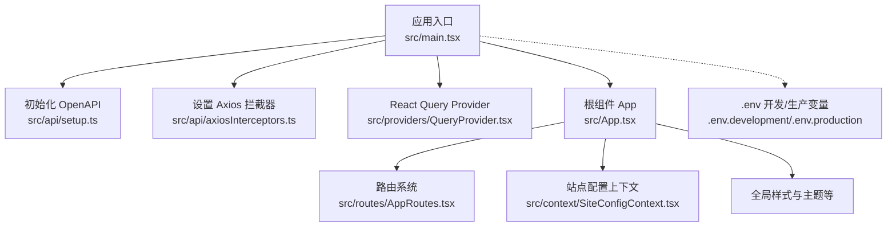
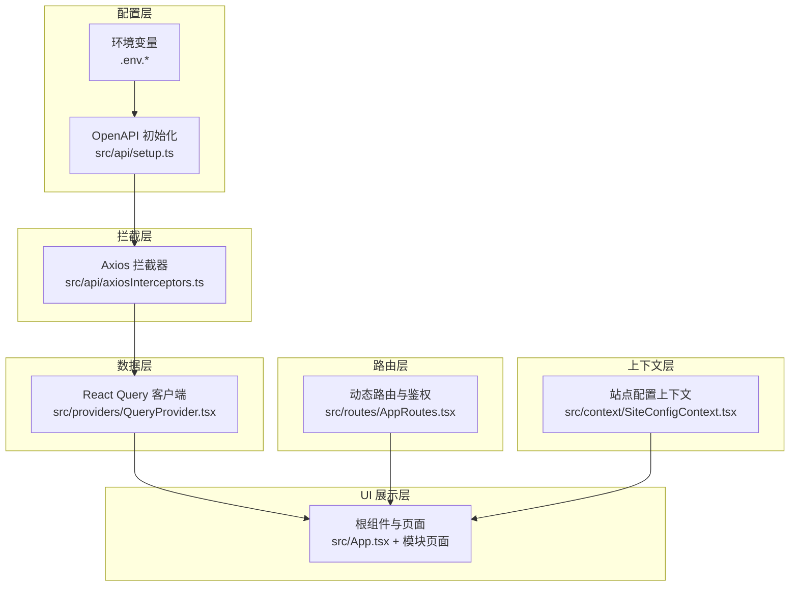
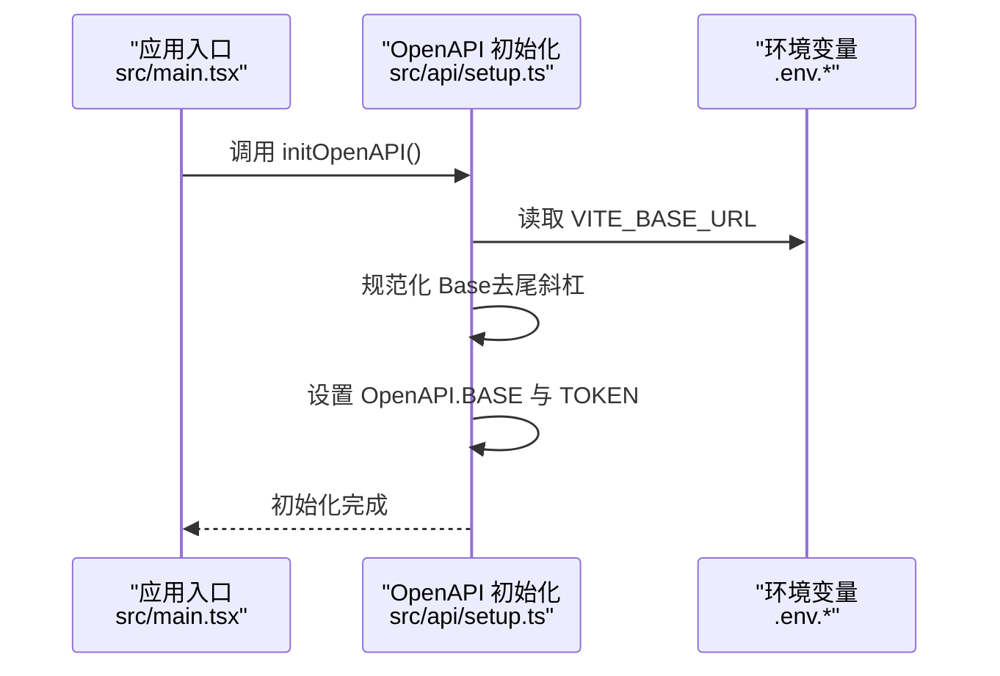
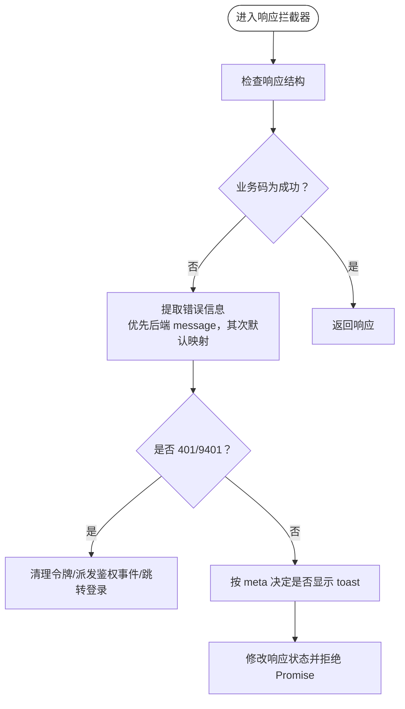
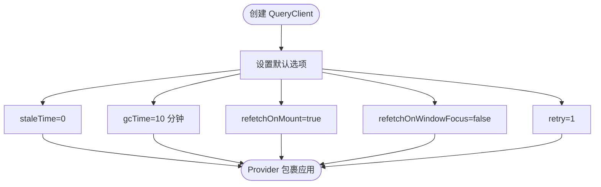
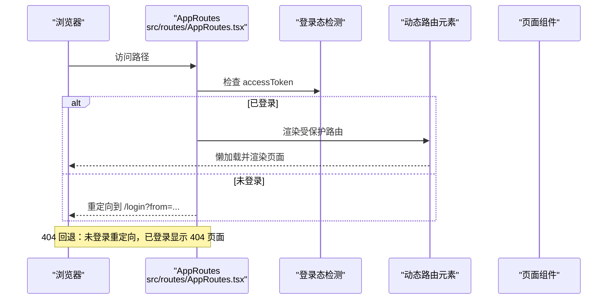
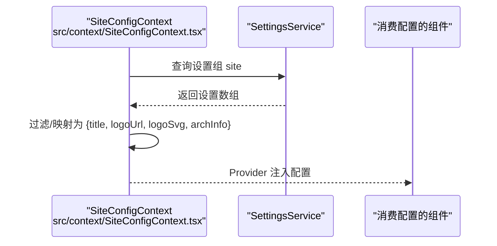
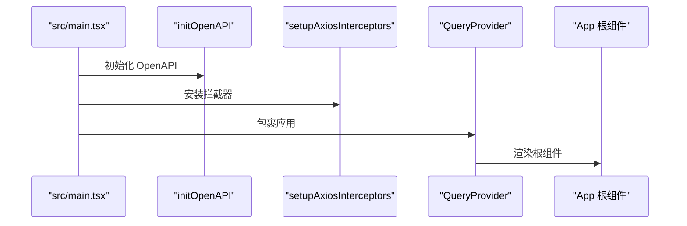
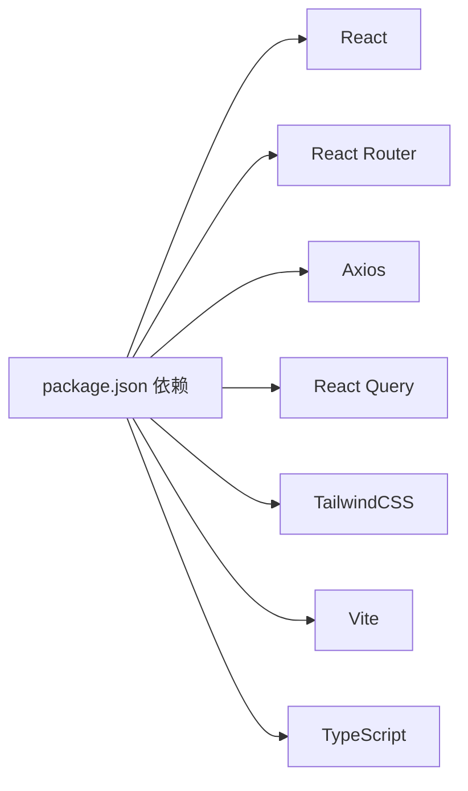

# 系统服务

<cite>
**本文引用的文件**   
- [README.md](file://README.md)
- [package.json](file://package.json)
- [src/main.tsx](file://src/main.tsx)
- [src/App.tsx](file://src/App.tsx)
- [src/api/index.ts](file://src/api/index.ts)
- [src/api/setup.ts](file://src/api/setup.ts)
- [src/api/axiosInterceptors.ts](file://src/api/axiosInterceptors.ts)
- [src/providers/QueryProvider.tsx](file://src/providers/QueryProvider.tsx)
- [src/routes/AppRoutes.tsx](file://src/routes/AppRoutes.tsx)
- [src/context/SiteConfigContext.tsx](file://src/context/SiteConfigContext.tsx)
- [.env.development](file://.env.development)
- [.env.production](file://.env.production)
</cite>

## 目录
1. [简介](#简介)
2. [项目结构](#项目结构)
3. [核心组件](#核心组件)
4. [架构总览](#架构总览)
5. [组件详解](#组件详解)
6. [依赖关系分析](#依赖关系分析)
7. [性能考量](#性能考量)
8. [故障排查指南](#故障排查指南)
9. [结论](#结论)
10. [附录](#附录)

## 简介
本技术文档面向系统服务层，围绕系统配置、导航管理、通知服务、站点统计、性能监控与健康检查、系统消息推送与邮件发送、第三方集成模式、系统维护与灾备方案，以及性能优化与故障诊断最佳实践展开。文档以仓库现有代码为依据，结合架构图与流程图，帮助开发者与运维人员快速理解并高效维护系统。

## 项目结构
前端采用 Vite + React 架构，使用 React Router v7 实现动态路由；通过 OpenAPI 客户端与后端交互；使用 React Query 管理数据缓存与刷新；全局拦截器统一处理错误与鉴权；站点配置通过设置项动态注入；应用入口负责初始化 OpenAPI、设置拦截器与 Provider 包裹。

**图表来源**
- [src/main.tsx](file://src/main.tsx#L1-L18)
- [src/api/setup.ts](file://src/api/setup.ts#L1-L35)
- [src/api/axiosInterceptors.ts](file://src/api/axiosInterceptors.ts#L1-L294)
- [src/providers/QueryProvider.tsx](file://src/providers/QueryProvider.tsx#L1-L30)
- [src/App.tsx](file://src/App.tsx#L1-L52)
- [src/routes/AppRoutes.tsx](file://src/routes/AppRoutes.tsx#L1-L115)
- [src/context/SiteConfigContext.tsx](file://src/context/SiteConfigContext.tsx#L1-L50)
- [.env.development](file://.env.development#L1-L5)
- [.env.production](file://.env.production#L1-L5)

**章节来源**
- [README.md](file://README.md#L1-L11)
- [package.json](file://package.json#L1-L148)
- [src/main.tsx](file://src/main.tsx#L1-L18)
- [src/App.tsx](file://src/App.tsx#L1-L52)

## 核心组件
- OpenAPI 运行时配置：集中初始化 Base URL 与 Token 读取策略，保证请求一致性与鉴权能力。
- Axios 统一拦截器：封装响应结构、错误提取、业务码映射、静默提示控制、401 自动跳转与鉴权事件派发。
- React Query Provider：统一查询客户端配置，控制缓存生命周期与刷新策略，提升用户体验。
- 动态路由系统：基于动态路由元素与懒加载，实现公开/受保护页面分流与 404 回退。
- 站点配置上下文：从设置组“site”拉取标题、Logo、架构说明等，动态注入到 UI。
- 应用入口：初始化 OpenAPI、安装拦截器、包裹 QueryProvider 并渲染根组件。

**章节来源**
- [src/api/setup.ts](file://src/api/setup.ts#L1-L35)
- [src/api/axiosInterceptors.ts](file://src/api/axiosInterceptors.ts#L1-L294)
- [src/providers/QueryProvider.tsx](file://src/providers/QueryProvider.tsx#L1-L30)
- [src/routes/AppRoutes.tsx](file://src/routes/AppRoutes.tsx#L1-L115)
- [src/context/SiteConfigContext.tsx](file://src/context/SiteConfigContext.tsx#L1-L50)
- [src/main.tsx](file://src/main.tsx#L1-L18)

## 架构总览
系统服务层由“配置层—拦截层—路由层—上下文层—数据层—UI 展示层”构成。配置层负责运行时参数与令牌；拦截层统一处理错误与鉴权；路由层实现访问控制与页面加载；上下文层提供站点配置；数据层通过 Query 管理缓存与刷新；UI 展示层承载业务页面与交互。

**图表来源**
- [src/api/setup.ts](file://src/api/setup.ts#L1-L35)
- [.env.development](file://.env.development#L1-L5)
- [.env.production](file://.env.production#L1-L5)
- [src/api/axiosInterceptors.ts](file://src/api/axiosInterceptors.ts#L1-L294)
- [src/providers/QueryProvider.tsx](file://src/providers/QueryProvider.tsx#L1-L30)
- [src/routes/AppRoutes.tsx](file://src/routes/AppRoutes.tsx#L1-L115)
- [src/context/SiteConfigContext.tsx](file://src/context/SiteConfigContext.tsx#L1-L50)
- [src/App.tsx](file://src/App.tsx#L1-L52)

## 组件详解

### OpenAPI 运行时配置
- 目标：统一后端基础地址与令牌读取策略，避免重复斜杠与多处鉴权逻辑。
- 关键点：
  - 从 Vite 环境变量读取 Base URL，并去除尾部斜杠。
  - 统一从本地存储读取访问令牌。
  - 通过全局标记确保初始化只执行一次，避免热更新重复污染。

**图表来源**
- [src/main.tsx](file://src/main.tsx#L11-L17)
- [src/api/setup.ts](file://src/api/setup.ts#L18-L34)
- [.env.development](file://.env.development#L1-L1)
- [.env.production](file://.env.production#L1-L1)

**章节来源**
- [src/api/setup.ts](file://src/api/setup.ts#L1-L35)
- [src/main.tsx](file://src/main.tsx#L11-L17)

### Axios 统一拦截器
- 目标：统一响应结构、错误提取、业务码映射、静默提示控制、401 自动跳转与鉴权事件派发。
- 关键点：
  - 响应拦截：当业务码非成功时，构造错误对象并中断 Promise 链，交由上层处理。
  - 错误拦截：根据 HTTP 状态或业务码映射默认文案，支持自定义错误消息与静默模式。
  - 401 处理：清除本地令牌、派发鉴权变更事件、跳转登录页（排除公开路径）。
  - Meta 控制：支持静默、跳过特定错误码、自定义错误消息等。

**图表来源**
- [src/api/axiosInterceptors.ts](file://src/api/axiosInterceptors.ts#L204-L291)

**章节来源**
- [src/api/axiosInterceptors.ts](file://src/api/axiosInterceptors.ts#L1-L294)

### React Query Provider
- 目标：统一数据缓存与刷新策略，提升页面切换与回退的体验。
- 关键点：
  - 缓存生命周期：默认 10 分钟，兼顾“秒开”与内存占用。
  - 刷新策略：挂载即刷新、窗口聚焦可选关闭、失败重试 1 次。
  - 默认行为：staleTime=0，refetchOnMount=true，确保数据新鲜度。

**图表来源**
- [src/providers/QueryProvider.tsx](file://src/providers/QueryProvider.tsx#L5-L22)

**章节来源**
- [src/providers/QueryProvider.tsx](file://src/providers/QueryProvider.tsx#L1-L30)

### 动态路由与鉴权
- 目标：实现公开/受保护页面分流、登录态检测、404 回退与懒加载。
- 关键点：
  - 公开路由：登录、注册、忘记密码。
  - 受保护路由：通过动态路由元素加载，支持 Admin 与业务模块。
  - 登录态检测：若已登录则重定向至来源页；否则跳转登录页。
  - 404 回退：未登录时重定向登录，已登录时展示 404 页面。

**图表来源**
- [src/routes/AppRoutes.tsx](file://src/routes/AppRoutes.tsx#L19-L114)

**章节来源**
- [src/routes/AppRoutes.tsx](file://src/routes/AppRoutes.tsx#L1-L115)

### 站点配置上下文
- 目标：从设置组“site”拉取站点标题、Logo、架构说明等，动态注入 UI。
- 关键点：
  - 通过 SettingsService 获取设置列表，过滤并映射为键值对。
  - 支持容错：请求异常时回退为空配置。
  - 挂载标志避免卸载后更新状态。

**图表来源**
- [src/context/SiteConfigContext.tsx](file://src/context/SiteConfigContext.tsx#L16-L40)

**章节来源**
- [src/context/SiteConfigContext.tsx](file://src/context/SiteConfigContext.tsx#L1-L50)

### 应用入口与初始化流程
- 目标：在应用启动阶段完成 OpenAPI 初始化、拦截器安装、QueryProvider 包裹与根组件渲染。
- 关键点：
  - initOpenAPI 仅初始化一次。
  - setupAxiosInterceptors 仅安装一次。
  - QueryProvider 为整个应用提供数据缓存能力。
  - 根组件负责全局加载器、主题切换、全局错误边界与路由容器。

**图表来源**
- [src/main.tsx](file://src/main.tsx#L7-L17)
- [src/App.tsx](file://src/App.tsx#L33-L51)

**章节来源**
- [src/main.tsx](file://src/main.tsx#L1-L18)
- [src/App.tsx](file://src/App.tsx#L1-L52)

## 依赖关系分析
- 运行时依赖：React、React Router、Axios、React Query、TailwindCSS 等。
- 开发依赖：Vite、TypeScript、ESLint、Prettier、PostCSS、Rollup 插件等。
- 脚本命令：开发、构建、API 代码生成、权限同步、端点守卫与测试等。

**图表来源**
- [package.json](file://package.json#L5-L91)
- [package.json](file://package.json#L93-L125)

**章节来源**
- [package.json](file://package.json#L1-L148)

## 性能考量
- 缓存与刷新
  - QueryClient 默认 staleTime=0，refetchOnMount=true，确保页面切换时即时刷新。
  - gcTime=10 分钟，平衡“秒开”体验与内存占用。
  - retry=1，降低瞬时失败对用户的影响。
- 路由与懒加载
  - 动态路由与页面懒加载减少首屏体积，提升首屏性能。
  - 全局加载器与骨架屏提升感知性能。
- 网络与错误处理
  - 统一拦截器减少重复错误处理逻辑，便于统一优化。
  - 401 自动跳转避免无效重试，降低后端压力。
- 环境变量
  - VITE_BASE_URL 统一后端地址，避免硬编码带来的维护成本。

**章节来源**
- [src/providers/QueryProvider.tsx](file://src/providers/QueryProvider.tsx#L5-L22)
- [src/api/axiosInterceptors.ts](file://src/api/axiosInterceptors.ts#L166-L192)
- [src/routes/AppRoutes.tsx](file://src/routes/AppRoutes.tsx#L73-L98)
- [.env.development](file://.env.development#L1-L1)
- [.env.production](file://.env.production#L1-L1)

## 故障排查指南
- 鉴权相关
  - 现象：频繁弹出登录或页面跳转。
  - 排查：确认本地存储是否存在 accessToken；检查拦截器 401 处理逻辑；核对公开路径白名单。
- 错误提示与静默
  - 现象：错误提示过多或过少。
  - 排查：检查请求 meta 中 silent、skipErrorCodes、skipBusinessCodes 配置。
- 网络错误
  - 现象：网络错误或超时。
  - 排查：查看拦截器对网络错误码的映射与提示文案；确认后端可达性与响应格式。
- 数据缓存问题
  - 现象：数据不更新或长时间不刷新。
  - 排查：检查 QueryClient 默认配置；确认页面是否启用 refetchOnMount；必要时手动 invalidates。
- 站点配置
  - 现象：标题、Logo 未生效。
  - 排查：确认设置组“site”的键值是否存在；检查上下文初始化是否成功。

**章节来源**
- [src/api/axiosInterceptors.ts](file://src/api/axiosInterceptors.ts#L149-L192)
- [src/providers/QueryProvider.tsx](file://src/providers/QueryProvider.tsx#L5-L22)
- [src/context/SiteConfigContext.tsx](file://src/context/SiteConfigContext.tsx#L16-L40)

## 结论
系统服务层通过 OpenAPI 初始化、Axios 拦截器、React Query、动态路由与站点配置上下文，形成了清晰的配置—拦截—数据—展示链路。该架构具备良好的可维护性与扩展性，适合在后续迭代中引入站点统计、通知服务、邮件发送与第三方集成等能力，并配合统一的错误与性能策略实现稳定高效的线上运行。

## 附录
- 环境变量
  - VITE_BASE_URL：后端基础地址。
  - DOWNLOADER_SECRET：下载器相关密钥（用于下载器集成）。
- 常用脚本
  - dev/build：开发/生产构建。
  - api:generate：从后端 OpenAPI 生成前端 SDK。
  - permissions:sync/endpoints:*：权限与端点治理脚本。

**章节来源**
- [.env.development](file://.env.development#L1-L5)
- [.env.production](file://.env.production#L1-L5)
- [package.json](file://package.json#L126-L139)