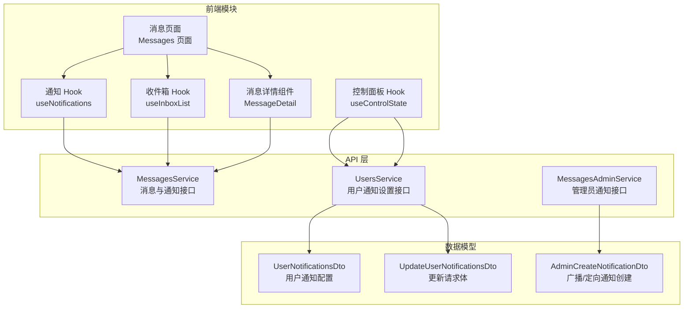
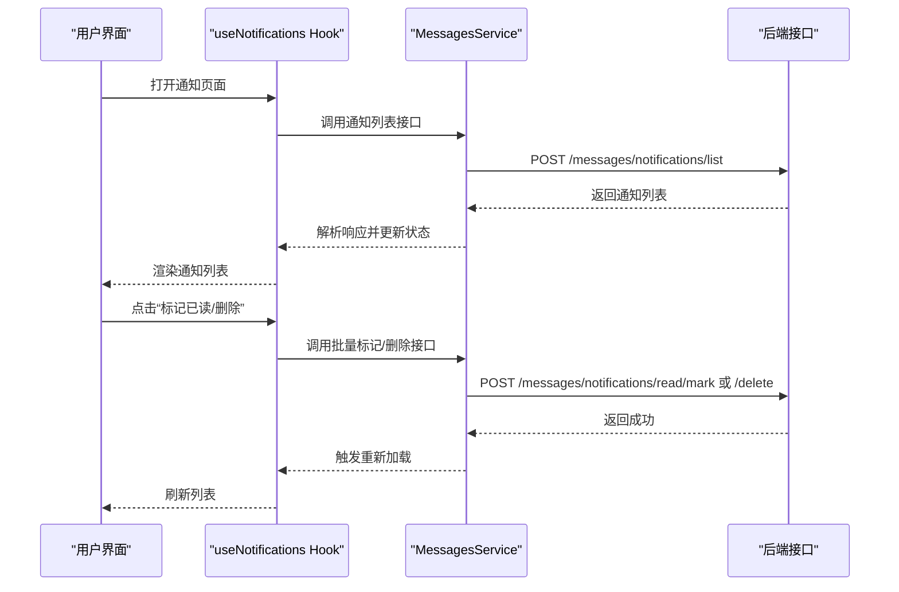
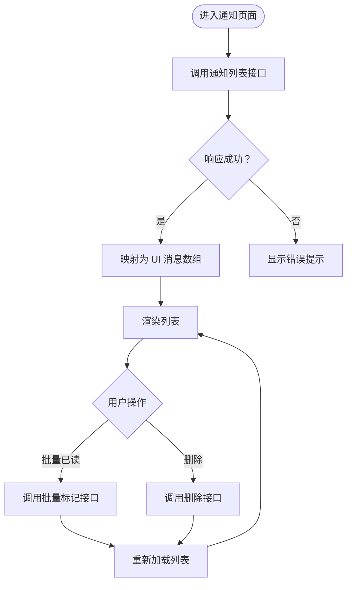
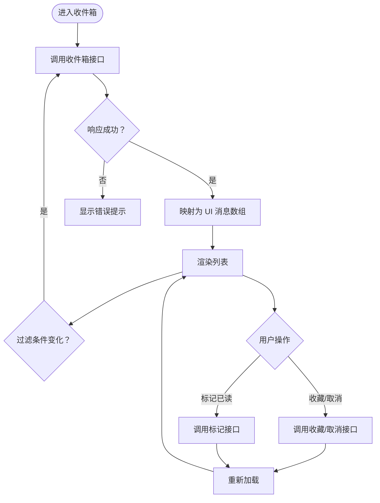
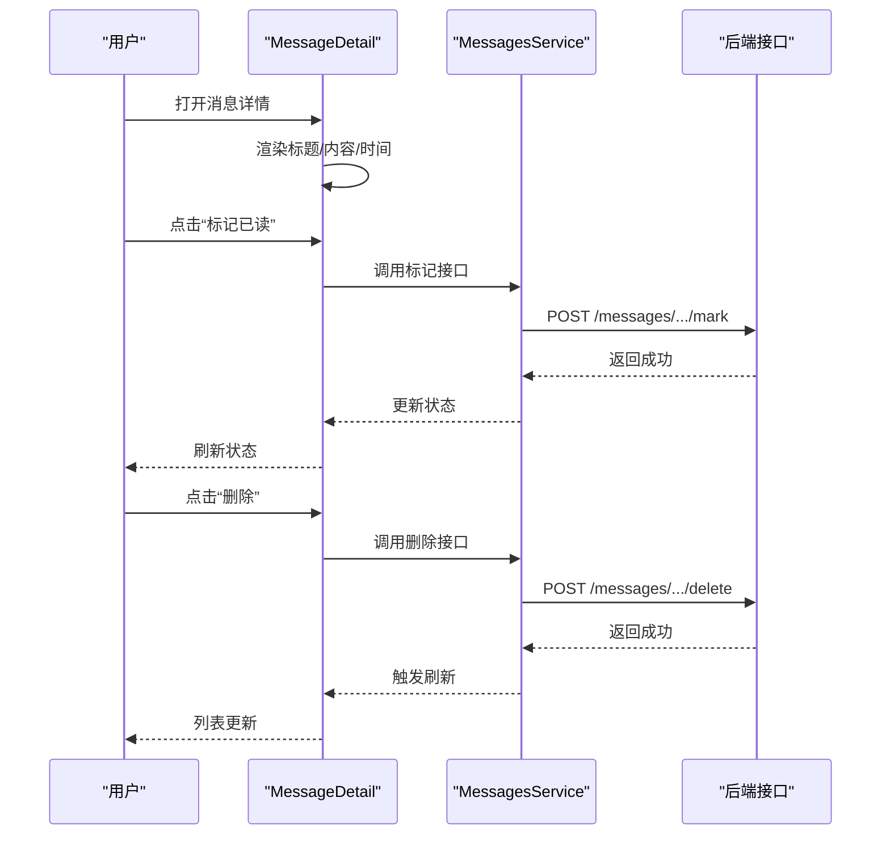
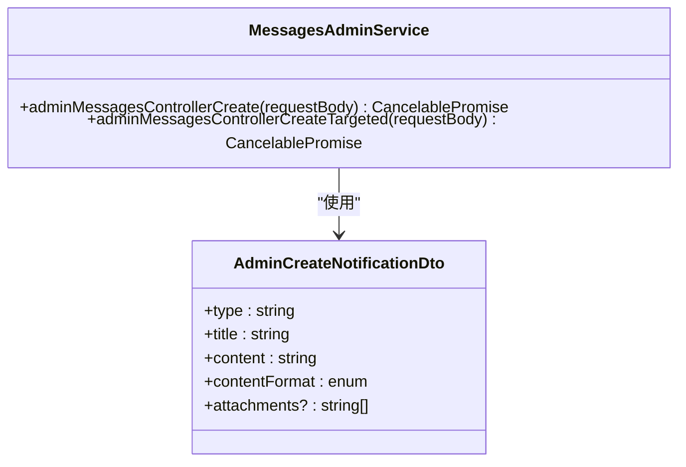
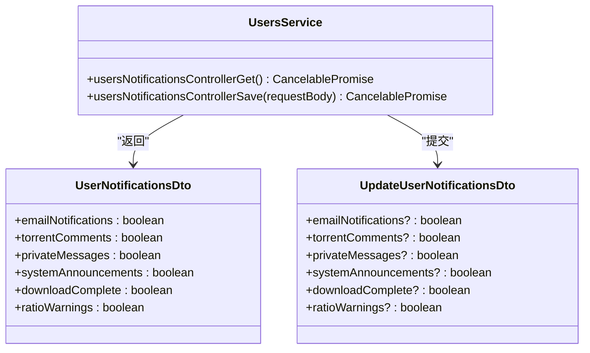
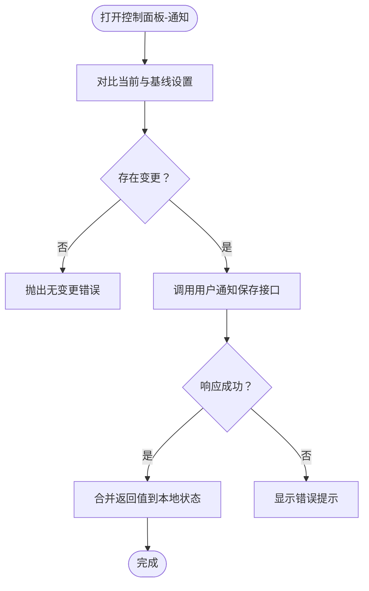
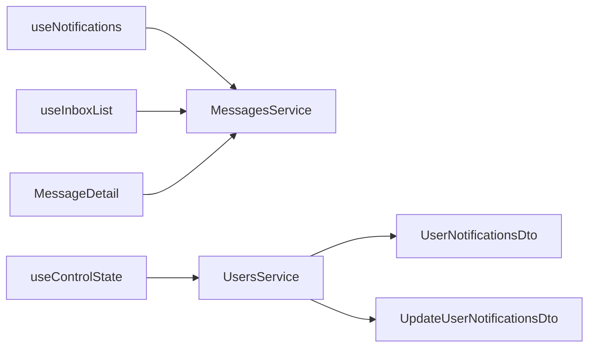

# 通知服务

<cite>
**本文引用的文件**
- [useNotifications.ts](file://src/modules/app/pages/Messages/hooks/useNotifications.ts)
- [useInboxList.ts](file://src/modules/app/pages/Messages/hooks/useInboxList.ts)
- [MessagesAdminService.ts](file://src/api/services/MessagesAdminService.ts)
- [MessagesService.ts](file://src/api/services/MessagesService.ts)
- [UsersService.ts](file://src/api/services/UsersService.ts)
- [UserNotificationsDto.ts](file://src/api/models/UserNotificationsDto.ts)
- [UpdateUserNotificationsDto.ts](file://src/api/models/UpdateUserNotificationsDto.ts)
- [AdminCreateNotificationDto.ts](file://src/api/models/AdminCreateNotificationDto.ts)
- [MessageDetail.tsx](file://src/modules/app/pages/Messages/components/MessageDetail.tsx)
- [useControlState.ts](file://src/modules/app/pages/Control/hooks/useControlState.ts)
</cite>

## 目录
1. [简介](#简介)
2. [项目结构](#项目结构)
3. [核心组件](#核心组件)
4. [架构总览](#架构总览)
5. [详细组件分析](#详细组件分析)
6. [依赖关系分析](#依赖关系分析)
7. [性能考虑](#性能考虑)
8. [故障排查指南](#故障排查指南)
9. [结论](#结论)
10. [附录](#附录)

## 简介
本技术文档围绕通知服务展开，系统性梳理消息推送、站内信管理与用户通知的前端实现与后端接口交互机制。重点覆盖以下方面：
- 通知类型与优先级管理：系统通知与用户私信的分类与处理流程
- 用户偏好设置：通知渠道开关与增量更新策略
- 集成方案：HTTP 接口调用、消息持久化与多设备同步建议
- 性能优化：分页加载、批量标记与去抖策略
- 限流与体验：请求节流、错误提示与无状态刷新
- 实时推送与离线通知：当前仓库未实现 WebSocket，提供架构扩展建议

## 项目结构
通知服务在前端采用模块化页面与 Hook 抽象，通过统一的 API 生成器对接后端服务；用户偏好设置通过独立的服务进行获取与更新。

图表来源
- [useNotifications.ts](file://src/modules/app/pages/Messages/hooks/useNotifications.ts#L1-L92)
- [useInboxList.ts](file://src/modules/app/pages/Messages/hooks/useInboxList.ts#L1-L114)
- [MessageDetail.tsx](file://src/modules/app/pages/Messages/components/MessageDetail.tsx#L39-L76)
- [useControlState.ts](file://src/modules/app/pages/Control/hooks/useControlState.ts#L349-L369)
- [MessagesService.ts](file://src/api/services/MessagesService.ts#L561-L609)
- [MessagesAdminService.ts](file://src/api/services/MessagesAdminService.ts#L1-L74)
- [UsersService.ts](file://src/api/services/UsersService.ts#L300-L405)
- [UserNotificationsDto.ts](file://src/api/models/UserNotificationsDto.ts#L1-L14)
- [UpdateUserNotificationsDto.ts](file://src/api/models/UpdateUserNotificationsDto.ts#L1-L14)
- [AdminCreateNotificationDto.ts](file://src/api/models/AdminCreateNotificationDto.ts#L1-L38)

章节来源
- [useNotifications.ts](file://src/modules/app/pages/Messages/hooks/useNotifications.ts#L1-L92)
- [useInboxList.ts](file://src/modules/app/pages/Messages/hooks/useInboxList.ts#L1-L114)
- [MessagesService.ts](file://src/api/services/MessagesService.ts#L561-L609)
- [MessagesAdminService.ts](file://src/api/services/MessagesAdminService.ts#L1-L74)
- [UsersService.ts](file://src/api/services/UsersService.ts#L300-L405)
- [UserNotificationsDto.ts](file://src/api/models/UserNotificationsDto.ts#L1-L14)
- [UpdateUserNotificationsDto.ts](file://src/api/models/UpdateUserNotificationsDto.ts#L1-L14)
- [AdminCreateNotificationDto.ts](file://src/api/models/AdminCreateNotificationDto.ts#L1-L38)

## 核心组件
- 通知列表 Hook：负责系统通知的分页拉取、批量标记已读与删除
- 收件箱 Hook：负责用户私信的分页拉取、收藏/取消收藏、单条标记已读
- 管理员通知服务：提供广播通知与定向通知的创建接口
- 用户通知服务：提供用户通知偏好的获取与增量更新接口
- 用户通知模型：定义通知偏好的字段集合
- 消息详情组件：渲染消息内容并提供“标记已读/删除”等操作入口

章节来源
- [useNotifications.ts](file://src/modules/app/pages/Messages/hooks/useNotifications.ts#L8-L91)
- [useInboxList.ts](file://src/modules/app/pages/Messages/hooks/useInboxList.ts#L8-L113)
- [MessagesAdminService.ts](file://src/api/services/MessagesAdminService.ts#L10-L73)
- [UsersService.ts](file://src/api/services/UsersService.ts#L300-L405)
- [UserNotificationsDto.ts](file://src/api/models/UserNotificationsDto.ts#L5-L12)
- [MessageDetail.tsx](file://src/modules/app/pages/Messages/components/MessageDetail.tsx#L39-L76)

## 架构总览
通知服务由“前端 Hook + API 服务 + 数据模型”三层构成，前端通过统一的请求封装调用后端接口，实现通知的查询、标记与删除，以及用户通知偏好的获取与更新。

图表来源
- [useNotifications.ts](file://src/modules/app/pages/Messages/hooks/useNotifications.ts#L13-L31)
- [MessagesService.ts](file://src/api/services/MessagesService.ts#L561-L609)

章节来源
- [useNotifications.ts](file://src/modules/app/pages/Messages/hooks/useNotifications.ts#L13-L63)
- [MessagesService.ts](file://src/api/services/MessagesService.ts#L561-L609)

## 详细组件分析

### 组件一：通知列表 Hook（useNotifications）
职责与行为
- 分页加载：支持页码与每页数量控制
- 数据映射：将后端通知对象映射为 UI 所需的消息结构
- 批量操作：支持批量标记已读与删除
- 错误处理：使用全局提示反馈异常

图表来源
- [useNotifications.ts](file://src/modules/app/pages/Messages/hooks/useNotifications.ts#L13-L63)

章节来源
- [useNotifications.ts](file://src/modules/app/pages/Messages/hooks/useNotifications.ts#L8-L91)

### 组件二：收件箱 Hook（useInboxList）
职责与行为
- 过滤条件：支持仅未读与仅收藏过滤
- 收藏管理：支持收藏与取消收藏
- 单条标记：支持单条消息标记已读
- 错误处理：统一错误提示

图表来源
- [useInboxList.ts](file://src/modules/app/pages/Messages/hooks/useInboxList.ts#L15-L38)

章节来源
- [useInboxList.ts](file://src/modules/app/pages/Messages/hooks/useInboxList.ts#L8-L113)

### 组件三：消息详情组件（MessageDetail）
职责与行为
- 渲染消息正文与元信息
- 提供“标记已读/删除”按钮（针对系统通知）
- 提供“标记已读/删除”按钮（针对用户私信）

图表来源
- [MessageDetail.tsx](file://src/modules/app/pages/Messages/components/MessageDetail.tsx#L54-L76)
- [MessagesService.ts](file://src/api/services/MessagesService.ts#L561-L609)

章节来源
- [MessageDetail.tsx](file://src/modules/app/pages/Messages/components/MessageDetail.tsx#L39-L76)

### 组件四：管理员通知服务（MessagesAdminService）
职责与行为
- 广播通知创建：向全体用户推送通知
- 定向通知创建：向指定目标推送通知
- 统一错误映射：对常见状态码进行错误提示

图表来源
- [MessagesAdminService.ts](file://src/api/services/MessagesAdminService.ts#L10-L73)
- [AdminCreateNotificationDto.ts](file://src/api/models/AdminCreateNotificationDto.ts#L5-L26)

章节来源
- [MessagesAdminService.ts](file://src/api/services/MessagesAdminService.ts#L10-L73)
- [AdminCreateNotificationDto.ts](file://src/api/models/AdminCreateNotificationDto.ts#L1-L38)

### 组件五：用户通知服务（UsersService）与模型
职责与行为
- 获取用户通知偏好：返回当前用户的通知开关集合
- 更新用户通知偏好：支持增量更新，仅提交变更项
- 数据模型：定义通知偏好的字段集合

图表来源
- [UsersService.ts](file://src/api/services/UsersService.ts#L300-L405)
- [UserNotificationsDto.ts](file://src/api/models/UserNotificationsDto.ts#L5-L12)
- [UpdateUserNotificationsDto.ts](file://src/api/models/UpdateUserNotificationsDto.ts#L5-L12)

章节来源
- [UsersService.ts](file://src/api/services/UsersService.ts#L300-L405)
- [UserNotificationsDto.ts](file://src/api/models/UserNotificationsDto.ts#L1-L14)
- [UpdateUserNotificationsDto.ts](file://src/api/models/UpdateUserNotificationsDto.ts#L1-L14)

### 组件六：控制面板中的通知设置（useControlState）
职责与行为
- 对比基线与当前设置，仅提交变更字段
- 将变更结果合并到本地状态，避免全量刷新

图表来源
- [useControlState.ts](file://src/modules/app/pages/Control/hooks/useControlState.ts#L349-L369)

章节来源
- [useControlState.ts](file://src/modules/app/pages/Control/hooks/useControlState.ts#L349-L369)

## 依赖关系分析
- useNotifications 与 useInboxList 依赖 MessagesService 的接口方法
- MessageDetail 依赖 MessagesService 的标记与删除接口
- useControlState 依赖 UsersService 的通知设置获取与保存接口
- 用户通知模型在 UsersService 中被使用，确保前后端字段一致

图表来源
- [useNotifications.ts](file://src/modules/app/pages/Messages/hooks/useNotifications.ts#L1-L92)
- [useInboxList.ts](file://src/modules/app/pages/Messages/hooks/useInboxList.ts#L1-L114)
- [MessageDetail.tsx](file://src/modules/app/pages/Messages/components/MessageDetail.tsx#L39-L76)
- [useControlState.ts](file://src/modules/app/pages/Control/hooks/useControlState.ts#L349-L369)
- [UsersService.ts](file://src/api/services/UsersService.ts#L300-L405)
- [UserNotificationsDto.ts](file://src/api/models/UserNotificationsDto.ts#L1-L14)
- [UpdateUserNotificationsDto.ts](file://src/api/models/UpdateUserNotificationsDto.ts#L1-L14)

章节来源
- [useNotifications.ts](file://src/modules/app/pages/Messages/hooks/useNotifications.ts#L1-L92)
- [useInboxList.ts](file://src/modules/app/pages/Messages/hooks/useInboxList.ts#L1-L114)
- [MessageDetail.tsx](file://src/modules/app/pages/Messages/components/MessageDetail.tsx#L39-L76)
- [useControlState.ts](file://src/modules/app/pages/Control/hooks/useControlState.ts#L349-L369)
- [UsersService.ts](file://src/api/services/UsersService.ts#L300-L405)

## 性能考虑
- 分页加载：通知与收件箱均采用分页参数，避免一次性加载大量数据
- 批量操作：通知支持批量标记已读，减少多次请求
- 增量更新：用户通知设置仅提交变更字段，降低网络负载
- 去抖与防抖：可在 Hook 中引入节流/防抖以减少频繁刷新
- 缓存策略：可引入本地缓存（如内存缓存或 IndexedDB）以提升回退场景下的可用性
- 错误恢复：统一错误提示与重试逻辑，保证用户体验稳定

## 故障排查指南
- 请求失败：检查接口返回的状态码与错误映射，确认鉴权与权限
- 无数据：确认分页参数是否合理，是否存在过滤条件导致为空
- 无法标记：确认传入的 ID 是否正确，接口是否支持该消息类型
- 设置未生效：确认仅提交了变更字段，且后端已正确合并

章节来源
- [MessagesService.ts](file://src/api/services/MessagesService.ts#L561-L609)
- [UsersService.ts](file://src/api/services/UsersService.ts#L300-L405)

## 结论
当前仓库实现了通知与站内信的基础前端能力：列表分页、标记已读、删除、收藏与用户通知偏好的获取与增量更新。系统通知与用户私信在 UI 上进行了清晰区分，并通过统一的 API 服务进行交互。对于实时推送与离线通知，当前仓库未实现 WebSocket，建议后续按附录中的扩展方案进行集成。

## 附录

### 通知类型与优先级管理
- 类型划分：系统通知（平台公告、系统事件）与用户私信（用户间通信）
- 优先级建议：可基于业务规则在后端为不同类型分配优先级，前端用于排序与提醒
- 内容格式：管理员创建通知支持纯文本、Markdown、HTML 三种格式

章节来源
- [AdminCreateNotificationDto.ts](file://src/api/models/AdminCreateNotificationDto.ts#L27-L36)

### 用户偏好设置实现方式
- 获取：调用“获取用户通知设置”接口，返回布尔开关集合
- 更新：调用“更新用户通知设置”接口，仅提交变更字段
- 控制面板：对比基线与当前设置，仅提交差异项，避免冗余请求

章节来源
- [UsersService.ts](file://src/api/services/UsersService.ts#L300-L405)
- [useControlState.ts](file://src/modules/app/pages/Control/hooks/useControlState.ts#L349-L369)

### 集成方案与最佳实践
- WebSocket 连接：建议在登录后建立长连接，监听后端推送事件，优先展示实时消息
- 消息持久化：前端本地存储最近 N 条通知，结合后端分页接口实现快速回放
- 多设备同步：通过用户标识与设备标识区分消息状态，确保跨设备一致性
- 限流策略：对高频操作（如批量标记）增加节流，对网络异常进行指数退避重试
- 用户体验：提供“一键已读全部”、“清空回收站”等快捷操作，增强可发现性与易用性