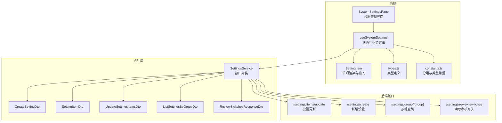
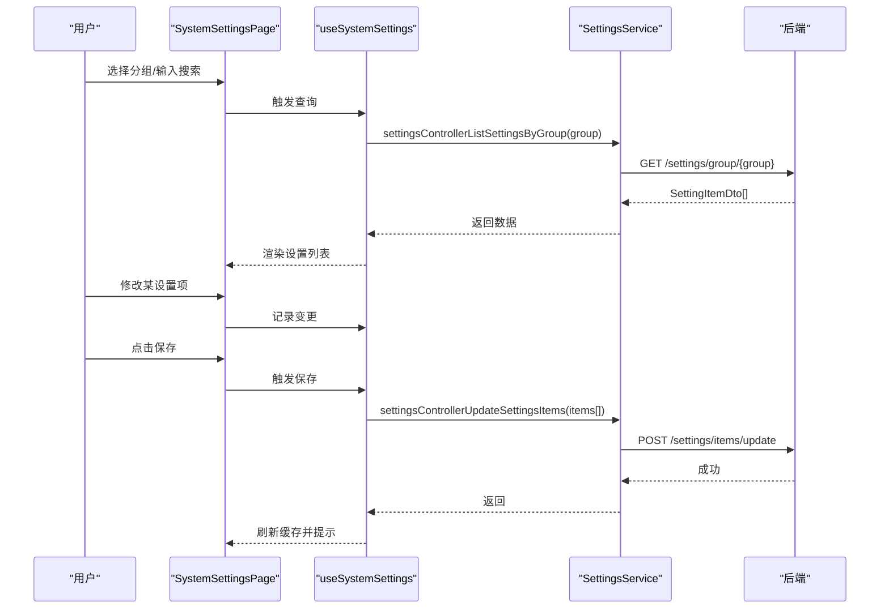
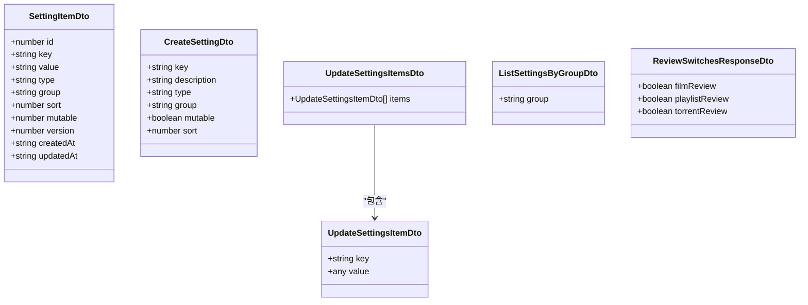
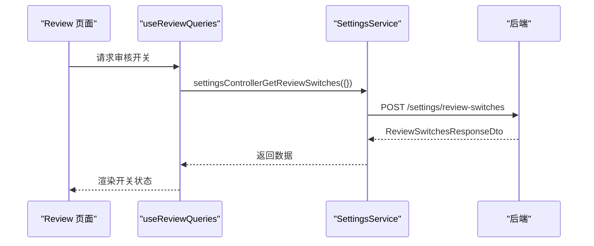
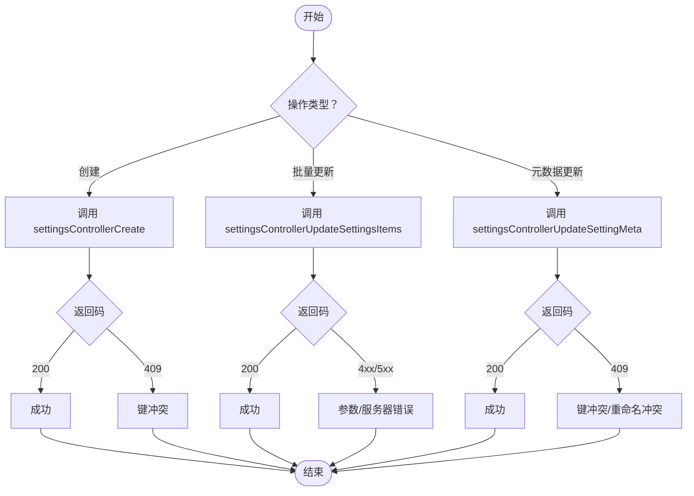
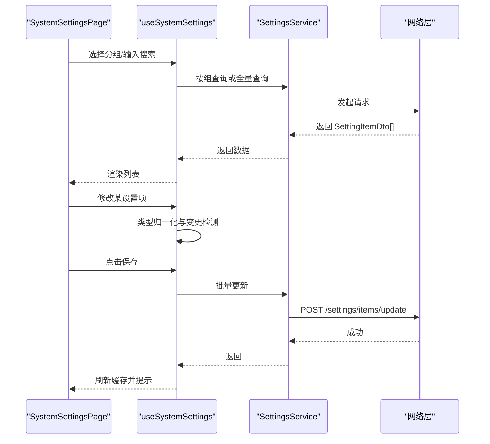
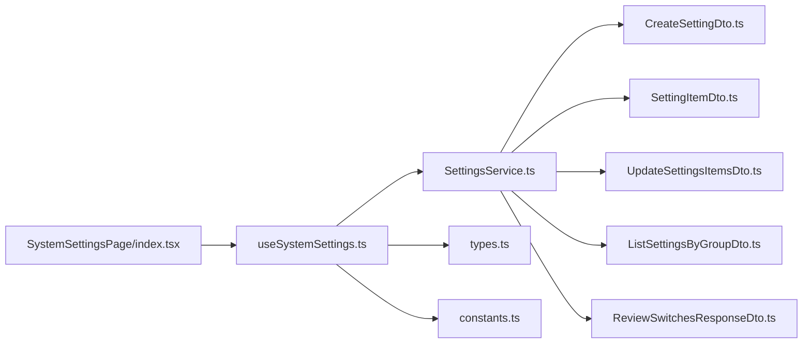

# 配置管理服务

<cite>
**本文引用的文件**
- [SettingsService.ts](file://src/api/services/SettingsService.ts)
- [CreateSettingDto.ts](file://src/api/models/CreateSettingDto.ts)
- [DeleteSettingDto.ts](file://src/api/models/DeleteSettingDto.ts)
- [DeleteSettingResponseDto.ts](file://src/api/models/DeleteSettingResponseDto.ts)
- [ListSettingsByGroupDto.ts](file://src/api/models/ListSettingsByGroupDto.ts)
- [SettingItemDto.ts](file://src/api/models/SettingItemDto.ts)
- [UpdateSettingsItemsDto.ts](file://src/api/models/UpdateSettingsItemsDto.ts)
- [UpdateSettingsItemDto.ts](file://src/api/models/UpdateSettingsItemDto.ts)
- [ReviewSwitchesResponseDto.ts](file://src/api/models/ReviewSwitchesResponseDto.ts)
- [useSystemSettings.ts](file://src/modules/admin/pages/system/SystemSettingsPage/hooks/useSystemSettings.ts)
- [SystemSettingsPage/index.tsx](file://src/modules/admin/pages/system/SystemSettingsPage/index.tsx)
- [SettingItem.tsx](file://src/modules/admin/pages/system/SystemSettingsPage/components/SettingItem.tsx)
- [constants.ts](file://src/modules/admin/pages/system/SystemSettingsPage/constants.ts)
- [types.ts](file://src/modules/admin/pages/system/SystemSettingsPage/types.ts)
- [useReviewQueries.ts](file://src/modules/app/pages/Review/hooks/useReviewQueries.ts)
</cite>

## 目录
1. [简介](#简介)
2. [项目结构](#项目结构)
3. [核心组件](#核心组件)
4. [架构总览](#架构总览)
5. [详细组件分析](#详细组件分析)
6. [依赖关系分析](#依赖关系分析)
7. [性能考量](#性能考量)
8. [故障排查指南](#故障排查指南)
9. [结论](#结论)
10. [附录](#附录)

## 简介
本技术文档围绕配置管理服务展开，系统性阐述系统设置的增删改查实现机制，涵盖设置项创建、批量更新、元数据管理、分组查询与审核开关读取等核心能力。文档同时解析设置数据模型、请求/响应格式与错误处理机制，并提供配置管理最佳实践（命名规范、分组策略、权限控制）以及配置迁移、备份恢复与版本管理的技术方案。

## 项目结构
配置管理功能主要由前端 API 层与页面层协作完成：
- API 层：通过 SettingsService 封装后端接口，定义请求/响应模型（CreateSettingDto、SettingItemDto、UpdateSettingsItemsDto 等）。
- 页面层：SystemSettingsPage 提供设置项的浏览、搜索、编辑、创建、保存、校验等交互；Review 页面通过 useReviewQueries 读取审核开关。

图表来源
- [SettingsService.ts](file://src/api/services/SettingsService.ts#L1-L219)
- [useSystemSettings.ts](file://src/modules/admin/pages/system/SystemSettingsPage/hooks/useSystemSettings.ts#L1-L511)
- [types.ts](file://src/modules/admin/pages/system/SystemSettingsPage/types.ts#L1-L49)
- [constants.ts](file://src/modules/admin/pages/system/SystemSettingsPage/constants.ts#L1-L80)

章节来源
- [SettingsService.ts](file://src/api/services/SettingsService.ts#L1-L219)
- [useSystemSettings.ts](file://src/modules/admin/pages/system/SystemSettingsPage/hooks/useSystemSettings.ts#L1-L511)
- [types.ts](file://src/modules/admin/pages/system/SystemSettingsPage/types.ts#L1-L49)
- [constants.ts](file://src/modules/admin/pages/system/SystemSettingsPage/constants.ts#L1-L80)

## 核心组件
- 设置项数据模型：SettingItemDto 描述键、值、类型、分组、排序、可变性、版本号、更新人与时间戳等字段。
- 创建设置模型：CreateSettingDto 支持设置键、描述、类型、分组、是否可运行时修改、排序等。
- 批量更新模型：UpdateSettingsItemsDto 包含待更新项数组，每项由 UpdateSettingsItemDto 组成。
- 分组查询模型：ListSettingsByGroupDto 以分组名进行查询。
- 审核开关模型：ReviewSwitchesResponseDto 返回电影、片单、种子的审核开关状态。
- 设置服务：SettingsService 封装了批量更新、新增、按组查询、审核开关读取等接口。
- 页面逻辑：useSystemSettings 负责数据拉取、变更检测、类型归一化、保存与创建提交、邮件配置诊断等。

章节来源
- [SettingItemDto.ts](file://src/api/models/SettingItemDto.ts#L1-L40)
- [CreateSettingDto.ts](file://src/api/models/CreateSettingDto.ts#L1-L46)
- [UpdateSettingsItemsDto.ts](file://src/api/models/UpdateSettingsItemsDto.ts#L1-L13)
- [UpdateSettingsItemDto.ts](file://src/api/models/UpdateSettingsItemDto.ts#L1-L15)
- [ListSettingsByGroupDto.ts](file://src/api/models/ListSettingsByGroupDto.ts#L1-L12)
- [ReviewSwitchesResponseDto.ts](file://src/api/models/ReviewSwitchesResponseDto.ts#L1-L11)
- [SettingsService.ts](file://src/api/services/SettingsService.ts#L1-L219)
- [useSystemSettings.ts](file://src/modules/admin/pages/system/SystemSettingsPage/hooks/useSystemSettings.ts#L1-L511)

## 架构总览
配置管理采用“页面逻辑 + API 封装 + 数据模型”的分层设计。页面通过 react-query 管理缓存与失效，统一调用 SettingsService 接口，实现设置项的增删改查与元数据维护。

图表来源
- [useSystemSettings.ts](file://src/modules/admin/pages/system/SystemSettingsPage/hooks/useSystemSettings.ts#L100-L156)
- [SettingsService.ts](file://src/api/services/SettingsService.ts#L77-L100)

章节来源
- [useSystemSettings.ts](file://src/modules/admin/pages/system/SystemSettingsPage/hooks/useSystemSettings.ts#L100-L156)
- [SettingsService.ts](file://src/api/services/SettingsService.ts#L77-L100)

## 详细组件分析

### 设置数据模型
- SettingItemDto：包含自增主键、创建/更新时间、软删除标记、键、值、类型、分组、排序、描述、可变性、JSON Schema、更新人、版本号等。
- CreateSettingDto：新增设置时的入参，支持键、描述、类型、分组、可变性、排序。
- UpdateSettingsItemsDto：批量更新入参，包含 items 数组，每项为 UpdateSettingsItemDto（键与值）。
- ListSettingsByGroupDto：按组查询的入参，包含 group 字段。
- ReviewSwitchesResponseDto：审核开关读取的出参，包含电影、片单、种子审核开关布尔值。

图表来源
- [SettingItemDto.ts](file://src/api/models/SettingItemDto.ts#L1-L40)
- [CreateSettingDto.ts](file://src/api/models/CreateSettingDto.ts#L1-L46)
- [UpdateSettingsItemsDto.ts](file://src/api/models/UpdateSettingsItemsDto.ts#L1-L13)
- [UpdateSettingsItemDto.ts](file://src/api/models/UpdateSettingsItemDto.ts#L1-L15)
- [ListSettingsByGroupDto.ts](file://src/api/models/ListSettingsByGroupDto.ts#L1-L12)
- [ReviewSwitchesResponseDto.ts](file://src/api/models/ReviewSwitchesResponseDto.ts#L1-L11)

章节来源
- [SettingItemDto.ts](file://src/api/models/SettingItemDto.ts#L1-L40)
- [CreateSettingDto.ts](file://src/api/models/CreateSettingDto.ts#L1-L46)
- [UpdateSettingsItemsDto.ts](file://src/api/models/UpdateSettingsItemsDto.ts#L1-L13)
- [UpdateSettingsItemDto.ts](file://src/api/models/UpdateSettingsItemDto.ts#L1-L15)
- [ListSettingsByGroupDto.ts](file://src/api/models/ListSettingsByGroupDto.ts#L1-L12)
- [ReviewSwitchesResponseDto.ts](file://src/api/models/ReviewSwitchesResponseDto.ts#L1-L11)

### 设置分组查询与审核开关读取
- 按组查询：通过 SettingsService.settingsControllerListSettingsByGroup(group) 实现，入参为 ListSettingsByGroupDto。
- 审核开关：通过 SettingsService.settingsControllerGetReviewSwitches({}) 实现，返回 ReviewSwitchesResponseDto，前端在 useReviewQueries 中消费该数据。

图表来源
- [useReviewQueries.ts](file://src/modules/app/pages/Review/hooks/useReviewQueries.ts#L224-L238)
- [SettingsService.ts](file://src/api/services/SettingsService.ts#L195-L217)

章节来源
- [useReviewQueries.ts](file://src/modules/app/pages/Review/hooks/useReviewQueries.ts#L224-L238)
- [SettingsService.ts](file://src/api/services/SettingsService.ts#L195-L217)

### 设置项创建、批量更新与元数据管理
- 创建设置：SettingsService.settingsControllerCreate(CreateSettingDto) 仅当键不存在时创建，存在则返回冲突。
- 批量更新：SettingsService.settingsControllerUpdateSettingsItems(UpdateSettingsItemsDto) 仅更新值，不支持重命名。
- 元数据更新：通过 settingsControllerUpdateSettingMeta（在 useSystemSettings 中调用）支持修改描述、类型、分组、可变性、排序，必要时支持重命名键。

图表来源
- [SettingsService.ts](file://src/api/services/SettingsService.ts#L107-L115)
- [SettingsService.ts](file://src/api/services/SettingsService.ts#L77-L100)
- [SettingsService.ts](file://src/api/services/SettingsService.ts#L1-L219)

章节来源
- [SettingsService.ts](file://src/api/services/SettingsService.ts#L107-L115)
- [SettingsService.ts](file://src/api/services/SettingsService.ts#L77-L100)
- [SettingsService.ts](file://src/api/services/SettingsService.ts#L1-L219)

### 页面交互与数据处理流程
- 数据拉取：根据是否处于搜索模式，分别调用“按组查询”或“全量详情查询”，并将后端返回映射为 SystemSetting。
- 变更检测：通过 normalizeAndEqual 对字符串、数字、布尔、JSON、时间、速率等类型进行归一化比较，确保变更判断准确。
- 保存流程：对变更项进行类型解析与序列化，调用批量更新接口，成功后刷新缓存并提示。
- 创建与元数据编辑：构造 CreateSettingDto 或更新元数据载荷，调用对应接口，成功后刷新分组数据并按需切换分组。

图表来源
- [useSystemSettings.ts](file://src/modules/admin/pages/system/SystemSettingsPage/hooks/useSystemSettings.ts#L100-L156)
- [useSystemSettings.ts](file://src/modules/admin/pages/system/SystemSettingsPage/hooks/useSystemSettings.ts#L349-L394)

章节来源
- [useSystemSettings.ts](file://src/modules/admin/pages/system/SystemSettingsPage/hooks/useSystemSettings.ts#L100-L156)
- [useSystemSettings.ts](file://src/modules/admin/pages/system/SystemSettingsPage/hooks/useSystemSettings.ts#L349-L394)

### 设置项渲染与输入控件
- SettingItem 渲染：根据类型显示标签颜色，支持不可变项提示与版本信息展示。
- 输入控件：根据类型动态生成输入框（字符串、数值、布尔、JSON、日期时间、密码、速率等），并在保存前进行解析与校验。

章节来源
- [SettingItem.tsx](file://src/modules/admin/pages/system/SystemSettingsPage/components/SettingItem.tsx#L243-L281)
- [types.ts](file://src/modules/admin/pages/system/SystemSettingsPage/types.ts#L1-L49)

## 依赖关系分析
- 页面层依赖：SystemSettingsPage 依赖 useSystemSettings；useSystemSettings 依赖 SettingsService、MailService、react-query、类型与常量。
- API 层依赖：SettingsService 依赖 OpenAPI 与 request，依赖各 DTO 模型。
- 数据模型：各 DTO 之间通过组合关系形成完整的请求/响应契约。

图表来源
- [SystemSettingsPage/index.tsx](file://src/modules/admin/pages/system/SystemSettingsPage/index.tsx#L98-L127)
- [useSystemSettings.ts](file://src/modules/admin/pages/system/SystemSettingsPage/hooks/useSystemSettings.ts#L1-L511)
- [SettingsService.ts](file://src/api/services/SettingsService.ts#L1-L219)
- [types.ts](file://src/modules/admin/pages/system/SystemSettingsPage/types.ts#L1-L49)
- [constants.ts](file://src/modules/admin/pages/system/SystemSettingsPage/constants.ts#L1-L80)

章节来源
- [SystemSettingsPage/index.tsx](file://src/modules/admin/pages/system/SystemSettingsPage/index.tsx#L98-L127)
- [useSystemSettings.ts](file://src/modules/admin/pages/system/SystemSettingsPage/hooks/useSystemSettings.ts#L1-L511)
- [SettingsService.ts](file://src/api/services/SettingsService.ts#L1-L219)
- [types.ts](file://src/modules/admin/pages/system/SystemSettingsPage/types.ts#L1-L49)
- [constants.ts](file://src/modules/admin/pages/system/SystemSettingsPage/constants.ts#L1-L80)

## 性能考量
- 查询缓存：react-query 默认 5 分钟的 staleTime，减少重复请求，提升交互流畅度。
- 变更检测：通过类型归一化与深比较，避免不必要的保存请求。
- 批量更新：将多处变更合并为一次批量请求，降低网络往返与数据库写入次数。
- 搜索优化：在搜索模式下一次性拉取全量设置，结合前端过滤，避免多次按组查询。

章节来源
- [useSystemSettings.ts](file://src/modules/admin/pages/system/SystemSettingsPage/hooks/useSystemSettings.ts#L155-L156)
- [useSystemSettings.ts](file://src/modules/admin/pages/system/SystemSettingsPage/hooks/useSystemSettings.ts#L350-L361)

## 故障排查指南
- 参数错误（400）：检查请求体字段是否符合 DTO 约束（如键、类型、分组、排序等）。
- 未认证/禁用（401/403）：确认登录状态与权限，确保具备管理员权限。
- 资源不存在（404）：检查设置键是否存在，或分组是否正确。
- 资源冲突（409）：创建时键已存在；元数据更新时重命名导致冲突。
- 服务器错误（500）：查看后端日志，定位具体异常点。

章节来源
- [SettingsService.ts](file://src/api/services/SettingsService.ts#L91-L98)
- [SettingsService.ts](file://src/api/services/SettingsService.ts#L209-L215)

## 结论
配置管理服务通过清晰的数据模型与稳定的 API 封装，实现了设置项的全生命周期管理。页面层以 react-query 优化交互体验，结合类型归一化与批量更新策略，兼顾易用性与性能。审核开关读取与邮件诊断等扩展能力进一步完善了运维与治理场景。

## 附录

### 最佳实践
- 命名规范
  - 键采用“分组.子键”形式，便于分组筛选与语义化识别。
  - 子键使用小驼峰，避免特殊字符与空格。
- 分组策略
  - 按功能域划分分组（如 site、tracker、register、mail、security、audit 等），保持与前端分组常量一致。
  - 同一分组内的键按 sort 升序排列，突出关键配置。
- 权限控制
  - 仅授权管理员可执行创建、更新、元数据修改；对敏感键（如密码、令牌）启用不可变性或运行时保护。
- 类型与校验
  - 明确设置类型（string/number/boolean/json/datetime/password/rate），前端进行解析与校验，后端严格验证。
- 版本与审计
  - 使用 version 字段跟踪变更版本；对关键配置变更记录 updated_by 与 updated_at，配合审计系统留存证据。

### 技术方案
- 配置迁移
  - 导出全量设置清单（键、值、类型、分组、排序、描述、可变性），在新环境导入时按 CreateSettingDto 创建缺失键，再通过批量更新补全值。
- 备份恢复
  - 定期导出 SettingItemDto 列表作为快照；恢复时先创建缺失键，再批量更新值，最后校验一致性。
- 版本管理
  - 引入变更日志：每次批量更新记录操作人、时间、键集合与变更摘要；版本号随更新递增，便于回滚与追踪。