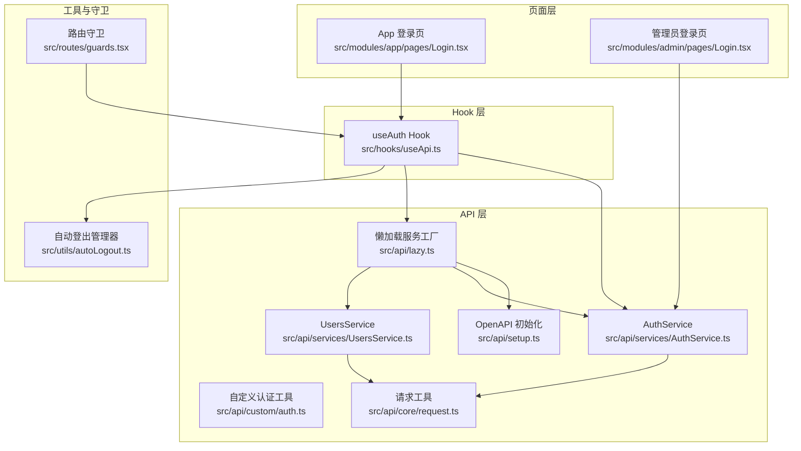
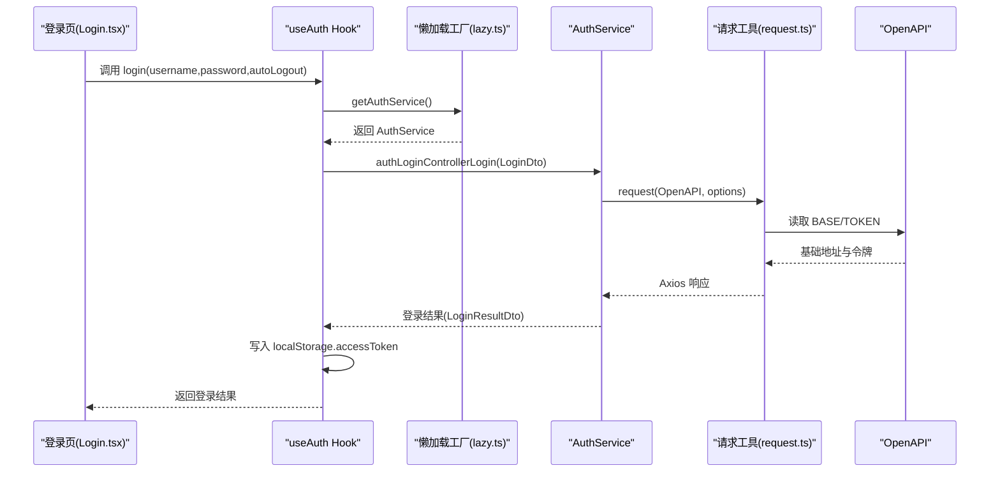
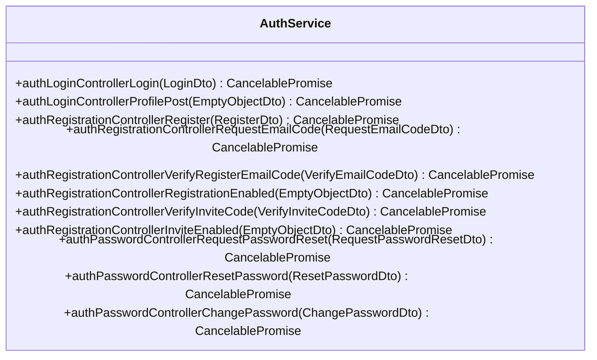
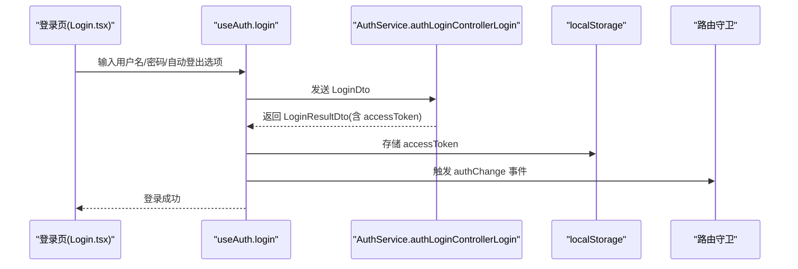
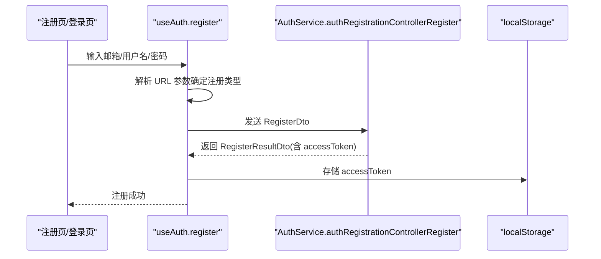
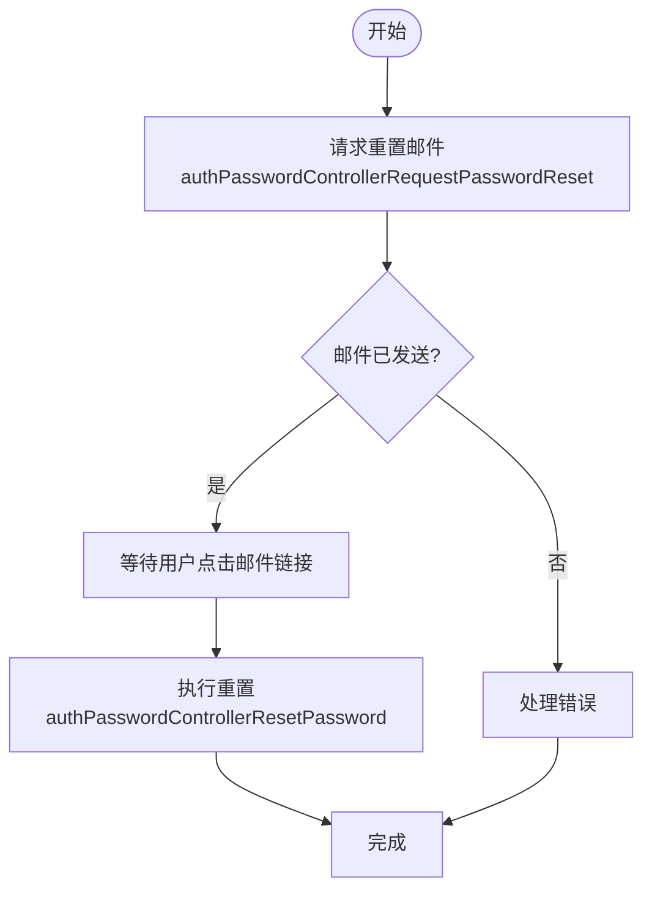
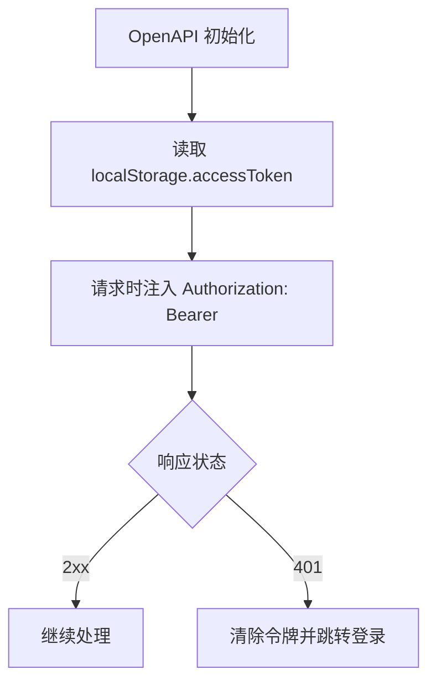
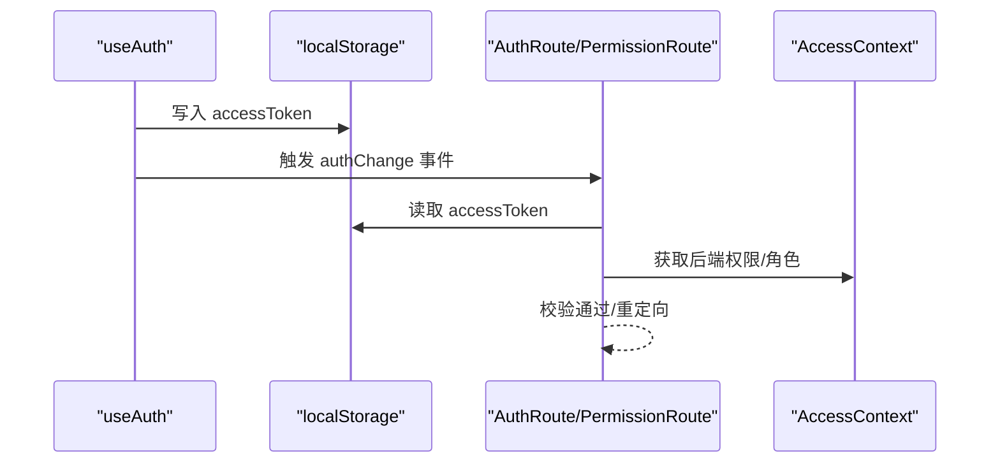
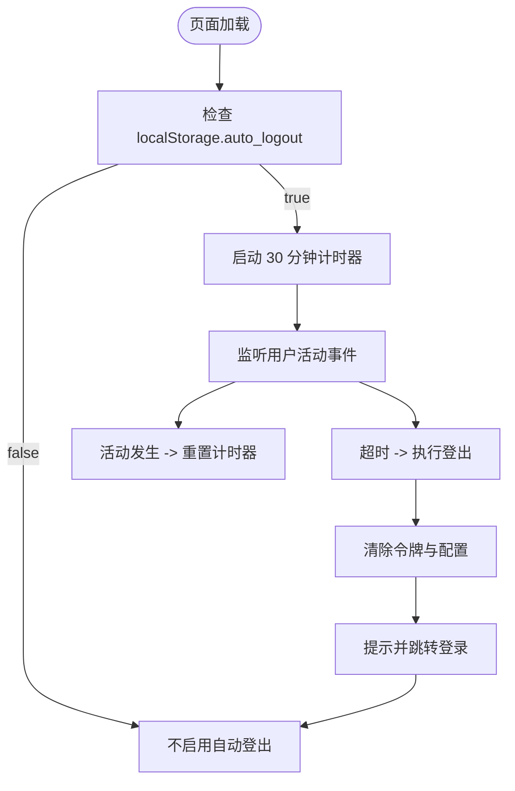
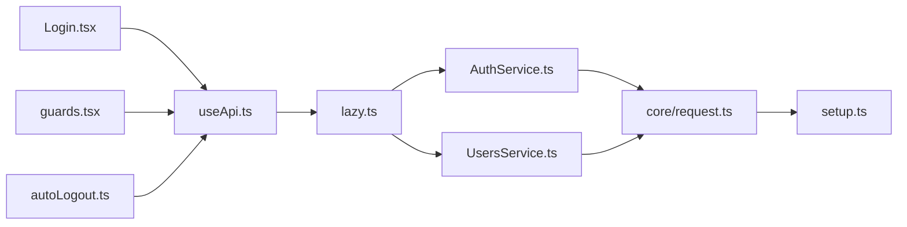

# 认证服务

<cite>
**本文档引用的文件**
- [src/api/custom/auth.ts](file://src/api/custom/auth.ts)
- [src/api/services/AuthService.ts](file://src/api/services/AuthService.ts)
- [src/api/services/UsersService.ts](file://src/api/services/UsersService.ts)
- [src/api/lazy.ts](file://src/api/lazy.ts)
- [src/api/setup.ts](file://src/api/setup.ts)
- [src/api/core/request.ts](file://src/api/core/request.ts)
- [src/hooks/useApi.ts](file://src/hooks/useApi.ts)
- [src/modules/app/pages/Login.tsx](file://src/modules/app/pages/Login.tsx)
- [src/modules/admin/pages/Login.tsx](file://src/modules/admin/pages/Login.tsx)
- [src/routes/guards.tsx](file://src/routes/guards.tsx)
- [src/utils/autoLogout.ts](file://src/utils/autoLogout.ts)
- [src/api/models/LoginDto.ts](file://src/api/models/LoginDto.ts)
- [src/api/models/RegisterDto.ts](file://src/api/models/RegisterDto.ts)
- [src/api/models/LoginResultDto.ts](file://src/api/models/LoginResultDto.ts)
- [src/api/models/RegisterResultDto.ts](file://src/api/models/RegisterResultDto.ts)
- [src/api/models/ChangePasswordDto.ts](file://src/api/models/ChangePasswordDto.ts)
- [src/api/models/ResetPasswordDto.ts](file://src/api/models/ResetPasswordDto.ts)
</cite>

## 目录
1. [简介](#简介)
2. [项目结构](#项目结构)
3. [核心组件](#核心组件)
4. [架构总览](#架构总览)
5. [详细组件分析](#详细组件分析)
6. [依赖关系分析](#依赖关系分析)
7. [性能考虑](#性能考虑)
8. [故障排查指南](#故障排查指南)
9. [结论](#结论)
10. [附录](#附录)

## 简介
本文件面向认证服务的使用者与维护者，系统性阐述 AuthService 的功能实现与使用方式，覆盖用户登录、注册、密码重置、会话管理、认证状态管理、自动登出等能力，并给出自定义认证适配器的开发指南、错误处理与用户体验优化建议。文档同时提供关键流程的时序图与类图，帮助读者快速理解代码结构与交互。

## 项目结构
认证相关代码主要分布在以下模块：
- API 层：基于 OpenAPI 生成的服务封装与请求工具
- Hook 层：React Hook 封装登录、注册、登出等业务逻辑
- 页面层：登录页与管理员登录页的表单与交互
- 路由守卫：基于本地存储与后端权限的访问控制
- 工具层：自动登出管理器与 OpenAPI 初始化

图表来源
- [src/modules/app/pages/Login.tsx](file://src/modules/app/pages/Login.tsx#L1-L204)
- [src/modules/admin/pages/Login.tsx](file://src/modules/admin/pages/Login.tsx#L1-L78)
- [src/hooks/useApi.ts](file://src/hooks/useApi.ts#L1-L141)
- [src/api/services/AuthService.ts](file://src/api/services/AuthService.ts#L1-L308)
- [src/api/services/UsersService.ts](file://src/api/services/UsersService.ts#L1-L405)
- [src/api/custom/auth.ts](file://src/api/custom/auth.ts#L1-L14)
- [src/api/lazy.ts](file://src/api/lazy.ts#L1-L75)
- [src/api/setup.ts](file://src/api/setup.ts#L1-L35)
- [src/api/core/request.ts](file://src/api/core/request.ts#L1-L324)
- [src/routes/guards.tsx](file://src/routes/guards.tsx#L1-L103)
- [src/utils/autoLogout.ts](file://src/utils/autoLogout.ts#L1-L96)

章节来源
- [src/api/services/AuthService.ts](file://src/api/services/AuthService.ts#L1-L308)
- [src/hooks/useApi.ts](file://src/hooks/useApi.ts#L1-L141)
- [src/api/lazy.ts](file://src/api/lazy.ts#L1-L75)
- [src/api/setup.ts](file://src/api/setup.ts#L1-L35)
- [src/api/core/request.ts](file://src/api/core/request.ts#L1-L324)
- [src/routes/guards.tsx](file://src/routes/guards.tsx#L1-L103)
- [src/utils/autoLogout.ts](file://src/utils/autoLogout.ts#L1-L96)

## 核心组件
- AuthService：封装登录、注册、验证码、邀请码、密码重置、修改密码等认证相关接口
- useAuth Hook：封装登录、注册、发送验证码、登出等业务逻辑，负责状态管理与错误处理
- 自定义认证工具：提供获取当前用户资料的便捷方法
- 路由守卫：基于本地令牌与后端权限进行访问控制
- 自动登出管理器：基于本地存储与用户活动监听的 30 分钟无操作自动登出

章节来源
- [src/api/services/AuthService.ts](file://src/api/services/AuthService.ts#L23-L307)
- [src/hooks/useApi.ts](file://src/hooks/useApi.ts#L11-L141)
- [src/api/custom/auth.ts](file://src/api/custom/auth.ts#L3-L13)
- [src/routes/guards.tsx](file://src/routes/guards.tsx#L11-L15)
- [src/utils/autoLogout.ts](file://src/utils/autoLogout.ts#L2-L85)

## 架构总览
认证服务采用“页面 -> Hook -> 服务 -> 请求工具”的分层设计，所有服务通过懒加载工厂统一获取，请求工具负责统一的头部注入与错误处理，OpenAPI 初始化集中配置基础地址与令牌读取策略。

图表来源
- [src/modules/app/pages/Login.tsx](file://src/modules/app/pages/Login.tsx#L32-L41)
- [src/hooks/useApi.ts](file://src/hooks/useApi.ts#L19-L65)
- [src/api/lazy.ts](file://src/api/lazy.ts#L48-L51)
- [src/api/services/AuthService.ts](file://src/api/services/AuthService.ts#L31-L53)
- [src/api/core/request.ts](file://src/api/core/request.ts#L294-L323)
- [src/api/setup.ts](file://src/api/setup.ts#L18-L34)

## 详细组件分析

### AuthService 功能与接口
AuthService 提供完整的认证生命周期接口，包括：
- 用户登录：返回访问令牌
- 当前用户信息：返回用户基本信息、角色与权限集合
- 用户注册并登录：返回访问令牌
- 邀请码相关：查询是否开放注册、验证邀请码、查询是否允许邀请注册
- 密码相关：请求找回密码邮件、执行密码重置、修改密码

图表来源
- [src/api/services/AuthService.ts](file://src/api/services/AuthService.ts#L23-L307)

章节来源
- [src/api/services/AuthService.ts](file://src/api/services/AuthService.ts#L23-L307)

### 登录流程（含自动登出选项）
登录流程支持“30 分钟无操作自动退出”选项，该选项通过 LoginDto 的 idleLogout30m 字段传递给后端。

图表来源
- [src/modules/app/pages/Login.tsx](file://src/modules/app/pages/Login.tsx#L32-L41)
- [src/hooks/useApi.ts](file://src/hooks/useApi.ts#L19-L65)
- [src/api/services/AuthService.ts](file://src/api/services/AuthService.ts#L31-L53)
- [src/api/models/LoginDto.ts](file://src/api/models/LoginDto.ts#L5-L12)

章节来源
- [src/modules/app/pages/Login.tsx](file://src/modules/app/pages/Login.tsx#L19-L41)
- [src/hooks/useApi.ts](file://src/hooks/useApi.ts#L19-L65)
- [src/api/models/LoginDto.ts](file://src/api/models/LoginDto.ts#L5-L12)

### 注册流程（开放注册/邀请注册）
注册流程根据 URL 中是否存在邀请码参数自动选择注册类型，并在成功后写入令牌。

图表来源
- [src/hooks/useApi.ts](file://src/hooks/useApi.ts#L67-L105)
- [src/api/services/AuthService.ts](file://src/api/services/AuthService.ts#L92-L110)
- [src/api/models/RegisterDto.ts](file://src/api/models/RegisterDto.ts#L5-L14)

章节来源
- [src/hooks/useApi.ts](file://src/hooks/useApi.ts#L67-L105)
- [src/api/models/RegisterDto.ts](file://src/api/models/RegisterDto.ts#L5-L14)

### 密码重置流程
密码重置分为两个阶段：请求重置邮件与执行重置。

图表来源
- [src/api/services/AuthService.ts](file://src/api/services/AuthService.ts#L236-L274)
- [src/api/models/ResetPasswordDto.ts](file://src/api/models/ResetPasswordDto.ts#L5-L15)

章节来源
- [src/api/services/AuthService.ts](file://src/api/services/AuthService.ts#L236-L274)
- [src/api/models/ResetPasswordDto.ts](file://src/api/models/ResetPasswordDto.ts#L5-L15)

### 会话管理与令牌处理
- 令牌读取：OpenAPI 初始化时从 localStorage 读取 accessToken
- 请求头注入：请求工具自动在 Authorization 头中附加 Bearer 令牌
- 登出清理：移除 localStorage 中的 accessToken 并刷新导航

图表来源
- [src/api/setup.ts](file://src/api/setup.ts#L18-L34)
- [src/api/core/request.ts](file://src/api/core/request.ts#L147-L191)
- [src/hooks/useApi.ts](file://src/hooks/useApi.ts#L124-L130)

章节来源
- [src/api/setup.ts](file://src/api/setup.ts#L18-L34)
- [src/api/core/request.ts](file://src/api/core/request.ts#L147-L191)
- [src/hooks/useApi.ts](file://src/hooks/useApi.ts#L124-L130)

### 认证状态管理与路由守卫
- 认证状态：useAuth 通过 localStorage 判断是否已登录
- 路由守卫：AuthRoute 基于令牌判断是否放行；PermissionRoute 结合后端权限与角色进行更细粒度控制
- 事件驱动：登录成功后触发 authChange 事件，通知守卫更新状态

图表来源
- [src/hooks/useApi.ts](file://src/hooks/useApi.ts#L46-L47)
- [src/routes/guards.tsx](file://src/routes/guards.tsx#L11-L15)
- [src/routes/guards.tsx](file://src/routes/guards.tsx#L20-L102)

章节来源
- [src/hooks/useApi.ts](file://src/hooks/useApi.ts#L11-L17)
- [src/routes/guards.tsx](file://src/routes/guards.tsx#L11-L15)
- [src/routes/guards.tsx](file://src/routes/guards.tsx#L20-L102)

### 自动登出机制
- 启用条件：localStorage 中 auto_logout 为 true
- 监听用户活动：鼠标、键盘、触摸、滚动等事件重置计时器
- 超时处理：30 分钟无操作自动清除令牌并跳转登录页

图表来源
- [src/utils/autoLogout.ts](file://src/utils/autoLogout.ts#L8-L23)
- [src/utils/autoLogout.ts](file://src/utils/autoLogout.ts#L35-L39)
- [src/utils/autoLogout.ts](file://src/utils/autoLogout.ts#L42-L56)
- [src/utils/autoLogout.ts](file://src/utils/autoLogout.ts#L58-L74)

章节来源
- [src/utils/autoLogout.ts](file://src/utils/autoLogout.ts#L1-L96)

### 自定义认证适配器开发指南
- 适配器职责：封装特定认证场景的请求与响应处理
- 推荐做法：
  - 通过懒加载工厂获取服务实例，避免打包时的动态导入警告
  - 统一错误消息提取与用户提示
  - 在登录成功后同步更新认证状态与导航配置
- 示例路径：
  - 自定义认证工具：[src/api/custom/auth.ts](file://src/api/custom/auth.ts#L3-L13)
  - 懒加载工厂：[src/api/lazy.ts](file://src/api/lazy.ts#L48-L51)
  - 错误处理工具：[src/hooks/useApi.ts](file://src/hooks/useApi.ts#L6-L6)

章节来源
- [src/api/custom/auth.ts](file://src/api/custom/auth.ts#L1-L14)
- [src/api/lazy.ts](file://src/api/lazy.ts#L48-L51)
- [src/hooks/useApi.ts](file://src/hooks/useApi.ts#L6-L6)

## 依赖关系分析
- 组件耦合：
  - 页面层仅依赖 Hook，降低与服务层的耦合
  - Hook 通过懒加载工厂获取服务，避免循环依赖
  - 请求工具集中处理头部与错误，提升复用性
- 外部依赖：
  - Axios 用于网络请求
  - OpenAPI 配置用于统一基础地址与令牌读取
  - React Query 用于缓存与失效

图表来源
- [src/modules/app/pages/Login.tsx](file://src/modules/app/pages/Login.tsx#L9)
- [src/hooks/useApi.ts](file://src/hooks/useApi.ts#L3-L6)
- [src/api/lazy.ts](file://src/api/lazy.ts#L48-L51)
- [src/api/services/AuthService.ts](file://src/api/services/AuthService.ts#L21-L22)
- [src/api/services/UsersService.ts](file://src/api/services/UsersService.ts#L24-L25)
- [src/api/core/request.ts](file://src/api/core/request.ts#L5-L14)
- [src/api/setup.ts](file://src/api/setup.ts#L1-L35)
- [src/routes/guards.tsx](file://src/routes/guards.tsx#L1-L7)
- [src/utils/autoLogout.ts](file://src/utils/autoLogout.ts#L1-L2)

章节来源
- [src/hooks/useApi.ts](file://src/hooks/useApi.ts#L1-L141)
- [src/api/lazy.ts](file://src/api/lazy.ts#L1-L75)
- [src/api/core/request.ts](file://src/api/core/request.ts#L1-L324)
- [src/api/setup.ts](file://src/api/setup.ts#L1-L35)
- [src/routes/guards.tsx](file://src/routes/guards.tsx#L1-L103)
- [src/utils/autoLogout.ts](file://src/utils/autoLogout.ts#L1-L96)

## 性能考虑
- 懒加载服务：通过懒加载工厂减少初始包体与避免构建警告
- 请求去抖与取消：请求工具支持可取消 Promise，避免竞态与内存泄漏
- 缓存与失效：React Query 在登录成功后主动失效路由配置与导航缓存，保证状态一致性
- 本地存储：令牌与自动登出配置均使用 localStorage，避免频繁网络请求

## 故障排查指南
- 登录失败：
  - 检查 LoginDto 参数是否正确
  - 查看后端返回的错误码与消息，必要时使用错误提取工具
  - 确认 OpenAPI 基础地址与令牌读取策略
- 注册失败：
  - 确认邀请码参数与注册类型
  - 检查邮箱验证码发送与验证流程
- 密码重置失败：
  - 确认邮件链接中的 token 是否过期
  - 检查新密码格式与确认密码一致性
- 自动登出异常：
  - 检查 localStorage.auto_logout 是否为 true
  - 确认用户活动监听是否正常工作

章节来源
- [src/hooks/useApi.ts](file://src/hooks/useApi.ts#L56-L60)
- [src/hooks/useApi.ts](file://src/hooks/useApi.ts#L98-L102)
- [src/api/services/AuthService.ts](file://src/api/services/AuthService.ts#L236-L274)
- [src/utils/autoLogout.ts](file://src/utils/autoLogout.ts#L11-L14)
- [src/utils/autoLogout.ts](file://src/utils/autoLogout.ts#L58-L74)

## 结论
认证服务通过清晰的分层设计与统一的请求工具，提供了完整的登录、注册、密码重置与会话管理能力。结合路由守卫与自动登出机制，既保障了安全性，也提升了用户体验。建议在扩展新认证适配器时遵循懒加载与错误处理的最佳实践，确保系统的可维护性与稳定性。

## 附录
- 常用模型：
  - 登录参数：[src/api/models/LoginDto.ts](file://src/api/models/LoginDto.ts#L5-L12)
  - 注册参数：[src/api/models/RegisterDto.ts](file://src/api/models/RegisterDto.ts#L5-L14)
  - 登录结果：[src/api/models/LoginResultDto.ts](file://src/api/models/LoginResultDto.ts#L5-L7)
  - 注册结果：[src/api/models/RegisterResultDto.ts](file://src/api/models/RegisterResultDto.ts#L5-L9)
  - 修改密码参数：[src/api/models/ChangePasswordDto.ts](file://src/api/models/ChangePasswordDto.ts#L5-L18)
  - 重置密码参数：[src/api/models/ResetPasswordDto.ts](file://src/api/models/ResetPasswordDto.ts#L5-L15)