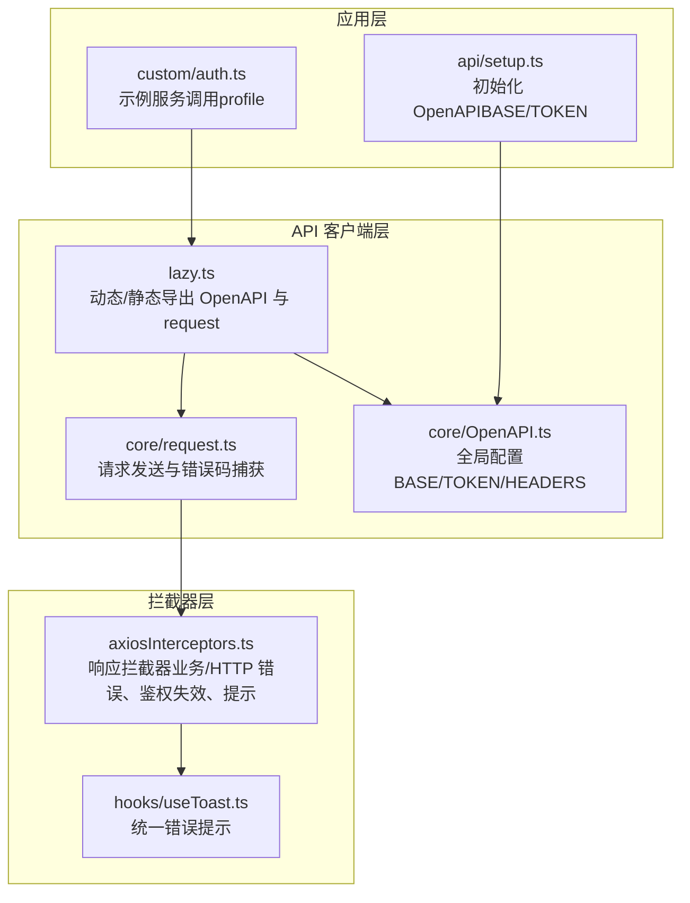
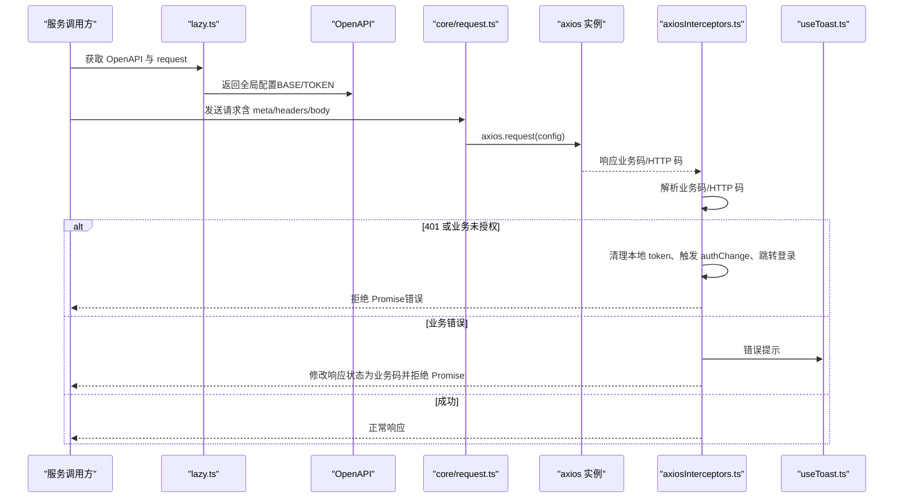
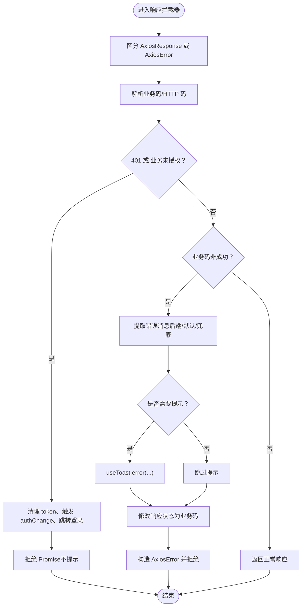
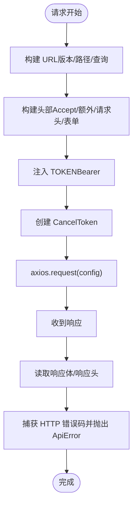
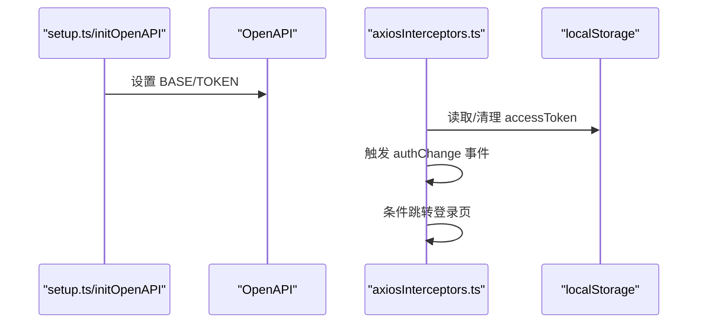
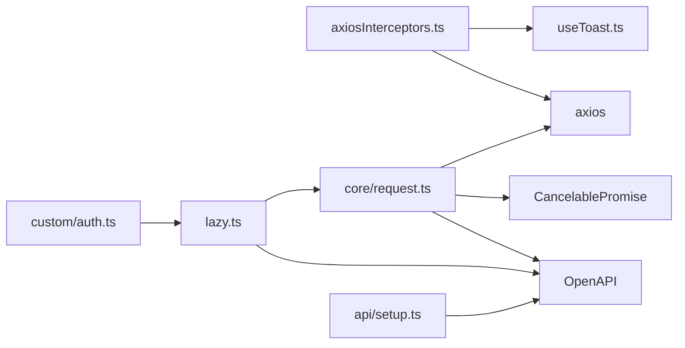

# 请求拦截器

<cite>
**本文引用的文件**   
- [axiosInterceptors.ts](file://src/api/axiosInterceptors.ts)
- [request.ts](file://src/api/core/request.ts)
- [OpenAPI.ts](file://src/api/core/OpenAPI.ts)
- [setup.ts](file://src/api/setup.ts)
- [lazy.ts](file://src/api/lazy.ts)
- [useToast.ts](file://src/hooks/useToast.ts)
- [auth.ts](file://src/api/custom/auth.ts)
</cite>

## 目录
1. [简介](#简介)
2. [项目结构](#项目结构)
3. [核心组件](#核心组件)
4. [架构总览](#架构总览)
5. [详细组件分析](#详细组件分析)
6. [依赖关系分析](#依赖关系分析)
7. [性能考量](#性能考量)
8. [故障排查指南](#故障排查指南)
9. [结论](#结论)
10. [附录](#附录)

## 简介
本文件面向“请求拦截器”的技术文档，围绕 axios 拦截器在本项目中的实现与使用进行系统性说明。重点包括：
- 拦截器的实现原理与控制流
- 请求预处理与响应后处理机制
- 认证令牌管理、错误提取与提示策略
- 取消请求、超时与网络异常处理
- 拦截器配置示例、自定义扩展与调试技巧
- 性能优化、内存管理与最佳实践

## 项目结构
本项目采用 openapi-typescript-codegen 生成的 API 客户端体系，并通过 axios 拦截器统一处理业务错误、鉴权失效与错误提示。关键文件与职责如下：
- axios 拦截器：统一处理业务错误码、HTTP 错误、鉴权失效与错误提示
- 请求封装：OpenAPI 配置、请求头注入、可取消请求、错误码捕获
- 初始化：OpenAPI 基础地址与令牌读取策略
- 动态加载：懒加载 OpenAPI 与请求方法，避免打包警告
- 通知：统一的 toast 错误提示

图表来源
- [axiosInterceptors.ts](file://src/api/axiosInterceptors.ts#L1-L294)
- [request.ts](file://src/api/core/request.ts#L1-L324)
- [OpenAPI.ts](file://src/api/core/OpenAPI.ts#L1-L33)
- [setup.ts](file://src/api/setup.ts#L1-L35)
- [lazy.ts](file://src/api/lazy.ts#L1-L75)
- [useToast.ts](file://src/hooks/useToast.ts#L1-L58)
- [auth.ts](file://src/api/custom/auth.ts#L1-L14)

章节来源
- [axiosInterceptors.ts](file://src/api/axiosInterceptors.ts#L1-L294)
- [request.ts](file://src/api/core/request.ts#L1-L324)
- [OpenAPI.ts](file://src/api/core/OpenAPI.ts#L1-L33)
- [setup.ts](file://src/api/setup.ts#L1-L35)
- [lazy.ts](file://src/api/lazy.ts#L1-L75)
- [useToast.ts](file://src/hooks/useToast.ts#L1-L58)
- [auth.ts](file://src/api/custom/auth.ts#L1-L14)

## 核心组件
- axios 拦截器：负责响应拦截，解析业务错误码与 HTTP 错误，统一错误提示与鉴权失效处理
- 请求封装：基于 OpenAPI 配置生成 URL、注入头部、发送请求、捕获错误码
- OpenAPI 初始化：集中设置 BASE 与 TOKEN，保证请求一致性
- 懒加载：避免静态导入导致的打包警告，同时保留异步接口
- 统一提示：基于 toast 的错误提示封装

章节来源
- [axiosInterceptors.ts](file://src/api/axiosInterceptors.ts#L1-L294)
- [request.ts](file://src/api/core/request.ts#L1-L324)
- [OpenAPI.ts](file://src/api/core/OpenAPI.ts#L1-L33)
- [setup.ts](file://src/api/setup.ts#L1-L35)
- [lazy.ts](file://src/api/lazy.ts#L1-L75)
- [useToast.ts](file://src/hooks/useToast.ts#L1-L58)

## 架构总览
下图展示从服务调用到拦截器处理的关键流程，以及与 OpenAPI、请求封装、提示系统的交互。

图表来源
- [axiosInterceptors.ts](file://src/api/axiosInterceptors.ts#L196-L292)
- [request.ts](file://src/api/core/request.ts#L294-L324)
- [OpenAPI.ts](file://src/api/core/OpenAPI.ts#L10-L32)
- [lazy.ts](file://src/api/lazy.ts#L11-L29)
- [useToast.ts](file://src/hooks/useToast.ts#L12-L57)

## 详细组件分析

### 拦截器实现与控制流
- 安装保护：防止重复安装
- 响应拦截器（成功/失败）：
  - 成功响应：检查业务码，非成功时构造 AxiosError 并拒绝链路，便于上层捕获
  - 失败响应：优先判断业务码，其次 HTTP 状态；401 统一处理鉴权失效
- 错误提取与提示：
  - 优先使用后端 message；否则按 HTTP/业务码映射默认文案；最后兜底
  - 支持 meta.silent、meta.skipErrorCodes、meta.skipBusinessCodes 控制提示
- 鉴权失效处理：
  - 清理本地 token、触发 authChange 全局事件、避免重复跳转
  - 非公开路径访问时跳转登录页并携带来源地址

图表来源
- [axiosInterceptors.ts](file://src/api/axiosInterceptors.ts#L204-L291)

章节来源
- [axiosInterceptors.ts](file://src/api/axiosInterceptors.ts#L196-L292)

### 请求预处理与响应后处理
- 请求预处理：
  - 生成 URL（替换版本号与路径参数）、拼接查询字符串
  - 注入头部：Accept、额外头部、请求头、表单头部；根据内容类型设置 Content-Type
  - 认证：若存在 TOKEN，则附加 Authorization: Bearer
  - 取消：为每个请求创建 CancelToken，支持 onAbort
- 响应后处理：
  - 读取响应体或响应头（204 无内容）
  - 捕获 HTTP 错误码并抛出 ApiError
  - 成功时返回结果体

图表来源
- [request.ts](file://src/api/core/request.ts#L92-L324)

章节来源
- [request.ts](file://src/api/core/request.ts#L1-L324)

### 认证令牌管理
- OpenAPI 初始化：
  - 设置 BASE（去除末尾斜杠）
  - 设置 TOKEN 读取策略（从 localStorage 读取 accessToken）
- 拦截器中的鉴权失效处理：
  - 清理本地 token
  - 触发 authChange 全局事件
  - 避免重复跳转与公共路径跳转
- 示例服务调用：
  - 通过 lazy.ts 获取 OpenAPI 与 request，再发起请求

图表来源
- [setup.ts](file://src/api/setup.ts#L18-L34)
- [axiosInterceptors.ts](file://src/api/axiosInterceptors.ts#L166-L192)
- [OpenAPI.ts](file://src/api/core/OpenAPI.ts#L22-L32)

章节来源
- [setup.ts](file://src/api/setup.ts#L1-L35)
- [axiosInterceptors.ts](file://src/api/axiosInterceptors.ts#L166-L192)
- [OpenAPI.ts](file://src/api/core/OpenAPI.ts#L1-L33)

### 错误处理与提示策略
- 错误消息提取优先级：
  - 后端 message
  - meta.customErrorMessage
  - HTTP/业务码映射文案
  - 网络错误兜底
- 提示控制：
  - meta.silent：静默模式
  - meta.skipErrorCodes/skipBusinessCodes：跳过特定错误码提示
- 统一错误提示：
  - 使用 useToast.error 输出错误消息

章节来源
- [axiosInterceptors.ts](file://src/api/axiosInterceptors.ts#L77-L161)
- [useToast.ts](file://src/hooks/useToast.ts#L12-L57)

### 取消请求、超时与网络异常
- 取消请求：
  - request.ts 为每个请求创建 CancelToken，并在 onAbort 中调用 source.cancel
  - CancelablePromise 提供 cancel 接口，触发所有取消处理器并拒绝 Promise
- 超时与网络异常：
  - axios 内部处理超时与网络错误；拦截器对 ECONNABORTED/ERR_NETWORK 进行友好文案映射
  - 对于 HTTP 错误，仍会返回响应（若有），便于上层区分处理

章节来源
- [request.ts](file://src/api/core/request.ts#L210-L233)
- [axiosInterceptors.ts](file://src/api/axiosInterceptors.ts#L136-L144)

### 拦截器配置示例与自定义扩展
- 在应用入口初始化 OpenAPI（BASE/TOKEN）：
  - 参考 [setup.ts](file://src/api/setup.ts#L18-L34)
- 安装拦截器：
  - 参考 [axiosInterceptors.ts](file://src/api/axiosInterceptors.ts#L196-L201)
- 服务调用示例（profile）：
  - 参考 [auth.ts](file://src/api/custom/auth.ts#L3-L13)
- 自定义拦截器开发建议：
  - 通过 meta 字段传递行为控制（silent/skip...）
  - 在拦截器中统一处理业务错误与 HTTP 错误，保持上层调用一致性
  - 如需重试策略，可在拦截器外层封装或在服务层实现，避免在拦截器内引入复杂状态

章节来源
- [setup.ts](file://src/api/setup.ts#L1-L35)
- [axiosInterceptors.ts](file://src/api/axiosInterceptors.ts#L1-L294)
- [auth.ts](file://src/api/custom/auth.ts#L1-L14)

### 调试技巧
- 开发环境日志：
  - 拦截器在开发环境会输出错误详情（分组日志），便于定位问题
- 统一错误提示：
  - 使用 useToast.error 快速验证错误路径
- OpenAPI 配置核对：
  - 确认 BASE 与 TOKEN 是否正确设置，避免路径拼接与鉴权问题

章节来源
- [axiosInterceptors.ts](file://src/api/axiosInterceptors.ts#L217-L223)
- [axiosInterceptors.ts](file://src/api/axiosInterceptors.ts#L267-L274)
- [setup.ts](file://src/api/setup.ts#L18-L34)

## 依赖关系分析
- 拦截器依赖 axios 与自定义错误消息提取逻辑
- 请求封装依赖 OpenAPI 配置与 CancelablePromise
- 懒加载模块避免静态导入带来的打包警告
- 统一提示依赖 toast 库

图表来源
- [axiosInterceptors.ts](file://src/api/axiosInterceptors.ts#L1-L294)
- [request.ts](file://src/api/core/request.ts#L1-L324)
- [OpenAPI.ts](file://src/api/core/OpenAPI.ts#L1-L33)
- [lazy.ts](file://src/api/lazy.ts#L1-L75)
- [setup.ts](file://src/api/setup.ts#L1-L35)
- [useToast.ts](file://src/hooks/useToast.ts#L1-L58)
- [auth.ts](file://src/api/custom/auth.ts#L1-L14)

章节来源
- [axiosInterceptors.ts](file://src/api/axiosInterceptors.ts#L1-L294)
- [request.ts](file://src/api/core/request.ts#L1-L324)
- [OpenAPI.ts](file://src/api/core/OpenAPI.ts#L1-L33)
- [lazy.ts](file://src/api/lazy.ts#L1-L75)
- [setup.ts](file://src/api/setup.ts#L1-L35)
- [useToast.ts](file://src/hooks/useToast.ts#L1-L58)
- [auth.ts](file://src/api/custom/auth.ts#L1-L14)

## 性能考量
- 避免重复安装拦截器：拦截器内部有 installed 标记，确保只安装一次
- 减少不必要的提示：通过 meta.silent 与 skip 列表降低 UI 压力
- 取消请求及时释放：使用 CancelToken 与 CancelablePromise，避免悬挂请求占用资源
- OpenAPI 初始化去重：通过全局标记确保仅初始化一次，避免重复设置配置
- 路径规范化：BASE 去除尾斜杠，减少拼接错误与二次处理开销

章节来源
- [axiosInterceptors.ts](file://src/api/axiosInterceptors.ts#L196-L201)
- [setup.ts](file://src/api/setup.ts#L18-L34)

## 故障排查指南
- 401 未授权
  - 检查本地 token 是否存在与过期
  - 确认拦截器是否正确清理 token 并触发 authChange
  - 验证是否跳转到登录页并携带来源地址
- 业务错误未提示
  - 检查 meta.silent 与 skip 列表
  - 确认后端 message 是否为空
- 超时/网络异常
  - 查看错误码映射是否命中 ECONNABORTED/ERR_NETWORK
  - 检查网络状态与代理设置
- 取消请求无效
  - 确认 onAbort 是否注册 CancelToken
  - 检查 CancelablePromise 的 cancel 是否被调用

章节来源
- [axiosInterceptors.ts](file://src/api/axiosInterceptors.ts#L166-L192)
- [axiosInterceptors.ts](file://src/api/axiosInterceptors.ts#L136-L144)
- [request.ts](file://src/api/core/request.ts#L210-L233)

## 结论
本项目的 axios 拦截器通过统一的业务错误处理、鉴权失效处理与错误提示策略，显著提升了前端请求的一致性与可维护性。结合 OpenAPI 初始化、请求封装与可取消请求能力，形成了清晰的请求生命周期闭环。建议在实际开发中充分利用 meta 行为控制与拦截器扩展点，确保错误处理与用户体验的平衡。

## 附录
- OpenAPI 配置项参考
  - BASE：后端基础地址
  - TOKEN：令牌读取策略
  - HEADERS：额外请求头
  - WITH_CREDENTIALS/CREDENTIALS：跨域凭据策略
- 常用错误码映射
  - 业务错误码：如未授权、禁止、不存在、内部错误等
  - HTTP 状态码：如 400/401/403/404/429/500/502/503/504 等

章节来源
- [OpenAPI.ts](file://src/api/core/OpenAPI.ts#L10-L32)
- [axiosInterceptors.ts](file://src/api/axiosInterceptors.ts#L109-L144)