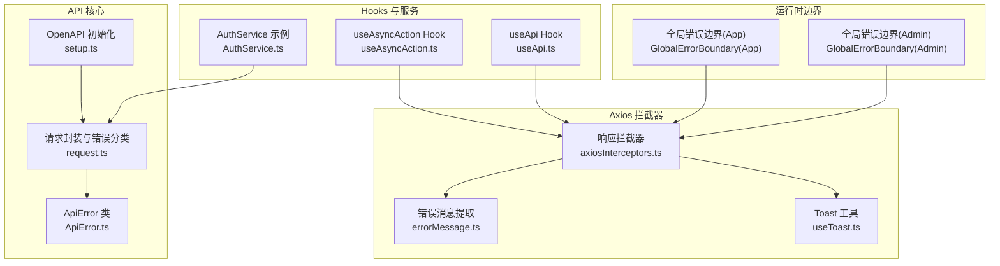
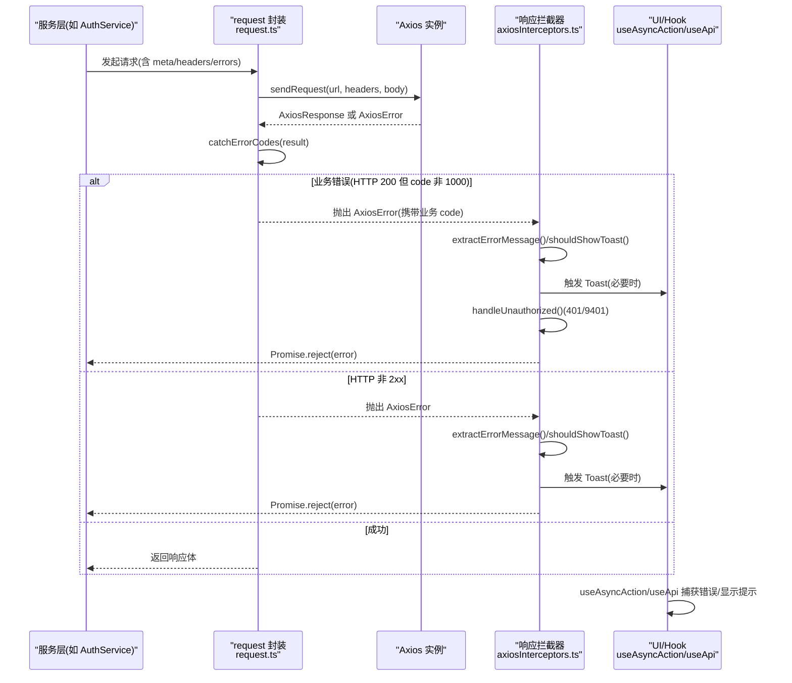
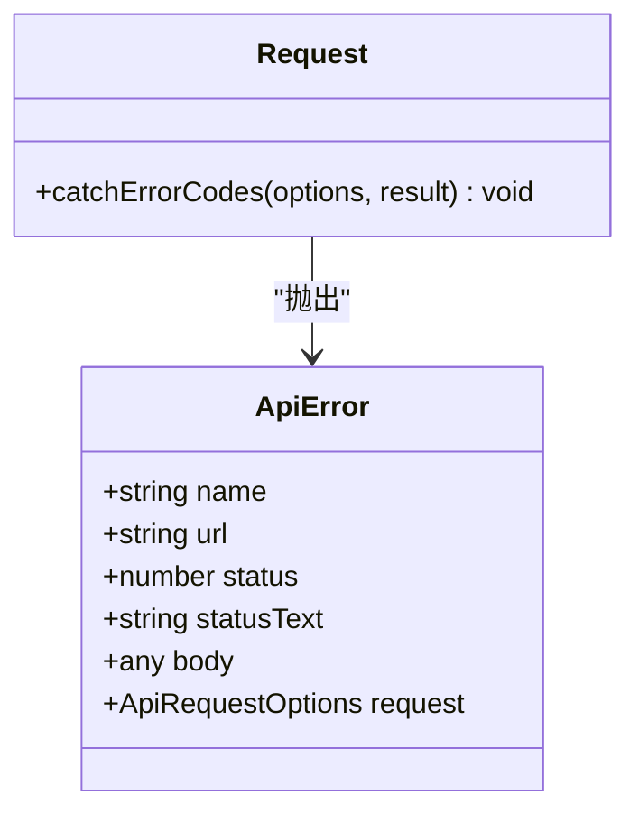
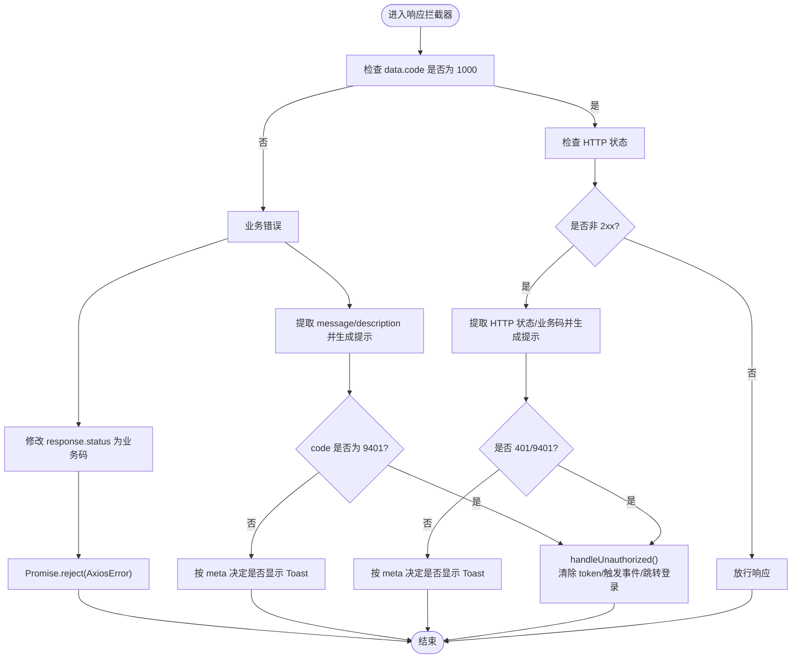
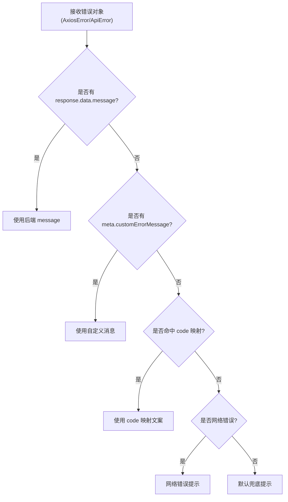
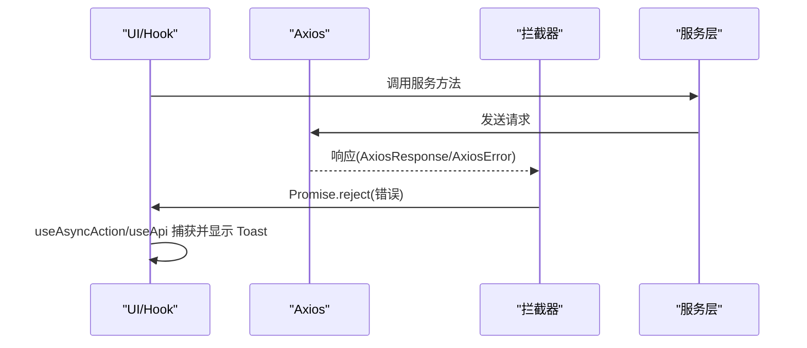
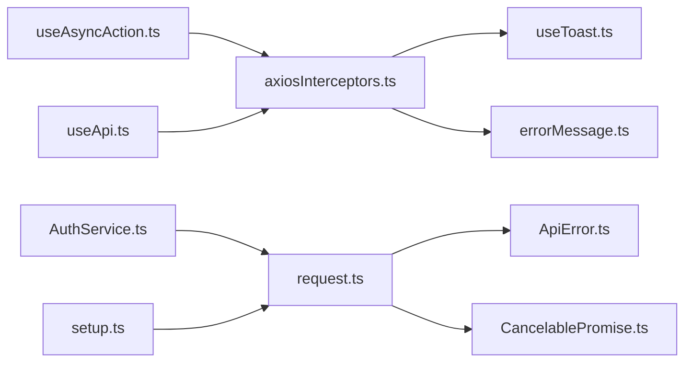

# 错误处理机制

<cite>
**本文引用的文件**   
- [ApiError.ts](file://src/api/core/ApiError.ts)
- [request.ts](file://src/api/core/request.ts)
- [axiosInterceptors.ts](file://src/api/axiosInterceptors.ts)
- [errorMessage.ts](file://src/utils/errorMessage.ts)
- [useAsyncAction.ts](file://src/hooks/useAsyncAction.ts)
- [useApi.ts](file://src/hooks/useApi.ts)
- [useToast.ts](file://src/hooks/useToast.ts)
- [setup.ts](file://src/api/setup.ts)
- [AuthService.ts](file://src/api/services/AuthService.ts)
- [GlobalErrorBoundary(App)](file://src/modules/app/layouts/GlobalErrorBoundary/index.tsx)
- [GlobalErrorBoundary(Admin)](file://src/modules/admin/layouts/GlobalErrorBoundary/index.tsx)
</cite>

## 目录
1. [简介](#简介)
2. [项目结构](#项目结构)
3. [核心组件](#核心组件)
4. [架构总览](#架构总览)
5. [详细组件分析](#详细组件分析)
6. [依赖关系分析](#依赖关系分析)
7. [性能考量](#性能考量)
8. [故障排除指南](#故障排除指南)
9. [结论](#结论)
10. [附录](#附录)

## 简介
本文件系统性梳理 zTorrent 站点前端的错误处理机制，覆盖 API 错误类型与分类、错误码定义与错误信息格式、ApiError 类结构、错误捕获与传播链路、网络/业务/系统三类错误的处理策略，并提供用户友好提示、日志记录、错误监控与调试排障建议。目标是帮助开发者快速理解与扩展错误处理体系，提升用户体验与可维护性。

## 项目结构
围绕错误处理的关键目录与文件如下：
- API 核心层：ApiError、request、OpenAPI 初始化
- Axios 拦截器：统一业务错误与 HTTP 错误处理、鉴权失败跳转、Toast 提示、日志输出
- 工具与 Hooks：错误消息提取、异步动作封装、全局错误边界
- 服务层示例：AuthService 展示如何声明 HTTP 错误映射

**图表来源**
- [setup.ts](file://src/api/setup.ts#L18-L34)
- [ApiError.ts](file://src/api/core/ApiError.ts#L8-L24)
- [request.ts](file://src/api/core/request.ts#L294-L323)
- [axiosInterceptors.ts](file://src/api/axiosInterceptors.ts#L196-L292)
- [errorMessage.ts](file://src/utils/errorMessage.ts#L1-L11)
- [useToast.ts](file://src/hooks/useToast.ts#L12-L57)
- [useAsyncAction.ts](file://src/hooks/useAsyncAction.ts#L11-L45)
- [useApi.ts](file://src/hooks/useApi.ts#L11-L141)
- [AuthService.ts](file://src/api/services/AuthService.ts#L31-L53)
- [GlobalErrorBoundary(App)](file://src/modules/app/layouts/GlobalErrorBoundary/index.tsx#L17-L34)
- [GlobalErrorBoundary(Admin)](file://src/modules/admin/layouts/GlobalErrorBoundary/index.tsx#L13-L26)

**章节来源**
- [setup.ts](file://src/api/setup.ts#L18-L34)
- [ApiError.ts](file://src/api/core/ApiError.ts#L8-L24)
- [request.ts](file://src/api/core/request.ts#L294-L323)
- [axiosInterceptors.ts](file://src/api/axiosInterceptors.ts#L196-L292)
- [errorMessage.ts](file://src/utils/errorMessage.ts#L1-L11)
- [useToast.ts](file://src/hooks/useToast.ts#L12-L57)
- [useAsyncAction.ts](file://src/hooks/useAsyncAction.ts#L11-L45)
- [useApi.ts](file://src/hooks/useApi.ts#L11-L141)
- [AuthService.ts](file://src/api/services/AuthService.ts#L31-L53)
- [GlobalErrorBoundary(App)](file://src/modules/app/layouts/GlobalErrorBoundary/index.tsx#L17-L34)
- [GlobalErrorBoundary(Admin)](file://src/modules/admin/layouts/GlobalErrorBoundary/index.tsx#L13-L26)

## 核心组件
- ApiError 类：继承原生 Error，承载 HTTP URL、状态码、状态文本、响应体与请求上下文，便于统一捕获与日志记录。
- request 方法：生成 CancelablePromise，负责 URL 构造、请求头、发送请求、响应解析、业务/HTTP 错误分类与抛错。
- Axios 响应拦截器：统一处理业务错误与 HTTP 非 2xx，提取消息、控制 Toast、处理鉴权失败跳转、修改响应状态以便上层识别。
- 错误消息提取工具：从 ApiError/AxiosError 响应体中提取 message/msg/description 等字段，形成用户可见提示。
- useAsyncAction/useApi：封装异步流程、加载态与错误回调，结合拦截器进行统一错误提示与状态管理。
- OpenAPI 初始化：集中设置 BASE 与 TOKEN，保证请求一致性与鉴权注入。

**章节来源**
- [ApiError.ts](file://src/api/core/ApiError.ts#L8-L24)
- [request.ts](file://src/api/core/request.ts#L294-L323)
- [axiosInterceptors.ts](file://src/api/axiosInterceptors.ts#L196-L292)
- [errorMessage.ts](file://src/utils/errorMessage.ts#L1-L11)
- [useAsyncAction.ts](file://src/hooks/useAsyncAction.ts#L11-L45)
- [useApi.ts](file://src/hooks/useApi.ts#L11-L141)
- [setup.ts](file://src/api/setup.ts#L18-L34)

## 架构总览
下面的序列图展示了从服务调用到错误捕获与用户提示的完整链路，涵盖网络错误、业务错误与系统错误的处理策略。

**图表来源**
- [AuthService.ts](file://src/api/services/AuthService.ts#L31-L53)
- [request.ts](file://src/api/core/request.ts#L200-L323)
- [axiosInterceptors.ts](file://src/api/axiosInterceptors.ts#L204-L291)
- [useAsyncAction.ts](file://src/hooks/useAsyncAction.ts#L14-L42)
- [useApi.ts](file://src/hooks/useApi.ts#L56-L62)

## 详细组件分析

### ApiError 类与错误分类
- 结构要点
  - 名称与消息：name 为固定值，message 来源于分类或通用错误字符串
  - 上下文属性：url/status/statusText/body/request，便于日志与调试
- 错误分类
  - HTTP 状态分类：在 request 的 catchErrorCodes 中对常见状态码进行映射并抛出 ApiError
  - 业务错误分类：由拦截器根据后端统一响应结构 data.code 判定，非 1000 即视为业务错误
  - 通用错误兜底：当 result.ok 为假时，构造通用错误消息并抛出 ApiError

**图表来源**
- [ApiError.ts](file://src/api/core/ApiError.ts#L8-L24)
- [request.ts](file://src/api/core/request.ts#L252-L284)

**章节来源**
- [ApiError.ts](file://src/api/core/ApiError.ts#L8-L24)
- [request.ts](file://src/api/core/request.ts#L252-L284)

### Axios 响应拦截器：统一错误策略
- 业务错误处理
  - 识别 data.code 非 1000 的响应即为业务错误
  - 提取 message/description 并按优先级生成用户提示
  - 对 9401 未授权进行特殊处理：清除本地 token、触发 authChange 事件、跳转登录页
  - 可通过 meta 控制是否显示 Toast（silent/skipErrorCodes/skipBusinessCodes/customErrorMessage）
- HTTP 非 2xx 处理
  - 优先使用业务 code（若存在），否则回退到 HTTP 状态码
  - 对 401/9401 直接跳转登录，不显示 Toast
  - 其他错误按规则生成提示并拒绝 Promise
- 日志与可观测性
  - 开发环境下打印包含 code/message/description 的分组日志
  - 可扩展接入 Sentry/Datadog 等监控平台（在拦截器中预留上报位置）

**图表来源**
- [axiosInterceptors.ts](file://src/api/axiosInterceptors.ts#L204-L291)

**章节来源**
- [axiosInterceptors.ts](file://src/api/axiosInterceptors.ts#L196-L292)

### 错误消息提取与用户提示
- 错误消息提取
  - 优先从后端返回的 message/data.message/msg 等字段提取
  - 支持 meta.customErrorMessage 覆盖
  - 依据 code 查表返回默认文案（HTTP 状态与业务码）
  - 网络错误（ECONNABORTED/ERR_NETWORK）给出明确提示
- Toast 提示
  - 成功/错误/默认/加载等不同持续时间策略
  - useAsyncAction/useApi 在捕获错误时显示或传递错误给上层

**图表来源**
- [axiosInterceptors.ts](file://src/api/axiosInterceptors.ts#L77-L144)
- [errorMessage.ts](file://src/utils/errorMessage.ts#L1-L11)
- [useToast.ts](file://src/hooks/useToast.ts#L12-L57)

**章节来源**
- [axiosInterceptors.ts](file://src/api/axiosInterceptors.ts#L77-L144)
- [errorMessage.ts](file://src/utils/errorMessage.ts#L1-L11)
- [useToast.ts](file://src/hooks/useToast.ts#L12-L57)

### 错误捕获与传播机制
- request 层
  - 构造 CancelablePromise，发送请求后解析响应
  - catchErrorCodes 对 HTTP 状态与通用错误进行分类并抛出 ApiError
- 拦截器层
  - 拦截业务错误与 HTTP 非 2xx，统一生成提示并拒绝 Promise
  - 对 9401 特殊处理，确保鉴权失效时及时跳转
- UI 层
  - useAsyncAction/useApi 捕获错误并显示 Toast，支持回调与状态管理
  - 全局错误边界捕获渲染错误，提供降级 UI 与恢复/刷新能力

**图表来源**
- [request.ts](file://src/api/core/request.ts#L294-L323)
- [axiosInterceptors.ts](file://src/api/axiosInterceptors.ts#L204-L291)
- [useAsyncAction.ts](file://src/hooks/useAsyncAction.ts#L14-L42)
- [useApi.ts](file://src/hooks/useApi.ts#L56-L62)

**章节来源**
- [request.ts](file://src/api/core/request.ts#L294-L323)
- [axiosInterceptors.ts](file://src/api/axiosInterceptors.ts#L204-L291)
- [useAsyncAction.ts](file://src/hooks/useAsyncAction.ts#L14-L42)
- [useApi.ts](file://src/hooks/useApi.ts#L56-L62)

### 错误码定义与错误信息格式
- 统一响应结构
  - 字段：code、message、data、path、timestamp
  - 成功码：1000
  - 业务错误码示例：9400、9401、9403、9404、9405、9500
- HTTP 状态映射
  - 400、401、403、404、500、502、503 等
- 错误信息格式
  - 优先使用后端 message
  - 其次使用 code 映射文案
  - 最后兜底为通用提示

**章节来源**
- [axiosInterceptors.ts](file://src/api/axiosInterceptors.ts#L10-L16)
- [axiosInterceptors.ts](file://src/api/axiosInterceptors.ts#L53-L60)
- [axiosInterceptors.ts](file://src/api/axiosInterceptors.ts#L109-L130)

### 错误处理策略
- 网络错误
  - 通过 AxiosError.code 区分超时/网络失败，给出明确提示
  - 拦截器中统一处理，避免分散逻辑
- 业务错误
  - 依据 data.code 判定，支持 meta 控制是否显示 Toast
  - 对 9401 统一处理为未授权，触发登出与跳转
- 系统错误
  - 通用错误兜底：status/statusText/body 拼接为可读信息
  - 通过 ApiError 传递上下文，便于日志与监控

**章节来源**
- [axiosInterceptors.ts](file://src/api/axiosInterceptors.ts#L136-L141)
- [request.ts](file://src/api/core/request.ts#L269-L283)
- [ApiError.ts](file://src/api/core/ApiError.ts#L8-L24)

### 示例与最佳实践
- 在服务方法中声明 HTTP 错误映射（如 AuthService）
  - 参考路径：[AuthService.ts](file://src/api/services/AuthService.ts#L45-L51)
- 在拦截器中通过 meta 控制提示
  - silent/skipErrorCodes/skipBusinessCodes/customErrorMessage
  - 参考路径：[axiosInterceptors.ts](file://src/api/axiosInterceptors.ts#L27-L39)
- 使用 useAsyncAction/useApi 管理加载与错误
  - 参考路径：[useAsyncAction.ts](file://src/hooks/useAsyncAction.ts#L14-L42)、[useApi.ts](file://src/hooks/useApi.ts#L56-L62)
- 全局错误边界兜底渲染错误
  - 参考路径：[GlobalErrorBoundary(App)](file://src/modules/app/layouts/GlobalErrorBoundary/index.tsx#L25-L34)、[GlobalErrorBoundary(Admin)](file://src/modules/admin/layouts/GlobalErrorBoundary/index.tsx#L23-L26)

**章节来源**
- [AuthService.ts](file://src/api/services/AuthService.ts#L45-L51)
- [axiosInterceptors.ts](file://src/api/axiosInterceptors.ts#L27-L39)
- [useAsyncAction.ts](file://src/hooks/useAsyncAction.ts#L14-L42)
- [useApi.ts](file://src/hooks/useApi.ts#L56-L62)
- [GlobalErrorBoundary(App)](file://src/modules/app/layouts/GlobalErrorBoundary/index.tsx#L25-L34)
- [GlobalErrorBoundary(Admin)](file://src/modules/admin/layouts/GlobalErrorBoundary/index.tsx#L23-L26)

## 依赖关系分析
- request 依赖 ApiError 与 CancelablePromise，负责错误分类与抛出
- axiosInterceptors 依赖 useToast 与 errorMessage，负责统一提示与消息提取
- useAsyncAction/useApi 依赖拦截器与服务层，负责 UI 层错误捕获与状态管理
- OpenAPI 初始化为全局请求提供 BASE/TOKEN，确保一致性

**图表来源**
- [request.ts](file://src/api/core/request.ts#L9-L13)
- [ApiError.ts](file://src/api/core/ApiError.ts#L5-L6)
- [axiosInterceptors.ts](file://src/api/axiosInterceptors.ts#L1-L2)
- [useToast.ts](file://src/hooks/useToast.ts#L3)
- [errorMessage.ts](file://src/utils/errorMessage.ts#L1)
- [useAsyncAction.ts](file://src/hooks/useAsyncAction.ts#L2)
- [useApi.ts](file://src/hooks/useApi.ts#L3)
- [AuthService.ts](file://src/api/services/AuthService.ts#L20-L22)
- [setup.ts](file://src/api/setup.ts#L1-L2)

**章节来源**
- [request.ts](file://src/api/core/request.ts#L9-L13)
- [ApiError.ts](file://src/api/core/ApiError.ts#L5-L6)
- [axiosInterceptors.ts](file://src/api/axiosInterceptors.ts#L1-L2)
- [useToast.ts](file://src/hooks/useToast.ts#L3)
- [errorMessage.ts](file://src/utils/errorMessage.ts#L1)
- [useAsyncAction.ts](file://src/hooks/useAsyncAction.ts#L2)
- [useApi.ts](file://src/hooks/useApi.ts#L3)
- [AuthService.ts](file://src/api/services/AuthService.ts#L20-L22)
- [setup.ts](file://src/api/setup.ts#L1-L2)

## 性能考量
- 取消与并发
  - CancelablePromise 支持取消，避免无效请求占用资源
  - 参考路径：[request.ts](file://src/api/core/request.ts#L210-L222)、[CancelablePromise.ts](file://src/api/core/CancelablePromise.ts#L109-L126)
- 日志与监控
  - 开发环境打印分组日志，生产环境建议接入监控平台
  - 参考路径：[axiosInterceptors.ts](file://src/api/axiosInterceptors.ts#L217-L222)、[axiosInterceptors.ts](file://src/api/axiosInterceptors.ts#L267-L273)
- 提示与体验
  - Toast 持续时间差异化，减少对用户的干扰
  - 参考路径：[useToast.ts](file://src/hooks/useToast.ts#L7-L9)

**章节来源**
- [request.ts](file://src/api/core/request.ts#L210-L222)
- [axiosInterceptors.ts](file://src/api/axiosInterceptors.ts#L217-L222)
- [axiosInterceptors.ts](file://src/api/axiosInterceptors.ts#L267-L273)
- [useToast.ts](file://src/hooks/useToast.ts#L7-L9)

## 故障排除指南
- 常见问题定位
  - 业务错误未提示：检查 meta.silent/skipErrorCodes/skipBusinessCodes 设置
    - 参考路径：[axiosInterceptors.ts](file://src/api/axiosInterceptors.ts#L149-L161)
  - 401/9401 未跳转登录：确认 handleUnauthorized 流程与路由守卫
    - 参考路径：[axiosInterceptors.ts](file://src/api/axiosInterceptors.ts#L166-L191)
  - 网络错误提示不准确：检查 AxiosError.code 与拦截器映射
    - 参考路径：[axiosInterceptors.ts](file://src/api/axiosInterceptors.ts#L136-L141)
- 日志与上报
  - 开发环境查看分组日志，生产环境接入监控平台
    - 参考路径：[axiosInterceptors.ts](file://src/api/axiosInterceptors.ts#L217-L222)、[axiosInterceptors.ts](file://src/api/axiosInterceptors.ts#L267-L273)
- 渲染错误兜底
  - 全局错误边界提供降级 UI 与恢复/刷新按钮
    - 参考路径：[GlobalErrorBoundary(App)](file://src/modules/app/layouts/GlobalErrorBoundary/index.tsx#L35-L58)、[GlobalErrorBoundary(Admin)](file://src/modules/admin/layouts/GlobalErrorBoundary/index.tsx#L28-L38)

**章节来源**
- [axiosInterceptors.ts](file://src/api/axiosInterceptors.ts#L149-L161)
- [axiosInterceptors.ts](file://src/api/axiosInterceptors.ts#L166-L191)
- [axiosInterceptors.ts](file://src/api/axiosInterceptors.ts#L136-L141)
- [GlobalErrorBoundary(App)](file://src/modules/app/layouts/GlobalErrorBoundary/index.tsx#L35-L58)
- [GlobalErrorBoundary(Admin)](file://src/modules/admin/layouts/GlobalErrorBoundary/index.tsx#L28-L38)

## 结论
本项目通过“请求封装 + Axios 拦截器 + UI Hook + 全局边界”的分层设计，实现了对网络、业务与系统错误的统一处理。ApiError 与拦截器共同提供了清晰的错误上下文与一致的用户提示策略；meta 配置与 Toast 工具进一步增强了灵活性与可维护性。建议在生产环境中接入监控平台，完善错误上报与追踪，持续优化用户体验。

## 附录
- OpenAPI 初始化与鉴权注入
  - 参考路径：[setup.ts](file://src/api/setup.ts#L18-L34)
- 服务层错误映射示例
  - 参考路径：[AuthService.ts](file://src/api/services/AuthService.ts#L45-L51)

**章节来源**
- [setup.ts](file://src/api/setup.ts#L18-L34)
- [AuthService.ts](file://src/api/services/AuthService.ts#L45-L51)