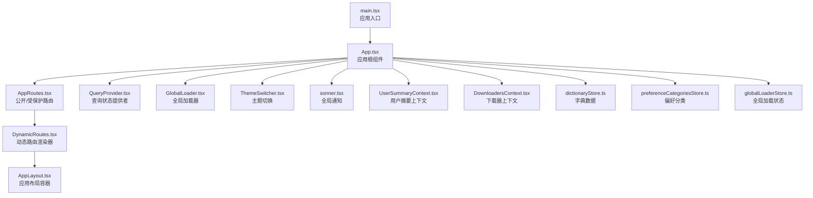
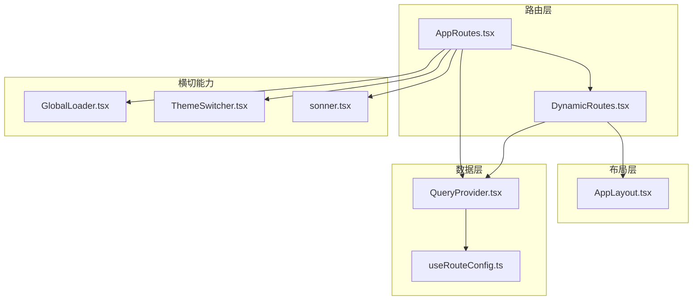
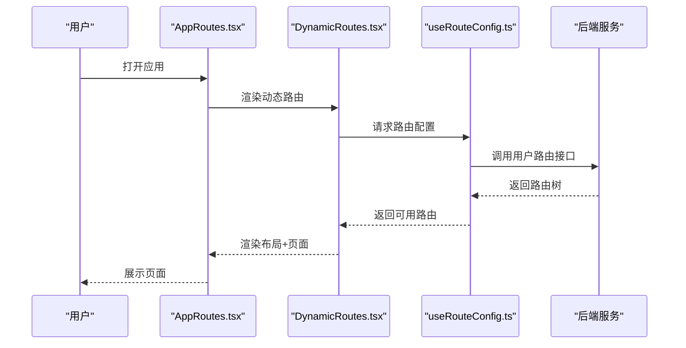
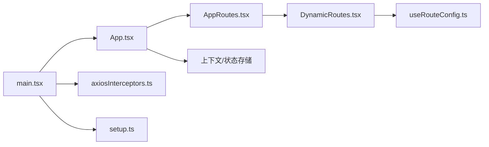

# 前台应用模块

<cite>
**本文引用的文件**
- [README.md](file://README.md)
- [src/main.tsx](file://src/main.tsx)
- [src/App.tsx](file://src/App.tsx)
- [src/routes/AppRoutes.tsx](file://src/routes/AppRoutes.tsx)
- [src/routes/DynamicRoutes.tsx](file://src/routes/DynamicRoutes.tsx)
- [src/hooks/useRouteConfig.ts](file://src/hooks/useRouteConfig.ts)
- [src/api/axiosInterceptors.ts](file://src/api/axiosInterceptors.ts)
- [src/api/setup.ts](file://src/api/setup.ts)
- [src/providers/QueryProvider.tsx](file://src/providers/QueryProvider.tsx)
- [src/modules/app/layouts/AppLayout.tsx](file://src/modules/app/layouts/AppLayout.tsx)
- [src/modules/app/components/ui/GlobalLoader.tsx](file://src/modules/app/components/ui/GlobalLoader.tsx)
- [src/modules/app/components/ui/RouteProgressBar.tsx](file://src/modules/app/components/ui/RouteProgressBar.tsx)
- [src/modules/app/components/ui/FullScreenLoader.tsx](file://src/modules/app/components/ui/FullScreenLoader.tsx)
- [src/modules/app/components/ui/sonner.tsx](file://src/modules/app/components/ui/sonner.tsx)
- [src/modules/app/context/UserSummaryContext.tsx](file://src/modules/app/context/UserSummaryContext.tsx)
- [src/modules/app/context/DownloadersContext.tsx](file://src/modules/app/context/DownloadersContext.tsx)
- [src/stores/dictionaryStore.ts](file://src/stores/dictionaryStore.ts)
- [src/stores/preferenceCategoriesStore.ts](file://src/stores/preferenceCategoriesStore.ts)
- [src/stores/globalLoaderStore.ts](file://src/stores/globalLoaderStore.ts)
- [src/utils/tabTitle.ts](file://src/utils/tabTitle.ts)
- [src/utils/title.ts](file://src/utils/title.ts)
- [src/utils/userPreferences.ts](file://src/utils/userPreferences.ts)
- [src/utils/format.ts](file://src/utils/format.ts)
- [src/utils/validation.ts](file://src/utils/validation.ts)
- [src/utils/cn.ts](file://src/utils/cn.ts)
- [src/context/SiteConfigContext.tsx](file://src/context/SiteConfigContext.tsx)
- [src/context/AccessContext.tsx](file://src/context/AccessContext.tsx)
- [src/components/ThemeSwitcher.tsx](file://src/components/ThemeSwitcher.tsx)
- [src/components/TitleInjector.tsx](file://src/components/TitleInjector.tsx)
</cite>

## 目录
1. [简介](#简介)
2. [项目结构](#项目结构)
3. [核心组件](#核心组件)
4. [架构总览](#架构总览)
5. [详细组件分析](#详细组件分析)
6. [依赖关系分析](#依赖关系分析)
7. [性能考量](#性能考量)
8. [故障排查指南](#故障排查指南)
9. [结论](#结论)
10. [附录](#附录)

## 简介
本文件面向前台应用模块，系统化梳理用户交互的主要界面与功能实现，覆盖首页导航、内容详情页面、用户个人中心、种子管理和下载功能。文档从系统架构、组件关系、数据流与处理逻辑、集成点与错误处理、性能特征等维度进行深入解析，并结合 Hook 模式与状态管理最佳实践，提供可复用的组件设计策略与扩展指引。

## 项目结构
前台应用采用“路由驱动 + 动态布局 + 上下文与状态管理”的组织方式：
- 应用入口负责初始化与全局 Provider 装配
- 路由层通过后端动态配置生成页面级路由
- 布局层提供统一的 App/Forum/Admin 布局容器
- 业务页面通过懒加载与 Suspense 提升首屏性能
- 全局加载器、主题切换、通知等横切能力集中管理

图表来源
- [src/main.tsx](file://src/main.tsx#L1-L18)
- [src/App.tsx](file://src/App.tsx#L1-L52)
- [src/routes/AppRoutes.tsx](file://src/routes/AppRoutes.tsx#L1-L115)
- [src/routes/DynamicRoutes.tsx](file://src/routes/DynamicRoutes.tsx#L1-L308)
- [src/modules/app/layouts/AppLayout.tsx](file://src/modules/app/layouts/AppLayout.tsx)
- [src/providers/QueryProvider.tsx](file://src/providers/QueryProvider.tsx)
- [src/modules/app/components/ui/GlobalLoader.tsx](file://src/modules/app/components/ui/GlobalLoader.tsx)
- [src/modules/app/components/ui/sonner.tsx](file://src/modules/app/components/ui/sonner.tsx)
- [src/modules/app/context/UserSummaryContext.tsx](file://src/modules/app/context/UserSummaryContext.tsx)
- [src/modules/app/context/DownloadersContext.tsx](file://src/modules/app/context/DownloadersContext.tsx)
- [src/stores/dictionaryStore.ts](file://src/stores/dictionaryStore.ts)
- [src/stores/preferenceCategoriesStore.ts](file://src/stores/preferenceCategoriesStore.ts)
- [src/stores/globalLoaderStore.ts](file://src/stores/globalLoaderStore.ts)

章节来源
- [README.md](file://README.md#L1-L11)
- [src/main.tsx](file://src/main.tsx#L1-L18)
- [src/App.tsx](file://src/App.tsx#L1-L52)

## 核心组件
- 应用入口与初始化
  - 初始化拦截器与 OpenAPI 配置，装配查询提供者与根组件
  - 参考路径：[src/main.tsx](file://src/main.tsx#L1-L18)
- 应用根组件
  - 装配全局加载器、主题切换、通知、错误边界、上下文提供者与路由
  - 初始化字典与偏好分类数据
  - 参考路径：[src/App.tsx](file://src/App.tsx#L1-L52)
- 路由系统
  - 公开路由（登录/注册/忘记密码）
  - 动态路由（基于后端配置生成）
  - 404 回退与登录态处理
  - 参考路径：[src/routes/AppRoutes.tsx](file://src/routes/AppRoutes.tsx#L1-L115)
- 动态路由渲染器
  - 支持布局包装、重定向、新标签页打开、索引路由、子路由渲染
  - 参考路径：[src/routes/DynamicRoutes.tsx](file://src/routes/DynamicRoutes.tsx#L1-L308)
- 路由配置 Hook
  - 从后端拉取用户可访问路由树，支持认证状态变更触发刷新
  - 参考路径：[src/hooks/useRouteConfig.ts](file://src/hooks/useRouteConfig.ts#L1-L109)

章节来源
- [src/main.tsx](file://src/main.tsx#L1-L18)
- [src/App.tsx](file://src/App.tsx#L1-L52)
- [src/routes/AppRoutes.tsx](file://src/routes/AppRoutes.tsx#L1-L115)
- [src/routes/DynamicRoutes.tsx](file://src/routes/DynamicRoutes.tsx#L1-L308)
- [src/hooks/useRouteConfig.ts](file://src/hooks/useRouteConfig.ts#L1-L109)

## 架构总览
前台应用采用“声明式路由 + 动态布局 + 上下文 + 查询状态”的架构模式：
- 路由层：AppRoutes 负责公开路由与动态路由挂载；DynamicRoutes 根据后端配置渲染
- 布局层：AppLayout 提供统一头部/侧边栏/内容区结构
- 数据层：QueryProvider + react-query 管理远端数据；全局加载器与进度条提升体验
- 业务层：页面按需懒加载，配合 Suspense 与骨架屏
- 横切能力：主题切换、全局通知、标题注入、权限控制等

图表来源
- [src/routes/AppRoutes.tsx](file://src/routes/AppRoutes.tsx#L1-L115)
- [src/routes/DynamicRoutes.tsx](file://src/routes/DynamicRoutes.tsx#L1-L308)
- [src/modules/app/layouts/AppLayout.tsx](file://src/modules/app/layouts/AppLayout.tsx)
- [src/providers/QueryProvider.tsx](file://src/providers/QueryProvider.tsx)
- [src/hooks/useRouteConfig.ts](file://src/hooks/useRouteConfig.ts#L1-L109)
- [src/modules/app/components/ui/GlobalLoader.tsx](file://src/modules/app/components/ui/GlobalLoader.tsx)
- [src/components/ThemeSwitcher.tsx](file://src/components/ThemeSwitcher.tsx)
- [src/modules/app/components/ui/sonner.tsx](file://src/modules/app/components/ui/sonner.tsx)

## 详细组件分析

### 路由与导航体系
- 公开路由包装器
  - 登录页包装器根据登录态与来源参数决定跳转
  - 注册/忘记密码页包装器负责返回与成功回调
  - 参考路径：[src/routes/AppRoutes.tsx](file://src/routes/AppRoutes.tsx#L19-L56)
- 动态路由渲染
  - 支持 layout 包装、重定向、新标签页打开、索引路由与子路由
  - 参考路径：[src/routes/DynamicRoutes.tsx](file://src/routes/DynamicRoutes.tsx#L56-L125)
- 路由配置 Hook
  - 从后端获取用户可访问路由树，监听认证事件与 storage 事件以响应登录态变化
  - 参考路径：[src/hooks/useRouteConfig.ts](file://src/hooks/useRouteConfig.ts#L38-L100)

图表来源
- [src/routes/AppRoutes.tsx](file://src/routes/AppRoutes.tsx#L73-L98)
- [src/routes/DynamicRoutes.tsx](file://src/routes/DynamicRoutes.tsx#L255-L264)
- [src/hooks/useRouteConfig.ts](file://src/hooks/useRouteConfig.ts#L63-L100)

章节来源
- [src/routes/AppRoutes.tsx](file://src/routes/AppRoutes.tsx#L1-L115)
- [src/routes/DynamicRoutes.tsx](file://src/routes/DynamicRoutes.tsx#L1-L308)
- [src/hooks/useRouteConfig.ts](file://src/hooks/useRouteConfig.ts#L1-L109)

### 布局与页面容器
- AppLayout
  - 提供统一的头部/侧边栏/内容区结构，承载页面内容
  - 参考路径：[src/modules/app/layouts/AppLayout.tsx](file://src/modules/app/layouts/AppLayout.tsx)
- 动态路由中的布局选择
  - 根据配置选择 app/admin/forum/none 布局包装
  - 参考路径：[src/routes/DynamicRoutes.tsx](file://src/routes/DynamicRoutes.tsx#L39-L51)

章节来源
- [src/modules/app/layouts/AppLayout.tsx](file://src/modules/app/layouts/AppLayout.tsx)
- [src/routes/DynamicRoutes.tsx](file://src/routes/DynamicRoutes.tsx#L39-L51)

### 用户交互页面与功能域

#### 首页导航
- 设计要点
  - 通过动态路由生成导航菜单项，支持权限过滤与可见性控制
  - 布局容器内渲染导航与内容区域
- 实现参考
  - 动态路由渲染与布局包装：[src/routes/DynamicRoutes.tsx](file://src/routes/DynamicRoutes.tsx#L130-L249)
  - 应用布局容器：[src/modules/app/layouts/AppLayout.tsx](file://src/modules/app/layouts/AppLayout.tsx)

章节来源
- [src/routes/DynamicRoutes.tsx](file://src/routes/DynamicRoutes.tsx#L130-L249)
- [src/modules/app/layouts/AppLayout.tsx](file://src/modules/app/layouts/AppLayout.tsx)

#### 内容详情页面
- 设计要点
  - 详情页通常作为子路由嵌套在布局内，支持懒加载与骨架屏
  - 通过动态路由配置映射到具体页面组件
- 实现参考
  - 子路由渲染与懒加载：[src/routes/DynamicRoutes.tsx](file://src/routes/DynamicRoutes.tsx#L82-L86)
  - 路由配置到组件映射：[src/routes/DynamicRoutes.tsx](file://src/routes/DynamicRoutes.tsx#L77-L81)

章节来源
- [src/routes/DynamicRoutes.tsx](file://src/routes/DynamicRoutes.tsx#L77-L86)

#### 用户个人中心
- 设计要点
  - 个人中心页面通过动态路由配置加载，布局包装统一
  - 用户摘要信息通过上下文提供，便于跨页面共享
- 实现参考
  - 个人中心上下文提供者：[src/App.tsx](file://src/App.tsx#L6)
  - 动态路由渲染：[src/routes/DynamicRoutes.tsx](file://src/routes/DynamicRoutes.tsx#L230-L246)

章节来源
- [src/App.tsx](file://src/App.tsx#L6)
- [src/routes/DynamicRoutes.tsx](file://src/routes/DynamicRoutes.tsx#L230-L246)

#### 种子管理与下载功能
- 设计要点
  - 下载器上下文提供下载器状态与操作能力
  - 下载相关页面通过动态路由配置加载
- 实现参考
  - 下载器上下文提供者：[src/App.tsx](file://src/App.tsx#L7)
  - 动态路由渲染：[src/routes/DynamicRoutes.tsx](file://src/routes/DynamicRoutes.tsx#L230-L246)

章节来源
- [src/App.tsx](file://src/App.tsx#L7)
- [src/routes/DynamicRoutes.tsx](file://src/routes/DynamicRoutes.tsx#L230-L246)

### 组件复用策略与 Hook 模式
- 组件复用
  - 动态路由渲染器统一处理布局包装、重定向、新标签页打开、索引路由与子路由
  - 参考路径：[src/routes/DynamicRoutes.tsx](file://src/routes/DynamicRoutes.tsx#L56-L125)
- Hook 模式
  - useRouteConfig：封装后端路由配置获取、认证状态监听与刷新
  - 参考路径：[src/hooks/useRouteConfig.ts](file://src/hooks/useRouteConfig.ts#L38-L100)
- 状态管理
  - 字典与偏好分类：初始化阶段加载，保证页面渲染前可用
  - 全局加载状态：通过 store 控制加载指示器显示
  - 参考路径：[src/App.tsx](file://src/App.tsx#L25-L31)，[src/stores/globalLoaderStore.ts](file://src/stores/globalLoaderStore.ts)

章节来源
- [src/routes/DynamicRoutes.tsx](file://src/routes/DynamicRoutes.tsx#L56-L125)
- [src/hooks/useRouteConfig.ts](file://src/hooks/useRouteConfig.ts#L38-L100)
- [src/App.tsx](file://src/App.tsx#L25-L31)
- [src/stores/globalLoaderStore.ts](file://src/stores/globalLoaderStore.ts)

### UI 组件库与横切能力
- UI 组件库
  - 使用默认组件库（未引入第三方 UI 库），通过 Tailwind/CSS 实现样式
  - 参考路径：[src/main.tsx](file://src/main.tsx#L3)
- 横切能力
  - 主题切换：[src/components/ThemeSwitcher.tsx](file://src/components/ThemeSwitcher.tsx)
  - 全局通知：[src/modules/app/components/ui/sonner.tsx](file://src/modules/app/components/ui/sonner.tsx)
  - 全局加载器：[src/modules/app/components/ui/GlobalLoader.tsx](file://src/modules/app/components/ui/GlobalLoader.tsx)
  - 路由进度条：[src/modules/app/components/ui/RouteProgressBar.tsx](file://src/modules/app/components/ui/RouteProgressBar.tsx)
  - 全屏加载器：[src/modules/app/components/ui/FullScreenLoader.tsx](file://src/modules/app/components/ui/FullScreenLoader.tsx)
  - 标题注入：[src/components/TitleInjector.tsx](file://src/components/TitleInjector.tsx)
  - 标签页标题与页面标题工具：[src/utils/tabTitle.ts](file://src/utils/tabTitle.ts)，[src/utils/title.ts](file://src/utils/title.ts)

章节来源
- [src/main.tsx](file://src/main.tsx#L3)
- [src/components/ThemeSwitcher.tsx](file://src/components/ThemeSwitcher.tsx)
- [src/modules/app/components/ui/sonner.tsx](file://src/modules/app/components/ui/sonner.tsx)
- [src/modules/app/components/ui/GlobalLoader.tsx](file://src/modules/app/components/ui/GlobalLoader.tsx)
- [src/modules/app/components/ui/RouteProgressBar.tsx](file://src/modules/app/components/ui/RouteProgressBar.tsx)
- [src/modules/app/components/ui/FullScreenLoader.tsx](file://src/modules/app/components/ui/FullScreenLoader.tsx)
- [src/components/TitleInjector.tsx](file://src/components/TitleInjector.tsx)
- [src/utils/tabTitle.ts](file://src/utils/tabTitle.ts)
- [src/utils/title.ts](file://src/utils/title.ts)

## 依赖关系分析
- 组件耦合与内聚
  - AppRoutes 与 DynamicRoutes 高内聚，共同完成路由装配与渲染
  - useRouteConfig 与后端服务解耦，通过查询状态管理数据
- 直接与间接依赖
  - AppRoutes 依赖 DynamicRoutes 与 QueryProvider
  - DynamicRoutes 依赖路由配置 Hook 与布局组件
  - 上下文与状态存储贯穿全局，降低页面间耦合
- 外部依赖与集成点
  - Axios 拦截器与 OpenAPI 初始化：[src/api/axiosInterceptors.ts](file://src/api/axiosInterceptors.ts)，[src/api/setup.ts](file://src/api/setup.ts)
  - 权限与站点配置上下文：[src/context/AccessContext.tsx](file://src/context/AccessContext.tsx)，[src/context/SiteConfigContext.tsx](file://src/context/SiteConfigContext.tsx)

图表来源
- [src/main.tsx](file://src/main.tsx#L1-L18)
- [src/App.tsx](file://src/App.tsx#L1-L52)
- [src/routes/AppRoutes.tsx](file://src/routes/AppRoutes.tsx#L1-L115)
- [src/routes/DynamicRoutes.tsx](file://src/routes/DynamicRoutes.tsx#L1-L308)
- [src/hooks/useRouteConfig.ts](file://src/hooks/useRouteConfig.ts#L1-L109)
- [src/api/axiosInterceptors.ts](file://src/api/axiosInterceptors.ts)
- [src/api/setup.ts](file://src/api/setup.ts)

章节来源
- [src/main.tsx](file://src/main.tsx#L1-L18)
- [src/App.tsx](file://src/App.tsx#L1-L52)
- [src/routes/AppRoutes.tsx](file://src/routes/AppRoutes.tsx#L1-L115)
- [src/routes/DynamicRoutes.tsx](file://src/routes/DynamicRoutes.tsx#L1-L308)
- [src/hooks/useRouteConfig.ts](file://src/hooks/useRouteConfig.ts#L1-L109)
- [src/api/axiosInterceptors.ts](file://src/api/axiosInterceptors.ts)
- [src/api/setup.ts](file://src/api/setup.ts)

## 性能考量
- 懒加载与骨架屏
  - 页面组件懒加载与 Suspense 配合全屏加载器，减少首屏阻塞
  - 参考路径：[src/routes/AppRoutes.tsx](file://src/routes/AppRoutes.tsx#L82)，[src/modules/app/components/ui/FullScreenLoader.tsx](file://src/modules/app/components/ui/FullScreenLoader.tsx)
- 路由配置缓存
  - useRouteConfig 设置 5 分钟缓存，避免频繁请求
  - 参考路径：[src/hooks/useRouteConfig.ts](file://src/hooks/useRouteConfig.ts#L96)
- 全局加载指示
  - 全局加载器与路由进度条提升感知性能
  - 参考路径：[src/modules/app/components/ui/GlobalLoader.tsx](file://src/modules/app/components/ui/GlobalLoader.tsx)，[src/modules/app/components/ui/RouteProgressBar.tsx](file://src/modules/app/components/ui/RouteProgressBar.tsx)
- 初始化数据预取
  - 应用启动时预取字典与偏好分类，保障页面渲染一致性
  - 参考路径：[src/App.tsx](file://src/App.tsx#L25-L31)

章节来源
- [src/routes/AppRoutes.tsx](file://src/routes/AppRoutes.tsx#L82)
- [src/modules/app/components/ui/FullScreenLoader.tsx](file://src/modules/app/components/ui/FullScreenLoader.tsx)
- [src/hooks/useRouteConfig.ts](file://src/hooks/useRouteConfig.ts#L96)
- [src/modules/app/components/ui/GlobalLoader.tsx](file://src/modules/app/components/ui/GlobalLoader.tsx)
- [src/modules/app/components/ui/RouteProgressBar.tsx](file://src/modules/app/components/ui/RouteProgressBar.tsx)
- [src/App.tsx](file://src/App.tsx#L25-L31)

## 故障排查指南
- 路由配置异常
  - 现象：动态路由不生效或空白
  - 排查：确认后端返回数据结构与 enabled/isVisible 字段；检查 useRouteConfig 的日志输出
  - 参考路径：[src/hooks/useRouteConfig.ts](file://src/hooks/useRouteConfig.ts#L63-L100)
- 登录态不一致
  - 现象：登录后路由未更新
  - 排查：确认认证事件是否触发；检查 useRouteConfig 对 authChange/storage 事件的监听
  - 参考路径：[src/hooks/useRouteConfig.ts](file://src/hooks/useRouteConfig.ts#L46-L61)
- 加载指示问题
  - 现象：全局加载器不消失
  - 排查：确认 RouteConfigLoader 与 GlobalLoader 的生命周期；检查 useGlobalLoader 的 start/finish 调用
  - 参考路径：[src/routes/AppRoutes.tsx](file://src/routes/AppRoutes.tsx#L61-L68)，[src/stores/globalLoaderStore.ts](file://src/stores/globalLoaderStore.ts)
- 页面 404 与重定向
  - 现象：未登录访问受保护页面跳转登录，已登录显示 404
  - 排查：检查 AppRoutes 中的 404 回退逻辑与登录态判断
  - 参考路径：[src/routes/AppRoutes.tsx](file://src/routes/AppRoutes.tsx#L103-L114)

章节来源
- [src/hooks/useRouteConfig.ts](file://src/hooks/useRouteConfig.ts#L46-L100)
- [src/routes/AppRoutes.tsx](file://src/routes/AppRoutes.tsx#L61-L68)
- [src/stores/globalLoaderStore.ts](file://src/stores/globalLoaderStore.ts)
- [src/routes/AppRoutes.tsx](file://src/routes/AppRoutes.tsx#L103-L114)

## 结论
前台应用模块通过“动态路由 + 统一布局 + 上下文与状态管理”实现了高内聚、低耦合的页面组织方式。借助 Hook 模式与查询状态管理，路由配置与数据获取具备良好的响应性与可维护性。结合懒加载、骨架屏与全局加载指示，整体用户体验流畅。建议在扩展新页面时遵循现有模式：通过动态路由配置接入、使用布局容器、利用上下文与状态存储共享数据，并保持 Hook 的职责单一与可测试性。

## 附录
- 工具函数与通用能力
  - 样式类名合并：[src/utils/cn.ts](file://src/utils/cn.ts)
  - 用户偏好与格式化：[src/utils/userPreferences.ts](file://src/utils/userPreferences.ts)，[src/utils/format.ts](file://src/utils/format.ts)
  - 校验与错误提示：[src/utils/validation.ts](file://src/utils/validation.ts)，[src/utils/errorMessage.ts](file://src/utils/errorMessage.ts)
- 权限与站点配置
  - 权限控制上下文：[src/context/AccessContext.tsx](file://src/context/AccessContext.tsx)
  - 站点配置上下文：[src/context/SiteConfigContext.tsx](file://src/context/SiteConfigContext.tsx)

章节来源
- [src/utils/cn.ts](file://src/utils/cn.ts)
- [src/utils/userPreferences.ts](file://src/utils/userPreferences.ts)
- [src/utils/format.ts](file://src/utils/format.ts)
- [src/utils/validation.ts](file://src/utils/validation.ts)
- [src/context/AccessContext.tsx](file://src/context/AccessContext.tsx)
- [src/context/SiteConfigContext.tsx](file://src/context/SiteConfigContext.tsx)