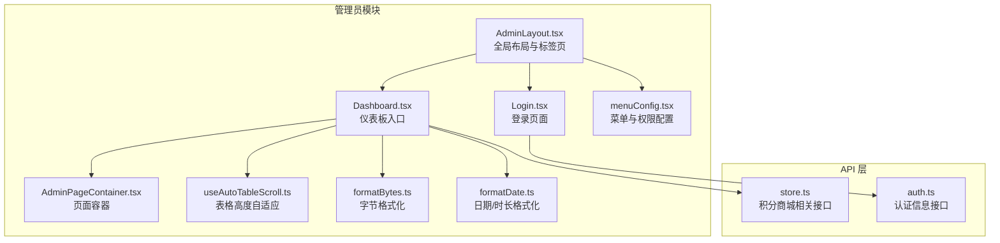
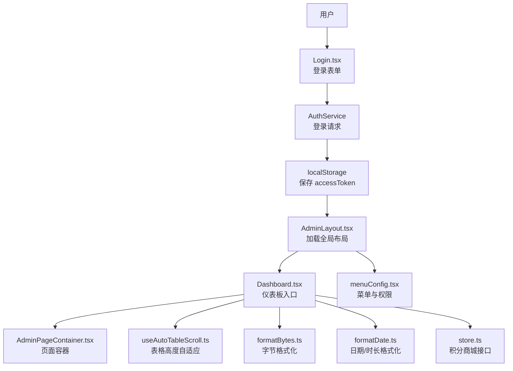
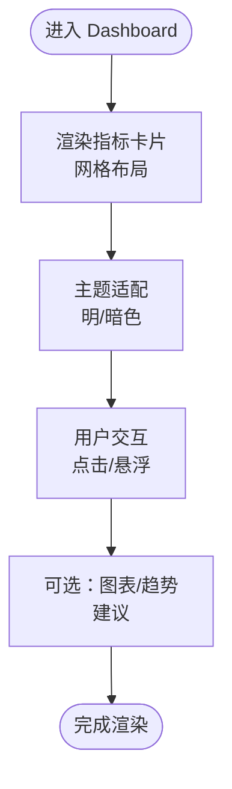
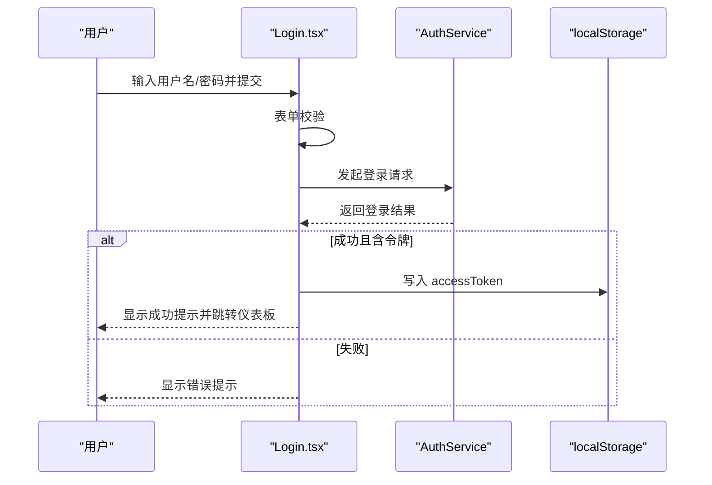
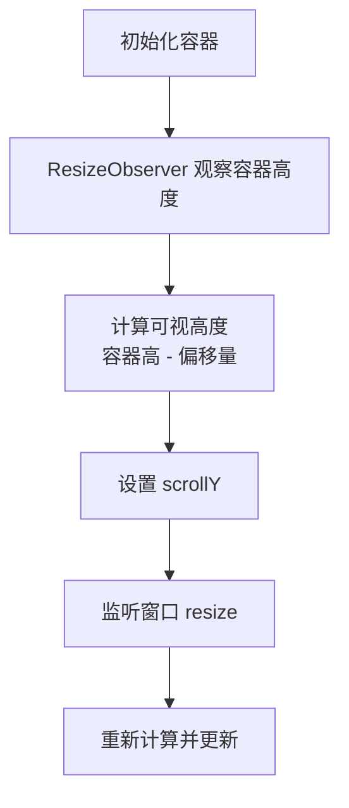
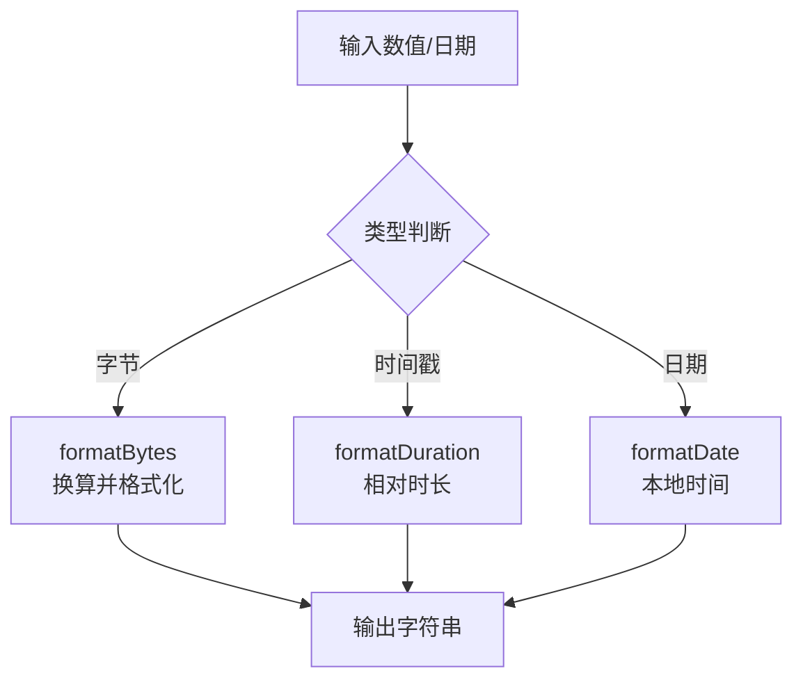
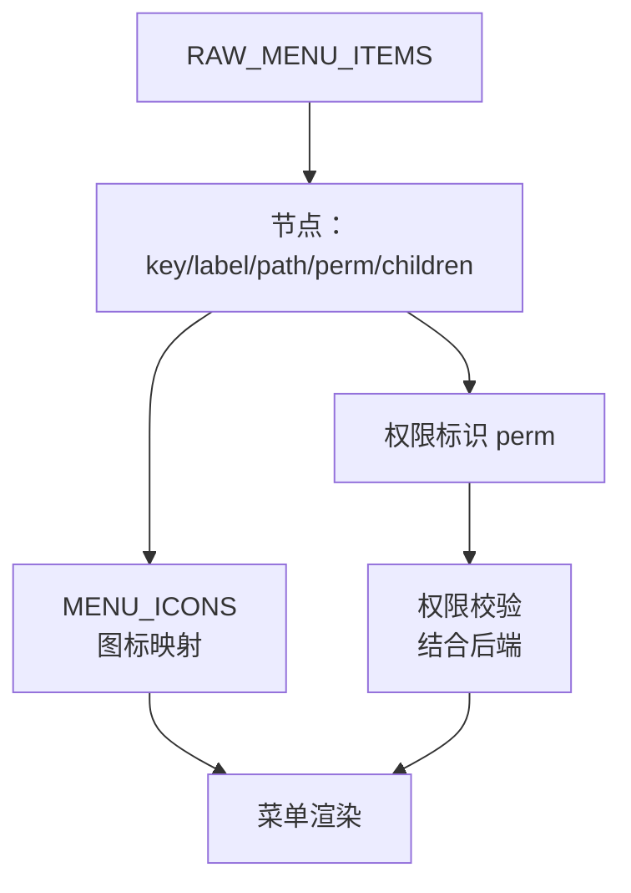
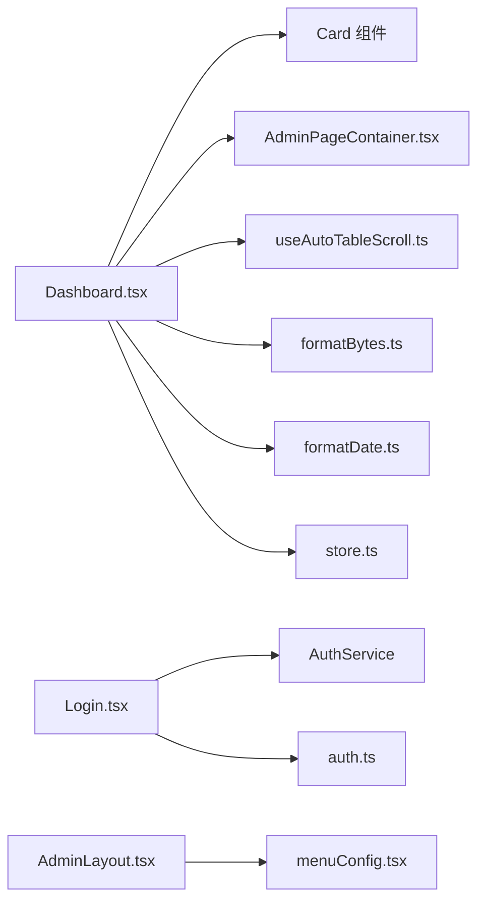

# 仪表板管理

<cite>
**本文引用的文件**
- [Dashboard.tsx](file://src/modules/admin/pages/Dashboard.tsx)
- [AdminLayout.tsx](file://src/modules/admin/layouts/AdminLayout.tsx)
- [menuConfig.tsx](file://src/modules/admin/layouts/constants/menuConfig.tsx)
- [Login.tsx](file://src/modules/admin/pages/Login.tsx)
- [AdminPageContainer.tsx](file://src/modules/admin/components/AdminPageContainer.tsx)
- [useAutoTableScroll.ts](file://src/modules/admin/hooks/useAutoTableScroll.ts)
- [formatBytes.ts](file://src/modules/admin/utils/formatBytes.ts)
- [formatDate.ts](file://src/modules/admin/utils/formatDate.ts)
- [store.ts](file://src/api/custom/store.ts)
- [auth.ts](file://src/api/custom/auth.ts)
</cite>

## 目录
1. [简介](#简介)
2. [项目结构](#项目结构)
3. [核心组件](#核心组件)
4. [架构总览](#架构总览)
5. [详细组件分析](#详细组件分析)
6. [依赖关系分析](#依赖关系分析)
7. [性能考虑](#性能考虑)
8. [故障排查指南](#故障排查指南)
9. [结论](#结论)
10. [附录](#附录)

## 简介
本文件面向管理员仪表板管理功能，系统性阐述设计理念、数据展示方式、核心指标面板、布局结构、数据可视化方案、实时更新机制与性能优化策略，并覆盖登录认证流程、错误页面处理、用户体验优化、仪表板定制选项、数据权限控制以及监控告警集成建议。本文所有技术细节均基于仓库现有实现进行归纳与提炼，确保读者能够快速理解并落地实施。

## 项目结构
管理员模块采用“布局-页面-组件-工具”的分层组织方式，仪表板作为入口页面位于 admin 模块的 pages 目录中，配合全局布局 AdminLayout 提供统一的导航、标签页与侧边栏体验。菜单配置通过 menuConfig.tsx 统一维护，支持多级权限与图标映射。登录页面 Login.tsx 提供表单校验与认证交互，认证结果通过本地存储令牌驱动后续页面访问。

**图表来源**
- [AdminLayout.tsx](file://src/modules/admin/layouts/AdminLayout.tsx#L20-L94)
- [Dashboard.tsx](file://src/modules/admin/pages/Dashboard.tsx#L4-L56)
- [Login.tsx](file://src/modules/admin/pages/Login.tsx#L22-L133)
- [menuConfig.tsx](file://src/modules/admin/layouts/constants/menuConfig.tsx#L72-L418)
- [AdminPageContainer.tsx](file://src/modules/admin/components/AdminPageContainer.tsx#L19-L39)
- [useAutoTableScroll.ts](file://src/modules/admin/hooks/useAutoTableScroll.ts#L10-L45)
- [formatBytes.ts](file://src/modules/admin/utils/formatBytes.ts#L7-L17)
- [formatDate.ts](file://src/modules/admin/utils/formatDate.ts#L6-L69)
- [store.ts](file://src/api/custom/store.ts#L59-L88)
- [auth.ts](file://src/api/custom/auth.ts#L3-L13)

**章节来源**
- [AdminLayout.tsx](file://src/modules/admin/layouts/AdminLayout.tsx#L20-L94)
- [Dashboard.tsx](file://src/modules/admin/pages/Dashboard.tsx#L4-L56)
- [Login.tsx](file://src/modules/admin/pages/Login.tsx#L22-L133)
- [menuConfig.tsx](file://src/modules/admin/layouts/constants/menuConfig.tsx#L72-L418)

## 核心组件
- 仪表板入口：Dashboard.tsx 提供三列卡片布局，展示在线用户、今日访问、待处理任务等基础指标，具备响应式网格与暗色主题适配。
- 页面容器：AdminPageContainer.tsx 提供统一背景色与内边距，支持紧凑模式，便于在仪表板中嵌套复杂内容。
- 表格高度自适应：useAutoTableScroll.ts 基于 ResizeObserver 与窗口尺寸监听，动态计算表格可视高度，减少滚动条闪烁与布局抖动。
- 数据格式化：formatBytes.ts 与 formatDate.ts 提供字节单位转换与时长/本地时间格式化，支撑数据面板与日志类展示。
- 登录与认证：Login.tsx 使用表单校验与认证服务，将令牌写入本地存储并跳转至仪表板；认证信息通过 auth.ts 获取。

**章节来源**
- [Dashboard.tsx](file://src/modules/admin/pages/Dashboard.tsx#L4-L56)
- [AdminPageContainer.tsx](file://src/modules/admin/components/AdminPageContainer.tsx#L19-L39)
- [useAutoTableScroll.ts](file://src/modules/admin/hooks/useAutoTableScroll.ts#L10-L45)
- [formatBytes.ts](file://src/modules/admin/utils/formatBytes.ts#L7-L17)
- [formatDate.ts](file://src/modules/admin/utils/formatDate.ts#L6-L69)
- [Login.tsx](file://src/modules/admin/pages/Login.tsx#L22-L133)
- [auth.ts](file://src/api/custom/auth.ts#L3-L13)

## 架构总览
管理员仪表板采用“布局-页面-组件-工具-API”分层架构。AdminLayout 负责全局导航、标签页与侧边栏；Dashboard 作为入口页面承载指标卡片与数据面板；AdminPageContainer 提供一致的页面容器；useAutoTableScroll 与格式化工具提升表格与数据展示体验；登录流程通过 Login.tsx 与认证服务完成令牌获取与持久化。

**图表来源**
- [Login.tsx](file://src/modules/admin/pages/Login.tsx#L43-L68)
- [AdminLayout.tsx](file://src/modules/admin/layouts/AdminLayout.tsx#L20-L94)
- [Dashboard.tsx](file://src/modules/admin/pages/Dashboard.tsx#L4-L56)
- [AdminPageContainer.tsx](file://src/modules/admin/components/AdminPageContainer.tsx#L19-L39)
- [useAutoTableScroll.ts](file://src/modules/admin/hooks/useAutoTableScroll.ts#L10-L45)
- [formatBytes.ts](file://src/modules/admin/utils/formatBytes.ts#L7-L17)
- [formatDate.ts](file://src/modules/admin/utils/formatDate.ts#L6-L69)
- [store.ts](file://src/api/custom/store.ts#L59-L88)
- [menuConfig.tsx](file://src/modules/admin/layouts/constants/menuConfig.tsx#L72-L418)

## 详细组件分析

### 仪表板入口组件（Dashboard）
- 设计理念：采用卡片式指标面板，强调信息密度与可读性；网格布局随屏幕宽度自适应，满足不同设备体验。
- 数据展示：内置三个核心指标卡片，分别对应在线用户、今日访问、待处理任务，数字与单位清晰分隔，便于快速扫描。
- 布局结构：使用卡片组件与内容区组合，外层网格容器提供响应式列数控制；支持暗色主题下的颜色适配。
- 可视化方案：当前为纯文本数值展示，建议在后续版本引入小型趋势图或进度环，以增强数据动态感。
- 实时更新机制：当前未见轮询或 WebSocket 实现；建议结合业务场景引入定时刷新或事件订阅，保障数据时效性。
- 性能优化：卡片渲染轻量，建议在数据量增大时按需懒加载与分页展示。

**图表来源**
- [Dashboard.tsx](file://src/modules/admin/pages/Dashboard.tsx#L4-L56)

**章节来源**
- [Dashboard.tsx](file://src/modules/admin/pages/Dashboard.tsx#L4-L56)

### 登录认证流程
- 表单校验：使用 Zod 与 react-hook-form 对用户名、密码与自动登出选项进行前端校验。
- 认证请求：调用认证服务提交凭据，接收访问令牌；若无令牌则提示失败。
- 令牌持久化：将访问令牌写入本地存储，作为后续页面访问的凭证。
- 错误处理：针对 401 与其它异常分别提示相应错误信息；成功后跳转至仪表板。
- 用户体验：提供加载态与错误提示，增强反馈及时性。

**图表来源**
- [Login.tsx](file://src/modules/admin/pages/Login.tsx#L43-L68)

**章节来源**
- [Login.tsx](file://src/modules/admin/pages/Login.tsx#L22-L133)
- [auth.ts](file://src/api/custom/auth.ts#L3-L13)

### 页面容器与表格自适应
- 页面容器：AdminPageContainer 提供统一背景与内边距，支持紧凑模式，便于在仪表板中嵌套复杂内容与表格。
- 表格高度自适应：useAutoTableScroll 基于 ResizeObserver 与窗口 resize 事件动态计算表格可视高度，避免布局抖动与滚动条闪烁。

**图表来源**
- [useAutoTableScroll.ts](file://src/modules/admin/hooks/useAutoTableScroll.ts#L10-L45)
- [AdminPageContainer.tsx](file://src/modules/admin/components/AdminPageContainer.tsx#L19-L39)

**章节来源**
- [AdminPageContainer.tsx](file://src/modules/admin/components/AdminPageContainer.tsx#L19-L39)
- [useAutoTableScroll.ts](file://src/modules/admin/hooks/useAutoTableScroll.ts#L10-L45)

### 数据格式化工具
- 字节格式化：formatBytes 将字节数转换为 B/KB/MB/GB/TB，支持小数位数配置，适用于流量、存储等指标展示。
- 日期/时长格式化：formatDuration 将时间戳转换为“X天前”等人类可读形式；formatDate 输出本地时间字符串；提供空值占位与容错处理。

**图表来源**
- [formatBytes.ts](file://src/modules/admin/utils/formatBytes.ts#L7-L17)
- [formatDate.ts](file://src/modules/admin/utils/formatDate.ts#L6-L69)

**章节来源**
- [formatBytes.ts](file://src/modules/admin/utils/formatBytes.ts#L7-L17)
- [formatDate.ts](file://src/modules/admin/utils/formatDate.ts#L6-L69)

### 菜单与权限控制
- 菜单配置：menuConfig.tsx 定义了完整的菜单树，包含仪表盘、系统设置、种子管理、内容管理、商城管理、魔力管理、用户管理、字典管理、邀请管理、工单管理等模块，并为每个节点绑定权限标识。
- 权限映射：菜单项的 perm 字段用于权限校验，结合后端权限体系实现细粒度访问控制。
- 图标映射：通过 MENU_ICONS 将路径或中文名称映射到 Lucide 图标，保证界面一致性。

**图表来源**
- [menuConfig.tsx](file://src/modules/admin/layouts/constants/menuConfig.tsx#L72-L418)

**章节来源**
- [menuConfig.tsx](file://src/modules/admin/layouts/constants/menuConfig.tsx#L72-L418)

### 数据可视化方案与实时更新建议
- 当前现状：Dashboard 为纯文本指标展示，未集成图表组件。
- 可视化建议：引入小型折线图或柱状图展示趋势，结合 formatBytes 与 formatDate 优化数据呈现；对高频指标采用增量更新与缓存策略。
- 实时更新：建议在仪表板中引入定时轮询或事件订阅机制，结合 keep-alive 标签页避免重复请求；对不敏感指标可延迟加载，降低首屏压力。

[本节为概念性建议，无需代码来源]

### 仪表板定制选项与监控告警集成
- 定制选项：支持指标卡片的增删改、排序与分组；提供主题切换与布局偏好设置；允许用户选择关注的指标集合。
- 监控告警：建议在仪表板中增加告警示意与告警列表，结合后端监控数据源进行聚合展示；对关键指标设置阈值与通知渠道。

[本节为概念性建议，无需代码来源]

## 依赖关系分析
仪表板相关组件之间的依赖关系如下：

**图表来源**
- [Dashboard.tsx](file://src/modules/admin/pages/Dashboard.tsx#L1-L56)
- [AdminPageContainer.tsx](file://src/modules/admin/components/AdminPageContainer.tsx#L19-L39)
- [useAutoTableScroll.ts](file://src/modules/admin/hooks/useAutoTableScroll.ts#L10-L45)
- [formatBytes.ts](file://src/modules/admin/utils/formatBytes.ts#L7-L17)
- [formatDate.ts](file://src/modules/admin/utils/formatDate.ts#L6-L69)
- [store.ts](file://src/api/custom/store.ts#L59-L88)
- [Login.tsx](file://src/modules/admin/pages/Login.tsx#L22-L133)
- [auth.ts](file://src/api/custom/auth.ts#L3-L13)
- [AdminLayout.tsx](file://src/modules/admin/layouts/AdminLayout.tsx#L20-L94)
- [menuConfig.tsx](file://src/modules/admin/layouts/constants/menuConfig.tsx#L72-L418)

**章节来源**
- [Dashboard.tsx](file://src/modules/admin/pages/Dashboard.tsx#L1-L56)
- [Login.tsx](file://src/modules/admin/pages/Login.tsx#L22-L133)
- [AdminLayout.tsx](file://src/modules/admin/layouts/AdminLayout.tsx#L20-L94)
- [menuConfig.tsx](file://src/modules/admin/layouts/constants/menuConfig.tsx#L72-L418)

## 性能考虑
- 渲染优化：仪表板卡片采用轻量渲染，建议在数据量增大时启用虚拟滚动与分页加载。
- 资源加载：对非关键指标采用懒加载策略，减少首屏阻塞；对图片与图标资源进行压缩与按需加载。
- 缓存策略：对静态配置与只读数据进行本地缓存，结合失效策略避免陈旧数据影响体验。
- 动画与过渡：保持布局动画简洁，避免在低端设备上造成卡顿；对频繁更新的数据采用节流或去抖策略。

[本节提供一般性指导，无需代码来源]

## 故障排查指南
- 登录失败：检查用户名/密码是否为空，确认认证服务返回的令牌是否存在；查看错误提示与网络状态。
- 令牌丢失：确认本地存储中是否存在 accessToken；若不存在，重新登录并确保网络稳定。
- 页面空白或布局异常：检查 AdminLayout 的容器与标签页上下文是否正确注入；确认 KeepAlive 相关上下文与路由配置。
- 数据格式异常：核对 formatBytes 与 formatDate 的输入类型与边界值；确保传入的数值或时间戳有效。

**章节来源**
- [Login.tsx](file://src/modules/admin/pages/Login.tsx#L43-L68)
- [AdminLayout.tsx](file://src/modules/admin/layouts/AdminLayout.tsx#L20-L94)
- [formatBytes.ts](file://src/modules/admin/utils/formatBytes.ts#L7-L17)
- [formatDate.ts](file://src/modules/admin/utils/formatDate.ts#L6-L69)

## 结论
管理员仪表板以简洁直观的卡片式布局为核心，结合统一的页面容器与表格自适应能力，提供了良好的初始体验。建议在后续迭代中引入数据可视化、实时更新与定制化能力，并完善权限控制与监控告警集成，以满足更复杂的运营与管理需求。

## 附录
- 术语说明：指标卡片、权限标识、菜单树、表格自适应、格式化工具、认证令牌、布局动画。
- 扩展方向：图表组件集成、事件订阅与轮询、主题与布局偏好、告警聚合与通知。