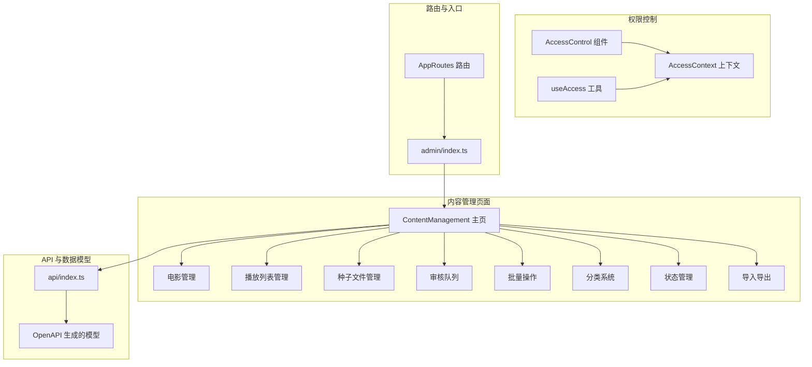
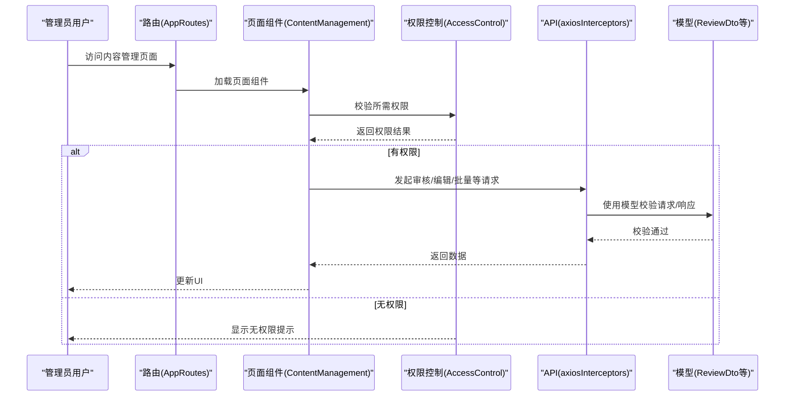
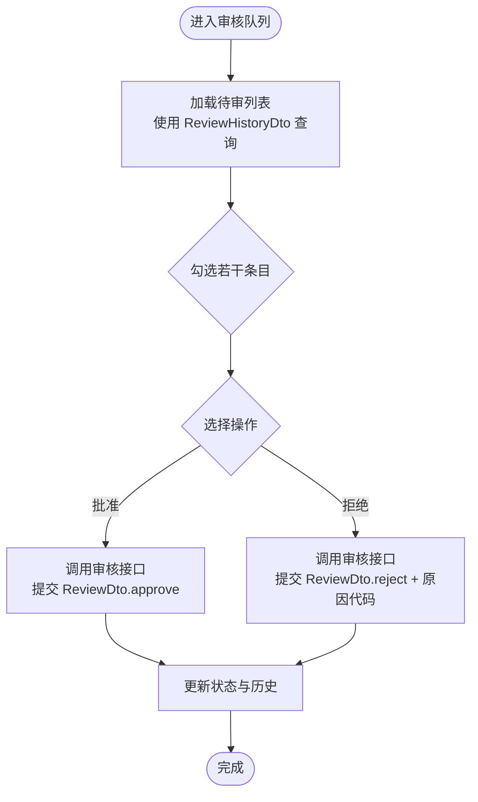
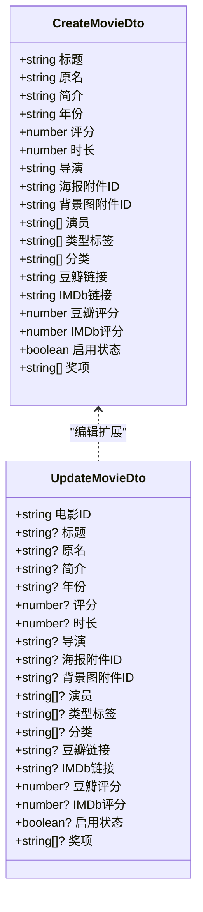
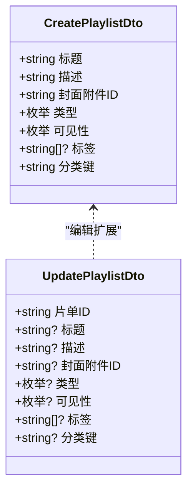
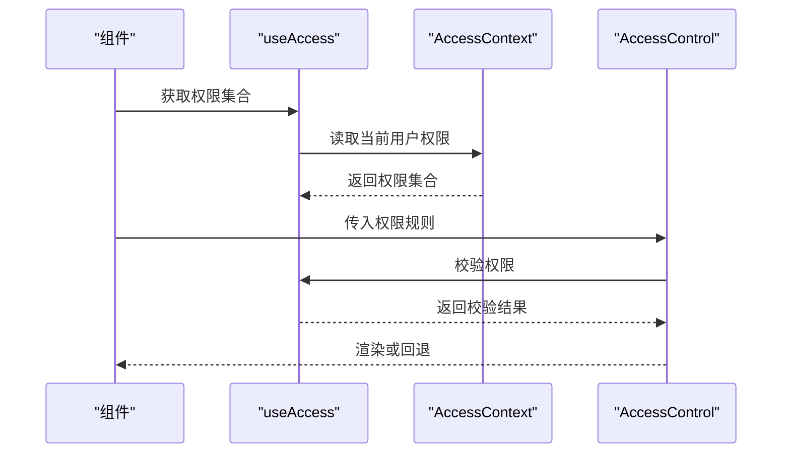
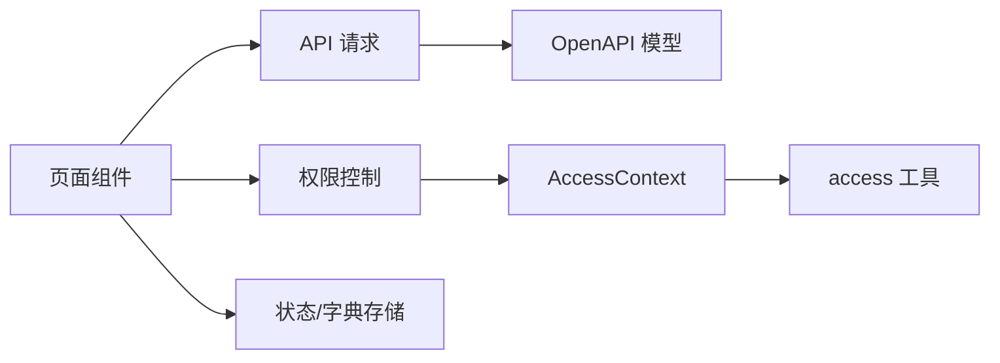

# 内容管理

<cite>
**本文引用的文件**
- [src/permissions/AccessControl.tsx](file://src/permissions/AccessControl.tsx)
- [src/utils/access.ts](file://src/utils/access.ts)
- [src/context/AccessContext.tsx](file://src/context/AccessContext.tsx)
- [src/api/models/ReviewDto.ts](file://src/api/models/ReviewDto.ts)
- [src/api/models/ReviewHistoryDto.ts](file://src/api/models/ReviewHistoryDto.ts)
- [src/api/models/ReviewHistoryItem.ts](file://src/api/models/ReviewHistoryItem.ts)
- [src/api/models/MovieReviewHistoryDto.ts](file://src/api/models/MovieReviewHistoryDto.ts)
- [src/api/models/CreateMovieDto.ts](file://src/api/models/CreateMovieDto.ts)
- [src/api/models/UpdateMovieDto.ts](file://src/api/models/UpdateMovieDto.ts)
- [src/api/models/CreatePlaylistDto.ts](file://src/api/models/CreatePlaylistDto.ts)
- [src/api/models/UpdatePlaylistDto.ts](file://src/api/models/UpdatePlaylistDto.ts)
- [src/api/models/Torrent.ts](file://src/api/models/Torrent.ts)
- [src/api/models/ContentReview.ts](file://src/api/models/ContentReview.ts)
- [src/api/index.ts](file://src/api/index.ts)
- [src/routes/AppRoutes.tsx](file://src/routes/AppRoutes.tsx)
- [src/modules/admin/index.ts](file://src/modules/admin/index.ts)
- [src/modules/admin/pages/ContentManagement/index.tsx](file://src/modules/admin/pages/ContentManagement/index.tsx)
- [src/modules/admin/pages/ContentManagement/MovieManager/index.tsx](file://src/modules/admin/pages/ContentManagement/MovieManager/index.tsx)
- [src/modules/admin/pages/ContentManagement/PlaylistManager/index.tsx](file://src/modules/admin/pages/ContentManagement/PlaylistManager/index.tsx)
- [src/modules/admin/pages/ContentManagement/TorrentManager/index.tsx](file://src/modules/admin/pages/ContentManagement/TorrentManager/index.tsx)
- [src/modules/admin/pages/ContentManagement/ReviewQueue/index.tsx](file://src/modules/admin/pages/ContentManagement/ReviewQueue/index.tsx)
- [src/modules/admin/pages/ContentManagement/BatchOperations/index.tsx](file://src/modules/admin/pages/ContentManagement/BatchOperations/index.tsx)
- [src/modules/admin/pages/ContentManagement/CategorySystem/index.tsx](file://src/modules/admin/pages/ContentManagement/CategorySystem/index.tsx)
- [src/modules/admin/pages/ContentManagement/ContentStatus/index.tsx](file://src/modules/admin/pages/ContentManagement/ContentStatus/index.tsx)
- [src/modules/admin/pages/ContentManagement/ImportExport/index.tsx](file://src/modules/admin/pages/ContentManagement/ImportExport/index.tsx)
- [src/hooks/useApi.ts](file://src/hooks/useApi.ts)
- [src/hooks/useAsyncAction.ts](file://src/hooks/useAsyncAction.ts)
- [src/providers/QueryProvider.tsx](file://src/providers/QueryProvider.tsx)
- [src/stores/dictionaryStore.ts](file://src/stores/dictionaryStore.ts)
- [src/stores/preferenceCategoriesStore.ts](file://src/stores/preferenceCategoriesStore.ts)
- [src/utils/format.ts](file://src/utils/format.ts)
- [src/utils/validation.ts](file://src/utils/validation.ts)
- [src/utils/errorMessage.ts](file://src/utils/errorMessage.ts)
- [README.md](file://README.md)
</cite>

## 目录
1. [简介](#简介)
2. [项目结构](#项目结构)
3. [核心组件](#核心组件)
4. [架构总览](#架构总览)
5. [详细组件分析](#详细组件分析)
6. [依赖关系分析](#依赖关系分析)
7. [性能考虑](#性能考虑)
8. [故障排除指南](#故障排除指南)
9. [结论](#结论)
10. [附录](#附录)

## 简介
本文件面向内容管理功能，系统化梳理后台对电影、播放列表、种子文件的审核、编辑与管理能力，覆盖内容分类体系、审核流程、批量操作与状态管理；解释数据模型、权限控制机制与数据一致性保障；并提供导入导出、批量处理与性能优化策略，以及最佳实践与常见问题解决方案。

## 项目结构
内容管理模块位于 admin 子系统下，采用按页面拆分的组织方式：内容管理主入口、电影管理、播放列表管理、种子文件管理、审核队列、批量操作、分类系统、状态管理、导入导出等页面协同工作。权限控制通过上下文与工具函数在组件层统一接入，API 层通过自动生成的模型定义数据契约。

图表来源
- [src/routes/AppRoutes.tsx](file://src/routes/AppRoutes.tsx#L1-L200)
- [src/modules/admin/index.ts](file://src/modules/admin/index.ts#L1-L200)
- [src/modules/admin/pages/ContentManagement/index.tsx](file://src/modules/admin/pages/ContentManagement/index.tsx#L1-L200)
- [src/permissions/AccessControl.tsx](file://src/permissions/AccessControl.tsx#L1-L43)
- [src/context/AccessContext.tsx](file://src/context/AccessContext.tsx#L1-L200)
- [src/api/index.ts](file://src/api/index.ts#L1-L200)

章节来源
- [src/routes/AppRoutes.tsx](file://src/routes/AppRoutes.tsx#L1-L200)
- [src/modules/admin/index.ts](file://src/modules/admin/index.ts#L1-L200)
- [src/modules/admin/pages/ContentManagement/index.tsx](file://src/modules/admin/pages/ContentManagement/index.tsx#L1-L200)
- [src/permissions/AccessControl.tsx](file://src/permissions/AccessControl.tsx#L1-L43)
- [src/context/AccessContext.tsx](file://src/context/AccessContext.tsx#L1-L200)
- [src/api/index.ts](file://src/api/index.ts#L1-L200)

## 核心组件
- 权限控制组件：基于 AccessControl 组件与 useAccess 工具，结合 AccessContext 提供的权限集合，实现细粒度的页面与按钮级访问控制。
- 审核模型：ReviewDto、ReviewHistoryDto、ReviewHistoryItem、MovieReviewHistoryDto 等定义了审核动作、历史查询与资源绑定关系。
- 内容模型：CreateMovieDto、UpdateMovieDto、CreatePlaylistDto、UpdatePlaylistDto、Torrent 等定义电影、播放列表与种子的数据结构与字段约束。
- 页面组件：内容管理主页面与各子页面（电影、播放列表、种子、审核队列、批量操作、分类、状态、导入导出）构成完整的后台管理界面。
- 数据与状态：通过 useApi 钩子与 QueryProvider 进行 API 请求与缓存管理；dictionaryStore 与 preferenceCategoriesStore 提供字典与分类偏好数据支持。

章节来源
- [src/permissions/AccessControl.tsx](file://src/permissions/AccessControl.tsx#L1-L43)
- [src/utils/access.ts](file://src/utils/access.ts#L1-L200)
- [src/context/AccessContext.tsx](file://src/context/AccessContext.tsx#L1-L200)
- [src/api/models/ReviewDto.ts](file://src/api/models/ReviewDto.ts#L1-L27)
- [src/api/models/ReviewHistoryDto.ts](file://src/api/models/ReviewHistoryDto.ts#L1-L45)
- [src/api/models/ReviewHistoryItem.ts](file://src/api/models/ReviewHistoryItem.ts#L1-L12)
- [src/api/models/MovieReviewHistoryDto.ts](file://src/api/models/MovieReviewHistoryDto.ts#L1-L36)
- [src/api/models/CreateMovieDto.ts](file://src/api/models/CreateMovieDto.ts#L1-L80)
- [src/api/models/UpdateMovieDto.ts](file://src/api/models/UpdateMovieDto.ts#L1-L84)
- [src/api/models/CreatePlaylistDto.ts](file://src/api/models/CreatePlaylistDto.ts#L1-L54)
- [src/api/models/UpdatePlaylistDto.ts](file://src/api/models/UpdatePlaylistDto.ts#L1-L58)
- [src/api/models/Torrent.ts](file://src/api/models/Torrent.ts#L1-L8)
- [src/hooks/useApi.ts](file://src/hooks/useApi.ts#L1-L200)
- [src/providers/QueryProvider.tsx](file://src/providers/QueryProvider.tsx#L1-L200)
- [src/stores/dictionaryStore.ts](file://src/stores/dictionaryStore.ts#L1-L200)
- [src/stores/preferenceCategoriesStore.ts](file://src/stores/preferenceCategoriesStore.ts#L1-L200)

## 架构总览
内容管理采用“路由 → 页面 → 权限控制 → API 模型”的分层架构。页面通过 useApi 发起请求，使用 OpenAPI 自动生成的模型进行数据契约校验；权限控制贯穿 UI 渲染与交互，确保只有具备相应权限的角色才能执行特定操作。

图表来源
- [src/routes/AppRoutes.tsx](file://src/routes/AppRoutes.tsx#L1-L200)
- [src/modules/admin/pages/ContentManagement/index.tsx](file://src/modules/admin/pages/ContentManagement/index.tsx#L1-L200)
- [src/permissions/AccessControl.tsx](file://src/permissions/AccessControl.tsx#L1-L43)
- [src/api/index.ts](file://src/api/index.ts#L1-L200)
- [src/api/models/ReviewDto.ts](file://src/api/models/ReviewDto.ts#L1-L27)

## 详细组件分析

### 审核流程与历史
- 审核动作：ReviewDto 定义了审核操作（批准/拒绝）与备注、拒绝原因代码等字段。
- 审核历史：ReviewHistoryDto 支持按状态、上传者、关键词、时间范围查询；ReviewHistoryItem 将资源与审核记录关联；MovieReviewHistoryDto 为电影审核提供专用查询参数。
- 审核队列：ReviewQueue 页面负责展示待审内容，支持批量选择与统一处理。

图表来源
- [src/api/models/ReviewDto.ts](file://src/api/models/ReviewDto.ts#L1-L27)
- [src/api/models/ReviewHistoryDto.ts](file://src/api/models/ReviewHistoryDto.ts#L1-L45)
- [src/api/models/ReviewHistoryItem.ts](file://src/api/models/ReviewHistoryItem.ts#L1-L12)
- [src/api/models/MovieReviewHistoryDto.ts](file://src/api/models/MovieReviewHistoryDto.ts#L1-L36)
- [src/modules/admin/pages/ContentManagement/ReviewQueue/index.tsx](file://src/modules/admin/pages/ContentManagement/ReviewQueue/index.tsx#L1-L200)

章节来源
- [src/api/models/ReviewDto.ts](file://src/api/models/ReviewDto.ts#L1-L27)
- [src/api/models/ReviewHistoryDto.ts](file://src/api/models/ReviewHistoryDto.ts#L1-L45)
- [src/api/models/ReviewHistoryItem.ts](file://src/api/models/ReviewHistoryItem.ts#L1-L12)
- [src/api/models/MovieReviewHistoryDto.ts](file://src/api/models/MovieReviewHistoryDto.ts#L1-L36)
- [src/modules/admin/pages/ContentManagement/ReviewQueue/index.tsx](file://src/modules/admin/pages/ContentManagement/ReviewQueue/index.tsx#L1-L200)

### 电影管理
- 创建与编辑：CreateMovieDto 与 UpdateMovieDto 定义了电影标题、原名、简介、年份、评分、时长、导演、海报/背景图附件 ID、演员、类型标签、分类、豆瓣/IMDb 链接与评分、启用状态、奖项等字段。
- 状态与可见性：可通过 enabled 字段控制启用状态；结合分类系统与权限控制实现分级发布。
- 批量处理：可配合批量操作页面进行批量启用/禁用、分类调整等。

图表来源
- [src/api/models/CreateMovieDto.ts](file://src/api/models/CreateMovieDto.ts#L1-L80)
- [src/api/models/UpdateMovieDto.ts](file://src/api/models/UpdateMovieDto.ts#L1-L84)
- [src/modules/admin/pages/ContentManagement/MovieManager/index.tsx](file://src/modules/admin/pages/ContentManagement/MovieManager/index.tsx#L1-L200)

章节来源
- [src/api/models/CreateMovieDto.ts](file://src/api/models/CreateMovieDto.ts#L1-L80)
- [src/api/models/UpdateMovieDto.ts](file://src/api/models/UpdateMovieDto.ts#L1-L84)
- [src/modules/admin/pages/ContentManagement/MovieManager/index.tsx](file://src/modules/admin/pages/ContentManagement/MovieManager/index.tsx#L1-L200)

### 播放列表管理
- 创建与编辑：CreatePlaylistDto 与 UpdatePlaylistDto 定义了片单标题、描述、封面附件 ID、类型（电影/剧集/成人/音乐）、可见性（公开/私有）、标签、分类键等。
- 分类与可见性：通过分类键与可见性控制内容曝光范围；结合权限控制实现不同角色的可见与编辑权限。

图表来源
- [src/api/models/CreatePlaylistDto.ts](file://src/api/models/CreatePlaylistDto.ts#L1-L54)
- [src/api/models/UpdatePlaylistDto.ts](file://src/api/models/UpdatePlaylistDto.ts#L1-L58)
- [src/modules/admin/pages/ContentManagement/PlaylistManager/index.tsx](file://src/modules/admin/pages/ContentManagement/PlaylistManager/index.tsx#L1-L200)

章节来源
- [src/api/models/CreatePlaylistDto.ts](file://src/api/models/CreatePlaylistDto.ts#L1-L54)
- [src/api/models/UpdatePlaylistDto.ts](file://src/api/models/UpdatePlaylistDto.ts#L1-L58)
- [src/modules/admin/pages/ContentManagement/PlaylistManager/index.tsx](file://src/modules/admin/pages/ContentManagement/PlaylistManager/index.tsx#L1-L200)

### 种子文件管理
- 数据模型：Torrent 定义了种子的基础结构；结合附件系统与下载器配置实现种子的上传、关联与分发。
- 审核与状态：种子可纳入审核流程，配合审核历史与状态管理实现全生命周期跟踪。

章节来源
- [src/api/models/Torrent.ts](file://src/api/models/Torrent.ts#L1-L8)
- [src/modules/admin/pages/ContentManagement/TorrentManager/index.tsx](file://src/modules/admin/pages/ContentManagement/TorrentManager/index.tsx#L1-L200)

### 内容分类系统
- 分类键与类型：播放列表与电影均支持通过分类键进行归类；分类树与标签组在后台维护，前端通过字典与偏好存储读取。
- 权限与可见性：结合角色权限与可见性设置，实现多层级内容组织与访问控制。

章节来源
- [src/stores/dictionaryStore.ts](file://src/stores/dictionaryStore.ts#L1-L200)
- [src/stores/preferenceCategoriesStore.ts](file://src/stores/preferenceCategoriesStore.ts#L1-L200)
- [src/modules/admin/pages/ContentManagement/CategorySystem/index.tsx](file://src/modules/admin/pages/ContentManagement/CategorySystem/index.tsx#L1-L200)

### 内容状态管理
- 启用/禁用：电影与播放列表支持启用状态字段；审核流程可作为状态变更的触发条件之一。
- 状态一致性：通过审核历史与状态字段保持一致，避免并发修改导致的状态漂移。

章节来源
- [src/api/models/CreateMovieDto.ts](file://src/api/models/CreateMovieDto.ts#L1-L80)
- [src/api/models/UpdateMovieDto.ts](file://src/api/models/UpdateMovieDto.ts#L1-L84)
- [src/api/models/CreatePlaylistDto.ts](file://src/api/models/CreatePlaylistDto.ts#L1-L54)
- [src/api/models/UpdatePlaylistDto.ts](file://src/api/models/UpdatePlaylistDto.ts#L1-L58)
- [src/modules/admin/pages/ContentManagement/ContentStatus/index.tsx](file://src/modules/admin/pages/ContentManagement/ContentStatus/index.tsx#L1-L200)

### 批量操作
- 批量审核：在审核队列中支持批量选择，统一提交批准/拒绝。
- 批量编辑：批量修改分类、可见性、启用状态等。
- 批量导入导出：通过导入导出页面实现内容的批量迁移与备份。

章节来源
- [src/modules/admin/pages/ContentManagement/BatchOperations/index.tsx](file://src/modules/admin/pages/ContentManagement/BatchOperations/index.tsx#L1-L200)
- [src/modules/admin/pages/ContentManagement/ImportExport/index.tsx](file://src/modules/admin/pages/ContentManagement/ImportExport/index.tsx#L1-L200)

### 权限控制机制
- 组件级控制：AccessControl 接受 requiredPermissions、requiredRoles、matchAll、combine 等规则，结合 useAccess 与 AccessContext 的权限集合进行判定。
- 路由级守卫：可结合守卫与权限注册实现页面级访问控制。
- 最佳实践：为每个敏感操作提供最小权限原则的权限点，避免过度授权。

图表来源
- [src/permissions/AccessControl.tsx](file://src/permissions/AccessControl.tsx#L1-L43)
- [src/utils/access.ts](file://src/utils/access.ts#L1-L200)
- [src/context/AccessContext.tsx](file://src/context/AccessContext.tsx#L1-L200)

章节来源
- [src/permissions/AccessControl.tsx](file://src/permissions/AccessControl.tsx#L1-L43)
- [src/utils/access.ts](file://src/utils/access.ts#L1-L200)
- [src/context/AccessContext.tsx](file://src/context/AccessContext.tsx#L1-L200)

### 数据一致性保证
- 模型驱动：所有请求/响应通过 OpenAPI 生成的模型进行强类型约束，减少字段不一致导致的错误。
- 审核历史：通过审核历史记录追踪每次状态变更，便于审计与回滚。
- 批量事务：批量操作建议在后端以事务方式执行，失败时整体回滚，避免部分成功造成的数据不一致。

章节来源
- [src/api/models/ReviewHistoryDto.ts](file://src/api/models/ReviewHistoryDto.ts#L1-L45)
- [src/api/models/ReviewHistoryItem.ts](file://src/api/models/ReviewHistoryItem.ts#L1-L12)
- [src/api/models/ContentReview.ts](file://src/api/models/ContentReview.ts#L1-L8)

### 导入导出与批量处理
- 导入：支持从外部数据源批量导入电影、播放列表与种子元数据，结合校验与审核流程确保质量。
- 导出：支持导出当前筛选条件下的内容清单，便于备份与迁移。
- 批量处理：结合批量操作页面实现统一调度与进度反馈。

章节来源
- [src/modules/admin/pages/ContentManagement/ImportExport/index.tsx](file://src/modules/admin/pages/ContentManagement/ImportExport/index.tsx#L1-L200)
- [src/modules/admin/pages/ContentManagement/BatchOperations/index.tsx](file://src/modules/admin/pages/ContentManagement/BatchOperations/index.tsx#L1-L200)

## 依赖关系分析
- 组件耦合：权限控制组件与上下文解耦，通过工具函数进行权限判定，降低页面与权限逻辑的耦合度。
- 数据流：页面 → API → 模型 → UI，形成清晰的数据流；使用 QueryProvider 进行缓存与去重。
- 外部依赖：Axios 拦截器与 OpenAPI 生成的请求封装，统一处理认证、错误与重试。

图表来源
- [src/modules/admin/pages/ContentManagement/index.tsx](file://src/modules/admin/pages/ContentManagement/index.tsx#L1-L200)
- [src/permissions/AccessControl.tsx](file://src/permissions/AccessControl.tsx#L1-L43)
- [src/context/AccessContext.tsx](file://src/context/AccessContext.tsx#L1-L200)
- [src/utils/access.ts](file://src/utils/access.ts#L1-L200)
- [src/api/index.ts](file://src/api/index.ts#L1-L200)

章节来源
- [src/modules/admin/pages/ContentManagement/index.tsx](file://src/modules/admin/pages/ContentManagement/index.tsx#L1-L200)
- [src/permissions/AccessControl.tsx](file://src/permissions/AccessControl.tsx#L1-L43)
- [src/context/AccessContext.tsx](file://src/context/AccessContext.tsx#L1-L200)
- [src/utils/access.ts](file://src/utils/access.ts#L1-L200)
- [src/api/index.ts](file://src/api/index.ts#L1-L200)

## 性能考虑
- 列表分页与筛选：合理使用分页参数与筛选条件，避免一次性加载过多数据。
- 缓存策略：利用 QueryProvider 的缓存能力，减少重复请求；对只读数据设置合适的过期策略。
- 批量操作批量化：后端应支持批量事务，前端提供进度反馈与取消能力。
- 图片与附件：对海报、封面等大体积资源采用懒加载与 CDN 加速。
- 错误与重试：统一的错误拦截与重试策略，避免雪崩效应。

## 故障排除指南
- 权限不足：检查 AccessControl 的 requiredPermissions 与 requiredRoles 是否正确配置；确认用户角色与权限树同步状态。
- 审核失败：核对 ReviewDto 的 action、reasonCode 与 note 是否符合后端要求；查看审核历史定位失败原因。
- 数据不一致：检查模型字段映射与后端返回值；必要时回滚到上一个已知一致版本。
- 导入失败：核对导入模板字段与类型；查看导入日志中的具体错误行号与原因。
- 性能问题：开启分页与筛选；减少不必要的字段加载；对高频接口增加缓存。

章节来源
- [src/permissions/AccessControl.tsx](file://src/permissions/AccessControl.tsx#L1-L43)
- [src/api/models/ReviewDto.ts](file://src/api/models/ReviewDto.ts#L1-L27)
- [src/utils/errorMessage.ts](file://src/utils/errorMessage.ts#L1-L200)

## 结论
内容管理模块通过清晰的分层架构、强类型模型与完善的权限控制，实现了对电影、播放列表与种子文件的高效管理。结合审核流程、分类系统、状态管理与批量操作，能够满足复杂场景下的内容治理需求。建议在实际落地中严格遵循最小权限原则、数据一致性与性能优化策略，持续完善导入导出与监控告警体系。

## 附录
- 快速参考
  - 审核相关模型：ReviewDto、ReviewHistoryDto、ReviewHistoryItem、MovieReviewHistoryDto
  - 电影相关模型：CreateMovieDto、UpdateMovieDto
  - 播放列表相关模型：CreatePlaylistDto、UpdatePlaylistDto
  - 种子相关模型：Torrent
  - 权限控制：AccessControl、useAccess、AccessContext
  - 数据与状态：useApi、QueryProvider、dictionaryStore、preferenceCategoriesStore

章节来源
- [src/api/models/ReviewDto.ts](file://src/api/models/ReviewDto.ts#L1-L27)
- [src/api/models/ReviewHistoryDto.ts](file://src/api/models/ReviewHistoryDto.ts#L1-L45)
- [src/api/models/ReviewHistoryItem.ts](file://src/api/models/ReviewHistoryItem.ts#L1-L12)
- [src/api/models/MovieReviewHistoryDto.ts](file://src/api/models/MovieReviewHistoryDto.ts#L1-L36)
- [src/api/models/CreateMovieDto.ts](file://src/api/models/CreateMovieDto.ts#L1-L80)
- [src/api/models/UpdateMovieDto.ts](file://src/api/models/UpdateMovieDto.ts#L1-L84)
- [src/api/models/CreatePlaylistDto.ts](file://src/api/models/CreatePlaylistDto.ts#L1-L54)
- [src/api/models/UpdatePlaylistDto.ts](file://src/api/models/UpdatePlaylistDto.ts#L1-L58)
- [src/api/models/Torrent.ts](file://src/api/models/Torrent.ts#L1-L8)
- [src/permissions/AccessControl.tsx](file://src/permissions/AccessControl.tsx#L1-L43)
- [src/context/AccessContext.tsx](file://src/context/AccessContext.tsx#L1-L200)
- [src/hooks/useApi.ts](file://src/hooks/useApi.ts#L1-L200)
- [src/providers/QueryProvider.tsx](file://src/providers/QueryProvider.tsx#L1-L200)
- [src/stores/dictionaryStore.ts](file://src/stores/dictionaryStore.ts#L1-L200)
- [src/stores/preferenceCategoriesStore.ts](file://src/stores/preferenceCategoriesStore.ts#L1-L200)