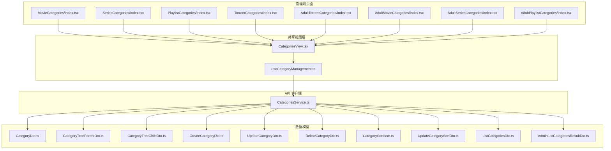
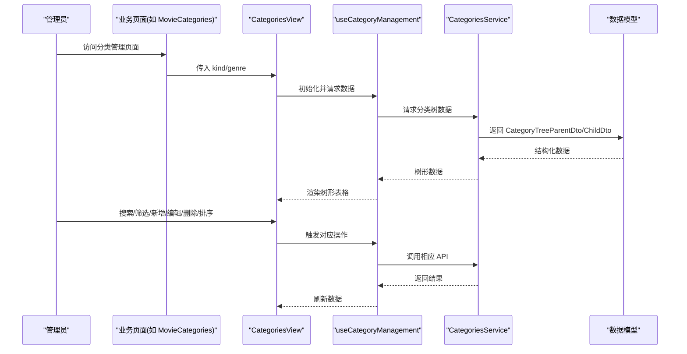
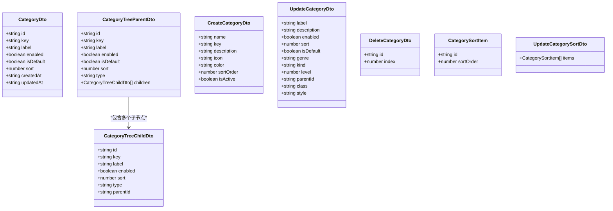
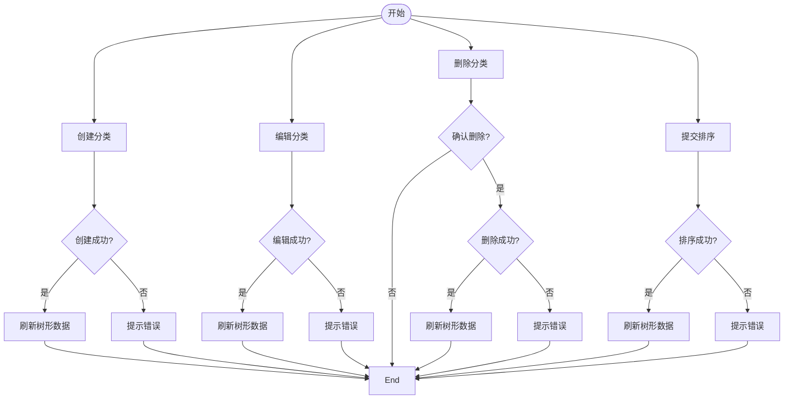

# 分类管理

<cite>
**本文引用的文件**
- [CategoriesService.ts](file://src/api/services/CategoriesService.ts)
- [CategoryDto.ts](file://src/api/models/CategoryDto.ts)
- [CategoryTreeParentDto.ts](file://src/api/models/CategoryTreeParentDto.ts)
- [CategoryTreeChildDto.ts](file://src/api/models/CategoryTreeChildDto.ts)
- [CreateCategoryDto.ts](file://src/api/models/CreateCategoryDto.ts)
- [UpdateCategoryDto.ts](file://src/api/models/UpdateCategoryDto.ts)
- [DeleteCategoryDto.ts](file://src/api/models/DeleteCategoryDto.ts)
- [CategorySortItem.ts](file://src/api/models/CategorySortItem.ts)
- [UpdateCategorySortDto.ts](file://src/api/models/UpdateCategorySortDto.ts)
- [ListCategoriesDto.ts](file://src/api/models/ListCategoriesDto.ts)
- [AdminListCategoriesResultDto.ts](file://src/api/models/AdminListCategoriesResultDto.ts)
- [CategoriesView.tsx](file://src/modules/admin/shared/categories/CategoriesView.tsx)
- [useCategoryManagement.ts](file://src/modules/admin/shared/categories/hooks/useCategoryManagement.ts)
- [MovieCategories/index.tsx](file://src/modules/admin/pages/content/categories/MovieCategories/index.tsx)
- [SeriesCategories/index.tsx](file://src/modules/admin/pages/content/categories/SeriesCategories/index.tsx)
- [PlaylistCategories/index.tsx](file://src/modules/admin/pages/content/categories/PlaylistCategories/index.tsx)
- [TorrentCategories/index.tsx](file://src/modules/admin/pages/content/categories/TorrentCategories/index.tsx)
- [AdultTorrentCategories/index.tsx](file://src/modules/admin/pages/content/categories/AdultTorrentCategories/index.tsx)
- [AdultMovieCategories/index.tsx](file://src/modules/admin/pages/content/categories/AdultMovieCategories/index.tsx)
- [AdultSeriesCategories/index.tsx](file://src/modules/admin/pages/content/categories/AdultSeriesCategories/index.tsx)
- [AdultPlaylistCategories/index.tsx](file://src/modules/admin/pages/content/categories/AdultPlaylistCategories/index.tsx)
- [import-routes.ts](file://scripts/import-routes.ts)
- [db-routes-result.txt](file://scripts/db-routes-result.txt)
</cite>

## 目录
1. [简介](#简介)
2. [项目结构](#项目结构)
3. [核心组件](#核心组件)
4. [架构总览](#架构总览)
5. [详细组件分析](#详细组件分析)
6. [依赖分析](#依赖分析)
7. [性能考虑](#性能考虑)
8. [故障排除指南](#故障排除指南)
9. [结论](#结论)
10. [附录](#附录)

## 简介
本文件系统性阐述内容分类管理功能，覆盖电影分类、播放列表分类、电视剧分类以及种子分类的维护与管理。文档从数据模型、层级结构与关联关系入手，解释分类的创建、编辑、删除与排序流程，并结合权限控制、批量操作与数据一致性保障策略，提供最佳实践与常见问题解决方案。

## 项目结构
分类管理采用“共享视图 + 页面路由”的组织方式：共享视图负责通用的树形表格、筛选、弹窗等交互；页面路由根据业务类型（电影/剧集/播放列表/种子）注入 kind 与 genre 参数，驱动共享视图渲染不同类型的分类树。

图表来源
- [CategoriesView.tsx](file://src/modules/admin/shared/categories/CategoriesView.tsx#L94-L179)
- [useCategoryManagement.ts](file://src/modules/admin/shared/categories/hooks/useCategoryManagement.ts)
- [CategoriesService.ts](file://src/api/services/CategoriesService.ts#L15-L125)
- [CategoryDto.ts](file://src/api/models/CategoryDto.ts#L5-L15)
- [CategoryTreeParentDto.ts](file://src/api/models/CategoryTreeParentDto.ts#L6-L16)
- [CategoryTreeChildDto.ts](file://src/api/models/CategoryTreeChildDto.ts#L5-L14)
- [CreateCategoryDto.ts](file://src/api/models/CreateCategoryDto.ts#L5-L34)
- [UpdateCategoryDto.ts](file://src/api/models/UpdateCategoryDto.ts#L5-L68)
- [DeleteCategoryDto.ts](file://src/api/models/DeleteCategoryDto.ts#L5-L14)
- [CategorySortItem.ts](file://src/api/models/CategorySortItem.ts#L5-L14)
- [UpdateCategorySortDto.ts](file://src/api/models/UpdateCategorySortDto.ts#L5-L11)
- [ListCategoriesDto.ts](file://src/api/models/ListCategoriesDto.ts#L5-L22)
- [AdminListCategoriesResultDto.ts](file://src/api/models/AdminListCategoriesResultDto.ts#L5-L11)

章节来源
- [CategoriesView.tsx](file://src/modules/admin/shared/categories/CategoriesView.tsx#L94-L179)
- [import-routes.ts](file://scripts/import-routes.ts#L548-L618)
- [db-routes-result.txt](file://scripts/db-routes-result.txt#L92-L102)

## 核心组件
- 共享视图 CategoriesView：提供统一的树形表格、搜索、状态筛选、新增/编辑弹窗、启用/禁用切换、默认展示切换等能力。
- 业务页面：通过注入 kind 与 genre 参数，分别指向电影、剧集、播放列表、种子及其“成人”子类目的专用页面。
- API 客户端 CategoriesService：封装分类的创建、更新、删除、分页列表等接口。
- 数据模型：涵盖分类基础信息、树形父子结构、创建/更新/删除/排序输入输出等。

章节来源
- [CategoriesView.tsx](file://src/modules/admin/shared/categories/CategoriesView.tsx#L94-L179)
- [CategoriesService.ts](file://src/api/services/CategoriesService.ts#L15-L125)
- [CategoryDto.ts](file://src/api/models/CategoryDto.ts#L5-L15)
- [CategoryTreeParentDto.ts](file://src/api/models/CategoryTreeParentDto.ts#L6-L16)
- [CategoryTreeChildDto.ts](file://src/api/models/CategoryTreeChildDto.ts#L5-L14)
- [CreateCategoryDto.ts](file://src/api/models/CreateCategoryDto.ts#L5-L34)
- [UpdateCategoryDto.ts](file://src/api/models/UpdateCategoryDto.ts#L5-L68)
- [DeleteCategoryDto.ts](file://src/api/models/DeleteCategoryDto.ts#L5-L14)
- [CategorySortItem.ts](file://src/api/models/CategorySortItem.ts#L5-L14)
- [UpdateCategorySortDto.ts](file://src/api/models/UpdateCategorySortDto.ts#L5-L11)
- [ListCategoriesDto.ts](file://src/api/models/ListCategoriesDto.ts#L5-L22)
- [AdminListCategoriesResultDto.ts](file://src/api/models/AdminListCategoriesResultDto.ts#L5-L11)

## 架构总览
分类管理遵循“视图-逻辑-服务-模型”的分层设计。页面路由决定 kind/genre，共享视图调用 useCategoryManagement 钩子，钩子通过 CategoriesService 调用后端接口，返回树形数据并驱动 UI 渲染。

图表来源
- [CategoriesView.tsx](file://src/modules/admin/shared/categories/CategoriesView.tsx#L94-L179)
- [useCategoryManagement.ts](file://src/modules/admin/shared/categories/hooks/useCategoryManagement.ts)
- [CategoriesService.ts](file://src/api/services/CategoriesService.ts#L15-L125)
- [CategoryTreeParentDto.ts](file://src/api/models/CategoryTreeParentDto.ts#L6-L16)
- [CategoryTreeChildDto.ts](file://src/api/models/CategoryTreeChildDto.ts#L5-L14)

## 详细组件分析

### 数据模型与层级结构
- 基础分类模型 CategoryDto：包含标识、键、标签、描述、启用状态、默认展示、排序、创建/更新时间等字段。
- 树形父节点 CategoryTreeParentDto：包含父节点信息及子节点数组。
- 树形子节点 CategoryTreeChildDto：包含子节点的标识、键、标签、启用状态、排序、类型、父 ID 等。
- 创建/更新/删除/排序输入输出：CreateCategoryDto、UpdateCategoryDto、DeleteCategoryDto、CategorySortItem、UpdateCategorySortDto。
- 列表查询参数 ListCategoriesDto：支持关键字搜索、启用状态过滤、分页。
- 管理员列表响应 AdminListCategoriesResultDto：包含分页数据与总数。

图表来源
- [CategoryDto.ts](file://src/api/models/CategoryDto.ts#L5-L15)
- [CategoryTreeParentDto.ts](file://src/api/models/CategoryTreeParentDto.ts#L6-L16)
- [CategoryTreeChildDto.ts](file://src/api/models/CategoryTreeChildDto.ts#L5-L14)
- [CreateCategoryDto.ts](file://src/api/models/CreateCategoryDto.ts#L5-L34)
- [UpdateCategoryDto.ts](file://src/api/models/UpdateCategoryDto.ts#L5-L68)
- [DeleteCategoryDto.ts](file://src/api/models/DeleteCategoryDto.ts#L5-L14)
- [CategorySortItem.ts](file://src/api/models/CategorySortItem.ts#L5-L14)
- [UpdateCategorySortDto.ts](file://src/api/models/UpdateCategorySortDto.ts#L5-L11)

章节来源
- [CategoryDto.ts](file://src/api/models/CategoryDto.ts#L5-L15)
- [CategoryTreeParentDto.ts](file://src/api/models/CategoryTreeParentDto.ts#L6-L16)
- [CategoryTreeChildDto.ts](file://src/api/models/CategoryTreeChildDto.ts#L5-L14)
- [CreateCategoryDto.ts](file://src/api/models/CreateCategoryDto.ts#L5-L34)
- [UpdateCategoryDto.ts](file://src/api/models/UpdateCategoryDto.ts#L5-L68)
- [DeleteCategoryDto.ts](file://src/api/models/DeleteCategoryDto.ts#L5-L14)
- [CategorySortItem.ts](file://src/api/models/CategorySortItem.ts#L5-L14)
- [UpdateCategorySortDto.ts](file://src/api/models/UpdateCategorySortDto.ts#L5-L11)
- [ListCategoriesDto.ts](file://src/api/models/ListCategoriesDto.ts#L5-L22)
- [AdminListCategoriesResultDto.ts](file://src/api/models/AdminListCategoriesResultDto.ts#L5-L11)

### 分类创建、编辑、删除与排序流程
- 创建：页面传入 CreateCategoryDto，调用创建接口，成功后刷新树形数据。
- 编辑：传入 UpdateCategoryDto 的部分字段进行更新，支持启用/禁用、排序、默认展示等。
- 删除：传入 DeleteCategoryDto，确认后调用删除接口，成功后刷新。
- 排序：使用 UpdateCategorySortDto 提交排序项列表，服务端按顺序更新。

图表来源
- [CategoriesService.ts](file://src/api/services/CategoriesService.ts#L22-L107)
- [CreateCategoryDto.ts](file://src/api/models/CreateCategoryDto.ts#L5-L34)
- [UpdateCategoryDto.ts](file://src/api/models/UpdateCategoryDto.ts#L5-L68)
- [DeleteCategoryDto.ts](file://src/api/models/DeleteCategoryDto.ts#L5-L14)
- [UpdateCategorySortDto.ts](file://src/api/models/UpdateCategorySortDto.ts#L5-L11)

章节来源
- [CategoriesService.ts](file://src/api/services/CategoriesService.ts#L22-L107)
- [useCategoryManagement.ts](file://src/modules/admin/shared/categories/hooks/useCategoryManagement.ts)

### 权限控制与批量操作
- 权限控制：分类管理属于后台管理范畴，页面路由由脚本导入，具备布局与排序配置，具体权限校验由后端接口返回的状态码与消息体现（如未认证、禁止访问、账号禁用等）。
- 批量操作：排序通过 UpdateCategorySortDto 一次性提交多条排序项；删除可结合前端确认与后端幂等校验实现安全批量删除。

章节来源
- [CategoriesService.ts](file://src/api/services/CategoriesService.ts#L36-L105)
- [UpdateCategorySortDto.ts](file://src/api/models/UpdateCategorySortDto.ts#L5-L11)
- [import-routes.ts](file://scripts/import-routes.ts#L548-L618)

### 数据一致性保证
- 幂等性：删除与更新接口应具备幂等性，避免重复操作导致的数据不一致。
- 校验与回滚：前端在提交前进行必要校验（如必填字段、排序值范围），后端对非法参数进行拦截并返回明确错误信息。
- 刷新策略：每次成功操作后统一刷新树形数据，确保 UI 与数据库一致。

章节来源
- [CategoriesService.ts](file://src/api/services/CategoriesService.ts#L36-L105)
- [useCategoryManagement.ts](file://src/modules/admin/shared/categories/hooks/useCategoryManagement.ts)

### 页面与路由映射
- 电影分类：MovieCategories
- 剧集分类：SeriesCategories
- 播放列表分类：PlaylistCategories
- 种子分类：TorrentCategories
- 成人分类（含种子/电影/剧集/播放列表子类目）：AdultTorrentCategories、AdultMovieCategories、AdultSeriesCategories、AdultPlaylistCategories

章节来源
- [import-routes.ts](file://scripts/import-routes.ts#L548-L618)
- [db-routes-result.txt](file://scripts/db-routes-result.txt#L92-L102)

## 依赖分析
分类管理的依赖关系清晰：页面路由依赖共享视图；共享视图依赖 useCategoryManagement 钩子；钩子依赖 CategoriesService；服务端接口依赖数据模型。

图表来源
- [import-routes.ts](file://scripts/import-routes.ts#L548-L618)
- [CategoriesView.tsx](file://src/modules/admin/shared/categories/CategoriesView.tsx#L94-L179)
- [useCategoryManagement.ts](file://src/modules/admin/shared/categories/hooks/useCategoryManagement.ts)
- [CategoriesService.ts](file://src/api/services/CategoriesService.ts#L15-L125)

章节来源
- [import-routes.ts](file://scripts/import-routes.ts#L548-L618)
- [CategoriesView.tsx](file://src/modules/admin/shared/categories/CategoriesView.tsx#L94-L179)
- [CategoriesService.ts](file://src/api/services/CategoriesService.ts#L15-L125)

## 性能考虑
- 树形渲染优化：CategoriesView 使用 TreeTable 渲染树形数据，默认不展开所有节点，减少初始渲染压力。
- 搜索与筛选：CategoryFilterBar 支持本地搜索与状态筛选，降低无效网络请求。
- 按需加载：列表查询支持分页参数，避免一次性拉取大量数据。
- 事件节流：搜索按钮与键盘事件在视图中已做防抖处理，避免频繁触发。

章节来源
- [CategoriesView.tsx](file://src/modules/admin/shared/categories/CategoriesView.tsx#L26-L92)
- [ListCategoriesDto.ts](file://src/api/models/ListCategoriesDto.ts#L5-L22)

## 故障排除指南
- 未认证/权限不足：接口返回未认证或禁止访问状态码，需检查登录态与角色权限。
- 参数错误：创建/更新/删除接口对必填字段与格式有严格要求，需核对请求体。
- 资源不存在：删除或更新时若分类已被删除，接口会返回资源不存在。
- 服务器错误：网络异常或后端异常，建议重试并查看日志。

章节来源
- [CategoriesService.ts](file://src/api/services/CategoriesService.ts#L36-L105)

## 结论
分类管理以共享视图为核心，结合路由注入的业务维度（kind/genre），实现了电影、剧集、播放列表与种子分类的统一管理。通过完善的数据模型、清晰的流程与严格的错误处理，系统在易用性与稳定性之间取得平衡。建议在生产环境中配合完善的权限体系与审计日志，进一步提升安全性与可追溯性。

## 附录
- 最佳实践
  - 在创建分类时，优先设置合理的排序值与默认展示，减少后续调整成本。
  - 对于层级分类，确保父 ID 与层级正确，避免出现孤立节点。
  - 批量排序时，先预览排序结果，再提交保存，降低误操作风险。
  - 定期清理无用分类，保持分类树简洁清晰。
- 常见问题
  - 分类无法启用/禁用：检查是否具备相应权限，确认后端返回状态。
  - 排序无效：确认提交的排序项列表完整且顺序正确。
  - 删除失败：确认分类是否存在、是否被内容引用。