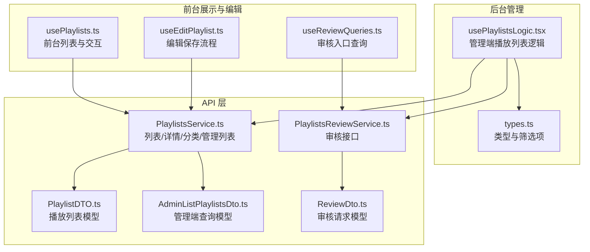
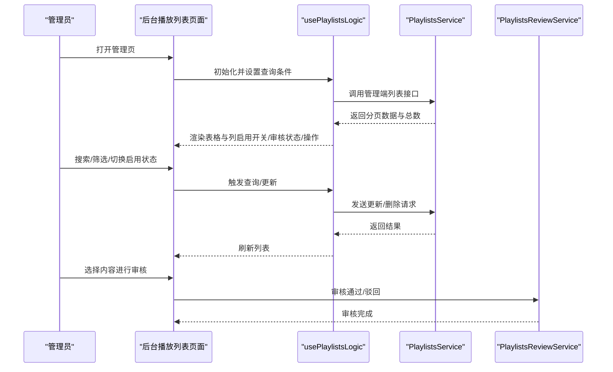
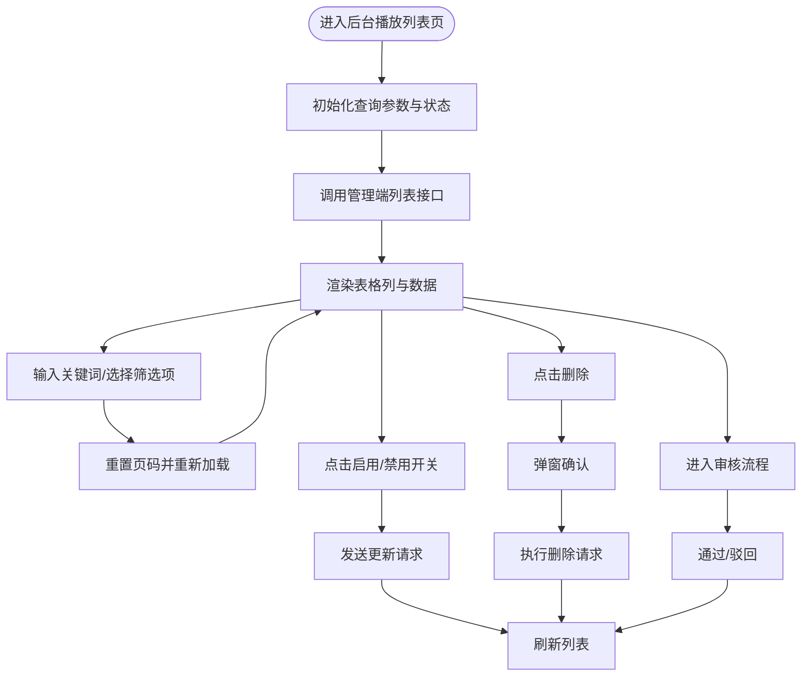
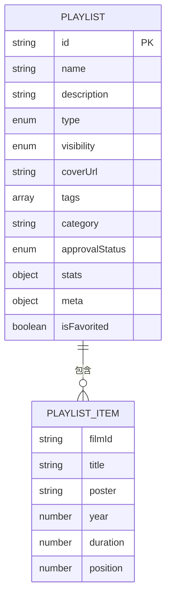
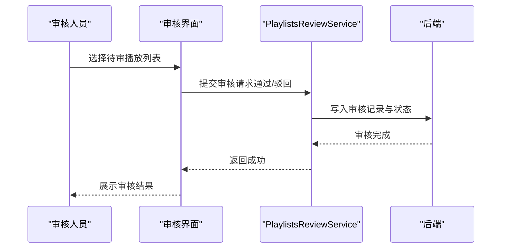
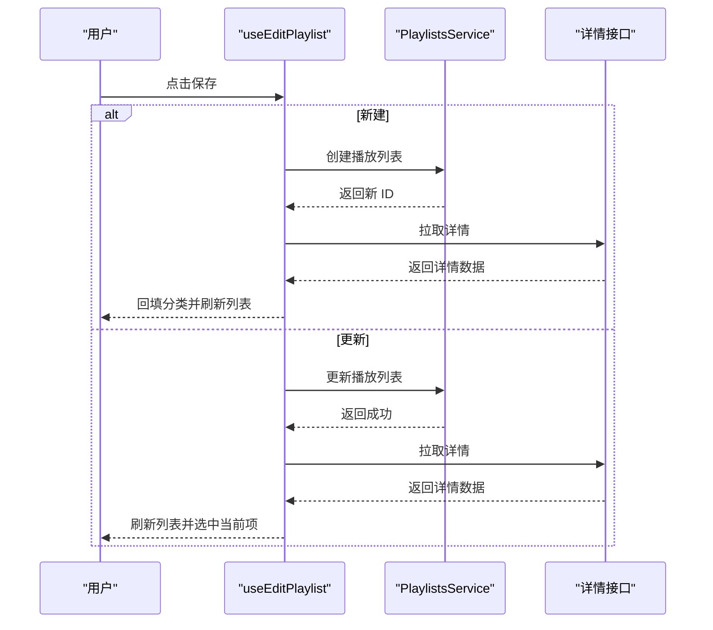
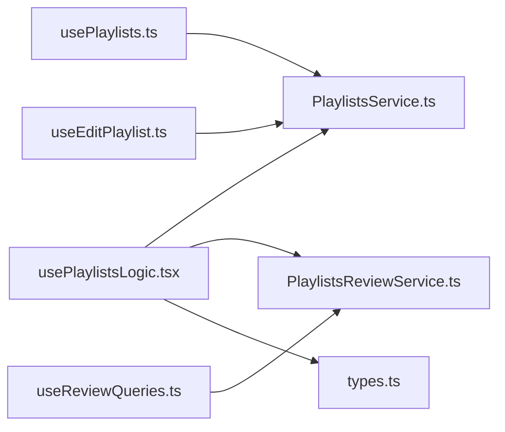

# 播放列表管理

<cite>
**本文引用的文件**
- [usePlaylistsLogic.tsx](file://src/modules/admin/pages/content/media/PlaylistsPage/usePlaylistsLogic.tsx)
- [types.ts](file://src/modules/admin/pages/content/media/PlaylistsPage/types.ts)
- [PlaylistsService.ts](file://src/api/services/PlaylistsService.ts)
- [PlaylistsReviewService.ts](file://src/api/services/PlaylistsReviewService.ts)
- [PlaylistDTO.ts](file://src/api/models/PlaylistDTO.ts)
- [PlaylistItemDTO.ts](file://src/api/models/PlaylistItemDTO.ts)
- [AdminListPlaylistsDto.ts](file://src/api/models/AdminListPlaylistsDto.ts)
- [AdminListPlaylistsResponseDto.ts](file://src/api/models/AdminListPlaylistsResponseDto.ts)
- [ReviewDto.ts](file://src/api/models/ReviewDto.ts)
- [usePlaylists.ts](file://src/modules/app/pages/Playlists/hooks/usePlaylists.ts)
- [useEditPlaylist.ts](file://src/modules/app/pages/Edit/playlists/hooks/useEditPlaylist.ts)
- [useReviewQueries.ts](file://src/modules/app/pages/Review/hooks/useReviewQueries.ts)
- [PlaylistReviewHistoryDto.ts](file://src/api/models/PlaylistReviewHistoryDto.ts)
- [PlaylistReviewHistoryItemDto.ts](file://src/api/models/PlaylistReviewHistoryItemDto.ts)
- [PlaylistReviewHistoryResponseDto.ts](file://src/api/models/PlaylistReviewHistoryResponseDto.ts)
- [PlaylistStatsDTO.ts](file://src/api/models/PlaylistStatsDTO.ts)
- [GetPlaylistDto.ts](file://src/api/models/GetPlaylistDto.ts)
- [LikePlaylistDto.ts](file://src/api/models/LikePlaylistDto.ts)
- [LikePlaylistResponseDto.ts](file://src/api/models/LikePlaylistResponseDto.ts)
- [add-playlist-detail-route.mjs](file://scripts/add-playlist-detail-route.mjs)
</cite>

## 目录
1. [简介](#简介)
2. [项目结构](#项目结构)
3. [核心组件](#核心组件)
4. [架构总览](#架构总览)
5. [详细组件分析](#详细组件分析)
6. [依赖分析](#依赖分析)
7. [性能考虑](#性能考虑)
8. [故障排查指南](#故障排查指南)
9. [结论](#结论)
10. [附录](#附录)

## 简介
本文件系统化梳理“播放列表管理”功能，覆盖后台审核、编辑与管理全流程，包括列表展示、搜索过滤、分类管理、排序、状态管理与权限控制，并补充导入导出、批量操作与性能优化建议。文档同时给出最佳实践与常见问题解决方案，帮助开发者与运营人员高效落地与维护该能力。

## 项目结构
围绕播放列表管理的关键目录与文件如下：
- 后台管理页面与逻辑
  - 页面逻辑：src/modules/admin/pages/content/media/PlaylistsPage/usePlaylistsLogic.tsx
  - 类型定义：src/modules/admin/pages/content/media/PlaylistsPage/types.ts
- API 服务层
  - 列表与详情：src/api/services/PlaylistsService.ts
  - 审核服务：src/api/services/PlaylistsReviewService.ts
- 数据模型
  - 播放列表模型：src/api/models/PlaylistDTO.ts
  - 列表项模型：src/api/models/PlaylistItemDTO.ts
  - 管理端查询模型：src/api/models/AdminListPlaylistsDto.ts
  - 管理端响应模型：src/api/models/AdminListPlaylistsResponseDto.ts
  - 审核模型：src/api/models/ReviewDto.ts
  - 审核历史模型：src/api/models/PlaylistReviewHistoryDto.ts 等
- 前台展示与编辑
  - 前台列表 Hook：src/modules/app/pages/Playlists/hooks/usePlaylists.ts
  - 编辑页 Hook：src/modules/app/pages/Edit/playlists/hooks/useEditPlaylist.ts
  - 审核入口查询：src/modules/app/pages/Review/hooks/useReviewQueries.ts
- 统计与交互
  - 统计模型：src/api/models/PlaylistStatsDTO.ts
  - 详情查询模型：src/api/models/GetPlaylistDto.ts
  - 点赞交互模型：src/api/models/LikePlaylistDto.ts、src/api/models/LikePlaylistResponseDto.ts
- 路由脚本
  - 片单详情路由生成：scripts/add-playlist-detail-route.mjs

图表来源
- [usePlaylistsLogic.tsx](file://src/modules/admin/pages/content/media/PlaylistsPage/usePlaylistsLogic.tsx#L1-L279)
- [types.ts](file://src/modules/admin/pages/content/media/PlaylistsPage/types.ts#L1-L76)
- [PlaylistsService.ts](file://src/api/services/PlaylistsService.ts#L1-L250)
- [PlaylistsReviewService.ts](file://src/api/services/PlaylistsReviewService.ts#L1-L164)
- [PlaylistDTO.ts](file://src/api/models/PlaylistDTO.ts#L1-L56)
- [AdminListPlaylistsDto.ts](file://src/api/models/AdminListPlaylistsDto.ts#L1-L31)
- [ReviewDto.ts](file://src/api/models/ReviewDto.ts#L1-L27)
- [usePlaylists.ts](file://src/modules/app/pages/Playlists/hooks/usePlaylists.ts#L1-L114)
- [useEditPlaylist.ts](file://src/modules/app/pages/Edit/playlists/hooks/useEditPlaylist.ts#L199-L229)
- [useReviewQueries.ts](file://src/modules/app/pages/Review/hooks/useReviewQueries.ts#L159-L190)

章节来源
- [usePlaylistsLogic.tsx](file://src/modules/admin/pages/content/media/PlaylistsPage/usePlaylistsLogic.tsx#L1-L279)
- [types.ts](file://src/modules/admin/pages/content/media/PlaylistsPage/types.ts#L1-L76)
- [PlaylistsService.ts](file://src/api/services/PlaylistsService.ts#L1-L250)
- [PlaylistsReviewService.ts](file://src/api/services/PlaylistsReviewService.ts#L1-L164)
- [PlaylistDTO.ts](file://src/api/models/PlaylistDTO.ts#L1-L56)
- [AdminListPlaylistsDto.ts](file://src/api/models/AdminListPlaylistsDto.ts#L1-L31)
- [ReviewDto.ts](file://src/api/models/ReviewDto.ts#L1-L27)
- [usePlaylists.ts](file://src/modules/app/pages/Playlists/hooks/usePlaylists.ts#L1-L114)
- [useEditPlaylist.ts](file://src/modules/app/pages/Edit/playlists/hooks/useEditPlaylist.ts#L199-L229)
- [useReviewQueries.ts](file://src/modules/app/pages/Review/hooks/useReviewQueries.ts#L159-L190)

## 核心组件
- 后台管理逻辑 Hook
  - 职责：负责列表加载、搜索过滤、启用/禁用切换、删除确认、列定义与导航跳转
  - 关键点：使用管理端列表接口，支持关键词、类型、可见性、拥有者、审核状态筛选；列渲染包含启用开关、审核状态标签、操作按钮
- 类型与筛选项
  - 定义播放列表类型、可见性、审核状态枚举与默认查询参数
  - 提供类型/可见性/审核状态的下拉选项与颜色映射
- API 服务
  - PlaylistsService：创建/更新/删除/列表/详情/管理列表/分类/精选列表
  - PlaylistsReviewService：审核（通过/驳回）、待审/已审/被拒列表、审核历史
- 数据模型
  - PlaylistDTO：播放列表主体字段（名称、描述、类型、可见性、标签、分类、审核状态、影片列表、统计、元信息、收藏态）
  - PlaylistItemDTO：列表项字段（影片 ID、标题、海报、年份、时长、位置）
  - AdminListPlaylistsDto/ResponseDto：管理端分页查询与响应
  - ReviewDto：审核请求（ID、动作、备注、拒绝原因码）

章节来源
- [usePlaylistsLogic.tsx](file://src/modules/admin/pages/content/media/PlaylistsPage/usePlaylistsLogic.tsx#L24-L279)
- [types.ts](file://src/modules/admin/pages/content/media/PlaylistsPage/types.ts#L5-L76)
- [PlaylistsService.ts](file://src/api/services/PlaylistsService.ts#L21-L249)
- [PlaylistsReviewService.ts](file://src/api/services/PlaylistsReviewService.ts#L18-L164)
- [PlaylistDTO.ts](file://src/api/models/PlaylistDTO.ts#L8-L31)
- [PlaylistItemDTO.ts](file://src/api/models/PlaylistItemDTO.ts#L5-L12)
- [AdminListPlaylistsDto.ts](file://src/api/models/AdminListPlaylistsDto.ts#L5-L18)
- [AdminListPlaylistsResponseDto.ts](file://src/api/models/AdminListPlaylistsResponseDto.ts#L5-L10)
- [ReviewDto.ts](file://src/api/models/ReviewDto.ts#L5-L18)

## 架构总览
播放列表管理从前台列表与编辑，到后台审核与管理，形成闭环的数据流与权限控制链路。

图表来源
- [usePlaylistsLogic.tsx](file://src/modules/admin/pages/content/media/PlaylistsPage/usePlaylistsLogic.tsx#L42-L122)
- [PlaylistsService.ts](file://src/api/services/PlaylistsService.ts#L173-L195)
- [PlaylistsReviewService.ts](file://src/api/services/PlaylistsReviewService.ts#L25-L163)

## 详细组件分析

### 后台播放列表管理逻辑（usePlaylistsLogic）
- 列表加载
  - 使用管理端列表接口，支持关键词、类型、可见性、拥有者、审核状态、分页参数
  - 将后端返回映射为统一的前端列数据结构
- 搜索与筛选
  - 文本搜索触发查询重置到第一页
  - 下拉筛选项来源于类型/可见性/审核状态枚举
- 启用/禁用切换
  - 通过开关组件触发更新请求，异步执行并刷新列表
- 删除流程
  - 弹窗确认后调用删除接口，成功后刷新列表
- 列定义
  - 包含 ID、标题、类型、可见性、浏览/点赞、启用、排序、更新时间、审核状态、通过时间、操作（详情/删除）
  - 审核状态使用颜色区分，启用开关直接绑定状态更新

图表来源
- [usePlaylistsLogic.tsx](file://src/modules/admin/pages/content/media/PlaylistsPage/usePlaylistsLogic.tsx#L42-L122)
- [types.ts](file://src/modules/admin/pages/content/media/PlaylistsPage/types.ts#L42-L76)

章节来源
- [usePlaylistsLogic.tsx](file://src/modules/admin/pages/content/media/PlaylistsPage/usePlaylistsLogic.tsx#L24-L279)
- [types.ts](file://src/modules/admin/pages/content/media/PlaylistsPage/types.ts#L1-L76)

### 数据模型与关联关系
- 播放列表主体
  - 字段：ID、名称、描述、类型、可见性、封面、标签、分类、审核状态、影片列表、统计、元信息、收藏态
  - 关联：影片列表为 PlaylistItemDTO 数组，统计包含浏览、点赞、收藏、订阅等指标
- 列表项
  - 字段：影片 ID、标题、海报、年份、时长、位置（用于排序）
- 管理端查询
  - 支持分页、关键词、类型、可见性、拥有者、审核状态、排序字段与顺序

图表来源
- [PlaylistDTO.ts](file://src/api/models/PlaylistDTO.ts#L8-L31)
- [PlaylistItemDTO.ts](file://src/api/models/PlaylistItemDTO.ts#L5-L12)

章节来源
- [PlaylistDTO.ts](file://src/api/models/PlaylistDTO.ts#L1-L56)
- [PlaylistItemDTO.ts](file://src/api/models/PlaylistItemDTO.ts#L1-L14)

### 审核流程与状态管理
- 审核入口
  - 审核入口查询根据类型（如 series/playlist）与状态（pending/approved/rejected）分别调用对应接口
- 审核动作
  - 通过/驳回：提交 ReviewDto，包含内容 ID、动作、备注、拒绝原因码
  - 审核历史：可查询审核记录与资源快照
- 状态流转
  - 待审 → 通过/驳回；通过后可参与推荐与展示

图表来源
- [useReviewQueries.ts](file://src/modules/app/pages/Review/hooks/useReviewQueries.ts#L169-L190)
- [PlaylistsReviewService.ts](file://src/api/services/PlaylistsReviewService.ts#L25-L163)
- [ReviewDto.ts](file://src/api/models/ReviewDto.ts#L5-L18)
- [PlaylistReviewHistoryDto.ts](file://src/api/models/PlaylistReviewHistoryDto.ts#L5-L34)
- [PlaylistReviewHistoryItemDto.ts](file://src/api/models/PlaylistReviewHistoryItemDto.ts#L7-L16)
- [PlaylistReviewHistoryResponseDto.ts](file://src/api/models/PlaylistReviewHistoryResponseDto.ts#L5-L15)

章节来源
- [useReviewQueries.ts](file://src/modules/app/pages/Review/hooks/useReviewQueries.ts#L159-L190)
- [PlaylistsReviewService.ts](file://src/api/services/PlaylistsReviewService.ts#L1-L164)
- [ReviewDto.ts](file://src/api/models/ReviewDto.ts#L1-L27)
- [PlaylistReviewHistoryDto.ts](file://src/api/models/PlaylistReviewHistoryDto.ts#L1-L35)
- [PlaylistReviewHistoryItemDto.ts](file://src/api/models/PlaylistReviewHistoryItemDto.ts#L1-L17)
- [PlaylistReviewHistoryResponseDto.ts](file://src/api/models/PlaylistReviewHistoryResponseDto.ts#L1-L16)

### 前台列表与编辑流程
- 前台列表
  - 支持标签切换（全部/我的/关注）、关键词搜索、排序方式、分页加载
  - 交互包括关注/取消关注、浏览量递增
- 编辑流程
  - 新建/更新播放列表，保存后拉取详情并回填分类字段（兼容后端响应差异）
  - 更新后刷新本地列表并选中当前项

图表来源
- [usePlaylists.ts](file://src/modules/app/pages/Playlists/hooks/usePlaylists.ts#L26-L94)
- [useEditPlaylist.ts](file://src/modules/app/pages/Edit/playlists/hooks/useEditPlaylist.ts#L199-L229)
- [PlaylistsService.ts](file://src/api/services/PlaylistsService.ts#L28-L108)

章节来源
- [usePlaylists.ts](file://src/modules/app/pages/Playlists/hooks/usePlaylists.ts#L1-L114)
- [useEditPlaylist.ts](file://src/modules/app/pages/Edit/playlists/hooks/useEditPlaylist.ts#L199-L229)
- [PlaylistsService.ts](file://src/api/services/PlaylistsService.ts#L21-L249)

### 权限控制与路由
- 权限控制
  - 审核与管理接口均标注未认证/禁止访问/账号禁用等错误场景，需在前端拦截并引导登录或提示权限不足
- 路由
  - 片单详情路由通过脚本生成，路径为 playlist/:id，默认不可见，父级为 app 布局

章节来源
- [PlaylistsService.ts](file://src/api/services/PlaylistsService.ts#L37-L107)
- [PlaylistsReviewService.ts](file://src/api/services/PlaylistsReviewService.ts#L25-L163)
- [add-playlist-detail-route.mjs](file://scripts/add-playlist-detail-route.mjs#L70-L90)

## 依赖分析
- 组件耦合
  - usePlaylistsLogic 依赖 PlaylistsService 与 PlaylistsReviewService，以及类型定义与 UI 组件
  - 前台 usePlaylists 仅依赖 PlaylistsService，耦合度低
- 外部依赖
  - API 层通过 OpenAPI 请求封装统一错误处理
- 潜在循环依赖
  - 当前文件间无循环导入迹象

图表来源
- [usePlaylistsLogic.tsx](file://src/modules/admin/pages/content/media/PlaylistsPage/usePlaylistsLogic.tsx#L1-L18)
- [PlaylistsService.ts](file://src/api/services/PlaylistsService.ts#L1-L20)
- [PlaylistsReviewService.ts](file://src/api/services/PlaylistsReviewService.ts#L1-L17)
- [types.ts](file://src/modules/admin/pages/content/media/PlaylistsPage/types.ts#L1-L18)
- [usePlaylists.ts](file://src/modules/app/pages/Playlists/hooks/usePlaylists.ts#L1-L5)
- [useEditPlaylist.ts](file://src/modules/app/pages/Edit/playlists/hooks/useEditPlaylist.ts#L1-L20)
- [useReviewQueries.ts](file://src/modules/app/pages/Review/hooks/useReviewQueries.ts#L159-L190)

章节来源
- [usePlaylistsLogic.tsx](file://src/modules/admin/pages/content/media/PlaylistsPage/usePlaylistsLogic.tsx#L1-L279)
- [PlaylistsService.ts](file://src/api/services/PlaylistsService.ts#L1-L250)
- [PlaylistsReviewService.ts](file://src/api/services/PlaylistsReviewService.ts#L1-L164)
- [types.ts](file://src/modules/admin/pages/content/media/PlaylistsPage/types.ts#L1-L76)
- [usePlaylists.ts](file://src/modules/app/pages/Playlists/hooks/usePlaylists.ts#L1-L114)
- [useEditPlaylist.ts](file://src/modules/app/pages/Edit/playlists/hooks/useEditPlaylist.ts#L199-L229)
- [useReviewQueries.ts](file://src/modules/app/pages/Review/hooks/useReviewQueries.ts#L159-L190)

## 性能考虑
- 列表分页与懒加载
  - 使用分页参数避免一次性加载过多数据；结合关键词搜索时重置页码，减少无效请求
- 列渲染优化
  - 对启用开关与审核状态使用受控组件，避免不必要的重渲染
- 前端缓存
  - 对详情与编辑后的数据进行本地缓存，减少重复请求
- 并发控制
  - 审核与更新操作使用异步执行器，避免并发冲突
- 图片与媒体
  - 列表缩略图采用懒加载与占位符，降低首屏压力

## 故障排查指南
- 审核接口报错
  - 常见错误：未认证、禁止访问、账号禁用、资源不存在、服务器错误
  - 排查步骤：确认登录状态、权限范围、内容 ID 有效性
- 列表为空或总数不一致
  - 检查关键词/筛选条件是否正确传递；确认管理端列表接口返回结构与映射逻辑
- 删除失败
  - 确认删除弹窗确认流程与异步执行器回调；查看网络层错误与后端日志
- 编辑保存后分类缺失
  - 后端详情响应可能缺失分类字段，需在前端回填；确保保存后再次拉取详情并合并

章节来源
- [PlaylistsService.ts](file://src/api/services/PlaylistsService.ts#L37-L107)
- [PlaylistsReviewService.ts](file://src/api/services/PlaylistsReviewService.ts#L155-L163)
- [usePlaylistsLogic.tsx](file://src/modules/admin/pages/content/media/PlaylistsPage/usePlaylistsLogic.tsx#L75-L79)
- [useEditPlaylist.ts](file://src/modules/app/pages/Edit/playlists/hooks/useEditPlaylist.ts#L215-L217)

## 结论
播放列表管理功能通过清晰的前后端职责划分与完善的 API 模型支撑，实现了从创建、编辑、审核到展示的全链路闭环。后台管理以列表为核心，辅以搜索、筛选与状态变更；前台则聚焦于展示与交互。建议在后续迭代中完善导入导出、批量操作与更细粒度的权限控制，并持续优化性能与用户体验。

## 附录
- 最佳实践
  - 审核流程标准化：统一审核模板与拒绝原因码
  - 数据一致性：编辑保存后强制刷新详情，避免脏数据
  - 错误分级：对不同错误类型进行前端友好提示与重试策略
- 常见问题
  - 审核状态未更新：检查审核接口调用与状态回写
  - 列表筛选无效：核对查询参数映射（如 ownerUserId → ownerId）
  - 分类字段缺失：在详情接口返回后进行本地回填