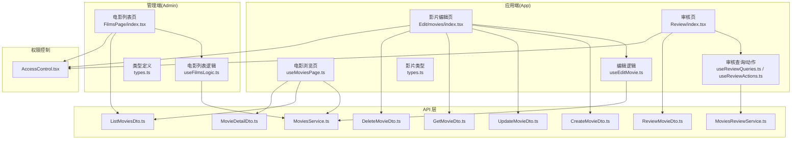
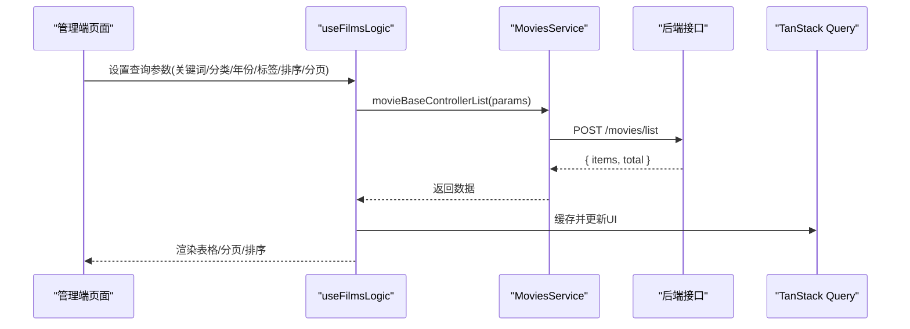
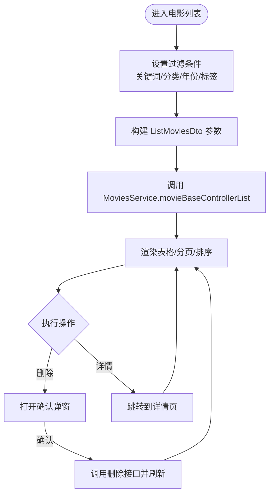
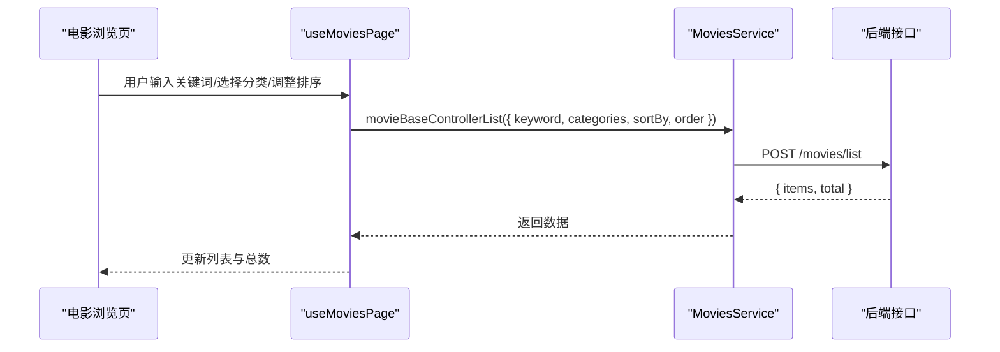
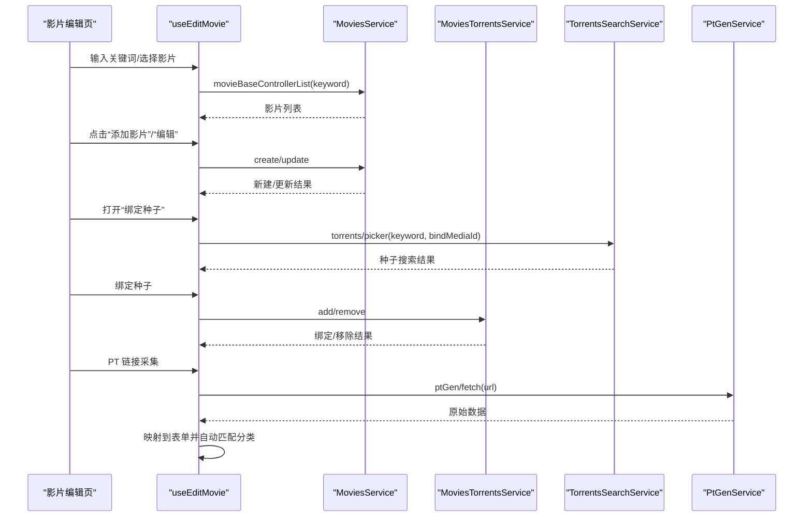
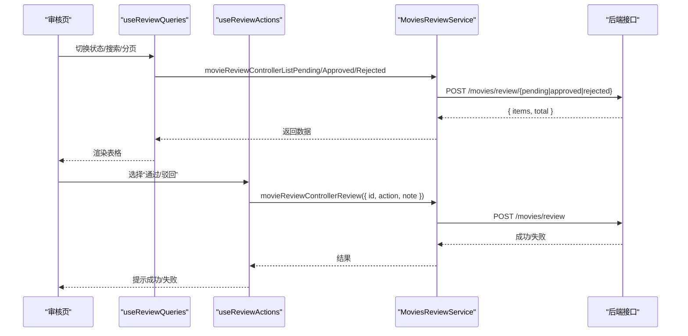
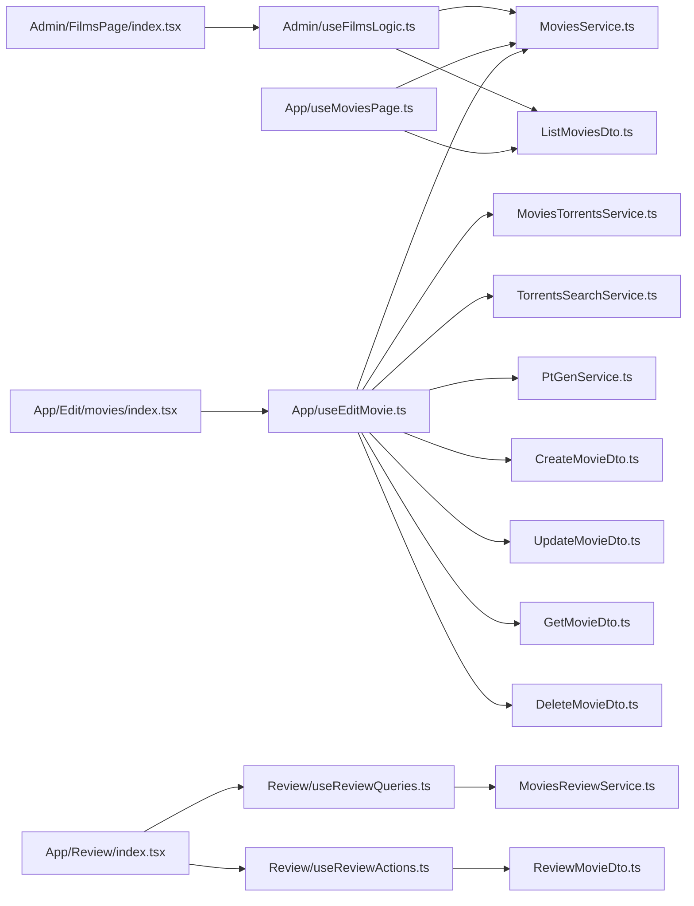

# 电影管理

<cite>
**本文引用的文件**
- [src/modules/admin/pages/content/media/FilmsPage/index.tsx](file://src/modules/admin/pages/content/media/FilmsPage/index.tsx)
- [src/modules/admin/pages/content/media/FilmsPage/hooks/useFilmsLogic.ts](file://src/modules/admin/pages/content/media/FilmsPage/hooks/useFilmsLogic.ts)
- [src/modules/admin/pages/content/media/FilmsPage/types.ts](file://src/modules/admin/pages/content/media/FilmsPage/types.ts)
- [src/modules/app/pages/Edit/movies/index.tsx](file://src/modules/app/pages/Edit/movies/index.tsx)
- [src/modules/app/pages/Edit/movies/hooks/useEditMovie.ts](file://src/modules/app/pages/Edit/movies/hooks/useEditMovie.ts)
- [src/modules/app/pages/Edit/movies/types.ts](file://src/modules/app/pages/Edit/movies/types.ts)
- [src/modules/app/pages/Movies/hooks/useMoviesPage.ts](file://src/modules/app/pages/Movies/hooks/useMoviesPage.ts)
- [src/modules/app/pages/Review/index.tsx](file://src/modules/app/pages/Review/index.tsx)
- [src/modules/app/pages/Review/hooks/useReviewQueries.ts](file://src/modules/app/pages/Review/hooks/useReviewQueries.ts)
- [src/modules/app/pages/Review/hooks/useReviewActions.ts](file://src/modules/app/pages/Review/hooks/useReviewActions.ts)
- [src/api/services/MoviesService.ts](file://src/api/services/MoviesService.ts)
- [src/api/services/MoviesReviewService.ts](file://src/api/services/MoviesReviewService.ts)
- [src/api/models/ListMoviesDto.ts](file://src/api/models/ListMoviesDto.ts)
- [src/api/models/CreateMovieDto.ts](file://src/api/models/CreateMovieDto.ts)
- [src/api/models/UpdateMovieDto.ts](file://src/api/models/UpdateMovieDto.ts)
- [src/api/models/GetMovieDto.ts](file://src/api/models/GetMovieDto.ts)
- [src/api/models/DeleteMovieDto.ts](file://src/api/models/DeleteMovieDto.ts)
- [src/api/models/ReviewMovieDto.ts](file://src/api/models/ReviewMovieDto.ts)
- [src/api/models/MovieDetailDto.ts](file://src/api/models/MovieDetailDto.ts)
- [src/permissions/AccessControl.tsx](file://src/permissions/AccessControl.tsx)
</cite>

## 目录
1. [简介](#简介)
2. [项目结构](#项目结构)
3. [核心组件](#核心组件)
4. [架构总览](#架构总览)
5. [详细组件分析](#详细组件分析)
6. [依赖关系分析](#依赖关系分析)
7. [性能考量](#性能考量)
8. [故障排查指南](#故障排查指南)
9. [结论](#结论)
10. [附录](#附录)

## 简介
本文件系统性梳理 zTorrent 站点中的“电影管理”能力，覆盖以下方面：
- 电影内容的审核、编辑与管理：待审、已审、已驳回三态管理；影片信息编辑与种子绑定。
- 展示与检索：电影列表、搜索过滤、分类与标签筛选、排序。
- 数据模型与业务规则：字段定义、校验规则、状态流转。
- 审核流程与权限控制：审核开关、操作记录、权限组件。
- 批量处理与性能优化：批量删除、分页与缓存、防抖搜索、懒加载。
- 最佳实践与常见问题：开发与运维建议。

## 项目结构
围绕电影管理的相关模块与文件组织如下：
- 管理端（Admin）：电影列表页、分类管理、批量操作入口。
- 应用端（App）：电影浏览页、影片编辑页、审核页。
- API 层：MoviesService、MoviesReviewService、相关 DTO。
- 权限控制：AccessControl 组件。

图表来源
- [src/modules/admin/pages/content/media/FilmsPage/index.tsx](file://src/modules/admin/pages/content/media/FilmsPage/index.tsx#L1-L166)
- [src/modules/admin/pages/content/media/FilmsPage/hooks/useFilmsLogic.ts](file://src/modules/admin/pages/content/media/FilmsPage/hooks/useFilmsLogic.ts#L1-L174)
- [src/modules/app/pages/Movies/hooks/useMoviesPage.ts](file://src/modules/app/pages/Movies/hooks/useMoviesPage.ts#L1-L69)
- [src/modules/app/pages/Edit/movies/index.tsx](file://src/modules/app/pages/Edit/movies/index.tsx#L1-L178)
- [src/modules/app/pages/Edit/movies/hooks/useEditMovie.ts](file://src/modules/app/pages/Edit/movies/hooks/useEditMovie.ts#L1-L391)
- [src/modules/app/pages/Review/index.tsx](file://src/modules/app/pages/Review/index.tsx#L1-L79)
- [src/modules/app/pages/Review/hooks/useReviewQueries.ts](file://src/modules/app/pages/Review/hooks/useReviewQueries.ts#L136-L160)
- [src/api/services/MoviesService.ts](file://src/api/services/MoviesService.ts#L1-L35)
- [src/api/services/MoviesReviewService.ts](file://src/api/services/MoviesReviewService.ts#L1-L164)
- [src/api/models/ListMoviesDto.ts](file://src/api/models/ListMoviesDto.ts#L1-L52)
- [src/api/models/CreateMovieDto.ts](file://src/api/models/CreateMovieDto.ts#L1-L79)
- [src/api/models/UpdateMovieDto.ts](file://src/api/models/UpdateMovieDto.ts#L1-L83)
- [src/api/models/GetMovieDto.ts](file://src/api/models/GetMovieDto.ts#L1-L11)
- [src/api/models/DeleteMovieDto.ts](file://src/api/models/DeleteMovieDto.ts#L1-L12)
- [src/api/models/ReviewMovieDto.ts](file://src/api/models/ReviewMovieDto.ts#L1-L32)
- [src/api/models/MovieDetailDto.ts](file://src/api/models/MovieDetailDto.ts#L1-L36)
- [src/permissions/AccessControl.tsx](file://src/permissions/AccessControl.tsx#L1-L43)

章节来源
- [src/modules/admin/pages/content/media/FilmsPage/index.tsx](file://src/modules/admin/pages/content/media/FilmsPage/index.tsx#L1-L166)
- [src/modules/app/pages/Movies/hooks/useMoviesPage.ts](file://src/modules/app/pages/Movies/hooks/useMoviesPage.ts#L1-L69)
- [src/modules/app/pages/Edit/movies/index.tsx](file://src/modules/app/pages/Edit/movies/index.tsx#L1-L178)
- [src/modules/app/pages/Review/index.tsx](file://src/modules/app/pages/Review/index.tsx#L1-L79)
- [src/api/services/MoviesService.ts](file://src/api/services/MoviesService.ts#L1-L35)
- [src/api/services/MoviesReviewService.ts](file://src/api/services/MoviesReviewService.ts#L1-L164)
- [src/permissions/AccessControl.tsx](file://src/permissions/AccessControl.tsx#L1-L43)

## 核心组件
- 管理端电影列表页：支持关键词、分类、年份、标签 ID 过滤，排序与分页，单条删除与详情跳转。
- 应用端电影浏览页：关键词、分类、排序筛选，卡片式浏览。
- 影片编辑页：影片增删改、种子搜索与绑定、PT 采集填充、表单校验。
- 审核页：待审/已审/已驳回三态切换、操作抽屉、历史查看、批量操作入口。
- API 服务与 DTO：统一的电影 CRUD、列表、审核相关接口与数据模型。
- 权限控制：基于 AccessControl 的权限组件，按权限/角色组合控制渲染。

章节来源
- [src/modules/admin/pages/content/media/FilmsPage/index.tsx](file://src/modules/admin/pages/content/media/FilmsPage/index.tsx#L1-L166)
- [src/modules/app/pages/Movies/hooks/useMoviesPage.ts](file://src/modules/app/pages/Movies/hooks/useMoviesPage.ts#L1-L69)
- [src/modules/app/pages/Edit/movies/index.tsx](file://src/modules/app/pages/Edit/movies/index.tsx#L1-L178)
- [src/modules/app/pages/Review/index.tsx](file://src/modules/app/pages/Review/index.tsx#L1-L79)
- [src/api/services/MoviesService.ts](file://src/api/services/MoviesService.ts#L1-L35)
- [src/api/services/MoviesReviewService.ts](file://src/api/services/MoviesReviewService.ts#L1-L164)
- [src/permissions/AccessControl.tsx](file://src/permissions/AccessControl.tsx#L1-L43)

## 架构总览
电影管理采用“页面层 → 逻辑 Hook → API 服务 → DTO”的分层设计，配合权限组件实现细粒度的访问控制。

图表来源
- [src/modules/admin/pages/content/media/FilmsPage/hooks/useFilmsLogic.ts](file://src/modules/admin/pages/content/media/FilmsPage/hooks/useFilmsLogic.ts#L77-L85)
- [src/api/services/MoviesService.ts](file://src/api/services/MoviesService.ts#L1-L35)
- [src/api/models/ListMoviesDto.ts](file://src/api/models/ListMoviesDto.ts#L1-L52)

## 详细组件分析

### 管理端电影列表页（Admin）
- 功能要点
  - 过滤：关键词、分类、年份、标签 ID 文本框。
  - 排序：按年份、评分、浏览量等字段升/降序。
  - 分页：当前页与每页数量联动。
  - 行选择：多选行键，支持批量删除入口（当前文件未实现批量删除，仅提供选中状态）。
  - 单条操作：删除弹窗确认、详情跳转。
- 关键实现
  - 查询参数构建与解析（genreIds 文本解析为数组）。
  - TanStack Query 缓存与失效刷新。
  - 删除操作使用异步动作封装，成功后刷新列表。

图表来源
- [src/modules/admin/pages/content/media/FilmsPage/index.tsx](file://src/modules/admin/pages/content/media/FilmsPage/index.tsx#L64-L83)
- [src/modules/admin/pages/content/media/FilmsPage/hooks/useFilmsLogic.ts](file://src/modules/admin/pages/content/media/FilmsPage/hooks/useFilmsLogic.ts#L62-L74)
- [src/api/models/ListMoviesDto.ts](file://src/api/models/ListMoviesDto.ts#L1-L52)

章节来源
- [src/modules/admin/pages/content/media/FilmsPage/index.tsx](file://src/modules/admin/pages/content/media/FilmsPage/index.tsx#L1-L166)
- [src/modules/admin/pages/content/media/FilmsPage/hooks/useFilmsLogic.ts](file://src/modules/admin/pages/content/media/FilmsPage/hooks/useFilmsLogic.ts#L1-L174)
- [src/api/models/DeleteMovieDto.ts](file://src/api/models/DeleteMovieDto.ts#L1-L12)

### 应用端电影浏览页（App）
- 功能要点
  - 关键词搜索、分类筛选、排序（评分/年份/创建时间/浏览量）。
  - 列表卡片点击跳转详情。
- 关键实现
  - 使用 TanStack Query 缓存列表数据。
  - 通过字典与偏好分类生成筛选选项。
  - 传入排序字段与方向至 API。

图表来源
- [src/modules/app/pages/Movies/hooks/useMoviesPage.ts](file://src/modules/app/pages/Movies/hooks/useMoviesPage.ts#L37-L61)
- [src/api/models/ListMoviesDto.ts](file://src/api/models/ListMoviesDto.ts#L1-L52)

章节来源
- [src/modules/app/pages/Movies/hooks/useMoviesPage.ts](file://src/modules/app/pages/Movies/hooks/useMoviesPage.ts#L1-L69)

### 影片编辑页（App）
- 功能要点
  - 影片增删改：表单字段覆盖标题、副标题、年份、海报、背景、分类/标签、评分、时长、导演、演员、简介、豆瓣/IMDb 链接与评分、启用状态等。
  - 种子搜索与绑定：关键词搜索种子，绑定到影片。
  - PT 采集填充：根据 PT 页面链接自动填充表单字段，并基于类型标签模糊匹配分类。
  - 表单校验与错误提示。
- 关键实现
  - 使用 useFilms 通用 Hook 进行列表、新增、更新、删除、种子绑定与移除。
  - 种子搜索带防抖（300ms），最小长度 2。
  - PT 采集结果映射到表单，自动匹配分类。

图表来源
- [src/modules/app/pages/Edit/movies/index.tsx](file://src/modules/app/pages/Edit/movies/index.tsx#L12-L178)
- [src/modules/app/pages/Edit/movies/hooks/useEditMovie.ts](file://src/modules/app/pages/Edit/movies/hooks/useEditMovie.ts#L62-L127)
- [src/api/services/MoviesService.ts](file://src/api/services/MoviesService.ts#L1-L35)
- [src/api/services/MoviesReviewService.ts](file://src/api/services/MoviesReviewService.ts#L1-L164)

章节来源
- [src/modules/app/pages/Edit/movies/index.tsx](file://src/modules/app/pages/Edit/movies/index.tsx#L1-L178)
- [src/modules/app/pages/Edit/movies/hooks/useEditMovie.ts](file://src/modules/app/pages/Edit/movies/hooks/useEditMovie.ts#L1-L391)
- [src/modules/app/pages/Edit/movies/types.ts](file://src/modules/app/pages/Edit/movies/types.ts#L1-L58)

### 审核页（App）
- 功能要点
  - 三态切换：待审、已审、已驳回。
  - 操作：通过/驳回，备注可选；查看审核历史。
  - 列表与详情抽屉联动。
- 关键实现
  - 三态列表分别调用 MoviesReviewService 的不同接口。
  - 审核动作通过 mutation 提交 ReviewMovieDto，含操作类型与备注。
  - 历史查询与抽屉展示。

图表来源
- [src/modules/app/pages/Review/index.tsx](file://src/modules/app/pages/Review/index.tsx#L1-L79)
- [src/modules/app/pages/Review/hooks/useReviewQueries.ts](file://src/modules/app/pages/Review/hooks/useReviewQueries.ts#L136-L160)
- [src/modules/app/pages/Review/hooks/useReviewActions.ts](file://src/modules/app/pages/Review/hooks/useReviewActions.ts#L17-L49)
- [src/api/services/MoviesReviewService.ts](file://src/api/services/MoviesReviewService.ts#L1-L164)
- [src/api/models/ReviewMovieDto.ts](file://src/api/models/ReviewMovieDto.ts#L1-L32)

章节来源
- [src/modules/app/pages/Review/index.tsx](file://src/modules/app/pages/Review/index.tsx#L1-L79)
- [src/modules/app/pages/Review/hooks/useReviewQueries.ts](file://src/modules/app/pages/Review/hooks/useReviewQueries.ts#L136-L160)
- [src/modules/app/pages/Review/hooks/useReviewActions.ts](file://src/modules/app/pages/Review/hooks/useReviewActions.ts#L1-L71)
- [src/api/models/ReviewMovieDto.ts](file://src/api/models/ReviewMovieDto.ts#L1-L32)

### 数据模型与业务规则

#### 列表查询模型
- 字段：页码、每页数量、关键词、年份、类型标签、分类、排序字段、排序方向。
- 支持排序字段：评分、年份、创建时间、浏览量。
- 方向：升序/降序。

章节来源
- [src/api/models/ListMoviesDto.ts](file://src/api/models/ListMoviesDto.ts#L1-L52)

#### 创建与更新模型
- 创建：标题、副标题、简介、年份、评分、时长、导演、海报/背景附件 ID、演员、类型标签、分类、豆瓣/IMDb 链接与评分、启用状态、奖项等。
- 更新：与创建类似，但部分字段为可选。

章节来源
- [src/api/models/CreateMovieDto.ts](file://src/api/models/CreateMovieDto.ts#L1-L79)
- [src/api/models/UpdateMovieDto.ts](file://src/api/models/UpdateMovieDto.ts#L1-L83)

#### 详情模型
- 字段：ID、标题、副标题、年份、评分、海报、类型标签、分类、浏览量、收藏数、简介、时长、导演、背景图、演员、豆瓣/IMDb 链接与评分、创建者/所有者、创建/更新时间、是否收藏。

章节来源
- [src/api/models/MovieDetailDto.ts](file://src/api/models/MovieDetailDto.ts#L1-L36)

#### 审核模型
- 审核操作：通过/驳回。
- 备注与拒绝原因代码可选。

章节来源
- [src/api/models/ReviewMovieDto.ts](file://src/api/models/ReviewMovieDto.ts#L1-L32)

#### 权限控制
- AccessControl 组件根据 requiredPermissions 与 requiredRoles 决定是否渲染子组件，支持 matchAll 与 combine 组合策略。

章节来源
- [src/permissions/AccessControl.tsx](file://src/permissions/AccessControl.tsx#L1-L43)

## 依赖关系分析

图表来源
- [src/modules/admin/pages/content/media/FilmsPage/index.tsx](file://src/modules/admin/pages/content/media/FilmsPage/index.tsx#L1-L166)
- [src/modules/admin/pages/content/media/FilmsPage/hooks/useFilmsLogic.ts](file://src/modules/admin/pages/content/media/FilmsPage/hooks/useFilmsLogic.ts#L1-L174)
- [src/modules/app/pages/Movies/hooks/useMoviesPage.ts](file://src/modules/app/pages/Movies/hooks/useMoviesPage.ts#L1-L69)
- [src/modules/app/pages/Edit/movies/index.tsx](file://src/modules/app/pages/Edit/movies/index.tsx#L1-L178)
- [src/modules/app/pages/Edit/movies/hooks/useEditMovie.ts](file://src/modules/app/pages/Edit/movies/hooks/useEditMovie.ts#L1-L391)
- [src/modules/app/pages/Review/index.tsx](file://src/modules/app/pages/Review/index.tsx#L1-L79)
- [src/modules/app/pages/Review/hooks/useReviewQueries.ts](file://src/modules/app/pages/Review/hooks/useReviewQueries.ts#L136-L160)
- [src/modules/app/pages/Review/hooks/useReviewActions.ts](file://src/modules/app/pages/Review/hooks/useReviewActions.ts#L1-L71)
- [src/api/services/MoviesService.ts](file://src/api/services/MoviesService.ts#L1-L35)
- [src/api/services/MoviesReviewService.ts](file://src/api/services/MoviesReviewService.ts#L1-L164)
- [src/api/models/ListMoviesDto.ts](file://src/api/models/ListMoviesDto.ts#L1-L52)
- [src/api/models/CreateMovieDto.ts](file://src/api/models/CreateMovieDto.ts#L1-L79)
- [src/api/models/UpdateMovieDto.ts](file://src/api/models/UpdateMovieDto.ts#L1-L83)
- [src/api/models/GetMovieDto.ts](file://src/api/models/GetMovieDto.ts#L1-L11)
- [src/api/models/DeleteMovieDto.ts](file://src/api/models/DeleteMovieDto.ts#L1-L12)
- [src/api/models/ReviewMovieDto.ts](file://src/api/models/ReviewMovieDto.ts#L1-L32)

章节来源
- [src/modules/admin/pages/content/media/FilmsPage/index.tsx](file://src/modules/admin/pages/content/media/FilmsPage/index.tsx#L1-L166)
- [src/modules/app/pages/Edit/movies/index.tsx](file://src/modules/app/pages/Edit/movies/index.tsx#L1-L178)
- [src/modules/app/pages/Review/index.tsx](file://src/modules/app/pages/Review/index.tsx#L1-L79)

## 性能考量
- 列表查询
  - 使用 TanStack Query 缓存，避免重复请求；分页与排序参数变化触发重新查询。
- 搜索与过滤
  - 种子搜索带防抖（300ms），最小关键词长度 2，降低请求压力。
  - 管理端支持标签 ID 文本输入，逗号分隔解析为数组，减少多次请求。
- 渲染优化
  - 列表组件使用虚拟滚动与懒加载（如种子列表），减少 DOM 节点数量。
- 批量处理
  - 当前管理端未实现批量删除，仅提供选中状态；建议后续扩展批量删除接口以提升效率。
- 网络与错误
  - 统一错误提取与提示，失败时保持 UI 可用状态，避免阻塞交互。

[本节为通用性能建议，无需特定文件引用]

## 故障排查指南
- 审核操作失败
  - 检查 selectedItem.id 是否为空；确认 ReviewDto.action 传参正确。
  - 查看 mutation 错误消息并结合后端日志定位。
- 种子绑定/移除失败
  - 确认 selectedMovie.id 存在且有效；检查绑定媒体类型是否为 MOVIE。
  - 查看搜索关键词长度与网络状态。
- PT 采集失败
  - 确认 PT 页面链接有效；检查返回数据结构是否包含所需字段。
- 列表不刷新
  - 管理端删除成功后需手动刷新；确认 TanStack Query 缓存键一致。
- 权限不足
  - 使用 AccessControl 包裹敏感区域，检查 requiredPermissions 与 requiredRoles 配置。

章节来源
- [src/modules/app/pages/Review/hooks/useReviewActions.ts](file://src/modules/app/pages/Review/hooks/useReviewActions.ts#L23-L49)
- [src/modules/app/pages/Edit/movies/hooks/useEditMovie.ts](file://src/modules/app/pages/Edit/movies/hooks/useEditMovie.ts#L107-L127)
- [src/modules/admin/pages/content/media/FilmsPage/hooks/useFilmsLogic.ts](file://src/modules/admin/pages/content/media/FilmsPage/hooks/useFilmsLogic.ts#L91-L97)

## 结论
本项目在电影管理方面实现了从浏览、编辑到审核的完整闭环：管理端负责列表与基础维护，应用端提供编辑与审核体验，API 层统一暴露接口与数据模型，权限组件保障访问安全。建议后续完善批量删除与导入导出能力，并持续优化搜索与缓存策略以提升性能与用户体验。

[本节为总结性内容，无需特定文件引用]

## 附录

### 电影数据模型（字段与约束）
- 列表查询：page、limit、keyword、year、genres、categories、sortBy、order。
- 创建：title、originalTitle、description、year、rating、duration、director、posterAttachmentId、backdropAttachmentId、cast、genres、categories、doubanLink、imdbLink、doubanRatingAverage、imdbRatingAverage、enabled、awards。
- 更新：同创建，部分字段可选。
- 详情：id、title、originalTitle、year、rating、posterUrl、genres、categories、viewsCount、collectionsCount、description、duration、director、backdropUrl、cast、doubanLink、imdbLink、doubanRatingAverage、imdbRatingAverage、creatorId、owner、createdAt、updatedAt、isFavorited。
- 审核：id、action（approve/reject）、note、reasonCode。

章节来源
- [src/api/models/ListMoviesDto.ts](file://src/api/models/ListMoviesDto.ts#L1-L52)
- [src/api/models/CreateMovieDto.ts](file://src/api/models/CreateMovieDto.ts#L1-L79)
- [src/api/models/UpdateMovieDto.ts](file://src/api/models/UpdateMovieDto.ts#L1-L83)
- [src/api/models/MovieDetailDto.ts](file://src/api/models/MovieDetailDto.ts#L1-L36)
- [src/api/models/ReviewMovieDto.ts](file://src/api/models/ReviewMovieDto.ts#L1-L32)