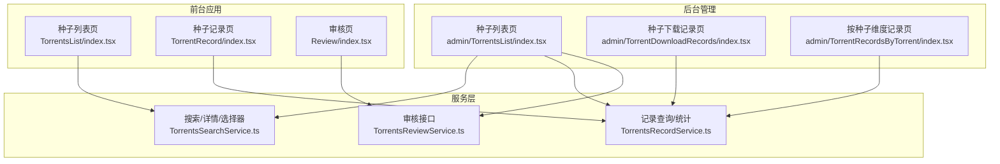
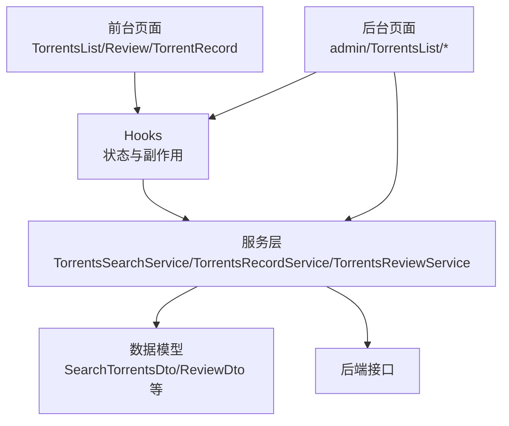
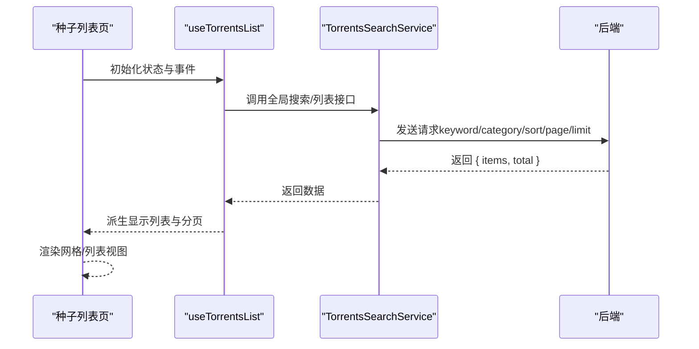
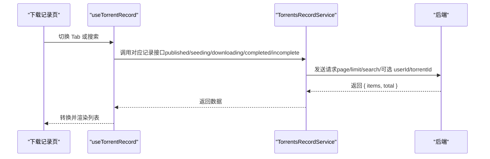
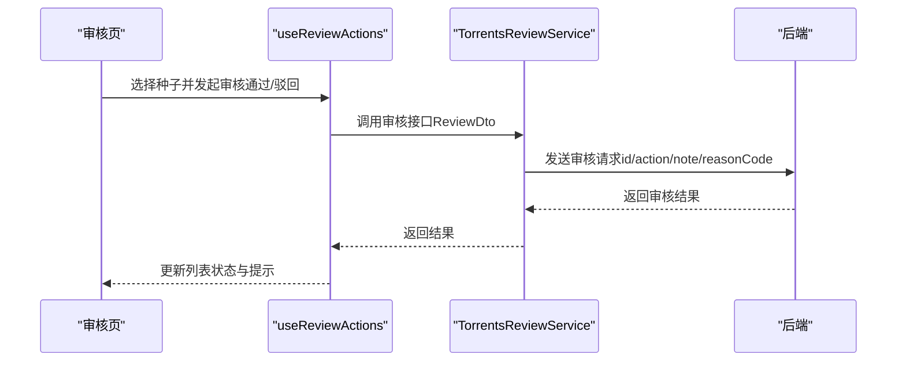
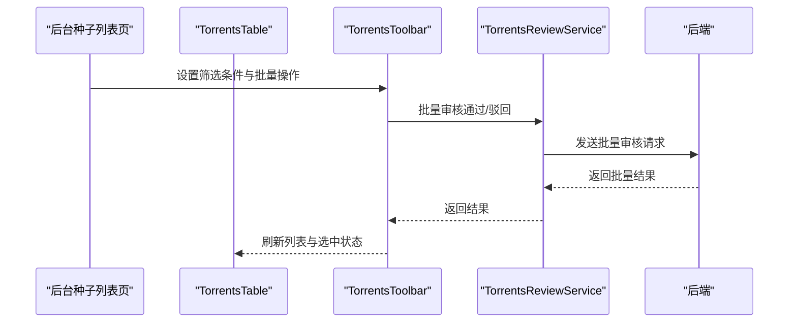
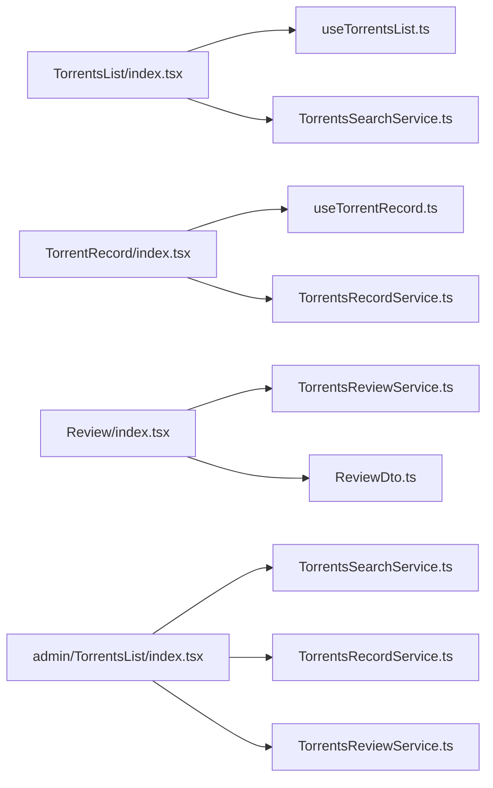

# 种子文件管理

<cite>
**本文引用的文件**
- [src/api/services/TorrentsSearchService.ts](file://src/api/services/TorrentsSearchService.ts)
- [src/api/services/TorrentsRecordService.ts](file://src/api/services/TorrentsRecordService.ts)
- [src/api/services/TorrentsReviewService.ts](file://src/api/services/TorrentsReviewService.ts)
- [src/api/models/SearchTorrentsDto.ts](file://src/api/models/SearchTorrentsDto.ts)
- [src/api/models/ListTorrentsDto.ts](file://src/api/models/ListTorrentsDto.ts)
- [src/api/models/PendingReviewsDto.ts](file://src/api/models/PendingReviewsDto.ts)
- [src/api/models/ReviewDto.ts](file://src/api/models/ReviewDto.ts)
- [src/api/models/ApprovedTorrentItemDto.ts](file://src/api/models/ApprovedTorrentItemDto.ts)
- [src/api/models/RejectedTorrentItemDto.ts](file://src/api/models/RejectedTorrentItemDto.ts)
- [src/api/models/TorrentCreatorDto.ts](file://src/api/models/TorrentCreatorDto.ts)
- [src/api/models/RecordDownloadDto.ts](file://src/api/models/RecordDownloadDto.ts)
- [src/modules/app/pages/TorrentsList/index.tsx](file://src/modules/app/pages/TorrentsList/index.tsx)
- [src/modules/app/pages/TorrentsList/hooks/useTorrentsList.ts](file://src/modules/app/pages/TorrentsList/hooks/useTorrentsList.ts)
- [src/modules/app/pages/TorrentsList/components/TorrentCard.tsx](file://src/modules/app/pages/TorrentsList/components/TorrentCard.tsx)
- [src/modules/app/pages/TorrentRecord/index.tsx](file://src/modules/app/pages/TorrentRecord/index.tsx)
- [src/modules/app/pages/TorrentRecord/hooks/useTorrentRecord.ts](file://src/modules/app/pages/TorrentRecord/hooks/useTorrentRecord.ts)
- [src/modules/app/pages/TorrentRecord/components/TorrentRecordFilters.tsx](file://src/modules/app/pages/TorrentRecord/components/TorrentRecordFilters.tsx)
- [src/modules/app/pages/Review/index.tsx](file://src/modules/app/pages/Review/index.tsx)
- [src/modules/app/pages/Review/hooks/useReviewData.ts](file://src/modules/app/pages/Review/hooks/useReviewData.ts)
- [src/modules/app/pages/Review/hooks/useReviewActions.ts](file://src/modules/app/pages/Review/hooks/useReviewActions.ts)
- [src/modules/app/pages/Review/hooks/useReviewHistory.ts](file://src/modules/app/pages/Review/hooks/useReviewHistory.ts)
- [src/modules/app/pages/Review/hooks/useReviewItemDetail.ts](file://src/modules/app/pages/Review/hooks/useReviewItemDetail.ts)
- [src/modules/admin/pages/content/torrents/TorrentsList/index.tsx](file://src/modules/admin/pages/content/torrents/TorrentsList/index.tsx)
- [src/modules/admin/pages/content/torrents/TorrentsList/hooks/useTorrentsLogic.ts](file://src/modules/admin/pages/content/torrents/TorrentsList/hooks/useTorrentsLogic.ts)
- [src/modules/admin/pages/content/torrents/TorrentsList/components/TorrentsToolbar.tsx](file://src/modules/admin/pages/content/torrents/TorrentsList/components/TorrentsToolbar.tsx)
- [src/modules/admin/pages/content/torrents/TorrentsList/components/TorrentsTable.tsx](file://src/modules/admin/pages/content/torrents/TorrentsList/components/TorrentsTable.tsx)
- [src/modules/admin/pages/content/torrents/TorrentDownloadRecords/index.tsx](file://src/modules/admin/pages/content/torrents/TorrentDownloadRecords/index.tsx)
- [src/modules/admin/pages/content/torrents/TorrentDownloadRecords/hooks/useDownloadRecordsLogic.ts](file://src/modules/admin/pages/content/torrents/TorrentDownloadRecords/hooks/useDownloadRecordsLogic.ts)
- [src/modules/admin/pages/content/torrents/TorrentRecordsByTorrent/index.tsx](file://src/modules/admin/pages/content/torrents/TorrentRecordsByTorrent/index.tsx)
- [src/modules/admin/pages/content/torrents/TorrentRecordsByTorrent/hooks/useTorrentRecordsLogic.ts](file://src/modules/admin/pages/content/torrents/TorrentRecordsByTorrent/hooks/useTorrentRecordsLogic.ts)
</cite>

## 目录
1. [简介](#简介)
2. [项目结构](#项目结构)
3. [核心组件](#核心组件)
4. [架构总览](#架构总览)
5. [详细组件分析](#详细组件分析)
6. [依赖关系分析](#依赖关系分析)
7. [性能考量](#性能考量)
8. [故障排查指南](#故障排查指南)
9. [结论](#结论)
10. [附录](#附录)

## 简介
本文件系统化梳理种子文件管理功能，覆盖种子列表展示、搜索过滤、状态监控、下载记录追踪、审核流程、状态变更机制与权限控制，并提供批量操作、记录查询与性能优化策略及最佳实践。

## 项目结构
种子管理功能由“前端页面 + Hooks + 服务层（API 封装）+ 数据模型”构成，分为两类入口：
- 应用前台：面向普通用户的种子浏览、搜索、下载与个人下载记录查看。
- 管理后台：面向管理员的种子列表、高级搜索、批量审核、下载记录统计与明细查询。

图表来源
- [src/modules/app/pages/TorrentsList/index.tsx](file://src/modules/app/pages/TorrentsList/index.tsx#L1-L167)
- [src/modules/app/pages/TorrentRecord/index.tsx](file://src/modules/app/pages/TorrentRecord/index.tsx)
- [src/modules/app/pages/Review/index.tsx](file://src/modules/app/pages/Review/index.tsx#L1-L79)
- [src/modules/admin/pages/content/torrents/TorrentsList/index.tsx](file://src/modules/admin/pages/content/torrents/TorrentsList/index.tsx#L1-L166)
- [src/modules/admin/pages/content/torrents/TorrentDownloadRecords/index.tsx](file://src/modules/admin/pages/content/torrents/TorrentDownloadRecords/index.tsx)
- [src/modules/admin/pages/content/torrents/TorrentRecordsByTorrent/index.tsx](file://src/modules/admin/pages/content/torrents/TorrentRecordsByTorrent/index.tsx)
- [src/api/services/TorrentsSearchService.ts](file://src/api/services/TorrentsSearchService.ts#L1-L163)
- [src/api/services/TorrentsRecordService.ts](file://src/api/services/TorrentsRecordService.ts#L1-L428)
- [src/api/services/TorrentsReviewService.ts](file://src/api/services/TorrentsReviewService.ts#L1-L164)

章节来源
- [src/modules/app/pages/TorrentsList/index.tsx](file://src/modules/app/pages/TorrentsList/index.tsx#L1-L167)
- [src/modules/app/pages/TorrentRecord/index.tsx](file://src/modules/app/pages/TorrentRecord/index.tsx)
- [src/modules/app/pages/Review/index.tsx](file://src/modules/app/pages/Review/index.tsx#L1-L79)
- [src/modules/admin/pages/content/torrents/TorrentsList/index.tsx](file://src/modules/admin/pages/content/torrents/TorrentsList/index.tsx#L1-L166)
- [src/modules/admin/pages/content/torrents/TorrentDownloadRecords/index.tsx](file://src/modules/admin/pages/content/torrents/TorrentDownloadRecords/index.tsx)
- [src/modules/admin/pages/content/torrents/TorrentRecordsByTorrent/index.tsx](file://src/modules/admin/pages/content/torrents/TorrentRecordsByTorrent/index.tsx)
- [src/api/services/TorrentsSearchService.ts](file://src/api/services/TorrentsSearchService.ts#L1-L163)
- [src/api/services/TorrentsRecordService.ts](file://src/api/services/TorrentsRecordService.ts#L1-L428)
- [src/api/services/TorrentsReviewService.ts](file://src/api/services/TorrentsReviewService.ts#L1-L164)

## 核心组件
- 前台种子列表与搜索
  - 页面容器：种子列表页负责组织工具栏、网格/列表视图、分页与下载交互。
  - Hook：useTorrentsList 负责分类、排序、搜索、分页状态与派生数据。
  - 服务：TorrentsSearchService 提供全局搜索、列表、详情、热门轮播与种子选择器接口。
- 前台下载记录与状态监控
  - 页面容器：TorrentRecord 负责按状态（发布中/做种中/下载中/已完成/未完成）聚合查询。
  - Hook：useTorrentRecord 负责根据 Tab 切换调用不同记录接口并转换数据。
  - 服务：TorrentsRecordService 提供用户/种子维度的记录查询与统计。
- 审核与状态变更
  - 页面容器：Review 负责待审核种子的列表、筛选、详情抽屉、操作弹窗与历史查看。
  - 服务：TorrentsReviewService 提供待审核、已通过、已驳回列表查询。
  - 模型：ReviewDto 定义审核动作（通过/驳回）、备注与拒绝原因码。
- 后台种子管理
  - 页面容器：admin/TorrentsList 负责高级搜索、批量审核、行选择、排序分页与 CRUD。
  - 组件：TorrentsTable 提供列定义、排序映射、标签渲染与删除确认。
  - 服务：TorrentsSearchService/TorrentsRecordService/TorrentsReviewService 被复用。

章节来源
- [src/modules/app/pages/TorrentsList/index.tsx](file://src/modules/app/pages/TorrentsList/index.tsx#L1-L167)
- [src/modules/app/pages/TorrentsList/hooks/useTorrentsList.ts](file://src/modules/app/pages/TorrentsList/hooks/useTorrentsList.ts#L1-L27)
- [src/api/services/TorrentsSearchService.ts](file://src/api/services/TorrentsSearchService.ts#L1-L163)
- [src/modules/app/pages/TorrentRecord/index.tsx](file://src/modules/app/pages/TorrentRecord/index.tsx)
- [src/modules/app/pages/TorrentRecord/hooks/useTorrentRecord.ts](file://src/modules/app/pages/TorrentRecord/hooks/useTorrentRecord.ts#L38-L82)
- [src/api/services/TorrentsRecordService.ts](file://src/api/services/TorrentsRecordService.ts#L1-L428)
- [src/modules/app/pages/Review/index.tsx](file://src/modules/app/pages/Review/index.tsx#L1-L79)
- [src/api/services/TorrentsReviewService.ts](file://src/api/services/TorrentsReviewService.ts#L1-L164)
- [src/api/models/ReviewDto.ts](file://src/api/models/ReviewDto.ts#L1-L27)
- [src/modules/admin/pages/content/torrents/TorrentsList/index.tsx](file://src/modules/admin/pages/content/torrents/TorrentsList/index.tsx#L1-L166)
- [src/modules/admin/pages/content/torrents/TorrentsList/components/TorrentsTable.tsx](file://src/modules/admin/pages/content/torrents/TorrentsList/components/TorrentsTable.tsx#L1-L268)

## 架构总览
种子管理采用“页面容器 + Hooks + 服务层 + 数据模型”的分层设计，前后台共享同一套服务层接口，确保一致性与可维护性。

图表来源
- [src/modules/app/pages/TorrentsList/index.tsx](file://src/modules/app/pages/TorrentsList/index.tsx#L1-L167)
- [src/modules/app/pages/Review/index.tsx](file://src/modules/app/pages/Review/index.tsx#L1-L79)
- [src/modules/app/pages/TorrentRecord/index.tsx](file://src/modules/app/pages/TorrentRecord/index.tsx)
- [src/modules/admin/pages/content/torrents/TorrentsList/index.tsx](file://src/modules/admin/pages/content/torrents/TorrentsList/index.tsx#L1-L166)
- [src/api/services/TorrentsSearchService.ts](file://src/api/services/TorrentsSearchService.ts#L1-L163)
- [src/api/services/TorrentsRecordService.ts](file://src/api/services/TorrentsRecordService.ts#L1-L428)
- [src/api/services/TorrentsReviewService.ts](file://src/api/services/TorrentsReviewService.ts#L1-L164)
- [src/api/models/SearchTorrentsDto.ts](file://src/api/models/SearchTorrentsDto.ts#L1-L32)
- [src/api/models/ReviewDto.ts](file://src/api/models/ReviewDto.ts#L1-L27)

## 详细组件分析

### 种子数据模型与业务规则
- 列表项模型
  - 已通过：ApprovedTorrentItemDto，包含种子标识、标题、封面、上传者信息、审批时间等。
  - 已驳回：RejectedTorrentItemDto，包含种子标识、标题、封面、上传者信息、创建时间等。
  - 上传者信息：TorrentCreatorDto，包含用户ID、用户名、头像URL。
- 审核模型
  - ReviewDto：定义审核动作（通过/驳回）、备注与拒绝原因码。
  - 待审核查询：PendingReviewsDto，支持按上传者筛选、分页。
- 搜索与选择
  - SearchTorrentsDto：关键词、分类、排序字段与方向、分页。
  - ListTorrentsDto：用于媒体绑定场景，支持目标媒体类型与排除已绑定种子。
- 记录模型
  - RecordDownloadDto：下载记录查询参数（种子ID）。
- 业务规则
  - 审核状态：待审核、已通过、已驳回。
  - 绑定约束：种子与媒体（电影/剧集/分集/歌单）绑定时需排除已绑定种子。
  - 排序与分页：统一使用 page/limit，支持多字段排序映射。

章节来源
- [src/api/models/ApprovedTorrentItemDto.ts](file://src/api/models/ApprovedTorrentItemDto.ts#L1-L45)
- [src/api/models/RejectedTorrentItemDto.ts](file://src/api/models/RejectedTorrentItemDto.ts#L1-L45)
- [src/api/models/TorrentCreatorDto.ts](file://src/api/models/TorrentCreatorDto.ts#L1-L20)
- [src/api/models/ReviewDto.ts](file://src/api/models/ReviewDto.ts#L1-L27)
- [src/api/models/PendingReviewsDto.ts](file://src/api/models/PendingReviewsDto.ts#L1-L20)
- [src/api/models/SearchTorrentsDto.ts](file://src/api/models/SearchTorrentsDto.ts#L1-L32)
- [src/api/models/ListTorrentsDto.ts](file://src/api/models/ListTorrentsDto.ts#L1-L36)
- [src/api/models/RecordDownloadDto.ts](file://src/api/models/RecordDownloadDto.ts#L1-L11)

### 前台种子列表与搜索
- 页面职责
  - 组织工具栏（分类、排序、搜索、视图切换）、网格/列表视图、分页与下载交互。
- Hook 职责
  - 管理分类、排序、搜索、分页状态，派生显示列表与总页数。
- 服务调用
  - 使用 TorrentsSearchService 的全局搜索与列表接口，支持关键词、分类、排序与分页。
- UI 组件
  - TorrentCard 渲染做种/下载人数等关键指标，便于快速判断种子健康度。

图表来源
- [src/modules/app/pages/TorrentsList/index.tsx](file://src/modules/app/pages/TorrentsList/index.tsx#L1-L167)
- [src/modules/app/pages/TorrentsList/hooks/useTorrentsList.ts](file://src/modules/app/pages/TorrentsList/hooks/useTorrentsList.ts#L1-L27)
- [src/api/services/TorrentsSearchService.ts](file://src/api/services/TorrentsSearchService.ts#L47-L73)

章节来源
- [src/modules/app/pages/TorrentsList/index.tsx](file://src/modules/app/pages/TorrentsList/index.tsx#L1-L167)
- [src/modules/app/pages/TorrentsList/hooks/useTorrentsList.ts](file://src/modules/app/pages/TorrentsList/hooks/useTorrentsList.ts#L1-L27)
- [src/modules/app/pages/TorrentsList/components/TorrentCard.tsx](file://src/modules/app/pages/TorrentsList/components/TorrentCard.tsx#L210-L228)
- [src/api/services/TorrentsSearchService.ts](file://src/api/services/TorrentsSearchService.ts#L47-L73)

### 前台下载记录与状态监控
- 页面职责
  - 按状态（发布中/做种中/下载中/已完成/未完成）聚合查询，支持搜索。
- Hook 职责
  - 根据 Tab 切换调用对应记录接口，统一转换数据格式。
- 服务调用
  - 使用 TorrentsRecordService 的用户/种子维度记录查询接口，返回包含下载/做种/下载中人数等指标。
- 过滤器
  - TorrentRecordFilters 提供搜索输入与筛选按钮，提升查询效率。

图表来源
- [src/modules/app/pages/TorrentRecord/index.tsx](file://src/modules/app/pages/TorrentRecord/index.tsx)
- [src/modules/app/pages/TorrentRecord/hooks/useTorrentRecord.ts](file://src/modules/app/pages/TorrentRecord/hooks/useTorrentRecord.ts#L38-L82)
- [src/api/services/TorrentsRecordService.ts](file://src/api/services/TorrentsRecordService.ts#L20-L141)

章节来源
- [src/modules/app/pages/TorrentRecord/index.tsx](file://src/modules/app/pages/TorrentRecord/index.tsx)
- [src/modules/app/pages/TorrentRecord/hooks/useTorrentRecord.ts](file://src/modules/app/pages/TorrentRecord/hooks/useTorrentRecord.ts#L38-L82)
- [src/modules/app/pages/TorrentRecord/components/TorrentRecordFilters.tsx](file://src/modules/app/pages/TorrentRecord/components/TorrentRecordFilters.tsx#L1-L27)
- [src/api/services/TorrentsRecordService.ts](file://src/api/services/TorrentsRecordService.ts#L20-L141)

### 审核流程与状态变更
- 页面职责
  - 展示待审核种子列表，支持类型/状态/时间范围筛选，查看详情、批量操作与历史记录。
- 服务调用
  - 使用 TorrentsReviewService 的待审核、已通过、已驳回列表查询接口。
- 审核动作
  - ReviewDto 定义通过/驳回动作与备注、拒绝原因码，配合后端完成状态变更。

图表来源
- [src/modules/app/pages/Review/index.tsx](file://src/modules/app/pages/Review/index.tsx#L1-L79)
- [src/api/services/TorrentsReviewService.ts](file://src/api/services/TorrentsReviewService.ts#L18-L163)
- [src/api/models/ReviewDto.ts](file://src/api/models/ReviewDto.ts#L1-L27)

章节来源
- [src/modules/app/pages/Review/index.tsx](file://src/modules/app/pages/Review/index.tsx#L1-L79)
- [src/modules/app/pages/Review/hooks/useReviewData.ts](file://src/modules/app/pages/Review/hooks/useReviewData.ts)
- [src/modules/app/pages/Review/hooks/useReviewActions.ts](file://src/modules/app/pages/Review/hooks/useReviewActions.ts)
- [src/modules/app/pages/Review/hooks/useReviewHistory.ts](file://src/modules/app/pages/Review/hooks/useReviewHistory.ts)
- [src/modules/app/pages/Review/hooks/useReviewItemDetail.ts](file://src/modules/app/pages/Review/hooks/useReviewItemDetail.ts#L102-L140)
- [src/api/services/TorrentsReviewService.ts](file://src/api/services/TorrentsReviewService.ts#L18-L163)
- [src/api/models/ReviewDto.ts](file://src/api/models/ReviewDto.ts#L1-L27)

### 后台种子管理与批量操作
- 页面职责
  - 高级搜索、批量审核（全部通过/全部驳回）、行选择、排序分页与 CRUD。
- 组件职责
  - TorrentsTable：列定义、排序映射、标签渲染（审核状态/可见性）、删除确认。
  - TorrentsToolbar：分类筛选、审核状态筛选、高级搜索与批量审核按钮。
- 服务调用
  - 复用 TorrentsSearchService/TorrentsRecordService/TorrentsReviewService，保证前后台一致性。

图表来源
- [src/modules/admin/pages/content/torrents/TorrentsList/index.tsx](file://src/modules/admin/pages/content/torrents/TorrentsList/index.tsx#L1-L166)
- [src/modules/admin/pages/content/torrents/TorrentsList/components/TorrentsToolbar.tsx](file://src/modules/admin/pages/content/torrents/TorrentsList/components/TorrentsToolbar.tsx#L83-L128)
- [src/modules/admin/pages/content/torrents/TorrentsList/components/TorrentsTable.tsx](file://src/modules/admin/pages/content/torrents/TorrentsList/components/TorrentsTable.tsx#L1-L268)
- [src/api/services/TorrentsReviewService.ts](file://src/api/services/TorrentsReviewService.ts#L18-L163)

章节来源
- [src/modules/admin/pages/content/torrents/TorrentsList/index.tsx](file://src/modules/admin/pages/content/torrents/TorrentsList/index.tsx#L1-L166)
- [src/modules/admin/pages/content/torrents/TorrentsList/components/TorrentsToolbar.tsx](file://src/modules/admin/pages/content/torrents/TorrentsList/components/TorrentsToolbar.tsx#L83-L128)
- [src/modules/admin/pages/content/torrents/TorrentsList/components/TorrentsTable.tsx](file://src/modules/admin/pages/content/torrents/TorrentsList/components/TorrentsTable.tsx#L1-L268)
- [src/api/services/TorrentsReviewService.ts](file://src/api/services/TorrentsReviewService.ts#L18-L163)

### 记录查询与统计
- 用户维度
  - 支持按用户查询“发布中/做种中/下载中/已完成/未完成”记录，支持 userId/torrentId 条件。
- 种子维度
  - 支持按种子 ID 查询“发布中/做种中/下载中/已完成/未完成”记录，返回下载/做种/下载中人数等指标。
- 统计
  - 提供统计接口，返回各类种子数量概览。

章节来源
- [src/api/services/TorrentsRecordService.ts](file://src/api/services/TorrentsRecordService.ts#L180-L202)
- [src/modules/admin/pages/content/torrents/TorrentDownloadRecords/hooks/useDownloadRecordsLogic.ts](file://src/modules/admin/pages/content/torrents/TorrentDownloadRecords/hooks/useDownloadRecordsLogic.ts#L1-L34)
- [src/modules/admin/pages/content/torrents/TorrentRecordsByTorrent/hooks/useTorrentRecordsLogic.ts](file://src/modules/admin/pages/content/torrents/TorrentRecordsByTorrent/hooks/useTorrentRecordsLogic.ts#L1-L38)

## 依赖关系分析
- 组件耦合
  - 页面容器仅负责组合子组件与 Hook，降低视图与业务逻辑耦合。
  - Hook 仅处理状态与副作用，不包含渲染逻辑，提高可测试性与复用性。
- 服务层依赖
  - 前后台均依赖同一套服务层接口，减少重复实现与不一致风险。
- 数据模型依赖
  - 审核、搜索、记录等模型在前后台共享，确保数据契约一致。

图表来源
- [src/modules/app/pages/TorrentsList/index.tsx](file://src/modules/app/pages/TorrentsList/index.tsx#L1-L167)
- [src/modules/app/pages/TorrentsList/hooks/useTorrentsList.ts](file://src/modules/app/pages/TorrentsList/hooks/useTorrentsList.ts#L1-L27)
- [src/modules/app/pages/TorrentRecord/index.tsx](file://src/modules/app/pages/TorrentRecord/index.tsx)
- [src/modules/app/pages/TorrentRecord/hooks/useTorrentRecord.ts](file://src/modules/app/pages/TorrentRecord/hooks/useTorrentRecord.ts#L38-L82)
- [src/modules/app/pages/Review/index.tsx](file://src/modules/app/pages/Review/index.tsx#L1-L79)
- [src/modules/admin/pages/content/torrents/TorrentsList/index.tsx](file://src/modules/admin/pages/content/torrents/TorrentsList/index.tsx#L1-L166)
- [src/api/services/TorrentsSearchService.ts](file://src/api/services/TorrentsSearchService.ts#L1-L163)
- [src/api/services/TorrentsRecordService.ts](file://src/api/services/TorrentsRecordService.ts#L1-L428)
- [src/api/services/TorrentsReviewService.ts](file://src/api/services/TorrentsReviewService.ts#L1-L164)
- [src/api/models/ReviewDto.ts](file://src/api/models/ReviewDto.ts#L1-L27)

## 性能考量
- 请求去抖与防抖
  - 搜索建议在 Hook 中对输入进行节流/防抖，避免频繁请求。
- 分页与批量
  - 固定每页数量，结合服务端分页，避免一次性拉取过多数据。
- 缓存与重用
  - 对常用筛选条件（分类、排序）进行缓存，减少重复计算。
- 图片与骨架屏
  - 列表加载时使用骨架屏，图片懒加载，降低首屏压力。
- 排序映射
  - 前端列排序与后端排序字段映射，避免无效请求与重复渲染。

## 故障排查指南
- 审核接口错误码
  - 参数错误、未认证、禁止访问/账号禁用、资源不存在、服务器错误。
- 记录查询异常
  - 检查 userId/torrentId 是否为空或非法；确认 Tab 与接口匹配。
- 列表空白或数据不更新
  - 确认分页参数与排序映射正确；检查 Hook 中是否正确设置 committedSearch 与 currentPage。
- 审核批量操作失败
  - 确认所选种子状态与权限；检查 ReviewDto 字段完整性（动作、备注、原因码）。

章节来源
- [src/api/services/TorrentsReviewService.ts](file://src/api/services/TorrentsReviewService.ts#L25-L163)
- [src/api/services/TorrentsRecordService.ts](file://src/api/services/TorrentsRecordService.ts#L180-L202)
- [src/modules/app/pages/TorrentsList/hooks/useTorrentsList.ts](file://src/modules/app/pages/TorrentsList/hooks/useTorrentsList.ts#L1-L27)

## 结论
种子文件管理功能通过清晰的分层设计与统一的服务层接口，实现了从前台浏览、搜索、下载记录到后台审核、批量操作与统计查询的完整闭环。建议在后续迭代中持续完善权限校验、日志审计与性能监控，以进一步提升稳定性与可观测性。

## 附录
- 最佳实践
  - 审核：优先使用批量操作与历史记录核对，确保可追溯。
  - 搜索：结合分类与关键词，利用高级搜索缩小范围。
  - 记录：定期导出统计报表，关注做种率与下载完成率。
- 常见问题
  - 审核状态不更新：检查后端状态机与通知机制。
  - 记录缺失：确认 Redis/数据库同步任务运行正常。
  - 列表卡顿：启用骨架屏与虚拟滚动，优化图片加载。