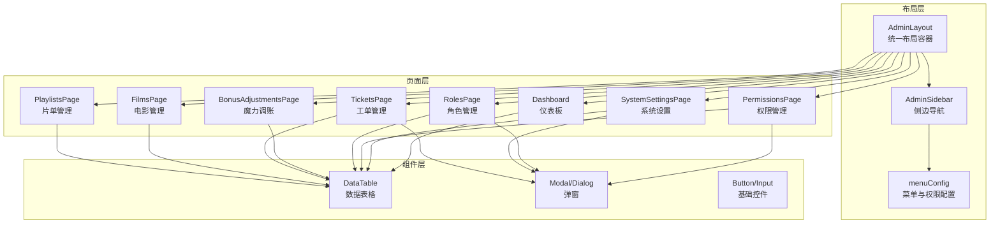
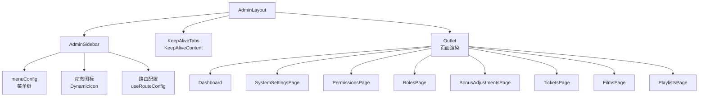
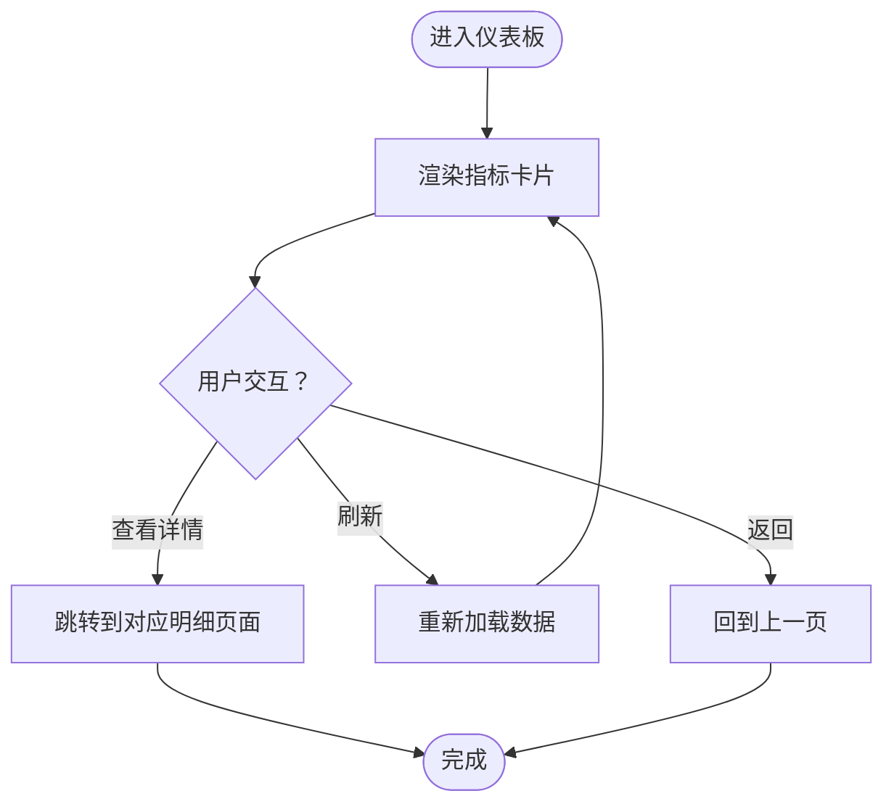
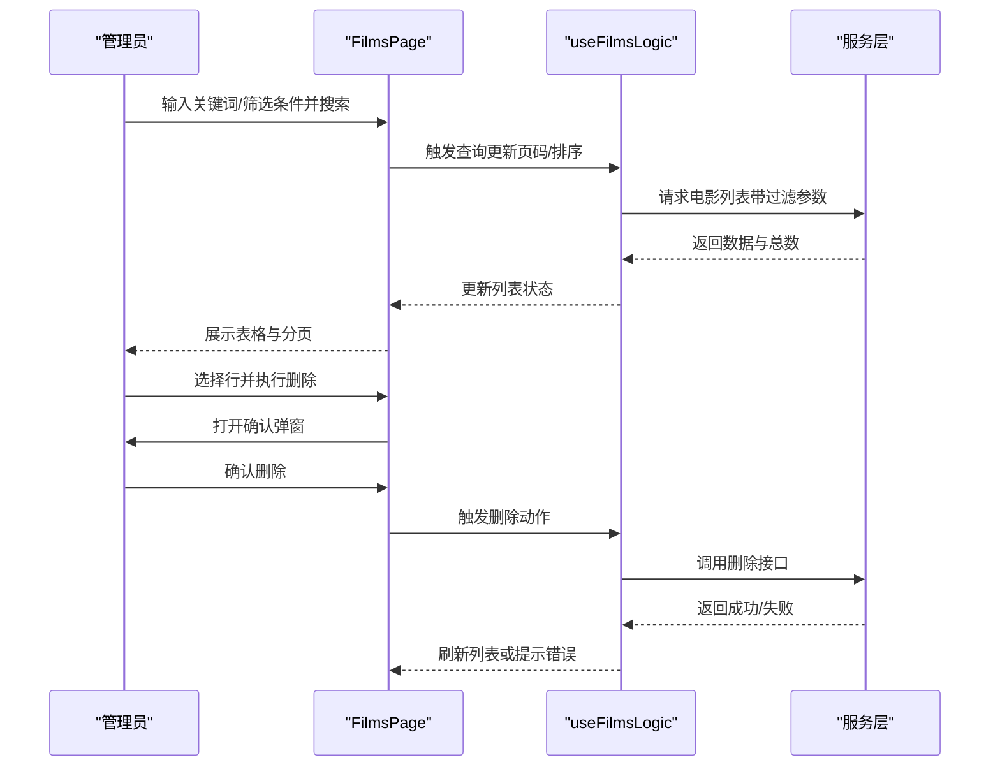
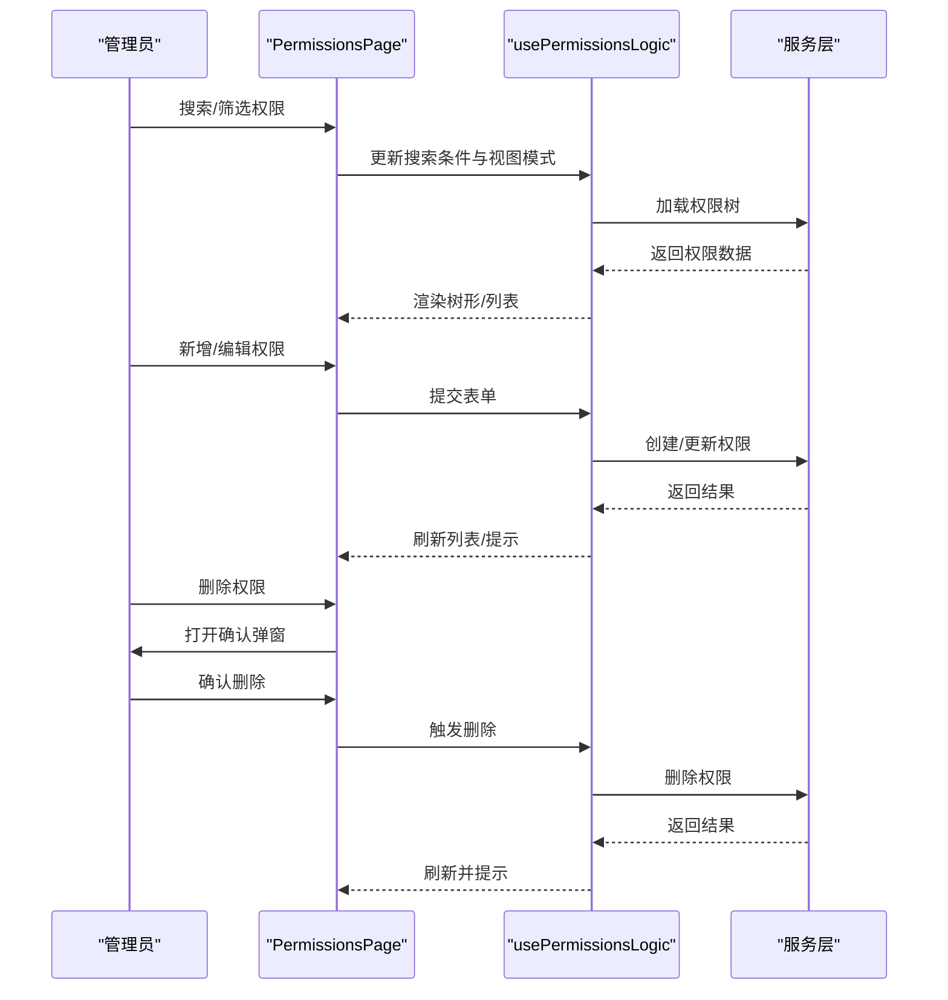
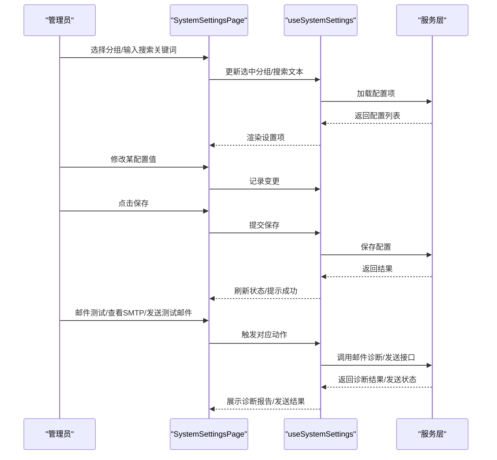
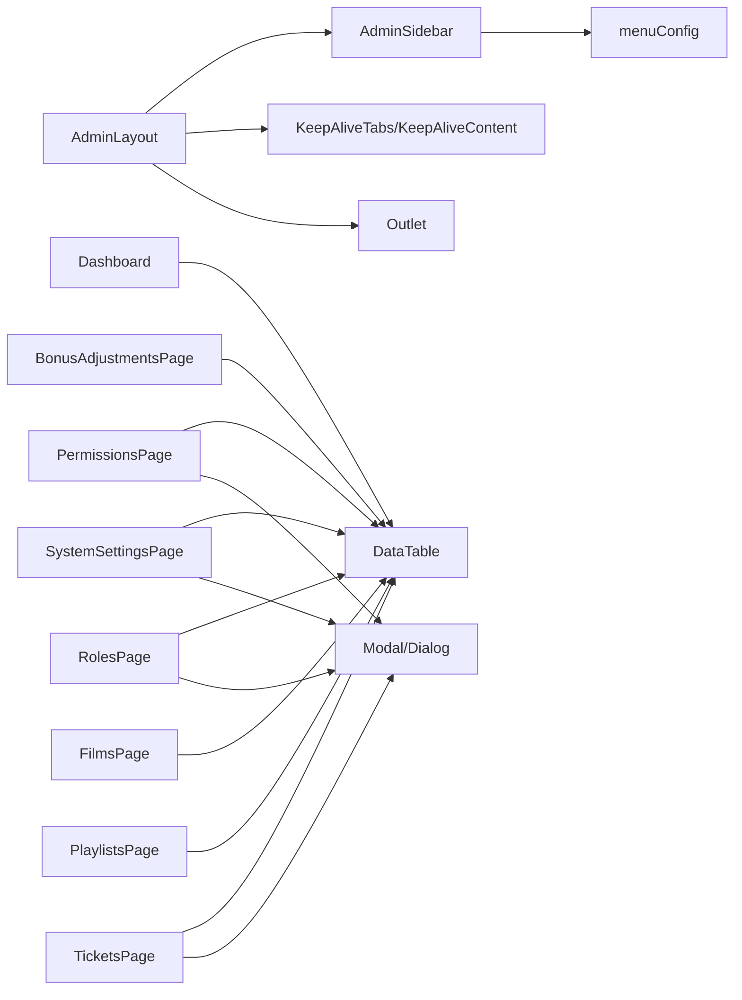

# 后台管理系统模块

<cite>
**本文引用的文件**
- [src/modules/admin/index.ts](file://src/modules/admin/index.ts)
- [src/modules/admin/layouts/AdminLayout.tsx](file://src/modules/admin/layouts/AdminLayout.tsx)
- [src/modules/admin/layouts/AdminSidebar.tsx](file://src/modules/admin/layouts/AdminSidebar.tsx)
- [src/modules/admin/layouts/constants/menuConfig.tsx](file://src/modules/admin/layouts/constants/menuConfig.tsx)
- [src/modules/admin/pages/Dashboard.tsx](file://src/modules/admin/pages/Dashboard.tsx)
- [src/modules/admin/pages/users-security/PermissionsPage/index.tsx](file://src/modules/admin/pages/users-security/PermissionsPage/index.tsx)
- [src/modules/admin/pages/users-security/RolesPage/index.tsx](file://src/modules/admin/pages/users-security/RolesPage/index.tsx)
- [src/modules/admin/pages/system/SystemSettingsPage/index.tsx](file://src/modules/admin/pages/system/SystemSettingsPage/index.tsx)
- [src/modules/admin/pages/economy/bonus/BonusAdjustmentsPage/index.tsx](file://src/modules/admin/pages/economy/bonus/BonusAdjustmentsPage/index.tsx)
- [src/modules/admin/pages/operations/interaction/TicketsPage/index.tsx](file://src/modules/admin/pages/operations/interaction/TicketsPage/index.tsx)
- [src/modules/admin/pages/content/media/FilmsPage/index.tsx](file://src/modules/admin/pages/content/media/FilmsPage/index.tsx)
- [src/modules/admin/pages/content/media/PlaylistsPage/index.tsx](file://src/modules/admin/pages/content/media/PlaylistsPage/index.tsx)
</cite>

## 目录
1. [简介](#简介)
2. [项目结构](#项目结构)
3. [核心组件](#核心组件)
4. [架构总览](#架构总览)
5. [详细组件分析](#详细组件分析)
6. [依赖关系分析](#依赖关系分析)
7. [性能考虑](#性能考虑)
8. [故障排查指南](#故障排查指南)
9. [结论](#结论)
10. [附录](#附录)

## 简介
本文件面向后台管理系统模块，系统性梳理管理员功能界面的设计与实现，覆盖仪表板、内容审核管理、用户权限管理、系统配置管理等核心模块。文档从布局结构、导航体系、权限控制机制入手，深入讲解各功能模块的业务逻辑、数据流与用户交互设计，并提供操作指南、权限配置方法与系统维护最佳实践，帮助开发者与运维人员快速理解与高效使用后台管理功能。

## 项目结构
后台管理模块采用按功能域划分的目录组织方式，核心包括：
- 布局层：统一的后台布局与侧边导航，支持标签页与 KeepAlive 缓存
- 页面层：按业务域拆分的页面组件，如仪表板、系统设置、权限与角色管理、内容管理、经济与魔力、工单管理等
- 组件层：可复用的 UI 组件与工具函数，如数据表格、模态框、搜索输入等
- 布局常量：菜单配置与图标映射，支撑动态菜单生成与权限校验

图表来源
- [src/modules/admin/layouts/AdminLayout.tsx](file://src/modules/admin/layouts/AdminLayout.tsx#L20-L94)
- [src/modules/admin/layouts/AdminSidebar.tsx](file://src/modules/admin/layouts/AdminSidebar.tsx#L169-L289)
- [src/modules/admin/layouts/constants/menuConfig.tsx](file://src/modules/admin/layouts/constants/menuConfig.tsx#L72-L418)
- [src/modules/admin/pages/Dashboard.tsx](file://src/modules/admin/pages/Dashboard.tsx#L1-L56)
- [src/modules/admin/pages/system/SystemSettingsPage/index.tsx](file://src/modules/admin/pages/system/SystemSettingsPage/index.tsx#L47-L292)
- [src/modules/admin/pages/users-security/PermissionsPage/index.tsx](file://src/modules/admin/pages/users-security/PermissionsPage/index.tsx#L12-L177)
- [src/modules/admin/pages/users-security/RolesPage/index.tsx](file://src/modules/admin/pages/users-security/RolesPage/index.tsx#L6-L99)
- [src/modules/admin/pages/economy/bonus/BonusAdjustmentsPage/index.tsx](file://src/modules/admin/pages/economy/bonus/BonusAdjustmentsPage/index.tsx#L12-L82)
- [src/modules/admin/pages/operations/interaction/TicketsPage/index.tsx](file://src/modules/admin/pages/operations/interaction/TicketsPage/index.tsx#L17-L145)
- [src/modules/admin/pages/content/media/FilmsPage/index.tsx](file://src/modules/admin/pages/content/media/FilmsPage/index.tsx#L20-L166)
- [src/modules/admin/pages/content/media/PlaylistsPage/index.tsx](file://src/modules/admin/pages/content/media/PlaylistsPage/index.tsx#L20-L185)

章节来源
- [src/modules/admin/index.ts](file://src/modules/admin/index.ts#L1-L12)
- [src/modules/admin/layouts/AdminLayout.tsx](file://src/modules/admin/layouts/AdminLayout.tsx#L20-L94)
- [src/modules/admin/layouts/AdminSidebar.tsx](file://src/modules/admin/layouts/AdminSidebar.tsx#L169-L289)
- [src/modules/admin/layouts/constants/menuConfig.tsx](file://src/modules/admin/layouts/constants/menuConfig.tsx#L72-L418)

## 核心组件
- 统一入口导出：集中导出后台布局与路由管理页面，便于模块化引入与懒加载配置
- AdminLayout：提供后台主容器，集成 KeepAlive 标签页、动态标题、动态 favicon、路由进度条与站点配置上下文
- AdminSidebar：基于路由配置动态生成菜单，支持多级嵌套、展开/收起、当前高亮与自动展开
- 菜单配置：以结构化数据定义菜单项、权限标识与图标映射，支持按路径与中文名匹配

章节来源
- [src/modules/admin/index.ts](file://src/modules/admin/index.ts#L6-L12)
- [src/modules/admin/layouts/AdminLayout.tsx](file://src/modules/admin/layouts/AdminLayout.tsx#L20-L94)
- [src/modules/admin/layouts/AdminSidebar.tsx](file://src/modules/admin/layouts/AdminSidebar.tsx#L169-L289)
- [src/modules/admin/layouts/constants/menuConfig.tsx](file://src/modules/admin/layouts/constants/menuConfig.tsx#L72-L418)

## 架构总览
后台管理采用“布局 + 页面 + 组件”的分层架构，页面通过自定义 Hook 管理状态与业务逻辑，UI 组件提供通用能力，菜单与权限通过配置驱动，实现高内聚低耦合。

图表来源
- [src/modules/admin/layouts/AdminLayout.tsx](file://src/modules/admin/layouts/AdminLayout.tsx#L20-L94)
- [src/modules/admin/layouts/AdminSidebar.tsx](file://src/modules/admin/layouts/AdminSidebar.tsx#L169-L289)
- [src/modules/admin/layouts/constants/menuConfig.tsx](file://src/modules/admin/layouts/constants/menuConfig.tsx#L72-L418)

## 详细组件分析

### 仪表板设计（Dashboard）
- 设计目标：提供关键运营指标概览，支持响应式卡片布局
- 数据与交互：卡片展示在线用户、今日访问、待处理任务等指标，采用语义化图标与数值组合
- 适配性：支持小屏到大屏的网格布局，保证信息密度与可读性

图表来源
- [src/modules/admin/pages/Dashboard.tsx](file://src/modules/admin/pages/Dashboard.tsx#L1-L56)

章节来源
- [src/modules/admin/pages/Dashboard.tsx](file://src/modules/admin/pages/Dashboard.tsx#L1-L56)

### 内容审核管理（电影与片单）
- 电影管理（FilmsPage）：支持关键词、分类、年份、Tag ID、排序等多维查询；提供只读列表与删除确认弹窗
- 片单管理（PlaylistsPage）：支持关键词、审核状态、类型、可见性、拥有者用户ID等筛选；提供搜索与分页

图表来源
- [src/modules/admin/pages/content/media/FilmsPage/index.tsx](file://src/modules/admin/pages/content/media/FilmsPage/index.tsx#L20-L166)

章节来源
- [src/modules/admin/pages/content/media/FilmsPage/index.tsx](file://src/modules/admin/pages/content/media/FilmsPage/index.tsx#L20-L166)
- [src/modules/admin/pages/content/media/PlaylistsPage/index.tsx](file://src/modules/admin/pages/content/media/PlaylistsPage/index.tsx#L20-L185)

### 用户权限管理（权限与角色）
- 权限管理（PermissionsPage）：支持树形/列表视图切换、关键词与类型筛选、新增/编辑/删除；提供删除二次确认
- 角色管理（RolesPage）：支持角色列表、分页、搜索；提供角色编辑与权限分配弹窗，支持后台与网页权限树选择

图表来源
- [src/modules/admin/pages/users-security/PermissionsPage/index.tsx](file://src/modules/admin/pages/users-security/PermissionsPage/index.tsx#L12-L177)

章节来源
- [src/modules/admin/pages/users-security/PermissionsPage/index.tsx](file://src/modules/admin/pages/users-security/PermissionsPage/index.tsx#L12-L177)
- [src/modules/admin/pages/users-security/RolesPage/index.tsx](file://src/modules/admin/pages/users-security/RolesPage/index.tsx#L6-L99)

### 系统配置管理（SystemSettingsPage）
- 功能职责：系统设置页面组装（侧边分组导航 + 设置项列表 + 各类弹窗），通过 Hook 管理状态与操作
- 交互要点：支持分组切换、搜索、批量保存/重置、邮件配置测试与诊断、新增/编辑配置项弹窗

图表来源
- [src/modules/admin/pages/system/SystemSettingsPage/index.tsx](file://src/modules/admin/pages/system/SystemSettingsPage/index.tsx#L47-L292)

章节来源
- [src/modules/admin/pages/system/SystemSettingsPage/index.tsx](file://src/modules/admin/pages/system/SystemSettingsPage/index.tsx#L47-L292)

### 经济与魔力管理（BonusAdjustmentsPage）
- 功能职责：提供人工调账能力，支持用户ID筛选、分页与审计记录展示
- 交互流程：表单提交调账请求，列表展示历史记录，支持分页切换与条件重置

章节来源
- [src/modules/admin/pages/economy/bonus/BonusAdjustmentsPage/index.tsx](file://src/modules/admin/pages/economy/bonus/BonusAdjustmentsPage/index.tsx#L12-L82)

### 工单管理（TicketsPage）
- 功能职责：工单列表展示与统计，支持状态/类别筛选、关键词搜索、新建工单、关闭确认
- 交互流程：列表展示与筛选，打开新建弹窗提交，确认关闭弹窗二次确认

章节来源
- [src/modules/admin/pages/operations/interaction/TicketsPage/index.tsx](file://src/modules/admin/pages/operations/interaction/TicketsPage/index.tsx#L17-L145)

## 依赖关系分析
- 布局与导航：AdminLayout 依赖 AdminSidebar 与 KeepAlive 标签页；AdminSidebar 依赖路由配置与菜单常量
- 页面与组件：各页面通过自定义 Hook 管理状态，依赖通用 UI 组件（DataTable、Modal、Dialog、Button、Input 等）
- 权限与菜单：菜单配置包含权限标识，用于控制菜单可见与路由访问

图表来源
- [src/modules/admin/layouts/AdminLayout.tsx](file://src/modules/admin/layouts/AdminLayout.tsx#L20-L94)
- [src/modules/admin/layouts/AdminSidebar.tsx](file://src/modules/admin/layouts/AdminSidebar.tsx#L169-L289)
- [src/modules/admin/layouts/constants/menuConfig.tsx](file://src/modules/admin/layouts/constants/menuConfig.tsx#L72-L418)

章节来源
- [src/modules/admin/layouts/AdminLayout.tsx](file://src/modules/admin/layouts/AdminLayout.tsx#L20-L94)
- [src/modules/admin/layouts/AdminSidebar.tsx](file://src/modules/admin/layouts/AdminSidebar.tsx#L169-L289)
- [src/modules/admin/layouts/constants/menuConfig.tsx](file://src/modules/admin/layouts/constants/menuConfig.tsx#L72-L418)

## 性能考虑
- KeepAlive 标签页：减少重复渲染，提升页面切换体验；建议合理设置缓存策略，避免内存占用过高
- 路由懒加载：结合路由配置与动态导入，按需加载页面组件，降低首屏体积
- 表格与分页：对大数据量场景，优先使用服务端分页与排序，前端仅做轻量筛选
- 图标与资源：统一使用动态图标组件，避免重复创建 React 元素，减少渲染开销

## 故障排查指南
- 仪表板无数据：检查数据接口可用性与网络状态，确认站点配置上下文是否正确注入
- 权限/角色页面空白：确认菜单配置中的权限标识与后端权限一致，检查路由配置是否正确加载
- 系统设置保存失败：检查必填字段与格式，关注邮件配置的连通性测试与诊断报告
- 工单/内容列表异常：核对筛选条件与分页参数，确认服务端返回的数据结构与前端期望一致
- 侧边导航不展开：检查菜单层级与路径拼接逻辑，确认当前路径与菜单项的匹配规则

## 结论
后台管理系统模块通过清晰的分层设计与配置驱动的菜单体系，实现了仪表板、内容审核、权限与角色、系统配置、经济与魔力、工单等核心功能的统一管理。页面采用 Hook 抽象业务逻辑，配合通用 UI 组件，既保证了开发效率也提升了可维护性。建议在实际部署中完善权限校验与日志审计，持续优化数据加载与缓存策略，确保后台系统的稳定性与用户体验。

## 附录
- 操作指南
  - 仪表板：用于查看关键指标概览，支持跳转到明细页面进行深入分析
  - 内容管理：通过多维筛选定位目标内容，谨慎执行删除等不可逆操作
  - 权限与角色：先维护权限树，再为角色分配相应权限，定期审计权限有效性
  - 系统设置：分组管理配置项，保存前先进行测试与验证，避免影响线上环境
  - 魔力调账：严格遵循调账流程，保留审计记录，防止误操作
  - 工单管理：及时处理待处理工单，规范关闭流程，确保问题闭环
- 权限配置方法
  - 在菜单配置中为每个菜单项设置权限标识，确保与后端权限策略一致
  - 通过角色管理为不同岗位分配最小必要权限，遵循权限分离原则
- 系统维护最佳实践
  - 定期清理无效数据与冗余配置，保持系统整洁
  - 对高频操作进行缓存优化，对大列表采用服务端分页
  - 建立完善的日志与监控体系，及时发现并处理异常