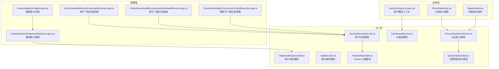
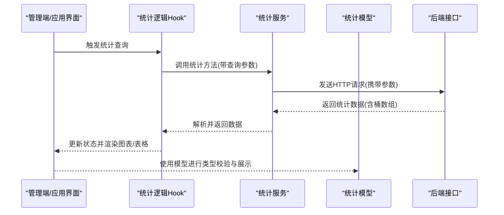
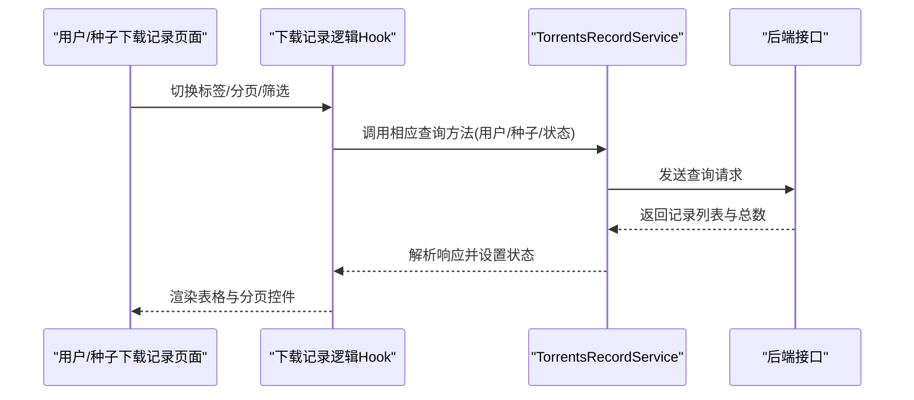
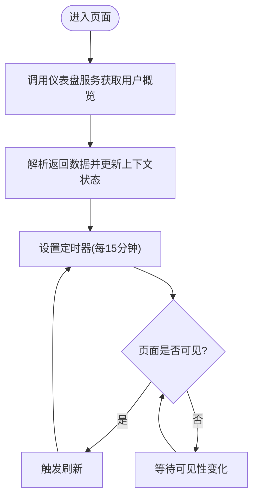
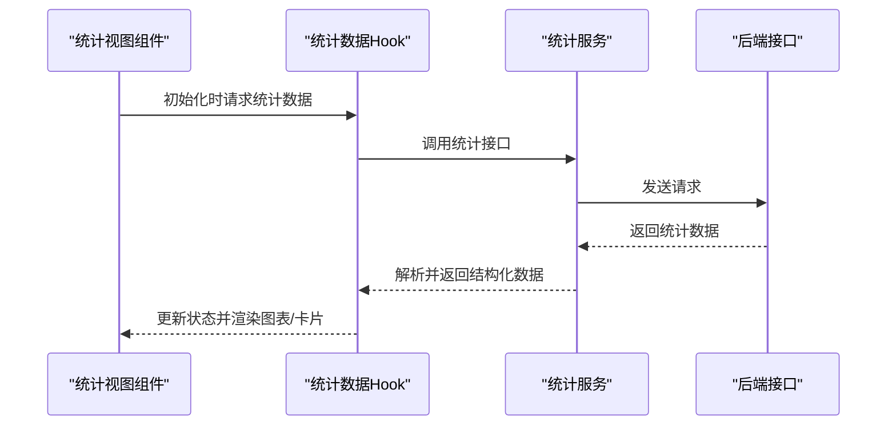
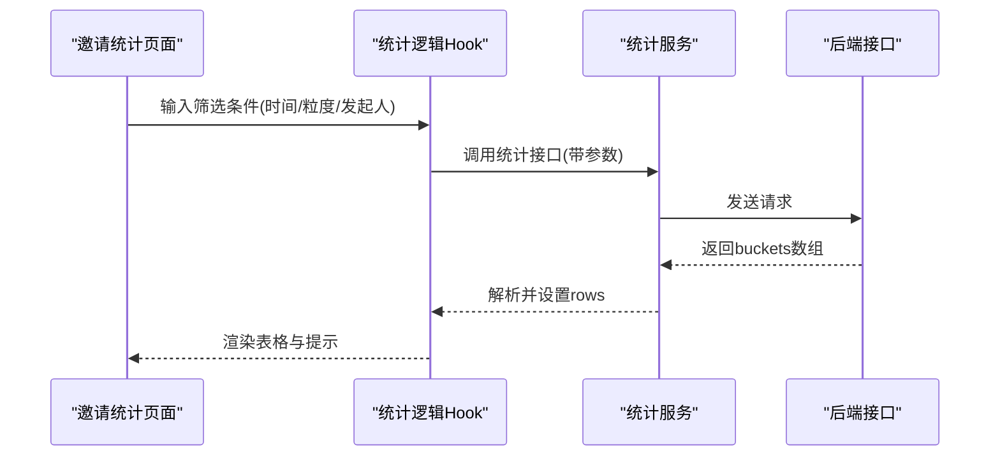
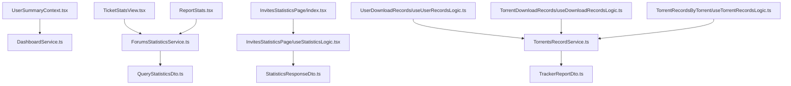

# 数据统计分析

<cite>
**本文档引用的文件**
- [StatisticsResponseDto.ts](file://src/api/models/StatisticsResponseDto.ts)
- [StatisticsDto.ts](file://src/api/models/StatisticsDto.ts)
- [QueryStatisticsDto.ts](file://src/api/models/QueryStatisticsDto.ts)
- [DashboardService.ts](file://src/api/services/DashboardService.ts)
- [ForumsStatisticsService.ts](file://src/api/services/ForumsStatisticsService.ts)
- [TorrentsRecordService.ts](file://src/api/services/TorrentsRecordService.ts)
- [UserSummaryContext.tsx](file://src/modules/app/context/UserSummaryContext.tsx)
- [TicketStatsView.tsx](file://src/modules/app/pages/Tickets/views/TicketStatsView.tsx)
- [InvitesStatisticsPage/index.tsx](file://src/modules/admin/pages/operations/invites/InvitesStatisticsPage/index.tsx)
- [InvitesStatisticsPage/useStatisticsLogic.tsx](file://src/modules/admin/pages/operations/invites/InvitesStatisticsPage/useStatisticsLogic.tsx)
- [UserDownloadRecords/useUserRecordsLogic.ts](file://src/modules/admin/pages/content/torrents/UserDownloadRecords/hooks/useUserRecordsLogic.ts)
- [TorrentDownloadRecords/useDownloadRecordsLogic.ts](file://src/modules/admin/pages/content/torrents/TorrentDownloadRecords/hooks/useDownloadRecordsLogic.ts)
- [TorrentRecordsByTorrent/useTorrentRecordsLogic.ts](file://src/modules/admin/pages/content/torrents/TorrentRecordsByTorrent/hooks/useTorrentRecordsLogic.ts)
- [ReportStats.tsx](file://src/modules/app/pages/Reports/components/ReportStats.tsx)
- [TrackerReportDto.ts](file://src/api/models/TrackerReportDto.ts)
</cite>

## 目录
1. [简介](#简介)
2. [项目结构](#项目结构)
3. [核心组件](#核心组件)
4. [架构总览](#架构总览)
5. [详细组件分析](#详细组件分析)
6. [依赖关系分析](#依赖关系分析)
7. [性能考虑](#性能考虑)
8. [故障排除指南](#故障排除指南)
9. [结论](#结论)
10. [附录](#附录)

## 简介
本文件系统化梳理并阐述后台数据统计分析功能，覆盖下载记录、用户行为分析、内容统计与性能监控四大维度。文档详细说明统计数据的采集机制、存储策略与可视化展示方式，解释报表生成、趋势分析与异常检测能力，并提供实时监控仪表板、历史数据分析与预测模型的实现建议。同时给出数据治理最佳实践、隐私保护与合规要求指导。

## 项目结构
统计分析相关代码主要分布在以下区域：
- API 层：定义统计模型与服务接口，统一对外暴露统计能力
- 应用层：用户概览上下文、工单统计视图、举报统计组件等
- 管理端：邀请统计页面、下载记录查询等后台分析界面
- 数据模型：统计响应结构、查询参数、追踪上报数据结构等

图表来源
- [UserSummaryContext.tsx](file://src/modules/app/context/UserSummaryContext.tsx#L1-L112)
- [TicketStatsView.tsx](file://src/modules/app/pages/Tickets/views/TicketStatsView.tsx#L1-L195)
- [ReportStats.tsx](file://src/modules/app/pages/Reports/components/ReportStats.tsx#L1-L59)
- [InvitesStatisticsPage/index.tsx](file://src/modules/admin/pages/operations/invites/InvitesStatisticsPage/index.tsx#L1-L125)
- [InvitesStatisticsPage/useStatisticsLogic.tsx](file://src/modules/admin/pages/operations/invites/InvitesStatisticsPage/useStatisticsLogic.tsx#L1-L69)
- [UserDownloadRecords/useUserRecordsLogic.ts](file://src/modules/admin/pages/content/torrents/UserDownloadRecords/hooks/useUserRecordsLogic.ts#L1-L88)
- [TorrentDownloadRecords/useDownloadRecordsLogic.ts](file://src/modules/admin/pages/content/torrents/TorrentDownloadRecords/hooks/useDownloadRecordsLogic.ts#L1-L34)
- [TorrentRecordsByTorrent/useTorrentRecordsLogic.ts](file://src/modules/admin/pages/content/torrents/TorrentRecordsByTorrent/hooks/useTorrentRecordsLogic.ts#L1-L38)
- [DashboardService.ts](file://src/api/services/DashboardService.ts#L1-L47)
- [ForumsStatisticsService.ts](file://src/api/services/ForumsStatisticsService.ts#L1-L96)
- [TorrentsRecordService.ts](file://src/api/services/TorrentsRecordService.ts#L398-L427)
- [StatisticsResponseDto.ts](file://src/api/models/StatisticsResponseDto.ts#L1-L9)
- [StatisticsDto.ts](file://src/api/models/StatisticsDto.ts#L1-L18)
- [QueryStatisticsDto.ts](file://src/api/models/QueryStatisticsDto.ts#L1-L29)
- [TrackerReportDto.ts](file://src/api/models/TrackerReportDto.ts#L1-L71)

章节来源
- [UserSummaryContext.tsx](file://src/modules/app/context/UserSummaryContext.tsx#L1-L112)
- [TicketStatsView.tsx](file://src/modules/app/pages/Tickets/views/TicketStatsView.tsx#L1-L195)
- [ReportStats.tsx](file://src/modules/app/pages/Reports/components/ReportStats.tsx#L1-L59)
- [InvitesStatisticsPage/index.tsx](file://src/modules/admin/pages/operations/invites/InvitesStatisticsPage/index.tsx#L1-L125)
- [InvitesStatisticsPage/useStatisticsLogic.tsx](file://src/modules/admin/pages/operations/invites/InvitesStatisticsPage/useStatisticsLogic.tsx#L1-L69)
- [UserDownloadRecords/useUserRecordsLogic.ts](file://src/modules/admin/pages/content/torrents/UserDownloadRecords/hooks/useUserRecordsLogic.ts#L1-L88)
- [TorrentDownloadRecords/useDownloadRecordsLogic.ts](file://src/modules/admin/pages/content/torrents/TorrentDownloadRecords/hooks/useDownloadRecordsLogic.ts#L1-L34)
- [TorrentRecordsByTorrent/useTorrentRecordsLogic.ts](file://src/modules/admin/pages/content/torrents/TorrentRecordsByTorrent/hooks/useTorrentRecordsLogic.ts#L1-L38)
- [DashboardService.ts](file://src/api/services/DashboardService.ts#L1-L47)
- [ForumsStatisticsService.ts](file://src/api/services/ForumsStatisticsService.ts#L1-L96)
- [TorrentsRecordService.ts](file://src/api/services/TorrentsRecordService.ts#L398-L427)
- [StatisticsResponseDto.ts](file://src/api/models/StatisticsResponseDto.ts#L1-L9)
- [StatisticsDto.ts](file://src/api/models/StatisticsDto.ts#L1-L18)
- [QueryStatisticsDto.ts](file://src/api/models/QueryStatisticsDto.ts#L1-L29)
- [TrackerReportDto.ts](file://src/api/models/TrackerReportDto.ts#L1-L71)

## 核心组件
- 统计响应模型：用于承载聚合后的统计桶数据，便于前端渲染与分析
- 统计查询模型：支持按日/周/月粒度与发起人ID等条件进行筛选
- 仪表盘服务：提供用户上传/下载/分享率/魔力值/未读通知等概览数据
- 论坛统计服务：提供今日概览、热议话题、日期范围统计等能力
- 种子记录服务：提供按用户/种子/任务状态的下载记录查询
- 邀请统计页面：管理端邀请数据的可视化分析界面
- 用户下载记录逻辑：按用户维度查询下载进度与完成情况
- 工单统计视图：展示工单总量、解决率、响应/解决时间等指标
- 举报统计组件：展示举报待处理/已处理/已驳回/总数等关键指标

章节来源
- [StatisticsResponseDto.ts](file://src/api/models/StatisticsResponseDto.ts#L1-L9)
- [StatisticsDto.ts](file://src/api/models/StatisticsDto.ts#L1-L18)
- [QueryStatisticsDto.ts](file://src/api/models/QueryStatisticsDto.ts#L1-L29)
- [DashboardService.ts](file://src/api/services/DashboardService.ts#L1-L47)
- [ForumsStatisticsService.ts](file://src/api/services/ForumsStatisticsService.ts#L1-L96)
- [TorrentsRecordService.ts](file://src/api/services/TorrentsRecordService.ts#L398-L427)
- [InvitesStatisticsPage/index.tsx](file://src/modules/admin/pages/operations/invites/InvitesStatisticsPage/index.tsx#L1-L125)
- [InvitesStatisticsPage/useStatisticsLogic.tsx](file://src/modules/admin/pages/operations/invites/InvitesStatisticsPage/useStatisticsLogic.tsx#L1-L69)
- [UserDownloadRecords/useUserRecordsLogic.ts](file://src/modules/admin/pages/content/torrents/UserDownloadRecords/hooks/useUserRecordsLogic.ts#L1-L88)
- [TicketStatsView.tsx](file://src/modules/app/pages/Tickets/views/TicketStatsView.tsx#L1-L195)
- [ReportStats.tsx](file://src/modules/app/pages/Reports/components/ReportStats.tsx#L1-L59)

## 架构总览
统计分析采用“前端组件 + API 服务 + 后端接口”的分层架构。前端通过服务封装调用后端接口，返回的数据经由模型定义进行类型约束，最终在组件中进行可视化渲染。

图表来源
- [InvitesStatisticsPage/useStatisticsLogic.tsx](file://src/modules/admin/pages/operations/invites/InvitesStatisticsPage/useStatisticsLogic.tsx#L1-L69)
- [DashboardService.ts](file://src/api/services/DashboardService.ts#L1-L47)
- [ForumsStatisticsService.ts](file://src/api/services/ForumsStatisticsService.ts#L1-L96)
- [TorrentsRecordService.ts](file://src/api/services/TorrentsRecordService.ts#L398-L427)
- [StatisticsResponseDto.ts](file://src/api/models/StatisticsResponseDto.ts#L1-L9)

## 详细组件分析

### 下载记录分析
- 用户下载记录：按用户维度查询发布/做种/下载中/已完成/未完成等状态的种子记录，支持分页与筛选
- 种子下载记录：按种子维度查询对应用户的下载进度与状态
- 工具方法：统一的加载逻辑与错误提示，确保数据一致性与用户体验

图表来源
- [UserDownloadRecords/useUserRecordsLogic.ts](file://src/modules/admin/pages/content/torrents/UserDownloadRecords/hooks/useUserRecordsLogic.ts#L1-L88)
- [TorrentDownloadRecords/useDownloadRecordsLogic.ts](file://src/modules/admin/pages/content/torrents/TorrentDownloadRecords/hooks/useDownloadRecordsLogic.ts#L1-L34)
- [TorrentRecordsByTorrent/useTorrentRecordsLogic.ts](file://src/modules/admin/pages/content/torrents/TorrentRecordsByTorrent/hooks/useTorrentRecordsLogic.ts#L1-L38)
- [TorrentsRecordService.ts](file://src/api/services/TorrentsRecordService.ts#L398-L427)

章节来源
- [UserDownloadRecords/useUserRecordsLogic.ts](file://src/modules/admin/pages/content/torrents/UserDownloadRecords/hooks/useUserRecordsLogic.ts#L1-L88)
- [TorrentDownloadRecords/useDownloadRecordsLogic.ts](file://src/modules/admin/pages/content/torrents/TorrentDownloadRecords/hooks/useDownloadRecordsLogic.ts#L1-L34)
- [TorrentRecordsByTorrent/useTorrentRecordsLogic.ts](file://src/modules/admin/pages/content/torrents/TorrentRecordsByTorrent/hooks/useTorrentRecordsLogic.ts#L1-L38)
- [TorrentsRecordService.ts](file://src/api/services/TorrentsRecordService.ts#L398-L427)

### 用户行为分析
- 用户概览上下文：定时轮询用户上传/下载/分享率/魔力值/未读通知/未读收件箱等关键指标，页面可见时自动刷新
- 实时性保障：使用浏览器可见性事件与定时器结合，避免不必要的请求与资源浪费

图表来源
- [UserSummaryContext.tsx](file://src/modules/app/context/UserSummaryContext.tsx#L1-L112)
- [DashboardService.ts](file://src/api/services/DashboardService.ts#L1-L47)

章节来源
- [UserSummaryContext.tsx](file://src/modules/app/context/UserSummaryContext.tsx#L1-L112)
- [DashboardService.ts](file://src/api/services/DashboardService.ts#L1-L47)

### 内容统计与性能监控
- 论坛统计：提供今日概览、热议话题、日期范围统计等能力，支撑内容热度与趋势分析
- 工单统计：展示总量、解决率、平均响应/解决时间、人员工作量与7日趋势，辅助运营与排班决策
- 举报统计：以卡片形式展示待处理/已处理/已驳回/总数，便于快速掌握举报处理状态

图表来源
- [TicketStatsView.tsx](file://src/modules/app/pages/Tickets/views/TicketStatsView.tsx#L1-L195)
- [ReportStats.tsx](file://src/modules/app/pages/Reports/components/ReportStats.tsx#L1-L59)
- [ForumsStatisticsService.ts](file://src/api/services/ForumsStatisticsService.ts#L1-L96)

章节来源
- [TicketStatsView.tsx](file://src/modules/app/pages/Tickets/views/TicketStatsView.tsx#L1-L195)
- [ReportStats.tsx](file://src/modules/app/pages/Reports/components/ReportStats.tsx#L1-L59)
- [ForumsStatisticsService.ts](file://src/api/services/ForumsStatisticsService.ts#L1-L96)

### 邀请统计分析
- 管理端邀请统计页面：支持时间范围、粒度(日/周/月)与发起人ID筛选，返回聚合后的统计桶数据
- 前端交互：工具栏筛选+数据表格展示，支持重置与加载态提示

图表来源
- [InvitesStatisticsPage/index.tsx](file://src/modules/admin/pages/operations/invites/InvitesStatisticsPage/index.tsx#L1-L125)
- [InvitesStatisticsPage/useStatisticsLogic.tsx](file://src/modules/admin/pages/operations/invites/InvitesStatisticsPage/useStatisticsLogic.tsx#L1-L69)
- [StatisticsResponseDto.ts](file://src/api/models/StatisticsResponseDto.ts#L1-L9)

章节来源
- [InvitesStatisticsPage/index.tsx](file://src/modules/admin/pages/operations/invites/InvitesStatisticsPage/index.tsx#L1-L125)
- [InvitesStatisticsPage/useStatisticsLogic.tsx](file://src/modules/admin/pages/operations/invites/InvitesStatisticsPage/useStatisticsLogic.tsx#L1-L69)
- [StatisticsResponseDto.ts](file://src/api/models/StatisticsResponseDto.ts#L1-L9)

### 数据收集机制与存储策略
- 收集机制
  - 用户行为：通过仪表盘服务定期拉取用户关键指标，结合浏览器可见性事件控制刷新频率
  - 下载记录：通过种子记录服务按用户/种子/状态维度查询，支持分页与筛选
  - 内容统计：通过论坛统计服务获取今日概览、热议话题与日期范围统计
  - 邀请统计：通过管理端统计接口按时间范围与粒度聚合
- 存储策略
  - 前端缓存：利用React状态与上下文缓存近期数据，减少重复请求
  - 模型约束：使用类型模型对返回数据进行约束，确保数据结构一致
  - 异常处理：统一的错误提示与降级处理，保证用户体验

章节来源
- [UserSummaryContext.tsx](file://src/modules/app/context/UserSummaryContext.tsx#L1-L112)
- [TorrentsRecordService.ts](file://src/api/services/TorrentsRecordService.ts#L398-L427)
- [ForumsStatisticsService.ts](file://src/api/services/ForumsStatisticsService.ts#L1-L96)
- [StatisticsResponseDto.ts](file://src/api/models/StatisticsResponseDto.ts#L1-L9)

### 可视化展示与报表生成
- 图表组件：工单统计视图采用卡片与柱状图组合展示关键指标与趋势
- 报表组件：举报统计组件以卡片形式直观呈现待处理/已处理/已驳回/总数
- 表格组件：邀请统计页面使用数据表格展示聚合后的统计桶数据，支持筛选与重置

章节来源
- [TicketStatsView.tsx](file://src/modules/app/pages/Tickets/views/TicketStatsView.tsx#L1-L195)
- [ReportStats.tsx](file://src/modules/app/pages/Reports/components/ReportStats.tsx#L1-L59)
- [InvitesStatisticsPage/index.tsx](file://src/modules/admin/pages/operations/invites/InvitesStatisticsPage/index.tsx#L1-L125)

### 趋势分析与异常检测
- 趋势分析：工单统计视图提供7日趋势对比“创建/解决”数量，辅助识别波动与周期性变化
- 异常检测：可基于阈值与环比变化率构建告警规则，结合现有统计指标进行预警

章节来源
- [TicketStatsView.tsx](file://src/modules/app/pages/Tickets/views/TicketStatsView.tsx#L150-L191)

### 预测模型
- 建议采用时间序列模型对下载量、活跃用户、工单创建/解决等指标进行短期预测，结合历史趋势与节假日等外部因素进行校准

[本节为通用建议，无需具体文件引用]

## 依赖关系分析
统计分析模块的依赖关系如下：

图表来源
- [UserSummaryContext.tsx](file://src/modules/app/context/UserSummaryContext.tsx#L1-L112)
- [TicketStatsView.tsx](file://src/modules/app/pages/Tickets/views/TicketStatsView.tsx#L1-L195)
- [ReportStats.tsx](file://src/modules/app/pages/Reports/components/ReportStats.tsx#L1-L59)
- [InvitesStatisticsPage/index.tsx](file://src/modules/admin/pages/operations/invites/InvitesStatisticsPage/index.tsx#L1-L125)
- [InvitesStatisticsPage/useStatisticsLogic.tsx](file://src/modules/admin/pages/operations/invites/InvitesStatisticsPage/useStatisticsLogic.tsx#L1-L69)
- [UserDownloadRecords/useUserRecordsLogic.ts](file://src/modules/admin/pages/content/torrents/UserDownloadRecords/hooks/useUserRecordsLogic.ts#L1-L88)
- [TorrentDownloadRecords/useDownloadRecordsLogic.ts](file://src/modules/admin/pages/content/torrents/TorrentDownloadRecords/hooks/useDownloadRecordsLogic.ts#L1-L34)
- [TorrentRecordsByTorrent/useTorrentRecordsLogic.ts](file://src/modules/admin/pages/content/torrents/TorrentRecordsByTorrent/hooks/useTorrentRecordsLogic.ts#L1-L38)
- [DashboardService.ts](file://src/api/services/DashboardService.ts#L1-L47)
- [ForumsStatisticsService.ts](file://src/api/services/ForumsStatisticsService.ts#L1-L96)
- [TorrentsRecordService.ts](file://src/api/services/TorrentsRecordService.ts#L398-L427)
- [StatisticsResponseDto.ts](file://src/api/models/StatisticsResponseDto.ts#L1-L9)
- [QueryStatisticsDto.ts](file://src/api/models/QueryStatisticsDto.ts#L1-L29)
- [TrackerReportDto.ts](file://src/api/models/TrackerReportDto.ts#L1-L71)

章节来源
- [UserSummaryContext.tsx](file://src/modules/app/context/UserSummaryContext.tsx#L1-L112)
- [TicketStatsView.tsx](file://src/modules/app/pages/Tickets/views/TicketStatsView.tsx#L1-L195)
- [ReportStats.tsx](file://src/modules/app/pages/Reports/components/ReportStats.tsx#L1-L59)
- [InvitesStatisticsPage/index.tsx](file://src/modules/admin/pages/operations/invites/InvitesStatisticsPage/index.tsx#L1-L125)
- [InvitesStatisticsPage/useStatisticsLogic.tsx](file://src/modules/admin/pages/operations/invites/InvitesStatisticsPage/useStatisticsLogic.tsx#L1-L69)
- [UserDownloadRecords/useUserRecordsLogic.ts](file://src/modules/admin/pages/content/torrents/UserDownloadRecords/hooks/useUserRecordsLogic.ts#L1-L88)
- [TorrentDownloadRecords/useDownloadRecordsLogic.ts](file://src/modules/admin/pages/content/torrents/TorrentDownloadRecords/hooks/useDownloadRecordsLogic.ts#L1-L34)
- [TorrentRecordsByTorrent/useTorrentRecordsLogic.ts](file://src/modules/admin/pages/content/torrents/TorrentRecordsByTorrent/hooks/useTorrentRecordsLogic.ts#L1-L38)
- [DashboardService.ts](file://src/api/services/DashboardService.ts#L1-L47)
- [ForumsStatisticsService.ts](file://src/api/services/ForumsStatisticsService.ts#L1-L96)
- [TorrentsRecordService.ts](file://src/api/services/TorrentsRecordService.ts#L398-L427)
- [StatisticsResponseDto.ts](file://src/api/models/StatisticsResponseDto.ts#L1-L9)
- [QueryStatisticsDto.ts](file://src/api/models/QueryStatisticsDto.ts#L1-L29)
- [TrackerReportDto.ts](file://src/api/models/TrackerReportDto.ts#L1-L71)

## 性能考虑
- 请求去抖与节流：对频繁变更的筛选条件进行防抖，避免短时间内多次请求
- 分页与懒加载：下载记录与统计表格采用分页与懒加载，降低首屏压力
- 缓存策略：利用上下文与本地状态缓存近期数据，结合可见性事件控制刷新频率
- 错误降级：统一的错误提示与默认值，避免页面空白影响体验

[本节提供通用指导，无需具体文件引用]

## 故障排除指南
- 用户概览数据为空：检查登录状态与令牌有效性；确认服务端接口可用性
- 下载记录加载失败：检查用户/种子ID合法性与权限；查看网络请求错误信息
- 统计页面无数据：确认筛选条件有效且时间范围合理；检查后端聚合逻辑
- 工单/举报统计异常：核对统计数据接口返回结构；关注前端解析逻辑

章节来源
- [UserSummaryContext.tsx](file://src/modules/app/context/UserSummaryContext.tsx#L58-L64)
- [UserDownloadRecords/useUserRecordsLogic.ts](file://src/modules/admin/pages/content/torrents/UserDownloadRecords/hooks/useUserRecordsLogic.ts#L62-L66)
- [InvitesStatisticsPage/useStatisticsLogic.tsx](file://src/modules/admin/pages/operations/invites/InvitesStatisticsPage/useStatisticsLogic.tsx#L29-L31)

## 结论
本项目在前端层面已形成较为完善的统计分析能力：用户行为概览、下载记录查询、内容与工单统计、邀请统计等模块协同工作，配合统一的模型与服务封装，实现了高效、可维护的数据可视化方案。建议后续在预测模型与异常检测方面进一步增强，以提升运营决策的智能化水平。

[本节为总结性内容，无需具体文件引用]

## 附录
- 数据治理最佳实践
  - 明确数据所有权与使用边界，遵循最小必要原则
  - 对敏感数据进行脱敏与聚合，避免直接暴露个人隐私
  - 建立数据生命周期管理，定期清理过期数据
- 隐私保护与合规要求
  - 遵循个人信息保护法与相关法规，确保用户知情同意
  - 提供数据删除与导出接口，保障用户权利
  - 对跨境数据传输进行合规评估与安全加固

[本节为通用指导，无需具体文件引用]