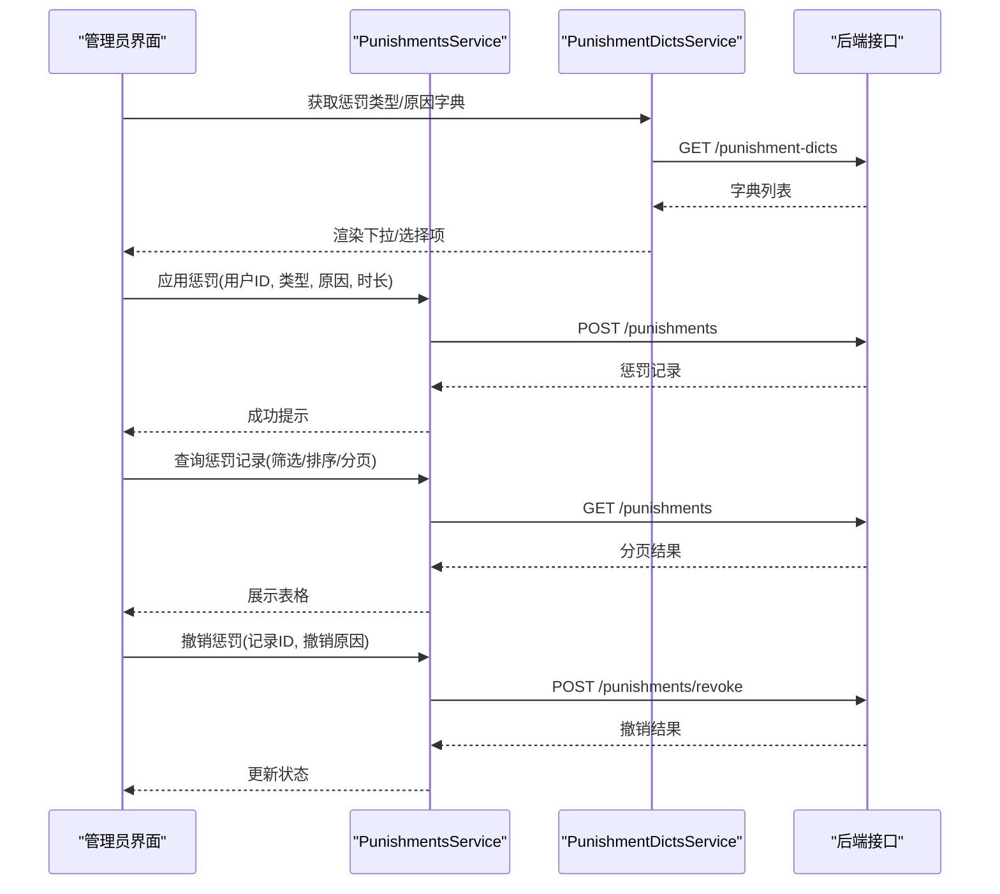
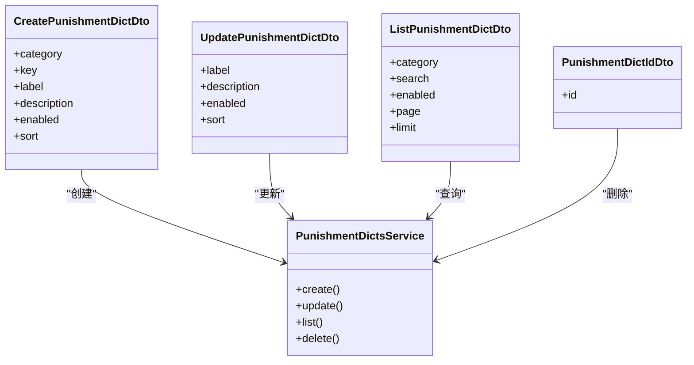
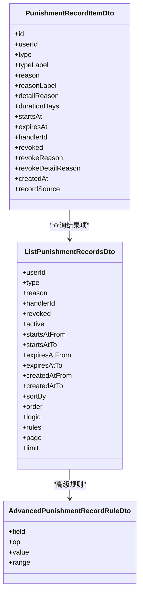
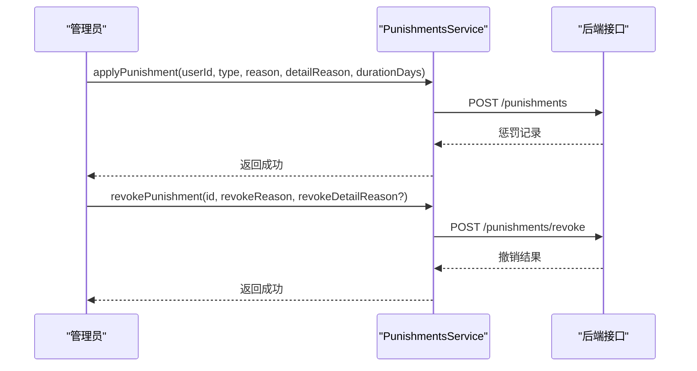
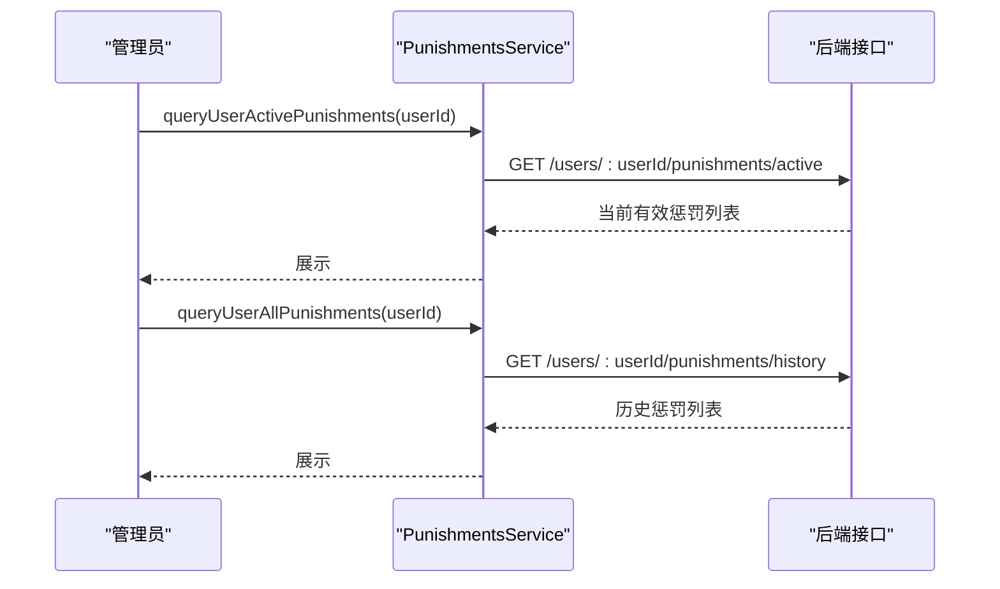
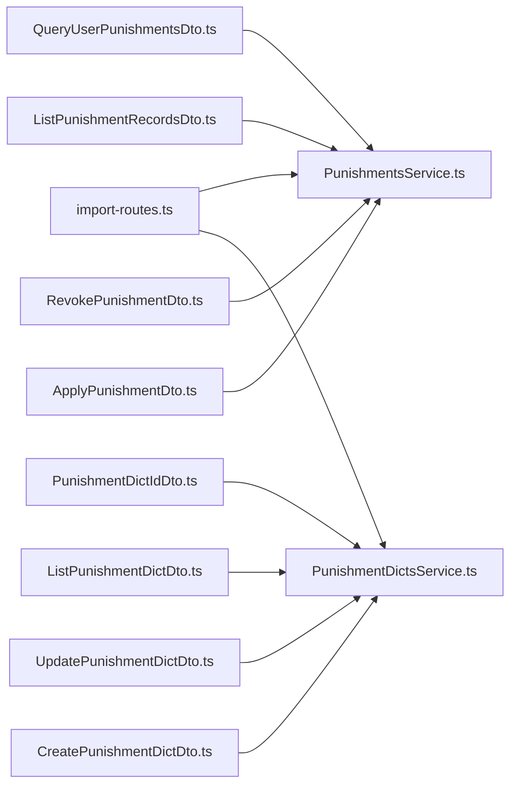
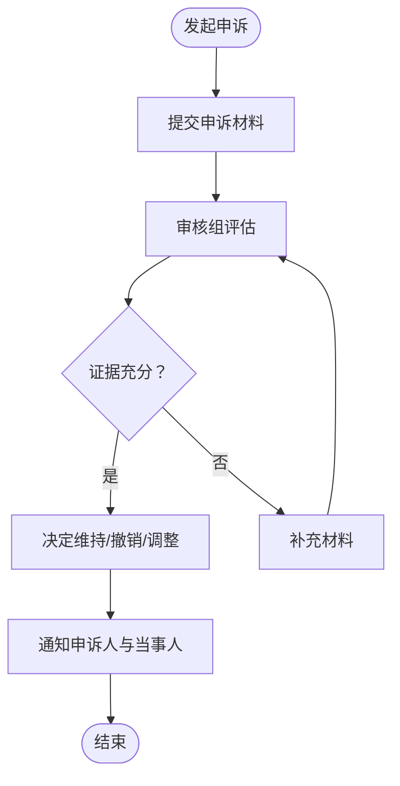

# 惩罚管理

<cite>
**本文引用的文件**
- [ApplyPunishmentDto.ts](file://src/api/models/ApplyPunishmentDto.ts)
- [PunishmentRecordItemDto.ts](file://src/api/models/PunishmentRecordItemDto.ts)
- [PunishmentItemDto.ts](file://src/api/models/PunishmentItemDto.ts)
- [ListPunishmentRecordsDto.ts](file://src/api/models/ListPunishmentRecordsDto.ts)
- [ListPunishmentRecordsResponseDto.ts](file://src/api/models/ListPunishmentRecordsResponseDto.ts)
- [RevokePunishmentDto.ts](file://src/api/models/RevokePunishmentDto.ts)
- [RevokePunishmentResponseDto.ts](file://src/api/models/RevokePunishmentResponseDto.ts)
- [QueryUserPunishmentsDto.ts](file://src/api/models/QueryUserPunishmentsDto.ts)
- [CreatePunishmentDictDto.ts](file://src/api/models/CreatePunishmentDictDto.ts)
- [UpdatePunishmentDictDto.ts](file://src/api/models/UpdatePunishmentDictDto.ts)
- [ListPunishmentDictDto.ts](file://src/api/models/ListPunishmentDictDto.ts)
- [PunishmentDictIdDto.ts](file://src/api/models/PunishmentDictIdDto.ts)
- [AdvancedPunishmentRecordRuleDto.ts](file://src/api/models/AdvancedPunishmentRecordRuleDto.ts)
- [BanRecordDto.ts](file://src/api/models/BanRecordDto.ts)
- [PunishmentDictsService.ts](file://src/api/services/PunishmentDictsService.ts)
- [PunishmentsService.ts](file://src/api/services/PunishmentsService.ts)
- [import-routes.ts](file://scripts/import-routes.ts)
</cite>

## 目录
1. [简介](#简介)
2. [项目结构](#项目结构)
3. [核心组件](#核心组件)
4. [架构总览](#架构总览)
5. [详细组件分析](#详细组件分析)
6. [依赖关系分析](#依赖关系分析)
7. [性能考量](#性能考量)
8. [故障排查指南](#故障排查指南)
9. [结论](#结论)
10. [附录](#附录)

## 简介
本文件面向“惩罚管理”功能，系统化梳理惩罚系统的数据模型、服务接口、查询与筛选能力、执行与撤销流程、以及审计与合规相关的设计要点。文档以仓库中已存在的模型与服务为基础，结合实际可落地的流程建议，帮助管理员与开发人员高效、安全地使用惩罚管理功能。

## 项目结构
惩罚管理相关代码主要分布在以下位置：
- 数据模型（models）：定义惩罚类型、记录、字典、查询参数等
- 服务层（services）：提供惩罚字典与惩罚记录的增删改查、应用与撤销等能力
- 路由脚本（scripts）：在后台管理端注册“惩罚记录”和“惩罚类型”页面路由

```mermaid
graph TB
subgraph "模型(models)"
A["ApplyPunishmentDto.ts"]
B["PunishmentRecordItemDto.ts"]
C["PunishmentItemDto.ts"]
D["ListPunishmentRecordsDto.ts"]
E["ListPunishmentRecordsResponseDto.ts"]
F["RevokePunishmentDto.ts"]
G["RevokePunishmentResponseDto.ts"]
H["QueryUserPunishmentsDto.ts"]
I["CreatePunishmentDictDto.ts"]
J["UpdatePunishmentDictDto.ts"]
K["ListPunishmentDictDto.ts"]
L["PunishmentDictIdDto.ts"]
M["AdvancedPunishmentRecordRuleDto.ts"]
N["BanRecordDto.ts"]
end
subgraph "服务(services)"
S1["PunishmentDictsService.ts"]
S2["PunishmentsService.ts"]
end
subgraph "路由脚本"
R["import-routes.ts"]
end
A --> S2
F --> S2
D --> S2
H --> S2
I --> S1
J --> S1
K --> S1
L --> S1
R --> |"注册管理端路由"| S1
R --> |"注册管理端路由"| S2
```

图表来源
- [PunishmentDictsService.ts](file://src/api/services/PunishmentDictsService.ts#L1-L200)
- [PunishmentsService.ts](file://src/api/services/PunishmentsService.ts#L1-L200)
- [import-routes.ts](file://scripts/import-routes.ts#L730-L805)

章节来源
- [PunishmentDictsService.ts](file://src/api/services/PunishmentDictsService.ts#L1-L200)
- [PunishmentsService.ts](file://src/api/services/PunishmentsService.ts#L1-L200)
- [import-routes.ts](file://scripts/import-routes.ts#L730-L805)

## 核心组件
- 惩罚类型与原因字典
  - 字典类别包括：封禁时长、封禁原因、惩罚类型、解封原因
  - 支持创建、更新、分页查询与启用状态过滤
- 惩罚记录
  - 记录目标用户、类型、原因、时长、生效与到期时间、处理人、撤销状态与原因等
  - 支持按多种维度筛选与排序，支持高级规则组合查询
- 惩罚应用与撤销
  - 应用惩罚需提供用户ID、类型、原因、时长等
  - 撤销惩罚需提供记录ID与撤销原因
- 用户惩罚查询
  - 支持查询某用户的当前有效惩罚与全部历史惩罚

章节来源
- [CreatePunishmentDictDto.ts](file://src/api/models/CreatePunishmentDictDto.ts#L1-L43)
- [UpdatePunishmentDictDto.ts](file://src/api/models/UpdatePunishmentDictDto.ts#L1-L23)
- [ListPunishmentDictDto.ts](file://src/api/models/ListPunishmentDictDto.ts#L1-L39)
- [ApplyPunishmentDto.ts](file://src/api/models/ApplyPunishmentDto.ts#L1-L28)
- [RevokePunishmentDto.ts](file://src/api/models/RevokePunishmentDto.ts#L1-L20)
- [PunishmentRecordItemDto.ts](file://src/api/models/PunishmentRecordItemDto.ts#L1-L33)
- [ListPunishmentRecordsDto.ts](file://src/api/models/ListPunishmentRecordsDto.ts#L1-L106)
- [QueryUserPunishmentsDto.ts](file://src/api/models/QueryUserPunishmentsDto.ts#L1-L12)

## 架构总览
惩罚管理采用“模型驱动 + 服务封装”的架构：
- 模型层：统一定义请求/响应数据结构，确保前后端契约清晰
- 服务层：封装对后端接口的调用，提供应用惩罚、撤销惩罚、查询字典与记录等方法
- 前端集成：通过管理端路由访问“惩罚记录”和“惩罚类型”页面，完成可视化管理

图表来源
- [PunishmentsService.ts](file://src/api/services/PunishmentsService.ts#L1-L200)
- [PunishmentDictsService.ts](file://src/api/services/PunishmentDictsService.ts#L1-L200)
- [ApplyPunishmentDto.ts](file://src/api/models/ApplyPunishmentDto.ts#L1-L28)
- [RevokePunishmentDto.ts](file://src/api/models/RevokePunishmentDto.ts#L1-L20)
- [ListPunishmentRecordsDto.ts](file://src/api/models/ListPunishmentRecordsDto.ts#L1-L106)

## 详细组件分析

### 惩罚类型与原因字典
- 字典类别
  - 封禁时长：用于选择封禁天数
  - 封禁原因：用于选择违规原因
  - 惩罚类型：用于标识具体惩罚动作（如登录封禁、上传封禁等）
  - 解封原因：用于撤销时登记原因
- 关键能力
  - 创建字典项：设置类别、键值、标签、描述、启用状态与排序权重
  - 更新字典项：修改标签、描述、启用状态与排序权重
  - 列表查询：按类别、关键词、启用状态分页查询
  - 删除字典项：通过ID删除

图表来源
- [CreatePunishmentDictDto.ts](file://src/api/models/CreatePunishmentDictDto.ts#L1-L43)
- [UpdatePunishmentDictDto.ts](file://src/api/models/UpdatePunishmentDictDto.ts#L1-L23)
- [ListPunishmentDictDto.ts](file://src/api/models/ListPunishmentDictDto.ts#L1-L39)
- [PunishmentDictIdDto.ts](file://src/api/models/PunishmentDictIdDto.ts#L1-L11)
- [PunishmentDictsService.ts](file://src/api/services/PunishmentDictsService.ts#L1-L200)

章节来源
- [CreatePunishmentDictDto.ts](file://src/api/models/CreatePunishmentDictDto.ts#L1-L43)
- [UpdatePunishmentDictDto.ts](file://src/api/models/UpdatePunishmentDictDto.ts#L1-L23)
- [ListPunishmentDictDto.ts](file://src/api/models/ListPunishmentDictDto.ts#L1-L39)
- [PunishmentDictIdDto.ts](file://src/api/models/PunishmentDictIdDto.ts#L1-L11)
- [PunishmentDictsService.ts](file://src/api/services/PunishmentDictsService.ts#L1-L200)

### 惩罚记录模型与查询
- 记录字段
  - 标识：记录ID、用户ID、处理人ID
  - 类型与原因：类型键、类型标签、原因键、原因标签、详细说明
  - 时间：生效时间、到期时间、创建时间
  - 状态：是否撤销、撤销原因与说明
  - 来源：active/historical
- 查询能力
  - 基础筛选：用户ID、类型、处理人ID、是否撤销、活动状态(active)
  - 时间范围：生效/到期/创建时间区间
  - 文本模糊：按原因关键字模糊匹配
  - 排序：按生效/到期/创建/时长排序
  - 高级规则：支持多字段规则与AND/OR组合
  - 分页：页码与每页条数

图表来源
- [PunishmentRecordItemDto.ts](file://src/api/models/PunishmentRecordItemDto.ts#L1-L33)
- [ListPunishmentRecordsDto.ts](file://src/api/models/ListPunishmentRecordsDto.ts#L1-L106)
- [AdvancedPunishmentRecordRuleDto.ts](file://src/api/models/AdvancedPunishmentRecordRuleDto.ts#L1-L61)

章节来源
- [PunishmentRecordItemDto.ts](file://src/api/models/PunishmentRecordItemDto.ts#L1-L33)
- [ListPunishmentRecordsDto.ts](file://src/api/models/ListPunishmentRecordsDto.ts#L1-L106)
- [AdvancedPunishmentRecordRuleDto.ts](file://src/api/models/AdvancedPunishmentRecordRuleDto.ts#L1-L61)

### 惩罚应用与撤销流程
- 应用惩罚
  - 输入：目标用户ID、惩罚类型、原因、详细说明（可选）、时长（天）
  - 输出：生成一条惩罚记录，包含生效/到期时间、处理人信息等
- 撤销惩罚
  - 输入：记录ID、撤销原因、撤销说明（可选）
  - 输出：更新记录为已撤销，并保留撤销原因与说明

图表来源
- [ApplyPunishmentDto.ts](file://src/api/models/ApplyPunishmentDto.ts#L1-L28)
- [RevokePunishmentDto.ts](file://src/api/models/RevokePunishmentDto.ts#L1-L20)
- [PunishmentsService.ts](file://src/api/services/PunishmentsService.ts#L1-L200)

章节来源
- [ApplyPunishmentDto.ts](file://src/api/models/ApplyPunishmentDto.ts#L1-L28)
- [RevokePunishmentDto.ts](file://src/api/models/RevokePunishmentDto.ts#L1-L20)
- [RevokePunishmentResponseDto.ts](file://src/api/models/RevokePunishmentResponseDto.ts#L1-L8)
- [PunishmentsService.ts](file://src/api/services/PunishmentsService.ts#L1-L200)

### 用户惩罚查询
- 当前有效惩罚：按活动状态(active=true)查询未到期且未撤销的记录
- 全部历史惩罚：不设活动状态限制，返回所有记录
- 查询参数：用户ID必填，其他筛选条件可选

图表来源
- [QueryUserPunishmentsDto.ts](file://src/api/models/QueryUserPunishmentsDto.ts#L1-L12)
- [PunishmentsService.ts](file://src/api/services/PunishmentsService.ts#L1-L200)

章节来源
- [QueryUserPunishmentsDto.ts](file://src/api/models/QueryUserPunishmentsDto.ts#L1-L12)
- [PunishmentsService.ts](file://src/api/services/PunishmentsService.ts#L1-L200)

### 管理端页面与路由
- 后台管理端路由注册了“惩罚记录”和“惩罚类型”页面，分别对应惩罚记录列表与字典维护功能

章节来源
- [import-routes.ts](file://scripts/import-routes.ts#L730-L805)

## 依赖关系分析
- 模型与服务的耦合
  - 服务方法通过模型定义的DTO进行请求/响应约束，降低前后端耦合
- 查询与筛选的扩展性
  - 高级规则支持多字段与多运算符组合，便于复杂筛选场景
- 管理端集成
  - 路由脚本将惩罚管理页面纳入后台导航，便于统一运维

图表来源
- [ApplyPunishmentDto.ts](file://src/api/models/ApplyPunishmentDto.ts#L1-L28)
- [RevokePunishmentDto.ts](file://src/api/models/RevokePunishmentDto.ts#L1-L20)
- [ListPunishmentRecordsDto.ts](file://src/api/models/ListPunishmentRecordsDto.ts#L1-L106)
- [QueryUserPunishmentsDto.ts](file://src/api/models/QueryUserPunishmentsDto.ts#L1-L12)
- [CreatePunishmentDictDto.ts](file://src/api/models/CreatePunishmentDictDto.ts#L1-L43)
- [UpdatePunishmentDictDto.ts](file://src/api/models/UpdatePunishmentDictDto.ts#L1-L23)
- [ListPunishmentDictDto.ts](file://src/api/models/ListPunishmentDictDto.ts#L1-L39)
- [PunishmentDictIdDto.ts](file://src/api/models/PunishmentDictIdDto.ts#L1-L11)
- [PunishmentDictsService.ts](file://src/api/services/PunishmentDictsService.ts#L1-L200)
- [PunishmentsService.ts](file://src/api/services/PunishmentsService.ts#L1-L200)
- [import-routes.ts](file://scripts/import-routes.ts#L730-L805)

章节来源
- [PunishmentDictsService.ts](file://src/api/services/PunishmentDictsService.ts#L1-L200)
- [PunishmentsService.ts](file://src/api/services/PunishmentsService.ts#L1-L200)
- [import-routes.ts](file://scripts/import-routes.ts#L730-L805)

## 性能考量
- 分页与筛选
  - 使用分页参数控制单次查询规模，避免一次性加载过多记录
  - 合理使用时间范围与布尔条件，减少数据库扫描
- 高级查询
  - 避免过于复杂的AND/OR组合导致查询膨胀
  - 优先使用索引友好的字段（如ID、时间戳）作为筛选条件
- 缓存策略
  - 对常用字典项（如封禁原因、惩罚类型）进行前端缓存，降低重复请求

## 故障排查指南
- 应用惩罚失败
  - 检查用户ID是否存在、类型与原因是否来自字典、时长是否为正数
  - 查看服务返回的错误信息，确认必填字段与格式
- 撤销惩罚异常
  - 确认记录ID有效且未被二次撤销
  - 核对撤销原因是否已在字典中配置
- 查询无结果
  - 检查筛选条件是否过严（如精确到毫秒的时间范围）
  - 尝试取消“活动状态”或“撤销状态”筛选，缩小问题范围
- 页面无法打开
  - 确认管理端路由已正确注册，权限配置允许访问

## 结论
惩罚管理系统以清晰的数据模型与服务封装为基础，提供了完整的“字典维护—记录应用—查询筛选—撤销管理”闭环。通过合理的筛选与分页策略，可在保证性能的同时满足复杂运营需求。建议在生产环境中配合审计日志与权限控制，确保惩罚过程透明、可追溯、可复核。

## 附录

### 惩罚类型与严重程度分级（建议）
- 建议在字典中维护“惩罚类型”与“封禁时长”，并为不同类型设定默认时长
- 可引入“严重程度”字段（如低/中/高），用于辅助决策与批量处理

### 惩罚期限计算（建议）
- 生效时间：即时或指定时间
- 到期时间：生效时间 + 封禁时长（天）
- 自动清理：到期后自动标记为历史记录，便于归档

### 惩罚执行状态追踪（建议）
- 状态枚举：待生效、执行中、已撤销、已过期
- 状态变更事件：记录每次状态变更的操作人、时间与原因

### 惩罚查询筛选清单（建议）
- 基础：用户ID、类型、原因、处理人、是否撤销
- 时间：生效/到期/创建时间区间
- 高级：多字段组合、模糊匹配、范围查询

### 惩罚批量处理（建议）
- 批量应用：基于导出的用户列表与模板，批量提交应用惩罚请求
- 批量撤销：按筛选条件导出记录，统一撤销并填写撤销原因

### 惩罚审计日志（建议）
- 记录：操作人、操作类型（新增/撤销/编辑）、对象ID、变更前后对比、时间戳
- 存储：独立审计表，保留长期日志以便复核

### 惩罚公正性保障（建议）
- 审批流程：重大惩罚需双人复核或审批流
- 申诉通道：建立申诉入口与处理时限
- 透明度：公开惩罚依据与标准，定期发布统计报告

### 惩罚申诉处理流程（建议）
