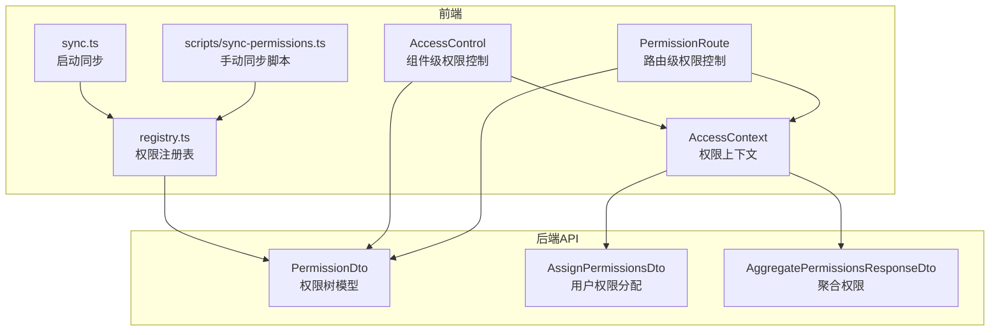
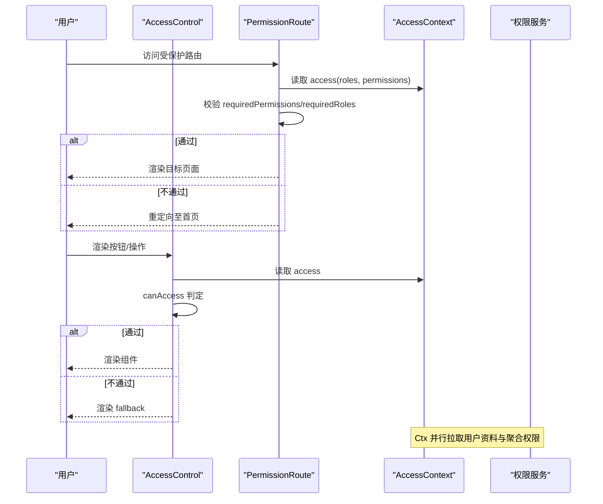
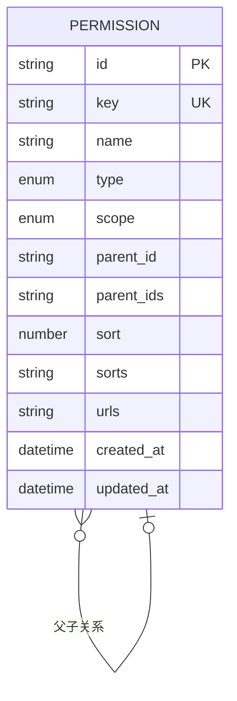
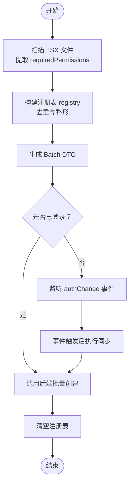
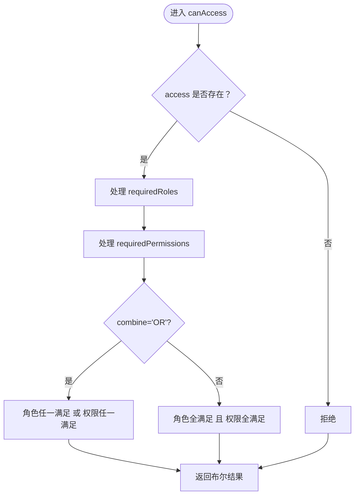
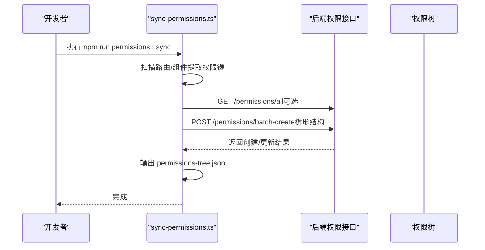
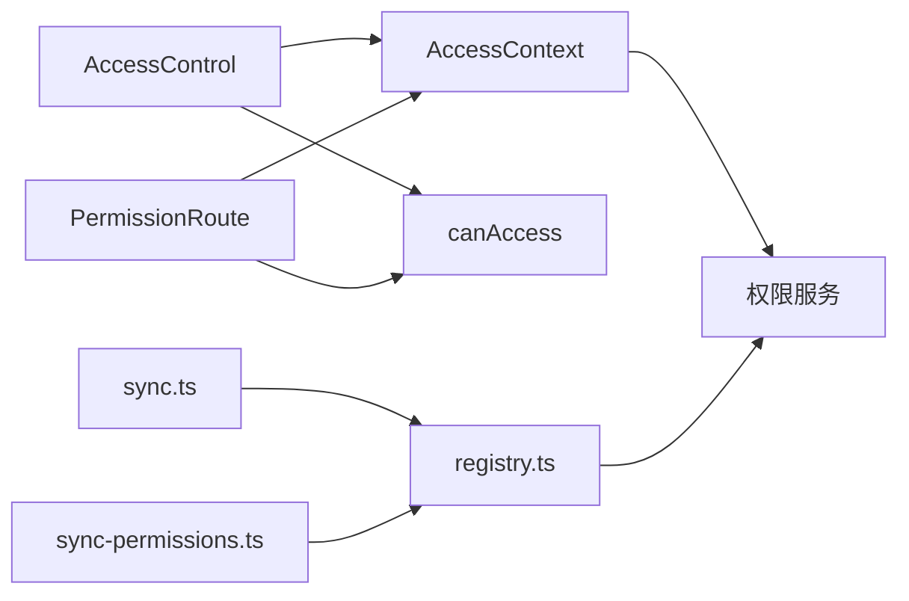

# 权限管理

<cite>
**本文引用的文件**
- [src/permissions/AccessControl.tsx](file://src/permissions/AccessControl.tsx)
- [src/permissions/registry.ts](file://src/permissions/registry.ts)
- [src/permissions/sync.ts](file://src/permissions/sync.ts)
- [src/utils/access.ts](file://src/utils/access.ts)
- [src/context/AccessContext.tsx](file://src/context/AccessContext.tsx)
- [src/route/guards.tsx](file://src/routes/guards.tsx)
- [src/api/models/PermissionDto.ts](file://src/api/models/PermissionDto.ts)
- [src/api/models/AssignPermissionsDto.ts](file://src/api/models/AssignPermissionsDto.ts)
- [src/api/models/AggregatePermissionsResponseDto.ts](file://src/api/models/AggregatePermissionsResponseDto.ts)
- [scripts/sync-permissions.ts](file://scripts/sync-permissions.ts)
- [package.json](file://package.json)
- [src/modules/admin/pages/users-security/PermissionsPage/hooks/usePermissionsLogic.ts](file://src/modules/admin/pages/users-security/PermissionsPage/hooks/usePermissionsLogic.ts)
- [src/modules/admin/pages/users-security/PermissionsPage/index.tsx](file://src/modules/admin/pages/users-security/PermissionsPage/index.tsx)
</cite>

## 目录
1. [简介](#简介)
2. [项目结构](#项目结构)
3. [核心组件](#核心组件)
4. [架构总览](#架构总览)
5. [详细组件分析](#详细组件分析)
6. [依赖分析](#依赖分析)
7. [性能考虑](#性能考虑)
8. [故障排查指南](#故障排查指南)
9. [结论](#结论)
10. [附录](#附录)

## 简介
本文件系统性梳理并阐述本项目的权限管理架构与实现细节，涵盖权限树结构、权限继承机制、动态权限配置与权限分配流程；解释权限节点的层级关系、权限验证机制与权限缓存策略；包含权限模板管理、批量权限分配与权限审计功能；并提供权限设计最佳实践、命名规范与安全策略，以及具体配置步骤与常见问题解决方案。

## 项目结构
权限体系由前端运行时权限控制、权限注册与同步、后端权限模型与API三部分组成：
- 前端运行时：AccessContext 提供用户权限上下文，AccessControl 与 PermissionRoute 实现组件级与路由级权限控制。
- 权限注册与同步：registry 负责收集页面/按钮权限键，sync 与脚本同步器在启动或手动执行时批量创建/更新权限树。
- 后端模型与API：PermissionDto 定义权限树节点字段，AssignPermissionsDto 用于用户权限分配，AggregatePermissionsResponseDto 提供聚合权限查询。

**图表来源**
- [src/permissions/AccessControl.tsx](file://src/permissions/AccessControl.tsx#L1-L43)
- [src/permissions/sync.ts](file://src/permissions/sync.ts#L1-L159)
- [src/permissions/registry.ts](file://src/permissions/registry.ts#L1-L129)
- [src/utils/access.ts](file://src/utils/access.ts#L1-L65)
- [src/context/AccessContext.tsx](file://src/context/AccessContext.tsx#L1-L181)
- [src/api/models/PermissionDto.ts](file://src/api/models/PermissionDto.ts#L1-L85)
- [src/api/models/AssignPermissionsDto.ts](file://src/api/models/AssignPermissionsDto.ts#L1-L16)
- [src/api/models/AggregatePermissionsResponseDto.ts](file://src/api/models/AggregatePermissionsResponseDto.ts#L1-L9)
- [scripts/sync-permissions.ts](file://scripts/sync-permissions.ts#L1-L718)

**章节来源**
- [src/permissions/AccessControl.tsx](file://src/permissions/AccessControl.tsx#L1-L43)
- [src/permissions/sync.ts](file://src/permissions/sync.ts#L1-L159)
- [src/permissions/registry.ts](file://src/permissions/registry.ts#L1-L129)
- [src/utils/access.ts](file://src/utils/access.ts#L1-L65)
- [src/context/AccessContext.tsx](file://src/context/AccessContext.tsx#L1-L181)
- [src/api/models/PermissionDto.ts](file://src/api/models/PermissionDto.ts#L1-L85)
- [src/api/models/AssignPermissionsDto.ts](file://src/api/models/AssignPermissionsDto.ts#L1-L16)
- [src/api/models/AggregatePermissionsResponseDto.ts](file://src/api/models/AggregatePermissionsResponseDto.ts#L1-L9)
- [scripts/sync-permissions.ts](file://scripts/sync-permissions.ts#L1-L718)

## 核心组件
- 权限上下文与鉴权
  - AccessContext：拉取用户资料与聚合权限，维护 roles、permissions、username、avatar，并暴露 reload 方法；监听 authChange 事件自动刷新。
  - PermissionRoute：基于后端权限字符的路由守卫，支持 matchAll 与 combine 策略，内置 admin 超级放行。
  - AccessControl：组件级权限控制，与 canAccess 保持一致的判定逻辑。
  - canAccess：通用权限判断工具，支持角色与权限的 AND/OR 组合、matchAll 精度控制。
- 权限注册与同步
  - registry：前端侧权限注册表，统一收集页面/按钮权限键，去重并导出批量创建 DTO。
  - sync：应用启动时扫描 TSX，提取 requiredPermissions，构造 Batch DTO 并调用后端批量创建；未登录时等待 authChange 事件再同步。
  - scripts/sync-permissions.ts：手动同步脚本，支持从路由与组件文件解析页面/按钮权限，抓取后端 /permissions/all 并构建树形结构，输出 permissions-tree.json。
- 后端模型与API
  - PermissionDto：权限树节点，包含 key、name、type(scope)、parentId、parentIds、sorts、urls 等字段。
  - AssignPermissionsDto：用户权限分配，覆盖式分配 permissionKeys。
  - AggregatePermissionsResponseDto：聚合权限返回结构。

**章节来源**
- [src/context/AccessContext.tsx](file://src/context/AccessContext.tsx#L1-L181)
- [src/routes/guards.tsx](file://src/routes/guards.tsx#L1-L103)
- [src/permissions/AccessControl.tsx](file://src/permissions/AccessControl.tsx#L1-L43)
- [src/utils/access.ts](file://src/utils/access.ts#L1-L65)
- [src/permissions/registry.ts](file://src/permissions/registry.ts#L1-L129)
- [src/permissions/sync.ts](file://src/permissions/sync.ts#L1-L159)
- [scripts/sync-permissions.ts](file://scripts/sync-permissions.ts#L1-L718)
- [src/api/models/PermissionDto.ts](file://src/api/models/PermissionDto.ts#L1-L85)
- [src/api/models/AssignPermissionsDto.ts](file://src/api/models/AssignPermissionsDto.ts#L1-L16)
- [src/api/models/AggregatePermissionsResponseDto.ts](file://src/api/models/AggregatePermissionsResponseDto.ts#L1-L9)

## 架构总览
权限系统采用“前端注册 + 后端树形模型”的设计。前端在启动或手动执行时扫描源码，收集页面与按钮权限键，构造树形结构并批量创建/更新后端权限树；运行时通过 AccessContext 拉取聚合权限，结合 PermissionRoute 与 AccessControl 实现路由与组件级的细粒度控制。

**图表来源**
- [src/routes/guards.tsx](file://src/routes/guards.tsx#L20-L102)
- [src/permissions/AccessControl.tsx](file://src/permissions/AccessControl.tsx#L17-L42)
- [src/context/AccessContext.tsx](file://src/context/AccessContext.tsx#L83-L155)
- [src/utils/access.ts](file://src/utils/access.ts#L16-L65)

## 详细组件分析

### 权限树结构与继承机制
- 树形模型
  - 节点类型：PAGE、BUTTON、API（脚本侧可识别 API 类型）。
  - 作用范围：WEB、ADMIN。
  - 层级关系：PermissionDto 包含 parentId、parentIds、sorts 等字段，支持多级父子关系与排序链。
  - URL 关联：页面节点记录 urls（逗号分隔），按钮节点可记录所属页面路径，便于审计与溯源。
- 继承与组合
  - 前端未实现显式的“继承”计算逻辑，权限验证依赖后端聚合权限返回；前端通过 canAccess/PermissionRoute 的 matchAll 与 combine 策略实现灵活组合。

**图表来源**
- [src/api/models/PermissionDto.ts](file://src/api/models/PermissionDto.ts#L5-L66)

**章节来源**
- [src/api/models/PermissionDto.ts](file://src/api/models/PermissionDto.ts#L1-L85)

### 动态权限配置与同步流程
- 前端启动同步
  - sync.ts 在应用启动时扫描 TSX，提取 PermissionRoute 与 AccessControl 的 requiredPermissions，注册为页面/按钮权限键，构造 Batch DTO 并调用后端批量创建；若未登录，等待 authChange 事件触发后再次同步。
- 手动同步脚本
  - scripts/sync-permissions.ts 支持递归扫描 TSX，解析路由与组件中的权限键，抓取后端 /permissions/all 并合并，构建树形结构，输出 permissions-tree.json，随后调用后端批量创建接口。
- 后端批量创建
  - 前端提交 items（页面节点含 children 按钮节点），后端根据 key 建树并更新；脚本侧支持 API 类型节点与 ADMIN 作用域。

**图表来源**
- [src/permissions/sync.ts](file://src/permissions/sync.ts#L17-L64)
- [src/permissions/registry.ts](file://src/permissions/registry.ts#L89-L101)
- [scripts/sync-permissions.ts](file://scripts/sync-permissions.ts#L62-L99)

**章节来源**
- [src/permissions/sync.ts](file://src/permissions/sync.ts#L1-L159)
- [src/permissions/registry.ts](file://src/permissions/registry.ts#L1-L129)
- [scripts/sync-permissions.ts](file://scripts/sync-permissions.ts#L1-L718)

### 权限验证机制
- 路由级验证（PermissionRoute）
  - 登录态校验：未登录重定向至登录页。
  - 权限校验：支持 requiredPermissions 与 requiredRoles，matchAll 控制组内“全满足/任一满足”，combine 控制角色组与权限组“AND/OR”关系；admin 用户名直接放行。
- 组件级验证（AccessControl）
  - 与 PermissionRoute 一致的判定逻辑，支持 fallback 渲染。
- 通用工具（canAccess）
  - 与路由/组件层保持一致的判定策略，便于在业务逻辑中复用。

**图表来源**
- [src/utils/access.ts](file://src/utils/access.ts#L16-L65)
- [src/routes/guards.tsx](file://src/routes/guards.tsx#L42-L77)
- [src/permissions/AccessControl.tsx](file://src/permissions/AccessControl.tsx#L30-L35)

**章节来源**
- [src/utils/access.ts](file://src/utils/access.ts#L1-L65)
- [src/routes/guards.tsx](file://src/routes/guards.tsx#L1-L103)
- [src/permissions/AccessControl.tsx](file://src/permissions/AccessControl.tsx#L1-L43)

### 权限缓存策略
- AccessContext 在初始化时根据是否存在 accessToken 设置 loading 状态，避免未加载完成时的闪烁或错误跳转；并监听 authChange 事件自动刷新。
- 前端未实现独立的权限缓存层，主要依赖 AccessContext 的状态管理与后端聚合权限接口；建议在后端实现权限缓存与失效策略，前端通过 reload 或事件驱动刷新。

**章节来源**
- [src/context/AccessContext.tsx](file://src/context/AccessContext.tsx#L74-L165)

### 权限模板管理、批量分配与审计
- 权限模板管理
  - 后端提供权限树模型与批量创建接口，前端通过 registry/sync 与脚本同步器将页面/按钮权限键批量创建为树节点；支持 API 类型节点与 ADMIN 作用域。
- 批量权限分配
  - AssignPermissionsDto 支持覆盖式分配用户权限键列表；前端通过权限管理页面进行树形编辑与保存。
- 权限审计
  - 脚本输出 permissions-tree.json，记录页面、按钮与对应 API 的方法/URL，便于审计与溯源。

**图表来源**
- [scripts/sync-permissions.ts](file://scripts/sync-permissions.ts#L62-L99)
- [package.json](file://package.json#L134-L134)

**章节来源**
- [scripts/sync-permissions.ts](file://scripts/sync-permissions.ts#L1-L718)
- [src/api/models/AssignPermissionsDto.ts](file://src/api/models/AssignPermissionsDto.ts#L1-L16)
- [src/modules/admin/pages/users-security/PermissionsPage/hooks/usePermissionsLogic.ts](file://src/modules/admin/pages/users-security/PermissionsPage/hooks/usePermissionsLogic.ts#L1-L248)
- [src/modules/admin/pages/users-security/PermissionsPage/index.tsx](file://src/modules/admin/pages/users-security/PermissionsPage/index.tsx#L1-L45)

## 依赖分析
- 组件耦合
  - AccessControl/PermissionRoute 依赖 AccessContext 与 canAccess，形成“上下文-工具-组件”的清晰分层。
  - registry/sync 与脚本同步器分别负责前端启动时的自动同步与手动同步，职责分离。
- 外部依赖
  - 后端权限服务：提供聚合权限、权限树、批量创建与分配接口。
  - 路由守卫：react-router-dom 的 Navigate 与路由配置配合使用。

**图表来源**
- [src/permissions/AccessControl.tsx](file://src/permissions/AccessControl.tsx#L1-L43)
- [src/routes/guards.tsx](file://src/routes/guards.tsx#L1-L103)
- [src/utils/access.ts](file://src/utils/access.ts#L1-L65)
- [src/context/AccessContext.tsx](file://src/context/AccessContext.tsx#L1-L181)
- [src/permissions/sync.ts](file://src/permissions/sync.ts#L1-L159)
- [src/permissions/registry.ts](file://src/permissions/registry.ts#L1-L129)
- [scripts/sync-permissions.ts](file://scripts/sync-permissions.ts#L1-L718)

**章节来源**
- [src/permissions/AccessControl.tsx](file://src/permissions/AccessControl.tsx#L1-L43)
- [src/routes/guards.tsx](file://src/routes/guards.tsx#L1-L103)
- [src/utils/access.ts](file://src/utils/access.ts#L1-L65)
- [src/context/AccessContext.tsx](file://src/context/AccessContext.tsx#L1-L181)
- [src/permissions/sync.ts](file://src/permissions/sync.ts#L1-L159)
- [src/permissions/registry.ts](file://src/permissions/registry.ts#L1-L129)
- [scripts/sync-permissions.ts](file://scripts/sync-permissions.ts#L1-L718)

## 性能考虑
- 并行加载：AccessContext 并行请求用户资料与聚合权限，减少首屏等待。
- 启动扫描：Vite import.meta.glob 以原始文本方式读取 TSX，避免编译成本；正则匹配提取权限键，复杂度与文件大小线性相关。
- 批量创建：前端一次性构造 Batch DTO 并调用后端接口，减少多次往返。
- 建议
  - 后端对权限树与聚合权限实现缓存与失效策略，降低频繁查询成本。
  - 前端在权限变更后通过事件驱动刷新，避免不必要的重复请求。

[本节为通用指导，无需列出章节来源]

## 故障排查指南
- 启动时未同步权限
  - 确认已登录或等待 authChange 事件触发；检查 sync.ts 日志与网络请求。
  - 参考：[src/permissions/sync.ts](file://src/permissions/sync.ts#L17-L38)
- 手动同步失败
  - 检查环境变量 API_BASE_URL 与 ACCESS_TOKEN；确认后端 /permissions/all 可访问；查看脚本输出的 permissions-tree.json。
  - 参考：[scripts/sync-permissions.ts](file://scripts/sync-permissions.ts#L62-L99)
- 路由无法访问
  - 检查 PermissionRoute 的 requiredPermissions/requiredRoles 与 combine/matchAll 配置；确认用户聚合权限包含所需键。
  - 参考：[src/routes/guards.tsx](file://src/routes/guards.tsx#L20-L102)
- 组件按钮不显示
  - 检查 AccessControl 的 requiredPermissions 与 fallback 配置；确认 canAccess 判定逻辑。
  - 参考：[src/permissions/AccessControl.tsx](file://src/permissions/AccessControl.tsx#L17-L42), [src/utils/access.ts](file://src/utils/access.ts#L16-L65)
- 权限树结构异常
  - 检查后端批量创建接口返回；核对脚本输出的 permissions-tree.json。
  - 参考：[scripts/sync-permissions.ts](file://scripts/sync-permissions.ts#L84-L99)

**章节来源**
- [src/permissions/sync.ts](file://src/permissions/sync.ts#L17-L38)
- [scripts/sync-permissions.ts](file://scripts/sync-permissions.ts#L62-L99)
- [src/routes/guards.tsx](file://src/routes/guards.tsx#L20-L102)
- [src/permissions/AccessControl.tsx](file://src/permissions/AccessControl.tsx#L17-L42)
- [src/utils/access.ts](file://src/utils/access.ts#L16-L65)

## 结论
本权限系统通过“前端注册 + 后端树形模型”的方式实现了页面与按钮级的细粒度权限控制，并提供了批量创建、手动同步与审计输出能力。运行时采用并行加载与事件驱动刷新，保证用户体验与安全性。建议在后端完善权限缓存与失效策略，前端通过事件驱动及时刷新，确保权限一致性与性能。

[本节为总结性内容，无需列出章节来源]

## 附录

### 权限设计最佳实践
- 权限键命名
  - 页面：page:{resource}
  - 按钮/操作：{resource}:{action}（如 review:write、user.delete）
  - API：遵循后端规范，必要时标注 scope 与 urls
- 权限树设计
  - 以资源为中心组织页面与按钮节点，合理设置 parentIds/sorts，便于管理与审计
- 策略配置
  - matchAll 与 combine 策略按需选择，避免过度复杂的组合导致权限难以理解
- 安全策略
  - 后端始终作为最终裁决者；前端仅做 UI 层控制与体验优化
  - 对敏感操作启用按钮级权限控制与二次确认

[本节为通用指导，无需列出章节来源]

### 权限配置步骤
- 启动时同步
  - 在应用启动时调用 syncPermissionsOnStartup，自动扫描并批量创建权限
  - 参考：[src/permissions/sync.ts](file://src/permissions/sync.ts#L17-L38)
- 手动同步
  - 设置 API_BASE_URL 与 ACCESS_TOKEN，执行 npm run permissions:sync
  - 参考：[package.json](file://package.json#L134-L134), [scripts/sync-permissions.ts](file://scripts/sync-permissions.ts#L62-L99)
- 权限分配
  - 使用 AssignPermissionsDto 覆盖式分配用户权限键列表
  - 参考：[src/api/models/AssignPermissionsDto.ts](file://src/api/models/AssignPermissionsDto.ts#L1-L16)
- 权限审计
  - 查看 scripts/out/permissions-tree.json，核对页面、按钮与 API 关联
  - 参考：[scripts/sync-permissions.ts](file://scripts/sync-permissions.ts#L459-L495)

**章节来源**
- [src/permissions/sync.ts](file://src/permissions/sync.ts#L17-L38)
- [package.json](file://package.json#L134-L134)
- [scripts/sync-permissions.ts](file://scripts/sync-permissions.ts#L459-L495)
- [src/api/models/AssignPermissionsDto.ts](file://src/api/models/AssignPermissionsDto.ts#L1-L16)