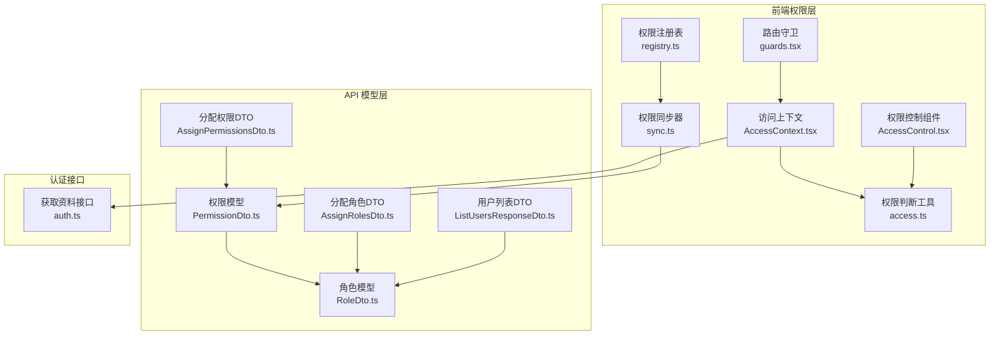
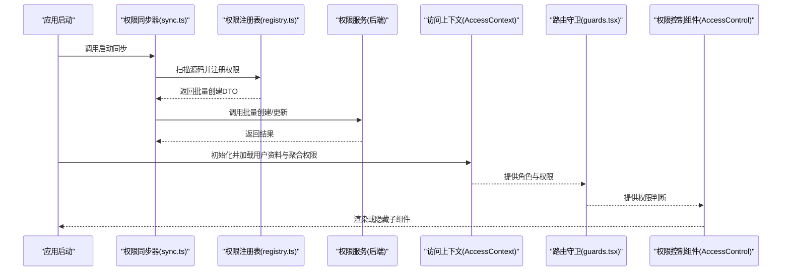
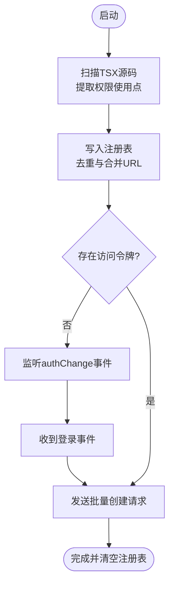
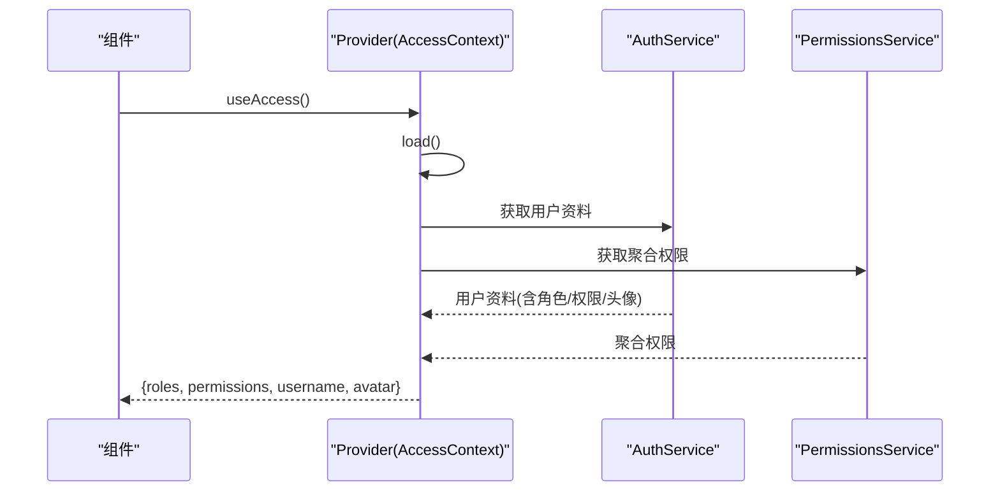
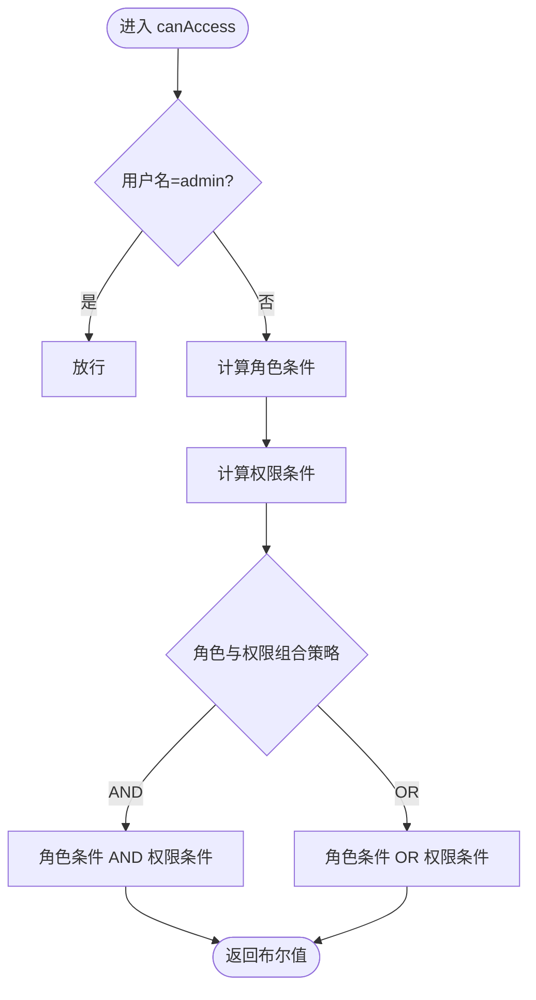
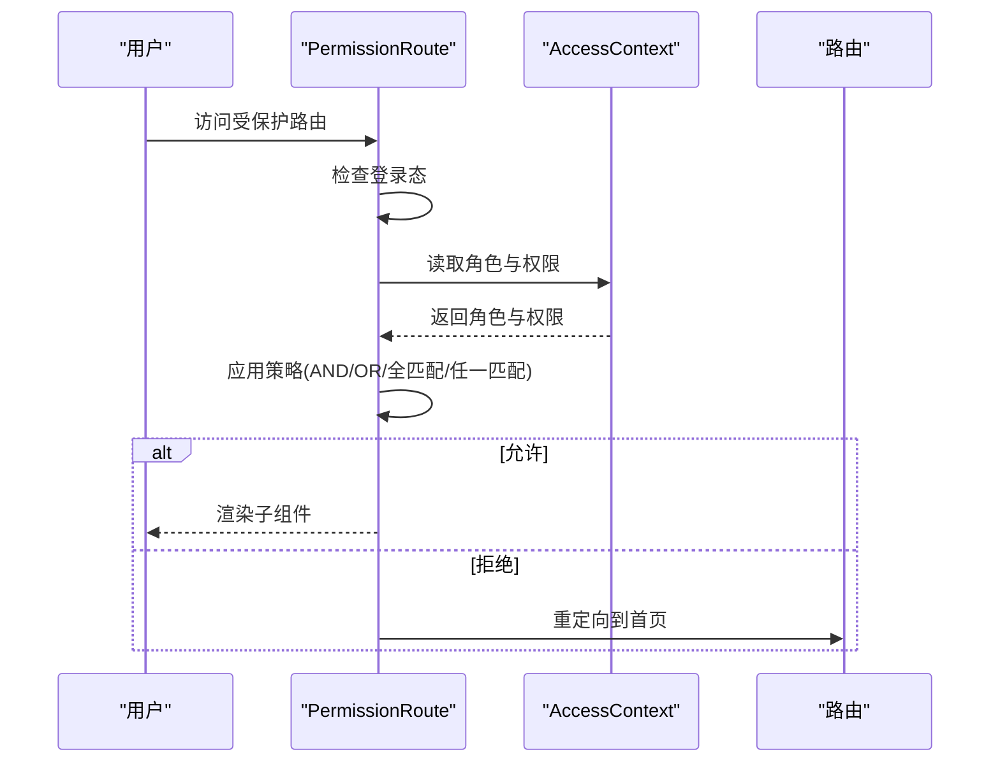
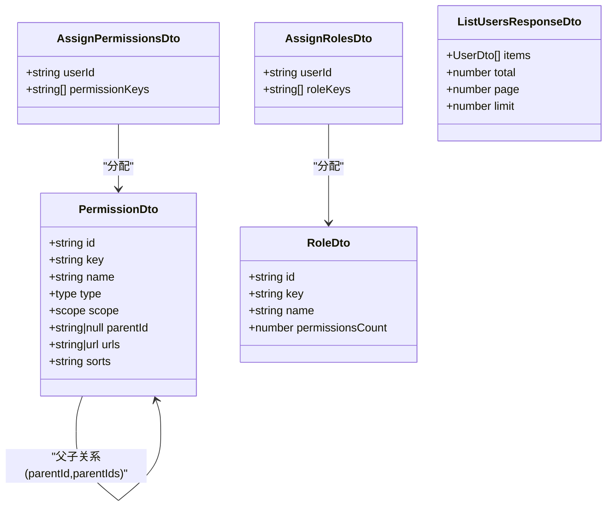
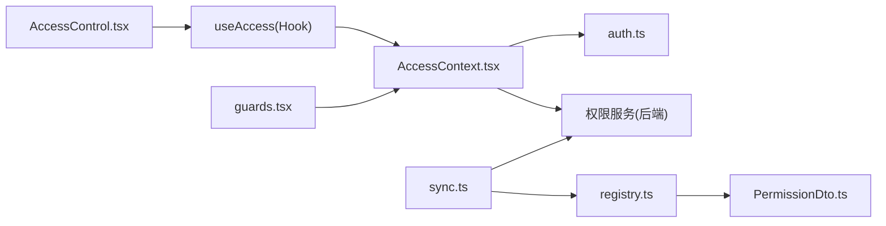

# 用户与安全管理

<cite>
**本文引用的文件**
- [src/permissions/AccessControl.tsx](file://src/permissions/AccessControl.tsx)
- [src/permissions/registry.ts](file://src/permissions/registry.ts)
- [src/permissions/sync.ts](file://src/permissions/sync.ts)
- [src/context/AccessContext.tsx](file://src/context/AccessContext.tsx)
- [src/utils/access.ts](file://src/utils/access.ts)
- [src/routes/guards.tsx](file://src/routes/guards.tsx)
- [src/api/custom/auth.ts](file://src/api/custom/auth.ts)
- [src/api/models/AssignPermissionsDto.ts](file://src/api/models/AssignPermissionsDto.ts)
- [src/api/models/AssignRolesDto.ts](file://src/api/models/AssignRolesDto.ts)
- [src/api/models/RoleDto.ts](file://src/api/models/RoleDto.ts)
- [src/api/models/PermissionDto.ts](file://src/api/models/PermissionDto.ts)
- [src/api/models/ListUsersResponseDto.ts](file://src/api/models/ListUsersResponseDto.ts)
</cite>

## 目录
1. [简介](#简介)
2. [项目结构](#项目结构)
3. [核心组件](#核心组件)
4. [架构总览](#架构总览)
5. [详细组件分析](#详细组件分析)
6. [依赖分析](#依赖分析)
7. [性能考虑](#性能考虑)
8. [故障排查指南](#故障排查指南)
9. [结论](#结论)
10. [附录](#附录)

## 简介
本文件面向“用户与安全管理”主题，系统性梳理 zTorrent 站点在前端侧的权限控制、角色管理、权限同步与安全防护能力。重点覆盖以下方面：
- 用户权限分配与角色管理
- 权限继承与树形结构（基于后端模型）
- 动态权限配置与前端权限同步
- 安全审计与日志（含路由守卫与权限控制组件的日志输出）
- 用户行为监控与异常检测（概念性建议）
- 风险控制策略与安全加固方案（概念性建议）

## 项目结构
围绕用户与安全管理的关键文件分布如下：
- 权限注册与同步：src/permissions/registry.ts、src/permissions/sync.ts
- 权限控制组件：src/permissions/AccessControl.tsx
- 访问上下文与权限聚合：src/context/AccessContext.tsx
- 权限判断工具：src/utils/access.ts
- 路由守卫：src/routes/guards.tsx
- 自定义认证接口：src/api/custom/auth.ts
- 权限与角色模型：src/api/models/PermissionDto.ts、src/api/models/RoleDto.ts、src/api/models/AssignPermissionsDto.ts、src/api/models/AssignRolesDto.ts、src/api/models/ListUsersResponseDto.ts

图表来源
- [src/permissions/registry.ts](file://src/permissions/registry.ts#L1-L129)
- [src/permissions/sync.ts](file://src/permissions/sync.ts#L1-L159)
- [src/permissions/AccessControl.tsx](file://src/permissions/AccessControl.tsx#L1-L43)
- [src/routes/guards.tsx](file://src/routes/guards.tsx#L1-L103)
- [src/context/AccessContext.tsx](file://src/context/AccessContext.tsx#L1-L181)
- [src/utils/access.ts](file://src/utils/access.ts#L1-L65)
- [src/api/custom/auth.ts](file://src/api/custom/auth.ts#L1-L14)
- [src/api/models/PermissionDto.ts](file://src/api/models/PermissionDto.ts#L1-L85)
- [src/api/models/RoleDto.ts](file://src/api/models/RoleDto.ts#L1-L36)
- [src/api/models/AssignPermissionsDto.ts](file://src/api/models/AssignPermissionsDto.ts#L1-L16)
- [src/api/models/AssignRolesDto.ts](file://src/api/models/AssignRolesDto.ts#L1-L16)
- [src/api/models/ListUsersResponseDto.ts](file://src/api/models/ListUsersResponseDto.ts#L1-L13)

章节来源
- [src/permissions/registry.ts](file://src/permissions/registry.ts#L1-L129)
- [src/permissions/sync.ts](file://src/permissions/sync.ts#L1-L159)
- [src/permissions/AccessControl.tsx](file://src/permissions/AccessControl.tsx#L1-L43)
- [src/context/AccessContext.tsx](file://src/context/AccessContext.tsx#L1-L181)
- [src/utils/access.ts](file://src/utils/access.ts#L1-L65)
- [src/routes/guards.tsx](file://src/routes/guards.tsx#L1-L103)
- [src/api/custom/auth.ts](file://src/api/custom/auth.ts#L1-L14)
- [src/api/models/PermissionDto.ts](file://src/api/models/PermissionDto.ts#L1-L85)
- [src/api/models/RoleDto.ts](file://src/api/models/RoleDto.ts#L1-L36)
- [src/api/models/AssignPermissionsDto.ts](file://src/api/models/AssignPermissionsDto.ts#L1-L16)
- [src/api/models/AssignRolesDto.ts](file://src/api/models/AssignRolesDto.ts#L1-L16)
- [src/api/models/ListUsersResponseDto.ts](file://src/api/models/ListUsersResponseDto.ts#L1-L13)

## 核心组件
- 权限注册表与批量创建：registry.ts 提供页面与按钮级权限键的注册、去重与导出为批量创建 DTO 的能力，支撑权限同步流程。
- 权限同步器：sync.ts 在应用启动时扫描源码中的权限使用点，生成批量创建请求并提交至后端，同时处理未登录场景下的事件监听与延迟同步。
- 访问上下文：AccessContext.tsx 负责拉取用户资料与聚合权限，并在登录态变化时自动刷新；提供 useAccess Hook 供任意组件消费。
- 权限判断工具：utils/access.ts 提供 canAccess 方法，支持角色与权限的“与/或”组合、组内“全匹配/任一匹配”，并内置管理员放行逻辑。
- 权限控制组件：AccessControl.tsx 基于 useAccess 与 canAccess 实现对子组件的条件渲染，支持 fallback。
- 路由守卫：guards.tsx 提供 AuthRoute 与 PermissionRoute，前者保障登录态，后者结合 AccessContext 实现基于角色与权限的页面级访问控制。

章节来源
- [src/permissions/registry.ts](file://src/permissions/registry.ts#L1-L129)
- [src/permissions/sync.ts](file://src/permissions/sync.ts#L1-L159)
- [src/context/AccessContext.tsx](file://src/context/AccessContext.tsx#L1-L181)
- [src/utils/access.ts](file://src/utils/access.ts#L1-L65)
- [src/permissions/AccessControl.tsx](file://src/permissions/AccessControl.tsx#L1-L43)
- [src/routes/guards.tsx](file://src/routes/guards.tsx#L1-L103)

## 架构总览
下图展示从前端权限采集、同步到运行时权限控制的整体流程：

图表来源
- [src/permissions/sync.ts](file://src/permissions/sync.ts#L17-L64)
- [src/permissions/registry.ts](file://src/permissions/registry.ts#L89-L101)
- [src/context/AccessContext.tsx](file://src/context/AccessContext.tsx#L83-L155)
- [src/routes/guards.tsx](file://src/routes/guards.tsx#L20-L102)
- [src/permissions/AccessControl.tsx](file://src/permissions/AccessControl.tsx#L17-L42)

## 详细组件分析

### 权限注册与同步（registry.ts 与 sync.ts）
- 注册机制：支持页面与按钮两类权限键的注册，自动去重并合并多处出现的路由路径，形成统一的批量创建输入。
- 扫描策略：启动时通过 Vite 的 import.meta.glob 读取项目内 TSX 源码，使用正则匹配三类使用点：PermissionRoute、AccessControl、canAccess 调用，抽取 requiredPermissions 并记录位置信息。
- 批量创建：将注册表转换为 BatchCreatePermissionsDto 并调用后端接口；若未登录，监听 authChange 事件后重试。
- 去重与清理：注册表使用 Map 去重，最终在同步完成后清空，避免重复触发。

图表来源
- [src/permissions/sync.ts](file://src/permissions/sync.ts#L74-L115)
- [src/permissions/registry.ts](file://src/permissions/registry.ts#L27-L101)

章节来源
- [src/permissions/registry.ts](file://src/permissions/registry.ts#L1-L129)
- [src/permissions/sync.ts](file://src/permissions/sync.ts#L1-L159)

### 访问上下文与权限聚合（AccessContext.tsx）
- 数据来源：并行请求用户资料与聚合权限，优先使用聚合接口返回的权限，若不可用则回退到资料接口中的权限。
- 用户名解析：当资料接口不可用时，从本地 accessToken 的 JWT payload 中解析用户名，仅用于界面显示。
- 生命周期：组件挂载即加载；监听 authChange 事件以响应登录/登出；提供 reload 方法手动刷新。
- 输出形态：roles、permissions、username、avatar 等字段，供其他组件消费。

图表来源
- [src/context/AccessContext.tsx](file://src/context/AccessContext.tsx#L83-L155)

章节来源
- [src/context/AccessContext.tsx](file://src/context/AccessContext.tsx#L1-L181)

### 权限判断与控制（utils/access.ts 与 AccessControl.tsx）
- 权限判断：支持 requiredPermissions 与 requiredRoles 的“与/或”组合、组内“全匹配/任一匹配”，并内置管理员用户名放行。
- 控件渲染：AccessControl 基于 canAccess 判断是否渲染 children，否则渲染 fallback；在加载中返回空占位，避免闪烁。

图表来源
- [src/utils/access.ts](file://src/utils/access.ts#L16-L63)
- [src/permissions/AccessControl.tsx](file://src/permissions/AccessControl.tsx#L17-L42)

章节来源
- [src/utils/access.ts](file://src/utils/access.ts#L1-L65)
- [src/permissions/AccessControl.tsx](file://src/permissions/AccessControl.tsx#L1-L43)

### 路由级权限控制（guards.tsx）
- 登录态守卫：AuthRoute 仅允许已登录用户访问受保护区域。
- 权限守卫：PermissionRoute 在登录态满足前提下，结合 AccessContext 的角色与权限进行判定；支持“OR”组合策略；admin 用户直接放行；不满足时重定向首页。
- 日志输出：在权限检查与放行/拒绝时打印调试日志，便于定位问题。

图表来源
- [src/routes/guards.tsx](file://src/routes/guards.tsx#L20-L102)
- [src/context/AccessContext.tsx](file://src/context/AccessContext.tsx#L24-L35)

章节来源
- [src/routes/guards.tsx](file://src/routes/guards.tsx#L1-L103)
- [src/context/AccessContext.tsx](file://src/context/AccessContext.tsx#L1-L181)

### 权限与角色模型（API 模型）
- 权限模型（PermissionDto）：包含 key、name、type、scope、parentId、parentIds、sorts、urls 等字段，支持页面/按钮/API 以及 web/admin 作用域，支持父ID链与排序链，便于构建树形权限结构与动态路由映射。
- 角色模型（RoleDto）：包含 key、name、description、createdAt、updatedAt、permissionsCount 等字段，用于角色维度的权限聚合与管理。
- 分配模型：AssignPermissionsDto 与 AssignRolesDto 提供覆盖式分配用户权限与角色的接口入参格式。
- 用户列表：ListUsersResponseDto 支持分页列出用户，便于后台管理与审计。

图表来源
- [src/api/models/PermissionDto.ts](file://src/api/models/PermissionDto.ts#L5-L85)
- [src/api/models/RoleDto.ts](file://src/api/models/RoleDto.ts#L5-L36)
- [src/api/models/AssignPermissionsDto.ts](file://src/api/models/AssignPermissionsDto.ts#L5-L16)
- [src/api/models/AssignRolesDto.ts](file://src/api/models/AssignRolesDto.ts#L5-L16)
- [src/api/models/ListUsersResponseDto.ts](file://src/api/models/ListUsersResponseDto.ts#L5-L13)

章节来源
- [src/api/models/PermissionDto.ts](file://src/api/models/PermissionDto.ts#L1-L85)
- [src/api/models/RoleDto.ts](file://src/api/models/RoleDto.ts#L1-L36)
- [src/api/models/AssignPermissionsDto.ts](file://src/api/models/AssignPermissionsDto.ts#L1-L16)
- [src/api/models/AssignRolesDto.ts](file://src/api/models/AssignRolesDto.ts#L1-L16)
- [src/api/models/ListUsersResponseDto.ts](file://src/api/models/ListUsersResponseDto.ts#L1-L13)

## 依赖分析
- 组件耦合与协作
  - AccessControl 依赖 useAccess 与 canAccess，实现 UI 层的细粒度权限控制。
  - PermissionRoute 依赖 AccessContext，实现路由级权限控制。
  - AccessContext 依赖懒加载的 AuthService 与 PermissionsService，负责权限数据聚合。
  - sync.ts 依赖 registry.ts 与权限服务，负责权限的前端采集与后端同步。
- 外部依赖与集成点
  - 本地存储：localStorage 用于保存访问令牌，驱动登录态与权限加载。
  - 自定义认证接口：auth.ts 提供获取用户资料的便捷封装。
  - 事件系统：window.addEventListener("authChange") 用于登录态变更后的刷新。

图表来源
- [src/permissions/AccessControl.tsx](file://src/permissions/AccessControl.tsx#L1-L43)
- [src/context/AccessContext.tsx](file://src/context/AccessContext.tsx#L1-L181)
- [src/routes/guards.tsx](file://src/routes/guards.tsx#L1-L103)
- [src/api/custom/auth.ts](file://src/api/custom/auth.ts#L1-L14)
- [src/permissions/sync.ts](file://src/permissions/sync.ts#L1-L159)
- [src/permissions/registry.ts](file://src/permissions/registry.ts#L1-L129)
- [src/api/models/PermissionDto.ts](file://src/api/models/PermissionDto.ts#L1-L85)

章节来源
- [src/permissions/AccessControl.tsx](file://src/permissions/AccessControl.tsx#L1-L43)
- [src/context/AccessContext.tsx](file://src/context/AccessContext.tsx#L1-L181)
- [src/routes/guards.tsx](file://src/routes/guards.tsx#L1-L103)
- [src/api/custom/auth.ts](file://src/api/custom/auth.ts#L1-L14)
- [src/permissions/sync.ts](file://src/permissions/sync.ts#L1-L159)
- [src/permissions/registry.ts](file://src/permissions/registry.ts#L1-L129)
- [src/api/models/PermissionDto.ts](file://src/api/models/PermissionDto.ts#L1-L85)

## 性能考虑
- 并发加载：AccessContext 对用户资料与聚合权限采用 Promise.allSettled 并行请求，缩短首屏等待时间。
- 懒加载服务：通过懒加载 AuthService 与 PermissionsService，降低初始包体积与循环依赖风险。
- 权限同步时机：在未登录时延迟同步，避免无效请求；成功后清空注册表，防止重复触发。
- UI 渲染优化：AccessControl 在加载中返回空占位，避免闪烁；PermissionRoute 在加载中显示占位文案。

## 故障排查指南
- 权限同步失败
  - 现象：控制台出现“批量创建接口调用失败”警告。
  - 排查：确认网络连通性、后端权限服务可用性；检查 toBatchDto 导出的权限项是否为空；确认已登录且 accessToken 存在。
  - 参考
    - [src/permissions/sync.ts](file://src/permissions/sync.ts#L43-L64)
- 权限不生效或显示异常
  - 现象：按钮/页面未按预期显示或隐藏。
  - 排查：核对 requiredPermissions 与 requiredRoles 的拼写；确认 matchAll 与 combine 策略是否符合预期；检查 AccessContext 是否正确加载权限。
  - 参考
    - [src/permissions/AccessControl.tsx](file://src/permissions/AccessControl.tsx#L17-L42)
    - [src/utils/access.ts](file://src/utils/access.ts#L16-L63)
- 路由无法访问或被重定向
  - 现象：访问受保护路由被重定向到首页。
  - 排查：确认登录态；检查 PermissionRoute 的 requiredPermissions 与 requiredRoles；查看控制台日志中的权限检查结果。
  - 参考
    - [src/routes/guards.tsx](file://src/routes/guards.tsx#L20-L102)
- 用户资料加载失败
  - 现象：头像为空或用户名解析失败。
  - 排查：后端资料接口异常时，系统会尝试从 JWT token 解析用户名；检查 token 格式与 payload 字段。
  - 参考
    - [src/context/AccessContext.tsx](file://src/context/AccessContext.tsx#L8-L21)
    - [src/context/AccessContext.tsx](file://src/context/AccessContext.tsx#L116-L134)

章节来源
- [src/permissions/sync.ts](file://src/permissions/sync.ts#L43-L64)
- [src/permissions/AccessControl.tsx](file://src/permissions/AccessControl.tsx#L17-L42)
- [src/utils/access.ts](file://src/utils/access.ts#L16-L63)
- [src/routes/guards.tsx](file://src/routes/guards.tsx#L20-L102)
- [src/context/AccessContext.tsx](file://src/context/AccessContext.tsx#L8-L21)
- [src/context/AccessContext.tsx](file://src/context/AccessContext.tsx#L116-L134)

## 结论
本项目在前端侧构建了完善的权限采集、同步与运行时控制闭环：通过 registry/sync 完成权限的自动化采集与后端同步；通过 AccessContext 聚合用户角色与权限；通过 AccessControl 与 PermissionRoute 实现 UI 与路由级的细粒度控制。配合后端提供的树形权限模型与角色模型，能够支撑复杂的权限继承、动态配置与安全审计需求。建议在后续迭代中补充后台管理界面与审计日志，完善惩罚记录与封禁管理的可视化与可追溯性。

## 附录
- 权限设计原则（建议）
  - 最小权限：仅授予完成任务所必需的最小权限集合。
  - 权限分离：将高危操作拆分为多个低权限步骤，避免集中风险。
  - 可审计：所有权限变更与关键操作均应记录在案，便于追踪。
- 安全加固方案（建议）
  - 强制二次验证：对敏感操作增加二次确认或验证码。
  - 行为监控：对异常登录、频繁失败、批量操作等行为进行监控与告警。
  - 会话安全：设置合理的过期策略与自动登出机制，结合自动登出工具使用。
  - 权限树校验：定期比对权限树与实际业务，清理冗余与过期权限。